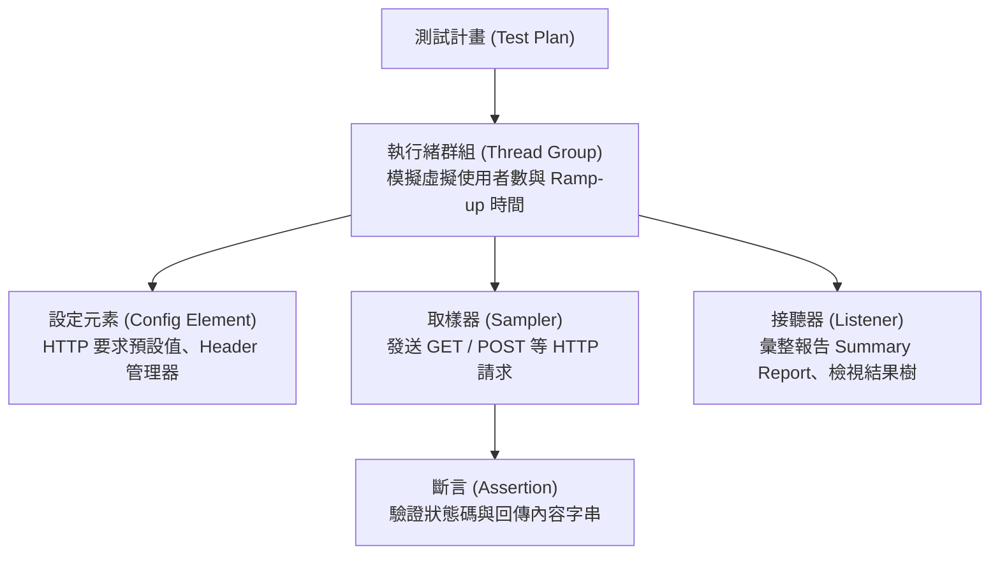

# 實習補充：Apache JMeter 壓力測試實務

> 🎯 **實習目標**：
> 1. 掌握經典 GUI 壓測工具 **Apache JMeter** 的核心元件（執行緒群組、HTTP 取樣器、斷言驗證、彙整報告）。
> 2. 實作模擬多使用者並發存取情境，並觀察系統之平均回應時間與錯誤率。
> 3. 使用 JMeter 內建 HTTP 代理伺服器進行操作行為側錄 (Record & Replay)。

---

## 1. JMeter 核心架構與元件

JMeter 透過以下核心元件組合出壓力測試腳本：

* **執行緒群組 (Thread Group)**：設定虛擬使用者 (Users) 數量、上線時間 (Ramp-Up Period) 與迴圈次數 (Loop Count)。
* **HTTP 要求取樣器 (HTTP Request Sampler)**：模擬瀏覽器發送 Web 請求。
* **斷言 (Assertion)**：驗證回傳的 HTTP 狀態碼或 HTML 內容中是否包含特定字串。
* **彙整報告 (Summary Report)**：統計平均耗時 (Average)、最小/最大耗時與錯誤率 (Error %)。

---

## 2. 實戰演練：建立第一個 JMeter 測試計畫

### 步驟 1：建立執行緒群組 (Thread Group)
1. 在「測試計畫 (Test Plan)」上按右鍵 ➔ **新增 (Add)** ➔ **Threads (Users)** ➔ **執行緒群組 (Thread Group)**。
2. 設定屬性：
   * **執行緒數量 (Number of Threads)**：`10`（模擬 10 位使用者）。
   * **啟動時間 (Ramp-Up Period)**：`2`（2 秒內讓 10 人全數上線）。
   * **迴圈次數 (Loop Count)**：`5`。

### 步驟 2：新增 HTTP 要求預設值與取樣器
1. 在執行緒群組按右鍵 ➔ **新增** ➔ **設定元素 (Config Element)** ➔ **HTTP 要求預設值 (HTTP Request Defaults)**：
   * 伺服器名稱或 IP：`localhost`
   * 通訊埠號：`8080`
2. 在執行緒群組按右鍵 ➔ **新增** ➔ **取樣 (Sampler)** ➔ **HTTP 要求 (HTTP Request)**：
   * 方法：`GET`
   * 路徑：`/api/v1/products`

### 步驟 3：加入資料驗證 (Response Assertion)
1. 在 HTTP 要求下方按右鍵 ➔ **新增** ➔ **斷言 (Assertions)** ➔ **回應斷言 (Response Assertion)**。
2. 在「測試欄位」勾選 **文字回應 (Response Text)**，在「要測試的樣式」點擊新增，輸入預期出現的字串（如 `200` 或業務關鍵字）。

### 步驟 4：執行並檢視彙整報告 (Summary Report)
1. 在執行緒群組按右鍵 ➔ **新增** ➔ **接聽 (Listener)** ➔ **彙整報告 (Summary Report)** 與 **檢視結果樹 (View Results Tree)**。
2. 點擊頂部綠色播放鍵 ▶️ 執行測試。
3. 觀察報告中的 **Samples（總請求數）、Average（平均回應時間 ms）、Error %（錯誤率）與 Throughput（每秒吞吐量 RPS）**。

---

## 3. 使用 JMeter 代理伺服器進行操作側錄 (Record & Replay)

1. 在測試計畫的「工作台」或非測試元素 ➔ **新增** ➔ **非測試元素 (Non-Test Elements)** ➔ **HTTP 代理伺服器 (HTTP Test Script Recorder)**。
2. 設定 Port（例如 `8090`），目標控制器選擇已建立的「錄製控制器 (Recording Controller)」。
3. 將作業系統或瀏覽器（如 Firefox）之 Proxy 設定為 `localhost:8090`，並匯入 JMeter 產生的根憑證 `ApacheJMeterTemporaryRootCA.crt`。
4. 點擊 **Start** 啟動代理，隨後在瀏覽器上操作業務流程，所有 HTTP 請求將自動被錄製為 JMeter 測試腳本！

---

## 📋 驗收標準
1. [ ] 成功使用 JMeter 建立包含 50 個 Thread 的壓測腳本並產出 Summary Report。
2. [ ] 腳本中包含至少一組 Response Assertion 斷言。
3. [ ] 記錄並分析不同負載下的回應時間曲線與飽和點。
