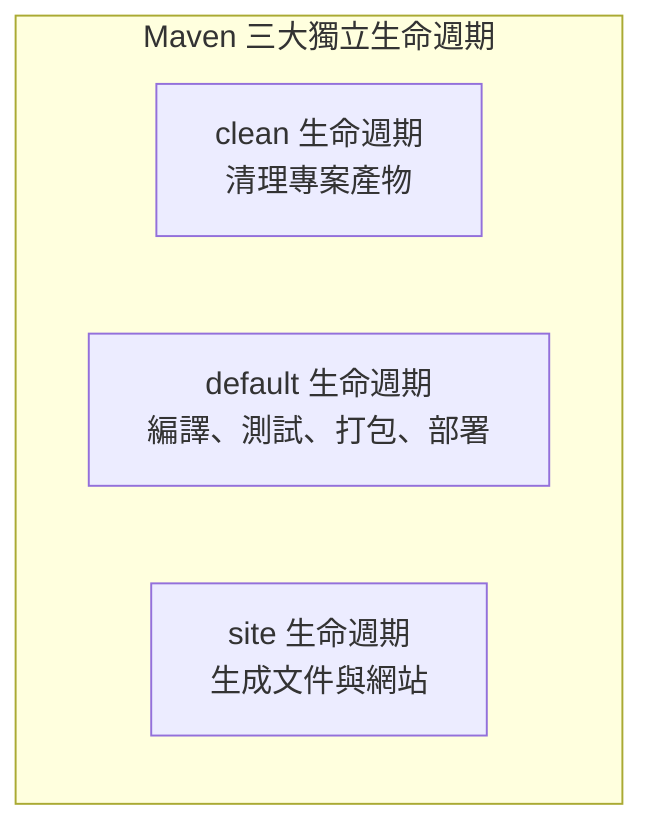
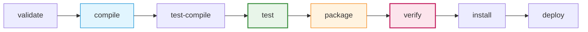

# Maven 與 `pom.xml` 完整指南：生命週期、依賴管理與 SQA 實務

## 1. 什麼是 Maven？核心設計哲學

**Apache Maven** 是一個廣泛應用於 Java 生態系的專案管理與自動化構建工具。它解決了過去軟體專案常遇到的痛點：
- 手動下載 JAR 檔容易遺漏或發生版本衝突（JAR Hell）。
- 每個人的目錄架構不同，在 A 電腦能跑、在 B 電腦不能編譯。
- 編譯、測試、打包、產出覆蓋率報告等繁瑣流程難以自動化。

Maven 引入了兩大核心設計哲學：
1. **約定優於配置（Convention over Configuration）**：
   Maven 規定了標準的專案目錄結構。只要遵守此架構，無需繁瑣設定即可自動編譯與測試：
   * `src/main/java`：主程式原始碼
   * `src/main/resources`：主程式設定檔與資源（如 log4j2.xml、資料庫設定）
   * `src/test/java`：測試程式原始碼（如 JUnit 5 測試類別）
   * `src/test/resources`：測試專用設定檔與 Mock 資料
   * `target/`：構建輸出目錄（編譯產物 `.class`、打包出的 `.jar`、測試報告）
2. **聲明式管理（Declarative Specification）**：
   透過單一的 **`pom.xml`**（Project Object Model），開發者只需聲明「專案是什麼、需要什麼依賴、要執行哪些外掛」，由 Maven 負責調度執行。

---

## 2. Maven 生命週期（Build Lifecycle）深度解析

Maven 構建的精髓在於 **生命週期（Lifecycle）**。生命週期定義了專案構建時依序執行的步驟清單，每個步驟稱為一個 **階段（Phase）**。

Maven 內建了 **三大互不相干、彼此獨立的生命週期**：



### 2.1 Default 生命週期（核心構建流程）

這是開發與 SQA 最常接觸的生命週期，負責將原始碼轉變為可部署的軟體。它由 20 多個階段組成，核心關鍵階段如下（依序執行）：



| 階段 (Phase) | 職責說明 | SQA / 開發對應動作 |
| :--- | :--- | :--- |
| **`validate`** | 驗證專案是否正確，所有必要資訊是否齊備 | 檢查 `pom.xml` 語法與目錄完整性 |
| **`compile`** | 編譯專案的主原始碼 (`src/main/java`) | 產出主類別檔案至 `target/classes` |
| **`test-compile`** | 編譯測試原始碼 (`src/test/java`) | 產出測試類別檔案至 `target/test-classes` |
| **`test`** | **執行單元測試**（如 JUnit 5） | 自動執行所有單元測試，若有測試失敗則終止構建 |
| **`package`** | 將編譯後的程式碼打包成可發行格式（如 JAR、WAR） | 產出 `target/LabDemo-1.0-SNAPSHOT.jar` |
| **`verify`** | **驗證與品質檢查**（執行整合測試、靜態分析） | 產出 JaCoCo 覆蓋率報告、變異測試、檢查品質門檻 |
| **`install`** | 將打包好的檔案安裝到本機倉庫 (`~/.m2/repository`) | 供本機電腦上的其他 Maven 專案直接引用 |
| **`deploy`** | 將最終成品部署發布至團隊遠端倉庫（如 Nexus / Artifactory） | 供團隊成員或生產環境下載 |

> [!IMPORTANT]
> **生命週期的累積性（Phase Accumulation）**：
> 當你呼叫某個 Phase 時，Maven 會**從該生命週期的第一個 Phase 開始，依序執行直到你指定的那個 Phase 為止**。
> * 輸入 `mvn test`：會自動依序執行 `validate` $\rightarrow$ `compile` $\rightarrow$ `test-compile` $\rightarrow$ `test`。
> * 輸入 `mvn package`：會自動依序執行編譯與測試，**測試通過後才會進行打包**！

---

### 2.2 Clean 生命週期（清理環境）

負責在重新構建前清除上一次構建留下的產物，避免快取或殘留檔案造成靈異 Bug。
* 包含階段：`pre-clean` $\rightarrow$ **`clean`** $\rightarrow$ `post-clean`
* **`mvn clean`**：直接刪除整個 `target/` 目錄。
* **黃金搭配**：`mvn clean compile` 或 `mvn clean test`（先乾淨清除再重新編譯/測試）。

---

### 2.3 Site 生命週期（生成報告）

負責為專案生成 HTML 說明文件、Javadoc 與外掛報表。
* 包含階段：`pre-site` $\rightarrow$ **`site`** $\rightarrow$ `post-site` $\rightarrow$ `site-deploy`
* **`mvn site`**：產出專案靜態網頁報表（存於 `target/site/index.html`）。

---

### 2.4 階段 (Phase) 與 外掛目標 (Plugin Goal) 的關係

生命週期的「階段 (Phase)」只是抽象的概念框架，**本身不做任何事**。真正執行具體動作的是 **外掛程式的目標（Plugin Goal）**。

Maven 將不同的 Plugin Goal「綁定（Bind）」到特定的 Phase：

```
生命週期階段 (Phase)               綁定的外掛與目標 (Plugin:Goal)
--------------------               --------------------------------
compile              <--- 綁定 --- maven-compiler-plugin:compile
test                 <--- 綁定 --- maven-surefire-plugin:test
package              <--- 綁定 --- maven-jar-plugin:jar
verify               <--- 綁定 --- jacoco-maven-plugin:report
```

這意味著：你可以自由透過 `pom.xml`，將 SQA 測試工具（如 JaCoCo 覆蓋率、SpotBugs 靜態分析、Pitest 變異測試）綁定到 `test` 或 `verify` 階段，實現全自動化品質檢查！

---

## 3. `pom.xml` 核心結構詳解

以本課程實習專案 [LabDemo/pom.xml](../../pom.xml) 為例：

### 3.1 專案座標 (GAV)
每個 Maven 專案在世界上都有唯一的「座標（Coordinate）」，由三元素組成：

```xml
<groupId>org.example</groupId>       <!-- 組織/組織反向域名 -->
<artifactId>LabDemo</artifactId>     <!-- 專案唯一識別名稱 -->
<version>1.0-SNAPSHOT</version>      <!-- 版本號（SNAPSHOT 代表開發中快照） -->
```

### 3.2 屬性設定 (`<properties>`)
集中宣告版本號與全域參數，方便日後統一升級：
```xml
<properties>
    <maven.compiler.source>21</maven.compiler.source> <!-- 原始碼語法版本 (Java 21) -->
    <maven.compiler.target>21</maven.compiler.target> <!-- 編譯目標位元組碼版本 -->
    <project.build.sourceEncoding>UTF-8</project.build.sourceEncoding>
    <junit.jupiter.version>5.11.0</junit.jupiter.version>
</properties>
```

> [!NOTE]
> **Q：若設定為 21，使用 Java 23 的新語法會無法編譯嗎？**  
> **是的，會直接編譯失敗！**
> * **`source`（語法限制）**：即便本機安裝 JDK 23，只要寫了 Java 23 專屬語法，`javac` 就會報錯拒絕編譯。
> * **`target`（位元組碼限制）**：確保產出的 `.class` 檔能在 Java 21 JRE 正常運行，避免執行期錯誤。
> * **最佳實踐**：後續章節外掛中改用 `<release>21</release>`，可同時嚴格鎖定語法、位元組碼與 Java 21 標準 API。

### 3.3 依賴管理與依賴範圍 (`<dependencies>` & `<scope>`)

依賴範圍（Scope）決定了該程式庫何時會被放入 Classpath：

```xml
<dependencies>
    <!-- 1. compile 範圍（預設）：主程式、測試、執行階段皆需要 -->
    <dependency>
        <groupId>org.apache.commons</groupId>
        <artifactId>commons-lang3</artifactId>
        <version>3.18.0</version>
    </dependency>

    <!-- 2. test 範圍：只在編譯測試程式 (src/test) 與執行測試時引入，不會打包進正式 JAR -->
    <dependency>
        <groupId>org.junit.jupiter</groupId>
        <artifactId>junit-jupiter</artifactId>
        <version>${junit.jupiter.version}</version>
        <scope>test</scope>
    </dependency>
</dependencies>
```

| Scope | 編譯主程式 (`src/main`) | 編譯測試 (`src/test`) | 執行測試 (`mvn test`) | 打包發行 (`package`) | 常見範例 |
| :--- | :---: | :---: | :---: | :---: | :--- |
| **`compile`**（預設） | ✅ | ✅ | ✅ | ✅ | `commons-lang3`, `jackson` |
| **`test`** | ❌ | ✅ | ✅ | ❌ | `junit-jupiter`, `mockito` |
| **`provided`** | ✅ | ✅ | ✅ | ❌ (執行環境已提供) | `lombok`, `servlet-api` |
| **`runtime`** | ❌ | ❌ | ✅ | ✅ | JDBC Driver 實作 |

---

### 3.4 外掛配置 (`<build><plugins>`)：SQA 必備外掛

在軟體品質保證實務中，我們透過外掛來驅動編譯、單元測試、程式碼覆蓋率與變異測試：

#### (1) 編譯外掛 (`maven-compiler-plugin`)
```xml
<plugin>
    <groupId>org.apache.maven.plugins</groupId>
    <artifactId>maven-compiler-plugin</artifactId>
    <version>3.13.0</version>
    <configuration>
        <release>21</release>
    </configuration>
</plugin>
```

#### (2) 測試外掛 (`maven-surefire-plugin`)
負責在 `mvn test` 階段搜尋並執行所有 `*Test.java` 單元測試：
```xml
<plugin>
    <groupId>org.apache.maven.plugins</groupId>
    <artifactId>maven-surefire-plugin</artifactId>
    <version>3.3.1</version>
</plugin>
```

#### (3) 程式碼覆蓋率外掛 (`jacoco-maven-plugin`)
綁定至 `test` 或 `verify` 階段，執行測試時自動記錄覆蓋行數與分支，產出視覺化 HTML 報告：
```xml
<plugin>
    <groupId>org.jacoco</groupId>
    <artifactId>jacoco-maven-plugin</artifactId>
    <version>0.8.12</version>
    <executions>
        <execution>
            <goals>
                <goal>prepare-agent</goal> <!-- 注入追蹤探針 -->
                <goal>report</goal>        <!-- 測試完成後產出報告 -->
            </goals>
        </execution>
    </executions>
</plugin>
```

---

## 4. 常用 Maven 指令速查表

在專案目錄（含有 `pom.xml` 的資料夾）開啟終端機執行：

| 需求 | 指令 | 說明 |
| :--- | :--- | :--- |
| **乾淨編譯** | `mvn clean compile` | 清除舊檔案並重新編譯主程式 |
| **執行所有測試** | `mvn test` | 自動編譯並執行全專案的單元測試 |
| **單獨跑某個測試類別** | `mvn test -Dtest=BubbleSortTest` | 只跑指定測試類別，省下等待時間 |
| **跑單一測試方法** | `mvn test -Dtest=BubbleSortTest#testSort` | 只跑該類別中的特定測試方法 |
| **打包專案** | `mvn package` | 執行測試通過後打包成 JAR |
| **跳過測試直接打包** | `mvn package -DskipTests` | 編譯測試但不執行測試直接打包（緊急修復時使用） |
| **查看依賴樹與衝突** | `mvn dependency:tree` | 分析第三方套件相依關係，抓出版本衝突與重複引用 |
| **產出 JaCoCo 覆蓋率** | `mvn test jacoco:report` | 報告將產出於 `target/site/jacoco/index.html` |

---

## 5. Maven 與 SQA（軟體品質保證）的關聯

在現代軟體工程與 CI/CD（持續整合與持續部署）管道中，Maven 扮演了「品質守門員」的角色：

1. **自動化回歸測試**：每一次開發者提交程式碼，CI 伺服器（如 GitHub Actions、GitLab CI）只需執行 `mvn test`，即可確保修改沒有破壞既有功能。
2. **客觀量化品質指標**：透過 `jacoco-maven-plugin` 與 `pitest-maven`，團隊可以精確掌握「陳述句覆蓋率（Statement Coverage）」、「分支覆蓋率（Branch Coverage）」與「變異擊殺率（Mutation Score）」。
3. **品質門檻中斷（Build Breaker）**：可設定規則「若測試失敗或覆蓋率低於 80%，Maven 構建失敗禁止合併」，防患於未然。

---

## 課堂互動與概念檢核

<!-- id: sqa-u01-maven-ccq1 -->
#### 🙋 **概念核對問答 (CCQ 1)：Maven 生命週期執行順序**


**問題**

工程師在終端機輸入 `mvn package` 指令試圖將專案打包成 JAR 檔。依據 Maven 預設的建置生命週期（Default Lifecycle），下列敘述何者正確？

A) Maven 會直接將程式碼打包成 JAR，不會編譯也不會執行單元測試  
B) Maven 會依序執行 `compile` ➔ `test-compile` ➔ `test`，只有在所有單元測試皆通過（綠燈）的情況下，才會進入 `package` 打包產出 JAR  
C) `package` 階段會在 `test` 階段之前執行，以確保打包失敗時不會浪費時間跑測試  
D) 只有手動執行 `mvn test` 才會跑測試，`mvn package` 預設完全跳過測試  

<details>
<summary>點擊查看【概念核對問答】答案與解析</summary>

**正確答案：B**

* **解析**：
  * **選項 B 正確**：Maven 的生命週期具有相依遞進特性，呼叫特定階段時，Maven 會自動依序執行其前面所有的階段。因此執行 `mvn package` 一定會先執行主程式編譯（`compile`）、測試編譯（`test-compile`）與單元測試（`test`）；若有任何測試失敗，Maven 會立即中斷構建（Build Failure），阻止產生包含缺陷的 JAR 檔。
  * **選項 A/C/D 錯誤**：皆違背 Maven 生命週期的前置順序與品質把關機制。

</details>

---

[課堂互動](https://nlhsueh.github.io/nickedupocket/#/student/sqa-u01-maven-ccq1)

<!-- id: sqa-u01-maven-ccq2 -->
#### 🙋 **概念核對問答 (CCQ 2)：依賴範圍（Scope）與發行環境安全**


**問題**

在 `pom.xml` 中引入單元測試框架（如 JUnit 5）或模擬物件庫（如 Mockito）時，若工程師漏寫了 `<scope>test</scope>`，導致其採用預設的 `<scope>compile</scope>`。從軟體品質與維運安全的角度來看，這會造成何種不良影響？

A) 專案完全無法編譯，Maven 會回傳語法錯誤  
B) 測試程式碼無法引用 JUnit 的 `@Test` 註解  
C) 測試用程式庫會被打包進正式生產環境（Production）的發行 JAR 檔中，徒增成品體積並擴大潛在資安攻擊面  
D) CI 伺服器在執行 `mvn test` 時會找不到測試類別  

<details>
<summary>點擊查看【概念核對問答】答案與解析</summary>

**正確答案：C**

* **解析**：
  * **選項 C 正確**：`compile` 是 Maven 的預設範圍，意味著主程式編譯、測試與最終打包發行皆包含此套件。測試專用的程式庫（如 JUnit、Mockito、AssertJ）僅供研發階段檢驗品質使用，若誤打包進生產環境，除了膨脹部署包大小，還可能因測試工具內部開放的反射或偵錯通道引入非預期的安全漏洞。
  * **選項 A/B/D 錯誤**：`compile` 範圍在編譯與測試時皆能正常運作，因此功能上不會報錯，但違反了最小權限與乾淨依賴原則。

</details>

---

[課堂互動](https://nlhsueh.github.io/nickedupocket/#/student/sqa-u01-maven-ccq2)

<!-- id: sqa-u01-maven-ccq3 -->
#### 🙋 **概念核對問答 (CCQ 3)：跳過測試指令的品質風險**


**問題**

在緊急部署修復時，某工程師在 CI/CD 管道中使用 `mvn package -DskipTests` 來加速構建與發布。關於此行為在軟體品質保證 (SQA) 中的評述，何者最為精準？

A) 這是業界推薦的最佳實務，因為生產環境只需要可執行檔，不需要測試程式碼  
B) `-DskipTests` 會編譯測試程式但跳過執行，這代表人為繞過了自動化回歸測試防線，可能將未察覺的回歸缺陷（Regression Bug）直接推上線  
C) `-DskipTests` 會自動將測試報告全部標記為 100% 通過，並產出完美的 JaCoCo 覆蓋率報告  
D) `-DskipTests` 會強制刪除所有測試原始碼以節省雲端伺服器磁碟空間  

<details>
<summary>點擊查看【概念核對問答】答案與解析</summary>

**正確答案：B**

* **解析**：
  * **選項 B 正確**：`-DskipTests` 雖然能節省測試執行時間，但它直接關閉了最關鍵的「自動化驗證防護網」。在 SQA 體系中，未經測試通過的發行物具有極高風險，除非經過嚴格授權且有替代性驗證，否則在正式 CI/CD 流程中嚴禁預設跳過測試。
  * **選項 A 錯誤**：此舉屬高風險捷徑，非推薦實務。
  * **選項 C/D 錯誤**：跳過測試不會產出執行報告，亦不會刪除程式碼。

</details>

---

[課堂互動](https://nlhsueh.github.io/nickedupocket/#/student/sqa-u01-maven-ccq3)

<!-- id: sqa-u01-maven-ccq4 -->
#### 🙋 **概念核對問答 (CCQ 4)：JaCoCo 覆蓋率外掛與品質守門員（Build Breaker）**


**問題**

團隊希望落實品質把關機制：「若單元測試的程式碼涵蓋率（Code Coverage）未達到 80%，Maven 構建必須直接中斷失敗（Build Failure），並拒絕程式碼合併到 `main` 分支」。請問這項覆蓋率門檻檢核應該綁定在 Maven 生命週期的哪一個階段最合適？

A) `clean`（清除階段）  
B) `compile`（主程式編譯階段）  
C) `verify`（驗證階段，於 `test` 之後執行）  
D) `deploy`（遠端倉庫部署階段）  

<details>
<summary>點擊查看【概念核對問答】答案與解析</summary>

**正確答案：C**

* **解析**：
  * **選項 C 正確**：程式碼涵蓋率必須等單元測試（`test`）全數執行完畢、收集到執行探針數據後才能計算與判定。Maven 的 `verify` 階段專門用於執行整合測試與品質檢查，透過 `jacoco-maven-plugin` 的 `check` goal 綁定至 `verify`，一旦未達標便觸發 Build Breaker 中斷流程。
  * **選項 A/B 錯誤**：此時單元測試根本尚未執行，無法獲得覆蓋率數據。
  * **選項 D 錯誤**：`deploy` 是最後發布階段，此時才檢查為時已晚。

</details>

[課堂互動](https://nlhsueh.github.io/nickedupocket/#/student/sqa-u01-maven-ccq4)
