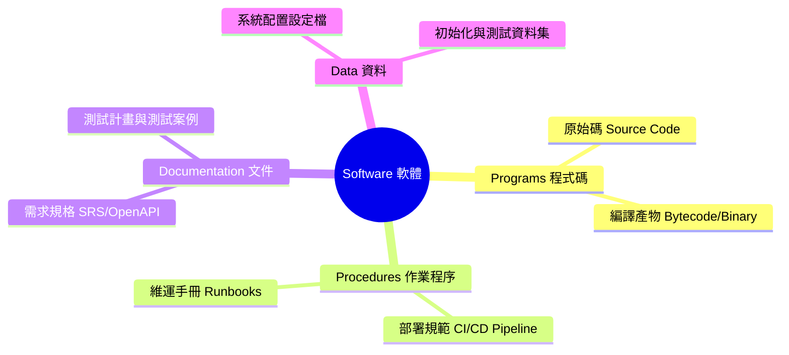
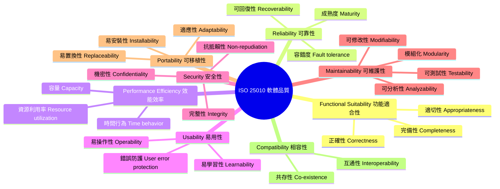

# Ch01 軟體危機、品質模型與 AI 時代的可靠性工程
### Chapter 01: The Software Crisis, Quality Models, and AI-Era Reliability Engineering

> 😅 大家都知道「物質不滅定律」；身為資工系學生，我們更熟悉「Bug 不滅定律」。
> 
> 在 2026 年，寫出一段程式碼只要問 AI 3 秒鐘；但要證明這段程式碼在生產環境不會搞垮公司，可能要花上 3 個月。

---

## ⚡ 0. 開局震撼：AI 寫的「完美」程式碼，為什麼會在 3 秒內讓公司破產？

在進入理論之前，讓我們先看一段由現代頂級 AI（GPT-4 / Claude 3.5）生成的「銀行電子錢包轉帳服務」：

```java
public class WalletService {
    private double balance = 1000.0; // 帳戶初始餘額 $1000

    // AI 生成的轉帳方法：具備基本檢查與扣款邏輯
    public boolean transfer(double amount) {
        if (amount <= 0) {
            return false;
        }
        if (balance >= amount) {
            // 模擬網路延遲或資料庫查詢
            try { Thread.sleep(10); } catch (InterruptedException e) {}
            
            balance -= amount;
            return true;
        }
        return false;
    }

    public double getBalance() {
        return balance;
    }
}
```

### 🧪 現場破壞實驗 (Live Attack Experiment)
這段程式碼看起來排版整齊、邏輯清晰，一般的單元測試 `assert transfer(100) == true` 也是綠燈通過。

**但是，當我們用 50 個執行緒同時發送「轉帳 $100」的請求時：**

```java
// 50 個使用者同時並發轉帳 $100（總提款需求 $5000，但帳戶只有 $1000）
ExecutorService executor = Executors.newFixedThreadPool(50);
for (int i = 0; i < 50; i++) {
    executor.submit(() -> walletService.transfer(100.0));
}
executor.shutdown();
executor.awaitTermination(5, TimeUnit.SECONDS);

System.out.println("最終餘額：" + walletService.getBalance());
```

**執行結果：**
$$\text{最終餘額：} -3200.0 \quad \text{（帳戶原本只有 \$1000，居然被提走了 \$4200，嚴重超賣負債！）}$$

> 💥 **震撼反思**：
> 1. **AI 不會主動為你考慮並發安全性與狀態不變量（Invariants）**：AI 只根據常見的程式片段生成了順序執行代碼，缺乏對執行緒安全（Thread-safety）的原子性保護。
> 2. **AI 產生的測試往往也是「自我印證的假綠燈」**：如果你叫 AI 幫這段代碼寫測試，AI 只會寫單執行緒測試，測試 100% 覆蓋率通過，讓你帶著虛假的安全感將炸彈推上線。
> 3. **2026 資工系工程師的真正使命**：
>    * 寫程式碼（Coding）已經不是稀缺技能；
>    * **「定義規格與不變量」、「設計破壞性測試」、「建立自動化品質防線」才是人類工程師不可替代的核心價值！**

---

## 1.1 軟體危機的歷史與 AI 時代的輪迴

軟體既能造福人類，亦能造成毀滅性災難。回顧歷史，軟體缺陷曾引發嚴重的空難、軍事傷亡與數億美元的太空浩劫。

### Case 1：愛國者反導彈事件 (1991) —— 毫秒級的精度累積誤差

在 1991 年 2 月波斯灣戰爭中，一枚伊拉克發射的飛毛腿飛彈擊中美軍沙烏地達蘭基地，造成 **28 名美軍死亡、100 多人受傷**。


* **致命軟體缺陷**：愛國者系統時鐘暫存器採用 **24-bit 浮點數** 設計，將時間轉換為 0.1 秒單位時產生了微小的截斷誤差（約 $0.000000095$ 秒）。
* **災難放大**：雷達系統連續開機運作超過 **100 小時** 未重啟，微小的精度誤差累計達 **0.33 秒**。
* **致命後果**：飛毛腿飛彈速度達 4.2 馬赫（1.5 km/s），0.33 秒相當於 **600 公尺距離偏差**。雷達搜尋窗無法鎖定目標，攔截飛彈根本沒有發射。
* **SQA 啟示**：數值精度問題、浮點數累計誤差，以及**長時運行可靠度測試（Long-term Stress/Reliability Testing）**的重要性。

---

### Case 2：NASA 火星氣候軌道探測器 (1998) —— 單位的代價

1998 年 NASA 發射「火星氣候軌道探測器」（Mars Climate Orbiter，造價近 2 億美元），抵達火星後失聯焚毀。


👉 Mars Climate Orbiter crash in 1998

* **致命軟體缺陷**：兩個合作研發團隊使用了不同的度量單位：
  * 洛克希德馬丁（承包商）：**英制單位**（磅力·秒，$\text{lbf}\cdot\text{s}$）
  * NASA 噴射推進實驗室 (JPL)：**公制單位**（牛頓·秒，$\text{N}\cdot\text{s}$）
* **災難後果**：地面控制軟體未做單位轉換直接計算推力，導致探測器軌道高度從預計的 140 公里降至 **57 公里**，直接在火星大氣層中摩擦解體焚毀。
* **SQA 啟示**：**跨模組介面契約（Interface Contract）**、型態安全與規格檢視的重要性。

---

### Case 3：華航名古屋空難 (1994) —— 人機爭奪控制權

1994 年 4 月 26 日，華航 CI140 班機（空中巴士 A300-622R）在名古屋機場降落時墜毀，**264 人罹難**。


* **致命軟體缺陷**：副駕駛進場時誤觸「重飛（Go-Around）」模式；駕駛員隨後試圖手動強壓機首下降，但機載飛控電腦因處於自動重飛模式，強行將水平安定面向上配平以抬高機首。
* **災難後果**：**電腦與機師互相爭奪控制權**，飛機仰角過大失速墜毀。空巴隨後發出維修指令，全面修改飛控軟體邏輯。
* **SQA 啟示**：人機互動（HMI/UX）狀態透明度、異常操作回饋與自動化控制權限優先級設計。

---

### Case 4：迪士尼《獅子王》遊戲 (1994) —— 缺乏相容性測試的公關浩劫

1994 年聖誕節迪士尼推出《獅子王》PC 遊戲，伴隨 Compaq 等家用電腦熱銷，數以萬計家庭期待同樂。
* **致命缺陷**：遊戲基於特定視訊驅動（WinG）開發，**未在市場主流多樣硬體環境上進行充分相容性測試**。
* **災難後果**：大量家用電腦開機即藍屏崩潰，聖誕節當天客服被憤怒家長打爆，嚴重損害品牌聲譽。
* **SQA 啟示**：環境多樣性驗證與**相容性測試（Compatibility Testing）**，促使微軟後來開發標準化 DirectX 架構。

---

### 1.1.5 軟體危機的本質：從 1968 到 2026

* 1968 年 NATO 會議首次提出「軟體危機（Software Crisis）」：硬體飛速發展，而軟體開發卻面臨**預算超支、進度延期、品質低下、維護困難**。
* **2026 年新軟體危機（The Verification Bottleneck）**：
  * AI 讓寫代碼的速度提升了 10 倍，產出的程式碼量呈幾何級數暴增。
  * 然而，人類驗證代碼、審查規格與確保系統可靠性的能力並沒有自動提升 10 倍！
  * **軟體危機沒有消失，它只是轉變為「可信賴度危機（Reliability Crisis）」**。

> 😂 **軟體和教堂非常相似——建成之後我們就開始祈禱。**
> >> *Software and cathedrals are much the same – first we build them, then we pray.* (Sam Redwine)

#### **隨堂測驗 (CCQ 1)**

**問題**

愛國者反導彈系統（1991）在達蘭基地攔截失效的根本軟體原因為何？

A) 通訊網路中斷導致雷達無法傳送指令給飛彈發射架  
B) 24-bit 時鐘暫存器的浮點捨入誤差在連續運行 100 小時後累加達 0.33 秒  
C) 程式碼發生記憶體洩漏（Memory Leak）導致作業系統當機  
D) 雷達演算法誤將美軍戰機辨識為敵方飛毛腿飛彈  

<details>
<summary>點擊查看【隨堂測驗】答案與解析</summary>

**正確答案：B**

* **解析**：
  * 愛國者系統採用 24-bit 浮點數記錄時間，每小時有微小的截斷誤差。連開 100 小時累積了 0.33 秒延遲，對 4.2 馬赫的飛彈造成約 600 公尺偏差，導致雷達搜尋窗無法鎖定飛彈。

</details>

---

## 1.2 什麼是軟體？軟體的四大組成要素

軟體是什麼？僅僅是可執行的二進位檔案或原始程式碼嗎？IEEE（Standard 610.12）給出了更廣泛的定義：

> **Software (軟體)**:
> Computer **programs** (程式), **procedures** (程序), and possibly associated **documentation** (文件) and **data** (資料) pertaining to the operation of a computer system.



* **程式必須是為了給人看而寫，命令機器執行只是附帶任務。**
  >> *Programs must be written for people to read, and only incidentally for machines to execute.* (Abelson / Sussman)

#### **隨堂測驗 (CCQ 2)**

**問題**

根據 IEEE 對於「軟體 (Software)」的定義與現代軟體工程概念，下列何者不屬於軟體的完整範疇？

A) 團隊維護的 OpenAPI / Swagger 介面合約規格書  
B) 部署於 Kubernetes 叢集中的環境變數設定檔與初始資料庫 Migration 腳本  
C) 伺服器機房所使用的實體散熱風扇與不斷電電源硬體設備 (UPS)  
D) 團隊定義的 Git PR 審查程序與自動化 CI 測試腳本  

<details>
<summary>點擊查看【隨堂測驗】答案與解析</summary>

**正確答案：C**

* **解析**：
  * **選項 C 正確**：實體風扇與不斷電電源屬於硬體基礎設施（Hardware），不屬於軟體的四要素（Programs, Procedures, Documentation, Data）。

</details>

---

## 1.3 何謂品質？David Garvin 的五大品質觀點

哈佛商學院教授 David Garvin 在《Managing Quality》一書中指出，不同人對品質有不同的視角，軟體品質亦然：

| 品質觀點 | 核心定義 | 軟體工程實例 | 忽略該觀點的後果 |
| :--- | :--- | :--- | :--- |
| **超自然觀點**<br>(Transcendental) | 無法精確量化，但一體驗就能感受到其精緻與美感 | 極致流暢的 UI/UX、細膩的動畫微互動 | 軟體感覺粗製濫造、冰冷難用 |
| **使用者觀點**<br>(User View) | 符合使用者真實需求與期望 (Fitness for Use) | 解決使用者痛點、操作直覺易上手 | 功能很強但沒人想用 (Shelfware) |
| **製造觀點**<br>(Manufacturing View) | 符合工程規格與標準流程 (Conformance) | 遵循 Clean Code 規範、零規格偏離、通過 ISO 認證 | 規格本身有漏洞時，做出一套完美的垃圾 |
| **產品觀點**<br>(Product View) | 產品本身的內在技術特性與架構材質 | 高內聚低耦合、強固的型態系統、低圈複雜度 | 架構腐化，改一個小功能引發全面崩潰 |
| **價值觀點**<br>(Value-based View) | 顧客願意支付的成本與性價比 (ROI) | 軟體帶來的商業價值大於開發與維運成本 | 開發成本失控超支，商業上不可行 |

> 👍 **所謂的品質就是當沒有人看時，仍然把事情做對。** —— *Henry Ford*
> 👍 **品質不是動作，是一種習慣。** —— *Aristotle*

#### **隨堂測驗 (CCQ 3)**

**問題**

某專案團隊開發的電商 App 完全符合合約規格書上的每一條需求（製造觀點合格），但因為底層架構高度耦合且完全沒有寫單元測試，半年後客戶想新增一個促銷功能時，工程團隊發現必須重寫整個系統。這代表該軟體在 Garvin 的哪一個品質觀點上嚴重不及格？

A) 產品觀點 (Product View)  
B) 製造觀點 (Manufacturing View)  
C) 法律合約觀點  
D) 超自然觀點 (Transcendental View)  

<details>
<summary>點擊查看【隨堂測驗】答案與解析</summary>

**正確答案：A**

* **解析**：
  * **選項 A 正確**：產品觀點著重於軟體內在結構特性（如模組化、架構整潔、可維護性與可測試性）。雖然符合製造觀點的合約規格，但內在架構腐敗。

</details>

---

## 1.4 軟體品質工程核心概念：V&V 與品質成本

### 1.4.1 驗證與確認 (Verification vs. Validation, V&V)

軟體測試與品質保證的靈魂大問：

$$\begin{aligned}
\textbf{Verification (驗證)} &: \text{Are we building the product \textbf{right}? （我們是否有正確地建造軟體？）} \\
\textbf{Validation (確認)} &: \text{Are we building the \textbf{right} product? （我們建造的是否是正確的軟體？）}
\end{aligned}$$

* **Verification (驗證)**：確保軟體產出物符合上個階段設定的規格（檢視程式碼是否符合設計圖、單元測試是否符合規格）。
* **Validation (確認)**：確保軟體真正滿足使用者的真實業務需求（驗收測試、易用性測試、現場 Beta 測試）。

---

### 1.4.2 軟體品質成本 (Cost of Quality, CoQ) 與 1:10:100 定律

```
                       ┌── 預防成本 (Prevention): 培訓、流程標準、架構審查、契約設計
        ┌─ 一致性成本 ──┤
        │  (Conformance)└── 評估成本 (Appraisal): 單元測試、代碼檢視、自動化 CI 測試
品質成本 ┤
        │  (Non-       ┌── 內部失敗 (Internal Failure): 上線前修 Bug、重構程式碼
        └─ 非一致性成本 ──┤
           conformance)└── 外部失敗 (External Failure): 生產環境當機、客戶賠償、商譽損害
```

* **1:10:100 定律 (The Rule of Tens)**：
  * **需求/設計階段** 抓出並修復一個 Bug 的成本：**$1**
  * **開發/測試階段** 抓出並修復一個 Bug 的成本：**$10**
  * **產品上線發布後** 發生故障的修復與賠償代價：**$100 ～ $1000+**！
* **測試左移 (Shift-Left Testing)**：將品質活動儘早融入開發流程，是降低軟體總擁有成本的最有效手段。

---

## 1.5 現代軟體品質模型 (ISO 9126 $\rightarrow$ ISO 25010)

每一個產業都有各自的品質模型。對於軟體系統而言，國際標準組織制定了著名的品質模型體系：


👉 不同物品的品質特性各有不同

### 1.5.1 從 ISO 9126 到 ISO 25010 (SQuaRE)

早期 **ISO 9126** 定義了 6 大品質特性；現代 **ISO 25010 (SQuaRE, 軟體產品品質要求與評估標準)** 將其擴展為 **8 大產品品質特性 (Product Quality)** 與 **5 大使用品質 (Quality in Use)**：



---

### 1.5.2 🗺️ ISO 25010 品質特性與 16 週實戰測試技術地圖

軟體測試絕非盲目敲打程式碼，本課程所教授的每一項測試與工程技術，都是在為品質模型的特定維度建立自動化守護防線：

| ISO 25010 品質特性 | 核心子特性 (Sub-characteristics) | 本課程對應之測試與工程技術 |
| :--- | :--- | :--- |
| **功能適合性** (Functional Suitability) | 完備性、正確性、適切性 | 等價類分割 (EP)、邊界值分析 (BVA)、JUnit 5、BDD (Cucumber) |
| **可靠性** (Reliability) | 成熟度、容錯度 (Fault Tolerance)、可回復性 | 斷言 (Assertions)、**屬性測試 (jqwik Property-Based Testing)**、混沌工程 (Chaos) |
| **可維護性** (Maintainability) | 模組化、可分析性、可修改性、**可測試性** | 靜態程式碼分析 (SonarQube/SpotBugs)、**變異測試 (PITest)**、依賴解耦 |
| **安全性** (Security) | 機密性、完整性、抗抵賴性、真實性 | 靜態安全掃描 (AST/SAST)、**模糊測試 (Fuzzing with Jazzer)** |
| **效能效率** (Performance Efficiency) | 時間行為 (延遲/回應時間)、資源利用率 | **k6 / Apache JMeter 高併發壓測**、GC 監控與記憶體洩漏分析 |
| **相容性** (Compatibility) | 共存性、互通性 (Interoperability) | **微服務契約測試 (Pact)**、跨版本相容性測試 |
| **可移植性** (Portability) | 適應性、易安裝性、易置換性 | **Testcontainers 容器化測試**、雲原生多環境測試 |
| **易用性** (Usability) | 易識別性、易學習性、易操作性、錯誤保護 | **Playwright E2E 驗收測試**、使用者流程自動化驗證 |

---

## ✍️ 1.6 綜合練習與思維激盪

1. **AI 時代的品質反思**：
   * 當生成式 AI 可以在幾秒鐘內產生包含完整 Javadoc 的代碼時，為什麼軟體測試工程師的價值反而大幅提升？請從「Test Oracle 問題」與「自我印證偏誤」兩方面進行說明。
2. **ISO 25010 維度分析**：
   * 請分析「微服務系統在後端資料庫當機重啟後，能在 5 秒內自動重新連線並將失敗的訊息重試成功，完全不丟失任何交易」，這體現了 ISO 25010 中的哪些品質特性？
3. **愛國者飛彈與數值精度**：
   * 試寫一小段 Java 程式碼，連續將 `0.1` 累加 1,000,000 次，比較其結果與 `100000.0` 的差異。觀察浮點數在長時間累計下的偏差現象。