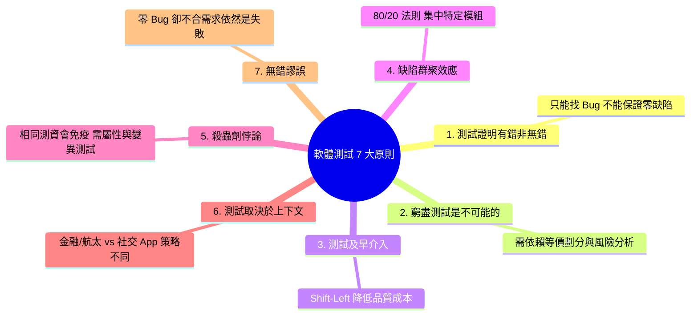

# Ch03 軟體測試原則、理論與架構模型
### Chapter 03: Testing Principles, Theories, and Architectural Models

> 江 Sir 皺著眉頭，一副憂心忡忡的說：「對不起，我們還不能驗收。」
> 
> 雄太睜大了眼睛。江 Sir 接著說：「我們前天還發現 Bug，這個系統可絕不能在正式上線時出錯啊！」
> 
> 「可是那是這星期以來唯一的錯誤，事實上，經過我們的內部單元測試與迴歸測試，交給你們後也沒發現幾個錯誤了。」
> 
> 「你敢保證現在系統完全沒有任何錯誤？」
> 
> 雄太猶豫了一下，拍著胸脯說：「我敢保證！現在系統絕對沒有任何錯誤了！」
> 
> 江 Sir 冷笑了一下說：「我倒是懂得一點軟體測試的根本原則——**軟體測試只能證明程式有錯，永遠無法證明程式絕對沒有錯誤！**」
> 
> 雄太一下子愣住了，傻傻地看著江 Sir...

---

## 3.1 ISTQB 軟體測試 7 大經典原則 (The 7 Principles of Testing)

國際軟體測試認證委員會（ISTQB）總結了軟體測試領域經過數十年血淚經驗凝結而成的 **7 大核心原則**：



---

### 原則 1：測試顯示缺陷的存在，而非不存在 (Testing shows presence of defects, not their absence)
* 測試只能證明軟體中**存在缺陷**，但無論你執行了幾萬筆測試且全部通過，都**無法證明軟體絕對零缺陷**。
* 測試的目的在於「降低未被發現缺陷的風險」，建立上線的信心，而非給予絕對完美的保證。

---

### 原則 2：窮盡測試是不可能的 (Exhaustive testing is impossible)
* 考慮一個極其簡單的計算方法：輸入 4 個 32-bit 整數。
  $$\text{所有可能輸入組合} = (2^{32})^4 = 2^{128} \approx 3.4 \times 10^{38} \text{ 種組合！}$$
  即使電腦每秒能執行 10 億次測試，也要花費超過 $10^{22}$ 年才能測完。
* **SQA 啟示**：窮盡測試在計算上是不可能的，因此我們必須學習**等價類分割 (EP)**、**邊界值分析 (BVA)**、**全成對測試 (Pairwise)** 與**基於風險的測試 (Risk-Based Testing)**。

---

### 原則 3：及早測試 / 測試左移 (Early Testing / Shift-Left)
* 靜態測試活動（需求審查、架構檢視）應在軟體生命週期最早期就開始。
* 依據 **1:10:100 品質成本定律**，在需求階段修正一個模糊描述只要 \$1，到了上線後修復代價高達 \$100+。

---

### 原則 4：缺陷群聚效應 (Defects cluster together)
* 軟體系統中的絕大多數缺陷，通常集中在少數幾個複雜度極高、頻繁變更或與外部高度耦合的模組中（**遵循 80/20 法則**）。
* 當在某模組發現大量 Bug 時，應提高警覺，對該模組進行更深度的覆蓋率與變異分析。

---

### 原則 5：小心殺蟲劑悖論 (Beware of the Pesticide Paradox)
* **農藥噴久了，害蟲會產生抗藥性；同一套測試跑久了，將無法再抓出新的 Bug！**
* 隨著開發者修正了舊錯誤，原本的固定測資將全部常態性綠燈。
* **SQA 2.0 解方**：
  * 定期審查並更新測試案例庫。
  * 導入 **屬性基礎測試 (Property-Based Testing)**：每次執行自動隨機生成 10,000 組全新測資。
  * 導入 **變異測試 (Mutation Testing)**：主動注入變異體檢驗測試套件的殺傷力。

---

### 原則 6：測試取決於上下文 (Testing is context dependent)
* 醫療設備、航太飛控系統（需嚴格遵守 DO-178C 標準、達成 MC/DC 100% 覆蓋率）與一般的電商網站或敏捷小專案，其測試策略、深度與工具完全不同。

---

### 原則 7：無錯謬誤 (Absence-of-errors is a fallacy)
* 即使系統經過高強度測試且沒有找到任何 Bug，但如果系統**根本沒有滿足使用者的真實業務需求**，或者介面極難操作，這套系統在商業與品質上依然是徹底失敗的。

#### **隨堂測驗 (CCQ 1)**

**問題**

某測試團隊使用固定的一套 500 個單元測試案例持續運行了 6 個月，近 3 個月來測試結果全部保持 100% 綠燈通過，但客戶在生產環境依然頻繁回報新的業務邏輯錯誤。這種現象最符合 ISTQB 哪一項測試原則的描述？

A) 測試顯示缺陷的存在，而非不存在  
B) 殺蟲劑悖論 (Pesticide Paradox)  
C) 窮盡測試是不可能的  
D) 測試無法直接改善品質  

<details>
<summary>點擊查看【隨堂測驗】答案與解析</summary>

**正確答案：B**

* **解析**：
  * **選項 B 正確**：殺蟲劑悖論指出，反覆使用完全相同的測試案例，系統會對這套測資產生「免疫力」，無法再挖掘出新引入的缺陷。必須透過屬性測試、探索性測試或定期更新測試案例來打破此盲區。

</details>

---

## 3.2 現代測試金字塔 (The Practical Test Pyramid)

在微服務與現代雲原生架構中，Martin Fowler 與 Mike Cohn 提出了著名的 **測試金字塔 (Test Pyramid)** 模型：

```
                    / \
                   / E2E \       <-- 端到端測試 (Playwright/Cypress/UI)
                  /------- \          成本最高、運行最慢 (分鐘級)、最容易脆化 (Brittle)
                 / Service  \    <-- 整合/API 測試 (Spring Boot Test/Pact/Testcontainers)
                / Integration\        中等速度、驗證模組間契約與資料庫
               /--------------\
              /   Unit Tests   \  <-- 單元測試 (JUnit 5/jqwik)
             /__________________\      數量最多、運行極快 (毫秒級)、成本最低、精準定位
```

### 3.2.1 測試反模式：冰淇淋甜筒 (The Ice-Cream Cone Anti-Pattern)

傳統團隊常常犯下嚴重的反模式：
* 底層單元測試極少（工程師不願寫或程式碼不可測）。
* 絕大多數測試依賴頂層的手動 UI 點擊或龐大笨重的 Selenium E2E 腳本。
* **致命惡果**：
  1. CI 構建時間從 2 分鐘暴增至 1 小時。
  2. 測試極度脆弱（Flaky/Brittle Tests），常因網路延遲或前端 CSS 調整而隨機紅燈。
  3. 當 E2E 報錯時，根本無法知道是哪一行底層代碼出問題。

> 📌 **黃金比例原則**：
> 70% 毫秒級單元測試 + 20% 容器化服務整合測試 + 10% 關鍵路徑 E2E 驗收測試。

---

## 3.3 V 開發模型與雙向追溯 (The V-Model)

V 模型將軟體開發生命週期中的「建造階段」與「驗證階段」建立起一對一的嚴密追溯矩陣：

```mermaid
graph TD
    subgraph 左側：分析與設計
        Req["需求分析 (SRS)"]
        Arch["高階架構設計 (ADD)"]
        Detail["詳細模組設計 (SDD)"]
        Code["程式碼實作 (Coding)"]
    end

    subgraph 右側：測試與確認
        Accept["驗收測試 (Acceptance Testing)"]
        SysTest["系統測試 (System Testing)"]
        IntTest["整合測試 (Integration Testing)"]
        UnitTest["單元測試 (Unit Testing)"]
    end

    Req --> Arch --> Detail --> Code
    Code -. 驗證 .-> UnitTest
    Detail -. 驗證 .-> IntTest
    Arch -. 驗證 .-> SysTest
    Req -. 確認 .-> Accept
```

* **測試計畫前置化**：
  * 在需求分析完成時，就必須同步產出《驗收/系統測試計畫》；
  * 在架構設計完成時，就必須產出《整合測試計畫》；
  * 避免在程式碼寫完後才倒過來寫測試（實作後測試偏差）。

#### **隨堂測驗 (CCQ 2)**

**問題**

在標準 V 開發模型中，依據「高階架構設計文件 (Architecture Design Document, ADD)」中定義的模組介面與通訊協定，所對應執行的測試層級為何？

A) 單元測試 (Unit Testing)  
B) 整合測試 (Integration Testing)  
C) 驗收測試 (Acceptance Testing)  
D) 靜態程式碼檢視 (Code Review)  

<details>
<summary>點擊查看【隨堂測驗】答案與解析</summary>

**正確答案：B**

* **解析**：
  * **選項 B 正確**：高階架構設計定義了子系統與模組間的 API 介面與資料傳遞協定，其直接對應的驗證層級為整合測試 (Integration Testing)。單元測試對應詳細設計 (SDD)，系統/驗收測試對應需求規格 (SRS)。

</details>

---

## 3.4 測試案例設計標準與 Test Oracle 難題

### 3.4.1 測試案例 (Test Case) 的現代標準結構

一個嚴謹、可被自動化重現的測試案例必須包含以下五大核心要素：

1. **唯一識別碼 (Test Case ID)**：例如 `TC_AUTH_001`。
2. **前置條件 (Preconditions)**：執行前系統必須滿足的狀態（例如：使用者已登入且帳戶餘額為 \$500）。
3. **測試輸入 (Test Inputs / Test Data)**：明確的輸入數值或操作動作。
4. **預期輸出 (Expected Result / Test Oracle)**：明確定義的預期回傳值、狀態改變或拋出的特定例外。
5. **後置條件與不變量 (Postconditions & Invariants)**：測試執行完畢後的系統清理與狀態驗證。

---

### 3.4.2 測試預言難題 (The Test Oracle Problem)

> **什麼是 Test Oracle？**
> 「Test Oracle（測試預言機）」是指**能夠判斷受測程式輸出是否正確的機制或參照標準**。

在傳統簡單演算法中，Test Oracle 很直接（例如 `add(1, 2)` 的 Oracle 就是 `3`）。
**但在現代複雜軟體與 AI 時代，Test Oracle 成為最艱鉅的挑戰：**
* *例如 1*：搜尋引擎演算法號稱能找出「網路上最相關的前 10 篇論文」，你如何客觀驗證它是對的？
* *例如 2*：高階 3D 渲染器、機器學習影像辨識模型，沒有簡單的數學查表可以當作預期輸出。

#### 💡 解決 Test Oracle 難題的現代工程方法：
1. **差分測試 (Differential Testing)**：將相同輸入同時餵給兩個不同實作（例如舊版系統 vs 新版重構系統、Oracle JDK vs OpenJDK），比較兩者輸出是否一致。
2. **變質測試 (Metamorphic Testing)**：利用領域的對稱性性質（例如 $\sin(x) = \sin(\pi - x)$，輸入旋轉 90 度後的圖片其辨識結果應該不變）。
3. **屬性基礎測試 (Property-Based Testing)**：不驗證單點數值，而是驗證**全域不變量 (Global Invariants)**！

---

## ✍️ 3.5 綜合練習

1. **測試原則反思**：
   * 試舉出一個生活中的實例，說明「為什麼窮盡測試是不可能的」以及「殺蟲劑效應」在日常工作中的體現。
2. **測試金字塔分析**：
   * 某公司每次發布新版本前，需要 5 位 QA 人員手動點擊瀏覽器 2 天才能完成測試，導致發布週期長達一個月。請為該公司繪製當前的「冰淇淋甜筒」問題架構，並提出重構為「現代測試金字塔」的改造步驟。
3. **Test Oracle 設計**：
   * 假設你要測試一個自製的複雜大數矩陣乘法器 `Matrix multiply(Matrix A, Matrix B)`，在無法手算巨大矩陣答案的情況下，你能設計出哪些 Test Oracle（數學性質/不變量）來驗證其正確性？