# Ch03 軟體測試原則、理論與架構模型
### Chapter 03: Testing Principles, Theories, and Architectural Models

> 江 Sir 皺著眉頭，一副憂心忡忡的說：「對不起，我們還不能驗收。」
> 
> 雄太睜大了眼睛。江 Sir 接著說：「我們前天還發現 Bug，這個系統可絕不能在正式上線時出錯啊！」
> 
> 「可是那是這星期以來唯一的錯誤，事實上，經過我們的內部單元測試與迴歸測試，交給你們後也沒發現幾個錯誤了。」
> 
> 「你敢保證現在系統完全沒有任何錯誤？」
> 
> 雄太猶豫了一下，拍著胸脯說：「我敢保證！現在系統絕對沒有任何錯誤了！」
> 
> 江 Sir 冷笑了一下說：「我倒是懂得一點軟體測試的根本原則——**軟體測試只能證明程式有錯，永遠無法證明程式絕對沒有錯誤！**」
> 
> 雄太一下子愣住了，傻傻地看著江 Sir...

---

## 3.1 軟體測試的核心原則

> 📚 **權威參考文獻與標準 (References & Standards)**：
> 1. **ISTQB CTFL v4.0**：[ISTQB Certified Tester Foundation Level Syllabus (2023)](https://www.istqb.org/certifications/certified-tester-foundation-level-ctfl-v4-0)
> 2. **Glenford J. Myers**：《The Art of Software Testing》（軟體測試的藝術經典）
> 3. **Martin Fowler**：[The Practical Test Pyramid (2018)](https://martinfowler.com/articles/practical-test-pyramid.html)
> 4. **IEEE 829 / ISO 29119**：Software and System Test Documentation Standard

國際軟體測試認證委員會（ISTQB）與軟體工程界總結了測試的經典核心原則：

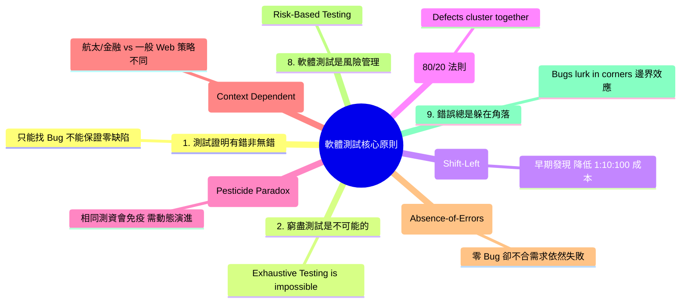

---

### 1. 窮盡測試是不可行的 (Exhaustive testing is not possible)


窮盡式的測試在計算上是不可能的。考慮以下極簡單的邏輯判斷：

```java
input A, B, X
if (A > 1) and (B == 0) then Y = A
if (A == 2) or (X > 1)  then Y = X
print Y 
```

此處僅 4 個條件就有 $2^4 = 16$ 種路徑組合。若系統有 100 個判斷式，組合數高達 $2^{100} \approx 1.27 \times 10^{30}$。放大來看，作業系統、瀏覽器、網路環境、資料庫狀態時時刻刻都在變化。因此測試只能**「挑著測（有效率的取樣）」**，依賴等價劃分與邊界分析。

---

### 2. 軟體測試是一種風險管理的工作 (Software testing is a risk-based exercise)

由於無法進行窮盡測試，測試無法「保證」系統絕對無錯，而是**提升對品質的信心並控制風險**：
* **高風險**（核心交易、資安、飛控）：全力預防與嚴格驗證。
* **中風險**（次要功能、報表）：設計測試案例減緩風險。
* **低風險**（畫面微小偏差）：記錄並容許線上監控處理。

---

### 3. 錯誤總是躲在角落，不易察覺 (Bugs lurk in corners)

考慮以下程式碼，第 2 行原本應為 `j = j + 1`，卻誤打成 `j = j - 1`：

```java
int scale (int j) {
   j = j - 1; // 正確應為 j = j + 1
   j = j / 3000;
   return j;
}
```

假設 $j$ 範圍為 $-32768 \sim 32767$，整數除法為無條件捨去：
* $j = 2999$：應為 1，結果為 0 （❌ 錯誤）
* $j = 3000$：應為 1，結果為 0 （❌ 錯誤）
* $j = 5999$：應為 2，結果為 1 （❌ 錯誤）
* $j = 6000$：應為 2，結果為 1 （❌ 錯誤）

依此類推，在全部 65,536 個數值中，**會發生錯誤的數值僅有 18 個**（其餘如 $j=1000$ 算出來都是 0，答案碰巧一致）。
$$\text{隨機踩中錯誤的機率} = \frac{18}{65536} \approx 0.00027 \quad (0.027\%)$$
這證明了：**盲目隨機測試很難抓到 Bug，錯誤總是躲在臨界點與角落，必須針對「邊界值」精準打擊！**

---

### 4. 並不是所有的錯誤都會被修復 (Not all bugs will be fixed)
* 盤根錯節的 Legacy Code 修復成本太高，且可能引入更大破壞。
* 發生機率極低且影響微小（例如僅在零下 50 度極地且特定配置下才會觸發的 UI 偏斜）。

---

### 5. 測試顯示缺陷的存在，而非不存在 (Testing shows presence of defects)
* 測試能抓出 Bug，但跑完所有測試全綠，**只能說尚未發現 Bug，絕不能宣稱系統絕對零缺陷**。

---

### 6. 漸進式測試與測試左移 (Incremental Testing & Early Testing)
* 不要等系統全部開發完才測試；做一點、測一點。
* 需求與設計階段即可透過審查進行「靜態測試」。

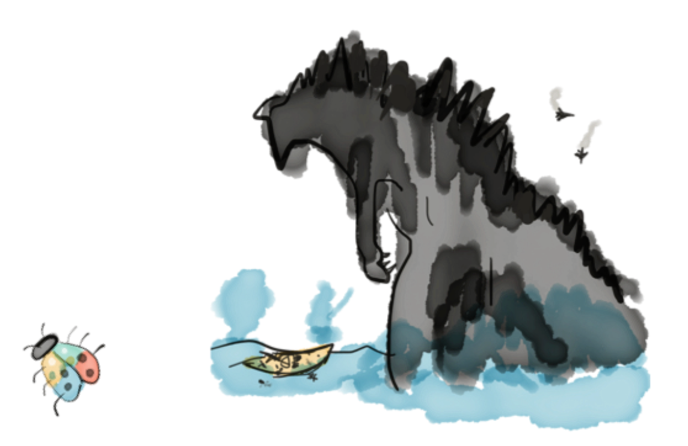

---

### 7. 殺蟲劑悖論 (Pesticide Paradox)
* 同一種農藥噴久了，害蟲會產生抗藥性；同一套測試案例跑久了，將無法再抓出新的 Bug。
* 測試案例必須定期審查、重構，並引入 **屬性基礎測試 (Property-Based Testing)** 與 **變異測試 (Mutation Testing)**。

---

### 8. 測試是情境相依的 (Testing is context dependent)
* 航太飛控系統（DO-178C 標準、MC/DC 覆蓋率）與社交 App 的測試策略大不相同。

---

### 9. 測試無法直接改善品質 (Testing alone can't improve quality)
* 光靠測試不改代碼，品質不會提升；軟體品質是「設計與建造出來的」，而非「測出來的」。

#### **隨堂測驗 (CCQ 1)**

**問題**

某測試團隊使用固定的一套 500 個單元測試案例持續運行了 6 個月，近 3 個月來測試結果全部保持 100% 綠燈通過，但客戶在生產環境依然頻繁回報新的業務邏輯錯誤。這種現象最符合 ISTQB 哪一項測試原則的描述？

A) 測試顯示缺陷的存在，而非不存在  
B) 殺蟲劑悖論 (Pesticide Paradox)  
C) 窮盡測試是不可能的  
D) 測試無法直接改善品質  

<details>
<summary>點擊查看【隨堂測驗】答案與解析</summary>

**正確答案：B**

* **解析**：
  * **選項 B 正確**：殺蟲劑悖論指出，反覆使用完全相同的測試案例，系統會對這套測資產生「免疫力」，無法再挖掘出新引入的缺陷。必須透過屬性測試、探索性測試或定期更新測試案例來打破此盲區。

</details>

---

## 3.2 測試的多維度分類體系

### 1. 驗證 (Verification) vs 確認 (Validation)

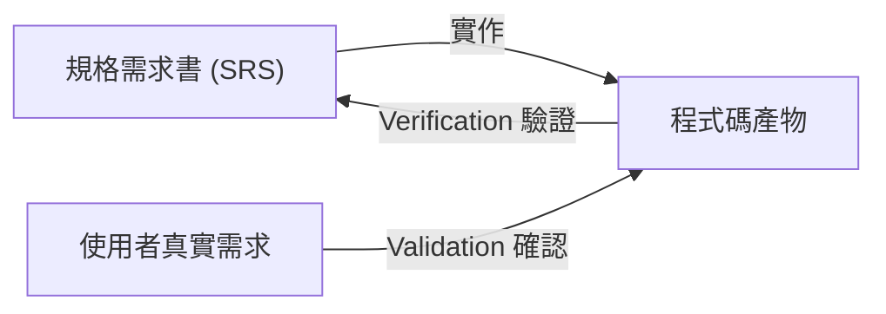

* **Verification**：*Are we building the product right?* 確保程式碼符合設計與規格。
* **Validation**：*Are we building the right product?* 確保軟體真正解決使用者痛點。

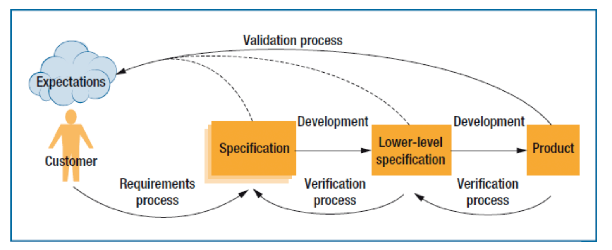

---

### 2. 缺失測試 (Defect Testing) vs 確認測試 (Validation Testing)
* **Defect Testing**：目的在於「找出缺陷、搞壞系統」，採極端與破壞性邊界輸入。
* **Validation Testing**：目的在於「向客戶證明系統符合功能需求」，循序漸進驗證 Happy Path。

---

### 3. 靜態測試 (Static) vs 動態測試 (Dynamic)
* **靜態測試**：不執行程式碼，透過人工 Review、AST 語法樹分析（SonarQube, SpotBugs）。
* **動態測試**：實際運行程式碼，給定輸入並比對輸出結果。

---

### 4. 功能測試（黑箱） vs 結構測試（白箱）

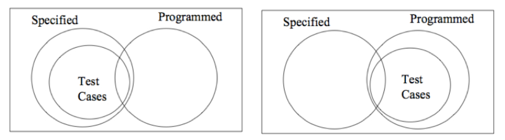

* **黑箱測試 (Black-box)**：依據需求規格設計測資，不看內部實作。
* **白箱測試 (White-box)**：依據程式內部邏輯分支、路徑設計測資。

---

### 5. 測試層級：單元、整合與系統測試


* **單元測試 (Unit Test)**：針對最小可測試單元（Class / Method）進行邏輯驗證。
* **整合測試 (Integration Test)**：驗證模組與模組、服務與資料庫之間的介面與協定。
* **系統測試 (System Test)**：在真實或模擬環境中進行端到端整體運作驗證。

#### 💡 單元模組的可測試性 (Testability)
模組設計應遵循「邏輯與 UI 分離」：

```java
// ❌ 不良設計：業務邏輯與 UI 輸入強耦合，無法自動化單元測試
double div(double x, double y) {
    while (y == 0) {
        y = input("除數不可為 0，請重新輸入："); // 依賴 UI
    }
    return x / y;
}

// ✅ 良好設計：純邏輯模組，拋出明確例外，極易進行 JUnit 自動化測試
double div(double x, double y) {
    if (y == 0) {
        throw new IllegalArgumentException("除數不得為 0");
    }
    return x / y;
}
```

---

### 6. 現代測試金字塔 (The Practical Test Pyramid)

```
                    / \
                   / E2E \       <-- 端到端測試 (Playwright/Cypress) 成本高、速度慢
                  /------- \
                 / Service  \    <-- 整合/契約測試 (Pact/Testcontainers)
                / Integration\
               /--------------\
              /   Unit Tests   \  <-- 單元測試 (JUnit 5/jqwik) 速度極快、數量最多
             /__________________\
```

* **反模式：冰淇淋甜筒 (Ice Cream Cone)**：缺乏單元測試，過度依賴脆弱且昂貴的 UI E2E 測試，導致 CI 構建緩慢且頻繁誤報。

---

## 3.3 V 開發模型與雙向追溯 (The V-Model)

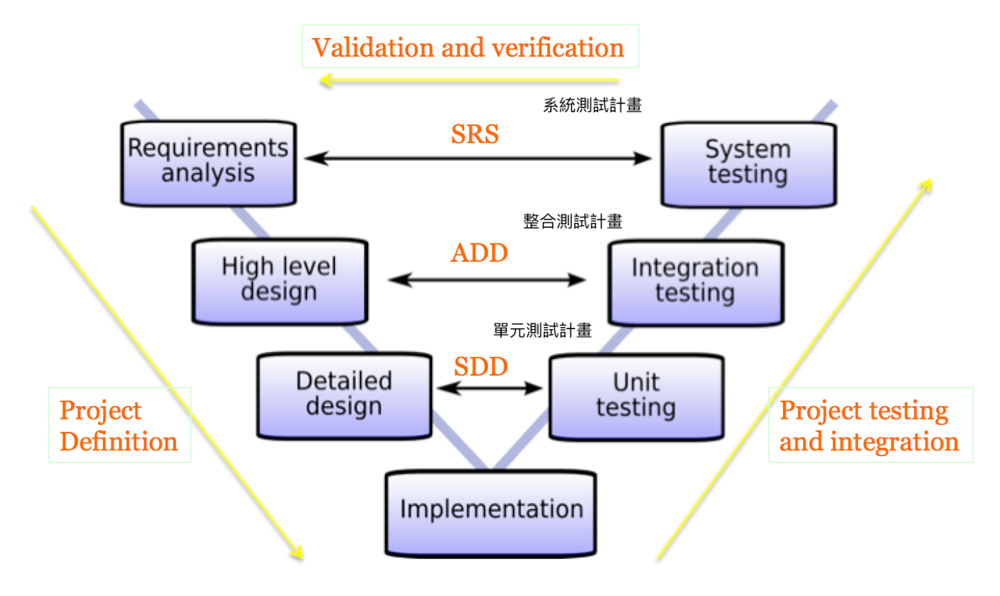

* **需求分析 (SRS)** $\leftrightarrow$ **系統測試計畫 (System Test Plan) / 驗收測試**
* **高階架構設計 (ADD)** $\leftrightarrow$ **整合測試計畫 (Integration Test Plan)**
* **詳細模組設計 (SDD)** $\leftrightarrow$ **單元測試計畫 (Unit Test Plan)**
* **核心價值**：**測試設計與開發規格同步前置產出**，避免「實作後測試偏差」。

#### **隨堂測驗 (CCQ 2)**

**問題**

在標準 V 開發模型中，依據「高階架構設計文件 (ADD)」所定義的模組介面與通訊協定，所對應執行的測試層級為何？

A) 單元測試 (Unit Testing)  
B) 整合測試 (Integration Testing)  
C) 驗收測試 (Acceptance Testing)  
D) 靜態程式碼檢視 (Code Review)  

<details>
<summary>點擊查看【隨堂測驗】答案與解析</summary>

**正確答案：B**

* **解析**：
  * **選項 B 正確**：高階架構設計定義了子系統與模組間的 API 介面與資料傳遞協定，其直接對應的驗證層級為整合測試 (Integration Testing)。

</details>

---

## 3.4 測試案例設計：規格、程式與驗證行為

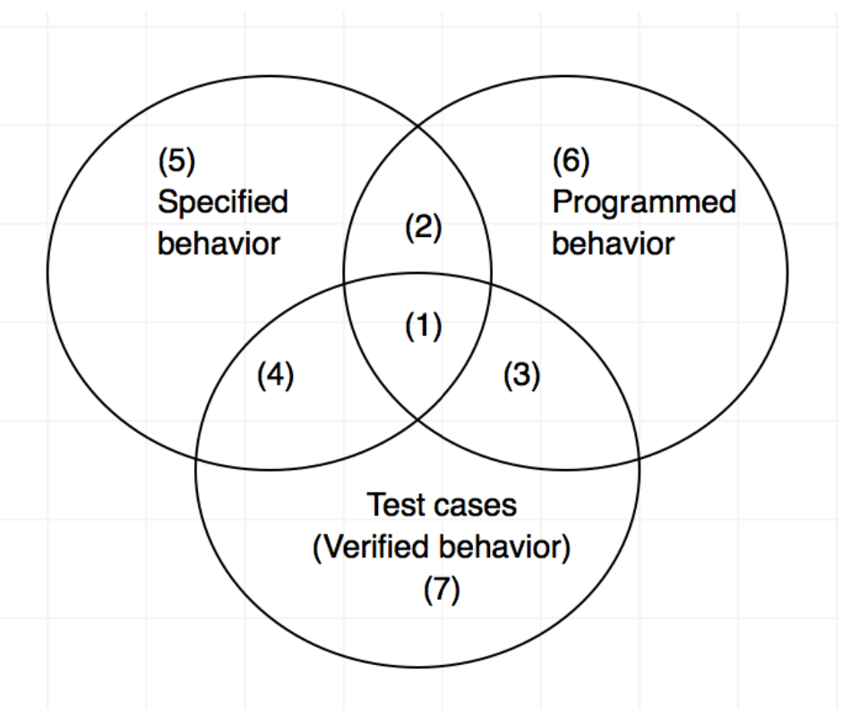

👉 測試案例與規格、程式行為的文氏圖關聯

* **規劃的行為 (Specified Behavior)**：規格書定義的預期行為。
* **程序化的行為 (Programmed Behavior)**：實際被實作成 Code 的行為。
* **驗證的行為 (Verified Behavior)**：測試案例實際涵蓋並驗證到的行為。

**區域解析**：
* **區域 1 (黃金核心)**：規劃要做、有實作出來、且有被測試驗證（專案最健康的目標！）。
* **區域 2**：規格有寫但工程師漏寫的未實作功能。
* **區域 3**：規格未要求，工程師擅自寫出但有被測到的功能（可能為多餘功能）。
* **區域 5**：未被實作也未被測試的幽靈需求。
* **區域 6**：規格未要求、未被測試、卻潛伏在代碼中的「隱藏功能或後門 Bug」！

---

### 測試案例 (Test Case) vs 測試資料 (Test Data)

* **測試案例 (Test Case)**：測試架構與邏輯分流的規劃。
* **測試資料 (Test Data)**：具體代入執行的數值。

```
【測試案例規劃】：除法運算
├── 分母 = 0 ── 測試資料: (5, 0) ──> 預期: 拋出 IllegalArgumentException
└── 分母 != 0
    ├── 整除   ── 測試資料: (4, 2) ──> 預期: 2.0
    └── 不整除
        ├── 進位   ── 測試資料: (5.1, 3) ──> 預期: 1.7
        └── 不進位 ── 測試資料: (4, 3)   ──> 預期: 1.33
```

> 📌 **現代標準測試案例結構**：
> $\text{Test Case} = [\text{ID}, \text{Preconditions}, \text{Inputs}, \text{Expected Output}, \text{Postconditions/Invariants}]$

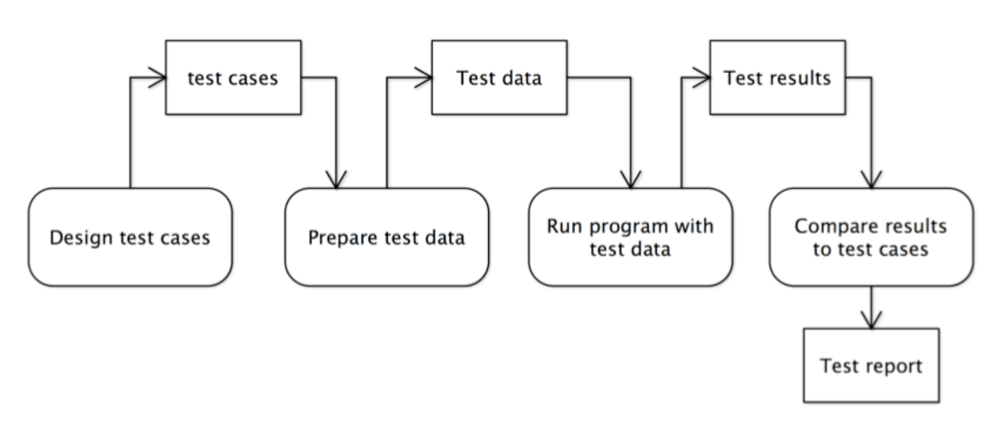

---

## 3.5 測試全景 3W2H 分類體系

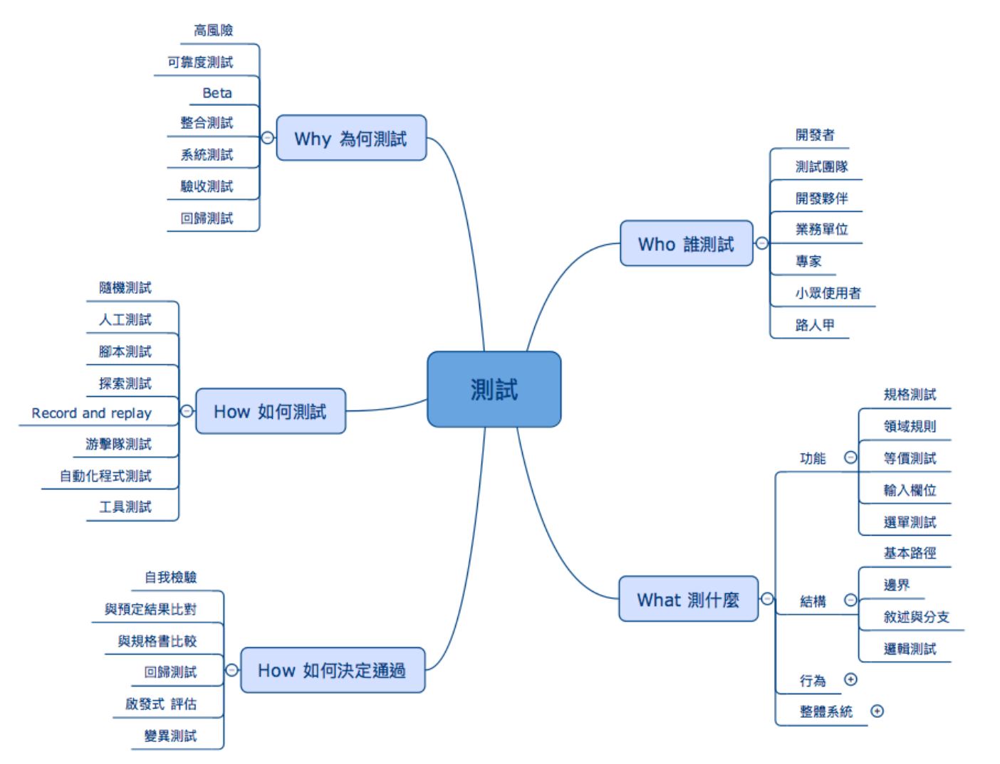

### 面向一：Who 誰來測試？
* **開發工程師**：單元測試 (Unit Test)、TDD。
* **結對夥伴 (Pair)**：Pair Programming 即時 Code Review 與測試。
* **專職 QA 團隊**：Alpha Testing、自動化測試架構建置。
* **業務領域專家 (Domain Expert)**：驗證業務規則與驗收測試。
* **外部真實使用者**：Beta Testing。

| 比較項目 | Alpha Testing | Beta Testing |
| :--- | :--- | :--- |
| **執行場所** | 開發團隊內部環境 | 客戶端真實生產/測試環境 |
| **受測對象** | 內部人員 / 模擬資料 | 外部真實使用者 / 真實業務資料 |
| **測試方法** | 白箱 + 黑箱混合 | 純黑箱測試 |

---

### 面向二：What 測什麼？
* **功能測試**：規格測試、等價劃分、邊界分析、輸入欄位格式。
* **結構測試**：陳述句涵蓋、分支涵蓋、路徑涵蓋、MC/DC。
* **情境測試 (Scenario Testing)**：模擬真實世界複雜連鎖使用者操作流程。
* **非功能測試**：負載 (Load)、耐力 (Soak)、安全性 (Security)、相容性 (Compatibility)。

---

### 面向三：Why 為何測試？
* **風險驅動**：變更風險、架構耦合風險、第三方相依性風險。
* **合約與防禦驗證**：輸入限制、計算限制、空間與資源限制。
* **迴歸測試 (Regression Testing)**：確保新變更沒有破壞既有功能。
  * *Retest All*：全部重跑（成本高）。
  * *Regression Selection*：依變更影響範圍挑選測試。
  * *Test Case Prioritization*：依優先級與歷史出錯率排序執行。

---

### 面向四：How 如何測試？
* **腳本測試 (Scripted Testing)**：依預先定義之步驟與斷言自動化執行。
* **探索性測試 (Exploratory Testing)**：測試者邊學習系統邊動態設計測資，發揮直覺與經驗。
* **猴子測試 / 隨機測試 (Monkey / Random Test)**：注入大量隨機事件檢驗系統強固性。
* **錄製與回放 (Record & Replay)**：透過使用者軌跡錄製自動生成測試腳本。

<div style="display: flex; gap: 10px;">
  
  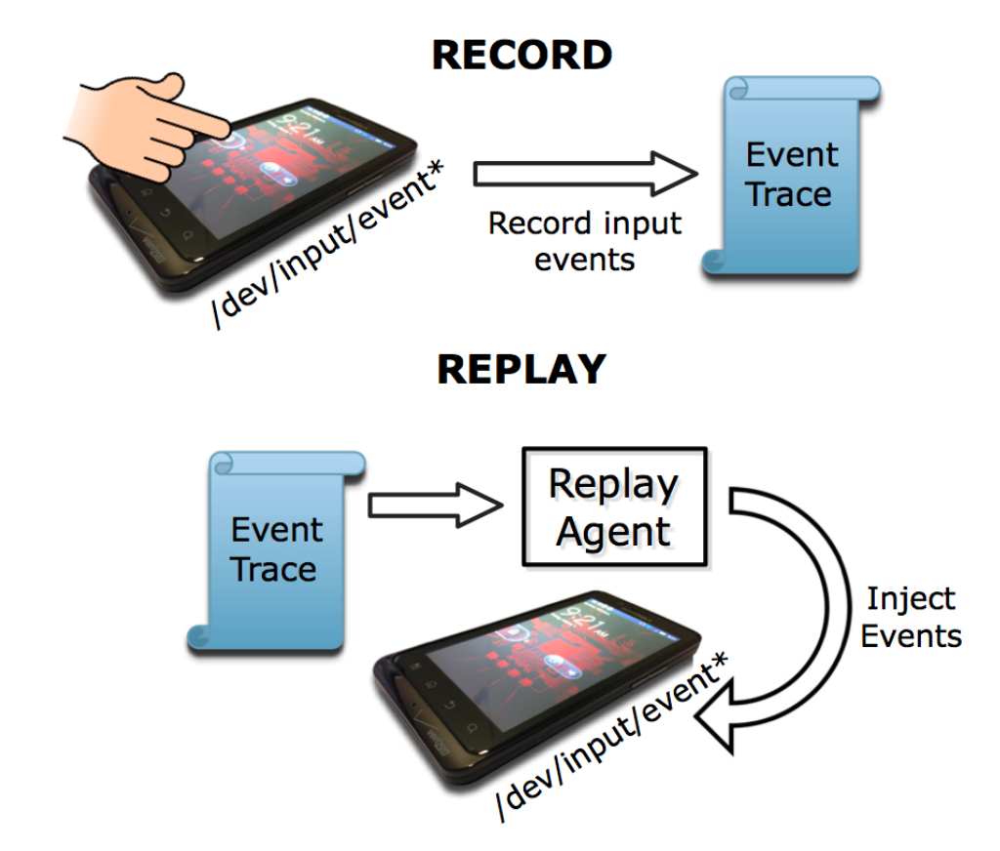
  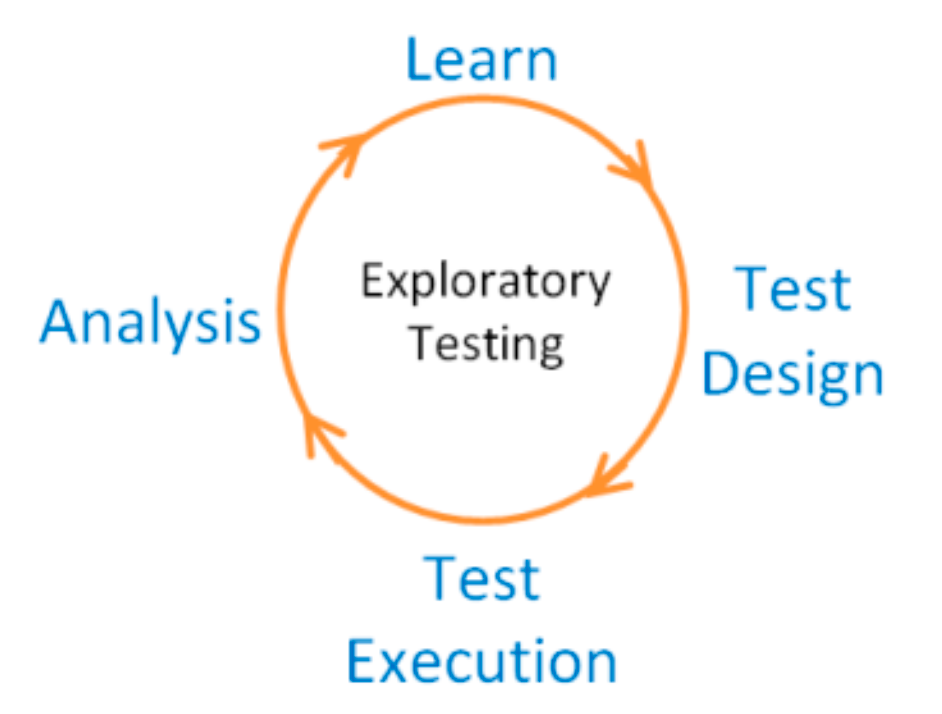
</div>

---

### 面向五：How to Evaluate 如何決定通過？與 Test Oracle 難題

* **涵蓋率指標**：語句、分支、路徑覆蓋率。
* **變異分數 (Mutation Score)**：使用 PIT 注入故障，檢驗測試套件殺死變異體的能力。
* **啟發式一致性檢驗**：與使用者期望一致、與同類競品一致、與產品風格一致。

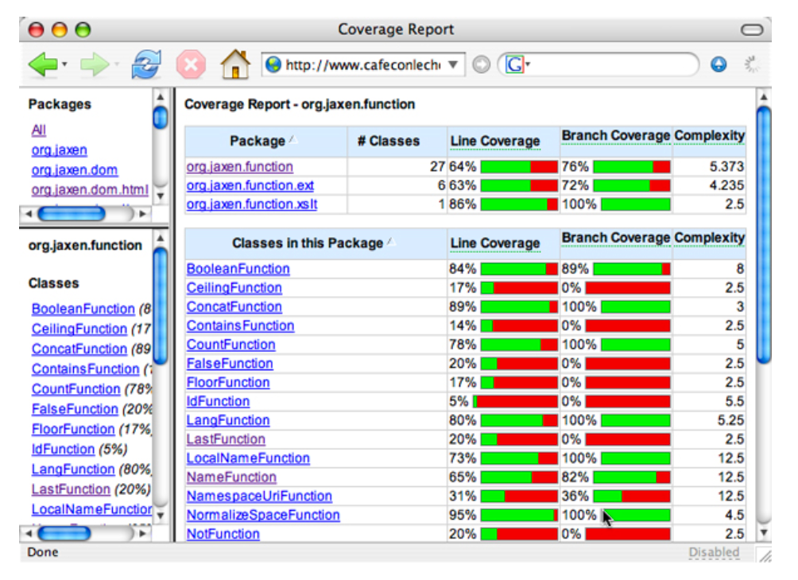

#### 🔮 Test Oracle（測試預言機）難題
> **什麼是 Test Oracle？**
> 「Test Oracle」是指**能夠判斷受測程式輸出是否正確的機制或基準**。

當輸出極度複雜（如搜尋引擎排序、機器學習模型、複雜浮點數學 $sin(x)$）無法手動給定固定值時，現代軟體工程的解法：
1. **變質測試 (Metamorphic Testing)**：利用領域對稱性質（例如 $\sin(x) = \cos(90^\circ - x) = -\sin(-x)$）。
2. **差分測試 (Differential Testing)**：將相同輸入餵給兩種獨立實作進行交叉比對。
3. **屬性基礎測試 (Property-Based Testing)**：驗證數學狀態不變量（Invariants）。

---

## ✍️ 3.6 綜合練習

### 一、測試原則與理論辨析
1. 為了確保軟體絕對正確，我們是否應該進行窮盡式測試（Exhaustive Testing）？為什麼？
2. 說明何謂測試的「殺蟲劑效應（Pesticide Paradox）」？現代軟體工程如何克服此盲區？
3. 比較 Verification 與 Validation 的核心差異。

### 二、V 模型與追溯
4. 依據 V 開發模型，需求規格書 (SRS) 確定後，應同步規劃哪一項測試計畫？
5. 試以 V 模型說明「規格設計在前、測試準備在先」如何避免實作後測試偏差。

### 三、測試案例與 Test Oracle 設計
6. 針對以下函式，設計完整的測試案例（包含前置條件、輸入與預期輸出）：
   * 計算最大公因數 `int getGCD(int x, int y);`
   * 陣列排序 `int[] sort(int[] data);`
7. 假設你要測試一個無法手算預期結果的巨量文字搜尋引擎演算法，請提出 2 種 Test Oracle（如變質關係或差分策略）來驗證其排序正確性。

### 四、場景綜合分析
8. 某網頁系統申請帳號時需輸入：帳號、Email、手機號碼、國籍與年齡。請列出你的黑箱測試等價類劃分策略。
9. 在一個西洋棋/象棋系統中，棋子由 $(x_1, y_1)$ 移動到 $(x_2, y_2)$，請列舉出至少 4 個必須防禦的邊界與不變量測試案例。