# Ch03 軟體測試原則、理論與架構模型 (AI 時代前沿版)
### Chapter 03: Testing Principles, Theories, and Architectural Models in the AI Era

> 江 Sir 皺著眉頭，一副憂心忡忡的說：「對不起，我們還不能驗收。」
> 
> 雄太睜大了眼睛。江 Sir 接著說：「我們前天還發現 Bug，這個系統可絕不能在正式上線時出錯啊！」
> 
> 「可是那是這星期以來唯一的錯誤，事實上，經過我們的內部單元測試與迴歸測試，交給你們後也沒發現幾個錯誤了。」
> 
> 「你敢保證現在系統完全沒有任何錯誤？」
> 
> 雄太猶豫了一下，拍著胸脯說：「我敢保證！現在系統絕對沒有任何錯誤了！」
> 
> 江 Sir 冷笑了一下說：「我倒是懂得一點軟體測試的根本原則——**軟體測試只能證明程式有錯，永遠無法證明程式絕對沒有錯誤！**」
> 
> 雄太一下子愣住了，傻傻地看著江 Sir...

---

## 3.1 防禦性架構與合約設計 (Design by Contract)

開車遇到綠燈時，多數老司機依然會減速並左右張望，因為無法保證其他人不會闖紅燈。寫程式亦是如此。**防禦性編程 (Defensive Programming)** 是一種主動預防錯誤擴散的工程態度。

### 3.1.1 契約式設計的三大核心要素 (Bertrand Meyer)


**圖形解說：Bertrand Meyer 契約式設計 (DbC) 三大核心法則**
1.  **Preconditions (前置條件 - `requires`)**：呼叫者 (Caller) 必須滿足的條件；若不滿足，被呼叫的方法有權直接拒絕執行。
2.  **Postconditions (後置條件 - `ensures`)**：方法正常執行完畢後，向呼叫者保證達成的狀態與輸出結果。
3.  **Class Invariants (類別不變量 - `maintains`)**：物件在任何公開方法調用前後，必須永遠維持為真的核心業務法則（如 `balance >= 0`）。

* **狀態不變量 (Invariants) 的重要性**：
  * *例如銀行帳戶*：`balance >= 0`、`totalDeposits == sum(transactions)`。
  * 任何操作若破壞了不變量，系統應立即自我熔斷，避免髒資料寫入資料庫。這也是後續**屬性基礎測試 (Property-Based Testing)** 的核心基石！

### 3.1.2 斷言 (Assertion) vs 例外處理 (Exception)

| 機制 | 目的 | 適用時機 | 生產環境行為 |
| :--- | :--- | :--- | :--- |
| **斷言 (Assertion)** | 捕捉「程式設計師自身的邏輯 Bug」或內部不變量 | 私有方法參數檢查、演算法內部狀態、不可能到達的分支 | 可被 `-ea` / `-da` 開關關閉 |
| **例外 (Exception)** | 處理「執行時外部可預期的異常環境」 | 公開 API 參數驗證、網路中斷、檔案不存在、使用者輸入錯誤 | 永遠處於啟用狀態，需有明確捕獲處理 |

> 🛠️ **實習手冊連結**：
> * 斷言實務：[`Lab/u03_preventive/assertion.md`](../Lab/u03_preventive/assertion.md)
> * 例外架構：[`Lab/u03_preventive/exception.md`](../Lab/u03_preventive/exception.md)
> * 結構化日誌：[`Lab/u03_preventive/logging.md`](../Lab/u03_preventive/logging.md)

#### **概念核對問答 (CCQ 1)**

**問題**

在契約式設計 (Design by Contract) 中，由「呼叫者 (Caller)」負責滿足、若不滿足則被呼叫方法將拒絕執行，這在契約三要素中屬於？

A) 前置條件 (Preconditions)  
B) 後置條件 (Postconditions)  
C) 類別不變量 (Class Invariants)  
D) 異常防護 (Exceptions)  

<details>
<summary>點擊查看【概念核對問答】答案與解析</summary>

**正確答案：A**

* **解析**：
  * **選項 A 正確**：前置條件 (Preconditions) 是呼叫者必須滿足的契約條件，用以保護被呼叫方法免於不合法的輸入；後置條件由被呼叫者保證達成；類別不變量是物件狀態在方法執行前後均須滿足的約束。

</details>

---

## 3.2 ISTQB 軟體測試 7 大經典原則 (The 7 Testing Principles)

> 📚 **權威參考文獻與標準 (References & Standards)**：
> 1. **ISTQB CTFL v4.0**：[ISTQB Certified Tester Foundation Level Syllabus (2023)](https://www.istqb.org/certifications/certified-tester-foundation-level-ctfl-v4-0)
> 2. **Glenford J. Myers**：《The Art of Software Testing》（軟體測試藝術經典）
> 3. **Martin Fowler**：[The Practical Test Pyramid (2018)](https://martinfowler.com/articles/practical-test-pyramid.html)
> 4. **IEEE 829 / ISO 29119**：Software and System Test Documentation Standard

國際軟體測試認證委員會（ISTQB）規範了軟體測試的 **7 大核心原則**，這是每一位專業軟體工程師與 QA 架構師的思維基石：

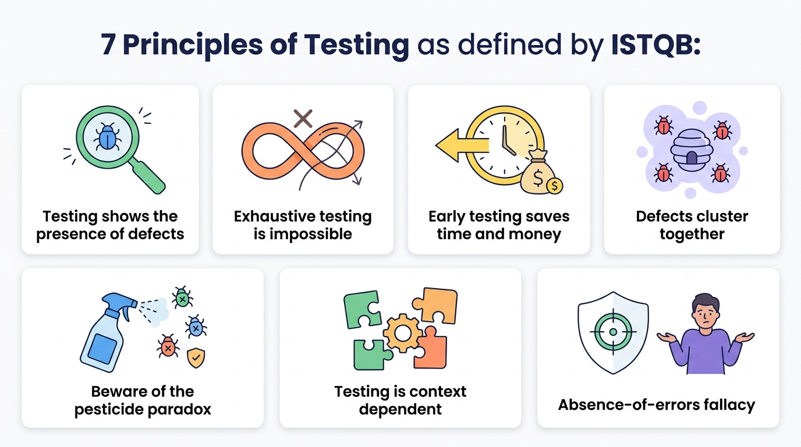

**圖形解說：ISTQB 軟體測試 7 大經典原則總覽**
1.  **1. Testing shows the presence of defects (測試顯示缺陷的存在)**：測試能證明有錯，無法證明軟體絕對無錯。
2.  **2. Exhaustive testing is impossible (窮盡測試是不可能的)**：輸入組合呈指數級爆炸，測試必須基於風險進行關鍵取樣。
3.  **3. Early testing saves time and money (及早測試 / 測試左移)**：在需求與架構階段抓錯，成本只有生產環境的百分之一 (1:10:100 定律)。
4.  **4. Defects cluster together (缺陷群聚效應)**：80% 的重大 Bug 往往集中在 20% 最複雜的模組中。
5.  **5. Beware of the pesticide paradox (小心殺蟲劑悖論)**：同一套測試反覆跑久了會產生抗藥性，必須定期更新並引入隨機/屬性測試。
6.  **6. Testing is context dependent (測試取決於上下文)**：航太醫療需要嚴格形式化驗證，敏捷 Web 側重快速 CI/CD 回歸與壓測。
7.  **7. Absence-of-errors fallacy (無錯謬誤)**：零語法錯誤不等於成功的系統，不符真實業務與使用者需求的軟體依然是失敗的。

---

### 原則 1：測試顯示缺陷的存在，而非不存在 (Testing shows the presence of defects, not their absence)

* **核心意涵**：測試能夠證明軟體中**「存在缺陷」**，但無論執行了多少萬筆測試且全部通過，都**「無法證明軟體絕對零缺陷」**。
* **測試的真正目的**：測試不是為了證明程式完美無瑕，而是為了**降低未被發現缺陷的風險**，提供軟體品質的客觀度量與發布信心。
* 🤖 **AI 時代警示【流暢性偏誤 (Fluency Bias)】**：
  * AI 生成的程式碼通常語法優美、註解詳盡，容易給工程師帶來「這段代碼絕對沒錯」的錯覺。
  * 但 AI 代碼極常潛伏並發競爭條件 (Race Conditions) 或邊界例外，跑過幾次 Happy Path 綠燈絕不能保證其無錯！

---

### 原則 2：窮盡測試是不可能的 (Exhaustive testing is impossible)

📋 **窮盡測試的限制**：

* **組合爆炸的現實**：
  考慮一個極為簡單的邏輯判斷：
  ```java
  input A, B, X
  if (A > 1) and (B == 0) then Y = A
  if (A == 2) or (X > 1)  then Y = X
  print Y 
  ```
  此處僅 4 個條件就有 2⁴ = 16 種路徑組合。若系統有 100 個判斷式，組合數高達 2¹⁰⁰ ≈ 1.27 × 10³⁰。加上作業系統、瀏覽器、網路波動與資料庫狀態，在有限時間內窮盡所有可能輸入是計算上不可能的。

* **錯誤總是躲在角落 (Bugs lurk in corners)**：
  考慮以下程式碼，第 2 行原本應為 `j = j + 1`，卻誤打成 `j = j - 1`：
  ```java
  int scale (int j) {
     j = j - 1; // 正確應為 j = j + 1
     j = j / 3000;
     return j;
  }
  ```
  假設 j 範圍為 -32768 ~ 32767（整數除法無條件捨去）。分析發現，僅有 j = 2999, 3000, 5999, 6000 ... 等 **18 個數值會顯現錯誤**，其餘 65,518 個數值算出來答案都碰巧一致。
  > 🎲 **盲目隨機踩中錯誤的機率** = 18 / 65536 ≈ 0.00027 (0.027%)
  這證明了：**盲目測試很難抓到 Bug，測試必須是基於風險的取樣（Risk-Based Testing），針對邊界值精準打擊！**

* **並不是所有錯誤都會被修復**：修復老舊系統微小 Bug 的成本與回歸風險可能遠大於其影響，測試工程師需具備風險評估思維。

---

### 原則 3：及早測試 / 測試左移 (Early testing saves time and money / Shift-Left)

* **核心意涵**：靜態與動態測試活動應在軟體開發生命週期的**最早期（需求與架構階段）**即刻介入。
* **經濟學依據（1:10:100 品質成本定律）**：
  * 在需求審查時抓出一個邏輯矛盾：**\$1**
  * 在開發單元測試時抓出 Bug：**\$10**
  * 軟體上線到生產環境後發生故障的維護與賠償代價：**\$100 ～ \$1000+**！

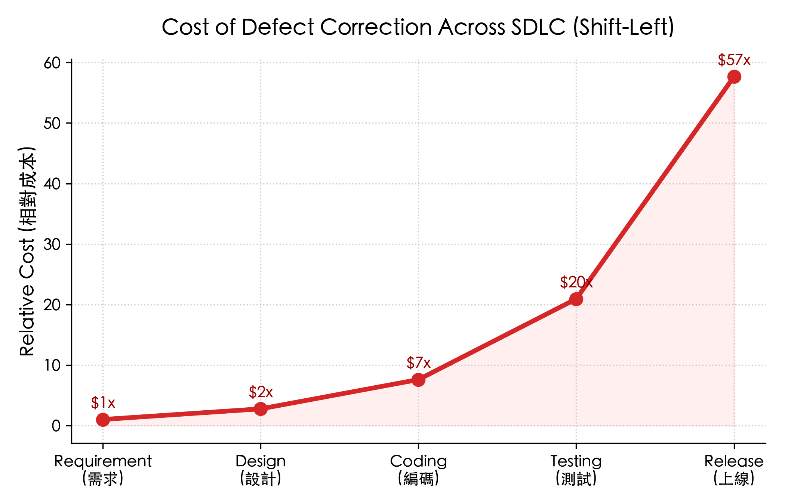

---

### 原則 4：缺陷群聚效應 (Defects cluster together)

* **核心意涵（80/20 法則）**：軟體系統中絕大多數的重大缺陷，往往高度集中在**少數幾個複雜度最高、變更最頻繁、或涉及多方外部整合的模組中**。
* **工程實務啟示**：當在某個模組發現了大量 Bug 時，不要以為抓完就沒事了，該模組很可能還潛伏著更多深層缺陷，應對其加大變異測試 (Mutation Testing) 與屬性測試力度。

---

### 原則 5：小心殺蟲劑悖論 (Beware of the pesticide paradox)

* **核心意涵**：同一種農藥噴久了，害蟲會產生抗藥性；**同一套測試案例反覆跑久了，將無法再挖掘出任何新的 Bug！**
* **SQA 2.0 的應對之道**：
  * 測試案例必須定期審查、重構並動態演進。
  * 導入 **屬性基礎測試 (Property-Based Testing / jqwik)**：每次執行自動隨機生成萬組全新測資。
* 🤖 **AI 時代警示【自我印證的假綠燈】**：
  * 若讓 AI 為自己生成的程式碼寫單元測試，AI 會**依照自身錯誤的邏輯去設計測試**，導致測試與代碼「共同錯在同一個盲區」，產生極高強度的假安全感抗藥性！

---

### 原則 6：測試取決於上下文 (Testing is context dependent)

* **核心意涵**：世上沒有一套放之四海皆準的通用測試方法。
* **實例對比**：
  * **醫療儀器 / 航太飛控系統**：需嚴格遵循 DO-178C 標準，要求 MC/DC 覆蓋率 100% 與形式化驗證。
  * **敏捷電商 Web App**：著重快速回歸、高併發壓測、微服務契約測試與 A/B 測試。

---

### 原則 7：無錯謬誤 (Absence-of-errors is a fallacy)

* **核心意涵**：**「零 Bug 的系統」並不等於「成功的系統」**。
* 即使團隊投入巨大資源修復了所有 Bug，但如果軟體**根本沒有滿足使用者的真實業務需求**，或者操作體驗極其反人類，這套軟體在商業與品質上依然是徹底失敗的。
* **測試無法直接改善品質**：光靠測試不改善架構設計與需求分析，品質不會自然變好。
* 🤖 **AI 時代警示【Prompt 幻覺】**：
  * AI 產生的程式碼可能編譯 100% 通過且無語法錯誤，但若 Prompt 對領域規則（Domain Spec）的理解有誤，產出的依然是「符合規格但無用的垃圾」。

---

#### **概念核對問答 (CCQ 2)**

**問題**

某工程師使用 AI 秒速生成了一套複雜的利息計算演算法，並隨即讓同一個 AI 幫忙生成單元測試。測試跑出 100% 覆蓋率全綠燈通過，但在實際上線後卻被金融主管機關判定年息計算公式違反法規。依據 ISTQB 軟體測試 7 大原則，這最主要反映了何種問題？

A) 測試工程師未安裝最新的 JDK 執行環境  
B) AI 測試陷入「殺蟲劑悖論（自我印證盲區）」與「原則 7：無錯謬誤（代碼無語法錯誤但偏離法規與真實業務需求）」  
C) 只要測試覆蓋率達到 100%，系統必然在法律上具備合規性  
D) 這是硬體浮點數運算器的製造缺陷  

<details>
<summary>點擊查看【概念核對問答】答案與解析</summary>

**正確答案：B**

* **解析**：
  * **選項 B 正確**：讓 AI 為自己生成的代碼寫測試，極易陷入自我印證的殺蟲劑抗藥性；同時，程式碼無編譯錯誤並不等於符合業務與法規需求（無錯謬誤）。人類工程師必須親自定義領域規格（Domain Spec）與 Test Oracle。

</details>

---

## 3.3 測試的多維度分類體系

### 1. 驗證 (Verification) vs 確認 (Validation)

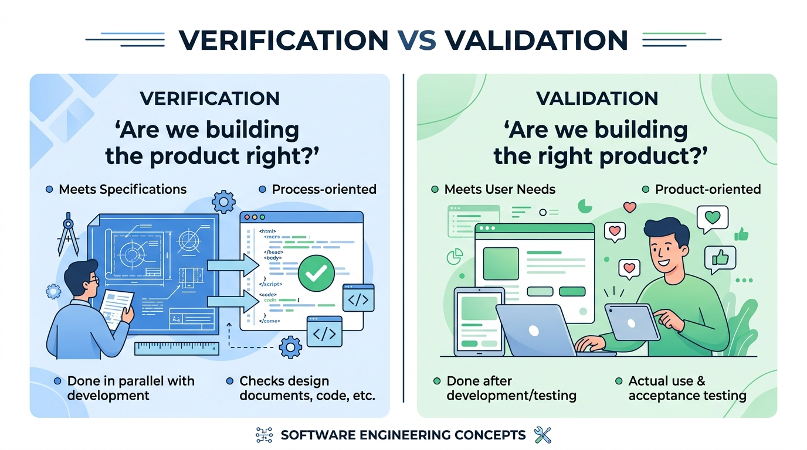

**圖形解說：Verification（驗證）與 Validation（確認）之核心差異**
*   **【左側】Verification (驗證)**：
    *   *關鍵提問*：**「Are we building the product right?（我們是否正確地建造軟體？）」**
    *   *目標*：確保程式碼與架構嚴格符合設計圖、SRS 規格書與編碼規範（製程導向）。
*   **【右側】Validation (確認)**：
    *   *關鍵提問*：**「Are we building the right product?（我們是否建造了正確的軟體？）」**
    *   *目標*：確保軟體交付後真正切中使用者痛點、滿足業務目標與商業價值（產品導向）。


---

### 2. 缺失測試 (Defect Testing) vs 確認測試 (Validation Testing)
* **Defect Testing**：目的在於「找出缺陷、搞壞系統」，採極端與破壞性邊界輸入。
* **Validation Testing**：目的在於「向客戶證明系統符合功能需求」，循序漸進驗證 Happy Path。

---

### 3. 靜態測試 (Static) vs 動態測試 (Dynamic)
* **靜態測試**：不執行程式碼，透過人工 Review、AST 語法樹分析（SonarQube, SpotBugs）。
* **動態測試**：實際運行程式碼，給定輸入並比對輸出結果。

---

### 4. 功能測試（黑箱） vs 結構測試（白箱）


**圖形解說：黑箱測試 (Black-Box) vs 白箱測試 (White-Box)**
*   **【左側】黑箱測試 (Black-Box Testing - 規格導向)**：
    *   受測系統為不透明的黑盒子，測試人員不檢視內部程式碼，僅依據需求規格 (SRS) 與邊界設計輸入 (Inputs)，驗證輸出 (Outputs) 是否符合預期。
*   **【右側】白箱測試 (White-Box Testing - 結構導向)**：
    *   受測系統為透明的玻璃盒子，測試人員檢視內部程式邏輯，依據陳述句 (Statements)、分支 (Branches)、條件 (Conditions) 與路徑 (Paths) 設計測資，追求高程式碼覆蓋率。

---

### 5. 測試層級：單元、整合與系統測試

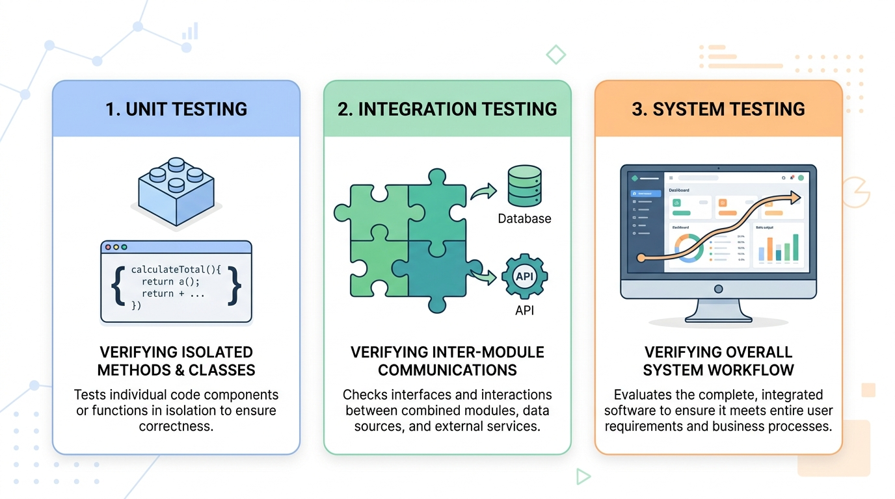

**圖形解說：三大核心測試層級**
1.  **1. Unit Testing (單元測試)**：針對最小獨立模組或方法（Class/Method）進行隔離驗證，速度極快。
2.  **2. Integration Testing (整合測試)**：驗證跨模組介面、微服務 API 與資料庫之間的通訊協定與資料傳遞。
3.  **3. System Testing (系統測試)**：在完整模擬或真實環境中執行端到端 (E2E) 使用者工作流程與非功能需求驗證。

#### 💡 單元模組的可測試性 (Testability)
模組設計應遵循「邏輯與 UI 分離」：

```java
// ❌ 不良設計：業務邏輯與 UI 輸入強耦合，無法自動化單元測試
double div(double x, double y) {
    while (y == 0) {
        y = input("除數不可為 0，請重新輸入："); // 依賴 UI
    }
    return x / y;
}

// ✅ 良好設計：純邏輯模組，拋出明確例外，極易進行 JUnit 自動化測試
double div(double x, double y) {
    if (y == 0) {
        throw new IllegalArgumentException("除數不得為 0");
    }
    return x / y;
}
```

---

### 6. 現代測試金字塔 (The Practical Test Pyramid)

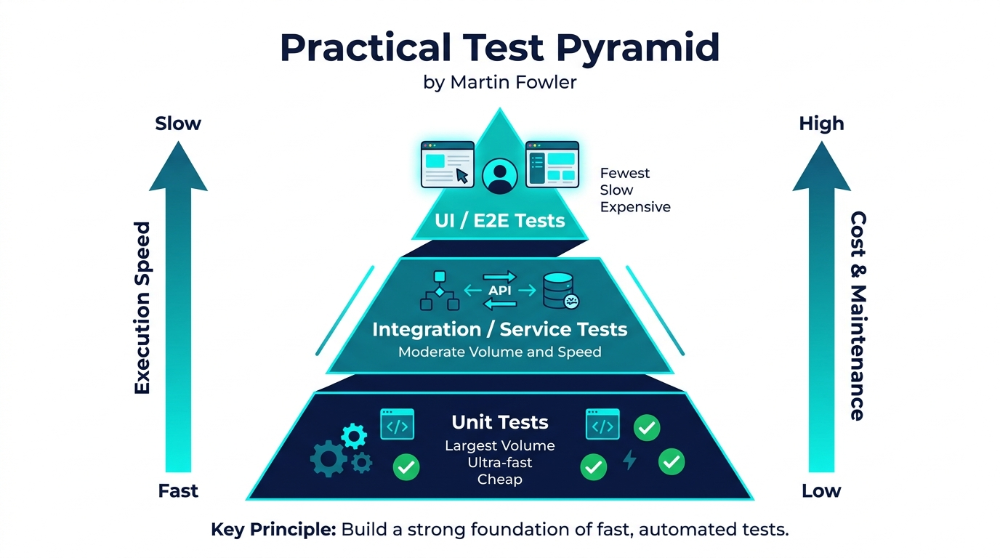

**圖形解說：Martin Fowler 現代實踐測試金字塔**
*   **頂層：UI / E2E Tests (端到端測試)**：數量最少、執行最慢、維護成本最高（Playwright / Cypress）。
*   **中層：Integration / Service Tests (整合與服務測試)**：數量與速度適中，驗證 API 與資料庫合約（Testcontainers / Pact）。
*   **底層：Unit Tests (單元測試)**：數量最多、執行極快（毫秒級）、維護成本最低（JUnit 5 / Mockito）。
*   **反模式：冰淇淋甜筒 (Ice Cream Cone)**：缺乏底層單元測試，過度依賴脆弱且昂貴的 UI E2E 測試，導致 CI 構建緩慢且頻繁誤報。

---

## 3.4 V 開發模型與雙向追溯 (The V-Model)

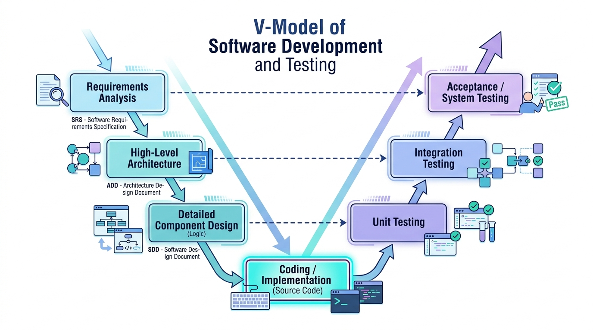

**圖形解說：V 開發模型與雙向追溯（Development & Testing Traceability）**
*   **【左側下降臂（開發階段）】**：
    1.  **Requirements Analysis (需求分析 - SRS)**：定義使用者與業務規格。
    2.  **High-Level Architecture (高階架構設計 - ADD)**：定義子系統架構與介面協定。
    3.  **Detailed Component Design (詳細模組設計 - SDD)**：定義單一類別與方法邏輯。
*   **【底部頂點（程式實作）】**：
    *   **Coding / Implementation (程式碼撰寫與建置)**：以 Java 等語言將設計轉化為可執行之原始程式碼產物。
*   **【右側上升臂（測試驗證）】**：
    1.  **Unit Testing (單元測試)**：直接對應並驗證左側的「詳細模組設計 (SDD)」。
    2.  **Integration Testing (整合測試)**：直接對應並驗證左側的「高階架構設計 (ADD)」。
    3.  **Acceptance / System Testing (系統與驗收測試)**：直接對應並驗證左側的「需求規格 (SRS)」。
*   **核心價值**：**測試設計與開發規格同步前置產出（水平雙向追溯線）**，避免「實作後測試偏差」。

#### **概念核對問答 (CCQ 3)**

**問題**

在標準 V 開發模型中，依據「高階架構設計文件 (ADD)」所定義的模組介面與通訊協定，所對應執行的測試層級為何？

A) 單元測試 (Unit Testing)  
B) 整合測試 (Integration Testing)  
C) 驗收測試 (Acceptance Testing)  
D) 靜態程式碼檢視 (Code Review)  

<details>
<summary>點擊查看【概念核對問答】答案與解析</summary>

**正確答案：B**

* **解析**：
  * **選項 B 正確**：高階架構設計定義了子系統與模組間的 API 介面與資料傳遞協定，其直接對應的驗證層級為整合測試 (Integration Testing)。

</details>

---

## 3.5 測試案例設計：規格、程式與驗證行為

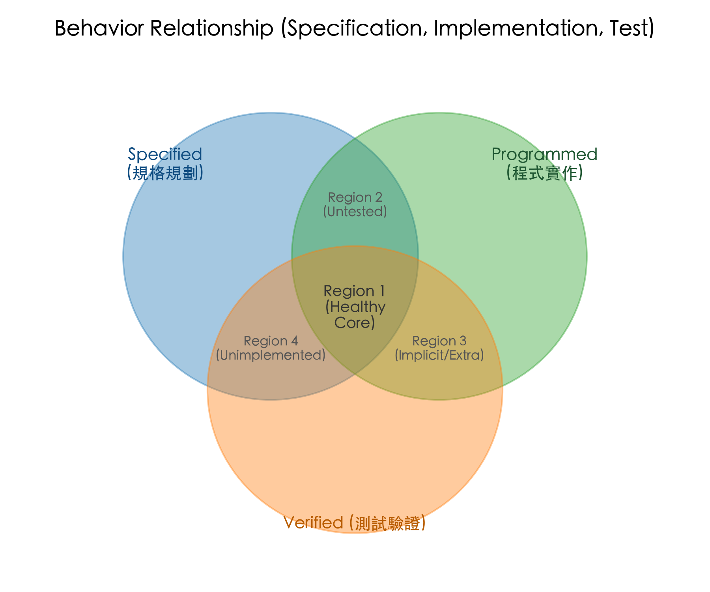

👉 測試案例與規格、程式行為的文氏圖關聯

* **規劃的行為 (Specified Behavior)**：規格書定義的預期行為。
* **程序化的行為 (Programmed Behavior)**：實際被實作成 Code 的行為。
* **驗證的行為 (Verified Behavior)**：測試案例實際涵蓋並驗證到的行為。

**區域解析**：
* **區域 1 (黃金核心)**：規劃要做、有實作出來、且有被測試驗證（專案最健康的目標！）。
* **區域 2**：規格有寫但工程師漏寫的未實作功能。
* **區域 3**：規格未要求，工程師擅自寫出但有被測到的功能（可能為多餘功能）。
* **區域 5**：未被實作也未被測試的幽靈需求。
* **區域 6**：規格未要求、未被測試、卻潛伏在代碼中的「隱藏功能或後門 Bug」！

---

### 3.5.1 測試案例 (Test Case) vs 測試資料 (Test Data)

* **測試案例 (Test Case)**：測試架構與邏輯分流的規劃。
* **測試資料 (Test Data)**：具體代入執行的數值。

```
【測試案例規劃】：除法運算
├── 分母 = 0 ── 測試資料: (5, 0) ──> 預期: 拋出 IllegalArgumentException
└── 分母 != 0
    ├── 整除   ── 測試資料: (4, 2) ──> 預期: 2.0
    └── 不整除
        ├── 進位   ── 測試資料: (5.1, 3) ──> 預期: 1.7
        └── 不進位 ── 測試資料: (4, 3)   ──> 預期: 1.33
```

> 📌 **現代標準測試案例結構**：
> `Test Case = [ID, Preconditions, Inputs, Expected Output, Postconditions/Invariants]`

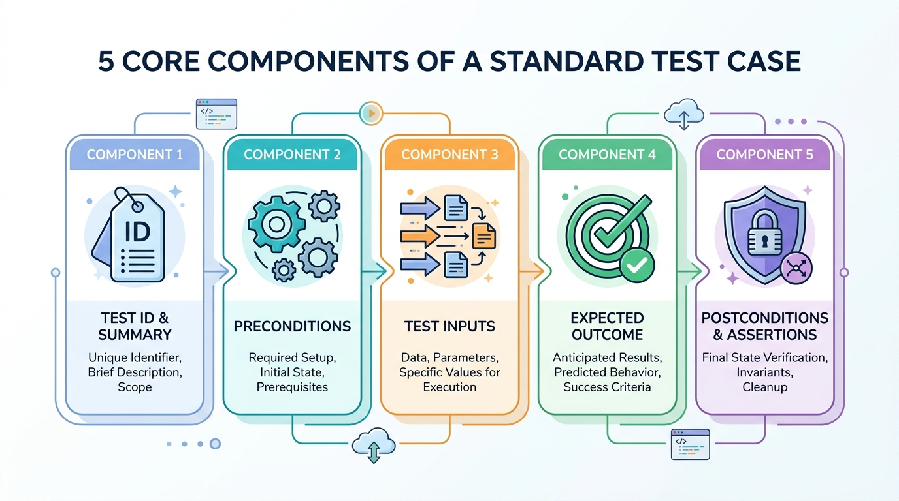

**圖形解說：現代標準測試案例五大核心構成要件 (Standard Test Case Anatomy)**
1.  **Component 1: Test ID & Summary (識別碼與摘要)**：唯一編號（如 `TC-AUTH-001`）與簡明測試目的說明。
2.  **Component 2: Preconditions (前置條件與環境)**：執行測試前系統必須處於的初始狀態（如特定登入身分、資料庫初始資料 Fixtures）。
3.  **Component 3: Test Inputs (測試輸入資料)**：傳入受測方法的參數、HTTP Request Payload 或使用者操作事件。
4.  **Component 4: Expected Outcome (預期結果與 Oracle)**：系統應回傳之正確值、HTTP 狀態碼或畫面渲染結果。
5.  **Component 5: Postconditions & Assertions (後置條件與狀態斷言)**：執行後系統資料庫的狀態驗證、不變量檢查與測試後的環境復原 (Cleanup)。

---

### 🤖 3.5.2 AI 輔助測試案例生成：優勢、陷阱與人機協同

| 項目 | 人類工程師的優勢 | AI (LLM) 助手的優勢 | 人機協同黃金 SOP (SQA 2.0) |
| :--- | :--- | :--- | :--- |
| **規格與不變量定義** | ⭐⭐⭐ 深刻理解領域商業價值與法律合約 | ⭐ 缺乏真實商業感知，易產生荒謬假設 | **人類主導**：定義前置/後置條件與狀態不變量 |
| **邊界與極端測資生成** | ⭐ 人腦容易疲勞、易遺漏冷門 Unicode/極大值 | ⭐⭐⭐ 秒速生成數千組極端字串、溢位邊界 | **AI 輔助**：批量生成邊界與攻擊 Payload |
| **測試結果有效性判斷 (Oracle)** | ⭐⭐⭐ 具備客觀真理的最終仲裁權 | ⭐ 自我印證偏誤，易產生假綠燈斷言 | **人類審查**：審查斷言邏輯並納入 CI 自動化 |

---

## 3.6 測試全景 3W2H 分類體系

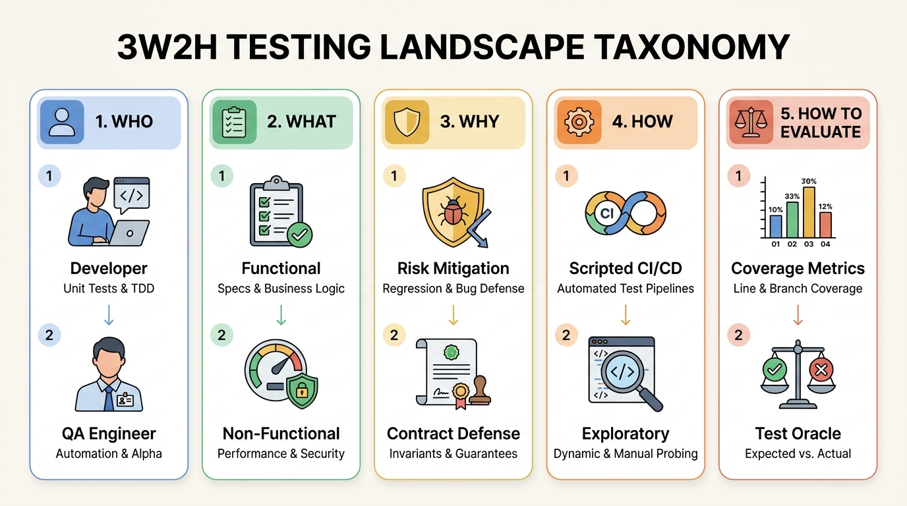

**圖形解說：測試全景 3W2H 分類體系與核心構面**
1.  **1. WHO（誰來測試）**：
    *   **Developer**：負責撰寫 Unit Tests 與落實 TDD 單元驗證。
    *   **QA Engineer**：負責建置自動化框架與執行 Alpha Testing。
2.  **2. WHAT（測什麼）**：
    *   **Functional**：驗證商業邏輯規格 (Specs & Logic) 與邊界條件。
    *   **Non-Functional**：檢驗系統效能 (Performance) 與資安防禦 (Security)。
3.  **3. WHY（為何測試）**：
    *   **Risk Mitigation**：防範迴歸缺陷 (Regression & Bug Defense)，降低變更風險。
    *   **Contract Defense**：確保狀態不變量與合約保證 (Invariants & Guarantees)。
4.  **4. HOW（如何測試）**：
    *   **Scripted CI/CD**：於自動化管線中依預定義腳本批量執行。
    *   **Exploratory**：測試者動態探索系統 (Dynamic & Manual Probing)，以經驗挖掘潛在弱點。
5.  **5. HOW TO EVALUATE（如何評估通過）**：
    *   **Coverage Metrics**：透過量化指標計算程式碼行涵蓋與分支涵蓋率。
    *   **Test Oracle**：比對預期結果與實際輸出 (Expected vs. Actual) 判定測試成敗。

### 面向一：Who 誰來測試？
* **開發工程師**：單元測試 (Unit Test)、TDD。
* **結對夥伴 (Pair)**：Pair Programming 即時 Code Review 與測試。
* **專職 QA 團隊**：Alpha Testing、自動化測試架構建置。
* **業務領域專家 (Domain Expert)**：驗證業務規則與驗收測試。
* **外部真實使用者**：Beta Testing。

| 比較項目 | Alpha Testing | Beta Testing |
| :--- | :--- | :--- |
| **執行場所** | 開發團隊內部環境 | 客戶端真實生產/測試環境 |
| **受測對象** | 內部人員 / 模擬資料 | 外部真實使用者 / 真實業務資料 |
| **測試方法** | 白箱 + 黑箱混合 | 純黑箱測試 |

---

### 面向二：What 測什麼？
* **功能測試**：規格測試、等價劃分、邊界分析、輸入欄位格式。
* **結構測試**：陳述句涵蓋、分支涵蓋、路徑涵蓋、MC/DC。
* **情境測試 (Scenario Testing)**：模擬真實世界複雜連鎖使用者操作流程。
* **非功能測試**：負載 (Load)、耐力 (Soak)、安全性 (Security)、相容性 (Compatibility)。

---

### 面向三：Why 為何測試？
* **風險驅動**：變更風險、架構耦合風險、第三方相依性風險。
* **合約與防禦驗證**：輸入限制、計算限制、空間與資源限制。
* **迴歸測試 (Regression Testing)**：確保新變更沒有破壞既有功能。
  * *Retest All*：全部重跑（成本高）。
  * *Regression Selection*：依變更影響範圍挑選測試。
  * *Test Case Prioritization*：依優先級與歷史出錯率排序執行。

---

### 面向四：How 如何測試？
* **腳本測試 (Scripted Testing)**：依預先定義之步驟與斷言自動化執行。
* **探索性測試 (Exploratory Testing)**：測試者邊學習系統邊動態設計測資，發揮直覺與經驗。
* **猴子測試 / 隨機測試 (Monkey / Random Test)**：注入大量隨機事件檢驗系統強固性。
* **錄製與回放 (Record & Replay)**：透過使用者軌跡錄製自動生成測試腳本。

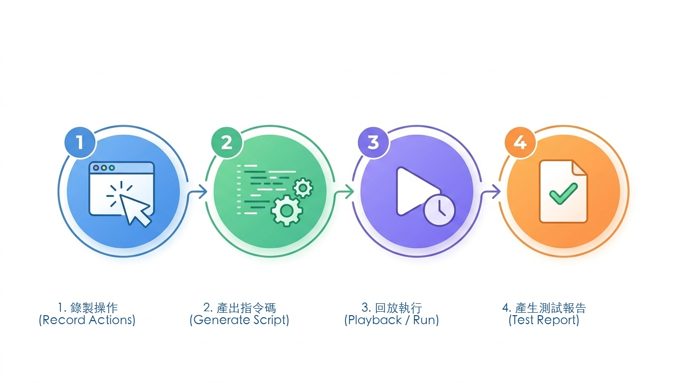

---

### 面向五：How to Evaluate 如何決定通過？與 Test Oracle 難題

* **涵蓋率指標**：語句、分支、路徑覆蓋率。
* **變異分數 (Mutation Score)**：使用 PIT 注入故障，檢驗測試套件殺死變異體的能力。
* **啟發式一致性檢驗**：與使用者期望一致、與同類競品一致、與產品風格一致。

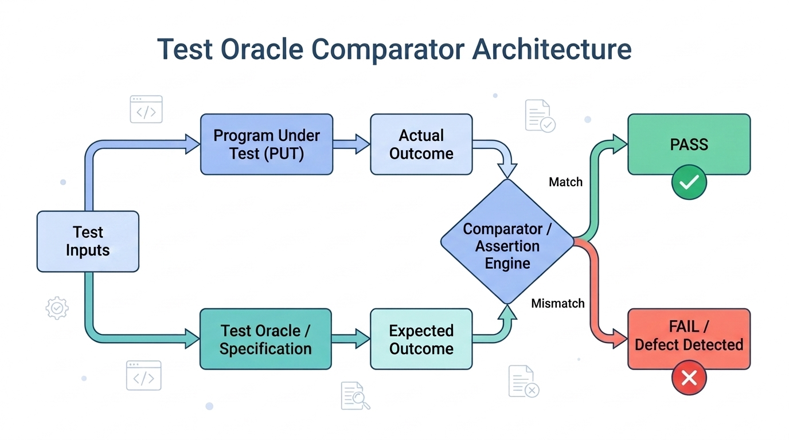

**圖形解說：Test Oracle Comparator（測試預言機與比對器架構）**
*   **輸入分流 (Test Inputs)**：同一組測試輸入同時餵入兩條並行路徑：
    1.  **受測程式 (Program Under Test - PUT)** ➔ 產生「實際執行結果 (Actual Outcome)」。
    2.  **測試預言機 (Test Oracle / Specification)** ➔ 產生「理論預期結果 (Expected Outcome)」。
*   **比對仲裁 (Comparator / Assertion Engine)**：由斷言引擎（如 JUnit `assertEquals`）比對兩者：
    *   **Match (一致)** ➔ 判定測試 **PASS（通過 ✅）**。
    *   **Mismatch (不符)** ➔ 判定測試 **FAIL（缺陷判定 ❌）**。

#### 🔮 3.6.5 Test Oracle（測試預言機）難題在 AI 與複雜系統中的爆發

> **什麼是 Test Oracle？**
> 「Test Oracle」是指**能夠判斷受測程式輸出是否正確的機制或基準**。

##### 傳統軟體 vs 現代 AI 系統的 Oracle 困境：
* **傳統演算法**：f(x) → y（確定性輸出，例如 1 + 1 = 2，Oracle 極為明確）。
* **複雜科學運算 / 推薦系統 / LLM Agent**：
  * 給定搜尋詞「最受歡迎的資工系選修課」，搜尋引擎給出 10 筆結果，**沒有唯一的標準答案**！
  * 大語言模型生成的文章或摘要，輸出具隨機性 (Temperature > 0) 與語意多樣性。

##### 💡 SQA 2.0 應對 Test Oracle 難題的三大前沿技術：
1. **變質測試 (Metamorphic Testing)**：
   * 利用領域對稱性質：例如 sin(x) = cos(90° - x) = -sin(-x)。
   * 對 AI 影像辨識系統：將一張貓的照片旋轉 10 度或調整亮度 5%，辨識結果**依然必須是貓（不變量關係）**！
2. **差分測試 (Differential Testing)**：
   * 將相同輸入餵給兩種獨立實作（例如 Claude vs GPT、舊版演算法 vs 新版微服務）進行交叉比對。
3. **LLM-as-a-Judge 與防護欄 (Guardrails)**：
   * 使用經過專門微調的評估模型，針對輸出進行忠實度（Faithfulness）、安全性與不變量檢驗。

---

## ✍️ 3.7 綜合練習

### 一、測試原則與理論辨析
1. 為了確保軟體絕對正確，我們是否應該進行窮盡式測試（Exhaustive Testing）？為什麼？
2. 說明何謂測試的「殺蟲劑效應（Pesticide Paradox）」？當使用 AI 輔助生成測試時，為什麼更容易產生殺蟲劑效應？
3. 比較 Verification 與 Validation 的核心差異。

### 二、V 模型與追溯
4. 依據 V 開發模型，需求規格書 (SRS) 確定後，應同步規劃哪一項測試計畫？
5. 試以 V 模型說明「規格設計在前、測試準備在先」如何避免實作後測試偏差。

### 三、測試案例與 Test Oracle 設計
6. 針對以下函式，設計完整的測試案例（包含前置條件、輸入與預期輸出）：
   * 計算最大公因數 `int getGCD(int x, int y);`
   * 陣列排序 `int[] sort(int[] data);`
7. 假設你要測試一個無法手算預期結果的巨量文字搜尋引擎演算法，請提出 2 種 Test Oracle（如變質關係或差分策略）來驗證其排序正確性。

### 四、場景綜合分析
8. 某網頁系統申請帳號時需輸入：帳號、Email、手機號碼、國籍與年齡。請列出你的黑箱測試等價類劃分策略。
9. 在一個西洋棋/象棋系統中，棋子由 (x₁, y₁) 移動到 (x₂, y₂)，請列舉出至少 4 個必須防禦的邊界與不變量測試案例。