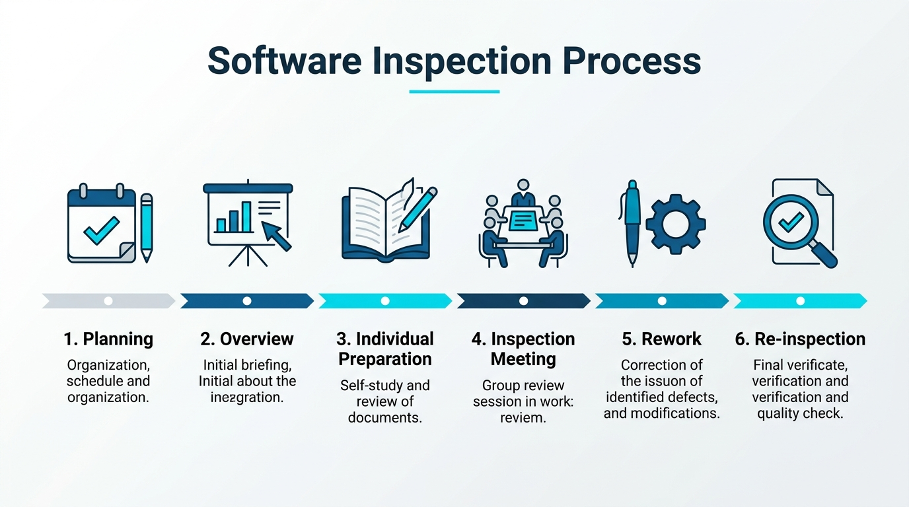
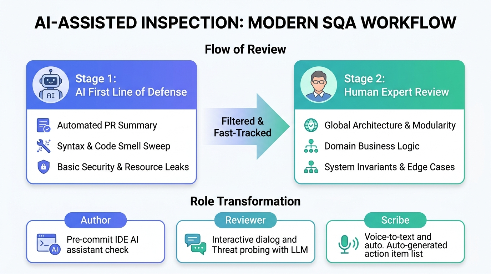
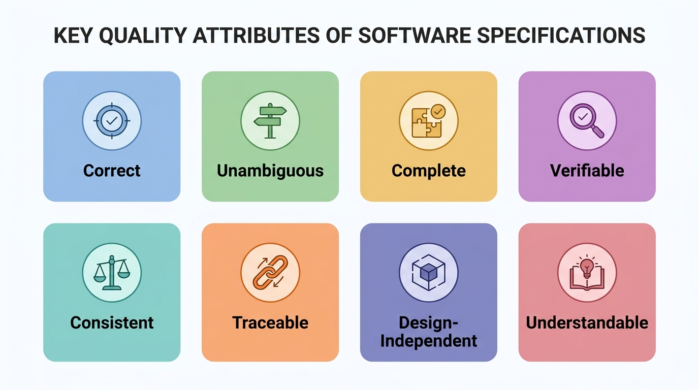
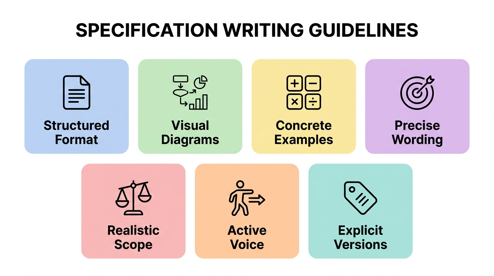
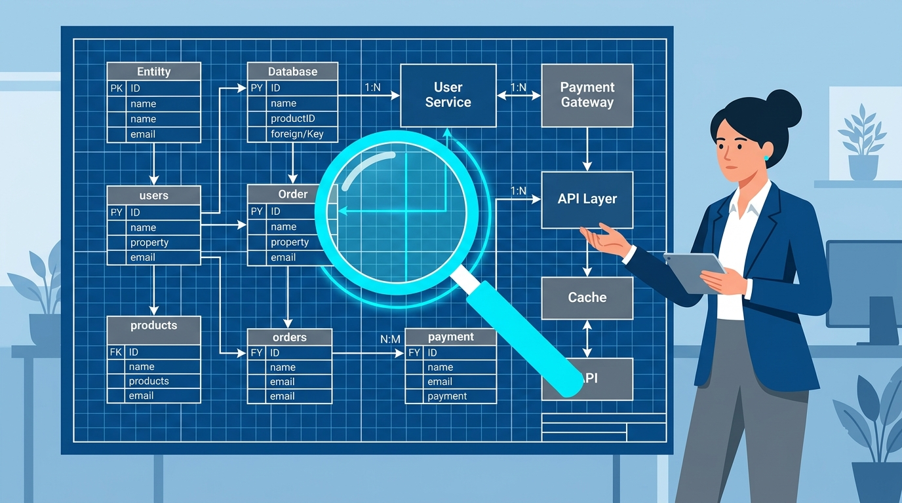
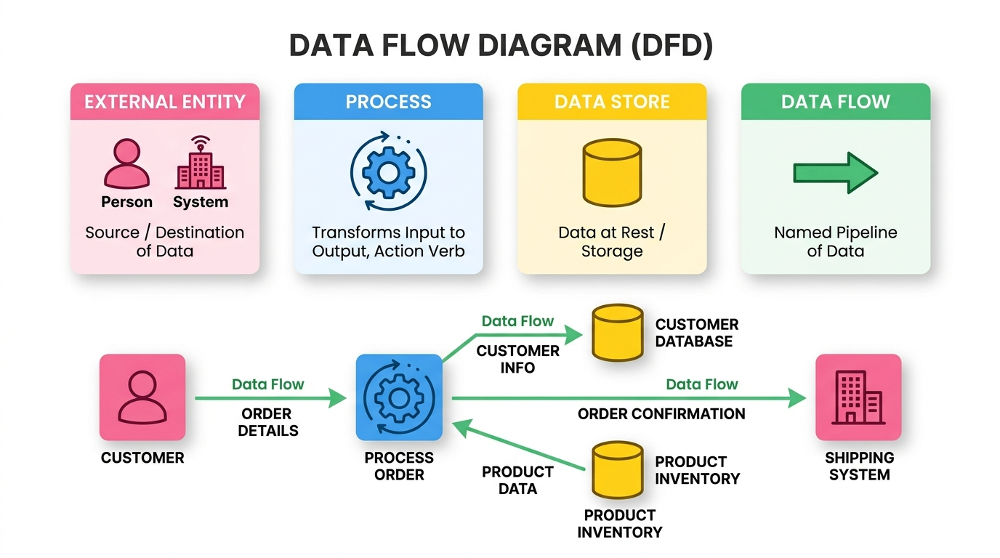
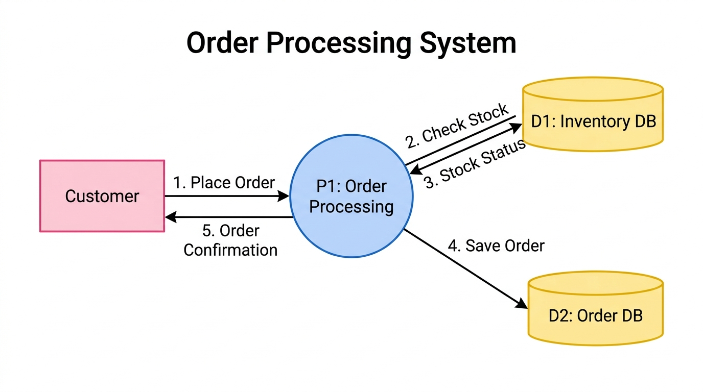
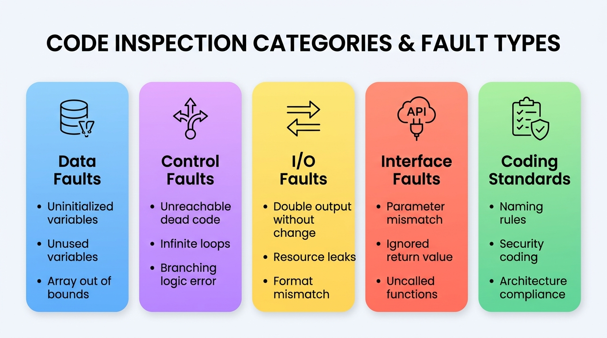

# Ch04 軟體檢視

> 到了測試階段才突然重視起品質，為時已晚。

## 4.1 基本概念

我們可能較常聽到軟體測試- 而且對他的印象都是「執行、觀看是否有錯誤」。事實上那只能看到「冰山的一角」，因為程式的複雜度很高，每一次執行所到的環境、狀態都不同，結果也會有所不同，這次是對的，未必代表程式是對的。例如一個程式：
 
```java
 for (int = 1; i< max; i++) 
    ...
```    

對於有經驗的工程師而言，檢視程式碼時就會懷疑為什麼 i 會從 1 開始，進而找出這個錯誤。但動態執行剛好能彰顯這個錯誤的機會可能不高。事實上，靜態程式碼檢視已經被視為效率很高、很重要的除錯方法。可惜國人用的並不多，可能是因為認識不夠，或是在趕案子的過程中省略到它了。


#### 軟體檢視 Software inspection 

軟體檢視是透過觀看、檢視原始碼來找出程式的錯誤或異常。我特別強調「*異常*」，包含不一致的資料型態定義、不一致的撰寫風格、沒有使用組織的元件等都可以視為異常，那是動態執行所看不出的。

「檢視」不只可以運用於程式碼的檢視，也可以擴大到需求規格書、設計規格書、配置的資料、測試資料等。正如同我們前面所提到的，軟體的錯誤來源大宗並不是原始碼、而是規格書、設計等，如果我們能夠早一點發現這些錯誤，就可以避免更大的錯誤、降低整體的品質成本。

> [!NOTE]
> 同儕審查是軟體產業的最佳實務作法。
> Inspections are a software industry best practice.


相較於動態測試，靜態檢視具備以下優點：

- 一次的檢視可以找到多個錯誤、較根本的錯誤根源。
- 動態測試的一個錯誤可能遮蔽其他的錯誤，造成一些錯誤無法被找到。
- 一些領域知識、程式技巧的知識傳承，方便我們檢視錯誤。
- 可以找到原始文件、程式碼的異常，有助於日後的維護，而非僅是執行上的問題。


> 軟體檢視不是取代動態測試，兩只是互補的關係。

檢視雖然有效，但卻無法取代動態測試。許多異常是無法檢視出來的，例如系統效能的問題，牽涉到整體系統的環境配置，光是靜態的檢視沒有辦法看出異常; 系統功能是否執行正確也須透過執行才能知道。


> 軟體檢視是技術活動，也是社群活動（social activity）。

軟體開發的過程中如果都是冷冰冰的電腦行為，將沒有辦法建立其企業的品質文化。軟體檢視需要大量的人與人之間的互動，不斷的交換其品質的觀念與作法，相關人員將因此學習品質提昇的技巧，是建立品質文化很重要的活動。

### 4.1.1 前置條件

- 有正確明確的規格。
- 成員應該了解熟悉組織標準。
- 已完成（某版本）最終的程式碼 （如果是程式碼檢視）。
- 有準備查核表（checklist）。
- 管理者必須接受檢視在初期會增加成本。
- 管理者不該把檢視當成員工考核。

#### **概念核對問答 (CCQ 1)**

**問題**

【是非題】靜態測試（如軟體檢視、規格檢視）可以在程式碼實際執行之前，檢查需求、設計、程式碼甚至測試資料中的異常，以早期發現錯誤、降低整體的軟體品質成本。

A) 正確 (True)
B) 錯誤 (False)

<details>
<summary>點擊查看【概念核對問答】答案與解析</summary>

**正確答案：A**

* **解析**：
  * **正確**：靜態測試的主要優勢在於不需執行程式即可找出問題。它可應用於軟體開發生命週期的任何階段（包括規格書、設計圖與程式碼），透過早期發現缺陷，能大幅降低後期修復 Bug 的成本（品質成本）。

</details>

---

## 4.2 檢視方法

靜態檢視已經發展出很多的作法，以下幾個因素需要考慮：


- **要不要印出來**？印出來看的會比較仔細，但有時間與環保問題。 Fagan 的 inspection 強調一定要印出文件，但隨著分散式的工作環境、環保、電子環境的成熟許多都透過系統來觀看文件。當然，印出文件來觀看仍有其獨特的效益。
- **會前會**？是否需要先有一個「檢視會議」之前的會議，講解專案的內容與檢視的重點。
- **誰是報告者**？程式的撰寫者或是其他人？由原工程師來報告是最簡便的方式，但有時候會有「球員兼裁判」或是「原作者的盲點」問題，由別人來報告可能更能凸顯問題。
- **檢視者事先的閱讀**？事先閱讀檢視可以加快檢視會議。
- **是否需要查核表**?有查核表才不會有遺漏，但有時也會被限制了項目。
- **誰當檢視者**? 一般而言會找公司內部較有經驗的工程師來進行檢驗，但有時會有同事間批判的問題。要養成「程式碼檢視提昇品質」的氛圍與文化，而不是批鬥大會。有時候也會找外面的專家來進行檢視，提供建議。
- **是否使用工具**？許多靜態檢視是可以透過工具來自動檢查的，例如「變數宣告卻未使用」。但多數時候需要人工，例如「資料結構設計是否合適」等。

IEEE-1028（審查與稽核標準）定義五種審查：Management review (管理審查)、Technical review (技術審查)、Inspection (檢視)、Walkthrough (走查)、Audit (稽核)。

#### table_inspection_workshrough

| Type | 檢視             | 走查     |
| ---- | ---------------- | -------- |
| 形式 | formal           | informal |
| 計畫 | 事先規劃角色成員 | 未計畫   |
| 導讀 | 導讀者           | 作者     |
| 記錄 | 記錄者           | 作者     |
| 主席 | 協調者 Moderator | 沒有     |


> 軟體檢視沒有絕對的形式，依組織特性客製化很重要。

[▶️ 觀看影片：軟體檢視與走查 (Software Inspection & Walkthrough)](https://youtu.be/ocMraYgqHvg)


### 4.2.1 流程 

比較完整的流程包含：計畫、會前會、個別準備、檢視會議、修改、再檢視。 
- **計畫**：選擇是適當的人來參與檢視，分配角色與任務。
- **會前會**：對專案與系統規格做一說明，方便後續審查。
- **個別準備**：各參與人員在正式會議之前，各自先行檢視目的物（程式碼或文件）並標記潛在缺陷。
- **檢視會議**：正式開始會議，由主持人引導，閱讀者導讀，並由記錄者登錄所有發現的缺陷。
- **修改**：依據會議產出的缺陷清單修改文件或程式碼。
- **再檢視**：依據上次的修改記錄進行再檢視，或由主席決定是否合格。




### 4.2.2 角色

一般而言，在檢視的流程中，會包含以下的角色：
- 作者或擁有者, 產生文件或程式者; 負責修改文件或程式者。
- 檢視者: 找出文件或程式中不一致、錯誤、缺陷的地方的人。
- 報告者 : 負責報告/導讀文件或程式者。有時候會是作者本人。
- 記錄者: 負責記錄會議過程與結果者。
- 主席或協調者: 管理會議流程或協調會議進行者。

> 軟體檢視不會自己動起來-- 它需要資源的挹注。

在執行軟體檢視之前，企業需要先規劃其流程，並且制定此流程需要的輔助，例如程序書（procedure）、表單（form）、檢核表（checklist）、教育訓練、工具以及「時間」等。

> 軟體檢視的哲學簡單的說就是- 同事找到錯誤，絕對比顧客找到錯誤來的好。
> We prefer to have a peer, rather than a customer, find a defect.

### 4.2.3 檢視的指引

- 人員的選擇與事先的準備	
	- 限制參與人員。
	- 事前做充分準備。
	- 將更多程式碼給評審員時，可能為了效率(Time boxing)就不會花費大量時間去評審，這樣一來效益就降低。
	- 針對每項工作產品發展相對的檢查清單。
	- 給審查員應有的審查工作時間與資源。	
	- 會議之前準備好所有相關材料
	- 在別人審查你的程式前，最好自我檢查。	
	

- 審查
	- 審查開始前，確保受審程式或文件作者先大致講解。
	- 審查軟體開發程序或所開發的產品，不是審查開發者個人。牢記批評或給建議很容易，但是真正執行是困難的。
	- 不要陷入辯論與反駁的口頭之爭。
	- 此為錯誤偵測而非問題解決會議。
	- 尊重每位參與者發表意見的權利與認真傾聽其意見。
	- 設定議程時間，並努力在預定議程時間內完成會議。
	- 審查的速度不宜過快，例如每次程式評審應少於 200–400 LOC/Hr (休息10分鐘)，依據不同的專案、技術有所不同。
	- 記錄會議中所有決議。
	- 處理後續的問題(Action item)並參與後續會議
				
### 4.2.4 AI 輔助下的現代檢視實踐 (AI-Assisted Inspection)



**圖形解說：**
* **Stage 1: AI 第一道防線 (AI First Line of Defense)**：當開發者提交 Pull Request 時，AI PR 審查機器人（如 PR-Agent、CodiumAI）自動生成變更摘要、掃除低階語法錯誤與程式碼臭味、並即時捕捉未釋放資源與基礎漏洞。
* **Stage 2: 人類專家複審 (Human Expert Review)**：人類檢視者聚焦於 AI 難以洞察的全局系統架構、領域商業邏輯正確性、以及系統可靠性不變量與邊界極端案例。
* **檢視角色的 AI 賦能 (Role Transformation)**：
  * **作者 (Author)**：於 IDE 本地透過 Copilot / Cursor 進行自我檢視與預防修復。
  * **檢視者 (Reviewer)**：在程式碼平台上與 AI 對話，進行深層威脅推演與並發死結模擬。
  * **記錄者 (Scribe)**：利用語音轉文字（STT）工具即時記錄會議結論，自動生成缺陷與行動項目（Action Items）清單。

在 2026 年的 AI 時代，**「人工檢視」**的流程已與 **大型語言模型（LLM）及 AI 代理（AI Agents）** 深度整合。AI 不僅大幅降低了人工檢視的時間成本，也重新定義了各階段的實踐方式：

#### 1. 流程典範轉移：從「純人工會議」到「AI 先行，人類把關」

傳統的軟體檢視（如 Fagan Inspection）需要團隊投入大量時間開會、人工逐行對照 Checklists。在現代軟體工程中，流程已轉變為：
* **AI 第一道防線（靜態審查）**：
  * 當開發者提交 Pull Request (PR) 時，CI/CD 流程中的 **AI PR 審查機器人**（如 *PR-Agent*, *CodiumAI*）會立即發起第一波檢視。
  * AI 負責快速掃除**低階錯誤**（如未釋放資源、命名風格、基礎漏洞、未捕獲的例外）並自動產出 PR 變更摘要與修改建議。
* **人機協同複審（人類焦點）**：
  * 人類檢視者（Reviewers）在會議或個別準備時，只需聚焦於 **AI 難以看透的全局架構、商業邏輯正確性、以及系統可靠性不變量**。這樣可以將檢視速度從傳統的 `200 LOC/Hr` 提升數倍，並減少疲勞導致的漏網之魚。

#### 2. 檢視角色的 AI 賦能

傳統的檢視角色（主持人、作者、閱讀者、記錄者）在 AI 的協助下有了新型態的工作方式：

* **作者 (Author) ── 自我檢視與預防**：
  * 在送出審查前，作者可利用 IDE 中的 AI 助手（如 Copilot, Cursor）對選定程式碼進行 `Explain` 或 `Review`，在本地就完成第一輪缺陷修復。
* **記錄者 (Scribe) ── 自動化會議記錄**：
  * 檢視會議中，團隊不再需要手動編寫繁瑣的缺失清單（Defect List）。AI 會議記錄工具能即時將口頭討論語音轉文字（STT），自動分類出系統缺陷、重工項目（Action Items）與負責人。
* **檢視者 (Reviewer) ── 智慧對話式審查**：
  * 審查員可以直接在程式碼平台上與 AI 對話，詢問：「這段並發處理是否有潛在的 Deadlock 危機？」或「請幫我模擬十種可能讓此方法崩潰的極端輸入」。

> [!TIP]
> **AI 審查的盲點**：AI 雖然速度快、知識庫龐大，但容易產生「幻覺」（Hallucination），或因為缺乏上下文而給出看似合理卻破壞整體架構的建議。因此，**「人類工程師的最終驗證與決策」依然是守護軟體品質無可取代的終極防線**。

以下幾節我們針對不同階段（需求規格階段、系統設計階段、系統開發階段）所進行的檢視做更詳細的描述。

#### **概念核對問答 (CCQ 2)**

**問題**

在 Fagan 提出的軟體檢視（Inspection）標準流程中，下列哪一個階段的主要目的是由作者向檢視小組說明背景資料與規則，而非進行實際的程式碼除錯？

A) 準備 (Preparation)
B) 概述 (Overview)
C) 檢視會議 (Inspection Meeting)
D) 重做 (Rework)

<details>
<summary>點擊查看【概念核對問答】答案與解析</summary>

**正確答案：B**

* **解析**：
  * **A) 錯誤**：準備階段是參與者各自研讀材料、尋找缺陷的獨立活動。
  * **B) 正確**：概述（Overview）階段是由作者向小組簡報，說明待檢視內容的背景脈絡、規格與應注意的設計規則，幫助小組成員建立共識。
  * **C) 錯誤**：檢視會議是全體角色聚集，以朗讀和討論方式逐步發現與記錄缺陷的會議。
  * **D) 錯誤**：重做階段是作者在會議後修復發現缺陷的階段。

</details>

---

## 4.3 規格檢視

規格的制定是開發流程一開始的步驟，如果這個步驟錯了，後面的矯正所需要的時間或成本就更大了。



**圖形解說：**
* **🎯 Correct (正確性)**：規格中的每項要求皆準確代表建構系統所需的真實內容。
* **🔍 Unambiguous (無歧義性)**：每條敘述僅有唯一合理解釋，避免產生誤解。
* **📦 Complete (完整性)**：軟體應完成的所有任務與邊界條件皆完整包含在 SRS 中。
* **✅ Verifiable (可驗證性)**：存在有限成本效益的過程，能由人或機器客觀檢驗軟體是否符合該要求。
* **⚖️ Consistent (一致性)**：內外部條款互不衝突，各要求子集之間亦保持一致。
* **🔗 Traceable (可追溯性)**：具備清晰的雙向追溯鏈（可回溯至來源需求，亦可向前追溯至設計與測試組件）。
* **🧩 Design-Independent (設計獨立性)**：專注於「要做什麼」，不預先限制特定架構或演算法。
* **🤝 Understandable (易理解性)**：條理清晰，使非技術背景的客戶與利害關係人亦能輕鬆閱讀並理解。

#### 系統規格檢視（SRS Review）核心檢核清單：

- 🎯 **Correct (正確)**：其中所述的每一個要求都代表了建構系統所需的內容。
- 🔍 **Unambiguous (不模稜兩可)**：其中所述的每一個要求只有一種解釋。
- 📦 **Complete (完整的)**：軟體應該完成的所有任務都包含在 SRS 中。
- ✅ **Verifiable (可驗證的)**：當且僅當其中的每一個要求都是可驗證的時，SRS 才是可驗證的；一個要求是可驗證的當且僅當存在某個有限成本效益的過程，人或機器可以通過該過程檢查實際構建的軟體產品是否符合該要求。
- ⚖️ **Consistent (一致的)**：其中沒有一個要求與其他前置文件相衝突，且 SRS 內部的要求子集不相衝突。
- 🤝 **Understandable (顧客能了解的)**：顧客與利害關係人能夠順暢閱讀並理解規範。
- 🔗 **Traceable (可追溯/可回溯的)**：
  - **Traced (可回溯)**：建立客戶需求和系統需求之間的追溯性，每個要求的起源皆清晰明確。
  - **Traceable (可向前追溯)**：為了設計或測試軟體的任何組件，必須知道哪些要求正在被該組件滿足。
- 🧩 **Design-Independent (設計獨立的)**：不暗示特定的軟體架構或演算法；SRS 中的任何要求都不應該限制設計只能有單一替代方案。
- ✂️ **Concise (簡潔的)**：文字精煉扼要，不包含無意義的贅述。
- 🗂️ **Organized (有組織的)**：其中包含的要求易於查找，要求被妥善安排在相互關聯的位置。

---

規格又可以細分為需求規格與系統規格，比較嚴格的流程還可以區分需求規格檢視與系統規格檢視。

> 當一個規格是不模糊的、可驗證的、完整且一致的，對客戶而言它可能是不容易了解的。
> When an SRS is  un-ambiguous, more verifiable, complete and consistent, it is not understandable by customers. 

寫規格書的一些實用建議（7 大撰寫準則）：



**圖形解說：**
* **Structured Format (結構化排版)**：以結構化層次組織文件，具備完整目錄、章節標題、索引表與字彙表（定義所有縮寫）。
* **Visual Diagrams (視覺架構圖)**：解釋系統結構時畫圖輔助說明，圖文名詞與圖形符號保持一致，並附文字解說。
* **Concrete Examples (具體範例)**：定義數學公式或複雜計算時，用文字解釋並至少搭配兩個具體數據範例。
* **Precise Wording (精確用詞)**：杜絕模糊詞彙（如「一些、通常、大部分、等等、依此類推」），明確界定處理（Process）流程。
* **Realistic Scope (務實邊界)**：避免使用過度絕對的詞彙（如「總是、所有、絕不、很明顯地」），嚴防邏輯漏洞。
* **Active Voice (主動語態)**：避免模糊被動句（如「參數會被初始化」），明確指定執行主體與責任歸屬。
* **Explicit Versions (明確版本)**：提及外部相依套件、通訊協定或平台時，務必精確標註支援之版本號。

#### 規格撰寫最佳實務檢核清單：

- 📑 **Structured Format (結構組織)**：
  - 以結構化方式組織文件，包含目錄、索引表與字彙縮寫定義表。
  - 始終站在非技術讀者角度思考：「若對此系統不熟悉，能否輕易讀懂？」
- 🖼️ **Visual Diagrams (圖文並茂)**：
  - 解釋架構或關聯時繪製圖形輔助，圖形符號與專有名詞前後保持一致。
  - 所有架構圖皆需附上文字說明，確保圖文相輔相成。
- 🔢 **Concrete Examples (具體範例)**：
  - 寫出數學式時以文字詳細說明；定義演算法或計算規則時，至少提供兩個具體實例輔助理解。
- 🎯 **Precise Wording (精確用詞)**：
  - 避免「一些、有時候、通常、大部分」等模糊量詞，改用精確數值或範圍。
  - 避免在列表後使用「等等、依此類推、類似」，明確列舉完整範圍。
  - 說明「處理 (Process)」時，必須具體寫出「如何被處理」。
- 🚫 **Realistic Scope (務實邊界)**：
  - 謹慎使用「總是、所有、沒有任何、都不會」等絕對詞，確認極端邊界是否真能達成。
  - 避免濫用「很明顯的、顯然的、因此」，確保每個結論具備嚴謹邏輯依據。
- 👤 **Active Voice (主動語態)**：
  - 儘量避免被動語態（如「參數會被初始化」），明確指名「由何元件/模組初始化」。
- 🏷️ **Explicit Versions (明確版本)**：
  - 提及支援某軟體、第三方套件或網路協定時，必須清楚指明所支援之確切版本。


❓ 針對此 [智慧校園服務系統- 軟體需求規格書](https://drive.google.com/file/d/0B_Be8Sd_tsM7S0t6bE5KV1hGeWs/view?usp=sharing)，透過上述的查核表檢查此規格是否合適。

❓ 課堂練習：針對一個三角形判斷的系統，寫出其規格書。透過上述的查核表檢查此規格是否合適。

> 品質的最簡單、最困難與最有效果的作法：review, review, review!

#### **概念核對問答 (CCQ 3)**

**問題**

為了在需求與系統規格階段做到「雙向追溯 (Bidirectional Traceability)」，規格書應該確保具備下列何種關係特性？

A) 每個使用者需求均可對應到特定的系統規格，且每個系統規格皆能回溯到其來源需求 (Traced & Traceable)
B) 規格書的字數與最終程式碼行數必須成固定正比關係
C) 每一行程式碼都必須直接對應到 UML 類別圖的所有屬性
D) 規格書必須僅由開發人員撰寫，完全不允許顧客檢閱以防模糊焦點

<details>
<summary>點擊查看【概念核對問答】答案與解析</summary>

**正確答案：A**

* **解析**：
  * **A) 正確**：雙向追溯（Bidirectional Traceability）是指前向追溯（每一項使用者需求都有對應的系統規格與測試案例來滿足）與後向追溯（每一項系統規格、程式碼與測試案例都有明確的來源需求，而非憑空捏造）。這能確保開發既不遺漏需求，也沒有開發不必要的功能。
  * **B) 錯誤**：規格書長度與程式碼行數並無此正比規律。
  * **C) 錯誤**：規格書是針對系統需求與規格的追溯，不是逐行對應程式碼與類別屬性。
  * **D) 錯誤**：規格檢視必須有顧客或領域專家的參與，以確認系統設計與其真實期望一致。

</details>

---

## 4.4 設計檢視



設計檢視（Design Review/Inspection）是在系統實作（撰寫程式碼）之前，對軟體系統的架構、模組關係、介面設計（API）以及資料庫模型（Schema）所進行的靜態審查。

### 4.4.1 設計檢視的基本概念與流程

* **核心目的**：
  * **及早防錯（Shift-Left）**：設計階段的錯誤（如架構選型失誤、高耦合模組、資料庫設計瑕疵）若流到實作或測試階段才被發現，其修正成本將呈指數級增長。
  * **確保非功能性屬性**：審查系統是否能滿足效能效率、安全性、可維護性、可靠性等 ISO 25010 所規範的品質指標。
* **做法與流程**：
  1. **準備階段**：設計團隊提供架構設計書、UML 圖（類別圖、順序圖等）、API 規格書（如 OpenAPI Spec）與資料庫關係圖（ERD），並備妥「設計檢核表 (Design Checklist)」。
  2. **個別準備**：審查委員（技術主管、資安人員、同儕開發者）各自閱讀設計文件，標記不合理之處。
  3. **審查會議**：召開會議討論，聚焦於介面界接、異常處理機制、系統容錯力，但不討論具體演算法實作細節。
  4. **追蹤修改**：整理缺失，追蹤架構修正，確認無虞後方可啟動程式碼撰寫。

### 4.4.2 AI 輔助下的現代設計檢視

傳統設計檢視高度依賴資深工程師的直覺，耗時耗力。現代軟體工程結合生成式 AI（如 LLMs）已發展出新做法：
* **威脅建模與風險推演**：
  * 審查者可以將系統架構的文字描述或設計草圖輸入 AI，讓 AI 代理模擬攻擊者視角或極端併發情境，提出潛在風險（如：單點故障 SPOF、競爭條件 Race Condition、快取失效雪崩等）。
* **API 規格書與合約一致性檢測**：
  * AI 可自動掃描 OpenAPI (Swagger) 規格書，檢查介面命名規範、是否遺漏狀態碼定義（如 400 Bad Request、401 Unauthorized 等），並自動生成對應的測試合約（Contract）。
* **資料庫綱要效能與架構評估**：
  * AI 可以分析資料庫 DDL 腳本，自動檢查外鍵（Foreign Key）是否漏設索引、評估大量寫入時的鎖定效能，並針對讀寫分離與反正規化（Denormalization）提出前置建議。

#### **概念核對問答 (CCQ 4)**

**問題**

【是非題】設計檢視（Design Review）最理想的執行時機，是在系統所有模組的單元測試與整合測試皆通過之後，以確保實際產出的系統與設計文件相符。

A) 正確 (True)
B) 錯誤 (False)

<details>
<summary>點擊查看【概念核對問答】答案與解析</summary>

**正確答案：B**

* **解析**：
  * **錯誤**：設計檢視應遵循「及早測試（Shift-Left）」原則，在**程式碼撰寫（Coding）開始之前**就進行。如果等到測試階段才發現架構設計的瑕疵，此時資料庫與程式碼都已成形，修改的代價將會非常高昂。

</details>

---

下圖為一個簡約的設計查核表，檢查設計是滿足完整性、邏輯性、特殊情況的處理、方法呼叫、命名、與標準是否符合規範。

#### desgin_checklist

| 項目     | 說明                                                           | Pass? | 備註 |
| -------- | -------------------------------------------------------------- | ----- | ---- |
| 一般性   | 是否完成每一個審查步驟。                                       |       |      |
| 完整性   | 是否此設計規格，涵蓋所有相關需求描述、需求規格、高階設計規格。 |       |      |
| 邏輯性   | 驗證數學公式、運算流程的正確性。                               |       |      |
| 特殊情況 | 檢查所有特殊狀況，是否處理所有不正確的輸入。                   |       |      |
| 方法呼叫 | 檢查所有介面都精確的定義。                                     |       |      |
| 命名     | 所有特別的名稱和型態都被清楚定義。                             |       |      |
| 標準     | 是否遵循所有相關組織標準。                                     |       |      |


更完整的設計檢核表可歸納為以下五大核心維度（組織亦可依特性客製調整）：

1. **實體與介面完整性 (Entities & Interfaces)**
   - 各設計實體（模組、資料庫、檔案）皆具備唯一識別碼、明確目的與相依關係。
   - 元件介面細節完整（副程式名稱、參數型態、回傳值、前置/後置條件等）。
   - 避免洩漏不必要的內部實作細節，維持良好模組封裝。
2. **架構品質與設計原則 (Architecture & Principles)**
   - 符合高內聚力、低耦合度（High Cohesion, Low Coupling）原則。
   - 採用階層式模組聚合，架構簡潔直覺、易於理解與維護。
   - 優先重複利用標準化、成熟穩定的元件。
3. **需求追溯與功能完整 (Traceability & Completeness)**
   - 架構完整涵蓋所有系統需求，並清楚記錄採取此架構設計之決策理由。
   - 逐一檢視關鍵與高風險需求，確認架構能被確實滿足。
   - 提出的解決方案具備工程可行性，元件可被單獨建構與順暢整合。
4. **多維度架構視角 (Architectural Views)**
   - **邏輯視角 (Logical View)**：透過類別圖或概念模型明確定義各邏輯實體職責。
   - **行程視角 (Process View)**：清楚描述執行緒配置、並行控制、狀態互動與生命週期。
   - **實體與開發視角 (Physical & Development View)**：透過部署圖（Deployment Diagram）定義硬體/網路配置與系統建置結構。
5. **關鍵非功能設計議題 (Key Design Issues)**
   - 例外處理與系統復原機制（Exception handling, Initialization & Reset）。
   - 資源管理與安全防護（Memory management & Security）。
   - 國際化與內建測試/輔助機制（Internationalization, Built-in help & Test facilities）。

### 4.4.3 設計模型檢核

當我們進行設計時，我們會採用一些設計模型，例如 DFD, UML, ER model 等。除了這些模型是「圖形視覺化」以外，另一個優點是這些模型有一定的規範，便於我們進行檢核。

DFD/ER model 是一個我們經常用來做系統設計的工具，設計完成後我們需要進行檢驗。



**圖形解說：**
* **External Entity (外部實體)**：代表發送訊息至系統或從系統接收訊息的外部人員或系統（資料來源或終點）。
* **Process (處理過程)**：代表將輸入資料轉換為輸出資料的處理動作，名稱通常以「動詞 + 名詞」形式命名。
* **Data Store (資料儲存)**：代表靜態保存資料的儲存庫、資料庫表格或檔案。
* **Data Flow (資料流)**：代表資料在實體、處理過程與資料儲存之間流動的有向管道，必須清楚標示資料名稱。

#### DFD 檢核要點 (Inspection Checklist)：
- **外部實體 (External Entity)**：必須是發送訊息到系統或從系統接收訊息的外部人員或第三方系統。
- **資料流標籤 (Data Flow)**：資料流必須始終帶有包含資料內容的標籤，在名稱中應使用名詞而非動詞。
- **層級一致性 (Consistency)**：父級與子級圖表應該是一致的；在一級 DFD 上出現的外部實體與資料流，必須與上下文圖表（Context Diagram）完全吻合。
- **流向正確性 (Flow Direction)**：嚴格檢查資料流入與流出資料儲存（Data Store）的方向是否合乎邏輯。
- **處理平衡 (Process Balance)**：確保每個處理過程（Process）至少具備一個**輸入**和一個**輸出**。
- **儲存平衡 (Store Balance)**：每個資料儲存應該在 DFD 流程中具備**至少一個輸入（寫入）和一個輸出（讀取）**。
- **動作命名 (Action Naming)**：每個處理過程的名稱應該以一個**動詞**或「動詞 + 名詞」形式開頭。



**圖形解說：**
* **顧客訂單流程 (Order Processing Flow)**：
  * `1. 提交訂單 (Place Order)`：外部實體（顧客 Customer）傳送訂單資料至處理過程（P1: 訂單處理 Order Processing）。
  * `2. 檢查庫存 (Check Stock) / 3. 庫存狀態 (Stock Status)`：訂單處理過程向資料儲存（D1: 庫存資料庫 Inventory DB）發起庫存查詢並接收即時庫存狀態。
  * `4. 寫入訂單 (Save Order)`：確認庫存後，將有效訂單寫入資料儲存（D2: 訂單資料庫 Order DB）。
  * `5. 出貨確認 (Order Confirmation)`：處理過程回傳出貨通知與確認訊息給外部實體（顧客 Customer）。

這只是 DFD 的檢核表，如果組織採用的是其他的設計模型，就應該建立其相關的檢核表。

> 經驗老道的工程師或許可以不需要檢核表而進行檢核，但在那之前，檢核表是必須的。

## 4.5 🧑‍💻程式碼檢視

程式碼檢視（Code Inspection）是靜態測試的核心實踐，透過結構化檢核表在編譯與測試執行前掃除各類潛在缺陷。



**圖形解說：**
* **Data Faults (資料錯誤)**：變數未初始化即使用、宣告未用、重複賦值未讀取或陣列索引越界。
* **Control Faults (控制流程錯誤)**：包含無法執行的無效死碼（Unreachable code）、潛在無窮迴圈或邏輯跳轉缺陷。
* **I/O Faults (輸入/輸出錯誤)**：重複輸出未改變數值、檔案串流未關閉或格式不符等 I/O 異常。
* **Interface Faults (介面錯誤)**：方法參數型態/數量不吻合、忽略回傳值、或宣告未被呼叫的孤立方法。
* **Coding Standards (編碼規範)**：命名慣例、安全編碼規範與架構分層存取守則。

#### 程式碼檢視常見缺陷分類與檢核項目：

- 📊 **Data Faults (資料錯誤)**
  - ⚠️ **Uninitialized Variables**：變數未初始化即使用 (*Variables used before initialization*)
  - 🗑️ **Unused Variables**：變數宣告卻從未使用 (*Variables declared but never used*)
  - 🔄 **Redundant Assignment**：變數被指定兩次值，但過程中未被使用 (*Variables assigned twice but never used*)
  - 🚫 **Array Bound Violations**：超過陣列索引界限之風險 (*Possible array bound violations*)
  - ❓ **Undeclared Variables**：使用未宣告之變數 (*Undeclared variables*)
- 🔀 **Control Faults (控制流程錯誤)**
  - 🛑 **Unreachable Code**：無法到達的死碼 (*Unreachable code*)
  - ♾️ **Loop / Jump Faults**：邏輯跳轉異常或潛在無窮迴圈
- 📥 **I/O Faults (輸入輸出錯誤)**
  - 🖨️ **Duplicate Output**：變數值連續輸出兩次，但中間未給定新值 (*Variables output twice with no intervening assignment*)
  - 💾 **Unclosed Resources**：I/O 資料串流或檔案開啟後未正確關閉釋放
- 🔌 **Interface Faults (介面錯誤)**
  - ⚡ **Parameter Type Mismatches**：呼叫時參數型態不吻合
  - 🔢 **Parameter Number Mismatches**：呼叫時參數個數不符
  - 📭 **Ignored Return Values**：方法執行的回傳結果未被接收使用 (*Non-usage of the results of functions*)
  - 👻 **Uncalled Functions**：不曾被呼叫的冗餘功能或方法 (*Uncalled functions and procedures*)
- 📐 **Coding Standards (編碼規範)**
  - 🏷️ **Naming Conventions**：變數、類別與方法之命名規範
  - 🔗 **Interface Integration**：介面整合與模組封裝規範
  - 🗃️ **Query Standards**：資料庫查詢與存取規範
  - 🛡️ **Secure Coding**：安全編碼規範（防範 SQL 注入、XSS 等）

#### 遭透了的變數命名


```java
String OwO, OnO, OuO
int qwq, qnq, quq
float oOooo, ooOoo, oooOo
```

> [!NOTE]
> 好的程式本身就是最好的註解。加程式註解前想想：如何改善程式碼讓我不需要加這個註解？改善程式碼並加上註解讓你的程式更清楚。
>> Good code is its own best documentation. As you're about to add a comment, ask yourself, "How can I improve the code so that this comment isn't needed? Improve the code and then document it to make it even clearer. -- *Steve McConnell*

### 4.5.1 程式臭味檢視


程式碼審查時也會針對程式碼臭味進行檢驗，並提出一些重整的建議。以下是部分 Folwer 提出的程式臭味：

- *重複的程式碼 Duplicated Code*。重複的程式碼應該抽出來集中在一個類別（或元件）中，需要的時候再去繼承或呼叫。重複的程式碼的維護性很低：我們常常改了這個忘了改另一個。
- *冗長的方法 Long Method*。一個1000 行的程式碼好不好看得懂？好不好維護？一個方法通常代表一個處理的流程或演算法，大到某個程度後我們就必須要學會「抽象」- 把部分的流程抽象到另一個方法裡。
- *大類別 Large Class*。同理，一個大類別包含很多的屬性、方法讓程式員難以理解類別的責任，應該把責任做分割，交給另一個類別來做。
- *太長的參數列 Long Parameter List*。參數太多太長時（想像一下，10個參數），參數代表一個方法可以調整的靈活度，有其複雜度，太多的參數令人難以理解該方法的彈性。一樣，我們應該把部分的參數彙整起來，抽象成另一個物件類別。
- *發散變更 Divergent Change*：一個類別有太多的變更原因。一個類別最好能有一個專一的功能，也就是內聚力要高，方法之間是有關係的。這也表示不要炒大鍋菜一樣把不相關的功能都擠在一個類別內。
- *散彈槍手術 Shotgun Surgery*：一個變更，要改很多其他模組。想像一下一個「班級人數」的值散落在10 個模組裡，當這個人數值需要改變時，你需要翻箱倒櫃的修改這十個模組。如果這個值是放在一個設定檔中，模組啟動時去讀這個檔就好了，哪麼你的修改就會少很多。
- *依戀情結 Feature Envy*：一個計算要取好多其他類別的值。一個內聚力強的類別其計算會用到該類別的屬性，例如一個 Circle 的物件，有一個 area() 的方法來計算他的面積會用到他內部的屬性 ridius，少許的引用其他類別的資料來運算當然也很正常，但如果過份的依賴大量其他的類別，那麼你的抽象化可能就出現了問題。是不是這個計算應該移到別的類別中？
- *資料泥團 Data Clumps*：常常會一起出現的資料卻沒有抽象呈一個類別型態。例如說住址，有一群的城市、街道、ZIP code、號等字串出現，為什麼不把它抽象成 Address 的類別呢？
- *基本型別偏執 Primitive Obsession*：不用小類別，堅持用基本型別。例如「錢」的這個變數，你可能會用 int money 來代表，又發現需要描述是哪個國家的幣值，所以又加了一個變數 String country。這會讓程式碼變得凌亂難懂，其實我們可以宣告一個小類別 Money，裡面包含這兩個屬性。
- *Switch 敘述句*：太多的 switch case, 不會用多型。Switch 有一個缺點，當你要新增一個 case 選項時，你需要修改程式碼。如果我們本來就預期會有 case 的改變，那麼就用多型吧，至少可以不在修改程式的情況下，透過擴充來完成彈性的設計。
- *冗員類別 Lazy Class*：沒什麼功能的類別。
- *不實用的一般性 Speculative Generality*: 預留的太多不實用的擴充點。為了滿足「擴充性上的彈性」，我們常常會把程式寫的複雜些 可以看看 design pattern 的書，但是仔細想一想，是不是這些擴充真的需要？還是為了設計而設計。
- *暫時欄位 Temporary Field*: 有一些暫時欄位只對某些特殊的方法或特殊時機才會用到，令人難以了解他的意義。例如為了不想傳太多參數就把某些值以 instance variable 的方式寫在類別內。
- *過度的訊息串 Message Chains*：`a.getB().getC().getD()` ... 當訊息串過長時可能是功能封裝的有問題，可能要考慮直接的訊息傳遞。
- *過度的中間人 Middle Man*：太多的方法都是透過委託來進行，該類別的方法封裝要考慮改寫。
- *狎暱關係 Inappropriate Intimacy*：類別間的過於親密的屬性存取，可以考慮分開來以 delegation 的方式來進行。例如不適當的宣告子類別，讓子類別任意存取父類別的資料。

### 4.5.2 安全漏洞檢視 (OWASP Top 10)


在進行程式碼檢視（Code Inspection）時，除了找出程式臭味與邏輯錯誤外，**安全性漏洞**的檢測也是重中之重。OWASP（Open Web Application Security Project，開放網路應用程式安全計畫）定期發布的 **OWASP Top 10** 是全球公認最關鍵的十大 Web 應用程式安全漏洞指標。

靜態程式碼分析（SAST）工具（如 PMD、SonarQube）能有效自動化掃描出符合 OWASP Top 10 的安全性缺陷，防患於未然。

#### 2021 年版 OWASP 十大安全漏洞說明

1. **A01:2021-Broken Access Control (權限控制失效)**
   * **說明**：使用者能夠存取未經授權的資源或執行未授權的操作（例如直接存取其他使用者的敏感資料或管理頁面）。
   * **檢視重點**：檢查控制器（Controller）或 API 入口是否有明確的權限驗證與角色控制，避免使用未經防護的直接物件參照（IDOR）。

2. **A02:2021-Cryptographic Failures (加密機制失效)**
   * **說明**：敏感資料（如密碼、信用卡號、個人隱私資料）在傳輸或儲存時未經保護，或使用了過時且脆弱的加密演算法（如 MD5, SHA-1）。
   * **檢視重點**：檢查密碼是否使用強雜湊（如 BCrypt、Argon2）並加鹽（Salt）；傳輸過程是否強制使用 HTTPS；敏感配置是否硬編碼（Hardcoded）在程式碼中。

3. **A03:2021-Injection (注入攻擊)**
   * **說明**：系統將不受信任的使用者輸入直接拼接到指令或查詢語句中，導致程式將資料誤判為指令執行（例如 SQL 注入、OS 指令注入、跨網站指令碼攻擊 XSS）。
   * **檢視重點**：檢查資料庫查詢是否皆使用參數化查詢（Prepared Statements / Parameterized Queries）；對外部輸入是否進行嚴格的過濾與編碼。

4. **A04:2021-Insecure Design (不安全設計)**
   * **說明**：系統在設計與架構階段就存在安全性缺陷，而非實作時的錯誤。例如缺少防威脅建模、安全設計指引或極限防禦機制。
   * **檢視重點**：評估整體架構是否遵循「最小權限原則」（Principle of Least Privilege）與「縱深防禦」（Defense in Depth）。

5. **A05:2021-Security Misconfiguration (安全設定錯誤)**
   * **說明**：伺服器、框架或應用程式沒有經過安全的初始化設定，例如開啟了不必要的預設功能、預設帳密未修改、或在生產環境中開啟了詳細的 Debug 錯誤追蹤堆疊。
   * **檢視重點**：檢查部署設定檔，確保關閉詳細的異常錯誤堆疊輸出，避免將內部系統資訊洩露給攻擊者。

6. **A06:2021-Vulnerable and Outdated Components (易受攻擊與過時的元件)**
   * **說明**：專案中使用了已知有漏洞、過期或未維護的第三方函式庫或框架組件。
   * **檢視重點**：使用依賴項掃描工具（如 Dependency-Check）定期盤點第三方 dependency，並保持升級。

7. **A07:2021-Identification and Authentication Failures (識別與身分驗證失效)**
   * **說明**：系統的身分驗證機制存在漏洞，使攻擊者能夠竊取 session、憑證或冒充使用者（例如未防護暴力破解、密碼長度過短、Session ID 可被預測）。
   * **檢視重點**：確認有防範暴力破解機制、密碼強度符合規範、Session token 具備適當生命週期。

8. **A08:2021-Software and Data Integrity Failures (軟體與資料完整性失效)**
   * **說明**：在沒有進行完整性驗證的情況下，反序列化不受信任的資料，或引入不可信的套件庫更新來源，導致惡意程式碼被植入與執行。
   * **檢視重點**：避免對不受信任的輸入進行直接的反序列化（Java Deserialization）；驗證下載元件的簽章與雜湊值。

9. **A09:2021-Security Logging and Monitoring Failures (安全記錄與監控失效)**
   * **說明**：沒有妥善記錄敏感安全性事件（如登入失敗、授權失敗），或日誌沒有得到適當監控，導致資安事件發生時無法及時偵測與事後追查。
   * **檢視重點**：重要權限變更、系統錯誤、重要交易必須撰寫結構化日誌，並建立對應的警報機制。

10. **A10:2021-Server-Side Request Forgery (SSRF，伺服器端請求偽造)**
    * **說明**：Web 應用程式在未經驗證的情況下，根據使用者提供的 URL 參數發起伺服器端請求，導致攻擊者可利用伺服器作為跳板，探測內部私有網路。
    * **檢視重點**：對使用者傳入的 URL 或 IP 進行嚴格白名單校驗，並限制伺服器可對外訪問的通訊協定與連接埠。

#### **概念核對問答 (CCQ 5)**

**問題**

【是非題】在程式碼檢視中，若發現系統直接將詳細的例外錯誤堆疊資訊（如 `e.printStackTrace()`）輸出至前端頁面或公開日誌，這屬於 OWASP Top 10 中的「A05:2021-安全設定錯誤 (Security Misconfiguration)」漏洞範疇。

A) 正確 (True)
B) 錯誤 (False)

<details>
<summary>點擊查看【概念核對問答】答案與解析</summary>

**正確答案：A**

* **解析**：
  * **正確**：在生產環境中輸出詳細的 Debug 資訊或錯誤堆疊（Stack Trace），會將系統內部的元件版本、程式碼路徑及資料庫結構暴露給外部，這屬於典型且嚴重的「安全設定錯誤 (Security Misconfiguration)」。正確做法應使用結構化日誌（如 Logback/SLF4J）將詳細錯誤記在後台受保護的日誌檔中，對前端使用者則回傳友善且模糊的錯誤訊息（如「系統發生未知錯誤，請聯絡管理員」）。

</details>

---

### 4.5.3 🧑‍💻PMD 工具使用

[Lab: PMD introduction](/HklWznIsJg)

## 4.6 檢視的評估

一般而言，檢視可降低後續測試時間與增加測試品質，即降低錯誤數量(預測最終軟體仍然存在的錯誤量)。但如何評估檢視的效益？仍可透過量化方法加以統計分析以作為後續改良的依據：

- **缺失偵測效率**(Error defection efficiency)：每個小時審查發現缺失的數量，每一頁或每一行(LOC)發現缺失的數量。
- 審查記錄上，特定型態(reqts/design/code)的錯誤偵測數量/所有測試方法找出的錯誤數量。
- **成本效用**(Cost effectiveness): 由審查者找出錯誤的成本，與此錯誤若留到後面修復，測試、與除錯所花的成本，兩者的比率。
- **錯誤密度**(Defect Density)：審查報告或錯誤報告中錯誤的數量，除以，預估程式的大小。
- **錯誤移除率** (Defect removal leverage (DRL))：針對兩個不同階段，每小時錯誤移除的比率。可比較出兩個不同階段，使用不同程序的相對效果。

為了計算這些度量，我們需要收集以下資訊：

- 審查專案的大小
- 審查花費的時間
- 缺失發現的數量
- 缺失未發現，但在之後的再次審查、或測試、或使用者使用時出現的缺失數量

> A: 你每小時可以寫多 少行程式碼?
> B:你每千行 會產生多少個 Bug?

#### **概念核對問答 (CCQ 6)**

**問題**

組織在推行軟體檢視與審查時，常會使用度量指標來評估其效率。下列關於「檢視速率 (Review Rate)」與「檢視品質」的敘述，何者最為正確？

A) 檢視速率愈快（如每小時檢視 2000 行），代表檢視品質愈高、找出的缺陷愈多
B) 檢視速率過快通常會導致缺陷遺漏率（Defect Leakage）增高，因此應維持在建議的合理速率內
C) 為了大幅提升開發速度，檢視會議應儘可能限制在 5 分鐘內結束
D) 度量指標在軟體工程中的主要目的是用於懲罰寫出最多缺陷的工程師

<details>
<summary>點擊查看【概念核對問答】答案與解析</summary>

**正確答案：B**

* **解析**：
  * **A) 錯誤**：檢視速率太快代表走馬看花，通常會漏掉許多深層的設計或邏輯錯誤，品質反而下降。
  * **B) 正確**：如果檢視人員每小時閱讀的程式碼或規格書行數超出合理負荷，便無法仔細推敲，導致缺陷漏到後續階段（Defect Leakage），因此維持在組織建議的步調內非常重要。
  * **C) 錯誤**：檢視會議需要充分的時間朗讀並發掘缺陷，限時 5 分鐘無法達成檢視目的。
  * **D) 錯誤**：度量指標的目的是進行過程改善、預測軟體品質與衡量檢視活動本身的成效，絕非用來懲罰員工。

</details>

---


## 4.7 練習

### 4.7.1 軟體檢視
- 關於軟體檢視（software inspection）以下何者為真？
    - 軟體檢視的成本較高，但可以有效的取代動態測試。
	- 軟體檢視的範圍侷限在程式碼檢視。 
	- 軟體檢視通常需要檢查表，而檢查表會依據檢查項目與作法有所不同。 
	- 軟體檢視除了可以檢查軟體的問題，也可以同時考核員工能力，是一舉數得的作法。
- 靜態測試的前置條件為何？
- 一般的軟體檢視的流程為何？
- 軟體檢視通常有哪些角色？

### 4.7.2 規格檢視
- 以下不是一個好的系統規格應具備的特性 	
	- 應該描述系統設計的架構 
	- 應該清楚不模糊 
	- 應該可以回朔到使用者需求 
	- 應該是可以測試的
- 設計檢視的項目不該具備以下項目？	
	- 應包含所有需求 
	- 公開元件的介面介紹應該描述清楚 
	- 對於設計圖形與數學式應該清楚描述 
	- 應該包含架構的考量 
	- 應該採取單一且明確的角度來描述設計，比免從多個角度描述
- 一個好的系統規格，應該具備哪些特性？
- 系統規格中，可回朔（traced）與可追朔（traceable）的差別為何？
- 描述「三角形判斷系統」的規格，並以規格檢查表檢查是否通過。

### 4.7.3 設計檢視

- 進行系統設計檢視時，檢視的項目有哪些？請列出三項。
- 針對「三角形判斷系統」進行設計，並以設計檢查表檢查是否通過。
- 針對過去執行過或是目前正在執行的專案（專題），設計一張「設計檢視」查核表。
- 針對一個簡易的「線上考試系統」設計 DFD，講義中的檢核表來來檢驗看看是否正確。

### 4.7.4 程式碼檢視

- 針對「三角形判斷系統」進行實作，並以程式碼檢視的方式查看是否通過。
- 撰寫一個 HelloWorld, 符合 Google coding style
- 同上，變更為 Sun coding style
- 撰寫一個方法，取得兩數的最大公因數，符合 Google coding style
- 同上，修改 Google coding style 存成 BearBig coding style
- 列出五個 Folwer 的程式臭味。

### 4.7.5 檢視的評估
- 「缺失到後面的階段，付出的成本越大」，為什麼我們知道這樣的現象？以工程的角度需要數據來收集計算比較。試說明需要收集哪些資料，如何計算。

### 4.7.6 綜合
- 分為開發組與檢核組，針對一個線上考試系統的子系統「線上出題」，開發組規劃一個系統規格書，檢核組則設計檢核表，並進行檢核。