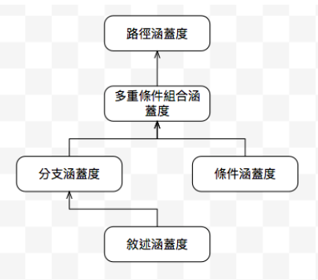
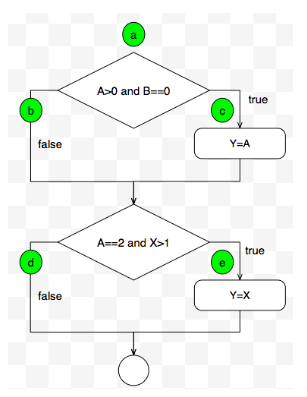
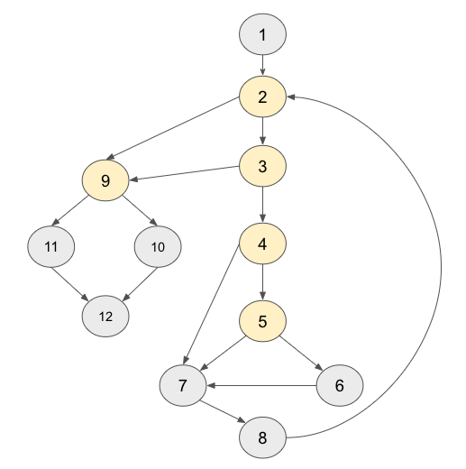
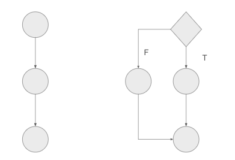
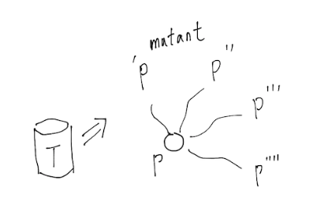
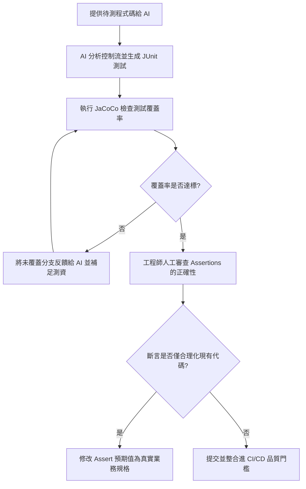

# Ch06 白箱測試

白箱測試是只在知道程式的內部結構下進行的測試，其測試的目的是了解程式碼被測試的程度。

> [!NOTE]
> **White Box Testing**
> A method of testing software that tests internal structures or workings of an application, as opposed to its functionality (i.e. black-box testing)}

## 🧑‍💻 6.1 Lab: 測試涵蓋度

[涵蓋度 Lab](../Lab/u06_wbtesting/whitebox_test.md)

#### 6.1.1 概念核對問答 (CCQ 1)
* **是非題**：JaCoCo 作為 Java 軟體測試覆蓋率工具，在測量覆蓋率時是透過修改 Java 原始碼檔 (.java) 並插入計數器變數來追蹤執行狀態的。

A) 正確 (True)
B) 錯誤 (False)

<details>
<summary>點擊查看【概念核對問答】答案與解析</summary>

**正確答案：B**
* **解析**：
  * **錯誤**：JaCoCo 並不修改原始碼，而是利用 Java Agent 技術，在 JVM 載入類別檔案時，動態對編譯後的位元組碼（Bytecode, .class 檔案）進行插樁（On-the-fly Instrumentation）。這使得測試與開發程式碼解耦，無需改動原始碼即可測量覆蓋率。

</details>


## 6.2 測試涵蓋度 (Testing Coverage)

```java=
input A,B,X 
if (A>1) and (B=0) then
  Y=A 
if (A=2) or (X>1) then
  Y=X 
print Y
```

### 6.2.1 敘述涵蓋度 (Statement Coverage)

*設計測試案例，使每一條指令敘述至少執行一次*。輸入為 (A,B,X) = (2,0,3) 就可覆蓋所有可執行指令，結果會得到 3。即便所有的敘述都被執行了，此方法並不是很「嚴謹」的方法：如果我們犯了以下的錯誤：

- 行號 2 的 AND 改成 OR，或是 
- 行號 3 Y=A 改成其他的敘述 
- 行號 4 的 X>1 改成 X>0，或是 

測試案例 (2,0,3) 並不能找出你犯的錯誤，這表示這組測試案例太弱了。事實上，敘述覆蓋準則是這幾個方法中最弱的一個，白箱測試至少要做到此測試。

### 6.2.2 分支涵蓋度 (Branch Coverage)
分支涵蓋度（branch coverage）又稱為決策涵蓋度（decision coverage）。其目標是設計測試案例使程式每個判斷取 *真分支和取假分支至少執行一次*。上述的例子有兩個 branch:

- (A>1) AND (B=0)
- (A=2) OR (X>1)

我們必須設計一些測試資料讓這兩個 branch 的真假都至少一次。
A,B,X若為(3,0,3)和(3,1,1)能使得 (A>1) AND (B=0)和(A=2) OR (X>1)這兩個布林運算式均能產生真和假的值。 


分支涵蓋度所找出來的測試案例會比敘述涵蓋度的多，也因此比較能找出程式的錯誤。但，很顯然的，也不可找出所有的錯誤。例如若我們將 (A>1)寫成(A>2)，涵蓋度一樣 100%，執行結果也一樣，我們就無法知道程式寫錯了。

❓ 針對任何程式，我們一定可以找到一群測試案例，使得分支涵蓋度為百分百？

### 6.2.3 條件涵蓋度 (Condition Coverage)

條件覆蓋（condition）和分支覆蓋類似，不過條件覆蓋是以某項條件為主，而決策涵蓋則以整個布林運算式為主。使程式中每個判斷的每個條件至少執行一次。例如 (A>1) AND (B=0) 運算式包含 A>1 和 B=0 兩條件。前述程式具有下列四條件 A>1、B=0、A=2、X>1。欲使這四個條件都能產生真與假的值，測試案例須包含以下八種案例：

```
(1) A>1, (2) A<=1 
(3) B=0, (4) B<>0 
(5) A=2, (6) A<>2 
(7) X>1, (8) X<=1 
```

測試資料 (2,0,3) 滿足 (1)、(3)、(5)、(7)。(1,1,1) 滿足(2)、(4)、(6)、(8)。因此，測試案例 {(2,0,3), (1,1,1)} 便可達成這個目標。


> [!WARNING]
> 滿足「條件涵蓋度」的測試資料，一定滿足「分支涵蓋度」嗎？

感覺起來很像是，但並非如此，例如此例：

|     | p    | q    | p & q  |
|-----|------|------|--------|
| t1  | True | False| False  |
| t2  | False| True | False  |

上表中的 測試案例 t1, t2 雖然可以是條件 p, q, 都有 true, false, 但 p\&q 這個分支的值卻都是 false 的。

> [!WARNING]
> 實務上，通常我們使用「快捷求值」(short-circuit evaluation) 來進行邏輯運算，此運算下，條件涵蓋度百分百，也會滿足分支涵蓋度百分百。

上面的例子，當 p 為 False, q 並不會進行求值，稱之為「快捷求值」。

|     | p    | q    | p & q  |
|-----|------|------|--------|
| t1  | True | False| False  |
| t2  | False| **x** | False  |

因此，為了滿足 q 為 True，必須增加一個測試案例：

|     | p    | q    | p & q  |
|-----|------|------|--------|
| t1  | True | False| False  |
| t2  | False| x    | False  |
| t3  | True | **True** | **True**   |

因此，(t1, t2, t3) 可以滿足條件涵蓋度與分支涵蓋度百分百。

### 6.2.4 分支與條件涵蓋度 (Branch/Condition Coverage)

如上節所言，條件覆蓋嚴密性通常比決策覆蓋高，*但非絕對*。例如 (1,0,3) 和 (2,1,1) 這組數據，雖然使上述四個條件均產生真與假的值，但並未使運算式 (A>1) AND (B=0) 和 (A=2) OR (X>1) 具有真與假的值。 因此，『分支與條件涵蓋度」設計足夠的測試案例，使判斷中每個條件的所有可能值至少執行一次，同時每個判斷的所有可能判斷結果至少執行一次。上例中， (2,0,3) 和 (1,1,1) 可達成此目標。

#### 6.2.4.1 概念核對問答 (CCQ 2)
* **單選題**：在包含短路求值 (Short-circuit evaluation) 的條件句 `if (A && B)` 中，若我們設計的測試案例集達到了 100% 分支涵蓋度 (Branch Coverage)，是否必定能達成 100% 條件涵蓋度 (Condition Coverage)？

A) 必定可以，因為分支涵蓋度強度高於條件涵蓋度
B) 不一定，因為短路求值可能使得第二個條件 B 在某些測試案例中完全沒有被執行到，導致其 True 或 False 狀態未被覆蓋
C) 必定不可以，因為兩者沒有任何邏輯涵蓋關係
D) 取決於編譯器優化，與短路求值無關

<details>
<summary>點擊查看【概念核對問答】答案與解析</summary>

**正確答案：B**
* **解析**：
  * **正確**：在 `A && B` 中，如果第一個測試案例為 (A=False, B=True)，此時由於 A 為 False，短路求值會直接跳過條件 B 的評估。如果第二個測試案例為 (A=True, B=False)。這兩個案例可以讓整個 `if` 判斷產生 True（不成立）與 False（成立）的分支變化，從而達成 100% 分支覆蓋。然而，條件 B 的 True 狀態實際上從未被評估與覆蓋到，因此條件涵蓋度並非 100%。

</details>

#### 6.2.4.2 實務工具中的分支與條件涵蓋度 (Branch Coverage in Practice Tools)

在學術定義中，**分支涵蓋度 (Branch Coverage)** 通常指的是「決策涵蓋度 (Decision Coverage)」，即將整個 `if (A && B)` 視為一個單一的決策點（只有 True 與 False 兩種分支結果）。然而，在實務測試工具中，其定義與行為有所不同：

1. **實務工具（如 JaCoCo）大多不支援傳統的「條件涵蓋度 (Condition Coverage)」**。
2. **實務工具中的「分支涵蓋度 (Branch Coverage)」通常是在位元組碼 (Bytecode) 層級進行分析的**。
   * **原因**：Java 編譯器在編譯含有邏輯運算子（如 `&&`、`||`）的表達式時，為了實現**短路求值 (Short-circuit evaluation)**，會將其拆解成多個獨立的條件跳轉指令（如 `IFEQ`、`IFNE` 等位元組碼分支）。
   * **影響**：對於 `if (A && B)`，學術定義上只有 2 個分支（整個括弧成立或不成立）；但 JaCoCo 會將其視為 2 個獨立的位元組碼判斷點，進而計算為 4 個分支（`A` 的 True/False，以及 `B` 的 True/False）。

> [!WARNING]
> **開發者的常見迷思**：
> 當你寫了 `if (A && B)`，並只設計了一組測試案例使其為 True，另一組使其為 False（例如只測試了 `(True, True)` 與 `(False, [短路])`），你可能以為自己已經達成了 100% 的分支涵蓋度（因為整個 `if` 的真假分支都執行過了）。
> 
> 然而，**JaCoCo 會回報僅有 75% 的分支涵蓋度 (3/4 branches covered)**，因為 `B` 的 False 分支在位元組碼中從未被評估與執行過（被 `A` 的 False 短路，或者在 `A` 為 True 時 `B` 只有 True 沒有 False）。這時 JaCoCo 會在 IDE 中顯示**黃色鑽石 (Yellow Diamond)**，提示有未覆蓋的分支。

> 順著程式的邏輯來做測試無法檢驗功能，只能檢驗涵蓋度。

#### sample-code-01

> [!NOTE]
> 針對以下程式 
> 1. 設計一測試案例達到百分百敘述涵蓋度 (SC100); 
> 2. 設計一測試案例達到百分百條件涵蓋度 (CC100)，但非百分百分支涵蓋度; 
> 3. 設計一測試案例達到百分百分支涵蓋度 (BC100)，但非百分百條件涵蓋度 (!CC100)。
>
> ```java
> read(X, Y)
> if ((X>10) && (Y==1))
>     X=1;
> else if ((X-Y) < 2)
>     X=2;
> if (Y >10)
>     X=3;
> print X
> ```
>
> 請畫出 測試涵蓋表  來檢驗。


要完成敘述涵蓋 (SC100) 是容易的，只要能夠讓 03, 05, 07 的敘述進入即可，因此我們設計 (X=11, Y=1) 及 (X=12, Y=11) 兩筆資料即可達到此涵蓋。

要完成 CC100 卻不 BC100，表示在複合條件上需要做處理，也就是 02 行的條件判斷。假設所有的條件分別是 c1, c2, c3, c4。我們讓這五個條件的 True False 都經歷過，但 b1 (c1\&\&c2) 只有經歷 True, False 其中一個，唯一可行的是 b1 只經過 False。因此測試案例如下：

|  X  |  Y  |  c1 |  c2 |  b1 |  c3 |  c4 |
|----|----|----|----|----|----|----|
|  9  |  1  |  F  |  T  | *F*  |  F  |  F  |
| 12 | 11 |  T  |  F  | *F*  |  T  |  T  |


要完成 BC 卻不 CC，表示 b1 必須經歷 T/F，但 c1 或 c2 其中之一只經歷 T/F 其中一個。因此測試案例如下。其中 c1 只經歷 T, 而 b1 經歷 T/F。

|  X  |  Y  |  c1 |  c2 |  b1 |  c3 |  c4 |
|----|----|----|----|----|----|----|
| 13 |  1 | *T*  |  T  |  T  |  -  |  F  |
| 12 | 11 | *T*  |  F  | *F*  |  T  |  T  |
| 12 |  2 | *T*  |  F  | *T*  |  F  |  F  |


### 6.2.5 多重條件組合涵蓋度 (Multiple Condition Coverage)

```java=
input A,B,X 
if (A>1) and (B=0) then
  Y=A 
if (A=2) or (X>1) then
  Y=X 
print Y
```

多重條件組合涵蓋（multiple-condition combination coverage）的方法是從決策/條件涵蓋方法延伸，目標是使測試資料涵蓋每個布林運算式中各種條件組合。例如前述程式，第一個布林運算式有下列 4 種條件組合：

```java
(1) A>1，B=0  
(2) A>1，B<>0  
(3) A<=1，B=0  
(4) A<=1，B<>0  
```

第二個布林運算式也有下列4種條件組合：

```java
(5) A=2，X>1  
(6) A=2，X<=1  
(7) A<>2，X>1  
(8) A<>2，X<=1  
```

測試資料 (2,0,4) 滿足1、5。(2,1,1) 滿足 2、6。(1,0,2) 滿足3、7。(1,1,1) 滿足4、8。因此這四個測試資料所組合成的測試資料群便可涵蓋上述 8 種條件組合。 





> Programmer 必須自己進行單元測試，配合 JUnit 及涵蓋度檢查工具的使用，檢查自己的測試是否足夠。


### 6.2.6 路徑涵蓋度 (Path Coverage)

上述的幾種方法，涵蓋度都是以敘述、條件或是分支為單位，如果把「路徑」考量進去就會越複雜。例如上述的 (2,0,4), (2,1,1), (1,0,2), (1,1,1) 測試資料，雖然可以把所有的 敘述、條件、分支都涵蓋，但以路徑的角度來看，他只涵蓋了 a-c-e, a-b-e, a-b-d 等三個路徑。




```
(2,0,4): 走 a-c-e 
(2,1,1): 走 a-b-e  
(1,0,2): 走 a-b-e 
(1,1,1): 走 a-b-d  
```

也就是 a-c-d 這個路徑並沒有走過。如果我們要走過所有路徑的話，我們需要 $2^2=4$ 個路徑，這看起來不難，但如果有迴圈的話，假設走 20 遍，我們就需要 $4^{20} = 2^{40}=1.0995116e+12$，這已經失去測試的意義了。即便 a-c-d 這個路徑有其意義（或許 c 的動作可能會影響 d 的行為），但 all-path 的測試成本實在太高了。

統整了本節所講的涵蓋度的關係。最上方（路徑涵蓋度）是最嚴謹的，依序往下。分支涵蓋度與條件涵蓋度沒有絕對的關係，因此平行。分支涵蓋度百分百時，敘述涵蓋度也為百分百。值得一提的是，條件涵蓋度百分百時並不保證敘述涵蓋度為百分百。


### 6.2.7 MC/DC 涵蓋度 (Modified Condition/Decision Coverage)

MC/DC 的核心理念是：**確保每個條件（Condition）都能獨立地影響整個決策（Decision）的最終輸出結果。**


#### 1. MC/DC 的核心要求

對於程式碼中的每個布林決策（例如 *IF* 語句的判斷式），MC/DC 必須滿足以下四項要求：

1.  **敘述涵蓋 (Statement Coverage)：** 程式中的每個可執行敘述都至少被執行一次。
2.  **分支涵蓋 (Branch Coverage)：** 每個決策的 True 和 False 兩種結果都至少被執行一次。
3.  **條件涵蓋 (Condition Coverage)：** 每個單獨的布林條件都必須被評估為 True 和 False 至少一次。
4.  **獨立影響（獨立性）(Condition Independence)：** 對於決策中的每個條件 $C_i$，必須找到一對測試案例：
      * 在這對案例中，$C_i$ 的值發生變化（$T \to F$ 或 $F \to T$）。
      * **所有其他條件的值保持不變。**
      * 由於 $C_i$ 的變化，**整個決策的最終結果也發生了改變。**


#### 2. 程式範例與 MC/DC 應用

[See Example](https://docs.google.com/spreadsheets/d/1Vs-44wjK8ipsNIYTRjKBwxJ3flpK_LmxlxQ775O1EwM/edit?gid=0#gid=0)

#### 6.2.7.1 概念核對問答 (CCQ 3)
* **單選題**：考慮一個包含 $n$ 個彼此獨立之布林條件的複雜判斷式（例如 `A && B && C`，$n=3$）。若要滿足 MC/DC 覆蓋率，最少與最多分別需要設計幾個測試案例？

A) 最少 $n+1$ 個，最多 $2n$ 個
B) 最少 $n+1$ 個，最多 $2^n$ 個
C) 最少 $2^n$ 個，最多 $2^n$ 個
D) 最少 $2n$ 個，最多 $2^n$ 個

<details>
<summary>點擊查看【概念核對問答】答案與解析</summary>

**正確答案：A**
* **解析**：
  * **正確**：MC/DC 透過尋找「獨立影響對 (Independence Pairs)」來大幅精簡測試案例。對於 $n$ 個布林條件，滿足 MC/DC 所需的測試案例數為線性的 $n+1$ 到 $2n$ 個（通常情況下為 $n+1$ 個，這也是相較於多重條件組合覆蓋 $2^n$ 的最大優勢）。

</details>


### 6.2.8 百分百涵蓋度的迷思

在軟體開發中，我們通常**不會要求程式碼覆蓋率 (Code Coverage) 達到 100%**，這背後有幾個主要的原因：

#### 1. 投入產出比（Return on Investment, ROI）不高

* **邊際效益遞減：** 從 0% 提高到 80% 或 90% 的覆蓋率通常能帶來巨大的品質提升。然而，從 95% 提高到 100% 所需的**時間和精力會呈指數級增長**，但帶來的**額外價值或錯誤減少量卻非常有限**。
* **成本效益分析：** 為了覆蓋那些極端、難以觸發或極少發生的程式碼路徑（例如：非常罕見的錯誤處理、僅在特定環境下才會發生的程式碼），往往需要編寫複雜且維護成本高的測試。這些成本通常超過了潛在的好處。

#### 2. 程式碼覆蓋率不等於軟體品質

* **覆蓋率只看「執行」：** 100% 覆蓋率只保證了你的每一行程式碼都被「執行」過。它**無法保證**：
    * **正確性 (Correctness)：** 測試是否檢查了正確的**輸出**和**行為**。你可能執行了程式碼，但測試斷言 (assertion) 卻是錯的或不完整的。
    * **邏輯錯誤 (Logic Errors)：** 程式碼本身邏輯上的錯誤，例如使用了錯誤的運算符 ($a+b$ 寫成 $a-b$)。覆蓋率無法發現這種錯誤。
    * **功能完整性 (Completeness)：** 程式碼中**缺少**某些應有的功能或邏輯（例如：漏寫了處理某個邊界條件的 `if` 語句）。覆蓋率只測試現有的程式碼。
* **測試的目的是「驗證行為」，而不是「執行程式碼」。** 追求 100% 容易讓人產生虛假的安全感。

#### 3. 難以或不值得測試的程式碼

有時候，某些程式碼路徑在實際應用中是極難或不值得測試的：

* **第三方或外部系統的介面：** 與外部 API、資料庫、作業系統的介面程式碼，模擬或測試這些環境可能非常複雜且不穩定。
* **防禦性程式碼 (Defensive Code)：** 用來捕捉理論上不應發生的錯誤（例如：`switch` 語句中的 `default` 處理、永遠不會拋出的異常）。為了覆蓋它們而編寫的測試往往是人為製造錯誤條件，對實際品質幫助不大。
* **UI 程式碼或單次執行程式碼：** 某些特定的使用者介面 (UI) 程式碼或只有單次執行邏輯的啟動腳本，可能很難透過單元測試進行有效覆蓋。

**總結與最佳實踐**

最佳的策略是設定一個**高且務實的目標**，例如 **80% 至 95%**，並將剩下的精力放在：

1.  **覆蓋關鍵業務邏輯：** 確保系統中最核心、最複雜的部分得到徹底測試。
2.  **高品質的測試：** 確保測試案例不僅執行程式碼，還能**驗證正確的輸出和行為**（例如，使用單元測試、整合測試、端到端測試等）。
3.  **邊界條件和錯誤處理：** 特別針對輸入的邊界值、負面情境和錯誤處理邏輯編寫測試。

> 📌 **程式碼覆蓋率是一個指標，而不是目標。** 它的價值在於作為一個**發現未測試區域的工具**，而不是一個需要達成的硬性標準。


## 6.3 基本路徑測試 (Basis Path Testing)


基本路徑測試（basis path testing） 白箱測試常見的方法，用以達成百分百敘述涵蓋度與分支涵蓋度。

#### basis-path-testing-grade
> [!NOTE]
> 輸入 50 個以下的學生人數之成績，成績限定在 0～100 分的範圍，計算所有學生成績的總和 sum、有效輸入學生成績個數valid，以及平均成績 average。
> 輸入 -999 表示停止輸入。若 valid=0，則 average=-999。
>
> ```java
> public double computeAverage(int[] grade) {
>     // (1)
>     int sum = 0, max=100, min=10, valid=0, index=0;
>     double average;
>
>     //                  (2)             (3)
>     while (grade[index] != -999 && index < 50) {
>         //               (4)                  (5)
>         if (grade[index] >= min && grade[index] <= max) {
>             // (6)
>             sum += grade[index];
>             valid++;
>         } else {
>             System.out.println("成績範圍錯誤"); // (7)
>         }
>         index++; // (8)
>     }
>     //       (9)
>     if (valid > 0)
>         average = (double) sum / valid; // (10)
>     else
>         average = -999; // (11)
>
>     return average; // (12)
> }
> ```


#### Step 1. 繪製流程圖

在這個階段，通常此方法會把所有的複合條件拆解成單一條件，例如 if (x && y) 要拆成 if (x) .... if (y) ... 的結構。當我們把複合條件拆解後，基本路徑測試可以達到百分百條件涵蓋度。

#### Step 2. 計算迥圈複雜度 

Cyclomatic Complexity 代表程式在條件判斷的複雜度，CC 越高，表示我們需要測試的路徑越多。計算方法為：

> CC(G) = 區域空間個數=邊的個數-節點個數+2=判斷節點個數 +1 

其中區域空間表示被區隔開的獨立空間，在圖中，例如點 2-3-9 所包覆的空間、9-11-10-12、4-7-5、5-7-6, 2-3-4-5-6-7-8 等及外部的空間等共六個區域空間。或是用判斷節點來計算：2,3,4,5,9 都是判斷節點，5+1 = 6 一樣是六個區域空間。



下圖左呈現一個沒有判斷的程式碼，一路執行下來，所以只需要一個測試案例。而他的空間為一，代表其 CC 複雜度為 1。右圖添加了一個判斷，CC 複雜度為 2, 而我們需要的測試案例也變成 2。



#### Step 3. 尋找基本路徑

找出一組基本獨立路徑，數量為 6。首先，任選一個路徑作為 path1, 接著建立 path 2 不要走 path1已經走過的路徑。依此類推。

```
Pathl: 1-2-9-10-12
Path2: 1-2-9-11-12
Path3: 1-2-3-9-10-12
Path4: 1-2-3-4-7-8-2-…
Path5: 1-2-3-4-5-7-8-2-…
Path6: 1-2-3-4-5-6-7-8-2-…
```

路徑後省略(…)表示可接受任何路徑。迥圈複雜性為 6 表示獨立路徑最多就是 6, 所以你不需要再往下找下去，最多就是六個路徑。

#### Step 4. 設計測試案例

接著我們開始找相關的測試資料來滿足這些測試路徑。


- Path l 測試案例: 1-2-9-10-12。value(1) =-999，所以valid=0，無法進入10。path1不能被單獨測試，須為路徑4，5，6測試中的一部份。

- Path 2 測試案例: 1-2-9-11-12。Value(1)=-999。期望輸出:  average =-999; sum =0。

- Path 3 測試案例: 1-2-3-9-10-12。嘗試處理第101或更多的值,而其中前100個值應該是有效的。期望輸出: average =-999。

- Path 4 測試案例: 1-2-3-4-7-8-2-…。Value(i) =有效輸入且 i<l00。Value(R) <最小值，R<=i，R是其中一個輸入索引。期望輸出:正確平均值和總數。

- Path 5 測試案例: 1-2-3-4-5-7-8-2-…。Value(i) =有效輸入i<l00。Value(R)>最大值R<=i，R是其中一個輸入索引。期望輸出:正確平均值和總數。

- Path 6 測試案例: 1-2-3-4-5-6-7-8-2- …。Value(i) =有效輸入i<l00。期望輸出:基於i個數值的正確平均數和總數。執行每個測試案例，並與期望輸出比較。完成所有測試案例後，保證程式中所有敘述都至少被執行一次。

由於基本路徑測試把 branch 內的 condition 都拆開來，且確保每一個 condition 的真假都有成立過，所以可以滿足分支涵蓋度與條件涵蓋度。

> [!NOTE]
> 當程式中的邏輯運算採用 short circuit evaluation 時，條件涵蓋度 100% 則分支涵蓋度也為 `100%`; 分支涵蓋度計算時的分母為 `2*n` 其中 `n` 為條件的個數。
>
> 程式的 Cyclomatic Complexity 為 `n+1`; 亦即表示可以設計至多 `n+1` 個測試資料，使得條件涵蓋度 100%。 

#### 6.3.1 概念核對問答 (CCQ 4)
* **單選題**：關於圈複雜度 (Cyclomatic Complexity, CC) 的計算與基本路徑測試，下列敘述何者錯誤？

A) 圈複雜度定義了該方法之控制流程圖中，線性獨立路徑（Linearly Independent Paths）數量的上限
B) 若一個方法完全不包含任何決策/判斷敘述（如 `if`、`while`），則其圈複雜度為 0
C) 圈複雜度可以透過公式 $V(G) = P + 1$ 計算，其中 $P$ 是判定節點（Predicate Nodes）的數量
D) 基本路徑測試設計出的測試案例集可以保證 100% 的分支涵蓋度與 100% 的敘述涵蓋度

<details>
<summary>點擊查看【概念核對問答】答案與解析</summary>

**正確答案：B**
* **解析**：
  * **錯誤**：若一個方法只有順序性敘述，完全不包含任何判斷控制結構，其控制流程圖中只有一條唯一的路徑。因此其圈複雜度為 1，而非 0（公式為 $V(G) = E - N + 2$，對單一節點或線性順序節點計算結果為 1；或利用 $P + 1$ 計算，判定節點 $P=0$ 時 $V(G)=1$）。

</details>


## 6.4 變異測試 (Mutation Testing)
變異測試是一個很有趣的方法，它並不是真的測試程式碼或系統規格，而是測試「測試資料。當我們的測試資料太少或是不夠尖銳時，它是無法找出程式的錯誤的。



上圖說明變異測試的概念。T 為測試 P 的測試資料。我們將 P 做一些微幅修改後產生數個變異體（mutant）$P^{'}$, $P^{''}$, $P^{'''}$ 與 $P^{''''}$。如果 T 無法區分 $P$ 與變異體的輸出差異，則 T 無效，必須更換或是新增。

例如一個程式中有一個判斷 `a>=2`, 我們產生變異為 `a>2`，如果我們用 `a=2` 的測試資料來執行這兩個程式，可以知道第一個條件會進去，而第二個不會進去，這兩個程式執行結果因此可能不同。所以我們說 `a=2` 的測試資料是一個有效測試，可以識別兩個差異。反之，如果測試資料是 `a=3`, 在上面的兩個條件都一樣會進去，結果可能是相同的。


### 6.4.1 變異與變異算子


所謂的變異指的是受測程式的微幅修改。例如把部分的 = 改成 != 或是 > 改成 <，如果連這樣的錯誤測試資料都無法偵查處理，表示此資料是不夠的。修改程式的運算元（operator）我們稱為 變異運算元（mutation operator），例如：

- 把某些判斷句換成 true, false, 或加上 not
- 把 + 換成 *, - 換成 /
- 把 > 換成 >=, == 或是 !=
- 把某些運算作為幅的修改，例如 x 變成 x+1, y 換成 y-1

例如，原程式為：

```java
int getMax(int x, int y) {
   int max;   
   if (x>y) max =x;
   else max = y;
   return max;
}
```

變異後的為：

```java
int getMax2(int x, int y) {
   int max;   
   if (x<y) max =x;
   else max = y;
   return max;
}
```

假設你只有一組測試資料 (1,1), 則在 getMax() 與 getMax2() 執行出來的結果都是一樣的，代表測試資料不足。

### 6.4.2 變異測試步驟


- 產生程式 (P) 的變異群，$P^m =\{P_1, P_2, P_i, ... P_n\}$;
- T 為測試資料集合，$T = \{t_1, t_2, ... t_m\}$;
- 用 T 來測試 P 及 $P^m$ 內的每個程式，當 $\exists t_i \in T, P(t_i) \neq P_j(t_i)$ 時，表示 $t_i$ 可以識別出兩者的差異，此時 $P_j$ 被移除，稱之為被刪除變異體（killed mutant），沒有被移除的稱之為存活變異體（alive mutant）。
- 如果剩下的 存活變異體 不是等價變異，則增加測試案例。
- 回到步驟 3，直到 存活變異體 為空。

> [!NOTE]
> 🏈 考慮以下的程式 *P*。若我們有兩個變異 $P_1$ 是把 && 改成 ||， $P_2$ 是把 == 改成 <=，請問 test case (x=10, y=10) 能夠 kill 哪些變異？其所代表的涵意為何？
>
> ```java
> read(X, Y)
> if ((X>=10) && (Y==1))
>    X=1;
> else if ((X-Y) < 2)
>    X=2;
> if (Y >10)
>    X=3;
> print X
> ```

測試案例 (10, 10) 對原來 $P$ 的測試 $P(10,10)$ 產出的結果為 $X=2$，$P_1(10,10)$ 為 $X=1$，輸出的結果不同了，表示此測試案例能夠偵測出不同，故刪除（kill）$P_1$。$P_2(10,10)$ 結果仍然為 $X=2$ 保持不變，無法刪除 $P_2$。因此我們必須再加入測試案例。

例如我們加入 (10,1) 的測試案例，$P(10, 1)$ 為 1, $P_2(10, 1)$ 為10, 兩者不同，這時候我們可以刪除 $P_2$, 因為所有的變異都被移除，所以測試案例 OK。

[Google sheet](https://docs.google.com/spreadsheets/d/1rQHYbLEIgeBqpIESXBTk0DTgKF4m_AWo4rO4-_MLiCw/edit?usp=sharing)

### 6.4.3 變異刪除率 (Mutation Score)

變異刪除率 (mutation score) 用來檢視測試資料的完整度。

$ms=K/(M–E)$

其中 K 是被刪除變異體的個數，E 是等價變異體的個數，M 是變異的個數。

變異刪除率越高，表示測試案例越有效。

> 在變異測試這個遊戲中，我們的目的就是- 盡所能的（設計測試資料以）刪除變異。

### 6.4.4 等價變異體 (Equivalent Mutants)

有些變異後程式碼的行為是一樣的，所以不論測試資料多麼好，也無法觀察出差異進而刪除，例如：

```
var a, b, c: integer;
begin
     if a < b then c:= a; 
end

以下為三個變異：
p1: if a <= b-1 then c := a; 
p2: if a +1 <= b then c:= a; 
p3: if a < b then c:= a + 0;
```

$p_1$, $p_2$, $p_3$ 這三個變異都是等價變異，任何資料都無法將之刪除。

#### 6.4.4.1 概念核對問答 (CCQ 5)
* **單選題**：關於變異測試中的「等價變異體 (Equivalent Mutants)」，下列敘述何者正確？

A) 等價變異體是指與原程式結構與語意完全相同，因此兩者的抽象語法樹 (AST) 沒有任何差異
B) 等價變異體在所有可能的測試輸入下，其輸出行為都與原程式完全相同，因此無法被任何測試案例殺死 (Kill)
C) 等價變異體是由於編譯器優化產生的，只要在測試時關閉編譯器優化即可順利殺死
D) 在計算變異分數 (Mutation Score) 時，等價變異體應計入被殺死變異體 (Killed Mutants) 的數量中

<details>
<summary>點擊查看【概念核對問答】答案與解析</summary>

**正確答案：B**
* **解析**：
  * **A 錯誤**：等價變異體在原始碼結構（包含變異算子的修改）上與原程式是有差異的，因此 AST 會不同，但在「執行語意與行為」上與原程式完全相同。
  * **B 正確**：等價變異體（Equivalent Mutant）在語意上與原程式完全等價，代表對於所有可能的輸入，其輸出都與原程式相同。因此，沒有測試案例能夠區分兩者並將其殺死。
  * **C 錯誤**：等價變異體是程式碼本身的邏輯語意問題（例如把整數的 `a < b` 變成 `a <= b - 1`），與編譯器優化無關。
  * **D 錯誤**：在計算變異分數時，公式為 $MS = K / (M - E)$，其中等價變異體數 $E$ 應從總變異體數 $M$ 中扣除，以反映真實的測試集殺死率。

</details>

#### ex_mutation_test
> [!NOTE]
> 🏈 針對以下程式 P 及其變異，回答 (1) 哪些是 被刪除變異體? (2) 這些這是案例有效嗎？變異刪除率為何？(3) 承2, 如果測試案例不有效，請新增測試案例。 
>
> ```python=
> t1=[1,2,3]
> t2=[1,2,1]
> t3=[3,1,2]
>
> def p(a):
>     r = 0
>     for i in [1,2]:
>         if a[i] > a[r]:
>             r = i
>     return r
>
> def p1(a):
>     r = 0
>     for i in [0,1,2]:
>         if a[i] > a[r]:
>             r = i
>     return r
>
> def p2(a):
>     r = 0
>     for i in [1,2]:
>         if i > a[r]:
>             r = i
>     return r
>
> def p3(a):
>     r = 0
>     for i in [1,2]:
>         if a[i] >= a[r]:
>             r = i
>     return r
>
> def p4(a):
>     r = 0
>     for i in [1,2]:
>         if True:
>             r = i
>     return r
> ```
> 我們進行以下的檢驗：（python)
> ```python=
> t = [t1, t2, t3]
> mu = [p1, p2, p3, p4]
>
> for tc in t:
>     print ('Test case: ', tc)
>     print ('P : ', p(tc), end='\t')
>     print ('P1: ', p1(tc), end='\t')
>     print ('P2: ', p2(tc), end='\t')
>     print ('P3: ', p3(tc), end='\t')
>     print ('P4: ', p4(tc), end='\t')
>     for m in mu:
>         if p(tc) != m(tc):
>             print ('\n Kill the mutation', m)
>     print ()
> ```


---


在實務上，變異測試需要搭配工具才能使用，因為一個程式所產生出的變異體需要很多，這需要自動化的產生，而比對變異體的執行結果與原程式是否相異也需要透過系統自動檢查，才能發揮此方法的效益。

### 6.4.5 Lab: 變異測試

* [nlh lab](https://github.com/nlhsueh/sw-testing24/blob/main/lab/u06_mutation/mutation_test.md)
* [PIT mutation test](http://pitest.org/)

## 6.5 AI 輔助白箱測試與單元測試生成

在現代品質工程中，大型語言模型 (LLM) 與 AI 輔助開發工具（如 Gemini, GitHub Copilot, Cursor）在白箱測試中扮演了關鍵的自動化催化劑角色。AI 能有效協助工程師進行控制流路徑分析、單元測試套件生成，甚至是等價變異體問題的辨識。

### 6.5.1 AI 在控制流與分支覆蓋的應用
1. **未覆蓋路徑分析 (Uncovered Paths Analysis)**
   當測試框架回報測試覆蓋率未達標時（例如 JaCoCo 顯示某個複雜的 `if-else` 分支為紅色的未執行狀態），我們可以將該方法的程式碼與當前的測試套件提供給 AI，請其推導：
   * 「若要觸發該特定分支，輸入參數需要滿足何種邊界條件與邏輯制約關係？」
   * AI 會利用其對邏輯關係的推導能力，直接給出可用的測試輸入資料。
2. **基線單元測試生成 (Baseline Unit Test Generation)**
   利用 IDE 內建的 AI 助手，我們可以一鍵針對整個類別生成對應的 JUnit 測試。AI 會分析類別的公有方法與控制結構，並自動生成包含不同參數組合的測試案例，迅速建立 80% 以上的基本覆蓋防線。

### 6.5.2 AI 輔助識別等價變異體 (Equivalent Mutants)
等價變異體的識別在計算機科學中是不可判定（Undecidable）的經典難題。然而，AI 能夠透過語意分析與代碼對比，以極高的準確率預測某個變異體是否為等價變異體。
* **做法**：將原始程式碼與變異體代碼同時提供給 AI，詢問其「在所有可能的輸入下，這兩個程式碼片段的行為與輸出是否完全等價？」。
* AI 若判定其為等價，開發者便可在計算 Mutation Score 時手動將其排除在分母之外，從而反映出更真實的測試集殺死率。

### 6.5.3 人機協同單元測試工作流 (SOP)
在使用 AI 生成白箱單元測試時，開發者絕不能「盲目信任」AI 輸出的測試程式碼，必須遵循以下人機協同的黃金工作流：



### 6.5.4 AI 提示詞範本 (AI Prompt Templates)

在進行白箱測試與單元測試生成時，開發者可以利用以下精準設計的 AI Prompt，協助解決控制流分析與變異體審查：

#### 1. 未覆蓋路徑測資生成 (Uncovered Path Test Data Generation)
*   **情境**：當測試涵蓋度工具（如 JaCoCo）顯示某些複雜分支未被覆蓋（紅色區塊），而手動分析輸入參數組合過於耗時。
*   **Prompt**：
    ```markdown
    你是軟體測試專家。以下是我的待測 Java 程式碼，以及目前測試覆蓋度工具 (JaCoCo) 回報未執行到的程式碼行數（標示為紅色的分支）。請幫我分析控制流路徑，並設計一組能夠 100% 觸發該未覆蓋分支的輸入參數值（測試案例）。

    待測程式碼：
    [在此貼上程式碼]

    未覆蓋分支行數與條件說明：
    [例如：第 45 行的 else 分支未被覆蓋，條件為 A && B]
    ```

#### 2. 等價變異體識別 (Equivalent Mutant Detection)
*   **情境**：在變異測試（PITest）中遇到許多「存活（Alive）」的變異體，但不確定它們是否是語意上完全等價的變異體。
*   **Prompt**：
    ```markdown
    你是軟體測試專家。在進行變異測試時，我遇到了一個疑似「等價變異體 (Equivalent Mutant)」的狀況。請幫我進行語意與控制流分析，判斷變異後的程式碼與原程式碼在所有可能的輸入下，其輸出與外部行為是否完全相同？

    如果是等價變異體，請說明原因；如果不是，請提供一組能夠殺死 (Kill) 該變異體的測試輸入（即讓兩者輸出不同的輸入）。

    原始程式碼：
    [貼上原程式碼]

    變異後的程式碼：
    [貼上 mutant 程式碼]
    ```

#### 6.5.5 概念核對問答 (CCQ 6)
* **單選題**：利用 LLM 輔助生成白箱測試單元測試（如使用 JUnit 生成測試套件）以提高覆蓋率時，下列何者通常是 AI 最難以自動驗證、最需要軟體工程師介入進行人工審查（做為 Oracle）的核心部分？

A) 設計正確的控制流輸入值以觸發特定的分支與邊界條件
B) 撰寫正確的 Mockito 語法來模擬外部依賴的行為
C) 判斷測試中的斷言 (Assertions) 是否真正符合業務真實邏輯，而非單純「鎖定與合理化」現有程式碼的可能錯誤行為
D) 將單元測試程式碼格式化為符合規範的 JUnit 語法結構

<details>
<summary>點擊查看【概念核對問答】答案與解析</summary>

**正確答案：C**
* **解析**：
  * **正確**：AI 擅長分析程式碼結構並生成測資以觸發特定路徑，或者寫出正確的 Mock 語法。然而，如果程式碼本身已經寫錯了（例如邏輯寫反了），AI 在生成測試時，只會根據錯的程式碼生成斷言以使其通過（即將錯誤視為正確）。這被稱為「合理化現有行為 (Reasoning about existing behavior)」，如果沒有工程師作為 Oracle 來確認業務邏輯的正確性，測試將失去尋找 Bug 的功能。

</details>

## 6.6 練習 (Exercises)

### 6.6.1 測試涵蓋度練習
- 下列何者為真？
	
    - 條件涵蓋度 為 100% 則 敘述涵蓋度 也必為 100%?
    - 100% 分支涵蓋度 則 條件涵蓋度 也為 100%
    - 100% 分支涵蓋度 則 敘述涵蓋度 也為 100%
    - 100% 多重條件涵蓋度 則 100% 分支涵蓋度
	
	
#### ex-coverage-binary-search
> [!NOTE]
> 請寫出一個 Binary Search 的程式，並設計一些測試案例使得 
>
> - 100% 敘述涵蓋度 
> - 100% 分支涵蓋度
> - 100% 條件涵蓋度
>
> ```java
> int binary_search(int A[], int key, int imin, int imax) {
>   while (imin < imax)    {
>        int imid = (int)floor((imin+imax)/2.0);
>        assert(imid < imax);
>        if (A[imid] < key)
>            imin = imid + 1;
>        else
>            imax = imid;
>    }
>    if ((imax == imin) && (A[imin] == key))
>         return imin;
>    else
>         return KEY_NOT_FOUND;
> }
> ```	

#### ex-coverage-xy	
> [!NOTE]
> 🏈 針對以下程式 
>
> ```java
> read(X, Y)
> if ((X>10) && (Y==1))
>    X=1;
> else if ((X-Y) < 2)
>    X=2;
> if (Y >10)
>    X=3;
> print X	
> ```
>
> - 設計一測試案例使得 敘述涵蓋度 (SC) 為100%; 
> - 設計一測試案例使得 條件涵蓋度 (CC) 為 100%, 但 分支涵蓋度 (BC) 不為 100% 
> - 設計一測試案例使得 CC=100% , BC<>100% 
> - 設計一測試案例使得 CC=BC=100%


#### ex-triangle
> [!NOTE]
> 針對以下程式，設計測試案例，使之100% condition coverage
>
> ```java
> public class Triangle {
>     public static String getTriangleType(double a, double b, double c) {
>         if (a <= 0 || b <= 0 || c <= 0 || a + b <= c || a + c <= b || b + c <= a) {
>             return "Not a valid triangle";
>         }
>
>         // Check for equilateral triangle
>         if (a == b && b == c && c == a) {
>             return "Equilateral";
>         }
>
>         // Check for isosceles triangle
>         if (a == b || b == c || a == c) {
>             return "Isosceles";
>         }
>
>         // Otherwise, it's a scalene triangle
>         return "Scalene"; // 不等邊三角形
>     }
>
> }
> ```
		

#### ex-coverage-bmi
> [!NOTE]
> 針對以下程式，設計測試案例，以達到最佳的分支包含度。
> ```java
> if (height > 2 || height <= 1) 
>    return -1;
> if (weight > 120 || weight <= 40) 
>    return -2;
> double BMI = weight /(height*height);
> if (BMI > 30) return -3;
> if (BMI < 15) return -4;
> return BMI;
> ```		


#### ex-coverage-triangle
> [!NOTE]
> 寫一個程式判斷三角形，並寫一點 JUnit 測試碼，執行測試時，以coverage testing 觀察測試涵蓋度，逐步提高測試率。


### 6.6.2 基本路徑測試練習

- 以下何者為真（選三）
	
    - 繪製流程圖時，複合條件必須分解為單一條件;
    - 程式中的邏輯判斷越多，計算迴圈複雜度 (CC) 的值越高;
    - CC 為 n, 表示至少需要 n 個測試案例;
    - 若一個程式都沒有判斷敘述句，則其 CC 為 0;
    - 基本路徑測試要求分支涵蓋度百分百。
	
回答以下問題    
    - 請描述 basis path testing 的步驟
    - 何謂獨立路徑（independent path）？
    - 何謂 cyclomatic complexity? 它在 basis path testing 的意義為何？

- 請寫出一個 selection sort 的程式，進行 basis path testing 的設計。

#### ex-basis-path-testing-next-date
> [!NOTE]
> 🏈 針對程式 [nextDate](#code-nextDate)，利用 basis path testing 的方式設計測試案例。
>
> 	- Cyclomatic complexity 為何
> 	- Independent path 為何？
> 	- 設計測試案例

#### code-nextDate
```java
  nextDate(): 
  read(m, d);
  if (d == 28) {
      if (m == 2) {
         m++;
         d = 1;
      }
      else d++;   
  }
  else if (d == 30) {
     if (m == 4 or 6 or 9 or 11) {
         m++;
         d=1;
     }   
     else d++;
  }
  else if (d == 31) {
     if (m == 1 or 3 or 5 or 7 or 8 or 10) {
        d=1;
        m++;
     } 
     else if (m == 12) {
        d=1; m=1;
     }     
  }
  else d++;
  print (m, d);
}
```

### 6.6.3 變異測試練習

- 關於變異測試，何者正確 
	
	- 存活變異體 (alive mutant) 越多，表示該測試案例集越有效;
	- 已刪除變異體 (killed mutant) 表示該程式是一個有錯誤的程式;
	- 「變異刪除率」用來計算程式的品質;
	-  變異運算元（mutation operator）用來修改測試碼;
	- 變異主要目的在自動化產生測試案例;
	

- 回答以下問題：
	
	-  何謂變異體? 何謂等價變異體？
	-  已刪除變異體 (killed mutant) 的含意為何？存活變異體 (alive mutant) 的含意為何？ 
	- 說明變異測試的流程 
	-  刪除變異率的定義為何？所代表的含意為何？
	- 舉出三個變異運算元	
		


- 以下 P2 為 P的 mutant, 請問兩者是否等價？
```java
//P
int index=0;
while (…) {
  … ;
  index++;
  if (index==10)
    break;
}

//P2
int index=0;
while (…) {
  … ;
  index++;
  if (index>=10)
    break;
}
```

#### ex-mutation-xy
> [!NOTE]
> 🏈 變異測試
> 針對下方此程式，我們採用 mutation test 的方式來檢驗測試案例，假設我們產生以下變異：
> * P1 是把第二行的 && 改成 || (or)
> * P2 是把 == 改成 >=
> * P3 是把第四行的 < 改成 <=
> * P4 是把第六行的 > 改為 >= 
> * P5 是把第七行的 X=3 改為 X=1
>
> 請參考 [此範例](#ex_mutation_test) 的做法
> * test case (x,y)= (1,1), (11,11), (3,3) 能夠 kill 哪些變異？其所代表的涵意為何？
>
> ```python=
> def func(X, Y):
>     if ((X>10) and (Y==1))
>        X=1;
>     else if ((X-Y) < 2)
>        X=2;
>     if (Y >10)
>        X=3;
>     return X
> ```
> * 延伸 [此範例](#ex_mutation_test) 的程式碼，設計一個 mu_score 函式可以檢驗一個測試案例群針對一群變異體的變異值。
>
> ```python=
> def mu_score(Pt, Mt):
>     ''' 
>         Pt: [t1, t2, ...] 一維 list
>         Mt: [M1t, M2t, ...] 二維 list
>           Mit: [M1t1, M1t2, ...]
>     '''
> ```


### 6.6.4 綜合練習
- 以下何者為真
	
	- 應用 Eclemma 來進行測試是屬於黑箱測試
	- 如果 100% branch coverage 且結果都正確, 則保證程式的功能都正確了
	- 按照 basic path testing 的方法所設計出的測試案例會達到 100% branch coverage 和 100% condition coverage
	- mutation test 並不是一種測試方法，它是一種檢驗測試案例的方法
- 在實務上，mutation 一定要工具輔助才有功效
	

