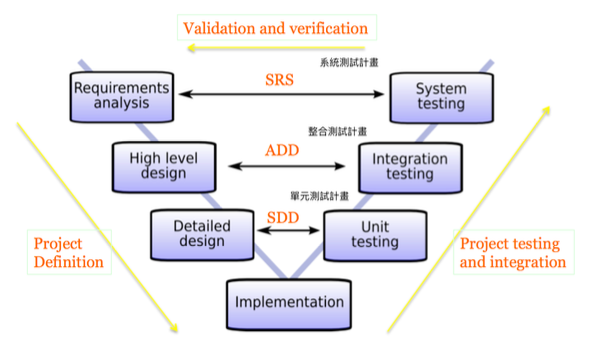
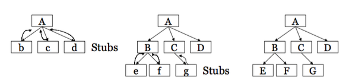
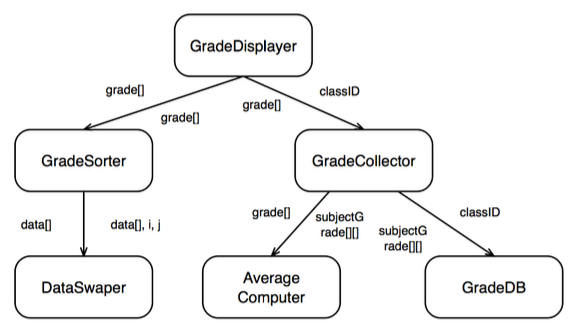

Ch07 整合測試
===


## 整合測試與 V 開發模型

#### fig-v-model



### 測試層級

上圖描述軟體開發與測試之間的關係。測試可以分為幾個層級：
 
- **單元測試** 檢視個別模組或是單一程式的測試
- **整合測試** 檢驗系統之間的組合是否有問題
- 系統測試檢驗系統整體的行為，不僅考慮軟體的功能與介面是否正確，也考慮與硬體、網路等環境的因素，整體上是否品質上的要求。

在整合測試階段，我們可能找到以下錯誤：

- 版本管理的問題
- 遺漏、重複或是衝突的功能
- 不正確或不一致的資料結構
- Client 送過來的資料違反 Server 的前置條件
- 錯誤的參數值
- Thread 之間的互相衝突

整合測試應採取漸進式的測試（incremental），通常分為由下而上（bottom-up）集由上而下測試（top-down）。

## 由下而上整合測試

由下而上表示我們從比較小的元件模組測試起，針對這些小模組寫一些測試驅動程式（test driver），丟一些參數或訊息給這些模組，檢驗其回傳或反應是否正確。

#### fig-bottom-up


下方的 JUnit 測試碼就是一個 test driver，用來測試 isPrime() 這個程式是否正確。

```java
@Test
public testIsPrime() {
  assertTrue(isPrime(2));
  assertFalse(isPrime(1));
  assertFalse(isPrime(10));
}
```


以上圖為例，若我們採取由下往上的測試方式，其測試流程如下：

 
- 分別以 $b$, $c$, $a$ 等 driver 測試 E, F, G, D 是否功能正常。$b$ 模擬 B 測試 E-F 之間的間接的互動是否符合預期。
- 用 B 替換 $b$, 利用 driver $a$ 測試 B-E-F 溝通是否正常。
- 用 C 替換 $c$, 利用 driver $a$ 測試  B-C 溝通是否正常。
- 用 D 替換 $d$, 利用 driver $a$ 測試  B-C-D 溝通是否正常。
- 用 A 替換 $a$, 利用 driver $x$ 測試 A-B, A-C, A-D 溝通是否正常。。


> 由下而上的整合測試，關鍵點在於設計「測試驅動程式」（test driver）


## 由上而下整合測試

> **Stubs**: Dummy modules used for testing if higher level modules are working properly.

當我們採取由上往下測試的策略時，表示我們要先測試高階的模組，逐步的往下測試到低階的模組。所謂的高階模組是指會呼叫、引用其他模組的模組，例如 GUI 的介面。先對這些模組進行測試的目的是為了先和使用者確認介面是否正確如預期。

在開發或測試高階模組時，我們會先銜接一個假程式（stub），這樣可以讓問題單純化，著重在高階模組的測試，等到整合的時候再換成真的程式。所謂的假程式是一個著重介面，不重內在程式正確的程式，例如一個 int[] getPrimeNumber(int x) 本來的目的是要回傳所有小於 x  了質數，他的「假程式」會被設計成:

```java
int[] getPrimeNumber(int x) {
   int[] r = {2, 3, 5};
   return r;
}   
```

他的作用只是給上面的呼叫者「可以執行」而已。等到整合階段， 他會被真的程式替換，檢驗是否能正常運作。


以 [fig-top-down](#fig-top-down) 為例，若我們採取由上往下的測試方式，其測試流程如下：

 
- 開發 A 模組時採用 $b$, $c$, $d$ 等 Stub
- 測試 A 模組是否正常
- 用 B, C, D 取代 $b$, $c$, $d$，測試 A, B, C, D 整合起來是否正常
- 用 E, F 取代 $e$, $f$，測試 A, B, C, D E, F 整合起來是否正常
- 用 G 取代 $g$, 測試 A, B, C, D E, F, G 整合起來是否正常

#### fig-top-down


#### ex-print-prime
> [!NOTE]
> 🏈 質數列印
> 有一個程式會列印出小於 n 的所有質數，這個程式分為三個模組：Displayer 主要負責資料的呈現，他會呼叫 allPrime 來取得所有的質數。AllPrime 會呼叫 isPrime 來判斷某個數是否為質數。假設這三個程式由三個人負責，他們如何設計 stub/driver？

Displayer 呼叫 allPrime(n), 我們可以先做一個 stub，固定回傳一個陣列，裡面放的是 小於 n 的質數。

```java
display() {
   int n = read();
   print(allPrime(n));
}

// stub
int[] allPrime(int n) { 
   int result[] = {2, 3, 5, 7};
   return result;
}   
```

上述 allPrime() 是一個 stub 假程式，用以測試 display()，等通過後，我們撰寫真的 allPrime() 程式。我們在寫 allPrime 時，僅注意其自身邏輯（例如 for 迴圈）是否正確，以及與 isPrime() 的溝通是否正常。此時它所呼叫的 isPrime(x) 可以是一個 stub：

```java
int[] allPrime(int n) {
   String s = "";
   for (int i=1; i<=n; i++) {
      if (isPrime(i)) s = s + i + " ";
   }
   return transformToArray(s);
}

// stub
boolean isPrime(int n) {
   if (n==2) return true;
   if (n==3) return true;
   return false;
}   
```

## 比較
除了由上而下與由下而上以外，我們可以部分用 Top down, 部分用 Buttom up，稱之為三明治整合法。

一般來說，由上而下的整合測試因為要設計 stub 比較困難，但對需求的確認有幫助; 由下而上的整合測試需要設計 driver 較為容易，但可能因為需求較晚確認而造成後續需要大幅度的修改。

## 🧑‍💻Lab Mockito

mock 測試就是在測試過程中，對那些不容易構建的對象（或是我們想固定的對象）用一個虛擬對象來代替測試的方法。目前有許多的框架可以支援 mock testing，Mockito 是最常使用的框架之一。

以下是一個股票的實例，假設股票的價格不易取得，我們因此設計一個 mock 來協助測試。目的是要檢查市場總值的計算是否正確。

```plantuml
class Stock{
    - stockID
    - name
    - quanty
    + getQuanty(): int
}

interface StockService {
    + getPrice(Stock): double
}

class Market {
    + getMarketValue()
    + setStocks(List<Stock>)
    + setStockService(StockService)
}

Market o-->  Stock
Market ..> StockService

```


```java
//Stock 類別描述一個股票的訊息與數量。
public class Stock {
   private String stockId;
   private String name;	
   private int quantity;

   public Stock(String stockId, String name, int quantity){
      this.stockId = stockId;
      this.name = name;		
      this.quantity = quantity;		
   }

   public String getStockId() { 
      return stockId;
   }

   public int getQuantity() { 
      return quantity;
   }
    
}
```

StockService 是一個查詢價格的服務與介面。在真實的系統中，我們會實踐這個介面，透過存取資料庫或是獲取特定介面來取得這個值。

```java
public interface StockService {
   public double getPrice(Stock stock);
}
```

Market 是我們要測試的對象，它會包含兩個主要物件：StockService 與 Stocks。最主要的功能是計算目前所有股票的市值（getMarketValue()）。

```java
import java.util.List;

public class Market {
   private StockService stockService;
   private List<Stock> stocks;

   public StockService getStockService() {
      return stockService;
   }
   
   public void setStockService(StockService stockService) {
      this.stockService = stockService;
   }

   public List<Stock> getStocks() {
      return stocks;
   }

   public void setStocks(List<Stock> stocks) {
      this.stocks = stocks;
   }

   //計算市值
   public double getMarketValue(){
      double marketValue = 0.0;      
      for(Stock stock:stocks){
         marketValue += stockService.getPrice(stock) * stock.getQuantity();
      }
      return marketValue;
   }
}
```

以下這個程式 MarketTester 用來檢驗 Market.getMarketValue() 市值的計算是否正確。

```java
import org.junit.jupiter.api.*;
import static org.junit.jupiter.api.Assertions.*;

import java.util.ArrayList;
import java.util.List;
import static org.mockito.Mockito.*;

public class MarketTester {
   Market market;	
   StockService stockService;
	      
   @Before   
   public void setUp(){
      //建立受測物件		
      market = new Market();		
  
      //建立股票服務的 mock 物件
      stockService = mock(StockService.class);		
  
      //把股票服務加入 market 中
      market.setStockService(stockService);
   }

   @Test   
   public boolean testMarketValue(){    	   
      //建立一些測試資料（股票）
      List<Stock> stocks = new ArrayList<>();
      Stock googleStock = new Stock("1","Google", 10);
      Stock microsoftStock = new Stock("2","Microsoft",100);	
      stocks.add(googleStock);
      stocks.add(microsoftStock);

      //把股票加入 market
      market.setStocks(stocks);

      //模擬股票服務的行為，回傳假設的價格
      //這個動作叫 stub（佈樁）
      when(stockService.getPrice(googleStock)).thenReturn(50.00);
      when(stockService.getPrice(microsoftStock)).thenReturn(1000.00);		

      double marketValue = market.getMarketValue();		
      assertEquals(100500.0, marketValue);
   }
}
```

POM.xml
```
<dependency>
    <groupId>org.mockito</groupId>
    <artifactId>mockito-core</artifactId>
    <version>5.7.0</version>
    <scope>test</scope>
</dependency>
```

### Mock and Spy

除了 Mock 物件外，還有 Spy 物件。若沒有 when...thenReturn 來設定值，則 spy 會呼叫真正的物件來運算（如果是 mock 的話，沒有定義的就是回傳預設值，通常是 0，或是 null)。

```java
App a = mock(App.class);
when(a.add(1,1)).thenRetuen(2);

assertEquals(2, a.add(1,1));
assertEquals(4, a.add(2,2));
```

上述程式中，第四行的檢驗是對的，因為有第二行的 when thenReturn 宣告，第五行卻會產生錯誤，因為 a.add(2,2) 沒有定義，會回傳預設的 0。

如果我們改成 spy（如下，第一行）。a.add(2,2) 沒有在測試碼中定義，就會執行真實的程式碼，所以第五行不會產生錯誤。

```java
App a =  spy(App.class);
when(a.add(1,1)).thenRetuen(2);

assertEquals(2, a.add(1,1));
assertEquals(4, a.add(2,2));
```

### Verify

有時候我們要檢驗某個方法是否有被呼叫，且參數正確，就可以使用 Verify 物件。

```java
Prime p = new spy(Prime.class);

when(p.isPrime(2)).thenReturn(true);
when(p.isPrime(3)).thenReturn(true);
when(p.isPrime(5)).thenReturn(true);

int[] expected = {2,3,5};

assertArrayEquals(expected, p.allPrime(5));
verify(p).isPrime(2);
```

也可以用來檢驗次數

```java
 mockedList.add("1");
 mockedList.add("2");
 mockedList.add("2");
 mockedList.add("3");
 mockedList.add("3");
 mockedList.add("3");

 //times(1) 是預設值
 verify(mockedList).add("1");
 verify(mockedList, times(1)).add("1");

 //恰好次數
 verify(mockedList, times(2)).add("2");
 verify(mockedList, times(3)).add("3");

 //never() 表示從來沒有用過，也可以用 times(0)
  verify(mockedList, never()).add("4");

 //至少或是最多的次數
 verify(mockedList, atLeastOnce()).add("3");
 verify(mockedList, atLeast(2)).add("3");
 verify(mockedList, atMost(5)).add("3");
```

Mokito 的好處為：


- 不需要手動撰寫 mock object，
- 安全重整：進行程式碼更名介面名稱或參數的順序不會破壞在執行期間建立的 mock 測試碼，
- 回傳值設定：可以設定 Mock 物件方法的回傳值，
- 支援例外，
- 順序的檢查：支援方法呼叫的順序檢查，
- 可以使用標記（annotation）來建立 mock。


### Exercise

#### ex-mokito-grade-displayer
> [!NOTE]
> 🏈 成績顯示
> [圖 fig-gradedislayer](#fig-grade-player) 是一個成績顯示的程式架構，subjectGrade[i][j] 表示 學生 i, 在科目 j 上的成績。grade[k] 表示學生 k 所有科目的平均。
>
> - 本專案採取平行開發，五個模組分別由 A, B, C, D, F 等人開發。一開始開發時，A（GradeDisplayer）的開發重點為何？該如何進行測試（mock? stubbed method? verify? assertion?）？
> - 同上，C（GradeCollector）的開發重點為何？該如何測試？
> - 同上，當 B, C 開發完成後，Ａ的測試該做何種改變？
>
> #### fig-grade-displayer
>
> 
>

## 🧑‍💻Lab SpringTest


### Binary search

二分搜尋 (Binary Search) 是一個純粹的業務邏輯，用來展示 Spring Boot 整合測試如何驗證 **Web 層 (Controller)** 與 **服務層 (Service)** 之間的協作是正確的。

在這個案例中，我們將使用 `MockMvc` 來模擬 HTTP 請求，並確保資料的傳輸（JSON 序列化/反序列化）和服務的邏輯結果能正確地返回給客戶端。

#### 🔍 Spring Boot 整合測試範例：二分搜尋 API

我們將測試一個 `POST /api/search/binary` 接口。

##### 1\. 應用程式結構（模型、服務、控制器）

###### 1.1 請求 DTO (`SearchRequest.java`)

```java
package comexample.demo.dto;

public class SearchRequest {
    private int[] data;
    private int key;
    // 構造函數、Getter 和 Setter (為簡潔省略)
    
    public SearchRequest() {}

    public SearchRequest(int[] data, int key) {
        this.data = data;
        this.key = key;
    }
    
    // ... Getters and Setters ...
    public int[] getData() { return data; }
    public int getKey() { return key; }
}
```

###### 1.2 服務層 (`SearchService.java`)

這是包含核心二分搜尋邏輯的地方。

```java
package comexample.demo.service;

import org.springframework.stereotype.Service;

@Service
public class SearchService {
    
    public int binarySearch(int[] sortedArray, int key) {
        int low = 0;
        int high = sortedArray.length - 1;

        while (low <= high) {
            int mid = low + (high - low) / 2;
            if (sortedArray[mid] == key) {
                return mid; // 找到，回傳索引
            } else if (sortedArray[mid] < key) {
                low = mid + 1;
            } else {
                high = mid - 1;
            }
        }
        return -1; // 找不到
    }
}
```

###### 1.3 控制器 (`SearchController.java`)

```java
package comexample.demo.controller;

import comexample.demo.dto.SearchRequest;
import comexample.demo.service.SearchService;
import org.springframework.web.bind.annotation.*;

@RestController
@RequestMapping("/api/search")
public class SearchController {

    private final SearchService searchService;

    public SearchController(SearchService searchService) {
        this.searchService = searchService;
    }

    @PostMapping("/binary")
    public int findIndex(@RequestBody SearchRequest request) {
        return searchService.binarySearch(request.getData(), request.getKey());
    }
}
```

##### 2\. 整合測試程式碼

我們使用 `@SpringBootTest` 啟動所有組件，並使用 `MockMvc` 來驗證 HTTP 接口的運作。

###### `BinarySearchIntegrationTest.java`

```java
package comexample.demo.test;

import comexample.demo.dto.SearchRequest;
import com.fasterxml.jackson.databind.ObjectMapper;
import org.junit.jupiter.api.Test;
import org.springframework.beans.factory.annotation.Autowired;
import org.springframework.boot.test.autoconfigure.web.servlet.AutoConfigureMockMvc;
import org.springframework.boot.test.context.SpringBootTest;
import org.springframework.http.MediaType;
import org.springframework.test.web.servlet.MockMvc;

import static org.springframework.test.web.servlet.request.MockMvcRequestBuilders.post;
import static org.springframework.test.web.servlet.result.MockMvcResultMatchers.content;
import static org.springframework.test.web.servlet.result.MockMvcResultMatchers.status;

// 關鍵註解：啟動完整的 Spring 上下文 (Controller, Service 等都會被載入)
@SpringBootTest
// 配置 MockMvc 來模擬 HTTP 請求
@AutoConfigureMockMvc
public class BinarySearchIntegrationTest {

    @Autowired
    private MockMvc mockMvc; // 模擬 HTTP 請求的工具

    @Autowired
    private ObjectMapper objectMapper; // 用於將 Java 對象轉換為 JSON 字符串

    @Test
    void whenKeyIsFound_thenReturnCorrectIndex() throws Exception {
        // 1. 準備請求資料 (已排序的資料和要找的 Key)
        int[] data = {10, 20, 30, 40, 50};
        int key = 30; // 預期位置: 2
        SearchRequest request = new SearchRequest(data, key);

        // 2. 執行階段 (模擬 POST 請求)
        mockMvc.perform(post("/api/search/binary")
                .contentType(MediaType.APPLICATION_JSON)
                .content(objectMapper.writeValueAsString(request))) // 將 Java 對象轉為 JSON 放入請求體

        // 3. 驗證階段 (驗證 HTTP 狀態碼和回傳內容)
                .andExpect(status().isOk()) // 驗證 HTTP 狀態碼是 200 OK
                .andExpect(content().contentTypeCompatibleWith(MediaType.APPLICATION_JSON))
                .andExpect(content().string("2")); // 驗證回傳的內容是正確的索引 "2"
    }

    @Test
    void whenKeyIsNotFound_thenReturnNegativeOne() throws Exception {
        // 1. 準備請求資料 (Key 不存在)
        int[] data = {10, 20, 30, 40, 50};
        int key = 35; // 預期結果: -1
        SearchRequest request = new SearchRequest(data, key);

        // 2. 執行階段 (模擬 POST 請求)
        mockMvc.perform(post("/api/search/binary")
                .contentType(MediaType.APPLICATION_JSON)
                .content(objectMapper.writeValueAsString(request)))

        // 3. 驗證階段
                .andExpect(status().isOk())
                .andExpect(content().string("-1")); // 驗證回傳內容是 "-1"
    }

    @Test
    void whenArrayIsEmpty_thenReturnNegativeOne() throws Exception {
        // 1. 準備請求資料 (空陣列)
        int[] data = {}; 
        int key = 100;
        SearchRequest request = new SearchRequest(data, key);

        // 2. 執行階段
        mockMvc.perform(post("/api/search/binary")
                .contentType(MediaType.APPLICATION_JSON)
                .content(objectMapper.writeValueAsString(request)))

        // 3. 驗證階段
                .andExpect(status().isOk())
                .andExpect(content().string("-1"));
    }
}
```

##### 整合測試的體現

這個測試被視為**整合測試**，是因為它驗證了以下組件的協作：

1.  **Web 層與服務層的整合：** 測試了 `SearchController` 能夠正確接收 `SearchRequest` JSON 請求，並成功地呼叫 `SearchService` 的實際業務邏輯。
2.  **JSON 介面相容性：** 測試了 Spring Boot 內建的 JSON 轉換器 (`ObjectMapper`) 能否正確地將 JSON 請求體反序列化為 `SearchRequest` Java 物件，確保**介面的相容性**。
3.  **整個應用程式上下文的載入：** 測試執行時，`@SpringBootTest` 載入了真實的 `SearchController` 和真實的 `SearchService` Bean，驗證它們之間的依賴注入 (Dependency Injection) 是正確的。

## ✍️ 練習

- 以下何者正確？（選二）
	
	- 整合測試測試所有的模組，又稱為系統測試
	-  整合測試主要在測試各模組之間的介面是否吻合。如果我們一開始就律定好要介面的規格，就可以省略這個步驟
	- 由下而上的整合測試，需要設計 test driver
	- 一般而言，stub 的設計比 driver 較為困難
		 

- 比較由上而下與由下而上的整合測試的優點。

- 畫出 V model, 說明整合測試所在位置。

- 關於 Mockito 的使用，以下和者正確
	
	- 適合應用於由下往上的整合測試
	- 利用 when(...).thenReturn(...) 來設定假的資料
	- mock(A.class) 則 A 需為具體類別，不可為 abstract class 或 interface
	- mock 適用於由上往下的整合，spy 適用於由下往上的整合		
- 在 Mockito 中，mock 與 spy 有何差異？
- 針對一個線上考試系統，設計其系統架構。當開發人員各自開發模組時需要設計一些 stub 與 driver, 請說明可能的 stub 與 driver。
- 考慮一個遊戲聯盟系統，各遊戲與聯盟中心都可以獨自開發，請討論可能的整合問題。


> [!CAUTION]
> 😊 程式有問題時不要擔心。如果所有東西都沒問題，你就失業了。
>
> *Don't worry if it doesn't work right. If everything did, you'd be out of a job.（Mosher's Law of software engineering）*
