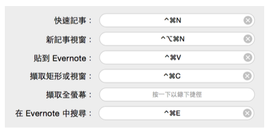
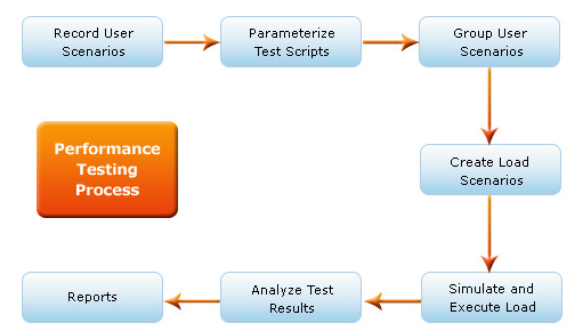
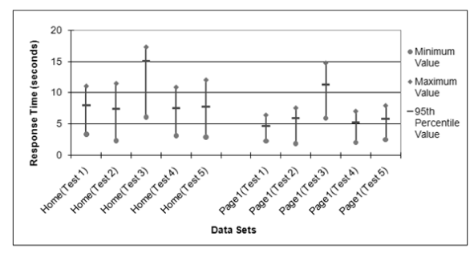
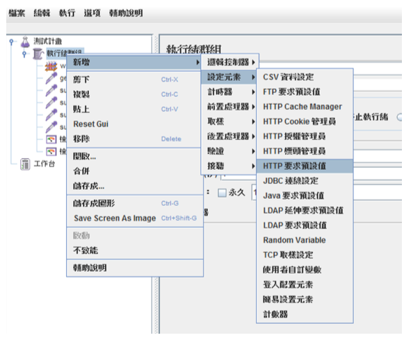
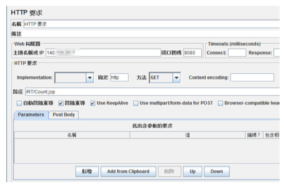
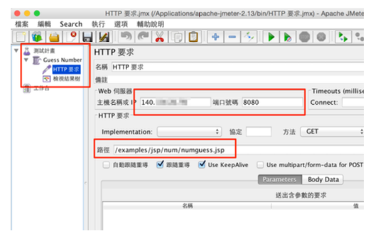
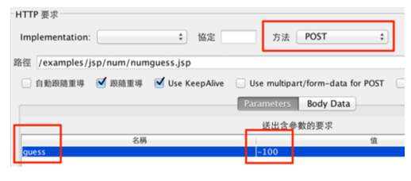
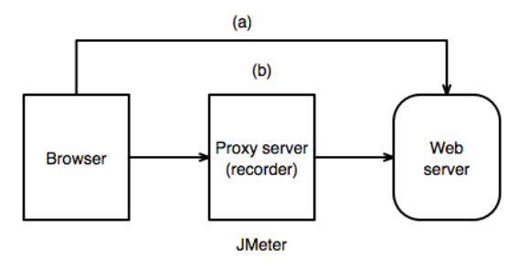
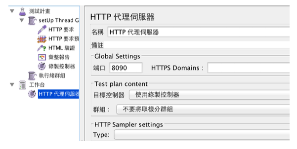

# Ch08 系統測試

系統測試考慮整體的測試，這時候的測試，著重在系統整體的操作、效能是否正常，符合預期。軟硬體的問題必須同時被考慮。

> [!NOTE]
> > **System testing**
> 這是對完整集成系統進行的測試，以評估系統是否符合其指定的要求。
> A testing conducted on a complete, integrated system to evaluate the system's compliance with its specified requirements.

## 8.1 使用案例與流程測試

系統測試與單元測試、整合測試最大的不同在於：**系統測試不是去驗證單一的小功能或 API，而是站在使用者的角度，測試一個完整的使用流程（Usage Flow）能否被正確且流暢地執行。**

例如，在一個電商系統中，測試「點選購買按鈕」或「將資料寫入資料庫」是針對單一功能的測試；但系統測試關心的是「登入 -> 搜尋商品 -> 加入購物車 -> 填寫收件資訊 -> 付款結帳 -> 收到訂單確認信」這整個連續的流程。

為了有效描述並測試這些流程，我們通常會使用「使用案例（Use Case）」來設計測試案例。

### 8.1.1 什麼是使用案例（Use Case）？

使用案例是描述使用者（Actor）為了達到特定目標，與系統進行的一系列互動過程。它就像是使用者與系統之間的對話腳本，只專注於系統「要做什麼」而非「如何實作」。

以圖書館系統的「查詢並預借媒體」為例，一個典型的情境可以用對話式的事件流來表達：

| 步驟 | 使用者動作（Actor） | 系統反應（System） |
| :--- | :--- | :--- |
| 1 | 點選「查詢並預借媒體」 | 顯示查詢方式（如：輸入關鍵字、列出所有媒體） |
| 2 | 選擇「列出所有媒體」 | 列出所有媒體名稱、數量與租借狀況，並在媒體旁提供「預借」按鈕 |
| 3 | 按下特定媒體旁的「預借」按鈕 | 檢查借閱權限，若符合則顯示「租借成功」訊息 |

### 8.1.2 基本流與替代流（Basic & Alternative Flows）

使用者在使用系統時，除了走最順利的成功路徑外，也可能遇到各種異常或分支狀況。因此在測試流程時，我們會將使用案例分為：

1. **基本流（Basic Flow / Happy Path）**：最順利、最常見的成功路徑（如上述順利預借成功的流程）。
2. **替代流（Alternative Flows / Exception Paths）**：其他分支或異常處理路徑。例如：
   * **書已被借走**：系統顯示「此書目前無庫存，已為您加入預約排隊清單」。
   * **使用者權限不足**：系統顯示「您的借書數量已達上限，無法預借」。

### 8.1.3 如何設計流程測試案例

在進行系統流程測試時，我們需要根據基本流與替代流的組合，來設計涵蓋不同情境的測試路徑（Scenarios）。

#### fig-use-case-testing


以基本流（$BF$）與替代流（$AF_1, AF_2, \dots$）為例，我們可以規劃以下測試案例來確保流程的完整性：

* **情境一（Happy Path）**：執行 $BF$（驗證最基本預借流程是否成功）。
* **情境二（分支驗證 1）**：執行 $BF \rightarrow AF_1$（驗證當書籍已外借時的處理）。
* **情境三（分支驗證 2）**：執行 $BF \rightarrow AF_2$（驗證重複預借同一本書時的防呆機制）。
* **情境四（組合驗證）**：執行 $BF \rightarrow AF_1 \rightarrow AF_2$。

透過這種「流程導向」的測試設計，才能真正確保系統在上線後，能滿足使用者實際端到端（End-to-End）的操作情境。

## 8.2 行為驅動開發與 Cucumber 測試


[Cucumber](https://cucumber.io/) 是一種行為驅動開發（Behavior Driven Development，簡稱BDD）工具，用於支援軟體測試和自動化測試。以下是 Cucumber 工具在軟體測試上的概念和好處：

### 8.2.1 核心概念

1. **BDD 語言：** Cucumber 使用自然語言（例如 Gherkin 語言）來描述應用程式的預期行為。Gherkin 是一種易讀易寫的語言，用於編寫測試用例和定義應用程式行為。
2. **特性文件：** 測試用例通常以特性文件（Feature Files）的形式存在，其中包含用 Gherkin 語言撰寫的測試場景和步驟。這有助於整個團隊更好地理解應用程式的需求和預期行為。
3. **步驟定義：** Cucumber 的測試步驟可以與底層實現程式碼進行映射，這樣可以實現自動化測試。步驟定義是 Gherkin 語言中每一行的背後實際程式碼。
4. **支援多語言：** Cucumber 支援多種程式語言，例如 Java、Ruby、Python、JavaScript 等。這樣可以讓團隊使用他們最熟悉的語言來編寫測試。

### 8.2.2 核心效益

1. **溝通與協作：** Cucumber 的自然語言語法有助於促進團隊內的溝通和協作。開發人員、測試人員和非技術人員都可以參與撰寫和閱讀特性文件，以確保共同理解應用程式的需求。
2. **可讀性和易維護性：** Gherkin 語言的自然語言風格使得測試用例易讀易懂，即使對非技術人員也是如此。這有助於提高測試用例的可維護性。
3. **自動化測試：** 透過與自動化測試框架（如 Selenium、Appium 等）結合，Cucumber 可以實現自動執行測試，提高測試效率並減少手動測試的負擔。
4. **即時反饋：** Cucumber 的測試結果報告提供即時反饋，使團隊能夠快速識別和解決應用程式中的問題。
5. **可擴展性：** Cucumber 提供了許多插件和擴充功能，使其能夠與不同的測試框架和工具集成，滿足各種不同的需求。

總的來說，Cucumber 是一個強大的 BDD 工具，它不僅有助於確保軟體的正確性，還促進了團隊之間的良好溝通和協作。

### 8.2.3 Gherkin 語法撰寫：如何描述輸入與預期輸出

在 Cucumber 中，測試案例是使用 **Gherkin 語法**以自然語言撰寫的。Gherkin 主要利用 `Given-When-Then` 結構來描述軟體的行為，並能以非常直觀的方式定義**輸入資料（Inputs）**與**預期輸出（Expected Outputs）**。

#### 1. 基礎情境（Scenario）的輸入與輸出

在一個標準的 `Scenario` 中，輸入與輸出通常直接嵌入在句子的描述中：

*   **Given（前提條件 / 輸入狀態）**：定義測試的初始狀態，即輸入的「前置條件」或「初始資料」。
*   **When（觸發事件 / 輸入操作）**：描述使用者或系統執行的操作，通常包含關鍵的「輸入動作」。
*   **Then（預期結果 / 輸出驗證）**：驗證系統在操作後的反應，即「預期輸出」或「斷言（Assertion）」。

##### 範例：購物車結帳計算

```gherkin
Feature: 購物車結帳功能

  Scenario: 計算購物車商品總價
    Given 使用者的購物車中有一件 100 元的商品與一件 200 元的商品  # 輸入狀態 (Initial Input State)
    When 使用者點擊「前往結帳」                                    # 輸入操作 (Action)
    Then 系統應顯示商品總價為 300 元                                # 預期輸出 (Expected Output)
```

#### 2. 參數化情境：情境大綱與範例（Scenario Outline & Examples）

當我們需要測試多組不同的輸入與預期輸出時，若為每組資料都寫一個全新的 `Scenario` 會造成大量的重複。此時，我們可以使用 **`Scenario Outline`（情境大綱）** 配合 **`Examples`（範例表格）** 來做參數化測試。

##### 範例：BMI 計算機測試

```gherkin
Feature: BMI 計算器

  Scenario Outline: 計算不同身高體重的 BMI 值與評級
    Given 使用者的身高為 <height> 公分，體重為 <weight> 公斤        # 輸入參數
    When 系統進行 BMI 計算                                       # 觸發操作
    Then 系統計算出的 BMI 值應為 <expected_bmi>                   # 預期輸出參數 1
    And 系統顯示的體重評級應為 "<expected_category>"             # 預期輸出參數 2

    Examples:
      | height | weight | expected_bmi | expected_category |
      | 170    | 60     | 20.8         | 正常體重          |
      | 160    | 80     | 31.3         | 肥胖              |
      | 180    | 50     | 15.4         | 體重過輕          |
```

在上例中：
*   角括號內的變數（如 `<height>`, `<weight>`）代表**輸入變數**。
*   `<expected_bmi>`、`<expected_category>` 代表**預期輸出變數**。
*   `Examples:` 底下的表格每一行代表一個獨立的測試案例。Cucumber 會自動跑三次此 Scenario，每次將表格中的欄位值代入對應的變數中。

#### 3. 步驟定義（Step Definitions）的參數映射

Gherkin 寫出的自然語言步驟，必須與底層的自動化測試程式碼連結。透過參數類型定義（如 `{double}`, `{int}`, `{string}`），Cucumber-JVM 能自動把 Gherkin 中的輸入/輸出資料擷取並傳入 Java 方法的參數中。

##### 範例：Java (Cucumber-JVM) 中的步驟定義程式碼

```java
package bmi.cucumber;

import io.cucumber.java.en.Given;
import io.cucumber.java.en.When;
import io.cucumber.java.en.Then;
import static org.junit.jupiter.api.Assertions.assertEquals;

public class BMICalculatorStepDefs {
    private double height;
    private double weight;
    private double calculatedBmi;
    private String calculatedCategory;

    @Given("使用者的身高為 {double} 公分，體重為 {double} 公斤")
    public void setHeightAndWeight(double height, double weight) {
        // 擷取 Gherkin 中的輸入參數 (height, weight)
        this.height = height;
        this.weight = weight;
    }

    @When("系統進行 BMI 計算")
    public void calculateBMI() {
        // 執行受測系統 (SUT) 的核心商業邏輯
        double heightInMeters = this.height / 100.0;
        this.calculatedBmi = Math.round((this.weight / (heightInMeters * heightInMeters)) * 10.0) / 10.0;

        if (this.calculatedBmi < 18.5) {
            this.calculatedCategory = "體重過輕";
        } else if (this.calculatedBmi < 24.0) {
            this.calculatedCategory = "正常體重";
        } else {
            this.calculatedCategory = "肥胖";
        }
    }

    @Then("系統計算出的 BMI 值應為 {double}")
    public void verifyBMI(double expectedBmi) {
        // 驗證實際輸出 (calculatedBmi) 是否等於預期輸出 (expectedBmi)
        assertEquals(expectedBmi, this.calculatedBmi, 0.05, "BMI 計算結果不符合預期！");
    }

    @Then("系統顯示的體重評級應為 {string}")
    public void verifyCategory(String expectedCategory) {
        // 驗證評級字串是否相符
        assertEquals(expectedCategory, this.calculatedCategory, "體重評級不符合預期！");
    }
}
```

藉由這種設計，業務需求描述（Feature File）中的輸入與預期輸出，能完美與測試程式碼（Step Definition）中的輸入引數與斷言（Assertion）相匹配，達成「活文件（Living Documentation）」的效果。

### **8.2.4 概念核對問答 (CCQ 1)**

**問題**

在 Cucumber (Gherkin 語法) 中，若要使用同一套測試步驟來測試多組不同的輸入值與預期輸出值，應該使用 `Scenario` (情境) 搭配 `Background` (背景) 來撰寫。

A) 是 (True)
B) 否 (False)

<details>
<summary>點擊查看【概念核對問答】答案與解析</summary>

**正確答案：B) 否 (False)**

* **解析**：
  * 若要測試多組不同的輸入值與預期輸出值（參數化測試），應該使用 **`Scenario Outline`（情境大綱）** 搭配 **`Examples`（範例表格）**，而非 `Scenario` 搭配 `Background`。`Background` 是用於在每個情境執行前設定共同的前置步驟（例如登入系統），無法實現表格化的參數對照測試。

</details>

* [BMI 範例](https://github.com/nlhsueh/sw-testing24/blob/main/lab/u08_web_testing/intro_BDD.md)
* [Ninja 購物網範例 (Intellij)](https://github.com/nlhsueh/cucumber_ninja)
    * [demo site](https://tutorialsninja.com/demo/)

Record and replay tool
* [Rapi recorder](https://github.com/RapiTest/rapi)


## 8.3 真實環境整合測試與 API 測試

在進行 API 或資料存取層的整合測試時，過去開發者常使用 H2 或 SQLite 等記憶體資料庫 (In-Memory Database) 來進行測試。然而，這種做法在現代軟體工程中已被視為一種反模式。

### 8.3.1 記憶體資料庫的幻覺

記憶體資料庫雖然啟動速度極快（毫秒級），但它會帶給開發者「測試通過」的虛假安全感：
1.  **資料庫方言與語法差異**：H2 的 SQL 語法與真實的 PostgreSQL / MySQL 並非完全相容。當使用特定資料庫的進階功能（如 PostgreSQL 的 `JSONB` 欄位、視圖、預存程序或複雜的視窗函數）時，H2 測試通常會報錯或無法模擬。
2.  **併發與鎖定行為不同**：H2 的併發讀寫鎖定機制與真實資料庫完全不同，這會導致許多在開發環境測試通過的程式碼，在生產環境併發量高時直接當機。

### 8.3.2 Testcontainers 簡介

為了消除「記憶體資料庫的幻覺」，我們應該在測試中使用**與生產環境完全一致的真實資料庫**。**Testcontainers** 是一個主流的 Java 測試庫，它利用 Docker 在測試啟動時，動態拉起真實的 PostgreSQL、Redis 或 Kafka 容器。

Testcontainers 的特點包括：
*   **拋棄式容器**：測試開始時自動啟動 Docker 容器，測試結束時自動銷毀，不污染開發環境。
*   **隨機動態 Port**：容器啟動時會綁定到 Docker 主機的隨機 Port，避免測試在 CI 伺服器上併發執行時產生 Port 衝突。

### 8.3.3 API 整合測試實務

在 Spring Boot 中，我們可以結合 `Testcontainers` 進行資料庫整合測試。以下是一個使用 `@Container` 註解動態拉起真實 PostgreSQL 的測試設定範例：

```java
@SpringBootTest
@Testcontainers
@AutoConfigureMockMvc
public class UserApiIntegrationTest {

    // 動態啟動 PostgreSQL 容器
    @Container
    static PostgreSQLContainer<?> postgres = new PostgreSQLContainer<>("postgres:15-alpine");

    // 將容器的隨機 Port 動態註冊到 Spring 資料庫配置中
    @DynamicPropertySource
    static void configureProperties(DynamicPropertyRegistry registry) {
        registry.add("spring.datasource.url", postgres::getJdbcUrl);
        registry.add("spring.datasource.username", postgres::getUsername);
        registry.add("spring.datasource.password", postgres::getPassword);
    }

    @Autowired
    private MockMvc mockMvc;

    @Test
    void testCreateUser() throws Exception {
        String userJson = "{\"username\": \"alex\", \"email\": \"alex@example.com\"}";
        
        mockMvc.perform(post("/api/users")
                .contentType(MediaType.APPLICATION_JSON)
                .content(userJson))
                .andExpect(status().isCreated());
    }
}
```

## 8.4 微服務契約測試與現代 E2E 測試

當系統架構走向微服務 (Microservices) 或分散式架構時，系統測試的焦點從「單一系統的行為」轉變為「服務與服務之間的合約相容性」以及「端到端 (End-to-End) 的完整使用者旅程驗證」。

### 8.4.1 分散式系統與微服務 API 挑戰

在微服務中，API 的變更極易引發服務中斷。例如，消費者 (Consumer) 服務依賴提供者 (Provider) 服務提供的 `/api/user/{id}` 介面。如果提供者在未告知的情況下修改了欄位名稱或刪除了某個欄位，消費者在呼叫時就會直接崩潰。
為了避免這種狀況，我們通常採取兩種防禦手段：**契約測試 (Contract Testing)** 與 **現代化 E2E 測試**。

### 8.4.2 契約測試與 Pact

**契約測試**是一種用來驗證兩個獨立服務（例如前端與後端，或微服務 A 與微服務 B）之間的 API 溝通協定是否吻合的測試方法。其中最主流的框架為 **Pact**。

*   **消費者驅動契約測試 (Consumer-Driven Contract Testing)**：
    1.  **Consumer 撰寫測試**：定義它對 Provider 的 API 請求期望（如格式、路徑、回傳狀態與 JSON 結構），並在測試時產生一份 **Pact 契約文件 (JSON)**。
    2.  **發布契約**：將契約發布到共用的 Pact Broker。
    3.  **Provider 驗證**：Provider 啟動測試，從 Pact Broker 下載契約文件，並對自身的真實控制層發送請求，驗證自身輸出的 JSON 格式是否完全符合 Consumer 的期待。
*   *優點*：不需要啟動雙方的真實服務進行即時對接，即可在 CI 流程中攔截任何破壞性的 API 變更 (Breaking Changes)。

### 8.4.3 現代 E2E 測試與 Playwright

當我們需要驗證整個系統「從前端 UI 一路到底層資料庫」的完整業務流時，我們需要撰寫端到端 (E2E) 測試。
過去開發者多使用 Selenium。然而，Selenium 存在著瀏覽器啟動慢、測試易不穩定 (Flaky Tests)、以及非同步等待處理困難等問題。

現代的微服務專案普遍轉向使用 **Playwright**：
1.  **自動等待 (Auto-waiting)**：Playwright 在點擊或操作元素前，會自動等待元素可見、可用且停止動畫，大幅降低因網路延遲造成的隨機測試失敗。
2.  **抗網路波動與 Mocking**：支援在測試中攔截並模擬 HTTP/HTTPS 請求，允許在 E2E 測試中 mock 部分緩慢或不穩定的外部 API。
3.  **強大的工具鏈 (Trace Viewer)**：提供測試錄影、截圖與 Trace 檢視器，當 CI 測試失敗時，可以直接回放測試執行的每一幀 (Frame)並查看 DOM 狀態與網絡請求。

```javascript
// Playwright E2E 測試範例 (JavaScript)
const { test, expect } = require('@playwright/test');

test('使用者應能成功登入並查看儀表板', async ({ page }) => {
  // 1. 導向登入頁
  await page.goto('http://localhost:3000/login');

  // 2. 輸入帳密 (自動等待輸入框就緒)
  await page.fill('#username', 'testuser');
  await page.fill('#password', 'password123');

  // 3. 點擊登入
  await page.click('#login-button');

  // 4. 驗證登入成功後的 DOM 狀態
  await expect(page.locator('#dashboard-welcome')).toHaveText('歡迎回來，testuser');
});
```

## 8.5 可用性測試

拿出你的 iphone 手機，操作 77-38.5, 看看答案是多少？疑，是 0? 你能說明為什麼嗎？

[nlh slides- Neilsen](https://docs.google.com/presentation/d/139iD7rotFKzOmGX6hgYR-uQQVHVVBTkiWuLsUA2vxDY/edit?usp=sharing)

### 8.5.1 Nielsen 檢測法

Neilsen 檢驗法是一種專家檢驗法，包含以下的檢測項目：與真實世界的對應、使用者擁有控制權
一致的風格、錯誤預防、易於識別、優雅簡潔的設計、清楚的錯誤處理、適當的說明文件、清楚的系統狀態、適當的說明文件等。

- *清楚的系統狀態* Visibility of System Status: 透過在合理時間內的合適回饋，系統應該讓用戶了解目前的狀態。例如我們在下載一個大檔案，呈現一個「進度狀態」不斷的更新目前下載的比例可以讓使用者的確定目前系統是正常的、網路是流暢的。上述 iphone 77-38.5 並沒有錯誤，答案的確也是 38.5，但因為出現答案的 38.5 並沒有閃一下 (這個問題約在2015 年已改善)，很容易讓使用者誤以為沒有按好 =，於是再按一次，就會出現 0。這也是一個介面設計上的問題。

#### fig-clear-system-status


- *與真實世界的對應* Match Between System and the Real World: 該系統應該以使用者熟悉的語言、文字、詞彙與概念來呈現，而不是使用系統導向。工作導向。
- *使用者擁有控制權* User Control and Freedom: 讓使用者有操作的控制權，而不是受制於系統。使用者時常以嘗試的心態來操作系統功能，他們需要一個明顯的「回復 undo」或「離開系統」來離開使用者不需要的狀態，這樣他才能無拘無束的程式這個系統，如果擔心按錯不能回復，使用者就會放棄該系統。又例如瀏覽網頁，我們常常逛著逛著就進入很深的頁面，不知道如何回到之前的某個頁面。如果這時候有一個結構能夠清楚的指出你在這個網頁系統的哪個位置、如何快速的到其他頁面，系統使用起來就會方便很多-- 你擁有瀏覽的自由度。

- *一致的風格* Consistency and Standards: 系統畫面、操作習慣應一致，使用者不應該猜測同一種動作是否使用不同的字彙、狀態或動作。例如「Help」都在一個固定的位置、有固定意義的快速鍵、操作流程等。每個不同的平台也有其設計的標準，例如 iOS 與 Google Android 都有其介面設計規範，符合這些設計規範讓會讓使用者更快上手。

#### fig-ui-inconsistency


- *錯誤預防* Error Prevention: 這是比錯誤訊息還要親切的設計，「預防」是發生問題最先要考慮的事情。不管是移除容易出錯的的條件，或是讓使用者確認他們接下來要做的行動皆是。例如使用者要把一整個系統目錄刪除，你應該警告他後果。計劃書送出就不能悔改了，你要提示使用者這個訊息，請他再確認。白話一點就是「防呆」的設計。


- *易於識別* Recognition Rather Than Recall: 盡量減少使用者需要記憶的事情、行動以及可見的選項。使用者不應該記憶太多步驟。系統使用說明應該在適合的地方表現的顯眼且可輕易使用。最常見莫過於 icon 了，例如一把剪刀代表要把文字或物件剪下，這幾乎是系統的全球共識，即便在於多國語言也知道該功能的含意。又例如我們在訂票系統中用位置圖呈現你想購買的位置（而非座位10-20的文字表達）並用顏色呈現已售出的位置，都可以讓使用者易於識別。

#### fig-ux-icon


- *有彈性及有效率的使用* Flexibility and Efficiency of Use: 應該有彈性讓「初用者」和「慣用者」都能方便使用。例如慣用者可以使用「快捷鍵」來提昇他們的使用速度; 允許使用者設定常做的動作; 畫面可以延伸等。

#### fig-ux-shortcut-key


例如一個計算機，多半的時候我們拿來坐簡單的加減乘除計算，少數的時候才會用的科學計算，在設計上我們預設呈現的簡易版的計算機，並提供按鍵讓他可以延伸為科學計算機，這就是設計上的彈性。

- *優雅簡潔的設計* Aesthetic and Minimalist Design: 對話框不應該包含無關緊要或很少用到的訊息。對話框的每一個額外的部份都會相對地降低主要資訊的顯眼程度。

- *清楚的錯誤處理* Help Users Recognize, Diagnose, and Recover from Errors: 錯誤訊息應該以敘述文字呈現，而不是錯誤代號，並且精確地指出問題以及提出建設性的解決方案。要避免把系統內部的錯誤訊息呈現給使用者看，雖然那對開發者除錯有幫助。使用者要知道的是「發生了什麼事」？我哪裡做錯了？能補救嗎？怎麼做？現在網頁系統的使用者註冊常常要使用者輸入一大堆的資料：姓名、住址、帳號、密碼、興趣等等，每一個都有其限制，例如帳號必須是 email, 密碼必須英文數字都有且最少八碼，當使用者不滿足這樣的限制時，你不能告訴他「資料錯誤，請重新輸入」，你要明確的告訴他：「你的密碼設定錯誤」。

- *適當的說明文件* Help and Documentation: 即使是最好的系統也不能沒有說明文件，系統也需要提供幫助與說明文件。說明的資訊應該很容易被找到。


> 不懂電腦的人，往往是最好的測試者。

> [!NOTE]
> 🏈 系統 UX 檢驗
> 針對一個你常用的應用軟體（ 例如 line 或 選課系統），以 Neilsen 的方式檢視其符合程度：該軟體有哪些優缺點？該如何改善？

### 8.5.2 Hallway 走道測試

就像是「在走道上隨意的找一個人來操作系統，觀察它的使用狀況」。這樣的目的是避掉在這個專案的相關人員-- 包含分析師、設計師、開發程式設計師、協助訪談的顧客、伴隨的測試人員等 -- 他們因為了解系統反而被「洗腦」了，把許多不便的設計給忽略了。


### 8.5.3 A/B 測試法
對於一個使用設計（例如位置、色彩）採用AB兩種作法，觀察及分析其使用的狀況，選擇比較好的設計方法。

#### fig-ab-test


## 8.6 效能測試


### 8.6.1 種類與基本概念

一般而言效能測試（performance testing）可以分為負載測試（load testing）與壓力測試（stress testing）。前者在於測試系統是否能夠承受特定的負載，例如說是100,000 同時上線，這個工作量是取決於該應用系統的特性。例如預估一個購物網站的使用人數。後者是測試系統的極限，看看系統到什麼階段後承受不住，開始發生回應遲緩或是系統當機的狀況。

一些在效能測試常遇到的名詞：
 
- *回應時間（Response time）*。系統處理一個請求（request）所需要的時間。回應時間對大多數的系統都非常重要，例如電子商務系統，根據統計使用者能夠忍受的時間大約是8 秒鐘，超過這個時間，使用者離開系統或是放棄購買的比例大幅度的提升。

-  *網路延遲（Latency）*。當我們送出一個請求，除了伺服器處理的時間以外，還有網路傳送的時間，當你的網路狀況不好時系統的使用是很不方便的，但卻不能怪罪系統的演算法或是架構，必須從網路的架構來改善，或是建立一些代理伺服器來解決這些問題。

- *吞吐量（Throughput）*。表示你應用程式每秒可以處理的交易量。吞吐量也可以說是工作量（workload），表示你的系統可以處理多少的請求而不發生錯誤。

- *延展性 Scalability*。當系統效能發生問題時，我們通常會升級我們的機器設備，延展性考慮的就是升級或增加硬體時系統的反應。要注意並不是加硬體就能解決問題，例如瓶頸在資料庫，你多了一個硬體加裝資料庫卻會造成兩個資料庫的不一致，這時候系統是延展不開的。延展性可以分為垂直延展（vertically up）或水平延展（horizontally out），前者表示採用較好的機器（better machine），後者表示更多的機器（more machines），例如我們增加機器後在前面增加網路負載平衡器（network load balance; NLB）。


#### 效能測試並不便宜

- 工具不便宜;
- 準備資料是花時間的;
- 設定基礎建設（或測試環境）是花時間的，例如你的系統系統是建置在大型主機，你可能很難有經費在買一台一樣的機器來做為測試;
- 執行測試的時候，需要暫停其他資源的使用;
- 需要其他技術人員，例如資料庫管理師、網管人員、程式人員、測試人員等都需要一起參與。

#### 效能測試也不容易

- 軟體必須是最後版本。如果不是那測試就會失準，小小的程式碼修改可能會影響很大效能。
- 模擬是不容易的。除了預估工作量以外，我們也需要預估使用者的操作行為，例如在線上考試系統，測驗題的思考時間應該考慮進去，才能做精準的預估。也要考慮哪些需要模擬，哪些不用？例如檔案的上下傳需不需要？他所考驗的是系統效能還是網路頻寬？
- 分析是不容易的。當系統效能出現問題時，我們如何知道瓶頸在哪裡？記憶體？CPU？網路？或甚至於是測試軟體本身的問題。
- 如何溝通。如何管理者報告測試的結果？說服他們買機器？如何說服程式工程師改程式？

#### When to do performance test?

什麼時候應該開始進行壓力測試呢？雖然壓力測試是系統測試的一環，但也應該盡可能的提早開始進行。如果在開發階段我們就發現模組的問題就可以提早改善（如果效能瓶頸在某個模組）。另一方面，壓力測試所需要的環境準備與技術的學習都是很繁瑣的。當系統無法通過壓力測試時我會進行系統的調教，再重新測試，所以他會重複地進行。當然前提是硬體環境已經準備好安裝好，網路及其他的環境也都可以運作，應用程式的功能也已經開發完成，安裝完成且可以運作。

### 8.6.2 效能度量

以下列出一些常用度量：

* 每小時的數量：
    - 每小時平均的 session 數量
    - 每小時最大的 session 數量
    - 每小時平均的 page 觀看數量
    - 每小時處理的 byte 數量
* 每 session：
    - 平均（最大） session 長度
    - 平均（最大）每個 session 瀏覽的 page 數量
* 每個 page 平均的停留時間。
* 每個請求平均的等待時間。
* 比值（ratio）
    - 新用戶與回頭用戶的比值（new users vs. returning users）
    - 不同類型使用者的比值。
* 最
    - 最長被拜訪的網頁（page）
    - 每小時最尖峰的數量為何
    - 每單位時間最多同時上線的數量

### 8.6.3 虛擬使用者

透過負載產生器（load generator）來產生負載，進行測試。

#### fig-virtual-user 
使用虛擬使用者進行壓力測試


#### fig-load-generator
多台的負載產生器


#### fig-record-replay
Record and replay


效能測試可以分為三個階段實施：規劃階段、測試階段與分析階段。

### 8.6.4 規劃階段

在規劃階段主要有以下的任務

- 定義測試的目標。大家對測試的期望是什麼，是在現有環境下了解可以的負載，還是滿足某個負載所需要的環境？還是了解超過負荷下系統的表現？
- 收集測試需求。需要什麼環境與設備？依據市場需求或是過去的經驗推估工作流量與反應時間; 
- 需要的產出物與交付物; 
- 決定要執行哪些測試，決定測試日期;
- 決定工作流量（workload）;
- 決定要收集與分析哪些效能度量？例如回應時間、單位時間的處理量等。
- 決定要用哪個工具來模擬流量; 
- 撰寫測試計畫，設計使用者情境與建立測試腳本。

#### 使用輪廓（Usage Profile） 

工作流量要設為多少？通常需要做一些預估與分析，例如在一個教學管理平台，我們要先預估在一般情況下會有哪些主要的使用情境，這些使用情境所佔的比率又是多少？

```
= 使用輪廓 =
老師：上傳檔案，5%
老師：瀏覽及回覆討論區，5%
學生：下載檔案，10%
學生：參與考試，10%
學生：瀏覽及回覆討論區，70%
```

為什麼我們會知道這樣的輪廓？可能依據過去的系統的紀錄、可能依據推測。一個教學管理平台非常的複雜，可以操作的情境可以上百個，但我們不太需要每一個都列出來，僅列出重要、有代表性的即可。例如瀏覽及回覆討論區和瀏覽成績、瀏覽近期活動所能帶來的流量差異不大，所以我們可以一個情境來代替。檔案的上傳與下載可能造成較大的網路流量，所以獨立出來測試。參與考試由於過程中會不斷的寫資料庫，可能造成資料庫忙碌，故測試之。

預測或分析系統的使用輪廓（Usage Profile），再依據使用輪廓來設計效能測試時的工作流量（Workload）。

工作流量可以由兩個方面來計算，其一是使用者角度（user-specific），其二是應用程式角度（application-specific）。前者從多少使用者上線、他們的操作行為來定義流量，後者則從技術的角度，例如多少個點擊、多少的運輸量（byte）來定義流量。

工作流量有以下的計算方式：

- *拜訪（Visits）* 不同的使用者在一段期間進入該系統的次數。拜訪代表的是「個別拜訪（individual visit）」，同一個人在這段時間內進入多次只能算一次拜訪。越多的獨立拜訪表示越多的顧客光顧，對於電子商務也特別的意義。
- *會話（Session）* 相較於 Visit代表多少「人」瀏覽網站，Session 代表多少「人次」。Session 的數目表示使用者使用系統的功能的次數。一個使用者進入系統後，通常會瀏覽幾個頁面來達成他所想要的目的，如果他靜止過久（通常是 30 分鐘），我們就認為是另一個 Session。
- *頁面瀏覽（Page views）* 通常使用者進入一個系統（開始了一個 Session），會有多次的頁面瀏覽來滿足他的需求。例如經歷登入頁、商品瀏覽頁、訂單頁、信用卡填寫頁、確定送出頁等。平均瀏覽頁對電子商務是有意義的，可以使用者對系統的興趣程度，對於我們進行壓力測試規劃也有幫助，我們才知道給系統多少的「工作量」。Page views 通常也稱為網頁請求（request）。
- *點擊（Hits）* 一個網頁瀏覽會引發多個「點擊 Hit」，包含文字、圖片、JavaScrip、CSS 等檔案。


#### 如何產生工作流量 

- **硬體密集 Hardware intensive** 我們可以透過硬體的產生這些工作流量，但這樣花費的成本太高了，除了軟硬體以外，還需要很多的操作人員。對於大規模的壓力測試而言，這樣的方法是不實用的。
- **軟體密集 Software intensive** 用軟體來模擬大量的工作流量是比較常見的方法，軟體工具模擬不同的 protocol 所發送與接受的封包。即使是一個人也可以產生數百數千的模擬工作量，有極大的方便度與彈性。

#### 工具的選擇

是否能夠模擬使用者的行為; 是否提供腳本的錄製; 是否提供使用者思考的時間，是否提供HTTPS, AJAX, Cookies 等功能; 是否提供驗證的功能; 是否可模擬不同的瀏覽器; 是否提供各種不同的報表功能，包含統計分析圖表等; 是否與伺服器的監控器做整合。

#### 購買或自建？

商用軟體可能很昂貴，學習也是一個很大的問題，也可能不符合你的需求。如果是自己來開發，成本通常也不低（需要開發成本），好處是可以貼近你的需求。不論是購買或自建，都應該儘早進行。

另外的一個選擇是透過「應用服務提供商」（Application Service Provider; ASP）來產生流量。由ASP來提供流量的好處是不需要花費很多的資源來模擬流量，那是需要軟硬體的建置購買成本的（只為了很久才一次的壓力測試是不划算的）。ASP 還可以在全球設定不同的地方，不同的網路環境速度，也大大的提升模擬的真實性。

### 8.6.5 測試階段

測試階段就是依據規劃階段的規劃來進行測試資料與腳本的準備，把規劃階段裡面所設計的工作量轉換為工具內的參數，然後進行測試。

這個階段最重要的這是對於工具的熟悉。為了要讓測試腳本有效地被利用，我們甚至要應用程式撰寫的觀念來撰寫測試腳本，例如 JMeter 就有提供 regular expression 的方式來截取回應資料的部分內容，例如 session 的 ID 等等。

上線時間（ramp up）與下線時間（cool down）在這個階段必須被設定。所謂的啟動時間就是所有的工作量完全啟動所需要的時間。例如我們模擬一分鐘內一千個使用者上線，執行若干個功能後在兩分鐘內陸續離開，這一分鐘就稱為上線時間，兩分鐘就成為下線時間。

測試的執行可能需要很多次。

### 8.6.6 分析階段

這個階段主要：
（1）分析結果；
（2）改變系統（包含硬體環境、軟體程式等）來改善效能；
（3）設計測試，重新測試。

分析效能不是一件容易的事，必須對系統、網路、程式、環境都有一定的技術知識。也必須知道哪些因素可能會影響測試的結果，必要的時候必須反覆的測試來確認你的懷疑（是記憶體不足的問題嗎？）。


回應時間圖（Response Time Graph）是最常見的圖表，反應出不同工作量時的反應時間。當回應時間明顯變長，達到我們所無法接受的點時，該工作量稱為 **飽和點**（saturation point），圖 450 人即為該系統的飽和點。

#### fig-response-time-graph


[fig-cpu-utilization](#fig-cpu-utilization) 除了呈現回應時間外，亦呈現 CPU 的使用率。可以看得出，當回應時間加大時，CPU 的使用率也急遽的加大，達到80%的使用率，增加 CPU 的工作效能或許是解決問的方法之一。

#### fig-cpu-utilization


一般而言需要進行多次測試，確保系統測試的結論不是偶然的，在統計上有一定的正確性。圖 [fig-response-time-graph](#fig-response-time-graph) 是針對某一個頁面進行五次的測試，一般而言，若超過 1/5 差異很大，則代表系統環境或程式是有問題的，應在檢驗。若某次測試的 95 percentile value 超過其他測試的最大或做小，表示其差異是大的。

#### fig-response-time-graph


## 8.7 JMeter 壓力測試

### 8.7.1 工具安裝

為了要完成這個練習，我們先利用 Tomcat 來架設一個網站，Tomcat 是用 Java 所開發的一個網頁伺服器，其安裝流程如下：

- 安裝 Java JDK 。
- 下載 Tomcat 。
- 設定環境變數 JAVA HOME 與 CLASSPATH與 TOMCAT HOME。
- 啟動 Tomcat，執行 startup.bat。http://localhost:8080 檢驗看看是否正確。
- 執行 /examples/jsp/num/numguess.jsp，看看是否正常。

安裝 JMeter：

- 下載 (http://jmeter.apache.org/)及解壓縮。
- 啟動。執行 bin 下的 ApacheJMeter.jar。

#### fig-jmeter



[fig-jmeter](#fig-jmeter) 中呈現JMeter 最主要的元件，包含

- 「執行緒 Thread」：表示模擬的人數，如果你要模擬100 人同時使用系統，thread 就設為 100。
- 「取樣 >> HTTP 要求」：模擬 HTTP 的請求訊息，也就是瀏覽網頁的模擬。

#### fig-jmeter-http-request



- 「設定元素 >> HTTP 要求預設值」。上述的 HTTP 要求會反覆的設定很多的要求，例如 IP, Port 等，可以透過 HTTP 要求預設值一次設定，就不需要設定那麼多次。
- 「接聽 >> 彙整報告」。用來呈現測試後的數據與其分析。

有了這些我們觀念，我們就可以做簡單的測試。

### 8.7.2 虛擬使用者模擬

[▶️ 觀看影片：JMeter part 1 影片解說](https://youtu.be/9Qw0i9fan5w) 

> Lab: HTTP 請求。  numguess 為一個簡易的猜數字程式。請利用 JMeter 設計一個測試案例模擬一個使用者進入 numberguess 程式的行為。

執行步驟：

- 測試計畫按右鍵 >> 新增 >> Threads (users) >> 執行緒群組
- 設定 執行緒群組 的屬性	
	- 執行緒數量：模擬多少使用者同時進入測試。現階段請設定一人。
	- 啟動延遲：幾秒內使用者完全進入系統。如果 100 人 10 秒，則平均一秒有 10 人進入。現階段請設定一秒。
	- 迴圈測試：反覆測試幾次。
	- 新增 取樣 >> HTTP 要求（[fig-number-guess](#fig-number-guess))。
- 新增 接聽 >> 檢視結果樹。
- 執行。


#### fig-number-guess



🏈 Lab: **資料驗證**。
承上例，已知最後的數字落在 0-100 之間，若我們輸入 -100 系統會出現 higher 的內容; 若輸入 200 會輸出 lower 的內容。請設計測試案例確定系統具備這樣的行為。

- 先在網頁上按右鍵 >> 觀看程式碼，找出輸入值的變數名稱。此範例為 guess。
- 修改剛剛的 HTTP request 為一個 post 訊息，加上參數 guess = 200。
- 在 HTML 請求下方加上一個「驗證回覆」，「測試用樣式」加上 lower 的字串。表示回傳的內容中，應該包含 lower。
- 重複上述步驟，檢測 guess = -100 的情況。
- 執行，接著觀察「檢視結果樹」。你也可以故意把 lower 和 higher 對調，看看「檢視結果樹」會有什麼呈現。
- 使用「接聽>>驗證結果」，觀察測試結果。
- 你可以在 HTTP 請求前加上 「HTTP 要求預設值」，讓建立測試案例 時更容易且更有修改彈性。
- 再加上「接聽 >> 檢視表格結果」，練習運用其他格式的結果。

#### fig-jmeter-post


Lab: 邏輯控制器。承上例，應用邏輯控制器（if/while/loop）來設計一組測試案例，猜數字直到猜對為止。

Lab: 壓力測試。承上例，將執行緒改為 10 執行測試並觀察回應時間。逐步增加壓力比較系統的回應時間。

- 新增 「Summary report」接聽器。

由 Summary report 中可以看到回應的時間，其中取樣數表示測試的次數，平均、最小、最大分別表示回應的平均、最小與最大的毫秒數。如果太大超過系統能夠回覆的時間，錯誤率就會大於 0, 表示伺服器回傳 404 等錯誤訊息。


### 8.7.3 側錄操作行為

上面的測試中我們都手動建立測試案例，這樣花不少時間，接下來我們介紹如何透過 record and replay 的方式來進行壓力測試。首先我們必須建立一個 proxy server 來側錄我們操作網路的行為。JMeter 裡面就有一個 proxy server, 我們先把它啟動起來，port 設為 8090。接著把瀏覽器的 proxy server 指向這個 port。當我們操作瀏覽器時，proxy server 會把行為錄製起來。下圖中的 (a) 表示瀏覽器直接與 server 要資料，(b) 表示通過 proxy server。

#### fig-jmeter-record-replay


[fig-jmeter-record-replay](#fig-jmeter-record-replay): JMeter Recorder 架構。一般的瀏覽器是直接和伺服器溝通(a); JMeter 透過 Proxy 來側錄使用者的行為。


Lab: 錄製器。
延續 guess number 例子，但這次使用 Recorder 幫助建立測試案例。當建立 Recorder 之後,使用重播來執行測試案例。


- 新增 proxy server。在 JMeter  中的工作台新增一個「非測試元素>> HTTP 代理伺服器」。裡面的端口（port）設為 8090（不要與8080 衝突）。
- 把你的瀏覽器的 proxy server 設為 localhost 的 8090。
- 新增 「邏輯控制器 >> 錄製控制器」。就大功告成，當你操作瀏覽器時，錄製控制器就會不斷的有東西進來，表示錄到東西了。

#### fig-jmeter-proxy


Lab: 錄製器 II。

連線到 Yahoo 奇摩，任意的操作一些行為並且錄製下來。加大壓力，並觀察其效能。

注意 Yahoo 奇摩的防火牆可能因為大量的「攻擊」而封鎖你的請求。另外現在許多網站都加上 SSL，JMeter proxy server 目前也支援憑證，瀏覽器必須先匯入憑證：(以 firefox 為例)


- 啟動 JMeter proxy server 後會產生暫時的憑證。
- 進階 >> 憑證 >> 檢視憑證清單 >> 匯入 >> 選擇 JMeter 所在的目錄 bin，加入 ApacheJMeterTemporaryRootCA.crt。
- 錄製時可以選擇部分檔案記錄下來，在 「要包含的樣式」中輸入：「.*\textbackslash.html」則僅記錄 .html 的檔案（regular expression）。也可以在 「除外的型式」中輸入「.*\textbackslash.gif」則不記錄 .gif 的檔案。

我們可以把設計好的 jmeter 測試檔存起來，你可以發現他是一個 XML 檔，描述著如何進行測試的流程與資料，我們稱之為 test script，各種不同的測試工具都有其不同的 test script 語法。

### 8.7.4 測試腳本

```java
<?xml version="1.0" encoding="UTF-8"?>
<jmeterTestPlan version="1.2" properties="2.8" jmeter="2.13 r1665067">
  <hashTree>
    <HTTPSamplerProxy guiclass="HttpTestSampleGui" testclass="HTTPSamplerProxy" testname="HTTP 要求" enabled="true">
      <elementProp name="HTTPsampler.Arguments" elementType="Arguments" guiclass="HTTPArgumentsPanel" testclass="Arguments" testname="使用者自訂變數" enabled="true">
        <collectionProp name="Arguments.arguments"/>
      </elementProp>
      <stringProp name="HTTPSampler.domain"></stringProp>
      ...
      <stringProp name="HTTPSampler.path">/examples/jsp/jsp2/el/basic-arithmetic.jsp</stringProp>
      <stringProp name="HTTPSampler.method">GET</stringProp>
      ...
    </HTTPSamplerProxy>
    <hashTree/>
  </hashTree>
</jmeterTestPlan>
```

## 8.8 相容性測試

檢驗系統是相容於各種機器（IBM 360, HP 9000）、環境、網路、作業系統（Linux, Window）、資料庫（Oracle, SQL server）、網頁伺服器（Apache, Tomcat）、瀏覽器（IE, Chrome, Firefox）等。注意即使是同一個軟體因為版本不同也很可能是不相容的，例如在 IE6 可以運作的在 IE7 就不一定可以。

網頁相容性測試

- 要求在不同的網頁瀏覽器上測試網頁應用程式。
- 用戶在查看網頁應用程式時，無論使用哪種瀏覽器，都應該擁有相同的視覺體驗。
- 在功能方面，應用程式在不同的瀏覽器中應該表現和回應相同的方式。
- 支援的運營商兼容性（Verizon、Sprint、Orange、O2、AirTel等）。
- 硬體兼容性（不同型號的手機）。

認證測試（Certification testing）是一種比較特殊的相容性測試，主要是由產品的發行產商來測試，由他們來發行他們的產品是用在哪些機器上。例如微軟的 SQL server、Oracle 的 12c 版本是用在哪些機器上與作業系統上，他們都會進行詳盡的測試並公布在官網上，作為軟體公司購買或升級的參考。

## 8.9 安全性測試
暫略

## 8.10 回復性測試
暫略

## 8.11 練習與討論

#### 使用案例測試

- 以下何者正確：
	- 使用案例案例的撰寫，通常是在整合測試結束，系統測試開始之時
	- 使用案例強調使用者操作的情境與順序
	- 對話式的使用案例是指必須有兩個人以上參與使用案例的設計，才能完整
	- 替代案例表示除了基本案例外的情境，兩者選一來做測試
	- 使用案例測試是一種系統測試
- 請用 ATM 提款的情境，透過對話式的使用案例來描述。

#### 可用性測試
- 說明三種可用性測試的方式。
- 以下各項與 Neilson 測試哪個準則有關？
	- 不同頁面資料儲存的按鈕樣式不同
	- 具備 undo  的功能
	- 一個畫面充斥過多的功能
	- 具備快捷鍵
	- 應用 icon 來表達功能
	- format 磁碟前提醒使用者再次確認
	- 僅告訴使用者密碼設定的強度不足
- 列出 Nielsen’s Usability Heuristics 的十個建議。

#### 效能測試
- 關於效能測試，以下何整正確？	
	- 其主要階段有三：規劃、測試、分析。
	- 使用輪廓（usage profile）是設計工作流量很重要的參考資料。
	- 頁面瀏覽（Page view）的次數表示某時間區段內拜訪網站的人次。
	- 產用軟體模擬的方式來進行壓力測試是目前常用的作法。
	- Ramp up 的時間，表示壓力測試時，使用者上線所需要的時間。
	- 壓力測試應與系統監控分開，如此才能做精準的測試。
- 關於網路行為的計量，以下何者正確？
	- Visit 越高，表示不同的使用者進入的次數越高。
	- Hit 越高，表示使用者越多
	- Page view/session 越高，表示使用者每次進入系統會瀏覽多個網頁
	- Session 代表人次，Visit 代表人數。
- 效能測試可分為負載測試與壓力測試，說明其差異。
- 說明效能測試為何複雜。
- 效能測試的三個主要因子（key factor）為何？
- 針對一個線上考試系統，推測其使用輪廓（usage profile），並依據使用輪廓設計一個壓力測試的工作量（workload）。

#### JMeter

- 關於 JMeter 以下和者正確
	- thread（執行緒）表示受測的系統是否開啟多工模式
	- 具備多個 listener，提供不同的測試報表
	- 提供方便的指令撰寫測試腳本，但不具備 record and replay 的功能
	- 是 github 所開發的 opensource
- 測試 Yahoo：
	- 建立一個 Recorder 擷取登入 Yahoo，以及在網站中進行各種活動的動作。
	- 檢視 Recorder，觀察哪些動作被記錄下來。
	- 用 HTTP Proxy 和正規表達式（Regular Expression），篩選出 .jpg 和 .gif 的檔 案。	
- 自選一個網頁應用程式（可自行開發或找 open source）並安裝於本機或其他主機。安裝 JMeter 以進行測試，並分析結果。
	- *設計劇本*。一個系統會有不同的使用情境; 不同的角色使用的情境不同，每一個情境的比重可能不同。劇本設計的越擬真越好。
	- *應用錄製器*。透過錄製後產生基本的劇本，再擴大為整體完整的劇本。
	- *使用監控軟體*。監控應用系統的各種狀態、監控模擬端的系統狀態、監控網路的狀態（如果發送端與服務端分開的話）。
	- *進行分析*。針對 JMeter 與監控系統所收集到的資料進行分析，分析在不同的壓力下系統的效能行為，進一步的歸納出系統的瓶頸、建議的使用狀況。
	- *包含資料庫之系統效能分析*。所選的應用程式系統包含資料庫的應用; 分析時能夠同時對資料庫、伺服器做出分析。


#### 綜合

- 何謂系統測試？
- MTBF（mean time between failure） 用來檢測軟體的穩定度，說明其含意
- 回復測試（recoverability test）檢驗系統遇到問題時是否能夠回復到原來的狀態。如果要做到好的回復度，系統設計時要注意什麼？
- 為何需要相容性測試（compatibility test）?
- 以下系統應該特別針對哪些系統測試加強？
	- 數位照片網路沖洗系統
	- 台北捷運換幣系統
	- 自動提款機
	- 線上遊戲系統 – LOL
	- 大學聯考電腦自動閱卷系統
	- 監理所車輛管理系統	
	

> 如果你不了解自己所說的事物，即便你遣詞用字精準，也毫無意義。
> There is no sense in being precise when you don’t even know what you’re talking about. - John von Neumann