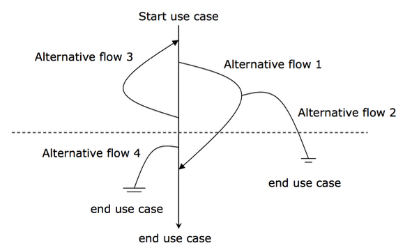
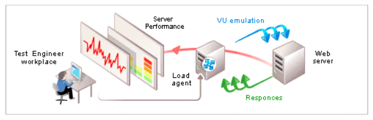
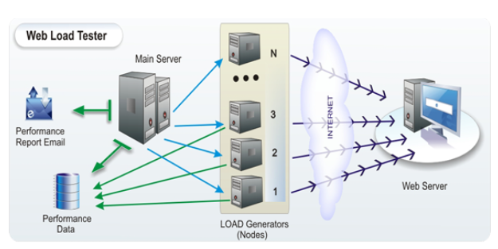
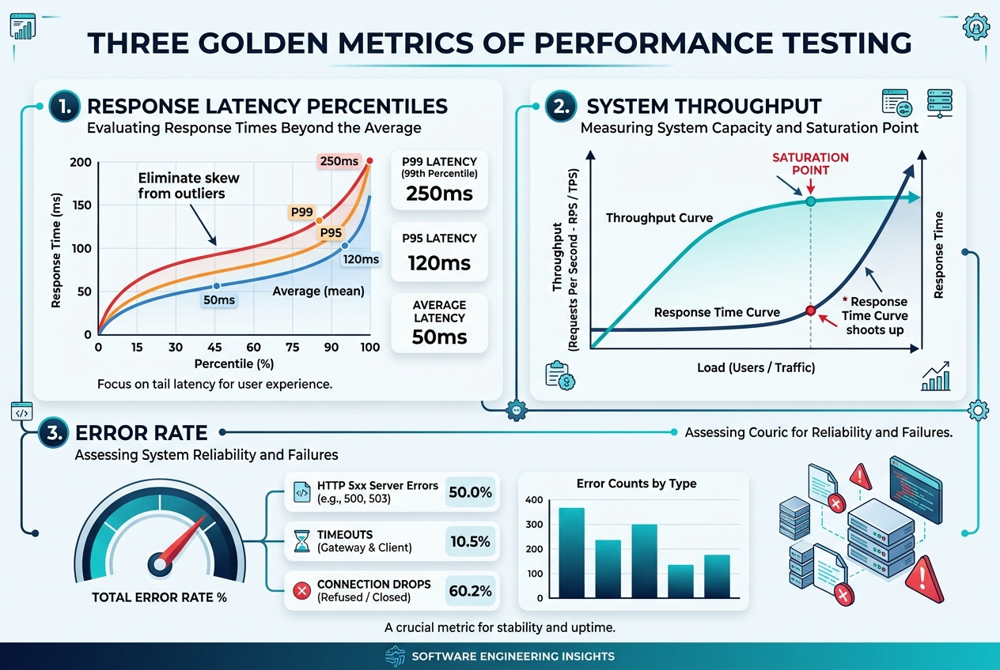
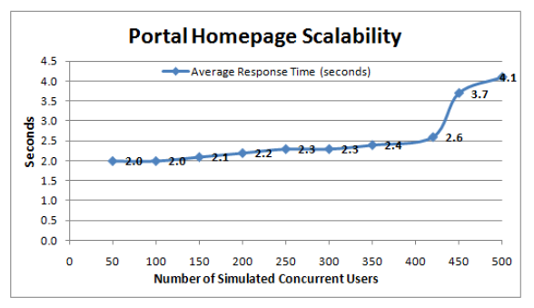
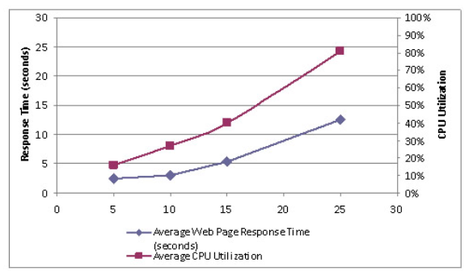
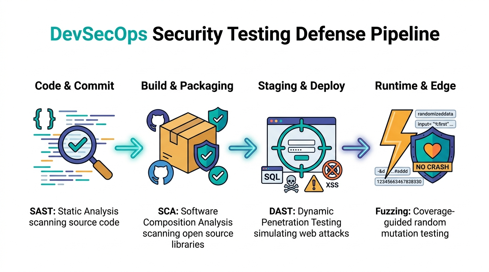
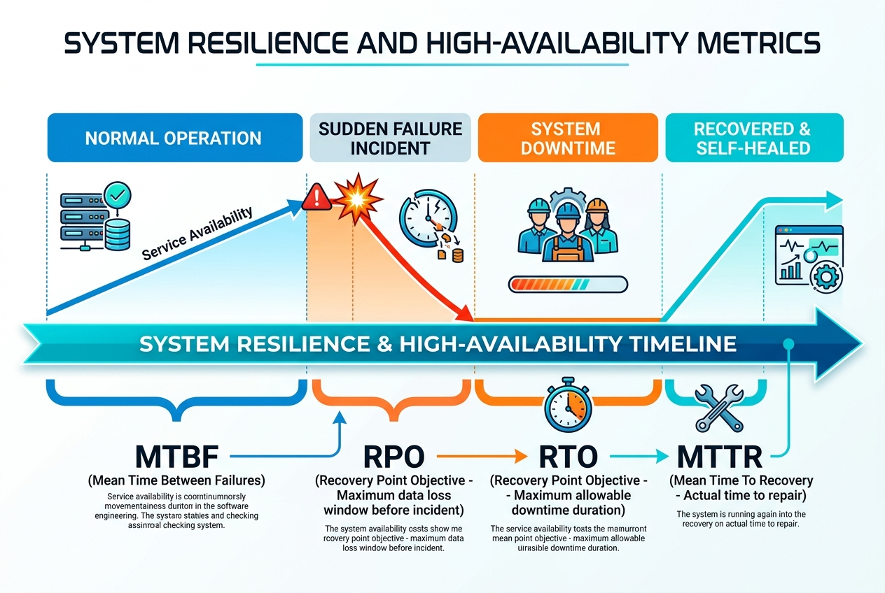

# Ch08 系統測試

系統測試考慮整體的測試，這時候的測試，著重在系統整體的操作、效能是否正常，符合預期。軟硬體的問題必須同時被考慮。

> [!NOTE]
> > **System testing**
> 這是對完整集成系統進行的測試，以評估系統是否符合其指定的要求。
> A testing conducted on a complete, integrated system to evaluate the system's compliance with its specified requirements.

## 8.1 使用案例與流程測試

系統測試與單元測試、整合測試最大的不同在於：**系統測試不是去驗證單一的小功能或 API，而是站在使用者的角度，測試一個完整的使用流程（Usage Flow）能否被正確且流暢地執行。**

例如，在一個電商系統中，測試「點選購買按鈕」或「將資料寫入資料庫」是針對單一功能的測試；但系統測試關心的是「登入 -> 搜尋商品 -> 加入購物車 -> 填寫收件資訊 -> 付款結帳 -> 收到訂單確認信」這整個連續的流程。

為了有效描述並測試這些流程，我們通常會使用「使用案例（Use Case）」來設計測試案例。

### 8.1.1 什麼是使用案例（Use Case）？

使用案例是描述使用者（Actor）為了達到特定目標，與系統進行的一系列互動過程。它就像是使用者與系統之間的對話腳本，只專注於系統「要做什麼」而非「如何實作」。

以圖書館系統的「查詢並預借媒體」為例，一個典型的情境可以用對話式的事件流來表達：

| 步驟 | 使用者動作（Actor） | 系統反應（System） |
| :--- | :--- | :--- |
| 1 | 點選「查詢並預借媒體」 | 顯示查詢方式（如：輸入關鍵字、列出所有媒體） |
| 2 | 選擇「列出所有媒體」 | 列出所有媒體名稱、數量與租借狀況，並在媒體旁提供「預借」按鈕 |
| 3 | 按下特定媒體旁的「預借」按鈕 | 檢查借閱權限，若符合則顯示「租借成功」訊息 |

### 8.1.2 基本流與替代流（Basic & Alternative Flows）

使用者在使用系統時，除了走最順利的成功路徑外，也可能遇到各種異常或分支狀況。因此在測試流程時，我們會將使用案例分為：

1. **基本流（Basic Flow / Happy Path）**：最順利、最常見的成功路徑（如上述順利預借成功的流程）。
2. **替代流（Alternative Flows / Exception Paths）**：其他分支或異常處理路徑。例如：
   * **書已被借走**：系統顯示「此書目前無庫存，已為您加入預約排隊清單」。
   * **使用者權限不足**：系統顯示「您的借書數量已達上限，無法預借」。

### 8.1.3 如何設計流程測試案例

在進行系統流程測試時，我們需要根據基本流與替代流的組合，來設計涵蓋不同情境的測試路徑（Scenarios）。

#### fig-use-case-testing


以基本流（BF）與替代流（AF₁, AF₂, ...）為例，我們可以規劃以下測試案例來確保流程的完整性：

* **情境一（Happy Path）**：執行 BF（驗證最基本預借流程是否成功）。
* **情境二（分支驗證 1）**：執行 BF → AF₁（驗證當書籍已外借時的處理）。
* **情境三（分支驗證 2）**：執行 BF → AF₂（驗證重複預借同一本書時的防呆機制）。
* **情境四（組合驗證）**：執行 BF → AF₁ → AF₂。

透過這種「流程導向」的測試設計，才能真正確保系統在上線後，能滿足使用者實際端到端（End-to-End）的操作情境。

## 8.2 行為驅動開發與 Cucumber 測試


[Cucumber](https://cucumber.io/) 是一種行為驅動開發（Behavior Driven Development，簡稱BDD）工具，用於支援軟體測試和自動化測試。以下是 Cucumber 工具在軟體測試上的概念和好處：

### 8.2.1 核心概念

1. **BDD 語言：** Cucumber 使用自然語言（例如 Gherkin 語言）來描述應用程式的預期行為。Gherkin 是一種易讀易寫的語言，用於編寫測試用例和定義應用程式行為。
2. **特性文件：** 測試用例通常以特性文件（Feature Files）的形式存在，其中包含用 Gherkin 語言撰寫的測試場景和步驟。這有助於整個團隊更好地理解應用程式的需求和預期行為。
3. **步驟定義：** Cucumber 的測試步驟可以與底層實現程式碼進行映射，這樣可以實現自動化測試。步驟定義是 Gherkin 語言中每一行的背後實際程式碼。
4. **支援多語言：** Cucumber 支援多種程式語言，例如 Java、Ruby、Python、JavaScript 等。這樣可以讓團隊使用他們最熟悉的語言來編寫測試。

### 8.2.2 核心效益

1. **溝通與協作：** Cucumber 的自然語言語法有助於促進團隊內的溝通和協作。開發人員、測試人員和非技術人員都可以參與撰寫和閱讀特性文件，以確保共同理解應用程式的需求。
2. **可讀性和易維護性：** Gherkin 語言的自然語言風格使得測試用例易讀易懂，即使對非技術人員也是如此。這有助於提高測試用例的可維護性。
3. **自動化測試：** 透過與自動化測試框架（如 Selenium、Appium 等）結合，Cucumber 可以實現自動執行測試，提高測試效率並減少手動測試的負擔。
4. **即時反饋：** Cucumber 的測試結果報告提供即時反饋，使團隊能夠快速識別和解決應用程式中的問題。
5. **可擴展性：** Cucumber 提供了許多插件和擴充功能，使其能夠與不同的測試框架和工具集成，滿足各種不同的需求。

總的來說，Cucumber 是一個強大的 BDD 工具，它不僅有助於確保軟體的正確性，還促進了團隊之間的良好溝通和協作。

### 8.2.3 Gherkin 語法撰寫：如何描述輸入與預期輸出

在 Cucumber 中，測試案例是使用 **Gherkin 語法**以自然語言撰寫的。Gherkin 主要利用 `Given-When-Then` 結構來描述軟體的行為，並能以非常直觀的方式定義**輸入資料（Inputs）**與**預期輸出（Expected Outputs）**。

#### 1. 基礎情境（Scenario）的輸入與輸出

在一個標準的 `Scenario` 中，輸入與輸出通常直接嵌入在句子的描述中：

*   **Given（前提條件 / 輸入狀態）**：定義測試的初始狀態，即輸入的「前置條件」或「初始資料」。
*   **When（觸發事件 / 輸入操作）**：描述使用者或系統執行的操作，通常包含關鍵的「輸入動作」。
*   **Then（預期結果 / 輸出驗證）**：驗證系統在操作後的反應，即「預期輸出」或「斷言（Assertion）」。

##### 範例：購物車結帳計算

```gherkin
Feature: 購物車結帳功能

  Scenario: 計算購物車商品總價
    Given 使用者的購物車中有一件 100 元的商品與一件 200 元的商品  # 輸入狀態 (Initial Input State)
    When 使用者點擊「前往結帳」                                    # 輸入操作 (Action)
    Then 系統應顯示商品總價為 300 元                                # 預期輸出 (Expected Output)
```

#### 2. 參數化情境：情境大綱與範例（Scenario Outline & Examples）

當我們需要測試多組不同的輸入與預期輸出時，若為每組資料都寫一個全新的 `Scenario` 會造成大量的重複。此時，我們可以使用 **`Scenario Outline`（情境大綱）** 配合 **`Examples`（範例表格）** 來做參數化測試。

##### 範例：BMI 計算機測試

```gherkin
Feature: BMI 計算器

  Scenario Outline: 計算不同身高體重的 BMI 值與評級
    Given 使用者的身高為 <height> 公分，體重為 <weight> 公斤        # 輸入參數
    When 系統進行 BMI 計算                                       # 觸發操作
    Then 系統計算出的 BMI 值應為 <expected_bmi>                   # 預期輸出參數 1
    And 系統顯示的體重評級應為 "<expected_category>"             # 預期輸出參數 2

    Examples:
      | height | weight | expected_bmi | expected_category |
      | 170    | 60     | 20.8         | 正常體重          |
      | 160    | 80     | 31.3         | 肥胖              |
      | 180    | 50     | 15.4         | 體重過輕          |
```

在上例中：
*   角括號內的變數（如 `<height>`, `<weight>`）代表**輸入變數**。
*   `<expected_bmi>`、`<expected_category>` 代表**預期輸出變數**。
*   `Examples:` 底下的表格每一行代表一個獨立的測試案例。Cucumber 會自動跑三次此 Scenario，每次將表格中的欄位值代入對應的變數中。

#### 3. 步驟定義（Step Definitions）的參數映射

Gherkin 寫出的自然語言步驟，必須與底層的自動化測試程式碼連結。透過參數類型定義（如 `{double}`, `{int}`, `{string}`），Cucumber-JVM 能自動把 Gherkin 中的輸入/輸出資料擷取並傳入 Java 方法的參數中。

##### 範例：Java (Cucumber-JVM) 中的步驟定義程式碼

```java
package bmi.cucumber;

import io.cucumber.java.en.Given;
import io.cucumber.java.en.When;
import io.cucumber.java.en.Then;
import static org.junit.jupiter.api.Assertions.assertEquals;

public class BMICalculatorStepDefs {
    private double height;
    private double weight;
    private double calculatedBmi;
    private String calculatedCategory;

    @Given("使用者的身高為 {double} 公分，體重為 {double} 公斤")
    public void setHeightAndWeight(double height, double weight) {
        // 擷取 Gherkin 中的輸入參數 (height, weight)
        this.height = height;
        this.weight = weight;
    }

    @When("系統進行 BMI 計算")
    public void calculateBMI() {
        // 執行受測系統 (SUT) 的核心商業邏輯
        double heightInMeters = this.height / 100.0;
        this.calculatedBmi = Math.round((this.weight / (heightInMeters * heightInMeters)) * 10.0) / 10.0;

        if (this.calculatedBmi < 18.5) {
            this.calculatedCategory = "體重過輕";
        } else if (this.calculatedBmi < 24.0) {
            this.calculatedCategory = "正常體重";
        } else {
            this.calculatedCategory = "肥胖";
        }
    }

    @Then("系統計算出的 BMI 值應為 {double}")
    public void verifyBMI(double expectedBmi) {
        // 驗證實際輸出 (calculatedBmi) 是否等於預期輸出 (expectedBmi)
        assertEquals(expectedBmi, this.calculatedBmi, 0.05, "BMI 計算結果不符合預期！");
    }

    @Then("系統顯示的體重評級應為 {string}")
    public void verifyCategory(String expectedCategory) {
        // 驗證評級字串是否相符
        assertEquals(expectedCategory, this.calculatedCategory, "體重評級不符合預期！");
    }
}
```

藉由這種設計，業務需求描述（Feature File）中的輸入與預期輸出，能完美與測試程式碼（Step Definition）中的輸入引數與斷言（Assertion）相匹配，達成「活文件（Living Documentation）」的效果。

### **8.2.4 概念核對問答 (CCQ 1)**

**問題**

在 Cucumber (Gherkin 語法) 中，若要使用同一套測試步驟來測試多組不同的輸入值與預期輸出值，應該使用 `Scenario` (情境) 搭配 `Background` (背景) 來撰寫。

A) 是 (True)
B) 否 (False)

<details>
<summary>點擊查看【概念核對問答】答案與解析</summary>

**正確答案：B) 否 (False)**

* **解析**：
  * 若要測試多組不同的輸入值與預期輸出值（參數化測試），應該使用 **`Scenario Outline`（情境大綱）** 搭配 **`Examples`（範例表格）**，而非 `Scenario` 搭配 `Background`。`Background` 是用於在每個情境執行前設定共同的前置步驟（例如登入系統），無法實現表格化的參數對照測試。

</details>

* [BMI 範例](https://github.com/nlhsueh/sw-testing24/blob/main/lab/u08_web_testing/intro_BDD.md)
* [Ninja 購物網範例 (Intellij)](https://github.com/nlhsueh/cucumber_ninja)
    * [demo site](https://tutorialsninja.com/demo/)

Record and replay tool
* [Rapi recorder](https://github.com/RapiTest/rapi)


## 8.3 微服務契約測試與現代 E2E 測試

在完成模組與資料庫層級的整合測試（詳見 [第 7 章 整合測試](ch07_integration.md)）之後，當系統架構走向微服務 (Microservices) 或前後端分離時，系統測試的焦點從「單一系統的行為」提升為「服務與服務之間的合約相容性」以及「端到端 (End-to-End, E2E) 的完整使用者旅程驗證」。

### 8.3.1 分散式系統與微服務 API 挑戰

在微服務中，API 的變更極易引發服務中斷。例如，消費者 (Consumer) 服務依賴提供者 (Provider) 服務提供的 `/api/user/{id}` 介面。如果提供者在未告知的情況下修改了欄位名稱或刪除了某個欄位，消費者在呼叫時就會直接崩潰。
為了避免這種狀況，我們通常採取兩種防禦手段：**契約測試 (Contract Testing)** 與 **現代化 E2E 測試**。

### 8.3.2 契約測試與 Pact

**契約測試**是一種用來驗證兩個獨立服務（例如前端與後端，或微服務 A 與微服務 B）之間的 API 溝通協定是否吻合的測試方法。其中最主流的框架為 **Pact**。

*   **消費者驅動契約測試 (Consumer-Driven Contract Testing)**：
    1.  **Consumer 撰寫測試**：定義它對 Provider 的 API 請求期望（如格式、路徑、回傳狀態與 JSON 結構），並在測試時產生一份 **Pact 契約文件 (JSON)**。
    2.  **發布契約**：將契約發布到共用的 Pact Broker。
    3.  **Provider 驗證**：Provider 啟動測試，從 Pact Broker 下載契約文件，並對自身的真實控制層發送請求，驗證自身輸出的 JSON 格式是否完全符合 Consumer 的期待。
*   *優點*：不需要啟動雙方的真實服務進行即時對接，即可在 CI 流程中攔截任何破壞性的 API 變更 (Breaking Changes)。

### 8.3.3 現代 E2E 測試與 Playwright

當我們需要驗證整個系統「從前端 UI 一路到底層資料庫」的完整業務流時，我們需要撰寫端到端 (E2E) 測試。
過去開發者多使用 Selenium。然而，Selenium 存在著瀏覽器啟動慢、測試易不穩定 (Flaky Tests)、以及非同步等待處理困難等問題。

現代的微服務專案普遍轉向使用 **Playwright**：
1.  **自動等待 (Auto-waiting)**：Playwright 在點擊或操作元素前，會自動等待元素可見、可用且停止動畫，大幅降低因網路延遲造成的隨機測試失敗。
2.  **抗網路波動與 Mocking**：支援在測試中攔截並模擬 HTTP/HTTPS 請求，允許在 E2E 測試中 mock 部分緩慢或不穩定的外部 API。
3.  **強大的工具鏈 (Trace Viewer)**：提供測試錄影、截圖與 Trace 檢視器，當 CI 測試失敗時，可以直接回放測試執行的每一幀 (Frame)並查看 DOM 狀態與網絡請求。

```java
// Playwright E2E 測試範例 (Java)
package lab.sqa.e2e;

import com.microsoft.playwright.*;
import org.junit.jupiter.api.*;
import static org.junit.jupiter.api.Assertions.*;

public class WebLoginE2ETest {
    static Playwright playwright;
    static Browser browser;

    @BeforeAll
    static void setUp() {
        playwright = Playwright.create();
        browser = playwright.chromium().launch(new BrowserType.LaunchOptions().setHeadless(true));
    }

    @Test
    void testUserLogin() {
        BrowserContext context = browser.newContext();
        Page page = context.newPage();
        
        // 1. 導向登入頁
        page.navigate("http://localhost:8080/login");

        // 2. 輸入帳密 (自動等待輸入框就緒)
        page.fill("#username", "alice");
        page.fill("#password", "password123");

        // 3. 點擊登入
        page.click("#login-button");

        // 4. 驗證登入成功後的歡迎文字
        assertEquals("歡迎回來，alice", page.textContent("#welcome-banner"));
    }
}
```

> 🛠️ **對應實習手冊**：詳細的 Pact 契約測試與 Playwright 現代化 Web E2E 測試實務，請參考 [**Lab 11：微服務契約測試 (Pact) ＆ 現代 Playwright E2E 自動化**](../Lab/u08_contract_e2e/pact_and_playwright.md)。

## 8.4 可用性測試 (Usability Testing)

拿出你的 iphone 手機，操作 77-38.5, 看看答案是多少？疑，是 0? 你能說明為什麼嗎？

可用性測試（Usability Testing）是評估使用者操作系統時是否容易上手、容易學習、有效率且滿意度高。

### 8.4.1 Nielsen 十大啟發式可用性原則 (Nielsen's 10 Usability Heuristics)

Jakob Nielsen 提出的啟發式檢驗準則，至今仍是 UI/UX 專家檢視與可用性評估的權威標準：

1. **系統狀態可見性 (Visibility of system status)**：系統應隨時透過適當的回饋讓使用者了解目前進行的狀態（例如上傳進度條）。
2. **系統與真實世界相符 (Match between system and the real world)**：使用使用者的語言、詞彙與熟悉概念，而非內部技術代碼。
3. **使用者控制與自由 (User control and freedom)**：提供明確的「緊急出口」（例如 Undo / Redo、取消操作）。
4. **一致性與標準 (Consistency and standards)**：遵循通用設計規範，相同的詞彙與按鈕在不同頁面應具備相同意義。
5. **預防錯誤 (Error prevention)**：比起提供好的錯誤訊息，更好的設計是在使用者犯錯前加以預防（例如刪除前跳出二次確認對話框）。
6. **辨識勝於記憶 (Recognition rather than recall)**：讓物件、動作與選項清晰可見，降低使用者的記憶負荷。
7. **彈性與使用效率 (Flexibility and efficiency of use)**：為新手提供清晰指引，為專家提供快捷鍵與自訂功能。
8. **美學與極簡設計 (Aesthetic and minimalist design)**：介面不應包含無關或極少使用的冗餘資訊。
9. **幫助使用者辨識、診斷並修復錯誤 (Help users recognize, diagnose, and recover from errors)**：錯誤訊息應用淺顯易懂的語言精確指出問題，並建設性地給出解決方法。
10. **說明文件與線上協助 (Help and documentation)**：雖然理想是不需要說明文件，但必要時應提供容易搜尋、步驟具體的幫助內容。

### 8.4.2 Hallway 走道測試 (Hallway Testing)
隨機邀請辦公室走道經過的 5~6 位非專案相關人員操作新功能，通常能在極低成本下發現 80% 以上最嚴重的可用性盲點。

### 8.4.3 A/B 測試法 (A/B Testing)
對於一個介面設計（例如按鈕位置、色彩）採用 A/B 兩種版本進行線上分流，觀察點擊率與轉換率以決定最佳設計。

#### fig-ab-test


---

## 8.5 效能測試與負載工程 (Performance & Load Testing)

### 8.5.1 種類與基本概念

一般而言效能測試（performance testing）可以分為負載測試（load testing）與壓力測試（stress testing）。前者在於測試系統是否能夠承受特定的負載，例如說是100,000 同時上線，這個工作量是取決於該應用系統的特性。例如預估一個購物網站的使用人數。後者是測試系統的極限，看看系統到什麼階段後承受不住，開始發生回應遲緩或是系統當機的狀況。

一些在效能測試常遇到的名詞：
 
- *回應時間（Response time）*。系統處理一個請求（request）所需要的時間。回應時間對大多數的系統都非常重要，例如電子商務系統，根據統計使用者能夠忍受的時間大約是8 秒鐘，超過這個時間，使用者離開系統或是放棄購買的比例大幅度的提升。

-  *網路延遲（Latency）*。當我們送出一個請求，除了伺服器處理的時間以外，還有網路傳送的時間，當你的網路狀況不好時系統的使用是很不方便的，但卻不能怪罪系統的演算法或是架構，必須從網路的架構來改善，或是建立一些代理伺服器來解決這些問題。

- *吞吐量（Throughput）*。表示你應用程式每秒可以處理的交易量。吞吐量也可以說是工作量（workload），表示你的系統可以處理多少的請求而不發生錯誤。

- *延展性 Scalability*。當系統效能發生問題時，我們通常會升級我們的機器設備，延展性考慮的就是升級或增加硬體時系統的反應。要注意並不是加硬體就能解決問題，例如瓶頸在資料庫，你多了一個硬體加裝資料庫卻會造成兩個資料庫的不一致，這時候系統是延展不開的。延展性可以分為垂直延展（vertically up）或水平延展（horizontally out），前者表示採用較好的機器（better machine），後者表示更多的機器（more machines），例如我們增加機器後在前面增加網路負載平衡器（network load balance; NLB）。


#### 效能測試並不便宜

- 工具不便宜;
- 準備資料是花時間的;
- 設定基礎建設（或測試環境）是花時間的，例如你的系統系統是建置在大型主機，你可能很難有經費在買一台一樣的機器來做為測試;
- 執行測試的時候，需要暫停其他資源的使用;
- 需要其他技術人員，例如資料庫管理師、網管人員、程式人員、測試人員等都需要一起參與。

#### 效能測試也不容易

- 軟體必須是最後版本。如果不是那測試就會失準，小小的程式碼修改可能會影響很大效能。
- 模擬是不容易的。除了預估工作量以外，我們也需要預估使用者的操作行為，例如在線上考試系統，測驗題的思考時間應該考慮進去，才能做精準的預估。也要考慮哪些需要模擬，哪些不用？例如檔案的上下傳需不需要？他所考驗的是系統效能還是網路頻寬？
- 分析是不容易的。當系統效能出現問題時，我們如何知道瓶頸在哪裡？記憶體？CPU？網路？或甚至於是測試軟體本身的問題。
- 如何溝通。如何管理者報告測試的結果？說服他們買機器？如何說服程式工程師改程式？

#### When to do performance test?

什麼時候應該開始進行壓力測試呢？雖然壓力測試是系統測試的一環，但也應該盡可能的提早開始進行。如果在開發階段我們就發現模組的問題就可以提早改善（如果效能瓶頸在某個模組）。另一方面，壓力測試所需要的環境準備與技術的學習都是很繁瑣的。當系統無法通過壓力測試時我會進行系統的調教，再重新測試，所以他會重複地進行。當然前提是硬體環境已經準備好安裝好，網路及其他的環境也都可以運作，應用程式的功能也已經開發完成，安裝完成且可以運作。

### 8.6.2 效能度量

以下列出一些常用度量：

* 每小時的數量：
    - 每小時平均的 session 數量
    - 每小時最大的 session 數量
    - 每小時平均的 page 觀看數量
    - 每小時處理的 byte 數量
* 每 session：
    - 平均（最大） session 長度
    - 平均（最大）每個 session 瀏覽的 page 數量
* 每個 page 平均的停留時間。
* 每個請求平均的等待時間。
* 比值（ratio）
    - 新用戶與回頭用戶的比值（new users vs. returning users）
    - 不同類型使用者的比值。
* 最
    - 最長被拜訪的網頁（page）
    - 每小時最尖峰的數量為何
    - 每單位時間最多同時上線的數量

### 8.6.3 虛擬使用者 (Virtual Users)

壓測工具通常透過負載產生器（Load Generator）在單台或分散式節點中模擬數百至數萬名「虛擬使用者 (Virtual Users, VUs)」，向受測伺服器並發發送請求。

#### fig-virtual-user 


使用虛擬使用者進行壓力測試

#### fig-load-generator


多台的負載產生器進行分散式加壓

---

### 8.6.4 規劃階段：使用輪廓與工作負載建模 (Workload Modeling)

壓測成功的關鍵在於**「工作負載的真實度」**。如果只拿單一 API 進行暴力狂轟，無法反映真實業務瓶頸。

1.  **使用輪廓 (Usage Profile)**：
    *   依據歷史日誌或營運預估，計算各主要業務情境在系統中的操作佔比（例如：瀏覽首頁 70%、搜尋商品 20%、結帳下單 10%）。
2.  **工作負載指標 (Workload Metrics)**：
    *   **拜訪 (Visits)**：獨立使用者 (Unique Visitors) 人數。
    *   **會話 (Sessions)**：使用者在系統上完成一連串動作的次數（通常以 30 分鐘無操作為 session 超時）。
    *   **網頁請求 / 點擊 (Requests / Hits)**：一個頁面載入所引發的所有靜態與動態 HTTP 請求。
3.  **加壓曲線規劃 (Ramping Strategy)**：
    *   **上線暖身期 (Ramp-up)**：流量逐步爬升（如 2 分鐘內從 0 升至 500 VUs）。
    *   **高峰持壓期 (Peak Load / Steady State)**：維持高峰流量（如持續 10 分鐘）。
    *   **散場冷卻期 (Ramp-down / Cooldown)**：流量逐步歸零，檢驗系統資源是否能正常釋放。

### 8.6.5 測試執行階段：自動化加壓與品質門檻 (Thresholds)

在測試執行期，現代架構提倡 **Load as Code（負載即代碼）**，將壓測腳本直接納入 Git 版本控管與 CI/CD 流程：
*   **測試環境隔離**：在與生產環境配置等比例的 Staging 環境執行，並啟用伺服器監控（CPU、Memory、JVM GC、DB Connection Pool）。
*   **品質門檻 (Thresholds)**：在腳本中宣告硬性 SLA 門檻（例如：`P95 < 250ms` 且 `錯誤率 < 0.1%`），若超出門檻則自動讓 CI 亮紅燈。

### 8.6.6 結果分析階段：延遲曲線與飽和點 (Saturation Point)

分析效能測試數據時，重點在於找出**系統瓶頸 (Bottlenecks)** 與**效能拐點**：



**圖形解說：效能測試三大黃金指標與飽和點分析**
* **1. 回應時間延遲分位數 (Response Latency Percentiles)**：揚棄平均數陷阱，聚焦於 P95（95% 請求之最大延遲）與 P99 長尾延遲，真實反映極端負載下的使用者真實感受。
* **2. 系統吞吐量與飽和點 (System Throughput & Saturation Point)**：隨著負載增加，監控 RPS (Requests Per Second) 的增長趨勢。當 RPS 達到高原（飽和點）且回應時間出現指數級拐點飆升時，即為系統容量極限。
* **3. 系統錯誤率 (Total Error Rate)**：監控 HTTP 5xx 伺服器崩潰、連線逾時 (Timeouts) 與拒絕連線 (Connection Drops) 比例，評估系統高壓下的穩定度。

1.  **回應時間曲線圖與飽和點 (Saturation Point)**：
    *   隨著並發人數增加，若吞吐量 (RPS) 不再上升，且回應時間呈現指數級飆升，該臨界點即為系統的 **飽和點**。
2.  **CPU 與資料庫連線池分析**：
    *   當回應時間暴增時，需比對 CPU 使用率是否達到 80% 以上、資料庫是否有慢查詢 (Slow Queries) 或鎖定等待 (Lock Contention)。

#### fig-response-time-graph


回應時間曲線與飽和點示意

#### fig-cpu-utilization


CPU 使用率與回應時間關聯分析

---

### 8.6.7 現代壓測工具

在業界實務中，壓測工具可分為兩大流派：
*   **現代雲原生流派：k6 (Load as Code)**：以 JavaScript/TypeScript 撰寫腳本、原生支援 CI/CD Quality Gate、極致輕量高並發。
*   **經典 GUI 流派：Apache JMeter**：具備豐富 GUI 介面、支援 HTTP 代理側錄 (Record & Replay)、適合複雜 Enterprise 協議。

> 🛠️ **對應實習手冊**：
> * 🚀 現代程式化壓測：[**Lab 12：k6 現代程式化壓測 (Load as Code) 與高併發效能工程**](../Lab/u08_performance/k6_load_testing.md)
> * 🖥️ 經典 GUI 壓測：[**Lab 12 補充：Apache JMeter 壓力測試實務**](../Lab/u08_performance/jmeter.md)

---

## 8.7 相容性測試

檢驗系統是相容於各種機器（IBM 360, HP 9000）、環境、網路、作業系統（Linux, Window）、資料庫（Oracle, SQL server）、網頁伺服器（Apache, Tomcat）、瀏覽器（IE, Chrome, Firefox）等。注意即使是同一個軟體因為版本不同也很可能是不相容的，例如在 IE6 可以運作的在 IE7 就不一定可以。

網頁相容性測試

- 要求在不同的網頁瀏覽器上測試網頁應用程式。
- 用戶在查看網頁應用程式時，無論使用哪種瀏覽器，都應該擁有相同的視覺體驗。
- 在功能方面，應用程式在不同的瀏覽器中應該表現和回應相同的方式。
- 支援的運營商兼容性（Verizon、Sprint、Orange、O2、AirTel等）。
- 硬體兼容性（不同型號的手機）。

認證測試（Certification testing）是一種比較特殊的相容性測試，主要是由產品的發行產商來測試，由他們來發行他們的產品是用在哪些機器上。例如微軟的 SQL server、Oracle 的 12c 版本是用在哪些機器上與作業系統上，他們都會進行詳盡的測試並公布在官網上，作為軟體公司購買或升級的參考。

## 8.9 安全性測試 (Security Testing)

安全性測試（Security Testing）是驗證系統在面對惡意攻擊、未授權存取或意外濫用時，是否能確保資料與運算資源的**機密性、完整性與可用性**。在 ISO 25010 品質模型中，安全性涵蓋了：機密性 (Confidentiality)、完整性 (Integrity)、不可否認性 (Non-repudiation)、可歸責性 (Accountability)、真實性 (Authenticity) 與抗拒授權漏洞。

### 8.9.1 核心觀念：從「功能思維」切換為「攻擊者思維」

*   **功能測試**：驗證系統「做了該做的事」（Happy Path）。
*   **安全測試**：驗證系統「無法被誘導去做不該做的事」（Negative Path & Exploit Protection）。安全測試必須預設使用者輸入可能包含惡意 Payload、網路封包可能遭竊聽篡改、且權限檢驗可能存在越權漏洞。
*   **OWASP Top 10（開放式 Web 應用程式安全專案前十大漏洞）**：
    1.  **A01: 失效的存取控制 (Broken Access Control)**：水平越權（A 用戶看 B 用戶資料）與垂直越權（一般用戶調用管理員 API）。
    2.  **A02: 加密機制失效 (Cryptographic Failures)**：明文儲存密碼、使用弱雜湊演算法（如 MD5/SHA1）、未啟用 HTTPS/TLS。
    3.  **A03: 注入攻擊 (Injection)**：SQL Injection、Command Injection、XSS（跨站腳本攻擊）。
    4.  **A04: 不安全設計 (Insecure Design)**：缺乏威脅建模與防禦性架構。
    5.  **A05: 安全設定缺陷 (Security Misconfiguration)**：開啟預設密碼、未關閉除錯模式 (Debug Mode)、暴露過多錯誤堆疊資訊。
    6.  **A06: 易受攻擊與過時的組件 (Vulnerable and Outdated Components)**：使用含已知 CVE 漏洞的開源套件（如 Log4j 漏洞）。

### 8.7.2 安全測試的四大核心作法 (Testing Approaches)



1.  **SAST (Static Application Security Testing，靜態應用安全測試)**：
    *   在編譯期或靜態分析階段掃描原始碼，尋找硬編碼密碼 (Hardcoded Secrets)、不安全的 SQL 拼接或危險函式調用。
2.  **DAST (Dynamic Application Security Testing，動態應用安全測試)**：
    *   在系統執行時，模擬黑客從外部 HTTP 介面發送包含攻擊特徵的惡意請求（如 `' OR 1=1 --` 或 `<script>alert(1)</script>`），觀察系統是否被攻破。
3.  **SCA (Software Composition Analysis，軟體成分分析)**：
    *   掃描專案 `pom.xml` 中引入的第三方套件，比對 NVD (National Vulnerability Database) 漏洞庫，及早攔截含重大安全缺陷 (CVE) 的套件。
4.  **Fuzzing (模糊安全測試)**：
    *   自動生成大量非預期的突變 Byte 陣列或畸形字串餵給解析器，專門用來挖掘記憶體洩漏、未捕獲例外與系統崩潰漏洞（例如使用 Google Jazzer）。

### 8.7.3 安全測試的標準執行程序 (Security Testing Procedure)

1.  **步驟 1：威脅建模 (Threat Modeling)**：
    *   在架構設計初期採用 **STRIDE 模型** 分析潛在威脅：
        *   **S**poofing（身分假冒）、**T**ampering（資料篡改）、**R**epudiation（抵賴/否認）、**I**nformation Disclosure（資訊外洩）、**D**enial of Service（阻斷服務）、**E**levation of Privilege（權限提升）。
2.  **步驟 2：定義安全驗證基準**：
    *   依據 OWASP ASVS (Application Security Verification Standard) 定義密碼複雜度、Session 超時、防防重放 (Replay Attack) 等安全規格。
3.  **步驟 3：執行多維度安全測試**：
    *   在 CI/CD 流水線中整合 SAST 與 SCA 檢查，並對 Staging 環境發動 DAST 掃描與滲透測試 (Penetration Testing)。
4.  **步驟 4：漏洞分級與品質門檻**：
    *   依據 **CVSS (Common Vulnerability Scoring System)** 評分標準（0.0 ~ 10.0 分）。凡屬於 Critical (> 9.0) 或 High (> 7.0) 漏洞，CI 自動判定失敗，強制禁止發布。

---

## 8.8 回復性與彈性測試 (Recoverability & Resilience Testing)

回復性測試（Recoverability Testing）檢驗系統在遭受硬體故障、網路中斷、資料庫當機或斷電等非預期災難時，**能否平穩容錯、保護資料一致性並在時限內自動回復正常運作**。

### 8.8.1 核心觀念與四大關鍵度量指標



**圖形解說：系統故障與高可用回復時間軸 (Resilience & Availability Timeline)**
* **MTBF (平均故障間隔時間)**：衡量系統在正常運轉期間 (Normal Operation) 的持續穩定度，數值愈長愈可靠。
* **RPO (復原點目標 - 最大容許資料遺失量)**：突發故障發生時 (Sudden Failure Incident)，往前推算系統允許遺失資料的最大時間窗口（如 RPO = 0 表示不允許任何交易遺失）。
* **RTO (復原時間目標 - 最大容許停機時間)**：業務層面容許系統處於停機中斷 (System Downtime) 的最長時限。
* **MTTR (平均修復時間 - 實際修復耗時)**：工程團隊或自動化自癒機制將系統從中斷復原至正常服務 (Recovered & Self-Healed) 的實際平均耗時。

1.  **MTTR (Mean Time to Recovery，平均修復時間)**：
    *   系統從發生故障到完全回復正常服務的平均時間（越短越好，現代目標為秒級自癒）。
2.  **MTBF (Mean Time Between Failures，平均故障間隔時間)**：
    *   兩次故障之間的平均正常運轉時間（越長越穩定）。
3.  **RTO (Recovery Time Objective，復原時間目標)**：
    *   業務能容忍的**最大停機時間**。例如 RTO = 5 分鐘，表示系統必須在 5 分鐘內完成切換並對外提供服務。
4.  **RPO (Recovery Point Objective，復原點目標)**：
    *   災難發生時，業務能容忍的**最大資料遺失量**。例如 RPO = 0 表示不允許遺失任何一筆已確認交易。

### 8.8.2 回復性測試的實施作法

1.  **資料庫交易回滾測試 (Transaction Rollback & WAL Integrity)**：
    *   在執行跨表格轉帳交易的第 2 個 SQL 步驟時，強行切斷資料庫連線，驗證資料庫是否能依靠 WAL (Write-Ahead Logging) 與交易機制正確回滾，避免產生「A 帳戶扣款但 B 帳戶未入帳」的資料不一致。
2.  **斷路器與服務降級測試 (Circuit Breaker & Fallback)**：
    *   使用 **Resilience4j** 等斷路器框架，當下游支付服務響應超時或錯誤率超過 50% 時，自動熔斷並觸發降級邏輯（Fallback），保護主系統不被拖垮。
3.  **故障轉移與主從切換測試 (Failover Testing)**：
    *   直接殺死主資料庫 (Primary DB) 節點，驗證哨兵 (Sentinel) 或叢集管理程序能否在數秒內將從節點 (Replica) 提升為主節點，且客戶端能自動重新連線。
4.  **混沌工程故障注入 (Chaos Engineering & Fault Injection)**：
    *   在系統運行時主動注入混亂（例如隨機終止 Pod、注入 3000ms 網路延遲、模擬硬碟 100% 滿載），驗證微服務架構的自律修復能力。

### 8.8.3 回復性測試的標準執行程序

1.  **步驟 1：建立穩態假說 (Define Steady State Hypothesis)**：
    *   定義系統正常時的指標（例如：API 吞吐量 = 500 RPS，P99 響應時間 < 200ms，錯誤率 < 0.1%）。
2.  **步驟 2：注入真實故障 (Inject Faults)**：
    *   模擬真實世界災難：網路分區 (Network Partition)、伺服器突發斷電、記憶體洩漏 (OOM)、第三方 API 癱瘓。
3.  **步驟 3：驗證自癒機制與量測 MTTR (Observe & Measure)**：
    *   觀察系統是否自動切換備援節點？斷路器是否開啟？記錄從故障發生至指標恢復正常所需的時間 (MTTR)。
4.  **步驟 4：驗證資料完整性 (Audit Data Consistency)**：
    *   比對故障期間發生的所有交易資料，確保沒有未完成的髒資料或雙重扣款現象。

> 🛠️ **對應實習手冊**：詳細的 Jazzer 模糊測試與 Resilience4j 混沌故障注入實務，請參考 [**Lab 13：模糊測試與混沌工程故障注入**](../Lab/u08_chaos_fuzzing/chaos_and_fuzzing.md)。

---

## 8.9 練習與討論

#### 使用案例測試

- 以下何者正確：
	- 使用案例案例的撰寫，通常是在整合測試結束，系統測試開始之時
	- 使用案例強調使用者操作的情境與順序
	- 對話式的使用案例是指必須有兩個人以上參與使用案例的設計，才能完整
	- 替代案例表示除了基本案例外的情境，兩者選一來做測試
	- 使用案例測試是一種系統測試
- 請用 ATM 提款的情境，透過對話式的使用案例來描述。

#### 可用性測試
- 說明三種可用性測試的方式。
- 以下各項與 Neilson 測試哪個準則有關？
	- 不同頁面資料儲存的按鈕樣式不同
	- 具備 undo  的功能
	- 一個畫面充斥過多的功能
	- 具備快捷鍵
	- 應用 icon 來表達功能
	- format 磁碟前提醒使用者再次確認
	- 僅告訴使用者密碼設定的強度不足
- 列出 Nielsen’s Usability Heuristics 的十個建議。

#### 效能測試
- 關於效能測試，以下何整正確？	
	- 其主要階段有三：規劃、測試、分析。
	- 使用輪廓（usage profile）是設計工作流量很重要的參考資料。
	- 頁面瀏覽（Page view）的次數表示某時間區段內拜訪網站的人次。
	- 產用軟體模擬的方式來進行壓力測試是目前常用的作法。
	- Ramp up 的時間，表示壓力測試時，使用者上線所需要的時間。
	- 壓力測試應與系統監控分開，如此才能做精準的測試。
- 關於網路行為的計量，以下何者正確？
	- Visit 越高，表示不同的使用者進入的次數越高。
	- Hit 越高，表示使用者越多
	- Page view/session 越高，表示使用者每次進入系統會瀏覽多個網頁
	- Session 代表人次，Visit 代表人數。
- 效能測試可分為負載測試與壓力測試，說明其差異。
- 說明效能測試為何複雜。
- 效能測試的三個主要因子（key factor）為何？
- 針對一個線上考試系統，推測其使用輪廓（usage profile），並依據使用輪廓設計一個壓力測試的工作量（workload）。

#### JMeter

- 關於 JMeter 以下和者正確
	- thread（執行緒）表示受測的系統是否開啟多工模式
	- 具備多個 listener，提供不同的測試報表
	- 提供方便的指令撰寫測試腳本，但不具備 record and replay 的功能
	- 是 github 所開發的 opensource
- 測試 Yahoo：
	- 建立一個 Recorder 擷取登入 Yahoo，以及在網站中進行各種活動的動作。
	- 檢視 Recorder，觀察哪些動作被記錄下來。
	- 用 HTTP Proxy 和正規表達式（Regular Expression），篩選出 .jpg 和 .gif 的檔 案。	
- 自選一個網頁應用程式（可自行開發或找 open source）並安裝於本機或其他主機。安裝 JMeter 以進行測試，並分析結果。
	- *設計劇本*。一個系統會有不同的使用情境; 不同的角色使用的情境不同，每一個情境的比重可能不同。劇本設計的越擬真越好。
	- *應用錄製器*。透過錄製後產生基本的劇本，再擴大為整體完整的劇本。
	- *使用監控軟體*。監控應用系統的各種狀態、監控模擬端的系統狀態、監控網路的狀態（如果發送端與服務端分開的話）。
	- *進行分析*。針對 JMeter 與監控系統所收集到的資料進行分析，分析在不同的壓力下系統的效能行為，進一步的歸納出系統的瓶頸、建議的使用狀況。
	- *包含資料庫之系統效能分析*。所選的應用程式系統包含資料庫的應用; 分析時能夠同時對資料庫、伺服器做出分析。


#### 綜合

- 何謂系統測試？
- MTBF（mean time between failure） 用來檢測軟體的穩定度，說明其含意
- 回復測試（recoverability test）檢驗系統遇到問題時是否能夠回復到原來的狀態。如果要做到好的回復度，系統設計時要注意什麼？
- 為何需要相容性測試（compatibility test）?
- 以下系統應該特別針對哪些系統測試加強？
	- 數位照片網路沖洗系統
	- 台北捷運換幣系統
	- 自動提款機
	- 線上遊戲系統 – LOL
	- 大學聯考電腦自動閱卷系統
	- 監理所車輛管理系統	
	

> 如果你不了解自己所說的事物，即便你遣詞用字精準，也毫無意義。
> There is no sense in being precise when you don’t even know what you’re talking about. - John von Neumann