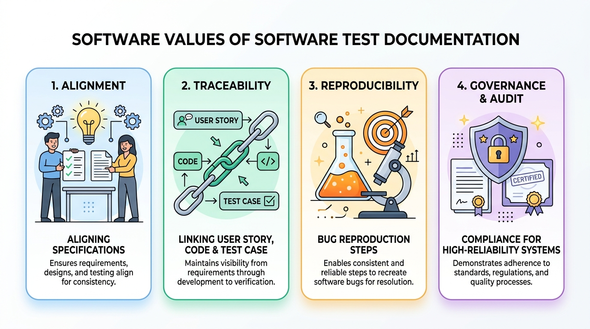
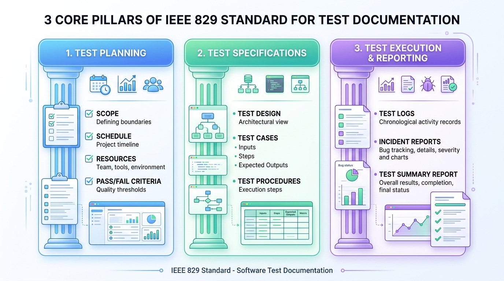
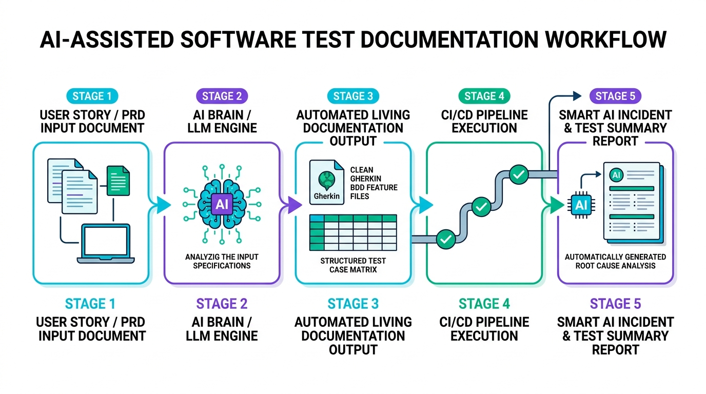

# Ch09 測試文件與現代化實踐

> [!NOTE]
> Tiger 把報告放在雄太的桌上，「老實說，我覺得寫這個文件沒有什麼用」他有點神氣的說，「還是寫程式比較實在」。
>
> 雄太沒有回答，靜靜的看了兩三分鐘。他抬頭說：「的確是沒什麼用」。Tiger 於是高興著。
>
> 「那就重寫吧，讓它有用」。雄太接著說。

> **不要輕忽文件的撰寫，他和寫程式一樣，需要清楚的邏輯與架構。** 好的測試文件不是為了應付主管或客戶的官僚產物，而是**軟體品質工程的指北針與溝通契約**。

---

## 9.1 測試文件的基本概念與核心價值

在敏捷開發與現代軟體工程中，「測試文件」的形式已大幅演進，但其背後的四大核心價值始終不變：



**圖形解說：測試文件的四大核心價值**
1.  **1. 對齊規格認知 (Alignment)**：
    *   消除產品經理 (PO)、開發工程師與測試工程師之間的認知落差，確保所有人對「完成定義 (Definition of Done, DoD)」有精確且一致的標準。
2.  **2. 需求雙向可追溯性 (Traceability)**：
    *   建立需求追溯矩陣 (RTM)，將 User Story ➔ 實作程式碼 (Code) ➔ 測試案例 (Test Case) 緊密串聯，證明每一項商業需求皆經過嚴格檢驗，無遺漏亦無冗餘代碼。
3.  **3. 缺陷精準重現 (Reproducibility)**：
    *   提供客觀、科學且可重複執行的驗證步驟，徹底終結「在我的電腦上明明正常」的推諉現象，加速除錯與修復週期。
4.  **4. 品質治理與審計合規 (Governance & Audit)**：
    *   為金融、醫療、航太與高可靠度分散式系統提供法律與安全稽核之客觀品質證明（如 ISO 25010 / FDA / PCI-DSS 合規）。

*   **傳統重型文件 vs. 現代活文件 (Living Documentation)**：
    *   **傳統做法**：耗費數週撰寫上百頁 Word 測試計畫，寫完後系統需求早已變更，文件淪為「寫完即丟的死文件」。
    *   **現代做法（Doc-as-Code）**：測試文件與原始碼放在同一個 Git Repo，採用 Markdown、Gherkin 語法或自動化報表（如 Allure / JUnit XML），每次 CI/CD 執行時自動產出最新活文件。

---

## 9.2 經典標準：精簡版 IEEE 829 架構

IEEE 829（現納入 ISO/IEC/IEEE 29119-3）是軟體工程歷史上最具代表性的測試文件標準。傳統 IEEE 829 定義了八大階段十餘種繁複報告，現代工程可將其**精簡提煉為三大核心支柱 (3 Core Pillars)**：



**圖形解說：IEEE 829 現代精簡三大支柱**
*   **第一支柱：測試計畫 (Test Planning)**：確立宏觀戰略，釐清範疇邊界 (Scope)、時程進度 (Schedule)、團隊資源 (Resources) 與品質通過門檻 (Pass/Fail Criteria)。
*   **第二支柱：測試規格 (Test Specifications)**：制定具體戰術，涵蓋架構設計 (Test Design)、具體測試案例 (Test Cases: 前置條件、輸入測資、預期輸出) 與執行步驟 (Test Procedures)。
*   **第三支柱：測試執行與報告 (Test Execution & Reporting)**：記錄客觀數據，包含執行日誌 (Test Logs)、缺陷事件單 (Incident Reports) 與發布總結報告 (Test Summary Report)。

---

### 9.2.1 第一支柱：測試計畫 (Test Plan)
測試計畫是高階戰略藍圖，釐清測試的**邊界、資源與驗收門檻**：
1.  **測試範圍 (Scope)**：
    *   **In-Scope（測試項目）**：本期 Sprint/Release 需驗證之功能模組與非功能指標（如 P95 延遲）。
    *   **Out-of-Scope（不測試項目）**：第三方金流沙盒、尚未上線之後台模組等，明確劃定責任邊界。
2.  **通過與失敗準則 (Pass/Fail Criteria)**：
    *   明確定義 Quality Gate（例如：所有 P0/P1 測試案例 100% 通過、無 Critical/High 安全漏洞、變異測試殺死率 > 75%）。
3.  **暫停與重啟條件 (Suspension & Resumption Criteria)**：
    *   何時終止測試？（例如：核心登入服務當機阻塞流程，測試立即暫停並退回開發）。
4.  **環境與資源配置**：硬體、Docker 容器叢集、測試帳號與人員分工。

### 9.2.2 第二支柱：測試規格 (Test Specifications)
測試規格是戰術設計，包含**如何設計測資與操作步驟**：
1.  **測試設計規格 (Test Design Specification)**：架構層次的測試策略（採用何種黑箱等價劃分、哪些模組套用屬性測試）。
2.  **測試案例規格 (Test Case Specification)**：
    *   **前置條件 (Preconditions)**：使用者需具備 VIP 權限且帳戶餘額為 100 元。
    *   **輸入測資 (Test Inputs)**：具體邊界值與參數。
    *   **執行步驟 (Execution Steps)**：操作路徑 1 ➔ 2 ➔ 3。
    *   **預期輸出 (Expected Results)**：UI 顯示扣款成功提示，資料庫餘額更新為 50 元。
3.  **測試程序 (Test Procedures)**：自動化腳本之執行指令或手動測試的操作清單。

### 9.2.3 第三支柱：測試執行與報告 (Test Execution & Reporting)
測試執行期與收官時的**客觀數據與缺陷追蹤**：
1.  **測試日誌 (Test Log)**：記錄每次自動化測試運行的時間戳記、執行案例數與 Pass/Fail 統計。
2.  **缺陷/事件報告 (Incident / Bug Report)**：
    *   標題、嚴重度 (Severity: Critical/Major/Minor)、優先級 (Priority: P0/P1/P2)。
    *   **最小可重現步驟 (Minimal Reproduction Steps)**。
    *   實際結果 (Actual) vs. 預期結果 (Expected)、日誌與螢幕錄影。
3.  **測試總結報告 (Test Summary Report)**：
    *   向 Stakeholder 報告整體品質狀況、殘留風險分析與發布建議（Go / No-Go Decision）。

---

## 9.3 AI 時代的現代測試文件實踐 (AI-Assisted Living Documentation)

生成式 AI 與 LLM 的成熟，徹底顛覆了測試文件的撰寫與維護成本。測試文件不再是負擔，而是能夠**被 AI 理解、自動生成、並直接驅動自動化執行的「活資產」**。



**圖形解說：AI 輔助現代化測試文件五大階段工作流**
*   **Stage 1：需求規格輸入 (User Story / PRD Input)**：產品經理提供原始 PRD 規格文件或使用者故事 (User Stories)。
*   **Stage 2：AI 核心分析引擎 (AI Brain / LLM Engine)**：大型語言模型依據等價劃分、邊界值分析與防禦性不變量 (Invariants) 進行語意分析與測試路徑展開。
*   **Stage 3：自動產出活文件 (Automated Living Documentation)**：
    *   生成可直接執行的 **Gherkin BDD Feature Files**（規格即代碼）。
    *   生成涵蓋 Happy Path 與極端邊界的結構化 **測試案例矩陣 (Structured Test Matrix)**。
*   **Stage 4：CI/CD 全自動化流水線執行 (CI/CD Pipeline Execution)**：代碼 Commit 後自動觸發 JUnit 5、Playwright 與 Testcontainers 執行，即時產出綠燈驗證報表。
*   **Stage 5：智慧缺陷與總結報告 (Smart AI Incident & Summary Report)**：若執行失敗，AI 自動萃取錯誤堆疊與容器日誌，直接產出含**根本原因分析 (RCA)** 與修復建議的缺陷報告。

### 9.3.1 規格即代碼 (Doc as Code) 與 BDD 活文件
*   **Markdown + Git 協同審查**：
    *   測試計畫以 Markdown 撰寫並放置於專案 `/docs/test/`，隨程式碼一起發布 Pull Request，透過 Code Review 機制共同審查測試完整性。
*   **Gherkin 活文件 (Living Docs)**：
    *   以 `Given-When-Then` 撰寫的 Feature 規格，既是業務人員看得懂的驗收規格書，又是 Cucumber-JVM 可直接執行的自動化測試代碼。

### 9.3.2 AI 輔助從 PRD / 需求自動生成測試矩陣 (Test Matrix)
透過給定產品需求規格書 (PRD) 或 User Story，Prompting LLM 依據邊界值與等價類原則自動產出結構化測試案例：

```markdown
🤖 【AI Prompt 範例：從規格生成測試案例】
請扮演資深 SQA 專家。依據以下購物車折價券功能規格，產出結構化測試案例矩陣：
1. 包含 Happy Path 與 Negative Edge Cases（滿額折抵、過期券、併用規則）。
2. 每筆案例需列出：前置條件、輸入參數、預期輸出與 ISO 25010 對應維度。
3. 輸出為標準 Markdown 表格格式。
```

### 9.3.3 AI 智慧缺陷分析與自動化 RCA (Root Cause Analysis)
*   **CI/CD 失敗自動提單**：當 GitHub Actions 中的自動化測試失敗時，AI Bot 自動讀取失敗的 Stack Trace 與容器日誌，自動分析可能出錯的代碼行，並在 GitHub Issue 中生成完整的 Bug 報告與初步修復建議。
*   **測試涵蓋率與缺口分析 (Coverage Gap Analysis)**：AI 掃描 PR 變更的代碼邏輯與現有測試文件，主動提示：「發現此 PR 新增了退款失敗重試邏輯，但測試文件中缺乏網路超時情境的測試案例」。

---

## 9.4 測試文件品質檢核清單 (Checklist)

在簽核或定稿測試文件時，可透過以下檢核清單確保其專業度與實用性：

- [ ] **範圍邊界清晰**：In-Scope 與 Out-of-Scope 是否明確定義，無模糊地帶？
- [ ] **需求可追溯性 (Traceability)**：是否建立需求追溯矩陣（RTM），每個商業需求皆有對應案例？
- [ ] **驗收準則量化 (SLA/KPI)**：Pass/Fail Criteria 是否具備客觀數據（如覆蓋率 > 80%、P95 < 200ms）？
- [ ] **測試案例可重現**：前置條件、輸入參數與預期輸出是否具體明確，任何新進工程師皆能依照步驟重現？
- [ ] **例外與負向情境涵蓋**：是否包含邊界值、無效輸入、網路中斷與權限越權等負向測試？
- [ ] **維護性 (Doc as Code)**：文件是否納入版本控管，並能隨著系統迭代持續更新？

---

## 9.5 練習與思考

1.  **傳統 vs 現代**：為什麼說「以 Markdown 撰寫的 Gherkin BDD 規格」是現代「活文件 (Living Documentation)」的最佳典範？
2.  **IEEE 829 精簡應用**：在敏捷雙週 Sprint 的步調下，如何將 IEEE 829 的三大支柱（計畫、規格、報告）融入日常的 Jira / GitHub 流程中？
3.  **AI in QA 實戰**：給定一個「使用者註冊密碼強度檢驗」的簡單需求，嘗試撰寫 Prompt 讓 AI 生成包含等價類、邊界值與極端字元的完整測試案例表格。
4.  **缺陷報告品質**：為什麼「在我的電腦上明明正常」不能當作關閉 Bug 的理由？一份高質感的缺陷事件報告（Incident Report）應該包含哪些必要欄位？