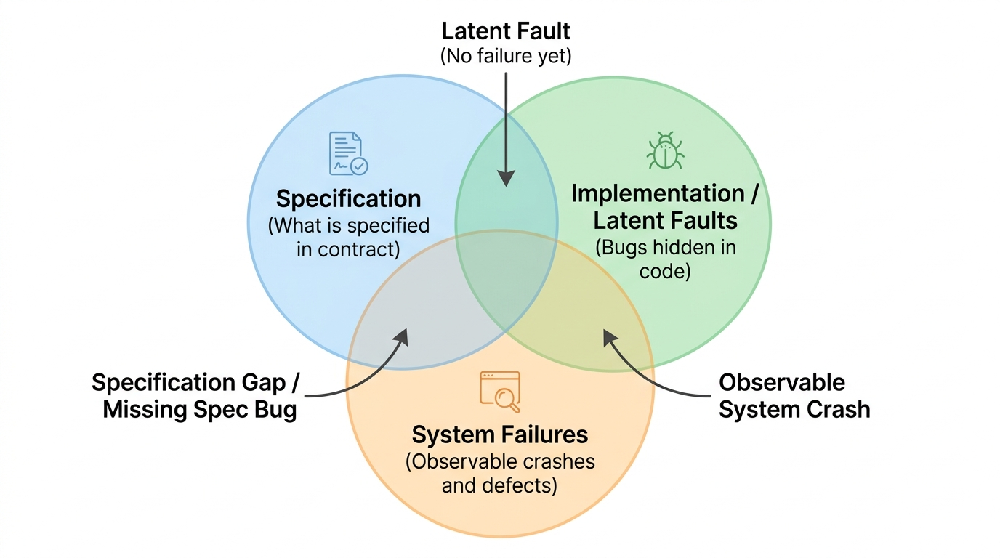
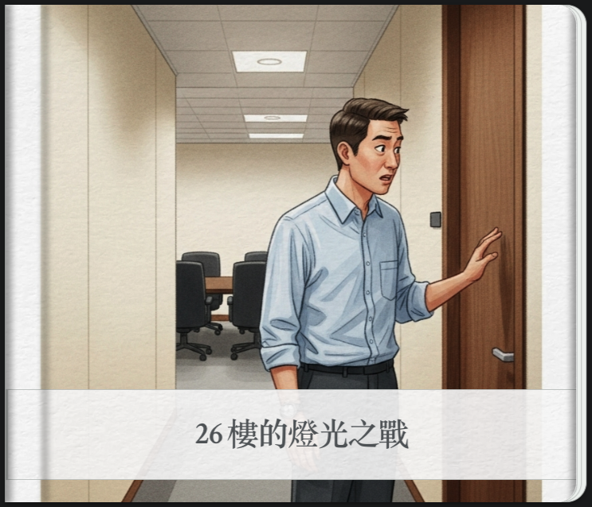

# Ch02 錯與除錯 (Bugs, Faults, and Debugging)

> 一夥程式設計師正在啟奏當今皇上。「今年有什麼偉大的成就嗎？」皇上問道。
> 
> 程式設計師私下討論了一會兒，然後回話：「比起去年，我們今年多修正了 50% 的 Bug」。😊😊
> 
> 皇上滿臉困惑的看著他們。他顯然並不知道「Bug」是什麼。他低聲與宰相商量一會兒，然後轉向這些程式設計師，面露慍色。
> 
> 「你們犯了品質管制不良之罪。明年起不得在有任何的 Bug！」
> 
> 他當庭宣下這道聖旨。😤
> 
> 當然啦，明年當這夥程式設計師再度向皇上奏報時，就完全不提 Bug 的事了 🤷🤷🤷
> 
> (取自溫伯格的《軟體管理學》第一卷 系統化思考)。

<a href="https://g.co/gemini/share/fdd83982f1a8"></a>

---

## 2.1 臭蟲與錯誤

### 2.1.1 臭蟲的由來與因果鏈

1947 年 9 月 9 日下午 3 點 45 分，**Grace Murray Hopper** 在她的筆記本上記下了史上第一個電腦 bug ——在 Harvard Mark II 電腦裡找到的一隻飛蛾，她把飛蛾貼在日記本上，並寫道「*First actual case of bug being found*」。這個發現奠定了 Bug 這個詞在電腦世界的地位。Grace Murray Hopper 是 Harvard Mark I 上第一個專職程式設計師，創造了現代第一個編譯器 A-0 系統，以及第一個高級商用電腦程式語言「COBOL」，被譽為「COBOL 之母」，被稱為「不可思議的葛麗絲（Amazing Grace）」。

口語上常用「Bug」統稱所有問題，但在軟體工程國際標準（IEEE 610.12）中，對錯誤的發生有著非常嚴密的四階段因果鏈：


**圖形解說：IEEE 610.12 臭蟲四階段因果鏈**
1.  **1. Human Mistake / Error (人類犯錯)**：分析師、架構師或工程師的心智失誤、誤解需求或打錯程式碼。
2.  **2. Code Fault / Defect / Bug (程式碼缺陷)**：犯錯的結果具體體現在軟體產出物中（如程式碼寫錯運算子、邊界值少寫等號）。
3.  **3. Internal Error State (內部錯誤狀態)**：含有 Fault 的程式碼被 CPU 執行時，記憶體資料或系統狀態出現了不一致（例如計數器變負數）。
4.  **4. System Failure (系統對外失效)**：系統對外的可觀察行為偏離了預期規格（如拋出 500 Crash、ATM 吐錯金額、系統當機）。

> 📌 **關鍵定理**：
> * 系統中有 **Fault（缺陷）**，不一定會馬上導致 **Failure（失效）**（如果該行程式碼從未被執行，或錯誤狀態被剛好掩蓋）。
> * 但只要有 **Failure**，必然意味著有 **Fault** 或環境異常介入！

#### **概念核對問答 (CCQ 1)**

**問題**

工程師在撰寫銀行轉帳演算法時，誤將手續費計算公式的減號寫成加號，並將程式碼編譯部署到伺服器。但在當天的日常營運中，所有客戶轉帳金額均未達到觸發扣除手續費的門檻，因此沒有任何客戶發現轉帳異常。依據 IEEE 軟體工程定義，此時系統處於何種狀態？

A) 系統已發生失效 (Failure)  
B) 程式碼中存在缺陷 (Fault/Defect)，但尚未表現為系統失效 (Failure)  
C) 工程師並未犯錯 (Mistake)，因為系統正常運作  
D) 該程式碼完全符合軟體品質的正確性定義  

<details>
<summary>點擊查看【概念核對問答】答案與解析</summary>

**正確答案：B**

* **解析**：
  * **選項 B 正確**：工程師犯錯 (Mistake) 已將錯誤邏輯植入程式碼中形成缺陷 (Fault)。由於該分支邏輯在當天未被執行或未造成對外行為偏離，因此尚未轉化為可被觀察到的系統失效 (Failure)。
  * **選項 A 錯誤**：客戶未觀察到異常行為，尚未發生 Failure。
  * **選項 C/D 錯誤**：程式碼內確實存在潛伏的邏輯錯誤。

</details>

---

### 2.1.2 規格導致的缺陷

並不是所有的錯誤都是因為「寫錯程式」，很多時候是「**規格本身有問題（Ambiguous or Missing Spec）**」。

針對一個計算機，以下的計算結果或現象是不是錯誤？
- `5 / 2 = 2` （整數除法 vs 浮點除法？）
- `1/3 * 3 = 0.999999` （浮點精度限制）
- 需要次方功能，系統卻沒有提供
- 平方根功能根本不需要，系統卻額外做了
- 輸入 `88888888 * 88888888` 發生整數溢位顯示負數
- 輸入 `1 / 0` 產生未攔截的 Crash

> 📌 **「我前方沒有規格，錯誤在我身後形成。」**

考慮以下三個規格：
- *規格一：* 設計一個除法器，使用者可以輸入被除數、除數，呈現出小數點後兩位結果。
- *規格二：* 設計一個除法器，使用者可以輸入被除數、除數。使用者不得輸入除數為 0。（*缺點：未說明輸入 0 時系統該如何處理*）
- *規格三：* 設計一個除法器，使用者輸入除數若為 0，系統應清除結果欄位，並回傳 HTTP 400 及友善錯誤提示「除數不得為零」。（*優良的契約規格*）



**圖形解說：規格 (Spec)、程式缺陷 (Fault) 與系統失效 (Failure) 之交集關係**
*   **Latent Fault (潛伏缺陷)**：程式碼有 Bug（如記憶體洩漏或特定邊界條件溢位），但在一般情境下未觸發對外失效。
*   **Specification Gap / Missing Spec Bug (規格遺漏缺陷)**：規格書未明確規範異常處理（如使用者輸入除數為 0 或負數年齡），導致系統直接崩潰。
*   **Observable System Crash (可觀察系統失效)**：缺陷被觸發並跨越邊界，產生對外可觀察到的功能異常或當機。

沒有失效不代表沒有缺陷；符合明訂規格也不代表高品質。專業軟體工程師必須具備「**為規格補全邊界例外**」的防禦性素養。

#### **概念核對問答 (CCQ 2)**

**問題**

某專案經理向客戶抱怨：「使用者輸入了負數的年齡導致伺服器當機，這是使用者的操作錯誤，不是我們程式的 Bug，因為規格書上根本沒寫年齡可以是負數！」從現代軟體工程與 SQA 的角度，下列評述何者最為正確？

A) 專案經理說得完全正確，未在規格書載明的輸入情況，開發團隊不負任何責任  
B) 這是典型的「規格遺漏」與「缺乏防禦性設計」，專業軟體應主動對非法輸入進行驗證並優雅回傳錯誤，而非直接 Crash  
C) 只要資料庫欄位設為 Integer，任何數字輸入都不應該算是 Bug  
D) 只要客戶願意加錢，所有未明訂的規格才需要被修復  

<details>
<summary>點擊查看【概念核對問答】答案與解析</summary>

**正確答案：B**

* **解析**：
  * **選項 B 正確**：專業軟體品質保證強調防禦性架構（Robustness & Input Validation）。即使規格書未詳盡列出所有非法數值，系統也絕不能因為未受檢驗的輸入而發生未捕獲的例外或崩潰。

</details>

---

### 2.1.3 常見編碼錯誤分類

1. **算術與精度錯誤**：
   * 除以零 (Divide by Zero)
   * 整數溢位 (Integer Overflow, 例如 `MAX_INT + 1` 變成負數)
   * 浮點數捨入與累計誤差 (Floating-point Imprecision)
2. **邏輯與迴圈錯誤**：
   * 無窮迴圈 (Infinite Loop)
   * **差一錯誤 (Off-by-one bug, OBOB)**：
     ```java
     // 典型的差一錯誤：陣列索引越界
     for (int i = 0; i <= array.length; i++) {
         System.out.println(array[i]);
     }
     ```
3. **資源相關臭蟲 (Resource Leaks)**：
   * `NullPointerException` (未做空值檢查)
   * 記憶體與連線池洩漏 (Memory / Connection Leak，開啟 Stream/DB Connection 未關閉)
   * 釋放後使用 (Use-after-free error)
4. **多執行緒與並發臭蟲 (Concurrency Bugs)**：
   * **死結 (Deadlock)**：執行緒 A 等待 B，B 等待 A。
   * **競爭條件 (Race Condition)**：缺乏適當同步機制，執行順序隨機導致資料不一致。

---

## 2.2 除錯思維與方法 (Debugging)

### 2.2.1 除錯的核心思維

> 「在自己的程式裡找出一個錯誤是十分困難的；而當你認為自己的程式絕對沒有錯誤時，那就更是難上加難。」 —— *Steve McConnell*

除錯不是「碰碰運氣胡亂修改（Shotgun Debugging）」，而是嚴謹的**科學偵探過程**：
* **不要只改徵兆**：找到根因（Root Cause）再動手，治標不治本只會引來更多 Bug。
* **錯誤會群聚 (Defect Clustering)**：一個地方發現 Bug，往往代表同一模組、同一人寫的鄰近邏輯也有問題。
* **回歸測試保護**：修復一個 Bug 時，必須確保**沒有破壞既有功能**（用自動化測試套件保護）。

### 2.2.2 科學除錯五步驟


**圖形解說：科學除錯五步驟流程**
1.  **1. Reproduce (穩定重現)**：建立一個能 100% 重現 Bug 的最小失敗測試案例 (Minimal Failing Test Case)。
2.  **2. Hypothesize (假設形成)**：根據現象、日誌與 Call Stack 提出 1~2 個根本原因假設。
3.  **3. Experiment (實驗驗證)**：設定斷點 (Breakpoint) 或檢視日誌追蹤，驗證或推翻假設。
4.  **4. Fix (根因修復)**：修改核心架構或演算法邏輯，進行乾淨重構，而非只在表面加 try-catch 吞掉例外。
5.  **5. Regression Test (回歸驗證)**：執行自動化測試套件，確保失敗測試轉綠，且既有功能維持 100% 綠燈無回歸。

---

### 2.2.3 邏輯推演與除錯

除錯需要嚴密的命題邏輯推理，避免犯下常見的邏輯謬誤：

* **充分條件與必要條件的混淆**：
  * 若 p ⇒ q（開啟快取會導致資料錯誤），**不能反推** q ⇒ p（資料錯誤一定是快取引起的）。
  * 更不能反推 ¬p ⇒ ¬q（關閉快取就絕對不會出錯）。
* **多因一果的逆否推論**：
  * 若 p₁ ∧ p₂ ⇒ Crash（同時在 Win10 環境且安裝卡巴防毒才會崩潰）。
  * 則其逆否命題為：¬Crash ⇒ ¬p₁ ∨ ¬p₂（如果系統沒有崩潰，代表至少有一項條件不成立）。

---

### 2.2.4 🤖 AI 時代的輔助除錯 (AI-Assisted Debugging)

在 2026 年，大三學生幾乎天天都在使用 LLM（ChatGPT, Claude, Copilot）來幫忙找 Bug。然而，**AI 輔助除錯存在巨大的陷阱與正確的使用 SOP**：

#### ⚠️ AI 除錯的兩大常見陷阱
1. **「膠帶式修復 (Band-aid / Patch Fix)」**：
   * 當你把 `NullPointerException` 的錯誤訊息貼給 AI，AI 往往會給出 `if (obj != null) { ... }` 這種表面修復。
   * **問題**：這只是掩蓋了錯誤，`obj` 為 null 的根本原因（如上游初始化失敗、資料庫查詢為空）完全沒有被解決，錯誤只是被延遲推遲到更難查的地方！
2. **自我印證偏誤與回歸破壞**：
   * AI 修改這一段代碼時，可能破壞了系統其他地方隱含的不變量（Invariants），引入隱蔽的 **回歸缺陷 (Regression Defect)**。

#### 🛡️ 人機協同除錯的黃金 SOP (AI Debugging Protocol)
1. **提供充分上下文 (Context)**：不要只貼單行報錯，必須提供完整的 **Stack Trace、相關方法程式碼、輸入資料與預期業務規則**。
2. **要求根因解釋而非直接給代碼**：Prompt：「*請分析引發此 Exception 的 3 個可能根本原因，並指出此修復是否會破壞任何前置條件。*」
3. **先寫測試再修復 (Test-First Bug Fix)**：利用 AI 生成一個**「專門重現該 Bug 的失敗單元測試」**，修復後測試轉綠，並跑完整體 CI 測試確認無回歸。

#### **概念核對問答 (CCQ 3)**

**問題**

當生產環境拋出 `ConcurrentModificationException` 時，工程師直接將整段程式碼貼給 AI，AI 建議在出錯的迴圈外層直接包裹一個空的 `try-catch` 區塊將例外吞掉。關於這種做法，下列評價何者最為精準？

A) 這是絕佳的快速修復方案，因為系統再也不會拋出例外中斷服務  
B) 這是危險的「治標不治本（Swallowing Exception）」，雖然表象不報錯，但底層多執行緒並發衝突與資料不一致依然存在，日後會引發更嚴重的資料損壞  
C) 只要 AI 給出的程式碼能通過編譯，就代表已經通過軟體品質驗證  
D) 只有在 Java 8 以前才會有並發問題，現代 Java 框架不需要理會此例外  

<details>
<summary>點擊查看【概念核對問答】答案與解析</summary>

**正確答案：B**

* **解析**：
  * **選項 B 正確**：吞掉例外（Swallowing Exceptions）是嚴重的反模式（Anti-pattern）。它只是掩蓋了錯誤徵兆，實質上的並發競爭依然存在，並會導致資料悄悄被破壞。

</details>

---

## 2.3 除錯工具實務 (Debuggers)

除錯工具是工程師的聽診器與手術刀。現代 IDE（如 IntelliJ IDEA）提供了極強大的功能：
* **條件斷點 (Conditional Breakpoints)**：只在變數符合特定條件時才暫停（例如 `i == 999` 或 `user.getBalance() < 0`）。
* **例外斷點 (Exception Breakpoints)**：只要系統拋出特定 Exception（如 `NullPointerException`）立刻自動中斷並定格 Call Stack。
* **變數求值 (Evaluate Expression)**：在程式暫停時即時執行運算式驗證假設。

> 🛠️ **實習演練手冊**：請參閱 [`Lab/u02_debug/debug.md`](../Lab/u02_debug/debug.md) 與 [`Lab/u02_debug/Intellij.md`](../Lab/u02_debug/Intellij.md) 進行除錯實務操作。

---

## 2.4 防禦性編程與契約式設計 (Design by Contract)

開車遇到綠燈時，多數老司機依然會減速並左右張望，因為無法保證其他人不會闖紅燈。寫程式亦是如此。**防禦性編程 (Defensive Programming)** 是一種主動預防錯誤擴散的工程態度。

### 2.4.1 契約式設計的三大核心要素 (Bertrand Meyer)


**圖形解說：Bertrand Meyer 契約式設計 (DbC) 三大核心法則**
1.  **Preconditions (前置條件 - `requires`)**：呼叫者 (Caller) 必須滿足的條件；若不滿足，被呼叫的方法有權直接拒絕執行。
2.  **Postconditions (後置條件 - `ensures`)**：方法正常執行完畢後，向呼叫者保證達成的狀態與輸出結果。
3.  **Class Invariants (類別不變量 - `maintains`)**：物件在任何公開方法調用前後，必須永遠維持為真的核心業務法則（如 `balance >= 0`）。

* **狀態不變量 (Invariants) 的重要性**：
  * 任何操作若破壞了不變量，系統應立即自我熔斷，避免髒資料寫入資料庫。這也是後續**屬性基礎測試 (Property-Based Testing)** 的核心基石！

### 2.4.2 斷言 (Assertion) vs 例外處理 (Exception)

| 機制 | 目的 | 適用時機 | 生產環境行為 |
| :--- | :--- | :--- | :--- |
| **斷言 (Assertion)** | 捕捉「程式設計師自身的邏輯 Bug」或內部不變量 | 私有方法參數檢查、演算法內部狀態、不可能到達的分支 | 可被 `-ea` / `-da` 開關關閉 |
| **例外 (Exception)** | 處理「執行時外部可預期的異常環境」 | 公開 API 參數驗證、網路中斷、檔案不存在、使用者輸入錯誤 | 永遠處於啟用狀態，需有明確捕獲處理 |

> 🛠️ **實習手冊連結**：
> * 斷言實務：[`Lab/u03_preventive/assertion.md`](../Lab/u03_preventive/assertion.md)
> * 例外架構：[`Lab/u03_preventive/exception.md`](../Lab/u03_preventive/exception.md)
> * 結構化日誌：[`Lab/u03_preventive/logging.md`](../Lab/u03_preventive/logging.md)

---

## 2.5 缺陷管理與議題追蹤 (Defect Management & BTS)

### 📖 2.5.1 寓言：大樓的燈

<a href="https://g.co/gemini/share/c381192abfd4"></a>

「26 樓會議室的燈亮著。應該關掉吧。」Bug 備註裡寫道「請 5 分鐘內搞定，只要按一下開關就好了。」

我去了 26 樓的會議室。**燈的確亮著，但房間裡沒有燈的開關 😳😳**。

我需要安裝開關，但設計師說破壞美感，且牆壁是混凝土，買工具沒人批准。郵件鏈開始恐慌，最後期限就是今天。於是我爬進天花板，找到電線，**一刀剪斷，問題解決了😎**。

大家開始擔心長官開會怎麼辦，要求我把電線接到地下室。當我到地下室，**發現牆上已經掛了幾十條前人留下的電線😲**。我接好線回到座位，QA 又重新開啟了 Bug：「房間還是亮著！」

我抗議說燈泡明明是滅的。QA 說：「**我說的 Bug 不是燈泡，是房間裡的光！現在不夠暗，你應該拉下百葉窗！**」

> 💡 **隱喻解析**：
> 1. 「疊床架屋、治標不治本」的剪線修法，日後必然造成更大的技術債（地下室的幾十條電線）。
> 2. 缺陷的界定如果缺乏規格標準，常常會演變成「燈泡還是光」的無效爭吵。

---

### 2.5.2 完整缺陷生命週期狀態機 (Defect Tracking Lifecycle)

在專業軟體團隊中，缺陷的追蹤與管理具備嚴謹的狀態轉換流程：


**圖形解說：完整缺陷追蹤生命週期 (Bug Workflow)**
*   **主流程狀態 (Main Flow)**：
    1.  **New (新建)**：測試人員或使用者回報新缺陷，等待 Triage 分流審查。
    2.  **Assigned (已指派)**：指派給負責工程師並排定修復時程。
    3.  **Open / In Progress (處理中)**：工程師正在深入排查根因並撰寫修復代碼。
    4.  **Fixed / Resolved (已修復)**：工程師提交 PR 並通過 CI，等待 QA 驗證。
    5.  **QA Retest / Verified (QA 驗證)**：QA 依照驗收標準與回歸測試套件進行重測。
    6.  **Closed (結案關閉)**：確認修復無誤且無回歸問題，正式關閉 Issue。
*   **分支流程狀態 (Branch Flows)**：
    *   **Rejected / Duplicate (拒絕 / 重複)**：非 Bug、環境設定錯誤或重複回報 ➔ 直接結案 (Closed)。
    *   **Deferred (延期處理)**：非當前 Release 關鍵缺陷 ➔ 移入 Backlog 待未來版本處理。
    *   **Reopened (重新開啟)**：QA 重測未通過 ➔ 打回 Assigned 狀態重新排查。

---

### 2.5.3 嚴重度 (Severity) vs 優先級 (Priority) 度量矩陣

在缺陷管理系統（如 Jira / GitHub Issues）中，**嚴重度**（技術衝擊）與**優先級**（業務急迫性）是兩個正交的度量維度：


**圖形解說：嚴重度 (Severity) vs 優先級 (Priority) 2x2 決策矩陣**
1.  **1. 高嚴重度 + 高優先級 (Critical Impact - 立即修復)**：
    *   *實例*：核心金流支付當機、全站 500 Crash、重大個資外洩漏洞。
    *   *處理策略*：立刻發布緊急熱修復 (Hotfix)，阻斷發布流程。
2.  **2. 低嚴重度 + 高優先級 (Visibility / Prompt Fix - 快速修復)**：
    *   *實例*：公司官網首頁 Logo 拼錯（如 `Compnay`）、主畫面出現誤導性文案。
    *   *處理策略*：雖不影響系統底層運作，但嚴重損害商譽與對外形象，需優先排定修復。
3.  **3. 高嚴重度 + 低優先級 (Major Defect - 排程修復)**：
    *   *實例*：僅在極罕見的舊版 Windows 95 環境下才會觸發的當機、單一極冷門用戶的特定查詢失敗。
    *   *處理策略*：衝擊雖大但發生率極低，排入後續 Sprint 正常迭代修復即可。
4.  **4. 低嚴重度 + 低優先級 (Minor Issues - 日後優化)**：
    *   *實例*：內部管理後台冷門報表微小的像素對齊偏差。
    *   *處理策略*：有空再修或待介面重構時一併處理。

---

## ✍️ 2.6 綜合練習

1. **Bug / Fault / Failure 辨析**：
   * 請各舉出一個軟體開發中的 Mistake, Fault, Error State 與 Failure 實例，並畫出其因果關聯。
2. **邏輯推理除錯**：
   * 某系統已知：若（記憶體不足 ∨ 網路超時），則（交易會回滾 ∧ 記錄日誌）。若今天發現「交易成功未回滾」，請推導出記憶體與網路的狀態為何？
3. **MaxHeap 除錯實戰**：
   * 檢視下列 `MaxHeap` 實作，找出其中的 3 個潛在 Bug（包含索引計算與邊界條件），並加上適當的 `assert` 來確保 Heap Invariants：

```java
public class MaxHeap {
    private int[] heap;
    private int size;
    private int capacity;

    public MaxHeap(int capacity) {
        this.capacity = capacity;
        this.size = 0;
        this.heap = new int[capacity];
    }

    private int getParentIndex(int index) {
        return (index - 1) / 2;
    }

    private int getLeftChildIndex(int index) {
        return 2 * index + 1;
    }

    private int getRightChildIndex(int index) {
        return 2 * index + 2;
    }

    private void swap(int index1, int index2) {
        int temp = heap[index1];
        heap[index1] = heap[index2];
        heap[index2] = temp;
    }

    public void insert(int value) {
        if (size >= capacity) {
            throw new IllegalStateException("Heap is full.");
        }
        heap[size] = value;
        int currentIndex = size;
        size++;

        while (currentIndex > 0 && heap[currentIndex] > heap[getParentIndex(currentIndex)]) {
            swap(currentIndex, getParentIndex(currentIndex));
            currentIndex = getParentIndex(currentIndex);
        }
    }
}
```