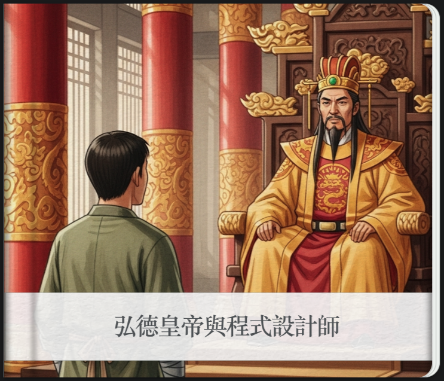
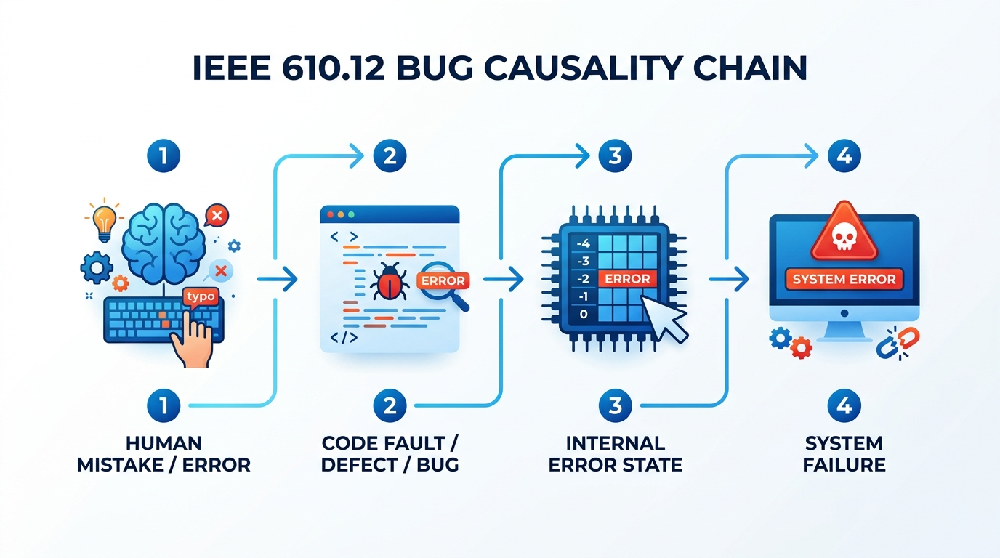
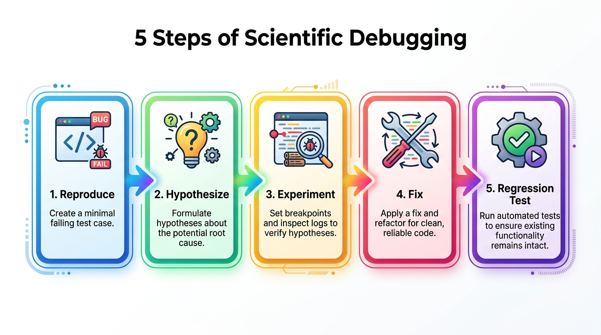
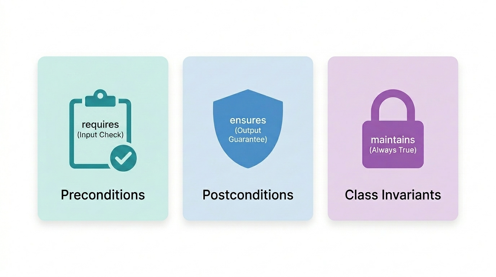
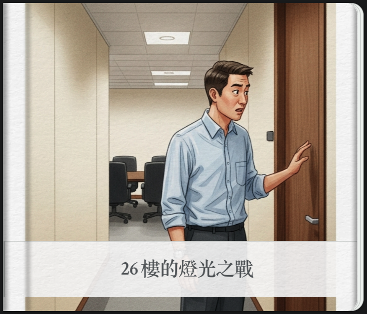
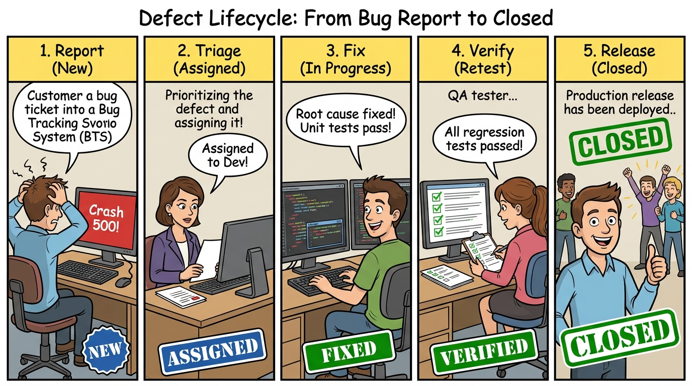
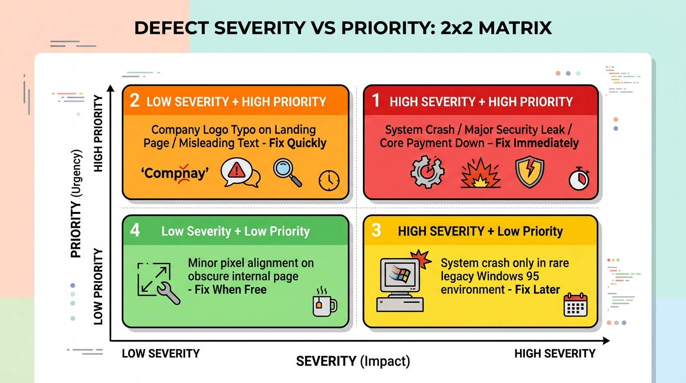

# Ch02 錯與除錯 (Bugs, Faults, and Debugging)

> 一夥程式設計師正在啟奏當今皇上。「今年有什麼偉大的成就嗎？」皇上問道。
> 
> 程式設計師私下討論了一會兒，然後回話：「比起去年，我們今年多修正了 50% 的 Bug」。😊😊
> 
> 皇上滿臉困惑的看著他們。他顯然並不知道「Bug」是什麼。他低聲與宰相商量一會兒，然後轉向這些程式設計師，面露慍色。
> 
> 「你們犯了品質管制不良之罪。明年起不得在有任何的 Bug！」
> 
> 他當庭宣下這道聖旨。😤
> 
> 當然啦，明年當這夥程式設計師再度向皇上奏報時，就完全不提 Bug 的事了 🤷🤷🤷
> 
> (取自溫伯格的《軟體管理學》第一卷 系統化思考)。
 
<a href="https://g.co/gemini/share/fdd83982f1a8"></a>
 
---

## 📌 本章目錄與重點導讀 (Table of Contents & Highlights)

除錯與防錯是軟體工程師最核心的硬實力。本章建立從「認識缺陷因果」到「開發者防錯設計」與「科學化除錯排查」的完整心智模型：

```
Ch02 知識架構全景：
【認識缺陷】2.1 臭蟲因果鏈 (IEEE Mistake➔Fault➔Error➔Failure) ＆ 規格缺陷
【源頭預防】2.2 整潔程式碼 (Clean Code) ＆ 防錯實務（Uncle Bob、心法與 Code Smells）
【科學排查】2.3 科學除錯五步驟 ＆ AI 時代除錯 SOP
【實務利刃】2.4 IDE 除錯工具（斷點、變數求值）
【契約防禦】2.5 契約式設計 (Design by Contract, DbC) ＆ 斷言 (Assertions) vs 例外處理
【團隊治理】2.6 缺陷生命週期 (BTS)、GitHub 版本與議題管理 ＆ 嚴重度 vs 優先級
```

| 章節單元 | 核心學習重點 (Key Takeaways) |
| :--- | :--- |
| **[2.1 臭蟲與錯誤](#21-臭蟲與錯誤)** | 剖析 IEEE 610.12 **臭蟲四階段因果鏈**（Mistake ➔ Fault ➔ Error State ➔ Failure），掌握「規格遺漏 (Missing Spec)」與常見編碼錯誤分類。 |
| **[2.2 整潔程式碼 (Clean Code)](#22-整潔程式碼-clean-code)** | 認識 Uncle Bob 與大師定義；掌握**有意義命名、小巧函式、衛語句 (Guard Clauses) 與無副作用設計**；辨析「Clean Code ≠ Bug-Free Code」重大迷思。 |
| **[2.3 除錯思維與方法 (Debugging)](#23-除錯思維與方法-debugging)** | 建立**科學除錯五步驟**（Reproduce ➔ Hypothesize ➔ Experiment ➔ Fix ➔ Regression Test）；精熟命題邏輯推演與 **AI 時代人機協同除錯黃金 SOP**。 |
| **[2.4 除錯工具實務 (Debuggers)](#24-除錯工具實務-debuggers)** | 掌握現代 IDE 核心功能：條件斷點 (Conditional Breakpoints)、例外斷點與即時表達式求值 (Evaluate Expression)。 |
| **[2.5 防禦性編程與契約式設計 (Design by Contract, DbC)](#25-防禦性編程與契約式設計-design-by-contract-dbc)** | 掌握 Bertrand Meyer 契約式設計三大法則（**前置條件 `requires`、後置條件 `ensures`、類別不變量 `maintains`**）；精準區分**斷言 (Assertion) 與例外 (Exception)**。 |
| **[2.6 缺陷管理與議題追蹤 (BTS)](#26-缺陷管理與議題追蹤-defect-management--bts)** | 透過溫伯格寓言反思技術債；精熟 **缺陷生命週期狀態機** 與理論實證、工具生態；掌握 **GitHub 現代版本與議題協同 (Issues, PR, CI/CD)**；運用 **Severity vs. Priority 2x2 決策矩陣** 排定修復優先級。 |
| **[2.7 綜合練習](#-27-綜合練習)** | 實戰演練：Bug/Fault 因果辨析、邏輯推理排查與 MaxHeap 邊界除錯及 Invariant 斷言。 |

---

## 2.1 臭蟲與錯誤

### 2.1.1 臭蟲的由來與因果鏈

1947 年 9 月 9 日下午 3 點 45 分，**Grace Murray Hopper** 在她的筆記本上記下了史上第一個電腦 bug ——在 Harvard Mark II 電腦裡找到的一隻飛蛾，她把飛蛾貼在日記本上，並寫道「*First actual case of bug being found*」。這個發現奠定了 Bug 這個詞在電腦世界的地位。Grace Murray Hopper 是 Harvard Mark I 上第一個專職程式設計師，創造了現代第一個編譯器 A-0 系統，以及第一個高級商用電腦程式語言「COBOL」，被譽為「COBOL 之母」，被稱為「不可思議的葛麗絲（Amazing Grace）」。

口語上常用「Bug」統稱所有問題，但在軟體工程國際標準（IEEE 610.12）中，對錯誤的發生有著非常嚴密的四階段因果鏈：



**圖形解說：IEEE 610.12 臭蟲四階段因果鏈**
1.  **1. Human Mistake / Error (人類犯錯)**：分析師、架構師或工程師的心智失誤、誤解需求或打錯程式碼。
2.  **2. Code Fault / Defect / Bug (程式碼缺陷)**：犯錯的結果具體體現在軟體產出物中（如程式碼寫錯運算子、邊界值少寫等號）。
3.  **3. Internal Error State (內部錯誤狀態)**：含有 Fault 的程式碼被 CPU 執行時，記憶體資料或系統狀態出現了不一致（例如計數器變負數）。
4.  **4. System Failure (系統對外失效)**：系統對外的可觀察行為偏離了預期規格（如拋出 500 Crash、ATM 吐錯金額、系統當機）。

> 📌 **關鍵定理**：
> * 系統中有 **Fault（缺陷）**，不一定會馬上導致 **Failure（失效）**（如果該行程式碼從未被執行，或錯誤狀態被剛好掩蓋）。
> * 但只要有 **Failure**，必然意味著有 **Fault** 或環境異常介入！

<!-- id: sqa-ch02-ccq1 -->
#### 🙋 **概念核對問答 (CCQ 1)**


**問題**

工程師在撰寫銀行轉帳演算法時，誤將手續費計算公式的減號寫成加號，並將程式碼編譯部署到伺服器。但在當天的日常營運中，所有客戶轉帳金額均未達到觸發扣除手續費的門檻，因此沒有任何客戶發現轉帳異常。依據 IEEE 軟體工程定義，此時系統處於何種狀態？

A) 系統已發生失效 (Failure)  
B) 程式碼中存在缺陷 (Fault/Defect)，但尚未表現為系統失效 (Failure)  
C) 工程師並未犯錯 (Mistake)，因為系統正常運作  
D) 該程式碼完全符合軟體品質的正確性定義

<details>
<summary>點擊查看【概念核對問答】答案與解析</summary>

**正確答案：B**

* **解析**：
  * **選項 B 正確**：工程師犯錯 (Mistake) 已將錯誤邏輯植入程式碼中形成缺陷 (Fault)。由於該分支邏輯在當天未被執行或未造成對外行為偏離，因此尚未轉化為可被觀察到的系統失效 (Failure)。
  * **選項 A 錯誤**：客戶未觀察到異常行為，尚未發生 Failure。
  * **選項 C/D 錯誤**：程式碼內確實存在潛伏的邏輯錯誤。

</details>

---

[課堂互動](https://nlhsueh.github.io/nickedupocket/#/student/sqa-ch02-ccq1)

### 2.1.2 規格導致的缺陷

並不是所有的錯誤都是因為「寫錯程式」，很多時候是「**規格本身有問題（Ambiguous or Missing Spec）**」。

針對一個計算機，以下的計算結果或現象是不是錯誤？
- `5 / 2 = 2` （整數除法 vs 浮點除法？）
- `1/3 * 3 = 0.999999` （浮點精度限制）
- 需要次方功能，系統卻沒有提供
- 平方根功能根本不需要，系統卻額外做了
- 輸入 `88888888 * 88888888` 發生整數溢位顯示負數
- 輸入 `1 / 0` 產生未攔截的 Crash

> 📌 「**我前方沒有規格，錯誤在我身後形成。**」

考慮以下三個規格：
- *規格一：* 設計一個除法器，使用者可以輸入被除數、除數，呈現出小數點後兩位結果。
- *規格二：* 設計一個除法器，使用者可以輸入被除數、除數。使用者不得輸入除數為 0。（*缺點：未說明輸入 0 時系統該如何處理*）
- *規格三：* 設計一個除法器，使用者輸入除數若為 0，系統應清除結果欄位，並回傳 HTTP 400 及友善錯誤提示「除數不得為零」。（*優良的契約規格*）


**圖形解說：規格 (Spec)、程式缺陷 (Fault) 與系統失效 (Failure) 之七大區域交集關係**
*   **(1) 純規格 (Specification Only)**：規格書有明確規範，但程式碼尚未實作（功能遺漏 Missing Feature / 尚未交付之需求）。
*   **(2) 純實作 (Implementation Only)**：規格未載明的額外實作（過度設計 Gold-plating、未公開後門或尚未被觸發之無用程式碼）。
*   **(3) 純系統失效 (System Failures Only)**：無關軟體程式碼邏輯的環境與硬體層崩潰（如機房突發斷電、實體光纖被挖斷、作業系統 Panic）。
*   **(4) 規格 ∩ 實作 (Latent Fault，無 Failure)**：程式依規格實作但內部埋藏隱性缺陷（如特定數值溢位或記憶體洩漏），在常規使用情境下尚未觸發對外失效。
*   **(5) 規格 ∩ 失效 (Specification Gap / Missing Spec Bug，無 Impl)**：規格本身存在盲點、遺漏或邏輯模糊（如未規範除數為 0 或負數年齡），系統照著陽春規格運作時直接暴露崩潰。
*   **(6) 實作 ∩ 失效 (Observable System Crash，無 Spec)**：非預期的程式碼嚴重錯誤（未捕捉的空指標 NullPointerException、死鎖），穿透防禦邊界引爆可觀察當機。
*   **(7) 三者核心交集 (Core Functional Bug)**：規格明確有寫、程式碼也有做但實作錯誤，對外產生明確偏離規格之可觀察失效（如利息計算公式寫反）！

沒有失效不代表沒有缺陷；符合明訂規格也不代表高品質。專業軟體工程師必須具備「**為規格補全邊界例外**」的防禦性素養。

<!-- id: sqa-ch02-ccq2 -->
#### 🙋 **概念核對問答 (CCQ 2)**


**問題**

某專案經理向客戶抱怨：「使用者輸入了負數的年齡導致伺服器當機，這是使用者的操作錯誤，不是我們程式的 Bug，因為規格書上根本沒寫年齡可以是負數！」從現代軟體工程與 SQA 的角度，下列評述何者最為正確？

A) 經理說法完全合理，合約規格未載明的邊界輸入，團隊無防禦義務  
B) 資料庫欄位只要設為整數，程式遭遇任何數值當機皆屬於環境問題  
C) 此屬典型規格遺漏與防禦缺失，系統應驗證非法輸入並優雅回報錯誤  
D) 未明訂之規格只能當作新需求變更，驗收前不應要求修復當機異常  

<details>
<summary>點擊查看【概念核對問答】答案與解析</summary>

**正確答案：C**

* **解析**：
  * **選項 C 正確**：專業軟體品質保證強調防禦性架構（Robustness & Input Validation）。即使規格書未詳盡列出所有非法數值，系統也絕不能因為未受檢驗的輸入而發生未捕獲的例外或崩潰，應主動驗證邊界並回報友善錯誤。

</details>

---

[課堂互動](https://nlhsueh.github.io/nickedupocket/#/student/sqa-ch02-ccq2)

### 2.1.3 常見編碼錯誤分類

1. **算術與精度錯誤**：
   * 除以零 (Divide by Zero)
   * 整數溢位 (Integer Overflow, 例如 `MAX_INT + 1` 變成負數)
   * 浮點數捨入與累計誤差 (Floating-point Imprecision)
2. **邏輯與迴圈錯誤**：
   * 無窮迴圈 (Infinite Loop)
   * **差一錯誤 (Off-by-one bug, OBOB)**：
     ```java
     // 典型的差一錯誤：陣列索引越界
     for (int i = 0; i <= array.length; i++) {
         System.out.println(array[i]);
     }
     ```
3. **資源相關臭蟲 (Resource Leaks)**：
   * `NullPointerException` (未做空值檢查)
   * 記憶體與連線池洩漏 (Memory / Connection Leak，開啟 Stream/DB Connection 未關閉)
   * 釋放後使用 (Use-after-free error)
4. **多執行緒與並發臭蟲 (Concurrency Bugs)**：
   * **死結 (Deadlock)**：執行緒 A 等待 B，B 等待 A。
   * **競爭條件 (Race Condition)**：缺乏適當同步機制，執行順序隨機導致資料不一致。

---

## 2.2 整潔程式碼 (Clean Code)

### 2.2.0 為什麼在「錯與除錯」談 Clean Code？

許多初學者常困惑：「這一章的主題是『錯與除錯 (Bugs and Debugging)』，為什麼要花大篇幅探討 Clean Code？」

兩者的深層共生關係在於：
1. **事前防火 vs. 事後滅火**：除錯 (Debug) 是「事後的排查與治標」，而 Clean Code 是「事前的防錯與治本」。寫出結構混亂、高耦合的髒程式碼，就像在機房內堆滿易燃物，任何微小的人為失誤 (Mistake) 都會輕易演變成系統失效 (Failure)。
2. **混亂是 Bug 最佳的隱蔽所**：C++ 之父 Bjarne Stroustrup 曾指出：「*Clean Code 應當直截了當，讓缺陷難以隱藏。*」冗長的大函式、深層巢狀與模糊命名，會大幅榨乾工程師的認知資源，使關鍵缺陷深埋其中難以察覺。
3. **加速心智模型 (Mental Model) 推演**：科學除錯的核心是在大腦中建立程式執行時態的因果推演。乾淨、職責單一 (SRP) 的程式碼能讓除錯假設的驗證速度提升 10 倍以上，更重要的是**能避免「修了一個 Bug，卻帶來三個新 Bug」的連鎖回歸災難**！
4. **破除 Clean Code ＝ Bug-Free 的迷思**：Clean Code 降低內部複雜度，但若演算法或商業邏輯理解有偏差，依然會產生 Bug。Clean Code 的核心價值不在於保證絕對零缺陷，而在於**讓 Bug 無處藏身、極易定位、安全修復**！

---

### 2.2.1 起源與提出者：Robert C. Martin (Uncle Bob)


「**Clean Code（整潔程式碼 / 清晰程式碼）**」概念的集大成者是軟體工程界的泰斗 **Robert C. Martin**（業界尊稱為 **Uncle Bob / 鮑伯叔叔**，亦為 2001 年敏捷宣言《Agile Manifesto》的共同發起人之一）。

他在 **2008 年**出版了享譽全球的經典著作 《**Clean Code: A Handbook of Agile Software Craftsmanship**》（中文常譯為《無瑕的程式碼》或《整潔的程式碼》），系統性地奠定了現代專業軟體工程師撰寫高品質程式碼的心態、原則與實務規範。

<div style="clear: both;"></div>

> 「任何傻瓜都能寫出電腦看得懂的程式碼。優秀的程式設計師能寫出人類看得懂的程式碼。」 —— *Martin Fowler*
> 
> 「閱讀程式碼與撰寫新程式碼的時間比例往往超過 10 比 1。讓程式碼易讀，實際上就是讓撰寫程式碼變得更容易。」 —— *Robert C. Martin (Uncle Bob), 《Clean Code》*

---

### 2.2.2 軟體大師眼中的 Clean Code 定義

Uncle Bob 在書中訪談了多位軟體工程界的傳奇大師，每位大師從不同維度定義了 Clean Code：

| 大師 | 代表身分 | Clean Code 的經典定義 |
| :--- | :--- | :--- |
| **Bjarne Stroustrup** | C++ 之父 | 「我喜歡優雅且高效的程式碼。邏輯應當直截了當，讓缺陷難以隱藏；依賴關係應減至最低；並且有完整的錯誤處理。」 |
| **Grady Booch** | UML 奠基者、《物件導向分析與設計》作者 | 「Clean Code 簡潔且直接，讀起來就像結構優美的散文詩一樣順暢，從不會模糊作者的原意。」 |
| **Dave Thomas** | 《Pragmatic Programmer》作者 | 「Clean Code 不僅能被原作者看懂，**任何其他團隊成員也能輕易閱讀與增修**；而且它一定包含完整的單元測試與驗收測試。」 |
| **Ward Cunningham** | Wiki 發明人、極限編程 (XP) 先驅 | 「當你閱讀程式碼時，發現每個方法執行的行為**幾乎完全符合你的預期**，那就是 Clean Code。」 |
| **Michael Feathers** | 《修改程式碼的藝術》作者 | 「Clean Code 總是看起來像是出於一位深具關懷之心的工程師之手，沒有任何一處顯得草率或敷衍。」 |

> 📌 **核心總結**：  
> 在軟體品質保證 (SQA) 的視角中，**撰寫 Clean Code 是最經濟、最根本的缺陷預防 (Defect Prevention) 手法**。雜亂無章的程式碼（Spaghetti Code / 義大利麵程式碼）不僅容易隱藏邊界缺陷與邏輯漏洞，更會讓後續維護與除錯的代價呈指數級暴增。

---

### 2.2.3 為什麼需要 Clean Code？

1. **破窗效應 (Broken Window Theory)**：
   * 一棟建築物如果有一扇窗戶破了且沒有被及時修復，很快地其他窗戶也會被打破。在程式碼庫中亦然，只要出現一段「將就、醜陋」的拼湊寫法，後續維護者就會依樣畫葫蘆，導致整個系統品質快速腐化。
2. **生產力衰退與技術債 (Technical Debt)**：
   * 為了追求短期速度而犧牲品質，會迅速累積技術債。隨著時間推移，每次修改與新增功能都必須耗費大量心力排查副作用，團隊交付速度最終會趨近於零。
3. **童子軍法則 (The Boy Scout Rule)**：
   * 「**離開營地時，讓它比你來的時候更乾淨 (Leave the campground cleaner than you found it).**」
   * 每次提交程式碼 (Commit / PR) 時，順手改善一個變數命名、抽出一小段過長的邏輯，日積月累系統就能保持健康的生命力。

---

### 2.2.4 Clean Code 的核心心法

* **意圖清楚 (Intention-Revealing)**：程式碼應當開門見山地告訴讀者「它在做什麼」以及「為什麼這樣做」，讀者無須在大腦中進行複雜的二次解碼。
* **DRY 原則 (Don't Repeat Yourself)**：避免重複的邏輯與樣板程式碼。重複是維護的夢魘，需求變更時重複邏輯若漏改一處便會衍生 Bug。
* **KISS 原則 (Keep It Simple, Stupid)**：以最直接、精簡的設計解決問題，避免過度工程 (Over-engineering) 與不必要的複雜度。
* **YAGNI 原則 (You Aren't Gonna Need It)**：只實作當前真正明確需要的功能，不要預先撰寫目前用不到的擴充與彈性。

---

### 2.2.5 Clean Code 具體實務作法與重構指標

#### 1. 有意義的命名 (Meaningful Names)
* **名符其實，避免神祕縮寫與魔術數字**：
  ```java
  // ❌ 劣質命名：看不出變數代表何意、存在魔術數字 86400
  int d; // elapsed time in days
  int t = d * 86400;

  // ✅ 優良命名：意圖明確，常數具備自我解釋能力
  int elapsedTimeInDays;
  final int SECONDS_PER_DAY = 86400;
  int totalElapsedTimeInSeconds = elapsedTimeInDays * SECONDS_PER_DAY;
  ```
* **類別用名詞，方法用動詞**：
  * 類別 (Class)：`Customer`, `Invoice`, `Account`（避免 `Info`, `Data` 等模糊贅詞）。
  * 方法 (Method)：`postPayment()`, `calculateTax()`, `isEligibleForDiscount()`。
* **概念一致性**：同一個概念在整個專案中應使用相同的單詞（例如避免在某處用 `fetchUser`，另一處用 `getUser`，第三處又用 `retrieveUser`）。

#### 2. 小巧且專注的函式 (Small & Focused Functions)
* **只做一件事 (Do One Thing Well)**：函式應短小精悍，理想長度在 10~20 行內，且只專注於單一職責與單一抽象層級。
* **降低縮排深度 (Low Nesting Level)**：函式的巢狀層級（`if`, `for`, `while`）不應超過 1~2 層。善用**衛語句 / 提早回傳 (Guard Clauses / Early Return)** 消除過深的巢狀結構：
  ```java
  // ❌ 過深的巢狀結構（Arrow Anti-Pattern）
  public void processOrder(Order order) {
      if (order != null) {
          if (order.isValid()) {
              if (order.isPaid()) {
                  ship(order);
              }
          }
      }
  }

  // ✅ 衛語句提早回傳，邏輯扁平好讀
  public void processOrder(Order order) {
      if (order == null || !order.isValid()) {
          return;
      }
      if (!order.isPaid()) {
          return;
      }
      ship(order);
  }
  ```
* **限制參數數量**：函式參數愈少愈好（0~2 個最理想，若超過 3 個參數應考慮封裝成物件或 DTO）。
* **無隱蔽副作用 (No Side Effects)**：函式不應在暗中改變外部全域狀態或傳入的物件。

#### 3. 好的註解 vs 壞的註解 (Comments)
* **程式碼即最佳文檔 (Self-Documenting Code)**：
  * **不要用註解來粉飾糟糕的程式碼**；把時間花在重構程式碼，讓程式碼自己說話。
  * **壞註解**：喃喃自語、廢話註解（例如 `i++; // i 加 1`）、已被廢棄的程式碼（Zombie / Commented-out Code，版本控制系統如 Git 會記錄歷史，應直接刪除）。
* **好註解的時機**：
  * 解釋「**為什麼（Why）**」這麼做（特殊業務限制、特殊演算法選型原因），而非重複解釋「做了什麼（What）」。
  * 法律條款、版權宣告、公開 API 的 Javadoc 規格、警示後果（例如 `// 警告：此操作耗時長達數分鐘`）。

#### 4. 嚴謹的錯誤處理與防禦 (Error Handling)
* **使用例外 (Exceptions) 代替錯誤碼 (Error Codes)**：將主流程與異常處理邏輯清楚分離。
* **避免傳遞與回傳 `null`**：善用 Java 的 `Optional`、空集合（`Collections.emptyList()`）或 Null Object 模式，徹底杜絕 `NullPointerException`。

#### 5. 消除程式碼壞味道 (Code Smells)
| 常見壞味道 (Code Smell) | 現象與問題 | 改善手法 (Refactoring) |
| :--- | :--- | :--- |
| **過長函式 (Long Method)** | 一個方法動輒上百行，承載過多職責 | **萃取方法 (Extract Method)**，將子邏輯拆分為獨立具名函式 |
| **巨大類別 (God Class / Large Class)** | 類別包山包海，違反單一職責原則 | **萃取類別 (Extract Class)**，將相關屬性與行為獨立劃分 |
| **重複程式碼 (Duplicated Code)** | 相同邏輯散落在不同區塊 | **提煉共用方法 (Extract Method / Utility)** 或使用繼承/組合 |
| **依戀情節 (Feature Envy)** | 方法頻繁調用另一個類別的 getter/setter | 將該方法**搬移到所依戀的類別 (Move Method)** 中 |
| **魔術數值 (Magic Numbers / Strings)** | 程式中出現無說明的神秘數字或字串 | **萃取為具名常數 (Extract Constant / Enum)** |

#### 6. 自動化測試是 Clean Code 的守護神
* 未經自動化單元測試保護的程式碼，工程師往往不敢動手重構；**唯有具備高涵蓋率的測試套件，重構與追求 Clean Code 才有安全網保障**。

---

<!-- id: sqa-ch02-ccq3 -->
#### 🙋 **概念核對問答 (CCQ 3)**


**問題**

資深工程師在進行 Code Review 時，發現後輩工程師寫了一段 150 行的付款結帳方法 `checkout()`，裡面充斥著 5 層 if-else 巢狀判斷，並且作者在旁邊寫了 40 行詳細的註解解釋每一層判斷的用途。根據 Clean Code 與軟體品質設計原則，下列哪一項重構建議最為恰當？

A) 只要註解寫得夠詳細且測試有過，150 行與 5 層巢狀是完全可接受的，不需要重構  
B) 應利用「提早回傳 (Guard Clauses)」減少巢狀層級，並運用「萃取方法 (Extract Method)」將驗證、計算折扣、扣款等子邏輯拆分成具備自我解釋能力的小函式，進而刪除冗餘的解釋性註解  
C) 應將註解全部翻譯成英文以提升國際化品質，其餘邏輯保持不變  
D) 應把所有 150 行程式碼壓縮成一行 Lambda 表達式以減少行數

<details>
<summary>點擊查看【概念核對問答】答案與解析</summary>

**正確答案：B**

* **解析**：
  * **選項 B 正確**：Clean Code 的核心是「程式碼即文件」。過長的函式與深層巢狀是典型的 Code Smell，應透過 Guard Clauses 扁平化邏輯，並抽取小函式讓程式碼意圖自明，而不是靠大量註解來「粉飾」難讀的邏輯。
  * **選項 A 錯誤**：過長函式與深層巢狀極易在日後引發隱蔽的邏輯缺陷。
  * **選項 C 錯誤**：未解決結構複雜度與可讀性的根因。
  * **選項 D 錯誤**：刻意過度壓縮只會摧毀程式碼的可讀性與可維護性。

</details>

---

[課堂互動](https://nlhsueh.github.io/nickedupocket/#/student/sqa-ch02-ccq3)

### 2.2.6 重大迷思辨析：Clean Code 等於沒有 Bug 嗎？

> ⚠️ 「**Clean Code ≠ Bug-Free Code（整潔的程式碼不等於沒有缺陷的程式碼）**」

許多初學者甚至資深工程師常有一種誤解：「只要我的程式碼命名完美、結構優雅、符合所有 Clean Code 原則，程式就絕對不會出錯。」這是混淆了軟體品質的兩個不同層次：

* **內部品質 (Internal Quality)**：指程式碼結構、可讀性、模組化與可維護性。這是 Clean Code 所專注追求的目標。
* **外部品質 (External Quality)**：指軟體在執行時對外的功能正確性（Correctness），是否 100% 符合業務規格與運算邏輯。

```
[Clean Code (內部品質優良)]  ≠必然  [Bug-Free (外部品質正確)]
但：
[Clean Code]  ──>  讓業務缺陷與邏輯漏洞「極易被發現（無處可藏）」
              ──>  讓自動化測試「極易撰寫」
              ──>  讓修復 Bug 的成本與回歸風險「降至最低」
```

* **實例說明**：一段命名極其精準、排版整潔、完全沒有巢狀的銀行結帳程式碼，如果演算法內部將手續費計算公式的減號寫成加號（`total = amount + fee` 誤寫為 `total = amount - fee`），這段程式碼依然是一隻嚴重的商業邏輯 Bug！

---

<!-- id: sqa-ch02-ccq4 -->
#### 🙋 **概念核對問答 (CCQ 4)**


**問題**

某新進工程師向研發主管報告：「這段金融交易模組的程式碼經過徹底重構，完全符合 Clean Code 原則——變數命名精準、每個函式不超過 10 行、無任何深層巢狀、且完全消除了重複程式碼。因此我可以 100% 保證這段模組上線後絕對不會有任何 Bug！」從軟體品質保證 (SQA) 與軟體工程的角度，下列評述何者最為精準？

A) 該工程師的說法完全正確，因為 Clean Code 的核心定義就是無瑕疵、無缺陷的程式碼  
B) 該工程師混淆了「內部品質」與「外部品質」；Clean Code 雖然極大化了程式碼的可讀性與可維護性，但無法保證業務規則理解正確或算式毫無漏洞，仍需仰賴自動化測試與規格驗證來確保無 Bug  
C) 只要函式行數在 10 行以內，現代 IDE 與編譯器就會自動進行形式化邏輯證明，確保無邏輯錯誤  
D) Clean Code 主要是針對前端 UI 介面的規範，後端核心交易模組的重構並不會帶來實質品質效益

<details>
<summary>點擊查看【概念核對問答】答案與解析</summary>

**正確答案：B**

* **解析**：
  * **選項 B 正確**：Clean Code 關注的是內部品質（結構優雅、易讀、易改）。即使程式碼極其整潔，依然可能因為演算法寫錯、規格遺漏或領域知識誤解而產生嚴重的缺陷。Clean Code 的真正價值在於讓 Bug 難以隱藏、並讓測試與修復變得極其容易，但它無法直接等同於外部品質的正確性。
  * **選項 A 錯誤**：Clean Code 絕非零 Bug 的代名詞。
  * **選項 C 錯誤**：編譯器與 IDE 無法自動證明高階商業邏輯與演算法的正確性。
  * **選項 D 錯誤**：Clean Code 是跨領域適用的核心工程實踐。

</details>

---

[課堂互動](https://nlhsueh.github.io/nickedupocket/#/student/sqa-ch02-ccq4)

## 2.3 除錯思維與方法 (Debugging)

### 2.3.1 除錯的核心思維

> 「在自己的程式裡找出一個錯誤是十分困難的；而當你認為自己的程式絕對沒有錯誤時，那就更是難上加難。」 —— *Steve McConnell*

除錯不是「碰碰運氣胡亂修改（Shotgun Debugging）」，而是嚴謹的**科學偵探過程**：
* **不要只改徵兆**：找到根因（Root Cause）再動手，治標不治本只會引來更多 Bug。
* **錯誤會群聚 (Defect Clustering)**：一個地方發現 Bug，往往代表同一模組、同一人寫的鄰近邏輯也有問題。
* **回歸測試保護**：修復一個 Bug 時，必須確保**沒有破壞既有功能**（用自動化測試套件保護）。

### 2.3.2 科學除錯五步驟



**圖形解說：科學除錯五步驟流程**
1.  **1. Reproduce (穩定重現)**：建立一個能 100% 重現 Bug 的最小失敗測試案例 (Minimal Failing Test Case)。
2.  **2. Hypothesize (假設形成)**：根據現象、日誌與 Call Stack 提出 1~2 個根本原因假設。
3.  **3. Experiment (實驗驗證)**：設定斷點 (Breakpoint) 或檢視日誌追蹤，驗證或推翻假設。
4.  **4. Fix (根因修復)**：修改核心架構或演算法邏輯，進行乾淨重構，而非只在表面加 try-catch 吞掉例外。
5.  **5. Regression Test (回歸驗證)**：執行自動化測試套件，確保失敗測試轉綠，且既有功能維持 100% 綠燈無回歸。

---

### 2.3.3 邏輯推演與除錯

除錯需要嚴密的命題邏輯推理，避免犯下常見的邏輯謬誤：

* **充分條件與必要條件的混淆**：
  * 若 p ⇒ q（開啟快取會導致資料錯誤），**不能反推** q ⇒ p（資料錯誤一定是快取引起的）。
  * 更不能反推 ¬p ⇒ ¬q（關閉快取就絕對不會出錯）。
* **多因一果的逆否推論**：
  * 若 p₁ ∧ p₂ ⇒ Crash（同時在 Win10 環境且安裝卡巴防毒才會崩潰）。
  * 則其逆否命題為：¬Crash ⇒ ¬p₁ ∨ ¬p₂（如果系統沒有崩潰，代表至少有一項條件不成立）。

<!-- id: sqa-ch02-ccq-logic -->
#### 🙋 **概念核對問答 (CCQ - 邏輯推演除錯)**

**問題**

某後端微服務的崩潰與監控規則為：「若發生記憶體流失 ($p$) 或 資料庫連線池耗盡 ($q$)，則系統必會觸發警報 ($r$) 且 寫入崩潰日誌 ($s$)」。符號化表示為：
$$(p \lor q) \implies (r \land s)$$

今日維運團隊觀察到：「**系統目前正常運作中，未觸發監控警報 ($\neg r$)**」。工程師欲推論當前系統的底層狀態，下列哪一個推論在形式邏輯（逆否命題與笛摩根定律）上是**唯一必然為真**的正確推論？

A) 系統此時既沒有發生記憶體流失，也沒有發生資料庫連線池耗盡 ($\neg p \land \neg q$)  
B) 系統可能正在發生記憶體流失，但因連線池未耗盡，所以尚未觸發警報  
C) 只要確認沒有寫入崩潰日誌，就能推斷伺服器必定發生了資料庫連線池耗盡  
D) 只要重新啟動資料庫以確保連線池正常 ($\neg q$)，系統日後就絕對不可能再觸發警報  

<details>
<summary>點擊查看【概念核對問答】答案與解析</summary>

**正確答案：A**

* **嚴密邏輯解析**：
  * **原命題**：$(p \lor q) \implies (r \land s)$。
  * **觀察事實**：已知未觸發警報 ($\neg r$)。因為後項 $(r \land s)$ 為交集（AND 連結），若 $r$ 為假，則 $(r \land s)$ 必為假，即 $\neg (r \land s)$ 為真。
  * **逆否命題等價性**：$(A \implies B) \iff (\neg B \implies \neg A)$。因此 $\neg (r \land s) \implies \neg (p \lor q)$ 必然為真。
  * **笛摩根定律 (De Morgan's Laws)**：$\neg (p \lor q) \iff (\neg p \land \neg q)$。
  * **結論**：當前系統「既沒有記憶體流失，也沒有連線池耗盡」($\neg p \land \neg q$)，因此**選項 A** 必然為真！
  * **選項 B 錯誤**：若存在記憶體流失 ($p$ 為真)，則依規則必會引爆警報 ($r$)，與已知事實 $\neg r$ 矛盾。
  * **選項 C 錯誤**：混淆了充分條件與必要條件。
  * **選項 D 錯誤**：犯了「否定前項謬誤 (Inverse Error)」。即便連線池正常 ($\neg q$)，若未來發生記憶體流失 ($p$)，依然會引發警報。

</details>

---

### 2.3.4 🤖 AI 時代的輔助除錯 (AI-Assisted Debugging)

在 2026 年，大三學生幾乎天天都在使用 LLM（ChatGPT, Claude, Copilot）來幫忙找 Bug。然而，**AI 輔助除錯存在巨大的陷阱與正確的使用 SOP**：

#### ⚠️ AI 除錯的兩大常見陷阱
1. 「**膠帶式修復 (Band-aid / Patch Fix)**」：
   * 當你把 `NullPointerException` 的錯誤訊息貼給 AI，AI 往往會給出 `if (obj != null) { ... }` 這種表面修復。
   * **問題**：這只是掩蓋了錯誤，`obj` 為 null 的根本原因（如上游初始化失敗、資料庫查詢為空）完全沒有被解決，錯誤只是被延遲推遲到更難查的地方！
2. 自我印證偏誤與回歸破壞：
   * AI 修改這一段程式碼時，可能破壞了系統其他地方隱含的不變量（Invariants），引入隱蔽的 **回歸缺陷 (Regression Defect)**。

#### 🛡️ 人機協同除錯的黃金 SOP (AI Debugging Protocol)
1. **提供充分上下文 (Context)**：不要只貼單行報錯，必須提供完整的 **Stack Trace、相關方法程式碼、輸入資料與預期業務規則**。
2. **要求根因解釋而非直接給程式碼**：Prompt：「*請分析引發此 Exception 的 3 個可能根本原因，並指出此修復是否會破壞任何前置條件。*」
3. **先寫測試再修復 (Test-First Bug Fix)**：利用 AI 生成一個「**專門重現該 Bug 的失敗單元測試**」，修復後測試轉綠，並跑完整體 CI 測試確認無回歸。

<!-- id: sqa-ch02-ccq5 -->
#### 🙋 **概念核對問答 (CCQ 5)**


**問題**

當生產環境拋出 `ConcurrentModificationException` 時，工程師直接將整段程式碼貼給 AI，AI 建議在出錯的迴圈外層直接包裹一個空的 `try-catch` 區塊將例外吞掉。關於這種做法，下列評價何者最為精準？

A) 這是絕佳的快速修復方案，因為系統再也不會拋出例外中斷服務  
B) 這是危險的「治標不治本（Swallowing Exception）」，雖然表象不報錯，但底層多執行緒並發衝突與資料不一致依然存在，日後會引發更嚴重的資料損壞  
C) 只要 AI 給出的程式碼能通過編譯，就代表已經通過軟體品質驗證  
D) 只有在 Java 8 以前才會有並發問題，現代 Java 框架不需要理會此例外

<details>
<summary>點擊查看【概念核對問答】答案與解析</summary>

**正確答案：B**

* **解析**：
  * **選項 B 正確**：吞掉例外（Swallowing Exceptions）是嚴重的反模式（Anti-pattern）。它只是掩蓋了錯誤徵兆，實質上的並發競爭依然存在，並會導致資料悄悄被破壞。

</details>

---

[課堂互動](https://nlhsueh.github.io/nickedupocket/#/student/sqa-ch02-ccq5)

## 2.4 除錯工具實務 (Debuggers)

除錯工具是軟體工程師的聽診器與手術刀。許多初學者排查 Bug 僅依賴 `System.out.println()`（即所謂的 Print-based Debugging），不僅效率低下、污染程式碼，在高併發或非同步環境下更容易破壞時序競爭關係。現代整合開發環境（IDE，如 IntelliJ IDEA、VS Code）提供了強大的動態除錯器，其核心介面佈局與四大面板如下圖所示：


*   **① 斷點 (Line Breakpoint) 與當前執行行**：在程式碼行號區設定中斷點，藍底高亮代表程式執行即將抵達該行（此時該行指令尚未被執行），行末會以灰色即時標註當前行內變數值。
*   **② 單步除錯控制列 (Stepping Toolbar)**：提供 Step Over (F8)、Step Into (F7)、Step Out (Shift+F8)、Resume (F9) 等單步跳躍與流程控制動作。
*   **③ 呼叫堆疊視窗 (Frames / Call Stack)**：回溯當前函式的呼叫鏈條與歷史層級，支援切換不同影格還原當時上下文的變數狀態。
*   **④ 變數檢視與監看 (Variables & Watches)**：即時展開記憶體物件結構、自訂運算式監看與動態求值 (Evaluate Expression)。

其核心功能可歸納為三大支柱：

### 2.4.1 除錯中斷點：精準定格執行時態 (Breakpoints)
除錯器並非隨意按暫停，而是「有策略地定格時間」：
*   **行中斷點 (Line Breakpoints)**：最基礎的斷點，程式執行即將抵達該行語句前暫停，**此時該行指令尚未被執行**。
*   **條件斷點 (Conditional Breakpoints)**：設定布林過濾表達式（例如 `i == 999` 或 `user.getBalance() < 0`），只有在條件成立時才暫停，省去在數萬次迴圈中手動狂按單步執行的痛苦。
*   **命中次數斷點 (Hit Count Breakpoints)**：忽略前 $N-1$ 次迭代，僅在第 $N$ 次命中時才觸發，專門用來排查累積誤差或後期記憶體暴增問題。
*   **例外斷點 (Exception Breakpoints)**：指定特定例外類型（如 `NullPointerException` 或自訂例外），只要 JVM 拋出該例外瞬間**自動定格現場**，精準抓出第一犯罪現場，無須猜測是哪一行出錯。
*   **欄位存取斷點 (Field Watchpoints)**：針對物件成員變數，當其被讀取或被賦值修改時自動暫停，專門排查變數何時被莫名竄改。
*   **日誌斷點 (Logpoints / Tracepoints)**：經過該行時不停機、不破壞多執行緒時序，由 IDE 自動在主控台輸出指定變數或表達式的值，是生產環境排查並發問題的神器。

### 2.4.2 執行流程控制：單步追蹤術 (Execution Control & Stepping)
程式暫停後，工程師可透過以下動作精準掌控執行步調：
*   **Step Over (單步跳過 / F8)**：執行當前行程式碼；若該行包含方法呼叫，直接在背景執行完畢並停在下一行，不深入該方法內部。
*   **Step Into (單步進入 / F7)**：若當前行包含方法呼叫，直接進入該自訂方法內部第一行，逐行追蹤底層邏輯。
*   **Force Step Into (強制進入)**：跳過 IDE 的過濾規則，深入追蹤 Java 官方 SDK（如 `ArrayList.add`）或第三方函式庫的內部源碼。
*   **Step Out (單步跳出 / Shift+F8)**：執行完當前方法剩餘的所有程式碼，直接返回到上層呼叫端方法處並暫停。
*   **Resume Program / Continue (繼續執行 / F9)**：恢復全速執行，直到遇到下一個中斷點或程式結束。
*   **Run to Cursor (執行至游標處 / Alt+F9)**：直接全速執行到游標所在的目標行並暫停，省去設定臨時中斷點的繁瑣操作。
*   **Drop Frame / Reset Frame (堆疊重放)**：現代除錯利器，撤銷當前方法的執行狀態與堆疊，重新從該方法開頭再跑一次，免除反覆重啟伺服器的時間。

### 2.4.3 狀態透視：變數監視與呼叫堆疊 (State Inspection)
*   **Variables (區域變數視窗)**：即時列出當前呼叫堆疊層級（Stack Frame）內的所有區域變數、傳入參數以及物件內部私有屬性。
*   **Watches (變數/表達式監看視窗)**：自訂長期盯緊的目標，支援複合運算式（如 `list.size()`、`node.next == null` 或 `matrix[i][j]`）。
*   **Call Stack (呼叫堆疊追蹤視窗)**：清晰呈現「當前方法是從哪裡、經過哪些中介層一路呼叫進來的」。點擊任一堆疊影格，編輯器會自動跳轉至該層程式碼，並還原當時上下文的變數狀態。
*   **Evaluate Expression (動態運算求值 / Alt+F8)**：在程式定格時開啟互動終端，可即時執行任意 Java 語句、調用方法或測試假設。
*   **動態竄改變數值 (Set Value)**：在暫停狀態下雙擊變數修改記憶體數值，手動模擬極端邊界條件以驗證後續防禦邏輯。

> 🛠️ **實習演練手冊**：請參閱 [`LabDemo/docs/u01_debug/debug.md`](../../LabDemo/docs/u01_debug/debug.md)（含 BubbleSort、GCD、最低共同祖先 LCA 與 Sin 泰勒級數除錯實戰）與 [`LabDemo/docs/uxx/Intellij.md`](../../LabDemo/docs/uxx/Intellij.md) 進行除錯實務動手做。

---

## 2.5 防禦性編程與契約式設計 (Design by Contract, DbC)

開車遇到綠燈時，多數老司機依然會減速並左右張望，因為無法保證其他人不會闖紅燈。寫程式亦是如此。**防禦性編程 (Defensive Programming)** 是一種主動預防錯誤擴散的工程態度。

### 2.5.1 契約式設計 (Design by Contract, DbC) 的三大核心要素 (Bertrand Meyer)

**契約式設計（英文全名 Design by Contract，簡稱 DbC）** 由物件導向權威、Eiffel 語言之父 **Bertrand Meyer** 於 1986 年提出。其根本哲學是：模組與方法之間的協作，就像商業世界中的「**法律契約 (Legal Contract)**」，雙方權利與義務對等。



**圖形解說：Bertrand Meyer 契約式設計 (Design by Contract, DbC) 三大核心法則**
1.  **Preconditions (前置條件 - `requires`)**：呼叫者 (Caller) 必須滿足的條件；若不滿足，責任在呼叫端，被呼叫的方法有權直接拒絕執行。
2.  **Postconditions (後置條件 - `ensures`)**：方法正常執行完畢後，向呼叫者保證達成的狀態與輸出結果；若未達成，責任在方法內部實作。
3.  **Class Invariants (類別不變量 - `maintains`)**：物件在任何公開方法調用前後，必須永遠維持為真的核心業務法則（如 `balance >= 0`、`accountNo != null`）。

* **狀態不變量 (Invariants) 的重要性**：
  * 契約界定清楚了「**誰該負責防禦什麼**」，杜絕無休止的冗餘檢查與責任踢皮球。任何操作若破壞了不變量，系統應立即自我熔斷，避免髒資料寫入資料庫。這也是後續**屬性基礎測試 (Property-Based Testing)** 的核心基石！

### 2.5.2 斷言 (Assertion) vs 例外處理 (Exception)

| 機制 | 目的 | 適用時機 | 生產環境行為 |
| :--- | :--- | :--- | :--- |
| **斷言 (Assertion)** | 捕捉「程式設計師自身的邏輯 Bug」或內部不變量 | 私有方法參數檢查、演算法內部狀態、不可能到達的分支 | 可被 `-ea` / `-da` 開關關閉 |
| **例外 (Exception)** | 處理「執行時外部可預期的異常環境」 | 公開 API 參數驗證、網路中斷、檔案不存在、使用者輸入錯誤 | 永遠處於啟用狀態，需有明確捕獲處理 |

> 🛠️ **實習手冊連結**：
> * 斷言實務：[`LabDemo/docs/u02_robust/assertion.md`](../../LabDemo/docs/u02_robust/assertion.md)
> * 例外架構：[`LabDemo/docs/u02_robust/exception.md`](../../LabDemo/docs/u02_robust/exception.md)
> * 結構化日誌：[`LabDemo/docs/u02_robust/logging.md`](../../LabDemo/docs/u02_robust/logging.md)

---

## 2.6 缺陷管理與議題追蹤 (Defect Management & BTS)

### 📖 2.6.1 寓言：大樓的燈

<a href="https://g.co/gemini/share/c381192abfd4"></a>

「26 樓會議室的燈亮著。應該關掉吧。」Bug 備註裡寫道「請 5 分鐘內搞定，只要按一下開關就好了。」

我去了 26 樓的會議室。**燈的確亮著，但房間裡沒有燈的開關 😳😳**。

我需要安裝開關，但設計師說破壞美感，且牆壁是混凝土，買工具沒人批准。郵件鏈開始恐慌，最後期限就是今天。於是我爬進天花板，找到電線，**一刀剪斷，問題解決了😎**。

大家開始擔心長官開會怎麼辦，要求我把電線接到地下室。當我到地下室，**發現牆上已經掛了幾十條前人留下的電線😲**。我接好線回到座位，QA 又重新開啟了 Bug：「房間還是亮著！」

我抗議說燈泡明明是滅的。QA 說：「**我說的 Bug 不是燈泡，是房間裡的光！現在不夠暗，你應該拉下百葉窗！**」

> 💡 **隱喻解析**：
> 1. 「疊床架屋、治標不治本」的剪線修法，日後必然造成更大的技術債（地下室的幾十條電線）。
> 2. 缺陷的界定如果缺乏規格標準，常常會演變成「燈泡還是光」的無效爭吵。

---

### 2.6.2 完整缺陷生命週期狀態機 (Defect Tracking Lifecycle)

在專業軟體團隊中，缺陷的追蹤與管理具備嚴謹的狀態轉換流程：



**圖形解說：缺陷處理流程漫畫（從使用者提報到圓滿結案）**
*   **1. Report (New)**：使用者在生產環境遭遇嚴重錯誤（如付款崩潰 500），透過缺陷追蹤系統 (BTS) 建立新工單，狀態為 `New`。
*   **2. Triage (Assigned)**：QA 主管或產品負責人進行分流審查、評估嚴重度與優先級，並指派給合適的開發工程師，狀態轉為 `Assigned`。
*   **3. Fix (In Progress)**：工程師重現問題、定位根因、撰寫修復程式碼與單元測試，提交 Pull Request，狀態轉為 `Fixed`。
*   **4. Verify (QA Retest)**：QA 工程師在測試環境重測驗證修復結果，並執行完整迴歸測試確認無副作用，狀態轉為 `Verified`。
*   **5. Release (Closed)**：更新正式部署上線，使用者體驗恢復正常，工單正式圓滿標記為 `Closed`。


**圖形解說：完整缺陷追蹤生命週期 (Bug Workflow)**
*   **主流程狀態 (Main Flow)**：
    1.  **New (新建)**：測試人員或使用者回報新缺陷，等待 Triage 分流審查。
    2.  **Assigned (已指派)**：指派給負責工程師並排定修復時程。
    3.  **Open / In Progress (處理中)**：工程師正在深入排查根因並撰寫修復程式碼。
    4.  **Fixed / Resolved (已修復)**：工程師提交 PR 並通過 CI，等待 QA 驗證。
    5.  **QA Retest / Verified (QA 驗證)**：QA 依照驗收標準與迴歸測試套件進行重測。
    6.  **Closed (結案關閉)**：確認修復無誤且無迴歸問題，正式關閉 Issue。
*   **分支流程狀態 (Branch Flows)**：
    *   **Rejected / Duplicate (拒絕 / 重複)**：非 Bug、環境設定錯誤或重複回報 ➔ 直接結案 (Closed)。
    *   **Deferred (延期處理)**：非當前 Release 關鍵缺陷 ➔ 移入 Backlog 待未來版本處理。
    *   **Reopened (重新開啟)**：QA 重測未通過 ➔ 打回 Assigned 狀態重新排查。

#### 📐 理論基礎與國際標準 (Theoretical Foundations & Standards)
1. **有限狀態機模型 (Finite State Machine, FSM)**：
   * 缺陷生命週期本質上是一組定義嚴謹的有限狀態機，具有嚴格的狀態集合、轉移动作與**權責守門人（Gatekeepers）**。
   * **職權分離原則**：開發工程師只能將狀態推進至 `Fixed / Resolved`，**嚴禁開發者自行將缺陷標示為 `Closed`**！結案權限必須保留給提報者或獨立的 QA 驗證人員，避免「球員兼裁判」。
2. **國際標準規範**：
   * **ISO/IEC/IEEE 29119-3**：軟體測試標準中的「測試事件報告 (Incident Reporting)」規範，明定缺陷工單的必備屬性（環境版本、重現步驟、嚴重度、預期與實際結果、附件日誌）。
   * **IEEE 1044**：軟體異常分類標準 (Standard Classification for Software Anomalies)，涵蓋缺陷從識別 (Recognition)、調查 (Investigation)、行動 (Action) 到處置 (Disposition) 的生命週期與度量。
3. **IBM 正交缺陷分類法 (ODC, Orthogonal Defect Classification)**：
   * 由 IBM 院士 Ram Chillarege 提出，將缺陷依語意根因正交劃分（如 Function, Assignment, Interface, Checking, Timing/Serialization），並依發現時機（Inspection, Unit Test, System Test）追溯缺陷逃逸原因，是量化評估測試完整性的大師級理論。

#### 📊 實證研究與行業報告 (Empirical Studies & Industry Reports)
1. **Boehm / NIST 指數級修復成本定律**：
   * 軟體工程大師 Barry Boehm 與美國國家標準技術研究所 (NIST) 實證指出：缺陷越晚被發現，其修復成本呈**指數級非線性暴增**：
     * 需求分析階段發現：**1x** 成本基準。
     * 架構設計階段發現：**5x**。
     * 編碼實作階段發現：**10x**。
     * 整合與系統測試階段發現：**30x**。
     * 上線營運 (Production) 階段發現：**100x ~ 200x+**（包含停機損失、緊急 Hotfix、商譽受損與法規罰款）。
2. **微軟研究院 (Microsoft Research) 缺陷實證報告**：
   * **80/20 崩潰法則**：微軟在分析龐大的 Windows 與 Office 遙測資料時證實，**約 20% 的頭部缺陷引發了全系統高達 80% 的崩潰 (Crashes)**。集中資源修復高頻發生的核心缺陷，能以最高 ROI 改善系統穩定度。
   * **重現性與修復時長 (MTTR)**：實證表明，工單中若包含精確「重現步驟 (Steps to Reproduce)」與堆疊日誌，工程師的平均修復時長 (Mean Time to Repair, MTTR) **縮短 50% 以上**；資訊模糊的 Bug 往往耗費團隊大量時間於無效往返溝通。
3. **Google SRE / 技術債度量**：
   * 長期處於 `Deferred` 狀態的缺陷存在「缺陷半衰期」與「代碼腐化 (Code Rot)」。長期擱置的 Bug 會與周邊新增程式碼產生隱性依賴，未來修復難度呈倍數放大。

#### 🛠️ 現有缺陷追蹤工具生態：開源 vs 商業對比

| 工具名稱 | 類別與授權 | 核心特色與架構優勢 | 適用團隊情境 |
| :--- | :--- | :--- | :--- |
| **Bugzilla** | 開源 (MPL) | Mozilla 打造，歷史悠久，擁有最嚴謹的狀態機權限模型與審計歷史 | 大型開源專案、學術研究、嚴苛標準組織 |
| **Redmine** | 開源 (GPL) | 基於 Ruby on Rails，高度可自訂，整合甘特圖、專案 Wiki 與 SCM | 偏好自行架設伺服器、注重專案時程之團隊 |
| **MantisBT** | 開源 (GPL) | 基於 PHP，極致輕量、安裝門檻低、介面直觀 | 中小型團隊快速導入 |
| **Atlassian Jira** | 商業 (SaaS / DC) | 軟體企業事實標準，強大自訂 Workflow 引擎、敏捷 Scrum/Kanban 板、豐富外掛生態 | 中大型企業、複雜跨部門協同之敏捷團隊 |
| **Linear** | 商業 (SaaS) | 新一代極速開發者工具，主打純鍵盤操作快捷鍵、極簡流暢 UI 與即時同步 | 現代軟體新創、敏捷工程導向高效率團隊 |
| **GitHub Issues** | 商業/雲端 (原生整合)| 與 Git 原始碼庫、Pull Request、GitHub Actions CI/CD 原生深度整合 | 開發者中心、開源社群與雲原生團隊 |

---

### 2.6.3 現代以 GitHub 為核心的版本與議題管理 (GitHub Issues, PR & Branching)

在現代軟體工程中，缺陷追蹤系統 (BTS) 不再是孤立的工單軟體，而是與**版本控制系統 (Git)** 及 **持續整合 (CI/CD)** 深度融為一體的協同工作流。以 **GitHub** 為代表的平台已成為現代工程團隊的標配實務。

#### 1. GitHub Issues：結構化回報與分流看板
* **Issue Templates (Markdown / YAML 表單)**：
  * 在專案中透過 `.github/ISSUE_TEMPLATE/` 設定回報範本，強制提報者填寫：
    * 執行環境（OS、瀏覽器、軟體版本）。
    * 重現步驟（Steps to Reproduce，以編號逐步陳述）。
    * 預期行為 (Expected) 與 實際行為 (Actual)。
    * 錯誤截圖、影片與完整的 Console / Stack Trace 日誌。
* **標籤分類系統 (Labels)**：
  * 類型標籤：`bug`、`documentation`、`enhancement`。
  * 嚴重度/優先級：`priority:critical`、`priority:low`。
  * 流程狀態：`needs-triage`、`in-progress`、`blocked`。
* **Projects 與 Milestones**：
  * 透過 GitHub Projects 建立看板（To Do ➔ In Progress ➔ In Review ➔ Done），限制進行中工作 (WIP)，並將缺陷與特定發布版本里程碑 (Milestones) 關聯。

#### 2. 分支策略與主幹保護機制 (Branching Strategy & Branch Protection)
* **修復分支命名規範 (Branch Naming)**：
  * **嚴禁工程師直接向 `main` / `master` 主幹分支推送程式碼**。
  * 針對特定缺陷建立獨立修復分支，例如：
    ```bash
    git checkout -b fix/issue-102-login-npe
    ```
* **主幹保護規則 (Branch Protection Rules)**：
  * 在 GitHub Repo Settings 中設定保護規則，強制要求：
    1. **Require a pull request before merging**：所有程式碼變更必須透過 Pull Request。
    2. **Require approvals**：必須獲得至少 1~2 位團隊成員審查核准 (Approve)。
    3. **Require status checks to pass before merging**：所有 CI 自動化測試與檢查必須呈現綠燈。

#### 3. 拉取請求 (Pull Request / PR) 與程式碼審查 (Code Review)
* PR 是現代軟體團隊守護品質的第一道防線：
  * **差異檢視 (Diff Review)**：審查者逐行確認修改範圍，避免「順手修改無關程式碼」引入意外風險。
  * **行內評論與建議 (Inline Comments & Suggestions)**：審查者可直接針對特定程式碼行提供優化建議，提報者可一鍵 Accept 採納。
  * **先寫測試再修復 (Test-First Bug Fix)**：高品質的修復 PR 必須包含**一個專門重現該 Bug 的失敗單元測試**，在修復前為紅燈，修復後轉為綠燈，永遠防範該缺陷回歸。

#### 4. 關鍵字自動連動關閉與雙向追溯 (Auto-Closing Keywords & Traceability)
* **自動結案關鍵字**：在 PR 說明或 Commit 訊息中加入特殊語法：
  ```markdown
  Fixes #102: 修正提款金額為負數時導致帳戶透支的邊界缺陷
  ```
  * 支援關鍵字包括：`close`, `closes`, `closed`, `fix`, `fixes`, `fixed`, `resolve`, `resolves`, `resolved`。
* **雙向可追溯性 (Bi-directional Traceability)**：
  * 當該 PR 審查完畢並 Merge 進入主幹分支時，**GitHub 會自動將 Issue #102 標記為 Closed**！
  * 日後排查問題時，可由 Issue 追溯到 PR，再由 PR 追溯到具體 Commit 與測試，達成完美的 SQA 審計追蹤能力。

#### 5. CI/CD 自動化狀態檢查守門員 (Automated CI Status Checks)
* 每次發起 PR 或推送新 Commit，GitHub Actions 即刻啟動自動化 Pipeline：
  * **靜態分析與 Linter**：確保程式碼排版與規範一致，無語法隱患。
  * **自動建置與自動化測試 (Build & Automated Tests)**：執行單元測試、整合測試，確保零回歸。
  * **程式碼涵蓋率檢驗 (Code Coverage)**：驗證測試涵蓋率未因修復而降低。
  * **安全掃描 (Security Scanning)**：透過 CodeQL 或 SonarCloud 掃描阻斷安全漏洞。
  * 只要有任何一項檢查為紅燈，GitHub 自動**鎖死 Merge 按鈕**，防止有缺陷的程式碼污染主幹。

---

### 2.6.4 嚴重度 (Severity) vs 優先級 (Priority) 度量矩陣

在缺陷管理系統（如 Jira / GitHub Issues）中，**嚴重度**（技術衝擊）與**優先級**（業務急迫性）是兩個正交的度量維度：



**圖形解說：嚴重度 (Severity) vs 優先級 (Priority) 2x2 決策矩陣**
1.  **1. 高嚴重度 + 高優先級 (Critical Impact - 立即修復)**：
    *   *實例*：核心金流支付當機、全站 500 Crash、重大個資外洩漏洞。
    *   *處理策略*：立刻發布緊急熱修復 (Hotfix)，阻斷發布流程。
2.  **2. 低嚴重度 + 高優先級 (Visibility / Prompt Fix - 快速修復)**：
    *   *實例*：公司官網首頁 Logo 拼錯（如 `Compnay`）、主畫面出現誤導性文案。
    *   *處理策略*：雖不影響系統底層運作，但嚴重損害商譽與對外形象，需優先排定修復。
3.  **3. 高嚴重度 + 低優先級 (Major Defect - 排程修復)**：
    *   *實例*：僅在極罕見的舊版 Windows 95 環境下才會觸發的當機、單一極冷門用戶的特定查詢失敗。
    *   *處理策略*：衝擊雖大但發生率極低，排入後續 Sprint 正常迭代修復即可。
4.  **4. 低嚴重度 + 低優先級 (Minor Issues - 日後優化)**：
    *   *實例*：內部管理後台冷門報表微小的像素對齊偏差。
    *   *處理策略*：有空再修或待介面重構時一併處理。

---

## ✍️ 2.7 綜合練習

1. **Bug / Fault / Failure 辨析**：
   * 請各舉出一個軟體開發中的 Mistake, Fault, Error State 與 Failure 實例，並畫出其因果關聯。
2. **邏輯推理除錯**：
   * 某系統已知：若（記憶體不足 ∨ 網路超時），則（交易會回滾 ∧ 記錄日誌）。若今天發現「交易成功未回滾」，請推導出記憶體與網路的狀態為何？
3. **MaxHeap 除錯實戰**：
   * 檢視下列 `MaxHeap` 實作，找出其中的 3 個潛在 Bug（包含索引計算與邊界條件），並加上適當的 `assert` 來確保 Heap Invariants：

```java
public class MaxHeap {
    private int[] heap;
    private int size;
    private int capacity;

    public MaxHeap(int capacity) {
        this.capacity = capacity;
        this.size = 0;
        this.heap = new int[capacity];
    }

    private int getParentIndex(int index) {
        return (index - 1) / 2;
    }

    private int getLeftChildIndex(int index) {
        return 2 * index + 1;
    }

    private int getRightChildIndex(int index) {
        return 2 * index + 2;
    }

    private void swap(int index1, int index2) {
        int temp = heap[index1];
        heap[index1] = heap[index2];
        heap[index2] = temp;
    }

    public void insert(int value) {
        if (size >= capacity) {
            throw new IllegalStateException("Heap is full.");
        }
        heap[size] = value;
        int currentIndex = size;
        size++;

        while (currentIndex > 0 && heap[currentIndex] > heap[getParentIndex(currentIndex)]) {
            swap(currentIndex, getParentIndex(currentIndex));
            currentIndex = getParentIndex(currentIndex);
        }
    }
}
```

---

<!-- id: sqa-ch02-fill1 -->
#### 🙋 **4. 核心概念填空挑戰 (一)：缺陷因果與契約防禦**

請根據本章核心理論，從下方詞彙庫選出最適當的軟體工程專業名詞填入：

* 🔍 **備選詞彙庫 (Word Bank，含干擾項)**：
  `Mistake` ｜ `Fault / Defect` ｜ `Error State` ｜ `Failure` ｜ `前置條件 (Preconditions)` ｜ `後置條件 (Postconditions)` ｜ `類別不變量 (Class Invariants)` ｜ `語法錯誤 (Syntax Error)` ｜ `例外處理 (Exception Handling)`

1. **錯的因果鏈** (2.1 臭蟲因果理論)：工程師心智思維中的人為失誤稱為 **[ ① ______ ]**，反映在程式碼中成為靜態的 **[ ② ______ ]**；當該行程式碼被執行，會引發記憶體內部的 **[ ③ ______ ]**，最終造成外部可見的行為偏離，稱為 **[ ④ ______ ]**。
2. **契約式設計** (2.5 契約防禦 DbC)：呼叫端必須負責滿足的是 **[ ⑤ ______ ]**；方法保證在執行完畢後達成的狀態是 **[ ⑥ ______ ]**；類別在任何公開方法執行前後皆必須恆成立的條件是 **[ ⑦ ______ ]**。

<details>
<summary>點擊查看【核心概念填空挑戰 (一)】答案與解析</summary>

* ① **Mistake**（人為失誤）
* ② **Fault / Defect**（程式碼缺陷）
* ③ **Error State**（內部錯誤狀態）
* ④ **Failure**（系統失效）
* ⑤ **前置條件 (Preconditions)**
* ⑥ **後置條件 (Postconditions)**
* ⑦ **類別不變量 (Class Invariants)**

</details>

---

<!-- id: sqa-ch02-fill2 -->
#### 🙋 **5. 核心概念填空挑戰 (二)：缺陷治理與除錯實務**

請根據本章核心理論，從下方詞彙庫選出最適當的軟體工程專業名詞填入：

* 🔍 **備選詞彙庫 (Word Bank，含干擾項)**：
  `嚴重度 (Severity)` ｜ `優先級 (Priority)` ｜ `衛語句 (Guard Clauses)` ｜ `程式碼壞味道 (Code Smells)` ｜ `重現 (Reproduce)` ｜ `條件斷點 (Conditional Breakpoints)` ｜ `迴歸測試 (Regression Testing)` ｜ `熱修復 (Hotfix)` ｜ `冒煙測試 (Smoke Testing)`

1. **缺陷管理二維度** (2.6 團隊治理)：衡量缺陷對系統架構破壞深淺程度的是 **[ ① ______ ]**；決定開發團隊排程修復順序的是 **[ ② ______ ]**。
2. **整潔程式碼與防錯設計** (2.2 源頭預防)：提早判斷無效條件並直接回傳、消除多層巢狀結構的重構技巧是 **[ ③ ______ ]**；程式碼中雖能正常運作但暗示結構不良、日後難以維護的特徵稱為 **[ ④ ______ ]**。
3. **科學除錯與工具實務** (2.3 科學排查 ＆ 2.4 IDE 工具)：排查問題的第一步是穩定且完全 **[ ⑤ ______ ]** 臭蟲；在 IDE 中僅在特定表達式成立時才中斷程式的工具是 **[ ⑥ ______ ]**；修復後執行既有測試以確保未破壞其他功能的程序稱為 **[ ⑦ ______ ]**。

<details>
<summary>點擊查看【核心概念填空挑戰 (二)】答案與解析</summary>

* ① **嚴重度 (Severity)**
* ② **優先級 (Priority)**
* ③ **衛語句 (Guard Clauses)**
* ④ **程式碼壞味道 (Code Smells)**
* ⑤ **重現 (Reproduce)**
* ⑥ **條件斷點 (Conditional Breakpoints)**
* ⑦ **迴歸測試 (Regression Testing)**

</details>

---

<!-- id: sqa-ch02-game -->
#### 🙋 **6. 課堂挑戰遊戲：除錯偵探所 (Game 挑戰 7 題)**

請從下列選項中，為七大真實軟體工程案件做出最精準的法律判決：
`A. 規格遺漏缺陷 (Missing Specification)` | `B. 隱蔽副作用與壞味道 (Side Effect & Code Smell)` | `C. 吞掉例外反模式 (Swallowing Exceptions)`
`D. 條件斷點應用 (Conditional Breakpoint)` | `E. 斷言與例外的誤用 (Assertion vs Exception Misuse)`
`F. 低嚴重度、高優先級 (Low Severity, High Priority)` | `G. 迴歸缺陷導致回開 (Regression Defect & Reopened)`

* **案件 1【遺漏負數與邊界】**：電商折扣系統規格書僅註明「滿千享 8 折」，未定義負數金額或退款情境，導致負數金額折抵後反向入帳。
* **案件 2【計算總額暗藏玄機】**：名為 `calculateTotal()` 的函式在計算訂單金額時，內部偷偷修改了全域購物車快取狀態。
* **案件 3【空的 Catch 假裝沒事】**：工程師為了不讓系統拋出 500 錯誤，加上 `try { ... } catch (Exception e) {}` 空實作，導致帳戶餘額資料悄悄損毀。
* **案件 4【百萬迴圈的精準排查】**：在處理 100 萬筆交易的迴圈中，系統只在特定 `user_id == 888888` 時崩潰，工程師欲避免無效單步除錯。
* **案件 5【線上環境失效的防線】**：後端工程師使用 `assert request.getBody() != null` 驗證外部使用者的 HTTP 請求參數，因正式環境未開 `-ea` 導致防線全失。
* **案件 6【不痛不癢但商譽暴跌】**：跨國金融公司官網首頁正中央的主視覺，將英文單字 `Security` 拼錯為 `Securty`，系統一切運行正常無崩潰。
* **案件 7【修好了 A 卻弄壞了 B】**：工程師修復登入頁面排版並關閉 Ticket，上線後忘記密碼功能卻因此損毀，測試團隊緊急重啟該 Ticket。

<details>
<summary>點擊查看【除錯偵探所 Game 挑戰】答案與解析</summary>

* **案件 1：A (規格遺漏缺陷)** —— 需求未定義邊界與負數行為，源頭規格即存在缺陷。
* **案件 2：B (隱蔽副作用與壞味道)** —— 查詢計算函式暗藏修改全域狀態，違反單一職責且破壞可預測性。
* **案件 3：C (吞掉例外反模式)** —— 空的 catch 塊假裝成功，掩蓋真正的 Error State 導致資料悄悄損毀。
* **案件 4：D (條件斷點應用)** —— 在百萬筆大迴圈中指定特定條件才中斷，避免無效單步除錯。
* **案件 5：E (斷言與例外的誤用)** —— 生產環境通常關閉 assert，外部輸入驗證必須使用例外機制。
* **案件 6：F (低嚴重度、高優先級)** —— 技術危害極低（靜態拼寫錯），但商業商譽損失巨大需優先排修。
* **案件 7：G (迴歸缺陷導致回開)** —— 修復 A 卻弄壞 B，缺乏迴歸測試導致已關閉的 Ticket 需被 Reopen。

</details>

[課堂互動](https://nlhsueh.github.io/nickedupocket/#/student/sqa-ch02-game)
