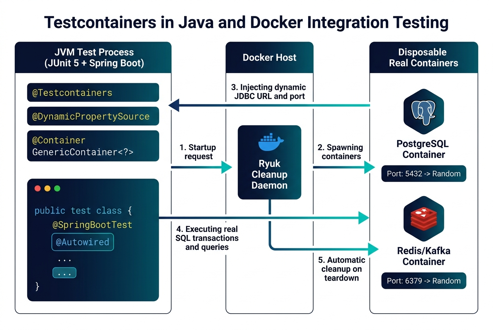

# Ch07 整合測試

整合測試（Integration Testing）聚焦於檢驗多個模組、服務或系統元件在協同作業與介面傳遞時的交互正確性。

---

## 📌 本章目錄與重點導讀 (Table of Contents & Highlights)

單元測試證明了零件的完好，而整合測試則確保零件能組裝成飛機。本章系統性建立從漸進式整合策略、Test Double 隔離原則，到 Spring Boot 與 Testcontainers 容器化整合測試的完整體系：

```
Ch07 知識架構全景：
【層級模型】7.1 整合測試與 V 模型（介面衝突 ＆ Spring Boot 三層架構）
【漸進策略】7.2 由下而上 (Bottom-Up & Drivers) ＆ 7.3 由上而下 (Top-Down & Stubs)
【策略矩陣】7.4 整合策略大比拼（大霹靂 Big Bang vs 三明治 Sandwich）
【隔離替身】7.5 Test Double 原則（Dummy, Stub, Spy, Mock, Fake ＆ 脆化防範）
【單元模擬】7.6 Mockito 實戰（when/thenReturn ＆ verify 行為驗證）
【框架整合】7.7 Spring Boot 整合測試（MockMvc, @SpringBootTest）
【容器前沿】7.8 Testcontainers 真實環境測試（終結 H2 記憶體資料庫假綠燈）
```

| 章節單元 | 核心學習重點 (Key Takeaways) |
| :--- | :--- |
| **[7.1 整合測試與 V 開發模型](#71-整合測試與-v-開發模型)** | 掌握整合測試在 V 模型中的定位；理解 Spring Boot 三層架構（Controller ➔ Service ➔ Repository）與介面契約斷裂風險。 |
| **[7.2 由下而上整合測試 (Bottom-Up)](#72-由下而上整合測試)** | 掌握從底層資料庫 DAO 開始整合的策略；理解測試驅動程式 (**Test Drivers**) 的設計與應用。 |
| **[7.3 由上而下整合測試 (Top-Down)](#73-由上而下整合測試)** | 掌握從頂層 Web Controller 開始逐步向下驗證的策略；理解測試存根 (**Test Stubs**) 的插拔與替換。 |
| **[7.4 整合測試策略比較](#74-整合測試策略比較)** | 深入對比 Big Bang（大霹靂）、Top-Down、Bottom-Up 與 Sandwich（三明治/混合式）的成本、缺陷定位度與適用場景。 |
| **[7.5 隔離架構與測試替身原則](#75-隔離架構與測試替身原則)** | 徹底釐清 Gerard Meszaros 定義的 **5 種 Test Double**（Dummy, Stub, Spy, Mock, Fake）；警惕「過度 Mock 導致脆化測試 (Brittle Tests)」的反模式。 |
| **[7.6 Lab: Mockito 測試驅動與模擬](#76-lab-mockito-測試驅動與模擬)** | 實戰掌握 Mockito 核心語法：`mock()`、`spy()`、`when(...).thenReturn(...)` 與 `verify()` 行為驗證。 |
| **[7.7 Lab: Spring Boot 整合測試](#77-lab-spring-boot-整合測試實務)** | 實戰 `@SpringBootTest`、`MockMvc`、REST API 端點調用與分層整合驗證。 |
| **[7.8 現代真實環境整合：Testcontainers](#78-現代真實環境整合測試testcontainers-modern-integration-testing-with-testcontainers)** | 揭露 H2 記憶體資料庫的「假綠燈幻覺」；掌握透過 **Testcontainers** 在 Docker 容器中即時拉起真實 PostgreSQL/MySQL 進行 100% 生產級整合測試。 |
| **[7.9 練習 (Exercises)](#79-練習-exercises)** | 整合演練：驅動與存根分析、Mockito 實作與多層架構整合除錯。 |

---

## 7.1 整合測試與 V 開發模型

#### fig-v-model


### 7.1.1 測試層級

上圖描述軟體開發與測試之間的關係。測試可以分為幾個層級：
 
- **單元測試** 檢視個別模組或是單一程式的測試
- **整合測試** 檢驗系統之間的組合是否有問題
- 系統測試檢驗系統整體的行為，不僅考慮軟體的功能與介面是否正確，也考慮與硬體、網路等環境的因素，整體上是否品質上的要求。

在整合測試階段，我們可能找到以下錯誤：

- 版本管理的問題
- 遺漏、重複或是衝突的功能
- 不正確或不一致的資料結構
- Client 送過來的資料違反 Server 的前置條件
- 錯誤的參數值
- Thread 之間的互相衝突

整合測試應採取漸進式的測試（incremental），通常分為由下而上（bottom-up）與由上而下測試（top-down）。

### 7.1.2 實務案例環境：以 Spring Boot 為例 (Practical Case Environment: Using Spring Boot as an Example)

在先前的單元測試中，我們主要使用純 Java 與 JUnit 5。然而，為了讓整合測試的抽象理論更具體，本章後續將以 Java 領域中最主流的 **Spring Boot** 框架作為實務案例，來探討各類整合測試策略（如由下而上、由上而下）的必要性與具體做法。

Spring Boot 框架具有以下特點，非常適合用來展示多模組整合測試的挑戰：

1.  **IoC (控制反轉) 與 DI (依賴注入)**：
    在 Spring 應用中，類別物件（稱為 **Beans**）是由 Spring 容器統一管理的。當類別 A 需要調用類別 B 時，Spring 會自動將 B 實體注入到 A 中。這改變了物件的生命週期與裝配方式，因此在測試時，我們需要驗證「Spring 容器能否正確地將這些 Beans 串接起來」。
2.  **標準三層架構 (Three-Tier Architecture)**：
    Spring 專案通常依據職責分為以下三層：
    *   **控制層 (Controller Layer / Web 層)**：負責接收外部 HTTP 請求，處理 JSON 格式參數。
    *   **服務層 (Service Layer / 業務邏輯層)**：負責核心運算與業務邏輯。
    *   **資料存取層 (Repository Layer / DAO)**：負責與資料庫進行資料存取。

    ```
    [客戶端 HTTP 請求] -> [Controller 控制層] -> [Service 服務層] -> [Repository 資料層] -> [Database]
    ```

3.  **整合測試的焦點**：
    在這樣的分層架構下，整合測試的焦點不再是單一算法的正確性，而是**模組與模組之間的介面協作**。我們會透過 Spring Boot 案例來驗證：
    *   **注入關係**：Spring 容器能否正確地將 Service 注入到 Controller 中？
    *   **Web 解析**：客戶端傳送的 JSON 請求能否被 Spring 正確解析與轉化為 DTO 物件？
    *   **分層協作**：Controller -> Service -> Repository 之間的調用鏈是否暢通？

## 7.2 由下而上整合測試

由下而上表示我們從比較小的元件模組測試起，針對這些小模組寫一些測試驅動程式（test driver），丟一些參數或訊息給這些模組，檢驗其回傳或反應是否正確。

#### fig-bottom-up


下方的 JUnit 測試碼就是一個 test driver，用來測試 isPrime() 這個程式是否正確。

```java
@Test
public testIsPrime() {
  assertTrue(isPrime(2));
  assertFalse(isPrime(1));
  assertFalse(isPrime(10));
}
```


以上圖為例，若我們採取由下往上的測試方式，其測試流程如下：

 
- 分別以 `b`, `c`, `a` 等 driver 測試 E, F, G, D 是否功能正常。`b` 模擬 B 測試 E-F 之間的間接的互動是否符合預期。
- 用 B 替換 `b`, 利用 driver `a` 測試 B-E-F 溝通是否正常。
- 用 C 替換 `c`, 利用 driver `a` 測試  B-C 溝通是否正常。
- 用 D 替換 `d`, 利用 driver `a` 測試  B-C-D 溝通是否正常。
- 用 A 替換 `a`, 利用 driver `x` 測試 A-B, A-C, A-D 溝通是否正常。。


> 由下而上的整合測試，關鍵點在於設計「測試驅動程式」（test driver）

### 7.2.1 Spring Boot 中的由下而上實踐

在 Spring Boot 專案中，**由下而上 (Bottom-Up) 整合測試**是業界最標準且最常被推薦的測試策略。我們通常從最底層的資料庫/持久化層開始測試，確保資料庫語法正確後，再向上測試業務邏輯層，最後整合測試 Web 控制器層。

```
[步驟 1: Repository 測試] -> [步驟 2: Service 測試 (結合 Repository)] -> [步驟 3: Controller 測試 (SpringBootTest 全載入)]
```

#### 1. 步驟 1：測試最底層的資料存取層 (Repository Layer)
資料存取層是系統的「葉子節點」（最底層）。我們在此時只想要驗證 Repository 能否正確與資料庫溝通（例如 SQL 語法、實體對應等）。
在 Spring Boot 中，我們使用 **`@DataJpaTest`**：
*   **做法**：`@DataJpaTest` 是一個只會載入 JPA 資料庫元件的切片測試（Slice Test）。它預設會配置一個記憶體資料庫（如 H2），並在每個測試執行完畢後自動回滾（Rollback）資料。
*   *此階段我們是在測試葉子模組本身，不需要為它設計任何依賴的 Mock 物件。*

#### 2. 步驟 2：整合業務服務層 (Service Layer)
當 Repository 通過測試後，我們接著測試 `UserService`（業務邏輯層）。
*   **做法**：在此階段我們進行的是真實的整合。我們**不 Mock** 資料庫，而是直接使用 `@SpringBootTest` 或手動裝配，將**真實的** `UserRepository` 注入到 `UserService` 中，讓它真的呼叫資料庫來處理邏輯。
*   *這符合由下而上的精神：我們將已測試好的底層模組（Repository）與高一層 of 模組（Service）組合在一起，驗證它們的協作。*

#### 3. 步驟 3：整合控制層 (Controller Layer)
最後，我們測試 `UserController`（Web 層）。
*   **做法**：我們使用 **`@SpringBootTest`** 啟動整個系統的 Application Context，並搭配真實的 `UserService` 與 `UserRepository`。當我們發送測試請求時，系統會從 Controller -> Service -> Repository 一路執行到資料庫，驗證整條垂直呼叫鏈。


## 7.3 由上而下整合測試

> **Stubs**: Dummy modules used for testing if higher level modules are working properly.

當我們採取由上往下測試的策略時，表示我們要先測試高階的模組，逐步的往下測試到低階的模組。所謂的高階模組是指會呼叫、引用其他模組的模組，例如 GUI 的介面。先對這些模組進行測試的目的是為了先和使用者確認介面是否正確如預期。

在開發或測試高階模組時，我們會先銜接一個假程式（stub），這樣可以讓問題單純化，著重在高階模組的測試，等到整合的時候再換成真的程式。所謂的假程式是一個著重介面，不重內在程式正確的程式，例如一個 int[] getPrimeNumber(int x) 本來的目的是要回傳所有小於 x  了質數，他的「假程式」會被設計成:

```java
int[] getPrimeNumber(int x) {
   int[] r = {2, 3, 5};
   return r;
}   
```

他的作用只是給上面的呼叫者「可以執行」而已。等到整合階段， 他會被真的程式替換，檢驗是否能正常運作。


以 [fig-top-down](#fig-top-down) 為例，若我們採取由上往下的測試方式，其測試流程如下：

 
- 開發 A 模組時採用 `b`, `c`, `d` 等 Stub
- 測試 A 模組是否正常
- 用 B, C, D 取代 `b`, `c`, `d`，測試 A, B, C, D 整合起來是否正常
- 用 E, F 取代 `e`, `f`，測試 A, B, C, D E, F 整合起來是否正常
- 用 G 取代 `g`, 測試 A, B, C, D E, F, G 整合起來是否正常

#### fig-top-down


#### ex-print-prime
> [!NOTE]
> 🏈 質數列印
> 有一個程式會列印出小於 n 的所有質數，這個程式分為三個模組：Displayer 主要負責資料的呈現，他會呼叫 allPrime 來取得所有的質數。AllPrime 會呼叫 isPrime 來判斷某個數是否為質數。假設這三個程式由三個人負責，他們如何設計 stub/driver？

Displayer 呼叫 allPrime(n), 我們可以先做一個 stub，固定回傳一個陣列，裡面放的是 小於 n 的質數。

```java
display() {
   int n = read();
   print(allPrime(n));
}

// stub
int[] allPrime(int n) { 
   int result[] = {2, 3, 5, 7};
   return result;
}   
```

上述 allPrime() 是一個 stub 假程式，用以測試 display()，等通過後，我們撰寫真的 allPrime() 程式。我們在寫 allPrime 時，僅注意其自身邏輯（例如 for 迴圈）是否正確，以及與 isPrime() 的溝通是否正常。此時它所呼叫的 isPrime(x) 可以是一個 stub：

```java
int[] allPrime(int n) {
   String s = "";
   for (int i=1; i<=n; i++) {
      if (isPrime(i)) s = s + i + " ";
   }
   return transformToArray(s);
}

// stub
boolean isPrime(int n) {
   if (n==2) return true;
   if (n==3) return true;
   return false;
}   
```

### 7.3.1 Spring Boot 中的由上而下實踐

在 Spring Boot 專案中，**由上而下 (Top-Down) 整合測試**通常以「Web 切片測試」的方式實現。我們希望能先獨立測試最頂層的控制層 (Controller Layer)，驗證其 URL 路由對應、JSON 序列化與 HTTP 狀態碼，而暫時隔離或 mock 還沒寫完的業務邏輯層。

```
[步驟 1: Controller 測試 (Mock Service 替身)] -> [步驟 2: 逐步實現並集成 Service] -> [步驟 3: 集成最底層 we 的 Repository]
```

#### 1. 步驟 1：隔離並測試最高階的控制層 (Controller Layer)
我們只想驗證 `PrimeController` 的路由對應與 JSON 解析，此時底層的 `PrimeService` 還沒寫好或不希望被執行。我們使用 **`@WebMvcTest(PrimeController.class)`** 只載入 Web 層，並使用 **`@MockBean`** 來建立 `PrimeService` 的 **Mock 替身 (Stub)**。
*   *這符合 Top-Down 精神：先測試高階模組（Controller），底層元件（Service）以假程式/樁（Stub）來暫時替代，並預設其回傳值。*

```java
@WebMvcTest(PrimeController.class)
public class PrimeControllerTest {
    @Autowired
    private MockMvc mockMvc;

    @MockBean
    private PrimeService primeService; // 使用 MockBean 作為底層 Service 的 Stub/Test Double

    @Test
    void testCountPrimes() throws Exception {
        // 設定 Stub 的回應值 (模擬底層尚未寫完或隔離的模組)
        when(primeService.countPrimesInRange(2, 10)).thenReturn(4);

        PrimeRequest request = new PrimeRequest(2, 10);

        // 模擬 HTTP 請求傳入，測試 Controller 是否能正確處理並格式化 JSON 輸出
        mockMvc.perform(post("/api/prime/count")
                .contentType(MediaType.APPLICATION_JSON)
                .content(new ObjectMapper().writeValueAsString(request)))
               .andExpect(status().isOk())
               .andExpect(content().string("4")); 
    }
}
```

#### 2. 步驟 2：逐步整合底層模組並替換 Stubs
當底層的 `PrimeService` 開發完成後，我們將 `@MockBean` 替換為真實的 Service 實體（例如改用 `@SpringBootTest` 進行測試），逐步將頂層 Web 與底層的邏輯串接在一起，直到完成整條控制流的整合。

## 7.4 整合測試策略比較

除了由上而下與由下而上以外，我們也可以混合使用，部分用 Top-Down，部分用 Bottom-Up，稱之為三明治整合法 (Sandwich Integration)。

一般來說：
*   **由上而下的整合測試**：開法高階時，因為需要為所有底層模組設計 Stub（假程式），設計較為困難；但能儘早讓使用者確認系統介面與高階需求，對需求的確認非常有幫助。
*   **由下而上的整合測試**：需要設計的是 Driver（驅動程式），在 JUnit 等框架下設計較為容易；但由於高階業務與使用者介面較晚被確認，一旦需求發生變更，可能造成後續需要大幅度的修改。

## 7.5 隔離架構與測試替身原則

> [!NOTE]
> 💡 **邏輯串接：從 Stubs/Drivers 到 Test Doubles**
> 在 7.2 與 7.3 節中，我們學習了由下而上與由上而下的整合測試策略，並理解到它們分別需要使用 **Driver (驅動程式)** 與 **Stub (樁程式)** 來替代未完成或需隔離的元件。
> 
> 隨著軟體測試理論的發展，這種「在測試中以替代品隔離真實依賴」的思維，被一般化（Generalized）為 **Test Double (測試替身)** 原則。
> *   **Stub 的現代演進**：在由上而下測試中用來代替底層模組的「Stub」，就是測試替身的一種。在實務中，我們透過如 **Mockito (7.6)** 的框架，在測試程式中動態宣告預設回應。
> *   **Driver 的現代演進**：在過去，我們需要撰寫額外的 Main 方法或驅動程式來作為 Driver；而在現代，**JUnit 5 測試案例本身就是 Driver**。我們在 JUnit 中執行測試（驅動），並利用測試替身來隔離外部依賴。
> 
> 因此，本節將深入探討「測試替身」的完整分類與隔離設計原則，而 7.6 則會介紹如何在 Java 中利用 Mockito 框架來實現這些替身。

在進行單元測試與整合測試時，受測物件（System Under Test, SUT）往往會依賴其他外部元件或系統（如資料庫、外部 API、系統時間、第三方服務）。為了讓測試能夠**快速、穩定且獨立執行**，我們必須在 SUT 與依賴元件之間建立**隔離架構**。此時，我們需要使用 **Test Double（測試替身）** 來代替真實的依賴元件。

### 7.5.1 什麼是 Test Double（測試替身）？

根據 Gerard Meszaros 在《xUnit Test Patterns》中的定義，測試替身可細分為五大種類：

1.  **Dummy Object (虛設物件)**：
    *   最簡單的替身。它僅被用來填充參數列表（例如建構子或方法的必填參數），在測試過程中**完全不會被調用**，通常直接傳入 `null` 或空物件。
2.  **Stub (樁物件 / 填補物件)**：
    *   專門為測試提供**硬編碼的固定回傳值**。例如，當 SUT 呼叫 `validator.isPrime(3)` 時，Stub 會固定回傳 `true`，而不進行任何真實計算。它是為了「提供受測物件所需的輸入資料」而存在。
3.  **Spy (間諜物件)**：
    *   除了具備 Stub 的功能外，Spy 還會**秘密記錄受測物件的調用行為**。例如，它會記錄：`isPrime` 被呼叫了幾次？傳入了什麼參數？以便在測試結束時進行行為驗證。
4.  **Mock Object (模擬物件)**：
    *   專注於**行為驗證 (Behavior Verification)**。Mock 物件預先期望了受測物件的呼叫順序、次數與參數。如果 SUT 沒有按照預期的方式與 Mock 物件互動，測試就會失敗。
5.  **Fake Object (偽物件)**：
    *   擁有**真實的業務邏輯實作，但通常採取了極度簡化的做法**，不適合在生產環境執行。最經典的例子是**記憶體資料庫 (In-Memory Database, 如 H2)** 或 **記憶體 Map 模擬資料庫**。它不是 Mock，它是會動且有狀態的。

### 7.5.2 何時用 Mock？何時不用 Mock？

濫用 Mock 是軟體開發中極為普遍的現象。為了寫出高價值的測試，應遵循以下原則：

*   **適合使用 Mock / Stub 的情境**：
    *   **外部或第三方依賴**：如簡訊發送 API、付費閘道 (Payment Gateway)。測試時不應真正扣款或發簡訊。
    *   **共享或緩慢的資源**：如真實的資料庫查詢、硬碟 I/O，這會拖慢測試速度並引入環境不確定性。
    *   **尚未開發完成的模組**：如協同開發中，其他同事負責但尚未寫好的介面服務。
    *   **不確定或隨機性行為**：如獲取目前系統時間 (`LocalDateTime.now()`)、隨機數產生器。

*   **不應使用 Mock 的情境（應使用真實物件）**：
    *   **純粹的領域邏輯與演算法**：SUT 呼叫的內部計算邏輯（如排序演算法、字串格式化工具）。
    *   **數值物件與實體 (Value Objects & Entities)**：如 `User`、`Order`、`Product` 等單純的資料載體。直接建立真實物件即可，Mock 這些物件會讓測試程式碼變得極度臃腫且毫無意義。
    *   **標準庫與框架**：不要 Mock `java.util.List`、`Map` 或 Spring Framework 的核心工具。

### 7.5.3 脆化測試 (Brittle Tests) 與過度 Mock 的反模式

在測試中過度使用 Mock，會導致測試套件退化為「阻礙重構的絆腳石」，並產生以下副作用：

1.  **什麼是脆化測試 (Brittle Tests)？**
    *   當你修改了生產程式碼的**內部實作細節（Refactoring）**，在**公開業務行為 (Behavior) 與輸出結果完全正確**的前提下，測試案例卻突然失敗了。這就是測試的「脆化」。
    *   脆化測試會給開發者帶來極高的維護負擔，讓人失去重構程式碼的信心。
2.  **過度 Mock (Over-Mocking) 的反模式 (Anti-patterns)**
    *   **「Mock 了所有東西 (Mock Everything)」**：如果一個測試方法中 mock 了七八個依賴，並寫了大量的 `when(...).thenReturn(...)`，這代表測試根本不是在驗證功能，而是在「用測試程式碼重新把 production code 的步驟抄寫一遍」。
    *   **緊密耦合內部細節**：過度使用 `verify(mock, times(1)).someInternalMethod()` 驗證內部私有或輔助方法是否被呼叫，一旦內部實作重構（例如將兩個私有方法合併），測試就會壞掉。
    *   **Oracle 迷失**：當 Mock 太多時，你只是在驗證「Mock 的回傳值 + Mock 的回傳值」，完全脫離了系統真實的狀態，導致測試全綠，但整合部署時系統直接當機。

> [!TIP]
> **最佳實踐：**
> 測試應**專注於行為 (Behavior-centric)，而非實作 (Implementation-centric)**。儘量對公開介面的輸入與輸出進行斷言（State Verification），只有在跨越系統邊界（如 API 呼叫、資料庫寫入）時，才使用 Mock 來進行行為驗證。

## 7.6 Lab: Mockito 測試驅動與模擬

在 7.5 節中，我們學習了測試替身 (Test Double) 的五種理論分類。在 Java 實務開發中，為了建立這些測試替身，我們不需要手動為每個介面撰寫假的測試類別，而是會使用 Java 最主流的 **Mockito** 模擬框架。

Mockito 可以協助我們動態產生各種測試替身：
1. **動態產生 Stub**：透過 `when(...).thenReturn(...)` 設定特定輸入下的預設回傳值。這在 **由上而下 (Top-Down) 整合測試** 中用來模擬尚未實作或隔離的低階模組特別方便。
2. **行為驗證 (Mock / Spy)**：透過 `verify(...)` 驗證受測物件是否確實向依賴項發出了呼叫、呼叫了幾次或傳入什麼參數。

以下我們將使用 Mockito 框架來實現這些替身。

以下我們延續前面的「質數計算」案例，來實際演練 Mockito 的基本語法與測試替身應用。

我們設計一個 `PrimeService`，它負責計算指定範圍內的質數個數。為了判斷某個數是否為質數，它會調用一個外部依賴 `PrimeValidator` 介面。

```plantuml
interface PrimeValidator {
    + isPrime(int): boolean
}

class PrimeService {
    - validator: PrimeValidator
    + countPrimesInRange(int, int): int
}

PrimeService ..> PrimeValidator
```

#### 1. 宣告介面與受測類別

在實務中，`PrimeValidator` 可能牽涉到複雜的網路呼叫或資料庫查詢，或者是還在由其他同事開發的組件，我們希望在測試 `PrimeService` 的邏輯時能將其隔離。

```java
// 外部依賴介面
public interface PrimeValidator {
    boolean isPrime(int n);
}
```

```java
// SUT 受測類別
public class PrimeService {
    private PrimeValidator validator;

    public PrimeService(PrimeValidator validator) {
        this.validator = validator;
    }

    public int countPrimesInRange(int start, int end) {
        int count = 0;
        for (int i = start; i <= end; i++) {
            if (validator.isPrime(i)) {
                count++;
            }
        }
        return count;
    }
}
```

#### 2. 使用 Mockito 進行測試 (Mockito Tester)

以下我們使用 Mockito 動態建立 `PrimeValidator` 的替身（Stub），以測試 `PrimeService.countPrimesInRange()` 的邏輯是否正確。

```java
import org.junit.jupiter.api.BeforeEach;
import org.junit.jupiter.api.Test;
import static org.junit.jupiter.api.Assertions.assertEquals;
import static org.mockito.Mockito.*;

public class PrimeServiceTest {
    private PrimeService primeService;
    private PrimeValidator validator;

    @BeforeEach
    public void setUp() {
        // 1. 建立依賴介面的 mock 物件 (Test Double / Stub)
        validator = mock(PrimeValidator.class);
        
        // 2. 建立受測類別實體，並將 mock 注入
        primeService = new PrimeService(validator);
    }

    @Test
    public void testCountPrimesInRange() {
        // 3. 設定 Stub（佈樁）的行為與預期回傳值 (2, 3, 5 為質數，4 不是)
        when(validator.isPrime(2)).thenReturn(true);
        when(validator.isPrime(3)).thenReturn(true);
        when(validator.isPrime(4)).thenReturn(false);
        when(validator.isPrime(5)).thenReturn(true);

        // 4. 呼叫受測物件的方法
        int count = primeService.countPrimesInRange(2, 5);

        // 5. 斷言結果 (2, 3, 5 是質數，共 3 個)
        assertEquals(3, count);
    }
}
```
POM.xml
```
<dependency>
    <groupId>org.mockito</groupId>
    <artifactId>mockito-core</artifactId>
    <version>5.7.0</version>
    <scope>test</scope>
</dependency>
```

### 7.6.1 Mock 與 Spy 的基本操作

除了 Mock 物件外，還有 Spy 物件。若沒有 when...thenReturn 來設定值，則 spy 會呼叫真正的物件來運算（如果是 mock 的話，沒有定義的就是回傳預設值，通常是 0，或是 null)。

```java
App a = mock(App.class);
when(a.add(1,1)).thenRetuen(2);

assertEquals(2, a.add(1,1));
assertEquals(4, a.add(2,2));
```

上述程式中，第四行的檢驗是對的，因為有第二行的 when thenReturn 宣告，第五行卻會產生錯誤，因為 a.add(2,2) 沒有定義，會回傳預設的 0。

如果我們改成 spy（如下，第一行）。a.add(2,2) 沒有在測試碼中定義，就會執行真實的程式碼，所以第五行不會產生錯誤。

```java
App a =  spy(App.class);
when(a.add(1,1)).thenRetuen(2);

assertEquals(2, a.add(1,1));
assertEquals(4, a.add(2,2));
```

### 7.6.2 Verify 驗證行為

有時候我們要檢驗某個方法是否有被呼叫，且參數正確，就可以使用 Verify 物件。

```java
// 建立 Mock 物件與 SUT
PrimeValidator validator = mock(PrimeValidator.class);
PrimeService service = new PrimeService(validator);

when(validator.isPrime(2)).thenReturn(true);
when(validator.isPrime(3)).thenReturn(true);
when(validator.isPrime(4)).thenReturn(false);
when(validator.isPrime(5)).thenReturn(true);

// 執行業務邏輯
service.countPrimesInRange(2, 5);

// 驗證行為：我們預期 service 在計算時，有呼叫過 validator 的 isPrime(2) 方法
verify(validator).isPrime(2);
```

也可以用來檢驗次數

```java
 mockedList.add("1");
 mockedList.add("2");
 mockedList.add("2");
 mockedList.add("3");
 mockedList.add("3");
 mockedList.add("3");

 //times(1) 是預設值
 verify(mockedList).add("1");
 verify(mockedList, times(1)).add("1");

 //恰好次數
 verify(mockedList, times(2)).add("2");
 verify(mockedList, times(3)).add("3");

 //never() 表示從來沒有用過，也可以用 times(0)
  verify(mockedList, never()).add("4");

 //至少或是最多的次數
 verify(mockedList, atLeastOnce()).add("3");
 verify(mockedList, atLeast(2)).add("3");
 verify(mockedList, atMost(5)).add("3");
```

Mokito 的好處為：


- 不需要手動撰寫 mock object，
- 安全重整：進行程式碼更名介面名稱或參數的順序不會破壞在執行期間建立的 mock 測試碼，
- 回傳值設定：可以設定 Mock 物件方法的回傳值，
- 支援例外，
- 順序的檢查：支援方法呼叫的順序檢查，
- 可以使用標記（annotation）來建立 mock。


### 7.6.3 Mockito 實作練習

#### ex-mokito-grade-displayer
> [!NOTE]
> 🏈 成績顯示
> [圖 fig-gradedislayer](#fig-grade-player) 是一個成績顯示的程式架構，subjectGrade[i][j] 表示 學生 i, 在科目 j 上的成績。grade[k] 表示學生 k 所有科目的平均。
>
> - 本專案採取平行開發，五個模組分別由 A, B, C, D, F 等人開發。一開始開發時，A（GradeDisplayer）的開發重點為何？該如何進行測試（mock? stubbed method? verify? assertion?）？
> - 同上，C（GradeCollector）的開發重點為何？該如何測試？
> - 同上，當 B, C 開發完成後，Ａ的測試該做何種改變？
>
> #### fig-grade-displayer
>
> 
>

## 7.7 Lab: Spring Boot 整合測試實務

### 7.7.1 質數計算 API 整合測試範例

我們用一個簡單的「質數計算服務 API」來展示 Spring Boot 整合測試如何驗證 **Web 控制層 (Controller)** 與 **服務邏輯層 (Service)** 之間的協作。

在這個案例中，我們將使用 `MockMvc` 來模擬 HTTP 請求，並確保資料的傳輸（JSON 序列化/反序列化）和服務的邏輯結果能正確地返回給客戶端。

#### 🔍 Spring Boot 整合測試範例：質數計算 API

我們將測試一個 `POST /api/prime/count` 接口，它接收一個指定區間的範圍，並返回該區間內的質數個數。

##### 1. 應用程式結構（模型、服務、控制器）

###### 1.1 請求 DTO (`PrimeRequest.java`)

```java
package com.example.demo.dto;

public class PrimeRequest {
    private int start;
    private int end;
    
    public PrimeRequest() {}

    public PrimeRequest(int start, int end) {
        this.start = start;
        this.end = end;
    }
    
    public int getStart() { return start; }
    public void setStart(int start) { this.start = start; }

    public int getEnd() { return end; }
    public void setEnd(int end) { this.end = end; }
}
```

###### 1.2 服務層 (`PrimeService.java`)

這是包含核心質數判斷與區間計數邏輯的地方。

```java
package com.example.demo.service;

import org.springframework.stereotype.Service;

@Service
public class PrimeService {
    
    public int countPrimesInRange(int start, int end) {
        int count = 0;
        for (int i = start; i <= end; i++) {
            if (isPrime(i)) {
                count++;
            }
        }
        return count;
    }

    public boolean isPrime(int n) {
        if (n <= 1) return false;
        for (int i = 2; i * i <= n; i++) {
            if (n % i == 0) return false;
        }
        return true;
    }
}
```

###### 1.3 控制器 (`PrimeController.java`)

```java
package com.example.demo.controller;

import com.example.demo.dto.PrimeRequest;
import com.example.demo.service.PrimeService;
import org.springframework.web.bind.annotation.*;

@RestController
@RequestMapping("/api/prime")
public class PrimeController {

    private final PrimeService primeService;

    public PrimeController(PrimeService primeService) {
        this.primeService = primeService;
    }

    @PostMapping("/count")
    public int countPrimes(@RequestBody PrimeRequest request) {
        return primeService.countPrimesInRange(request.getStart(), request.getEnd());
    }
}
```

##### 2. 整合測試程式碼

我們使用 `@SpringBootTest` 啟動所有真實組件，並使用 `MockMvc` 來驗證 HTTP 接口的運作。

###### `PrimeIntegrationTest.java`

```java
package com.example.demo.test;

import com.example.demo.dto.PrimeRequest;
import com.fasterxml.jackson.databind.ObjectMapper;
import org.junit.jupiter.api.Test;
import org.springframework.beans.factory.annotation.Autowired;
import org.springframework.boot.test.autoconfigure.web.servlet.AutoConfigureMockMvc;
import org.springframework.boot.test.context.SpringBootTest;
import org.springframework.http.MediaType;
import org.springframework.test.web.servlet.MockMvc;

import static org.springframework.test.web.servlet.request.MockMvcRequestBuilders.post;
import static org.springframework.test.web.servlet.result.MockMvcResultMatchers.content;
import static org.springframework.test.web.servlet.result.MockMvcResultMatchers.status;

// 關鍵註解：啟動完整的 Spring 上下文 (Controller, Service 等都會被真實載入)
@SpringBootTest
// 配置 MockMvc 來模擬 HTTP 請求
@AutoConfigureMockMvc
public class PrimeIntegrationTest {

    @Autowired
    private MockMvc mockMvc; // 模擬 HTTP 請求的工具

    @Autowired
    private ObjectMapper objectMapper; // 用於將 Java 對象轉換為 JSON 字串

    @Test
    void whenValidRange_thenReturnCorrectPrimeCount() throws Exception {
        // 1. 準備請求資料 (2 到 10 之間有 2, 3, 5, 7 共 4 個質數)
        PrimeRequest request = new PrimeRequest(2, 10);

        // 2. 執行階段 (模擬 POST 請求)
        mockMvc.perform(post("/api/prime/count")
                .contentType(MediaType.APPLICATION_JSON)
                .content(objectMapper.writeValueAsString(request))) // 將 Java 對象轉為 JSON 放入請求體

        // 3. 驗證階段 (驗證 HTTP 狀態碼和回傳內容)
                .andExpect(status().isOk()) // 驗證 HTTP 狀態碼是 200 OK
                .andExpect(content().contentTypeCompatibleWith(MediaType.APPLICATION_JSON))
                .andExpect(content().string("4")); // 驗證回傳內容是 "4"
    }

    @Test
    void whenInvalidRange_thenReturnZero() throws Exception {
        // 1. 準備請求資料 (起點大於終點)
        PrimeRequest request = new PrimeRequest(10, 2);

        // 2. 執行與驗證
        mockMvc.perform(post("/api/prime/count")
                .contentType(MediaType.APPLICATION_JSON)
                .content(objectMapper.writeValueAsString(request)))
                .andExpect(status().isOk())
                .andExpect(content().string("0")); // 預期回傳 0 個質數
    }
}
```

##### 7.7.2 整合測試理論的體現與對照

這個案例看似簡單，但它深刻體現了我們前面學到的整合測試策略與 Test Double 原則：

| 測試實務 (Spring Boot) | 對照的測試理論與策略 | 理論說明 |
| :--- | :--- | :--- |
| **`@SpringBootTest`**<br>(載入所有真實 Beans) | **由下而上 (Bottom-Up) / 大霹靂 (Big-Bang) 整合** | 本測試使用了**真實**的 `PrimeService` 與 `PrimeController`。我們是先確保底層的質數判斷演算法正確後，再將其與上層的 Web 控制器整合起來測試。這符合自底向上整合真實模組的思維。 |
| **`@WebMvcTest` + `@MockBean`**<br>(僅載入 Web 層並 Mock 服務層) | **由上而下 (Top-Down) 整合** | 如果我們只想單獨測試 `PrimeController` 的 URL 路由與 JSON 驗證，而不想調用真實的 `PrimeService`（例如底層演算法尚未開發），我們會使用 `@MockBean` 來 Mock 服務層。這正是由上而下測試：先測試高階 Web 模組，並用 **Stub/Mock (測試替身)** 來代替低階模組。 |
| **`MockMvc`** | **Fake Object (偽物件 / 模擬環境)** | 真實運行環境需要啟動 Web 伺服器並監聽 Port。`MockMvc` 則是 Servlet 容器 of **Fake**，它在記憶體中模擬了整個 Web 請求與回應的生命週期，不佔用實體網路埠，兼顧了執行速度與整合真實度。 |
## 7.8 現代真實環境整合測試：Testcontainers (Modern Integration Testing with Testcontainers)

在傳統的 Spring Boot 整合測試中，當測試需要與資料庫互動時，開發者常使用 H2 或 SQLite 等**記憶體資料庫 (In-Memory Database)**。然而，在現代雲原生與微服務架構中，這種做法已被視為一種危險的反模式。

### 7.8.1 記憶體資料庫的「假綠燈幻覺」

記憶體資料庫雖然啟動極快，但存在致命盲點：
1. **SQL 方言與特有型態不相容**：H2 無法完全支援真實 PostgreSQL / MySQL 的進階功能（如 PostgreSQL 的 `JSONB` 欄位、全文檢索、Window Functions、自訂預存程序）。
2. **交易隔離與並發鎖定機制差異**：H2 無法重現真實資料庫的並發鎖定、死結 (Deadlock) 與隔離等級（`READ COMMITTED`, `REPEATABLE READ`），導致「本機測試全綠，上線並發存取時資料庫死結崩潰」。

### 7.8.2 Testcontainers 運作原理與架構

為了消除環境差異帶來的幻覺，現代整合測試提倡**「環境一致性 (Environment Parity)」**——在測試中直接運行與生產環境版本完全相同的真實 Docker 容器！

[**Testcontainers**](https://testcontainers.com/)（[官方文件](https://java.testcontainers.org/) ｜ [快速指南 Guides](https://testcontainers.com/guides/)）是目前 Java 整合測試的黃金標準：



**圖形解說：Testcontainers 架構與容器生命週期流轉 (Architecture Flow)**
* **1. 測試進程發起啟動 (Startup Request)**：JUnit 5 測試類別標註 `@Testcontainers` 與 `@Container`，測試啟動時向 Docker Daemon 發送環境構建請求。
* **2. 守護容器管理 (Ryuk Cleanup Daemon)**：自動拉起專屬守護程序 Ryuk，監控測試生命週期並動態拉起真實的 PostgreSQL、Redis 等拋棄式容器。
* **3. 動態配置注入 (Inject Dynamic Connection Info)**：容器隨機映射 Host Port（防 Port 衝突），並透過 `@DynamicPropertySource` 將即時 JDBC URL、用戶名密碼動態注入 Spring Context。
* **4. 真實環境測試 (Execute Real SQL & Transactions)**：測試案例直接對真實 PostgreSQL / Redis 容器執行並發交易與 SQL 查詢，徹底消除 H2 記憶體資料庫的相容性假象。
* **5. 自動終結清理 (Automatic Cleanup on Teardown)**：測試結束時 Ryuk 自動回收銷毀所有容器，不留下任何殘留資料與資源佔用。

#### Testcontainers 的三大核心優勢：
* **拋棄式容器 (Disposable Containers)**：測試開始時由守護程序（Ryuk）自動拉起 Docker 容器，測試完畢自動銷毀，不殘留任何髒資料。
* **隨機動態 Port 映射**：容器自動綁定到宿主機隨機 Port，徹底避免 CI/CD 伺服器並發測試時的 Port 衝突。
* **100% 真實度**：測試通過即保證在生產環境能正常執行原生 SQL 與交易。

### 7.8.3 Spring Boot + Testcontainers 實戰範例

```java
package lab.sqa.integration;

import org.junit.jupiter.api.Test;
import org.springframework.beans.factory.annotation.Autowired;
import org.springframework.boot.test.context.SpringBootTest;
import org.springframework.test.context.DynamicPropertyRegistry;
import org.springframework.test.context.DynamicPropertySource;
import org.testcontainers.containers.PostgreSQLContainer;
import org.testcontainers.junit.jupiter.Container;
import org.testcontainers.junit.jupiter.Testcontainers;

import static org.junit.jupiter.api.Assertions.*;

@SpringBootTest
@Testcontainers // 自動管理 Docker 容器生命週期
public class UserRepositoryIntegrationTest {

    // 1. 定義真實 PostgreSQL 16 官方容器
    @Container
    static PostgreSQLContainer<?> postgres = new PostgreSQLContainer<>("postgres:16-alpine")
            .withDatabaseName("sqa_test_db")
            .withUsername("test_user")
            .withPassword("test_password");

    // 2. 將容器動態分配的 Port 與連線 URL 注入到 Spring Boot 資料來源
    @DynamicPropertySource
    static void configureProperties(DynamicPropertyRegistry registry) {
        registry.add("spring.datasource.url", postgres::getJdbcUrl);
        registry.add("spring.datasource.username", postgres::getUsername);
        registry.add("spring.datasource.password", postgres::getPassword);
    }

    @Autowired
    private UserRepository userRepository;

    @Test
    void testSaveAndQueryWithNativeJsonb() {
        User user = new User("Alice", "alice@example.com", "{\"role\": \"ADMIN\"}");
        userRepository.save(user);

        User found = userRepository.findByEmail("alice@example.com").orElse(null);
        assertNotNull(found);
        assertEquals("Alice", found.getName());
    }
}
```

> 🛠️ **對應實習手冊**：詳細的 Testcontainers + Spring Boot + PostgreSQL 實戰演練，請參考 [**Lab 10：Testcontainers 真實容器化整合測試**](../../LabDemo/docs/u08_integration/testcontainers_spring.md)。

---

## 7.9 練習 (Exercises)

- 以下何者正確？（選二）
	
	- 整合測試測試所有的模組，又稱為系統測試
	-  整合測試主要在測試各模組之間的介面是否吻合。如果我們一開始就律定好要介面的規格，就可以省略這個步驟
	- 由下而上的整合測試，需要設計 test driver
	- 一般而言，stub 的設計比 driver 較為困難
		 

- 比較由上而下與由下而上的整合測試的優點。

- 畫出 V model, 說明整合測試所在位置。

- 關於 Mockito 的使用，以下和者正確
	
	- 適合應用於由下往上的整合測試
	- 利用 when(...).thenReturn(...) 來設定假的資料
	- mock(A.class) 則 A 需為具體類別，不可為 abstract class 或 interface
	- mock 適用於由上往下的整合，spy 適用於由下往上的整合		
- 在 Mockito 中，mock 與 spy 有何差異？
- 針對一個線上考試系統，設計其系統架構。當開發人員各自開發模組時需要設計一些 stub 與 driver, 請說明可能的 stub 與 driver。
- 考慮一個遊戲聯盟系統，各遊戲與聯盟中心都可以獨自開發，請討論可能的整合問題。


> [!CAUTION]
> 😊 程式有問題時不要擔心。如果所有東西都沒問題，你就失業了。
>
> *Don't worry if it doesn't work right. If everything did, you'd be out of a job.（Mosher's Law of software engineering）*
