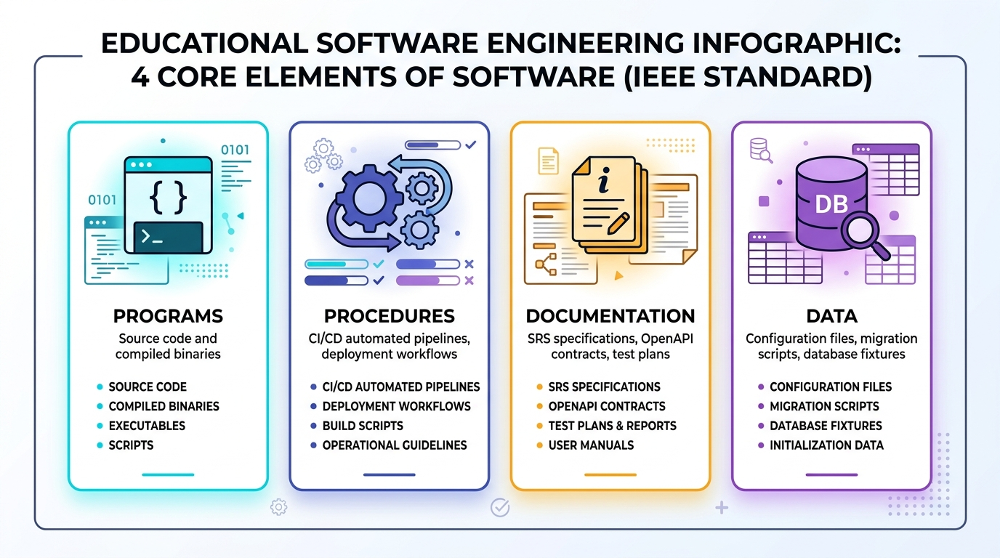
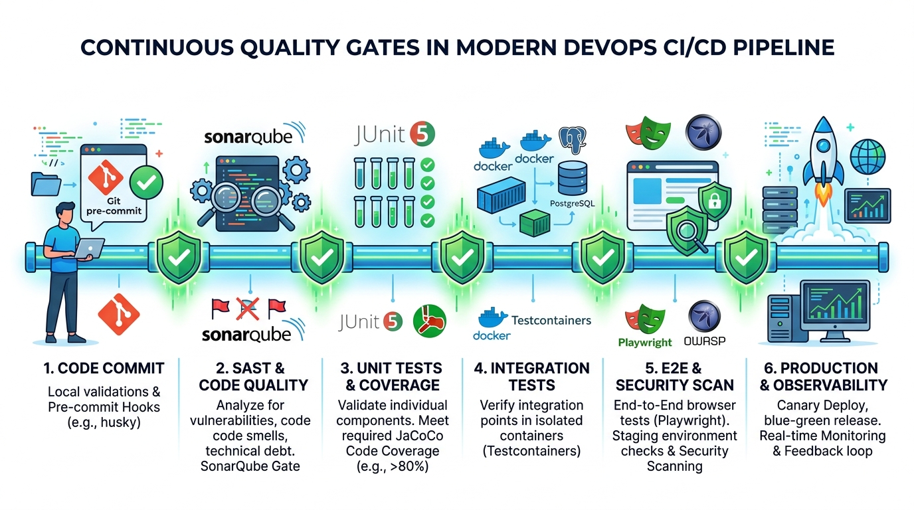
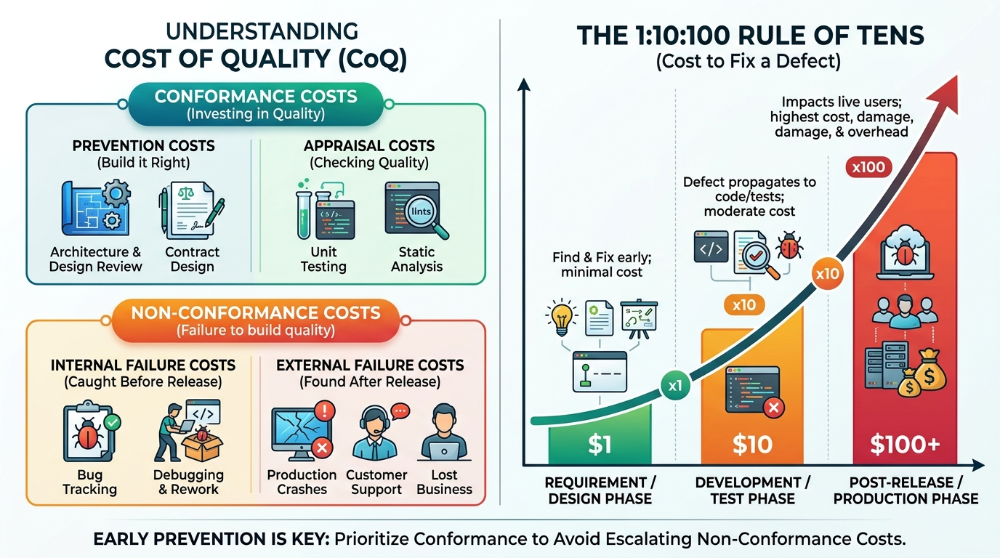

# Software Quality Assurance (SQA)

### Chapter 1: Introduction and Software Quality Concepts

Instructor: Prof. Nien-Lin Hsueh (with Gemini AI)

---

## Chapter Highlights

* **1.1 Software Crisis**:
  * Major historical cases (Patriot, NASA, CAL, Disney, Household Registration System) and reflections.
* **1.2 Software Quality and Definitions**:
  * IEEE four software components, Garvin's five quality views, and three levels of quality definitions.
* **1.3 Quality Models**:
  * ISO 9126 six quality characteristics and modern ISO 25010 practical testing tech map.
* **1.4 Quality Control & Quality Assurance (QC vs. QA & CoQ)**:
  * QC product inspection vs. QA process prevention, and Cost of Quality (CoQ) model.

---

<!-- _class: lead -->

# **1.1 Software Crisis**

> "We all know the law of conservation of matter; we are even more familiar with the law of conservation of Bugs."

---

## 1.1 What is the Software Crisis?

* **Background & Origin**:
  * In the late 1960s, hardware computing power grew exponentially, but software development techniques failed to keep pace.
  * Software scale and complexity grew exponentially, leading to projects frequently being **delayed, over budget, low quality, or completely failing**.
* **Core Challenges**:
  * Software is "invisible and intangible" (intangibility), making progress difficult to measure precisely.
  * System complexity exceeds what a single human brain can fully manage.
  * Lack of standardized engineering methods, process guidelines, and quality control systems.

---

## Case 1: Patriot Missile Incident (1991)

* **Incident Background**:
  * During the 1991 Gulf War, an Iraqi Scud missile hit the US Army barracks in Dhahran, Saudi Arabia, killing **28 soldiers and injuring over 100**.
* **Fatal Defect**:
  * The Patriot system's internal clock used a **24-bit floating-point register**, which introduced a tiny truncation/rounding error for every hour of operation.
  * After running continuously for over **100 hours** without rebooting, the accumulated time error reached **0.33 seconds**.
* **Disastrous Consequence**:
  * A Scud missile travels at Mach 4.2 (1.5 km/s). A delay of 0.33 seconds equates to **about 600 meters of distance offset**. The radar search window failed to lock onto the target, and no interceptor missile was fired.
* **SQA Lesson**: Precision and cumulative error issues; need for long-term continuous running reliability and stress testing (Long-term Reliability Testing).

---

## Case 2: NASA Mars Climate Orbiter (1998)

* **Incident Background**:
  * In 1998, NASA launched the "Mars Climate Orbiter" (costing nearly $200 million), which lost contact and burned up upon arrival in the Martian atmosphere.
* **Fatal Defect**:
  * Two collaborating engineering teams used **different measurement units**:
    * Lockheed Martin (contractor): **Imperial units** (pound-force seconds, $\text{lbf}\cdot\text{s}$)
    * NASA Jet Propulsion Laboratory (JPL): **Metric units** (Newton seconds, $\text{N}\cdot\text{s}$)
  * The propulsion control software directly used the imperial values in metric calculations without unit conversion.
* **Disastrous Consequence**:
  * The planned orbital altitude was 140–150 km, but the spacecraft descended to **57 km**, burning up in the thin atmosphere due to friction.
* **SQA Lesson**: Cross-team interface contracts (Interface Contract), unit compatibility validation, and specification reviews.

---

<!-- _class: full-image-slide -->

<div class="centered-image">
  
</div>

---

## Case 3: China Airlines Nagoya Crash (1994)

* **Incident Background**:
  * In 1994, China Airlines flight CI140 (Airbus A300-622R) crashed during landing at Nagoya Airport, killing **264 people**.
* **Fatal Defect**:
  * The co-pilot accidentally triggered the "**Go-Around**" mode during approach.
  * The pilot tried to manually push the nose down to land; however, the flight control computer, locked in Go-Around mode, aggressively trimmed the tail horizontal stabilizer up to raise the nose.
* **Disastrous Consequence**:
  * **Man and machine fought for control**, causing the aircraft to pitch up too steeply, stall, and crash. Airbus subsequently modified the A300 flight control logic globally.
* **SQA Lesson**: Human-Machine Interface (HMI/UX) status transparency, feedback on abnormal operations, and priority/override arbitration between manual control and automation.

---

<!-- _class: full-image-slide -->

<div class="centered-image">
  
</div>

---

## Case 4: Disney's "The Lion King" Compatibility Crisis (1994)

* **Incident Background**:
  * On Christmas 1994, Disney released "The Lion King" PC game, heavily promoted alongside Compaq PCs. Thousands of families eagerly anticipated playing it.
* **Fatal Defect**:
  * The game used Microsoft's newly released WinG graphics library but was only tested on a very narrow set of hardware. **Broad compatibility testing was not performed**.
  * On many home PCs, launching the game led to blue screens or immediate crashes.
* **Disastrous Consequence**:
  * Customer service lines were overwhelmed by angry parents on Christmas Day, dealing a major blow to the brand.
* **SQA Lesson**: Diverse **compatibility testing** across hardware/OS environments, which eventually prompted Microsoft to develop the standardized DirectX API.

---

## Case 5: Taiwan Public System Incidents

* **2014 Household Registration System Failure**:
  * On day one, the system suffered severe lag island-wide, preventing citizens from getting transcripts or IDs.
  * Core Issues: Hardware-software architecture compatibility, insufficient load testing, and unoptimized database queries.
* **2021 High School Learning Portfolio Loss**:
  * An outsourced engineer made an operational error during VM migration and reboot, deleting 25,000 students' data.
  * Core Issues: Configuration Management failures, lack of verified backup and disaster recovery processes.
* **2014 Freeway Electronic Toll Collection (ETC)**:
  * Frequent double-billing and phantom charges during early rollout highlighted extreme boundary and accuracy testing requirements in high-volume, real-time transaction systems.

---

## Reflections on the Software Crisis

* **"Software and cathedrals are much the same — first we build them, then we pray."** —— *Sam Redwine*
* Software quality is not just about "finding bugs after writing code"; it involves:
  * **Clarity and correctness of requirements and specifications**
  * **Robustness and health of architectural design**
  * **Cross-team communication, standards, and contract compliance**
  * **A comprehensive lifecycle testing and quality assurance framework**
* SQA aims to use engineering methods to transform crises into controlled quality.

---

## Concept Check Question (CCQ 1)

<div class="ccq-columns">
  <div class="ccq-text">

**What was the fundamental software cause of the Patriot Missile system (1991) intercept failure at Dhahran?**

* **A.** A communication network outage prevented the radar from sending commands to the launcher.
* **B.** A floating-point rounding error in the 24-bit clock register accumulated to 0.33 seconds after 100 hours of continuous operation.
* **C.** A memory leak in the code caused the operating system to crash.
* **D.** The radar algorithm misidentified a US fighter jet as an enemy Scud missile.

  </div>
  <div class="ccq-logo">
    
  </div>
</div>

---

<div class="ccq-columns">
  <div class="ccq-text">

* **Explanation**:
  * **Option B is correct**: The Patriot system recorded time using a 24-bit floating-point value, introducing a small truncation error every hour. Running for 100 hours accumulated a 0.33-second delay, which at Mach 4.2 caused a ~600m target offset.
  * **Option A is incorrect**: Communication between the radar and launcher was functional; the issue was target tracking calculation error.
  * **Option C is incorrect**: The system did not crash; the internal clock simply drifted from real time.
  * **Option D is incorrect**: It was not a target identification error, but a target trajectory calculation offset.

<div class="ccq-answer">Correct Answer: B</div>

  </div>
  <div class="ccq-logo">
    
  </div>
</div>

---

## Concept Check Question (CCQ 2)

<div class="ccq-columns">
  <div class="ccq-text">

**What is the most important lesson for software engineers from the NASA Mars Climate Orbiter (1998) crash?**

* **A.** Multi-threading must be used to prevent computational blocking.
* **B.** Interface specifications (such as measurement units) between modules across systems or teams must be strictly defined and validated.
* **C.** Space mission software must not use any third-party libraries.
* **D.** As long as engine thrust is sufficient, small software calculation errors will not affect orbit.

  </div>
  <div class="ccq-logo">
    
  </div>
</div>

---

<div class="ccq-columns">
  <div class="ccq-text">

* **Explanation**:
  * **Option B is correct**: Lockheed Martin output imperial units ($\text{lbf}\cdot\text{s}$) while JPL expected metric units ($\text{N}\cdot\text{s}$); this incompatible interface contract led to thrust miscalculation.
  * **Option A is incorrect**: The issue was unit mismatch, not thread scheduling.
  * **Option C is incorrect**: Modern software engineering relies heavily on well-defined modular components.
  * **Option D is incorrect**: Orbital mechanics calculations are extremely sensitive to parameters; descending to 57 km caused it to burn up in the atmosphere.

<div class="ccq-answer">Correct Answer: B</div>

  </div>
  <div class="ccq-logo">
    
  </div>
</div>

---

## Concept Check Question (CCQ 3)

<div class="ccq-columns">
  <div class="ccq-text">

**What was the critical design flaw in the flight control software and human-machine interaction in the 1994 China Airlines Nagoya crash?**

* **A.** A computer virus on board caused the control panels to go black.
* **B.** A lack of control override arbitration and clear status indications when manual control conflicted with the computer's Go-Around mode.
* **C.** A divide-by-zero exception occurred in the engine fuel calculation formula.
* **D.** The autopilot system failed to implement altitude sensing.

  </div>
  <div class="ccq-logo">
    
  </div>
</div>

---

<div class="ccq-columns">
  <div class="ccq-text">

* **Explanation**:
  * **Option B is correct**: The pilot manually pushed down while the computer was executing a Go-Around climb. The computer trimmed the tail up to "correct" the pilot, leading to a stall. This highlights defects in status visibility and override logic.
  * **Option A is incorrect**: No computer virus was involved.
  * **Option C is incorrect**: Not a numerical divide-by-zero exception.
  * **Option D is incorrect**: Altitude sensing was functional; the core issue was status visibility and control priority arbitration.

<div class="ccq-answer">Correct Answer: B</div>

  </div>
  <div class="ccq-logo">
    
  </div>
</div>

---

<!-- _class: lead -->

# **1.2 Software Quality and Definitions**

> "People forget how fast you did a job, but they remember how well it was done." —— *Howard Newton*

---

## 1.2.1 What is Software?

* The broad IEEE definition of **Software**:
  > Computer **programs**, **procedures**, and possibly associated **documentation** and **data** pertaining to the operation of a computer system.
* Software is not just executable code; it comprises:
  * **Programs**: Instructions and algorithms.
  * **Procedures**: Operational manuals, deployment, and maintenance rules.
  * **Documentation**: Requirements specs, architecture design, test cases.
  * **Data**: Initialization parameters, configuration files, test datasets.

---

<!-- _class: full-image-slide -->

<div class="centered-image">
  
</div>

---

## Concept Check Question (CCQ 4)

<div class="ccq-columns">
  <div class="ccq-text">

**According to the IEEE definition and course material, which of the following does NOT fall under "software"?**

* **A.** System design documents and test cases created during development.
* **B.** System initialization data required to execute programs.
* **C.** Operating procedures and workflows followed when installing and running the system.
* **D.** Only the compiled binary machine code executing on the server, excluding other items.

  </div>
  <div class="ccq-logo">
    
  </div>
</div>

---

<div class="ccq-columns">
  <div class="ccq-text">

* **Explanation**:
  * **Option D is correct**: The IEEE definition explicitly states that software includes not only code, but also procedures, documentation, and data.
  * **Option A/B/C are incorrect**: They are all part of the software constituents defined by the IEEE.

<div class="ccq-answer">Correct Answer: D</div>

  </div>
  <div class="ccq-logo">
    
  </div>
</div>

---

## 1.2.2 David Garvin's Five Quality Views

| Quality View | Core Meaning | Software Example |
| :--- | :--- | :--- |
| **Transcendental** | Cannot be measured directly, but exquisite quality is felt upon experience | Smooth, elegant UI/UX and attention to details |
| **User view** | Fitness for use; meeting user needs and expectations | Usability, feature solving pain points |
| **Manufacturing** | Conformance to engineering specs and standard processes | Adhering to standards, Zero Bug target |
| **Product view** | Inherent technical characteristics and internal design quality | High cohesion, low coupling, clean code |
| **Value-based** | Affordability and price-performance ratio (ROI) | Business value brought, willingness to subscribe |

---

<!-- _class: full-image-slide -->

<div class="centered-image">
  
</div>

---

## Concept Check Question (CCQ 5)

<div class="ccq-columns">
  <div class="ccq-text">

**A system perfectly meets every functional requirement in the contract, but its architecture is messy and extremely difficult to maintain or extend. Under Garvin's views, which view would deem this software of poor quality?**

* **A.** Manufacturing View
* **B.** Product View and professional implicit quality
* **C.** Legal Contract View
* **D.** Outsourcing Billing View

  </div>
  <div class="ccq-logo">
    
  </div>
</div>

---

<div class="ccq-columns">
  <div class="ccq-text">

* **Explanation**:
  * **Option B is correct**: The product view focuses on the internal structure of the software (such as modularity, clean architecture, and maintainability). Although it meets manufacturing specifications, the internal architecture quality is poor.
  * **Option A is incorrect**: Meeting specification processes satisfies the manufacturing view.
  * **Option C/D are incorrect**: These are not part of Garvin's five standard quality classifications.

<div class="ccq-answer">Correct Answer: B</div>

  </div>
  <div class="ccq-logo">
    
  </div>
</div>

---

## 1.2.3 Three Levels of Software Quality Definition

1. **Conformance to Specifications** (*Crosby, 1979*):
   * Meeting the written requirements specification. *(Flaw: Specs are often incomplete)*
2. **Fitness for Use** (*Juran, 1998*):
   * Satisfying users' and stakeholders' expectations and actual needs.
3. **Conformance to Professional Standards & Implicit Characteristics** (*Pressman*):
   * Beyond explicit features, this includes implicit professional attributes like **maintainability, security, and robustness**.

---

## Concept Check Question (CCQ 6)

<div class="ccq-columns">
  <div class="ccq-text">

**Which statement regarding the definition of software quality best aligns with Pressman's view on professionally developed software?**

* **A.** As long as the program runs without bugs, it is high-quality software.
* **B.** Software quality depends solely on whether it fully satisfies the functional requirements defined in the spec.
* **C.** Software quality includes not only explicit functional and performance requirements and explicit development standards, but also implicit characteristics expected of professional software (such as maintainability, readability).
* **D.** Software quality depends entirely on subjective user satisfaction, regardless of development processes or documentation.

  </div>
  <div class="ccq-logo">
    
  </div>
</div>

---

<div class="ccq-columns">
  <div class="ccq-text">

* **Explanation**:
  * **Option C is correct**: Pressman's definition emphasizes explicit requirements, development standards, and implicit professional characteristics (e.g. maintainability, reliability).
  * **Option A/B/D are incorrect**: These are too narrow and overlook the implicit quality or process standards of professional software.

<div class="ccq-answer">Correct Answer: C</div>

  </div>
  <div class="ccq-logo">
    
  </div>
</div>

---

<!-- _class: lead -->

# **1.3 Quality Models (ISO 9126 / ISO 25010)**

> "Quality models serve as the compass of software engineering, defining what good software is."

---

<!-- _class: full-image-slide -->

<div class="centered-image">
  
</div>

---

## 1.3.1 ISO 9126 Six Quality Characteristics

* **Functionality**: Suitability, accuracy, interoperability, compliance, security.
* **Reliability**: Maturity (MTBF/MTTF), fault tolerance, recoverability.
* **Usability**: Understandability, learnability, operability, attractiveness.
* **Efficiency**: Time behavior (response time), resource utilization (CPU/RAM/I-O).
* **Maintainability**: Analyzability, changeability, stability, testability.
* **Portability**: Adaptability, installability, co-existence, replaceability.

---

## 1.3.2 Modern ISO 25010 and Practical Testing Tech Map

| ISO 25010 Quality Characteristic | Core Guardian Technology (Course Focus) |
| :--- | :--- |
| **Functional Suitability** | Equivalence Partitioning (EP), Boundary Value Analysis (BVA), JUnit 5, BDD (Cucumber) |
| **Reliability** | Assertions, **Property-Based Testing (jqwik)**, Chaos Engineering |
| **Maintainability** | Static Analysis (SonarQube/SpotBugs), **Mutation Testing (PITest)** |
| **Security** | Static Application Security Testing (SAST), **Fuzz Testing (Fuzzing)** |
| **Performance Efficiency** | **High-Concurrency Load Testing with k6 / Apache JMeter**, Memory Profiling |
| **Compatibility** | **Microservice Contract Testing (Pact)**, Cross-version Compatibility Testing |
| **Portability** | **Containerized Testing with Testcontainers**, Docker Environment Validation |
| **Usability** | **Playwright E2E Acceptance Testing**, UI Automation Workflows |

---

<!-- _class: full-image-slide -->

<div class="centered-image">
  
</div>

---

## Concept Check Question (CCQ 7)

<div class="ccq-columns">
  <div class="ccq-text">

**A server automatically reconnects after a network disconnect without losing in-progress transaction data. Under ISO 9126, which quality characteristic does this represent?**

* **A.** Fault tolerance and recoverability under Reliability.
* **B.** Installability under Portability.
* **C.** Attractiveness under Usability.
* **D.** Compliance under Functionality.

  </div>
  <div class="ccq-logo">
    
  </div>
</div>

---

<div class="ccq-columns">
  <div class="ccq-text">

* **Explanation**:
  * **Option A is correct**: A network disconnect is an environmental exception. The system's ability to maintain operation and quickly recover data falls under Reliability sub-characteristics: Fault Tolerance and Recoverability.
  * **Option B is incorrect**: Portability refers to the ease of moving software across platforms.
  * **Option C is incorrect**: Usability focuses on user interaction experience.
  * **Option D is incorrect**: Compliance refers to adhering to regulations or standards.

<div class="ccq-answer">Correct Answer: A</div>

  </div>
  <div class="ccq-logo">
    
  </div>
</div>

---

## Concept Check Question (CCQ 8)

<div class="ccq-columns">
  <div class="ccq-text">

**Modifying the field length in a personnel module of a software system accidentally causes a completely unrelated financial settlement module to fail. Which characteristic in the ISO 9126 model does this indicate the system is performing poorly in?**

* **A.** Analyzability
* **B.** Stability
* **C.** Fault tolerance
* **D.** Interoperability

  </div>
  <div class="ccq-logo">
    
  </div>
</div>

---

<div class="ccq-columns">
  <div class="ccq-text">

* **Explanation**:
  * **Option B is correct**: Stability evaluates the sensitivity of the system to negative impacts (side effects) when changes are made. Changes in the personnel module breaking the unrelated financial module show high coupling and poor Stability.
  * **Option A/C/D are incorrect**: These are unrelated to evaluating side effects of changes on other modules.

<div class="ccq-answer">Correct Answer: B</div>

  </div>
  <div class="ccq-logo">
    
  </div>
</div>

---

## Concept Check Question (CCQ 9)

<div class="ccq-columns">
  <div class="ccq-text">

**In the ISO 9126 quality model, when we evaluate "the ease of transferring a software system from one hardware, software, or execution environment to another", which quality characteristic are we evaluating?**

* **A.** Functionality
* **B.** Maintainability
* **C.** Portability
* **D.** Efficiency

  </div>
  <div class="ccq-logo">
    
  </div>
</div>

---

<div class="ccq-columns">
  <div class="ccq-text">

* **Explanation**:
  * **Option C is correct**: Portability defines the ease of transferring software from one environment to another.
  * **Option A/B/D are incorrect**: These are not focused on environment transfer difficulty.

<div class="ccq-answer">Correct Answer: C</div>

  </div>
  <div class="ccq-logo">
    
  </div>
</div>

---

<!-- _class: lead -->

# **1.4 Quality Control (QC) and Quality Assurance (QA)**

---

## 1.4.1 Essential Differences: QC vs. QA

* **Quality Control (QC)**:
  * **Product-oriented**
  * Post-inspection, finding bugs (Defect Detection).
  * Major activities: Unit testing, system testing, product output reviews.
* **Quality Assurance (QA)**:
  * **Process-oriented**
  * Prevention, process improvement (Defect Prevention).
  * Major activities: Defining development standards, code review guidelines, CI/CD pipelines, quality audits.

---

## 1.4.2 The V-Model: Development & Testing Symmetry

* **Verification (Left side)** vs. **Validation (Right side)**.
* Establishes a parallel mapping between early development phases and corresponding testing levels:
  * **Requirements Analysis** ➔ **Acceptance Testing**
  * **System Architecture** ➔ **System Testing**
  * **Component Design** ➔ **Integration Testing**
  * **Coding** ➔ **Unit Testing**
* **Core Value**: Design test cases early before writing the actual code to prevent defects from leaking.

---

<!-- _class: full-image-slide -->

<div class="centered-image">
  
</div>

---

## 1.4.3 Modern Agile & DevOps Continuous Quality Gates

* **Continuous Quality Gates**: Automate quality checks at each step in the CI/CD pipeline.
* **The Six Key Quality Gates**:
  1. **Code Commit Gate**: Pre-commit hooks check formatting and syntax.
  2. **SAST Code Quality Gate**: SonarQube scans for code smells and OWASP bugs.
  3. **Unit Tests & Coverage Gate**: JUnit 5 tests and JaCoCo coverage (e.g. >80%).
  4. **Integration Tests Gate**: Testcontainers spin up real databases/caches.
  5. **E2E & Security Gate**: Playwright UI workflows and dynamic security scanning.
  6. **Production Gate**: Canary deployments and observability monitoring.

---

<!-- _class: full-image-slide -->

<div class="centered-image">
  
</div>

---

## 1.4.4 Cost of Quality (CoQ)

```
                        ┌── Prevention Cost: Training, process standards, design reviews
        ┌─ Conformance ─┤
        │  Cost         └── Appraisal Cost: Unit testing, code reviews, automated tests
CoQ ────┤
        │  Non-         ┌── Internal Failure: Fixing bugs before release, refactoring
        └─ conformance ─┤
           Cost         └── External Failure: Post-release crashes, customer complaints, liabilities
```

* **1:10:100 Rule**:
  * Fixing a bug during requirements phase costs **$1**.
  * Fixing it during development/testing costs **$10**.
  * Fixing it after product release costs **$100+** and damages brand reputation!

---

<!-- _class: full-image-slide -->

<div class="centered-image">
  
</div>

---

## Concept Check Question (CCQ 10)

<div class="ccq-columns">
  <div class="ccq-text">

**Introducing automated static code analysis (e.g. SonarQube) and engineer quality training courses fall under which categories in the Cost of Quality (CoQ) model respectively?**

* **A.** Internal Failure Cost, External Failure Cost
* **B.** Appraisal Cost, Prevention Cost
* **C.** External Failure Cost, Appraisal Cost
* **D.** Liability Cost, Maintenance Cost

  </div>
  <div class="ccq-logo">
    
  </div>
</div>

---

<div class="ccq-columns">
  <div class="ccq-text">

* **Explanation**:
  * **Option B is correct**: Static analysis and testing check/appraise existing quality (Appraisal Cost); staff training and standard setting prevent defects beforehand (Prevention Cost). Both are part of Conformance Costs.
  * **Option A/C/D are incorrect**: Failure costs refer to the cost incurred due to bugs already generated.

<div class="ccq-answer">Correct Answer: B</div>

  </div>
  <div class="ccq-logo">
    
  </div>
</div>

---

<!-- _class: lead -->

# **Chapter Highlights Review**

---

## Summary and Highlights

* **Software Crisis**: Historical cases (Patriot, NASA, CAL, Disney) show that software defects can be fatal and extremely costly.
* **Software Quality**: Software comprises programs, procedures, documentation, and data; Garvin's five quality views offer diverse perspectives.
* **ISO 9126**: Six core quality characteristics (Functionality, Reliability, Usability, Efficiency, Maintainability, Portability).
* **QA vs. QC**: QA focuses on process and prevention, QC focuses on product and inspection; earlier prevention means lower costs (1:10:100 rule).

---

<!-- _class: lead -->

# **Q & A**

### Thank you!
