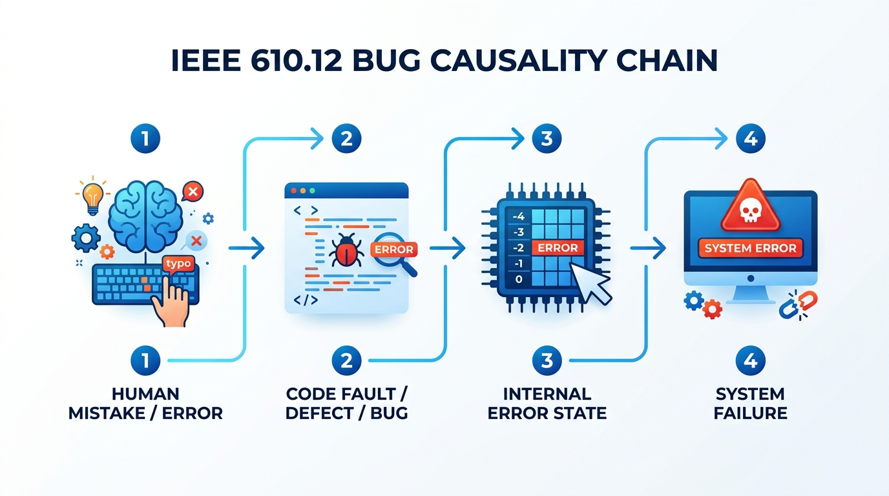
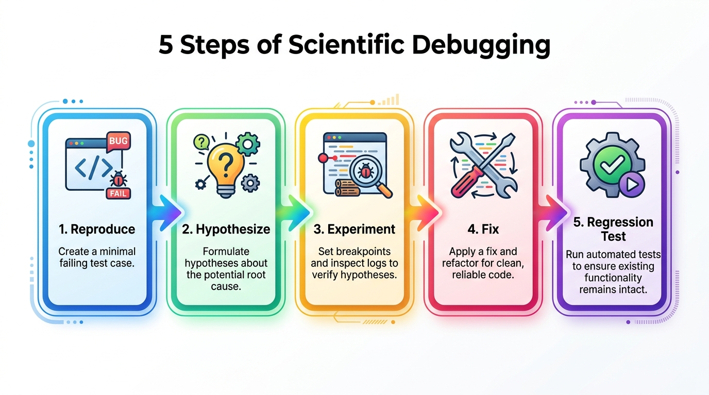
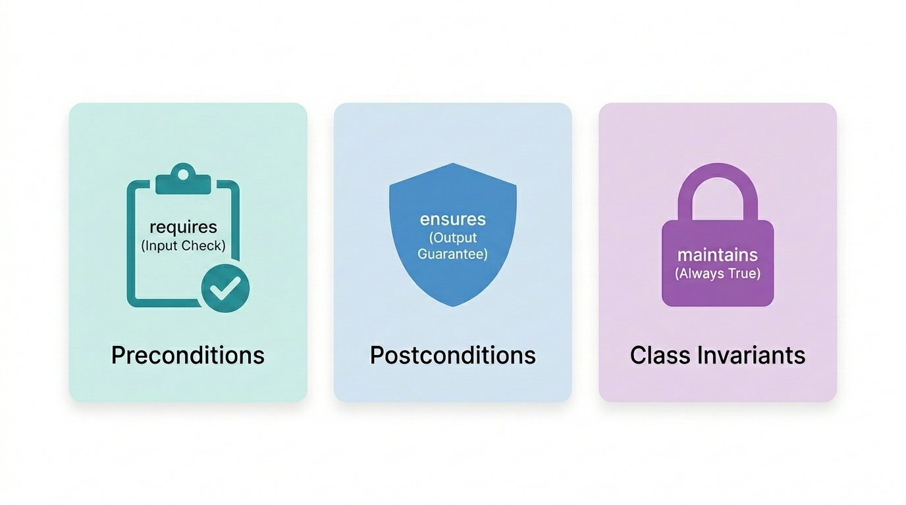
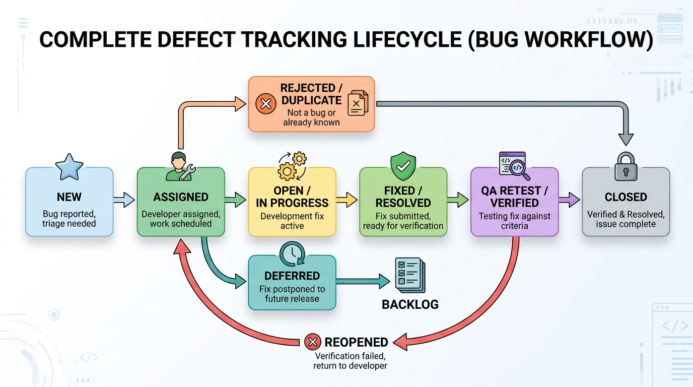
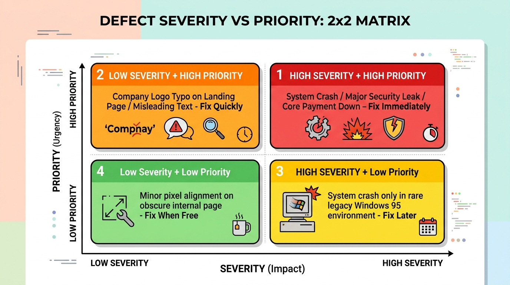

# 軟體品質保證 (SQA)

### 第二章：臭蟲、錯誤與除錯

授課教師：薛念林教授 (with Gemini AI)

---

## 本章重點 (Chapter Highlights)

* **2.1 臭蟲與錯誤 (Bugs & Faults)**：
  * IEEE 610.12 四階段因果鏈、規格缺陷與常見編碼錯誤分類。
* **2.2 除錯思維與方法 (Debugging Mindset)**：
  * 科學除錯五步驟、避免霰彈槍除錯、人機協同除錯黃金 SOP。
* **2.3 除錯工具與防禦性編程 (Tools & DbC)**：
  * IDE 斷點實務、契約式設計 (DbC) 三大法則、斷言 vs. 例外。
* **2.4 缺陷管理與追蹤 (Defect Management)**：
  * 完整 Bug 生命週期狀態機、嚴重度 vs. 優先級 2x2 決策矩陣。

---

<!-- _class: lead -->

# **2.1 臭蟲與錯誤 (Bugs & Faults)**

> 「比起去年，我們今年多修正了 50% 的 Bug。」
> 「你們犯了品質管制不良之罪，明年起不得再有任何 Bug！」
> —— 溫伯格《軟體管理學》

---

## 2.1.1 臭蟲的由來與 IEEE 610.12 定義

* **歷史淵源**：
  * 1947 年 9 月 9 日，Grace Hopper 在 Harvard Mark II 電腦繼電器中找到第一隻實體飛蛾 (Bug)。
* **IEEE 610.12 嚴謹四階段因果鏈**：
  * **1. Human Mistake (人類犯錯)**：開發人員的心智失誤或誤解需求。
  * **2. Code Fault / Defect (缺陷/臭蟲)**：錯誤實體化在程式碼或設計文件中。
  * **3. Internal Error State (內部錯誤狀態)**：執行時記憶體或系統狀態出現不一致。
  * **4. System Failure (系統對外失效)**：對外行為偏離規格（崩潰、算錯錢、當機）。

---

<!-- _class: full-image-slide -->

  

---

## 2.1.2 規格導致的缺陷 (Spec Bugs)

* **「我前方沒有規格，錯誤在我身後形成」**：
  * 很多時候不是寫錯程式，而是規格本身**模糊、遺漏或缺乏邊界定義**。
* **規格三層次比較**：
  * **規格一（粗糙）**：輸入被除數與除數，顯示小數點後兩位。
  * **規格二（禁則未定義行為）**：使用者不得輸入除數為 0（未說明輸入 0 時如何處理）。
  * **規格三（健全契約）**：除數若為 0，清除欄位並回傳 HTTP 400 與友善錯誤提示。
* **防禦性思維**：
  * 專業工程師必須具備「**為規格補全邊界例外**」的防禦性素養。

---

<!-- _class: full-image-slide -->

  

---

## 2.1.3 常見編碼錯誤分類

* **1. 算術與精度錯誤**：
  * 除以零 (Divide by Zero)、整數溢位 (Integer Overflow)、浮點數捨入累計誤差。
* **2. 邏輯與迴圈錯誤**：
  * 無窮迴圈、**差一錯誤 (Off-by-one error, OBOB)**（如 `i <= array.length`）。
* **3. 資源與指標錯誤 (Resource Leaks)**：
  * `NullPointerException` (空指標)、記憶體洩漏、資料庫連線未關閉。
* **4. 並發與多執行緒錯誤 (Concurrency Bugs)**：
  * **死結 (Deadlock)**、**競爭條件 (Race Condition)**、資料不一致。

---

## Concept Check Question (CCQ 1)

  

**程式碼中存在缺陷 (Fault)，系統在執行時一定會立刻表現出對外的系統失效 (Failure)。**

* **A.** 正確
* **B.** 錯誤

  

  

    
  

---

  

* **解析**：
  * **錯誤**：程式碼中含有 Fault，如果該分支未被執行，或錯誤狀態剛好被後續運算掩蓋，則不會表現為可觀察到的 Failure。
  * 只有在含有 Fault 的程式碼被觸發且導致對外行為偏離預期時，才會轉化為 Failure。

正確答案：B

  

  

    
  

---

## Concept Check Question (CCQ 2)

  

**某專案經理向客戶表示：「使用者輸入負數年齡導致伺服器當機，這是使用者操作不當，不是 Bug，因為規格書沒寫年齡可以是負數。」從 SQA 與軟體工程觀點，下列何者正確？**

* **A.** 專案經理完全正確，規格書未載明的輸入，開發團隊不負任何責任
* **B.** 這是典型的「規格遺漏」與缺乏防禦性設計，專業軟體應主動對非法輸入進行驗證並優雅回傳錯誤，而非崩潰
* **C.** 只要資料庫欄位設為 Integer，任何數字輸入都不算 Bug
* **D.** 只要使用者願意加錢，未載明的規格才需要處理

  

  

    
  

---

  

* **解析**：
  * **選項 B 正確**：專業軟體工程強調強固性 (Robustness) 與防禦性設計。規格書即使未列出所有非法數值，系統也絕不能因未檢查的輸入而直接拋出未捕獲例外或 Crash。
  * **選項 A/C/D 錯誤**：皆屬推卸責任的不良品質思維。

正確答案：B

  

  

    
  

---

<!-- _class: lead -->

# **2.2 除錯思維與方法 (Debugging)**

> 「在自己的程式裡找出一個錯誤是十分困難的；
> 而當你認為自己的程式絕對沒有錯誤時，那就更是難上加難。」
> —— *Steve McConnell*

---

## 2.2.1 科學除錯五步驟

* **除錯是嚴謹的科學偵探過程，切忌瞎猜亂試 (Shotgun Debugging)**：
  1. **1. Reproduce (穩定重現)**：建立 100% 穩定重現 Bug 的最小失敗測試案例。
  2. **2. Hypothesize (假設形成)**：根據現象、日誌與 Call Stack 提出可能根因假設。
  3. **3. Experiment (實驗驗證)**：設定斷點或追蹤日誌驗證或推翻假設。
  4. **4. Fix (根因修復)**：修復核心架構或邏輯，而非只在表面加 try-catch 吞掉例外。
  5. **5. Regression Test (回歸驗證)**：執行自動化測試套件，確保失敗測試轉綠且既有功能無回歸。

---

<!-- _class: full-image-slide -->

  

---

## 2.2.2 🤖 AI 時代的輔助除錯策略

* **⚠️ AI 除錯常見陷阱**：
  * **膠帶式修復 (Band-aid Fix)**：AI 往往只給 `if (obj != null)` 表面修復，掩蓋了上游初始化失敗的根因。
  * **自我印證偏誤**：AI 的修復可能破壞其他地方的不變量 (Invariants)，引入回歸缺陷。
* **🛡️ 人機協同除錯黃金 SOP**：
  * **1. 提供完整上下文**：附上 Stack Trace、相關程式碼、輸入與預期規則。
  * **2. 要求分析根因**：請 AI 分析 3 個根本原因，並檢視是否破壞前置條件。
  * **3. 先寫測試再修復 (Test-First Bug Fix)**：先讓 AI 寫重現 Bug 的失敗測試，修復後跑完整 CI 綠燈。

---

## Concept Check Question (CCQ 3)

  

**當生產環境拋出 `ConcurrentModificationException` 時，工程師將程式碼貼給 AI，AI 建議直接包裹空的 `try-catch` 區塊將例外吞掉。關於這種做法的評價何者最精準？**

* **A.** 這是絕佳的快速修復方案，因為系統不會再拋出例外
* **B.** 這是危險的「治標不治本 (Swallowing Exception)」，底層並發衝突與資料不一致依然存在，日後會引發更嚴重的資料損壞
* **C.** 只要 AI 給出的程式碼能通過編譯，就代表已通過軟體品質驗證
* **D.** 現代框架不需要理會並發例外

  

  

    
  

---

  

* **解析**：
  * **選項 B 正確**：吞掉例外（Swallowing Exceptions）是嚴重的反模式。它只是掩蓋了錯誤徵兆，實質上的並發競爭依然存在，並會導致資料悄悄被破壞。
  * **選項 A/C/D 錯誤**：無視潛在競爭條件將帶來毀滅性資料損毀。

正確答案：B

  

  

    
  

---

<!-- _class: lead -->

# **2.3 除錯工具與防禦性編程**

> 防禦性編程：在別人犯錯時，保護自己的系統不受傷害。

---

## 2.3.1 除錯工具實務 (Debuggers)

* **現代 IDE 核心除錯功能**：
  * **條件斷點 (Conditional Breakpoints)**：
    * 僅在特定條件成立時才暫停（如 `i == 999` 或 `user.getBalance() < 0`）。
  * **例外斷點 (Exception Breakpoints)**：
    * 只要拋出特定 Exception（如 `NullPointerException`）立刻自動定格 Call Stack。
  * **變數求值 (Evaluate Expression)**：
    * 程式暫停時即時執行運算式驗證內部狀態假設。
  * **日誌追蹤 (Structured Logging)**：
    * 包含 Correlation ID、Timestamp、等級（DEBUG, INFO, WARN, ERROR）。

---

## 2.3.2 契約式設計 (Design by Contract, DbC)

* **Bertrand Meyer 提出的三大核心法則**：
  * **1. Preconditions (前置條件 - `requires`)**：
    * 呼叫者必須滿足的條件；若不滿足，方法有權直接拒絕執行。
  * **2. Postconditions (後置條件 - `ensures`)**：
    * 方法執行完畢後，向呼叫者保證達成的狀態與回傳結果。
  * **3. Class Invariants (類別不變量 - `maintains`)**：
    * 物件在任何公開方法調用前後，必須永遠維持為真的業務法則（如 `balance >= 0`）。

---

<!-- _class: full-image-slide -->

  

---

## 2.3.3 斷言 (Assertion) vs. 例外 (Exception)

| 機制 | 目的 | 適用時機 | 生產環境行為 |
| :--- | :--- | :--- | :--- |
| **斷言 (Assertion)** | 捕捉開發者內在邏輯 Bug 或類別不變量 | 私有方法內部邏輯、不可達分支、演算法狀態 | 可被 `-ea` / `-da` 開關停用 |
| **例外 (Exception)** | 處理執行時外部可預期的環境異常 | 公開 API 參數驗證、網路/檔案 I/O、使用者輸入 | 永遠啟用，需有明確捕獲與處理 |

* **黃金法則**：
  * 絕不能用 `assert` 來檢查公開 API 的使用者輸入參數（因為生產環境關閉斷言時驗證會失效！）。

---

<!-- _class: lead -->

# **2.4 缺陷管理與追蹤 (Defect Management)**

> 「疊床架屋、治標不治本的修法，
> 日後必然在地下室留下幾十條糾纏不清的電線。」

---

## 2.4.1 完整缺陷追蹤生命週期 (Bug Lifecycle)

* **主流程 (Main Flow)**：
  * **New (新建)** ➔ **Assigned (已指派)** ➔ **In Progress (處理中)** ➔ **Resolved (已修復)** ➔ **Verified (QA 驗證)** ➔ **Closed (結案)**。
* **分支流程 (Branch Flow)**：
  * **Rejected (拒絕)**：非 Bug 或規格如此。
  * **Duplicate (重複)**：已有相同回報。
  * **Deferred (延期)**：非當前版本關鍵問題，移入 Backlog。
  * **Reopened (重啟)**：QA 重測未通過，打回重新修復。

---

<!-- _class: full-image-slide -->

  

---

## 2.4.2 嚴重度 (Severity) vs. 優先級 (Priority)

* **嚴重度 (Severity)**：技術層面缺陷對系統造成的破壞程度（Critical, Major, Minor）。
* **優先級 (Priority)**：商業與業務層面修復該缺陷的急迫程度（P0, P1, P2, P3）。

| 組合象限 | 特徵描述 | 實例 | 處置策略 |
| :--- | :--- | :--- | :--- |
| **高嚴重度 + 高優先級** | 核心金流當機、資安漏洞 | 全站 500 Crash | 立即發布 Hotfix |
| **低嚴重度 + 高優先級** | 首頁商標拼錯、誤導文案 | 官網 Logo 錯字 | 損害商譽，快速修復 |
| **高嚴重度 + 低優先級** | 極罕見環境下才會當機 | Win 95 下崩潰 | 排入後續迭代處理 |
| **低嚴重度 + 低優先級** | 後台介面微小對齊偏差 | 像素偏差 1px | 日後重構一併優化 |

---

<!-- _class: full-image-slide -->

  

---

## Concept Check Question (CCQ 4)

  

**在缺陷管理（BTS）中，若公司首頁上的公司英文名稱拼錯（如將 `Google` 拼成 `Googel`），在嚴重度 (Severity) 與優先級 (Priority) 上通常如何歸類？**

* **A.** 高嚴重度、高優先級
* **B.** 低嚴重度、高優先級
* **C.** 高嚴重度、低優先級
* **D.** 低嚴重度、低優先級

  

  

    
  

---

  

* **解析**：
  * **選項 B 正確**：首頁錯字不會造成伺服器崩潰或功能失效（低嚴重度），但直接暴露在所有訪客與客戶眼前，嚴重損害企業品牌形象與專業度，因此需優先快速修正（高優先級）。
  * **選項 A/C/D 錯誤**：嚴重度與優先級為獨立維度，錯字不具備系統層面高破壞性。

正確答案：B

  

  

    
  

---

<!-- _class: lead -->

# **本章重點回顧**

---

## 本章小結與重點

* **臭蟲因果鏈**：Mistake (犯錯) ➔ Fault (缺陷) ➔ Error (內部狀態) ➔ Failure (失效)。
* **防禦性思維**：健全規格與契約式設計 (DbC) 是防止錯誤蔓延的盾牌。
* **科學除錯**：穩定重現 ➔ 提出假設 ➔ 實驗驗證 ➔ 根因修復 ➔ 回歸測試。
* **AI 協同除錯**：提供完整脈絡、追查根因、先寫測試再修復，拒絕盲目膠帶補丁。
* **缺陷管理**：掌握狀態機流轉與「嚴重度 vs 優先級」2x2 決策矩陣。
