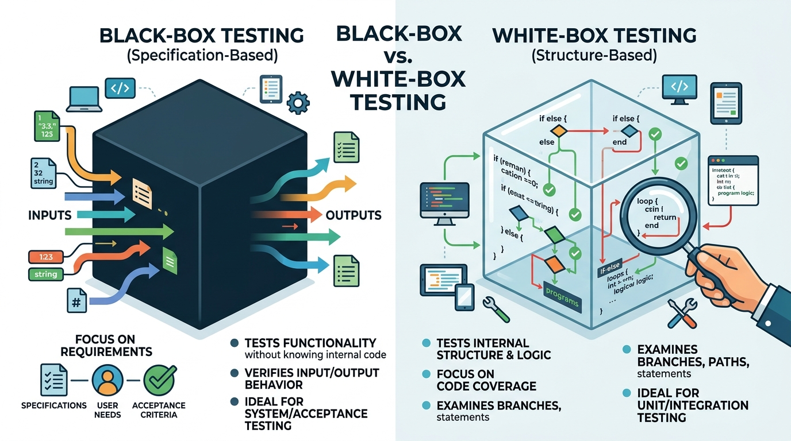
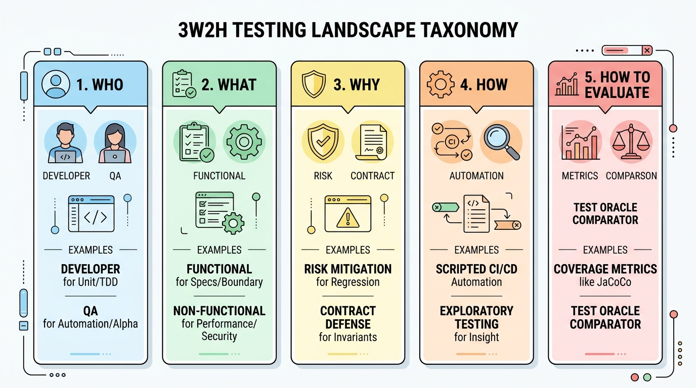
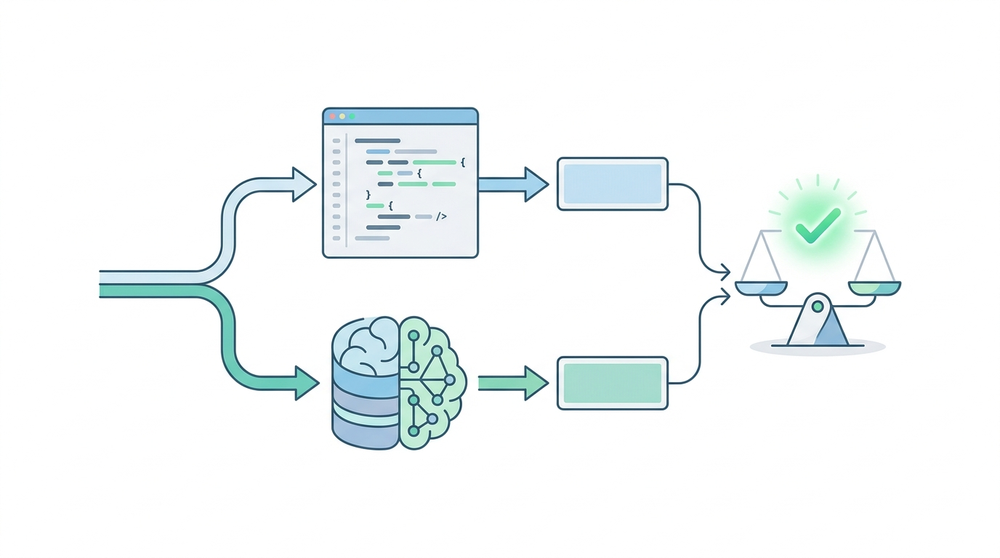

# 軟體品質保證 (SQA)

### 第三章：軟體測試原則、理論與架構模型

授課教師：薛念林教授 (with Gemini AI)

---

## 本章重點 (Chapter Highlights)

* **3.1 軟體測試根本哲理**：
  * 測試本質、破壞性思維、只能證明有錯無法證明無錯。
* **3.2 ISTQB 7 大經典測試原則**：
  * 窮盡不可能、測試左移、缺陷群聚、殺蟲劑悖論、無錯謬誤。
* **3.3 測試多維度分類體系**：
  * 驗證 (Verification) vs. 確認 (Validation)、黑箱 vs. 白箱、測試金字塔。
* **3.4 V 開發模型與雙向追溯**：
  * 規格前置與測試規劃同步、雙向追溯矩陣。
* **3.5 測試案例設計與 3W2H 全景**：
  * 標準五大要件、3W2H 體系、Test Oracle 難題與變質測試。

---

<!-- _class: lead -->

# **3.1 軟體測試根本哲理**

> 「軟體測試只能證明程式有錯，
> 永遠無法證明程式絕對沒有錯誤！」
> —— *Edsger W. Dijkstra*

---

## 3.1.1 什麼是軟體測試？

* **測試的本質**：
  * 透過規劃、設計與執行測試案例，比對實際輸出與預期規格，**發掘軟體缺陷並評估其品質水準**。
* **破壞性思維 (Destructive Mindset)**：
  * 開發的思維是「建設（如何讓系統跑起來）」；
  * 測試的思維是「審判與質疑（在什麼極端邊界下系統會崩潰）」。
* **防禦性設計與狀態不變量**：
  * 系統必須在入口建立嚴格的前置條件 (Preconditions) 防護，維持類別不變量 (Class Invariants)。

---

## Concept Check Question (CCQ 1)

<div class="ccq-columns">
  <div class="ccq-text">

**當一套軟體經過數萬筆自動化單元測試且 100% 全部通過綠燈時，代表該軟體已經被證明絕對沒有任何潛在 Bug。**

* **A.** 正確
* **B.** 錯誤

  </div>
  <div class="ccq-logo">
    
  </div>
</div>

---

<div class="ccq-columns">
  <div class="ccq-text">

* **解析**：
  * **錯誤**：軟體測試的第一大基本原則即為「測試僅能顯示缺陷的存在，無法證明缺陷不存在」。
  * 通過所有測試只能代表「在目前設計的這套測資與情境下未發現錯誤」，不能證明在未測試的極端輸入或環境中絕無缺陷。

<div class="ccq-answer">正確答案：B</div>

  </div>
  <div class="ccq-logo">
    
  </div>
</div>

---

<!-- _class: lead -->

# **3.2 ISTQB 7 大經典測試原則**

> 國際軟體測試認證委員會 (ISTQB) 核心思維基石

---

## 3.2 ISTQB 7 大測試原則總覽

1. **測試顯示缺陷的存在 (Shows presence of defects)**：能證明有錯，無法證明無錯。
2. **窮盡測試是不可能的 (Exhaustive testing is impossible)**：組合爆炸，需基於風險取樣。
3. **及早測試 / 測試左移 (Early testing / Shift-Left)**：需求階段抓錯成本最低 (1:10:100 定律)。
4. **缺陷群聚效應 (Defects cluster together)**：80% 重大 Bug 集中在 20% 核心複雜模組。
5. **小心殺蟲劑悖論 (Pesticide paradox)**：同一套測試跑久了會產生抗藥性，需動態更新。
6. **測試取決於上下文 (Context dependent)**：醫療航太 vs 敏捷 Web 策略完全不同。
7. **無錯謬誤 (Absence-of-errors fallacy)**：零語法錯誤不等於成功，符合使用者需求才是關鍵。

---

<!-- _class: full-image-slide -->

<div class="centered-image">
  
</div>

---

## 原則 2：窮盡測試是不可能的

* **組合爆炸 (Combinatorial Explosion)**：
  * 僅 100 個獨立的二元 `if-else` 分支，就有 $2^{100} \approx 1.27 \times 10^{30}$ 種路徑組合！
* **錯誤總是躲在角落 (Bugs lurk in corners)**：
  ```java
  int scale (int j) {
     j = j - 1; // 正確應為 j = j + 1
     j = j / 3000;
     return j;
  }
  ```
  * 假設 $j \in [-32768, 32767]$，65536 個數值中**僅有 18 個數值會顯現錯誤**（其餘 65518 個數值運算結果碰巧一致！）。
  * 盲目隨機測試踩中錯誤機率僅 0.027%，必須**針對邊界值進行精準打擊 (Risk-Based Testing)**。

---

## 原則 3 & 5：測試左移與殺蟲劑悖論

* **測試左移 (Shift-Left)**：
  * 需求階段抓出錯誤只需 **\$1**，上線後修復成本高達 **\$100+** 且伴隨商譽損害。
* **小心殺蟲劑悖論 (Pesticide Paradox)**：
  * 同一套測試案例反覆跑久了，將無法再挖掘出任何新 Bug。
  * 必須引入**屬性基礎測試 (Property-Based Testing / jqwik)** 與變異測試 (Mutation Testing)。
* **🤖 AI 時代警示【自我印證的假綠燈】**：
  * 若讓 AI 為自己生成的程式碼寫測試，AI 會依照自身的錯誤理解去設計斷言，形成嚴重的「假安全感抗藥性」！

---

## Concept Check Question (CCQ 2)

<div class="ccq-columns">
  <div class="ccq-text">

**工程師用 AI 秒速生成了利息計算函式，並讓同一個 AI 產生單元測試，跑出 100% 覆蓋率綠燈；上線後卻被金管會判定計算公式違法。這最主要反映了 ISTQB 哪項原則？**

* **A.** 測試環境未安裝最新版本編譯器
* **B.** 陷入「殺蟲劑悖論（AI 自我印證盲區）」與「無錯謬誤（程式碼無語法錯誤但偏離法規與真實業務需求）」
* **C.** 只要測試覆蓋率 100%，系統必然在法律上具備合規性
* **D.** 浮點數運算器硬體故障

  </div>
  <div class="ccq-logo">
    
  </div>
</div>

---

<div class="ccq-columns">
  <div class="ccq-text">

* **解析**：
  * **選項 B 正確**：AI 為自己寫測試容易陷入自我印證盲區；且程式碼無語法錯誤不等於符合真實業務法規（無錯謬誤）。人類工程師必須親自定義領域規格與 Test Oracle。
  * **選項 A/C/D 錯誤**：高覆蓋率不能掩蓋業務規則理解錯誤的本質。

<div class="ccq-answer">正確答案：B</div>

  </div>
  <div class="ccq-logo">
    
  </div>
</div>

---

<!-- _class: lead -->

# **3.3 測試多維度分類體系**

> 掌握測試的層級、視角與方法論

---

## 3.3.1 驗證 (Verification) vs. 確認 (Validation)

* **Verification (驗證)**：
  * *關鍵問題*：**「Are we building the product right?」**
  * *目標*：確保產品製造過程嚴格符合規格書與設計圖（製程導向）。
* **Validation (確認)**：
  * *關鍵問題*：**「Are we building the right product?」**
  * *目標*：確保產出的軟體真正解決使用者痛點、滿足業務目標（價值導向）。

---

<!-- _class: full-image-slide -->

<div class="centered-image">
  
</div>

---

## 3.3.2 黑箱測試 vs. 白箱測試

* **黑箱測試 (Black-Box Testing - 規格導向)**：
  * 系統為不透明黑盒，不看內部原始碼，僅依據需求規格設計輸入並驗證輸出。
  * 適用：等價劃分 (EP)、邊界值分析 (BVA)、狀態轉換測試。
* **白箱測試 (White-Box Testing - 結構導向)**：
  * 系統為透明玻璃盒，檢視程式內部邏輯，追求陳述句、分支與路徑涵蓋。
  * 適用：邏輯覆蓋率分析、資料流分析、變異測試。

---

<!-- _class: full-image-slide -->

<div class="centered-image">
  
</div>

---

## 3.3.3 測試三大核心層級

* **1. Unit Testing (單元測試)**：
  * 針對最小可測試單元（方法 / 類別）進行隔離驗證，執行極快（毫秒級）。
* **2. Integration Testing (整合測試)**：
  * 驗證跨模組介面、微服務 API 與資料庫之間的通訊與資料交換。
* **3. System Testing (系統測試)**：
  * 在完整環境中進行端到端 (E2E) 業務工作流程與非功能需求驗證。

---

<!-- _class: full-image-slide -->

<div class="centered-image">
  
</div>

---

## 3.3.4 現代實踐測試金字塔 (The Test Pyramid)

* **金字塔健康分層結構 (Martin Fowler)**：
  * **頂層：UI / E2E Tests (端到端測試)**：數量最少、執行最慢、成本最高。
  * **中層：Integration / Service Tests (服務整合測試)**：數量適中、驗證 API 契約。
  * **底層：Unit Tests (單元測試)**：數量最多、速度極快、維護成本最低。
* **反模式：冰淇淋甜筒 (Ice Cream Cone)**：
  * 缺乏單元測試，過度依賴脆弱昂貴的 UI 測試，導致 CI 構建極慢且頻繁誤報。

---

<!-- _class: full-image-slide -->

<div class="centered-image">
  
</div>

---

<!-- _class: lead -->

# **3.4 V 開發模型與雙向追溯**

> 規格設計在前、測試規劃在先（V-Model）

---

## 3.4.1 V 模型雙向追溯機制

* **左側下降（開發設計）** $\longleftrightarrow$ **右側上升（測試驗證）**：
  * **需求分析 (SRS)** $\longleftrightarrow$ **驗收 / 系統測試 (Acceptance / System Test)**
  * **高階架構設計 (ADD)** $\longleftrightarrow$ **整合測試 (Integration Test)**
  * **詳細模組設計 (SDD)** $\longleftrightarrow$ **單元測試 (Unit Test)**
  * **底層核心**：程式碼撰寫與建置 (Coding / Implementation)
* **核心價值**：
  * 開發規格產出時，同步完成對應層級的測試計畫，避免「實作後測試偏差」。

---

<!-- _class: full-image-slide -->

<div class="centered-image">
  
</div>

---

## Concept Check Question (CCQ 3)

<div class="ccq-columns">
  <div class="ccq-text">

**在標準 V 開發模型中，依據「高階架構設計文件 (ADD)」所定義的模組介面與通訊協定，所對應執行的測試層級為何？**

* **A.** 單元測試 (Unit Testing)
* **B.** 整合測試 (Integration Testing)
* **C.** 驗收測試 (Acceptance Testing)
* **D.** 靜態程式碼檢視 (Code Review)

  </div>
  <div class="ccq-logo">
    
  </div>
</div>

---

<div class="ccq-columns">
  <div class="ccq-text">

* **解析**：
  * **選項 B 正確**：高階架構設計 (ADD) 定義了子系統與模組間的 API 介面與資料傳遞協定，其水平對應的驗證層級為整合測試 (Integration Testing)。
  * **選項 A 對應**：詳細模組設計 (SDD)。
  * **選項 C 對應**：需求規格書 (SRS)。

<div class="ccq-answer">正確答案：B</div>

  </div>
  <div class="ccq-logo">
    
  </div>
</div>

---

<!-- _class: lead -->

# **3.5 測試案例設計與全景 3W2H**

> 現代測試案例架構與 Test Oracle 難題

---

## 3.5.1 測試案例五大核心要件

* **標準測試案例結構**：
  $$\text{Test Case} = [\text{ID}, \text{Preconditions}, \text{Inputs}, \text{Expected Output}, \text{Postconditions}]$$
  1. **1. Test ID & Summary**：唯一識別碼與簡明目的（如 `TC-PAY-001`）。
  2. **2. Preconditions**：執行前系統需處於的初始狀態（帳號登入、資料庫測資）。
  3. **3. Test Inputs**：傳入受測方法的參數或 Request Payload。
  4. **4. Expected Output**：預期回傳值、HTTP 狀態碼或畫面結果。
  5. **5. Postconditions**：執行後資料庫狀態驗證與環境復原 (Cleanup)。

---

<!-- _class: full-image-slide -->

<div class="centered-image">
  
</div>

---

## 3.5.2 測試全景 3W2H 分類體系

* **1. WHO（誰來測）**：Developer (單元/TDD), QA (自動化), User (Beta 測試)。
* **2. WHAT（測什麼）**：Functional (功能/邊界), Non-Functional (效能/資安)。
* **3. WHY（為何測）**：Risk Mitigation (防迴歸), Contract Defense (守護不變量)。
* **4. HOW（如何測）**：Scripted CI/CD, 探索性測試 (Exploratory), 隨機測試。
* **5. HOW TO EVALUATE（如何評估）**：覆蓋率指標, 變異分數 (PIT), **Test Oracle**。

---

<!-- _class: full-image-slide -->

<div class="centered-image">
  
</div>

---

## 3.5.3 Test Oracle 難題與 SQA 2.0 應對

* **何謂 Test Oracle**：判斷受測程式輸出是否正確的機制或基準。
* **AI 與複雜系統的 Oracle 困境**：
  * 搜尋引擎、推薦系統或大語言模型輸出具隨機性與多樣性，無單一標準答案！
* **SQA 2.0 前沿解法**：
  * **變質測試 (Metamorphic Testing)**：驗證對稱性質（如旋轉圖片辨識結果依然為貓）。
  * **差分測試 (Differential Testing)**：多模型/新舊版本輸出交叉比對。
  * **LLM-as-a-Judge 與 Guardrails**：微調評估模型進行忠實度與安全約束檢驗。

---

<!-- _class: full-image-slide -->

<div class="centered-image">
  
</div>

---

## Concept Check Question (CCQ 4)

<div class="ccq-columns">
  <div class="ccq-text">

**在測試影像辨識 AI 模型時，將照片旋轉 10 度或調整亮度 5%，模型輸出依然必須辨識為相同的物體類別。這種利用系統固有對稱性質來解決 Test Oracle 難題的測試技術稱為？**

* **A.** 變質測試 (Metamorphic Testing)
* **B.** 猴子測試 (Monkey Testing)
* **C.** 靜態程式碼分析 (Static Code Analysis)
* **D.** 窮盡測試 (Exhaustive Testing)

  </div>
  <div class="ccq-logo">
    
  </div>
</div>

---

<div class="ccq-columns">
  <div class="ccq-text">

* **解析**：
  * **選項 A 正確**：變質測試 (Metamorphic Testing) 透過定義輸入與輸出間的「變質關係（Metamorphic Relations）」，即使沒有絕對標準輸出，也能藉由對稱轉換前後的關係驗證系統正確性。
  * **選項 B/C/D 錯誤**：皆非基於對稱不變量關係解決 Oracle 難題的技術。

<div class="ccq-answer">正確答案：A</div>

  </div>
  <div class="ccq-logo">
    
  </div>
</div>

---

<!-- _class: lead -->

# **本章重點回顧**

---

## 本章小結與重點

* **測試根本原則**：測試只能證明有錯，無法證明無錯（Dijkstra 箴言）。
* **ISTQB 7 大原則**：窮盡不可能、及早測試、缺陷群聚、小心殺蟲劑抗藥性、無錯謬誤。
* **核心分類與架構**：
  * 驗證 (Verification - 建造正確) vs. 確認 (Validation - 正確軟體)。
  * 測試金字塔（單元 ➔ 整合 ➔ E2E）防範冰淇淋甜筒反模式。
* **V 模型**：水平雙向追溯，規格前置、測試同步規劃。
* **Test Oracle 突破**：變質測試與差分測試守護 AI 與複雜系統品質。
