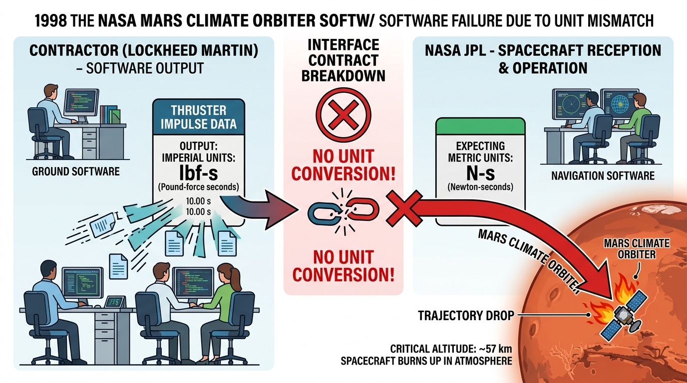
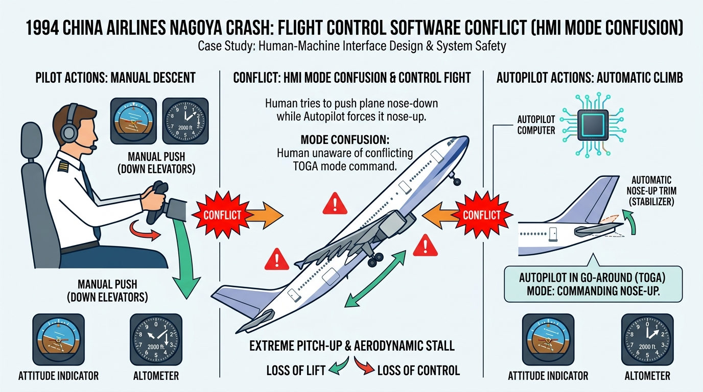
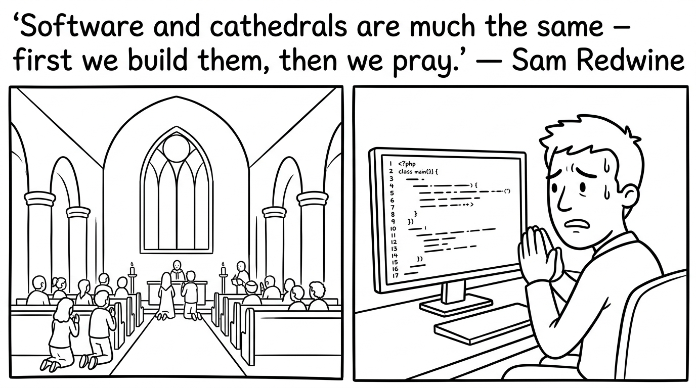
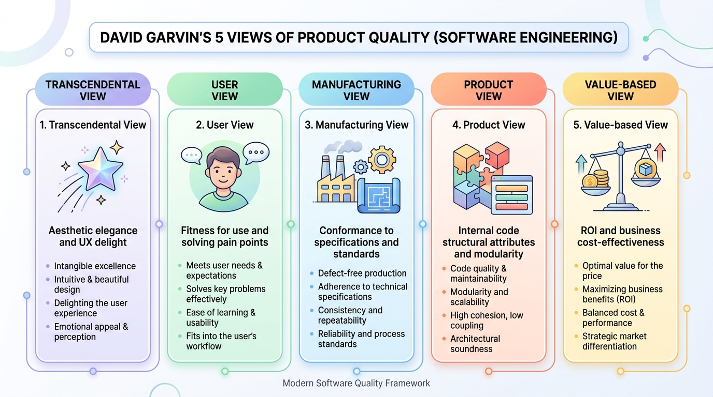
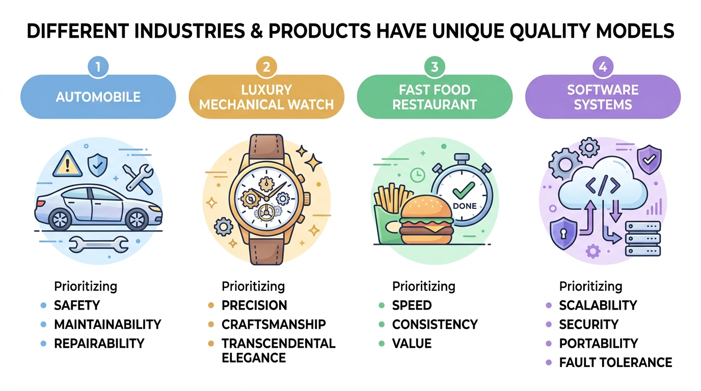
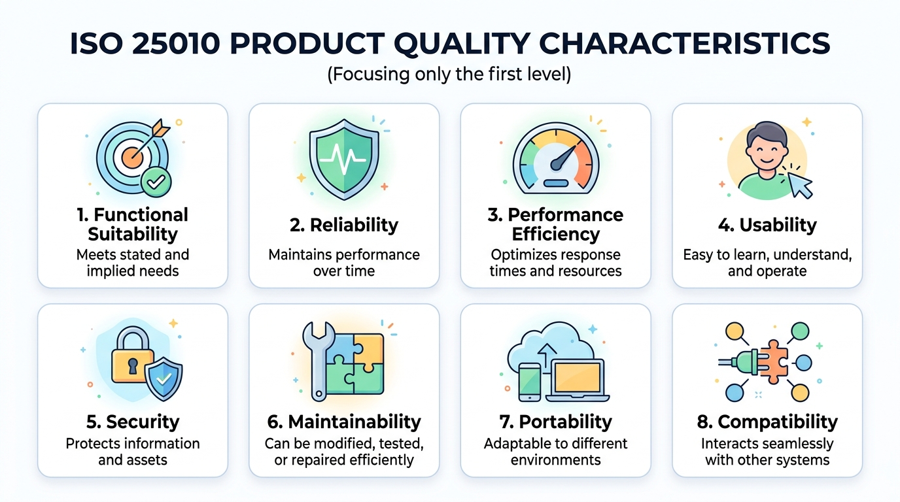
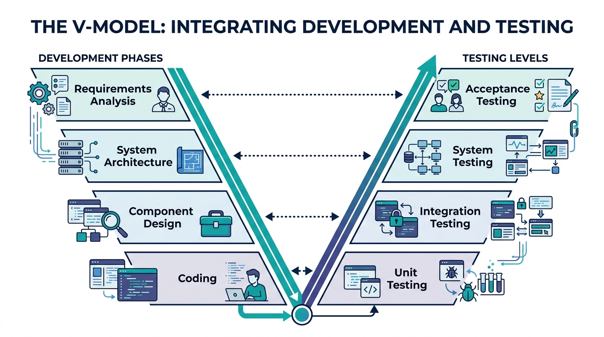

# 軟體品質保證 (SQA)

### 第一章：簡介與軟體品質概念

授課教師：薛念林教授 (with Gemini AI)

---

## 本章重點 (Chapter Highlights)

* **1.1 軟體危機 (Software Crisis)**：
  * 歷史重大案例（愛國者、NASA、華航、迪士尼、戶政系統）與省思。
* **1.2 軟體品質與定義 (Quality Definitions)**：
  * IEEE 軟體四要件、Garvin 五大品質觀點、品質三層次定義。
* **1.3 品質模型 (Quality Models)**：
  * ISO 9126 六大特性與現代 ISO 25010 實戰測試技術地圖。
* **1.4 品質控制與品質保證 (QC vs. QA & CoQ)**：
  * QC 產品事後檢驗 vs. QA 流程事前預防、CoQ 品質成本模型。

---

<!-- _class: lead -->

# **1.1 軟體危機 (Software Crisis)**

> 大家都知道物質不滅定律；我們更熟悉 Bug 不滅定律。

---

## 1.1 何謂軟體危機？

* **背景與起源**：
  * 1960 年代末期，硬體運算能力大幅提升，但軟體開發技術未能跟上。
  * 軟體規模與複雜度呈指數級成長，導致專案頻繁出現**延期、嚴重超支、品質低劣甚至崩潰**。
* **核心挑戰**：
  * 軟體「看不見、摸不著」（無形性），進度難以精確度量。
  * 系統複雜度超出個人大腦可完全掌控的範疇。
  * 缺乏標準化的工程方法、流程規範與品質控制體系。

---

## Case 1：愛國者反導彈事件 (1991)

* **事件背景**：
  * 1991 年波斯灣戰爭，伊拉克飛毛腿飛彈擊中美軍沙烏地達蘭基地，造成 **28 名美軍死亡、100+ 人受傷**。
* **致命缺陷**：
  * 愛國者系統時鐘暫存器採用 **24-bit 浮點數** 設計，每工作 1 小時產生微小的毫秒級轉換截斷誤差。
  * 系統連續運作超過 **100 小時** 未重新開機，時間誤差累計達 **0.33 秒**。
* **災難後果**：
  * 飛毛腿飛彈速度達 4.2 馬赫（1.5 km/s），0.33 秒相當於 **約 600 公尺距離偏差**，雷達搜尋窗無法鎖定目標，攔截飛彈未發射。
* **SQA 啟示**：數值精度與累計誤差問題，長時運行可靠度與壓力測試（Long-term Reliability Testing）。

---

## Case 2：NASA 火星氣候軌道探測器 (1998)

* **事件背景**：
  * 1998 年 NASA 發射「火星氣候軌道探測器」（造價近 2 億美元），抵達火星軌道後失聯焚毀。
* **致命缺陷**：
  * 兩個合作團隊使用 **不同的度量單位**：
    * 洛克希德馬丁（承包商）：**英制單位**（磅力·秒，$\text{lbf}\cdot\text{s}$）
    * NASA 噴射推進實驗室（JPL）：**公制單位**（牛頓·秒，$\text{N}\cdot\text{s}$）
  * 推進控制軟體直接將英制數值當作公制數值運算，未做單位轉換。
* **災難後果**：
  * 軌道高度原本預定 140~150 公里，實際降至 **57 公里**，直接在稀薄大氣層中摩擦焚毀。
* **SQA 啟示**：跨團隊介面合約規範（Interface Contract）、單位相容性與規格檢視審查。

---

<!-- _class: full-image-slide -->

  

---

## Case 3：華航名古屋空難 (1994)

* **事件背景**：
  * 1994 年華航 CI140（空中巴士 A300-622R）降落名古屋機場失事，**264 人罹難**。
* **致命缺陷**：
  * 副駕駛進場時誤觸「**重飛（Go-Around）**」模式。
  * 駕駛員試圖以手動力量強壓機首下降；然而自動飛控電腦因處於重飛爬升狀態，強行將機尾水平安定面往上配平以抬高機首。
* **災難後果**：
  * **人與電腦互搶控制權**，飛機仰角過大失速墜毀。空巴隨後修改全球 A300 飛控軟體邏輯。
* **SQA 啟示**：人機介面（HMI/UX）狀態透明度、異常操作回饋、人工介入與自動化優先級保護。

---

<!-- _class: full-image-slide -->

  

---

## Case 4：迪士尼《獅子王》遊戲與相容性危機 (1994)

* **事件背景**：
  * 1994 年聖誕節迪士尼推出《獅子王》PC 遊戲，伴隨 Compaq 電腦大量促銷，數以萬計家庭期待同樂。
* **致命缺陷**：
  * 遊戲採用微軟剛推出的 WinG 繪圖函式庫，但僅在極少數特定硬體上測試，**未進行廣泛相容性測試**。
  * 在大量家用 PC（如特定視訊晶片）上啟動即藍屏當機或程式崩潰。
* **災難後果**：
  * 聖誕節當日客服電話被憤怒家長打爆，造成 brand 重大打擊。
* **SQA 啟示**：跨硬體/作業系統的多樣化**相容性測試（Compatibility Testing）**，促使微軟催生標準化 DirectX 架構。

---

## Case 5：臺灣公共重大資訊系統案例

* **2014 年 新戶政系統癱瘓**：
  * 新系統上線首日全台大塞車，民眾無法請領戶籍謄本與身分證。
  * 核心問題：軟硬體架構相容性、壓力負載預估不足、資料庫查詢未經優化。
* **2021 年 高中學習歷程檔案遺失**：
  * 外包工程師在虛擬主機搬移重啟時操作失誤，導致 2.5 萬名學生資料遺失。
  * 核心問題：組態管理（Configuration Management）、備份與災難復原驗證缺失。
* **2014 年 國道計程電子收費 (ETC)**：
  * 上線初期重覆扣款與幽靈扣款頻傳，突顯巨量即時交易系統的精準度與極端邊界測試需求。

---

## 軟體危機帶給我們的省思

* **「軟體和教堂非常相似——建成之後我們就開始祈禱。」** —— *Sam Redwine*

---

<!-- _class: full-image-slide -->

  

* 軟體問題不是單純的「寫完程式再找蟲」，而是涉及：
  * **需求與規格的清晰度與正確性**
  * **架構設計的健全性與強固性**
  * **跨團隊溝通、標準與合約遵循**
  * **完整的生命週期測試與品質保證體系**
* 軟體品質工程（SQA）的目的就是透過工程化方法將危機化為可控品質。

---

## Concept Check Question (CCQ 1)

  

**愛國者反導彈系統（1991）在達蘭基地攔截失效的根本軟體原因為何？**

* **A.** 通訊網路中斷導致雷達無法傳送指令給飛彈發射架
* **B.** 24-bit 時鐘暫存器的浮點捨入誤差在連續運行 100 小時後累加達 0.33 秒
* **C.** 程式碼發生記憶體洩漏（Memory Leak）導致作業系統當機
* **D.** 雷達演算法誤將美軍戰機辨識為敵方飛毛腿飛彈

  

  

    
  

---

## Concept Check Question (CCQ 2)

  

**NASA 火星氣候軌道探測器（1998）墜毀事件給軟體工程師最重要的啟示是？**

* **A.** 必須使用多執行緒避免運算堵塞
* **B.** 跨系統或團隊模組間的介面規格（如單位標準）必須嚴格定義與檢驗
* **C.** 太空任務軟體不得使用任何第三方函式庫
* **D.** 只要硬體推力足夠，軟體計算微小偏差不會影響軌道

  

  

    
  

---

## Concept Check Question (CCQ 3)

  

**1994 年華航名古屋空難中，飛控軟體與人機互動設計的關鍵缺失為？**

* **A.** 機載電腦中毒導致控制面板全黑
* **B.** 駕駛員手動操作與電腦重飛模式衝突時，缺乏控制權仲裁與明確狀態指示
* **C.** 飛機引擎燃料計算公式發生除以零例外
* **D.** 自動駕駛系統未實作高度感測功能

  

  

    
  

---

<!-- _class: lead -->

# **1.2 軟體品質與定義**

> 人們會忘記你做得多快，但總記得你做得多好。 —— *Howard Newton*

---

## 1.2.1 什麼是軟體？

* IEEE 對「軟體 (Software)」的廣義定義：
  > Computer **programs**, **procedures**, and possibly associated **documentation** and **data** pertaining to the operation of a computer system.
* 軟體不僅僅是可執行的程式碼（Code），更包含：
  * **程式碼 (Programs)**：指令與演算法
  * **作業程序 (Procedures)**：操作手冊、部署與維運規範
  * **文件 (Documentation)**：需求規格、架構設計、測試案例
  * **資料 (Data)**：初始化參數、設定檔、測試資料集

---

<!-- _class: full-image-slide -->

  

---

## Concept Check Question (CCQ 4)

  

**根據 IEEE 的定義與課程教材，下列何者不屬於「軟體」的範疇？**

* **A.** 開發過程中的系統設計文件與測試案例
* **B.** 為了執行程式所必須準備的系統初始化資料
* **C.** 安裝與運作系統時所遵循的操作程序與流程
* **D.** 僅限於伺服器上執行的編譯後二進位機器碼，不包含上述其他項目

  

  

    
  

---

## 1.2.2 David Garvin 的五大品質觀點

| 品質觀點 | 核心意義 | 軟體領域範例 |
| :--- | :--- | :--- |
| **超自然觀點** (Transcendental) | 無法直接量化，但一體驗就能感受其精緻 | 流暢優雅的 UI/UX 與極致細節 |
| **使用者觀點** (User view) | 符合使用者需求與期望的程度 (Fitness for use) | 易用性、解決痛點的功能 |
| **製造觀點** (Manufacturing) | 符合工程規格與標準流程 (Conformance) | 符合 ISO 標準、零缺陷 (Zero Bug) |
| **產品觀點** (Product view) | 產品本身的內在技術特性與架構材質 | 高內聚低耦合、簡潔程式碼 |
| **價值觀點** (Value-based) | 顧客願意支付的價格與性價比 (ROI) | 軟體帶來的商業價值與訂閱意願 |

---

<!-- _class: full-image-slide -->

  

---

## Concept Check Question (CCQ 5)

  

**某系統完全符合合約規格書的每一項功能要求，但架構混亂極難維護、擴充。依 Garvin 觀點，該軟體在何種觀點下可能被判定品質不良？**

* **A.** 製造觀點（Manufacturing View）
* **B.** 產品觀點（Product View）與專業內隱品質
* **C.** 法律合約觀點
* **D.** 外包計費觀點

  

  

    
  

---

## 1.2.3 軟體品質的三層次定義

1. **符合規格需求** (*Crosby, 1979*)：
   * 符合明訂的需求規格書（Requirement Spec）。*(缺點：規格書常有遺漏)*
2. **符合顧客期望** (*Juran, 1998*)：
   * 滿足使用者與利害關係人的期望與實際需求。
3. **符合專業標準與內隱特性** (*Pressman*)：
   * 除了明訂的功能與效能，更包含專業軟體應具備的**可維護性、安全性、強固性**等內隱特質。

---

## Concept Check Question (CCQ 6)

  

**以下關於軟體品質（Software Quality）定義的敘述，何者最符合 Pressman 對於專業開發軟體（Professionally developed software）的觀點？**

* **A.** 只要程式執行時沒有出現錯誤（Bug），就是具備好品質的軟體
* **B.** 軟體品質僅取決於是否完全滿足規格書中所定義的功能需求
* **C.** 軟體品質不僅包含明訂的功能與效能需求，還包含明訂的開發標準，以及非明訂但專業軟體應具備的隱含特性（如可維護性、易讀性等）
* **D.** 軟體品質完全取決於使用者主觀的滿意度，與開發流程或文件無關

  

  

    
  

---

<!-- _class: lead -->

# **1.3 品質模型 (ISO 9126 / ISO 25010)**

> 品質模型是軟體工程的「指北針」，定義了何謂好軟體。

---

<!-- _class: full-image-slide -->

  

---

## 1.3.1 ISO 9126 六大品質特性

* **功能性 (Functionality)**：正確性、合適性、互通性、合規性、安全性。
* **可靠性 (Reliability)**：成熟度 (MTBF/MTTF)、容錯度、可回復性。
* **可用性 (Usability)**：易理解性、易學習性、易操作性、吸引性。
* **效能性 (Efficiency)**：時間行為（回應時間）、資源利用率（CPU/RAM/I/O）。
* **可維護性 (Maintainability)**：易分析性、易變更性、穩定性、易測試性。
* **可移植性 (Portability)**：適應性、易安裝性、共存性、易置換性。

---

## 1.3.2 現代 ISO 25010 與實戰測試技術地圖

| ISO 25010 品質特性 | 核心守護技術 (本學期重點) |
| :--- | :--- |
| **功能適合性** (Functional Suitability) | 等價類 (EP)、邊界值 (BVA)、JUnit 5、BDD (Cucumber) |
| **可靠性** (Reliability) | 斷言 (Assertions)、**屬性測試 (jqwik)**、混沌工程 (Chaos) |
| **可維護性** (Maintainability) | 靜態分析 (SonarQube/SpotBugs)、**變異測試 (PITest)** |
| **安全性** (Security) | 靜態安全掃描 (AST/SAST)、**模糊測試 (Fuzzing)** |
| **效能效率** (Performance Efficiency) | **k6 / Apache JMeter 高併發壓測**、記憶體分析 |
| **相容性** (Compatibility) | **微服務契約測試 (Pact)**、跨版本相容性測試 |
| **可移植性** (Portability) | **Testcontainers 容器化測試**、Docker environment 驗證 |
| **易用性** (Usability) | **Playwright E2E 驗收測試**、UI 自動化流程 |

---

<!-- _class: full-image-slide -->

  

---

## Concept Check Question (CCQ 7)

  

**伺服器在網路斷線後能自動重連，且不遺失正在處理的交易資料，這屬於 ISO 9126 的哪一項品質特性？**

* **A.** 可靠性 (Reliability) 的 容錯度與可回復性
* **B.** 可移植性 (Portability) 的 易安裝性
* **C.** 可用性 (Usability) 的 吸引性
* **D.** 功能性 (Functionality) 的 合規性

  

  

    
  

---

## Concept Check Question (CCQ 8)

  

**某軟體系統在進行人事模組的欄位長度修改時，意外導致完全無關的財務結算模組產生運行錯誤。這代表該軟體系統在 ISO 9126 品質模型中的哪一項特性表現不佳？**

* **A.** 可分析性 (Analyzability)
* **B.** 穩定性 (Stability)
* **C.** 容錯度 (Fault tolerance)
* **D.** 相互運作性 (Interoperability)

  

  

    
  

---

## Concept Check Question (CCQ 9)

  

**在 ISO 9126 品質模型中，當我們要評估「軟體系統在不同的硬體、軟體或執行環境間進行轉移的難易程度」時，我們是在評估哪一項品質特性？**

* **A.** 功能性 (Functionality)
* **B.** 可維護性 (Maintainability)
* **C.** 可攜性/可移植性 (Portability)
* **D.** 效率性 (Efficiency)

  

  

    
  

---

<!-- _class: lead -->

# **1.4 品質控制 (QC) 與 品質保證 (QA)**

---

## 1.4.1 QC vs. QA 的本質區別

* **品質控制 (Quality Control, QC)**：
  * **著重產品 (Product-oriented)**
  * 事後檢驗、抓蟲 (Defect Detection)
  * 主要活動：單元測試、系統測試、審查產品產出物
* **品質保證 (Quality Assurance, QA)**：
  * **著重流程 (Process-oriented)**
  * 事前預防、改善流程 (Defect Prevention)
  * 主要活動：訂定開發標準、Code Review 規範、CI/CD 流程、品質稽核

---

## 1.4.2 V 模型 (V-Model)：開發與測試的對稱性

* **驗證 (Verification，左側)** 與 **確認 (Validation，右側)**。
* 建立開發階段與對應測試層級之間的平行映射關係：
  * **需求分析** ➔ **驗收測試 (Acceptance Testing)**
  * **系統架構** ➔ **系統測試 (System Testing)**
  * **元件設計** ➔ **整合測試 (Integration Testing)**
  * **編寫程式碼** ➔ **單元測試 (Unit Testing)**
* **核心價值**：在撰寫實際業務程式碼之前，提早設計測試案例以防止缺陷洩漏。

---

<!-- _class: full-image-slide -->

  

---

## 1.4.3 現代敏捷與 DevOps 連續品質門檻 (Continuous Quality Gates)

* **連續品質門檻**：在 CI/CD 流水線的各個階段自動執行品質檢查。
* **六大關鍵品質門檻**：
  1. **代碼提交門檻 (Code Commit)**：Git Pre-commit Hook 自動檢查格式與語法。
  2. **SAST 靜態代碼門檻**：SonarQube 掃描代碼異味與安全弱點。
  3. **單元測試與覆蓋率門檻**：JUnit 5 測試與 JaCoCo 覆蓋率驗證（如 >80%）。
  4. **整合測試門檻**：Testcontainers 自動拉起真實數據庫驗證 API 契約。
  5. **E2E 與安全門檻**：Playwright 自動模擬使用者流程與動態安全掃描。
  6. **生產環境門檻**：金絲雀部署與可觀測性系統監控。

---

<!-- _class: full-image-slide -->

  

---

## 1.4.4 軟體品質成本 (Cost of Quality, CoQ)

* **一致性成本**：
  * **預防成本**：培訓、流程標準、設計審查。
  * **評估成本**：單元測試、程式碼檢視、自動化測試。
* **非一致性成本**：
  * **內部失敗**：上線前修 Bug、重構。
  * **外部失敗**：上線後當機、客戶客訴、賠償。
* **1:10:100 定律**：
  * 需求階段修復 Bug 成本為 **$1**
  * 開發/測試階段修復成本為 **$10**
  * 產品上線後修復成本高達 **$100+** 且伴隨商譽損害！

---

<!-- _class: full-image-slide -->

  

---

## Concept Check Question (CCQ 10)

  

**導入自動化靜態程式碼分析（如 SonarQube）與工程師品質培訓課程，在品質成本 (CoQ) 分類中分別屬於？**

* **A.** 內部失敗成本、外部失敗成本
* **B.** 評估成本（Appraisal）、預防成本（Prevention）
* **C.** 外部失敗成本、評估成本
* **D.** 賠償成本、維護成本

  

  

    
  

---

<!-- _class: lead -->

# **本章重點回顧**

---

## 本章小結與重點

* **軟體危機**：歷史案例（愛國者、NASA、華航、迪士尼）告訴我們軟體缺陷可能致命且代價高昂。
* **軟體品質**：軟體包含程式、程序、文件與資料；Garvin 五大品質觀點多元詮釋品質。
* **ISO 9126**：六大核心品質特性（功能、可靠、可用、效能、維護、移植）。
* **QA vs. QC**：QA 重流程與預防，QC 重產品與檢驗；越早預防成本越低（1:10:100 法則）。

---

<!-- _class: lead -->

# **Q & A**

### 謝謝大家！
