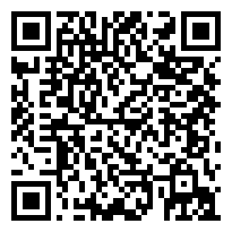
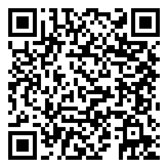
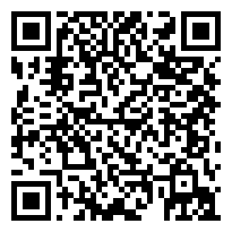
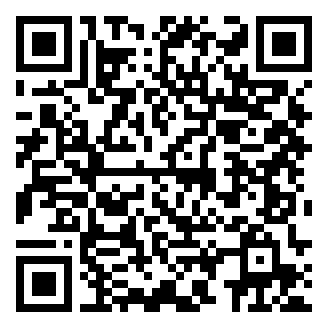
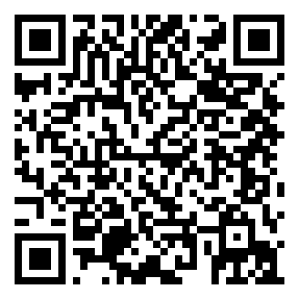
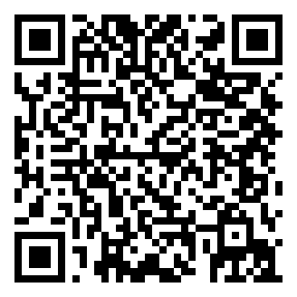
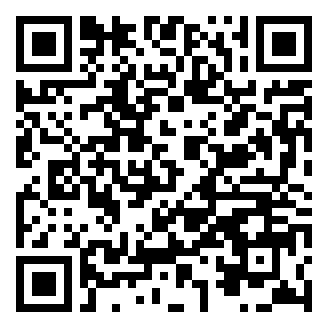
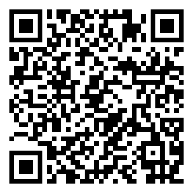

# 軟體品質與測試

### 第 1 章：軟體危機、品質模型與 AI 時代的可靠性工程

授課教師：薛念林 教授

> 大家都知道「物質不滅定律」；身為資工系學生，我們更熟悉「Bug 不滅定律」。  
> 在 2026 年，寫出一段程式碼只要問 AI 3 秒鐘；但要證明這段程式碼在生產環境不會搞垮公司，可能要花上 3 個月。

---

## 本章重點導讀 (Key Highlights)

* **1.1 軟體危機的歷史與 AI 時代的輪迴**：愛國者、NASA、華航、迪士尼四大歷史慘劇與 1968 NATO 軟體危機根源。
* **1.2 AI 能拯救軟體危機嗎？**：程式碼維護債務、高錯誤率、安全弱點與 AI 寫程式引發的典型品質事件。
* **1.3 軟體的本質與品質維度**：IEEE 軟體四要素（程式、程序、文件、資料）＆ David Garvin 五大品質觀點。
* **1.4 軟體品質工程核心概念**：V&V 驗證與確認、品質成本 (CoQ) ＆ 1:10:100 定律與測試左移。
* **1.5 軟體生命週期中的品質把關**：V 模型對稱性 ＆ 現代 DevOps CI/CD 6 大連續品質門檻。
* **1.6 現代軟體品質模型 (ISO 25010 / 25023)**：八大產品品質特性、量化指標 (Metrics) ＆ 10 題情境連環戰。
* **1.7 綜合練習與思維激盪**：課堂思維問題與數值精度累計實作。

---

<!-- _class: lead -->
<!-- header: '1.1 軟體危機的歷史與輪迴' -->

# **1.1 軟體危機的歷史與 AI 時代的輪迴**

> 軟體既能造福人類，亦能造成毀滅性災難。

---

## 1.1.1 Case 1：愛國者反導彈事件 (1991)

* **事件背景**：
  * 1991 年波斯灣戰爭，伊拉克飛毛腿飛彈擊中美軍沙烏地達蘭基地，造成 **28 名美軍死亡、100+ 人受傷**。
* **致命軟體缺陷**：
  * 愛國者系統時鐘暫存器採用 **24-bit 浮點數** 設計，將時間轉換為 0.1 秒單位時產生截斷誤差（約 0.000000095 秒）。
  * 系統連續開機運作超過 **100 小時** 未重啟，誤差累計達 **0.33 秒**。
* **災難後果**：
  * 飛毛腿飛彈速度達 4.2 馬赫（1.5 km/s），0.33 秒相當於 **600 公尺距離偏差**，雷達搜尋窗無法鎖定目標，攔截飛彈未發射。
* **SQA 啟示**：數值精度問題、浮點數累計誤差，以及**長時運行可靠度測試（Long-term Stress/Reliability Testing）**的重要性。

---

## 1.1.2 Case 2：NASA 火星氣候軌道探測器 (1998)

* **事件背景**：
  * 1998 年 NASA 發射「火星氣候軌道探測器」（造價近 2 億美元），抵達火星後失聯焚毀。
* **致命缺陷：跨模組單位不一致**
  * **承包商端（洛克希德馬丁）**：地面控制程式以 **英制單位（磅力·秒，lbf·s）** 輸出推進器衝量數據。
  * **NASA JPL 導航接收端**：太空船導航軟體預設以 **公制單位（牛頓·秒，N·s）** 解析數據（相差 4.45 倍）。
* **災難後果**：
  * 軌道高度預計 140 公里，實際暴跌至 **57 公里**，直接在火星大氣層中摩擦燃燒解體。
* **SQA 啟示**：**跨模組介面契約（Interface Contract）**、強型態檢驗與規格審查的重要性。

---

<!-- _class: title-image-slide -->

## Case 2 架構圖解：跨模組介面契約斷裂

  

---

## 1.1.3 Case 3：華航名古屋空難 (1994)

* **事件背景**：
  * 1994 年華航 CI140 班機（A300-622R）在名古屋機場降落時墜毀，**264 人罹難**。
* **人機介面衝突 (HMI Mode Confusion)**：
  * **機師手動操作 (Manual Push)**：副駕駛誤觸重飛模式後，正副駕駛試圖手動前推操縱桿強壓機首下降。
  * **飛控電腦自動配平 (Autopilot Climb)**：電腦處於重飛狀態，強行將水平安定面向上配平抬高機首。
* **致命後果**：
  * 駕駛員未察覺電腦仍在執行重飛，人機相互抵消；最終水平安定面達到極限仰角，飛機在低空**氣動失速 (Aerodynamic Stall)** 墜毀。
* **SQA 啟示**：人機互動（HMI/UX）狀態透明度、異常操作回饋與自動化控制權限仲裁設計。

---

<!-- _class: title-image-slide -->

## Case 3 架構圖解：人機介面衝突與控制權仲裁

  

---

## 1.1.4 Case 4：迪士尼《獅子王》遊戲 (1994)

* **事件背景**：
  * 1994 年聖誕節迪士尼推出《獅子王》PC 遊戲，數以萬計家庭滿心期待安裝同樂。
* **致命缺陷：缺乏相容性測試**
  * 遊戲基於特定視訊驅動（WinG）開發，**未在市場主流多樣硬體環境上進行充分相容性測試**。
* **災難後果**：
  * 大量家用電腦開機即藍屏當機，客服專線被憤怒家長打爆，嚴重重創品牌聲譽。
* **SQA 啟示**：
  * 環境多樣性驗證與**相容性測試（Compatibility Testing）**的重要性。
  * 該事件促使微軟後來開發標準化 DirectX 遊戲架構。

---

## 1.1.5 軟體危機的定義與成因

* 1968 年 NATO 會議首次提出「軟體危機（Software Crisis）」：

1. **軟體規模與複雜性失控**：
   * 硬體性能激增，軟體規模呈指數成長，超出傳統管理極限。
2. **軟體開發效率低下**：
   * 進度與成本難以預測，人月神話加劇溝通成本。

3. **軟體品質低下**：
   * 錯誤率高，缺乏系統化品質驗證手段。
4. **軟體維護困難**：
   * 架構腐化、缺乏文件，後期維護成本吞噬所有研發預算。

---

<!-- id: sqa-ch01-ccq1 -->
## 🙋 概念核對問答 (CCQ 1)

  

**問題**：愛國者反導彈系統（1991）在達蘭基地攔截失效的根本軟體原因為何？

* **A.** 通訊網路中斷導致雷達無法傳送指令給飛彈發射架
* **B.** 24-bit 時鐘暫存器的浮點捨入誤差在連續運行 100 小時後累加達 0.33 秒
* **C.** 程式碼發生記憶體洩漏（Memory Leak）導致作業系統當機
* **D.** 雷達演算法誤將美軍戰機辨識為敵方飛毛腿飛彈

  

  

    
     <a href="https://nlhsueh.github.io/nickedupocket/#/student/sqa-ch01-ccq1">[課堂互動]</a>
  

---

<!-- id: sqa-ch01-pair1 -->
## 🙋 雙人課堂討論 (Pair Discussion)

  

**主題：真實世界的軟體失敗案例與省思**

* **討論任務**：與鄰近同學組成雙人組，分享一件曾遇過、聽過或搜尋到的真實軟體事故（如 2024 CrowdStrike 藍屏、Knight Capital 交易虧損、搶票/遊戲當機等）。
* **討論重點**：
  1. **影響**：造成了什麼異常？帶來哪些具體損失？
  2. **原因**：為什麼會有這個錯誤？（邏輯缺陷、並行競爭、捨入誤差、流程缺失？）
  3. **防範**：SQA 與測試流程中該如何避免？

  

  

    
     <a href="https://nlhsueh.github.io/nickedupocket/#/student/sqa-ch01-pair1">[課堂互動]</a>
  

---

<!-- _class: lead -->
<!-- header: '1.2 AI 能拯救軟體危機嗎？' -->

# **1.2 AI 能拯救軟體危機嗎？**

> 在 2026 年，寫出一段程式碼只要問 AI 3 秒鐘；  
> 但要證明這段程式碼不會搞垮公司，可能要花上 3 個月。

---

## 1.2 AI 輔助開發的實證研究數據

* **1. 程式碼維護性惡化 (GitClear 1.5 億行研究, 2020-2026)**：
  * **程式碼重複率 (Code Duplication)** 呈指數級上升。
  * 重構指標 **「移動行數 (Moved Lines)」大幅下降**，工程師更少主動重構。
  * **程式碼流失率 (Code Churn)** 顯著增高，帶來沈重的**長期維護性債務**。
* **2. 52% 高錯誤率與「虛假安全感」 (Purdue University)**：
  * ChatGPT 解答 Stack Overflow 問題時，**52% 包含錯誤程式碼或資訊**。
  * 因 AI 語氣自信且條理分明，**39.3% 的使用者依然採信了 AI 的錯誤回答**。
* **3. 40% 安全弱點隱患 (NYU 等學術研究)**：
  * 在無安全提示引導下，AI 生成程式碼中有 **約 40% 包含 CWE 安全漏洞**（如緩衝區溢位、SQL 注入）。

---

## 1.2.1 AI 寫程式引發的典型品質事件 (1/2)

* **1. 幻覺套件供應鏈投毒（Slopsquatting / Package Hallucination）**：
  * **機制**：LLM 憑空捏造合理套件名稱（如 `crypto-validator`）。
  * **災難**：黑客搶先在 PyPI/npm 註冊同名惡意套件，工程師直接執行 `pip install` 導致後門植入企業生產環境。
* **2. 亞馬遜（Amazon）電商系統大斷線與訂單蒸發**：
  * **機制**：2026 年 3 月工程師使用 AI 寫程式工具輔助生成變更程式碼，未經充分審查即推上生產環境。
  * **災難**：送貨與結帳邏輯出錯，北美訂單一度崩跌 99%，數小時內蒸發超過 630 萬筆訂單與鉅額營收。

---

## 1.2.1 AI 寫程式引發的典型品質事件 (2/2)

* **3. Vibe Coding 帶來的漏洞大爆發（以 Lovable/No-code 平台為例）**：
  * **機制**：非工程人員憑 Prompt 快速產出 Web 服務，缺乏 Code Review 與安全概念。
  * **災難**：抽查 1,600+ 個上線應用，高達 10%+ 存在嚴重 SQLi 或越權存取（BOLA）漏洞，可直接繞過驗證進後台。
* **4. 敏感金鑰與憑證直接寫死（Hardcoded Secrets）外洩**：
  * **機制**：AI 範例常把 API Key、資料庫密碼寫死在程式碼中。
  * **災難**：開發者直接推送到公開 GitHub Repo，雲端帳號 1 小時內被爬蟲盜用並產生數萬美元帳單。

---

<!-- _class: title-image-slide -->

## AI 時代的軟體本質：從 Writing 轉移到 Verification

  

---

<!-- id: sqa-ch01-ccq2 -->
## 🙋 概念核對問答 (CCQ 2)

  

**問題**：在評估生成式 AI 對專案品質的影響時，軟體工程度量研究常使用 **「程式碼流失率（Code Churn）」** 作為關鍵指標。關於 Code Churn 的定義及其在 AI 時代所反映的品質現象，下列敘述何者最為精準？

* **A.** 指專案跨語言遷移時因語法不相容遺失的行數比例
* **B.** 指新 Commit 程式碼在極短時間內被刪除或重寫的比例；反映出 AI 程式碼看似快速但本質脆弱、未經深思熟慮
* **C.** 指建置工具自動剔除死碼 (Dead Code) 的效率
* **D.** 指自動化測試案例因版本迭代自然失效的比率

  

  

    
     <a href="https://nlhsueh.github.io/nickedupocket/#/student/sqa-ch01-ccq2">[課堂互動]</a>
  

---

<!-- _class: lead -->
<!-- header: '1.3 軟體的本質與品質維度' -->

# **1.3 軟體的本質與品質維度**

> 軟體四要素 ＆ David Garvin 五大品質觀點

---

## 1.3.1 軟體四大核心要素 (IEEE 610.12)

> **Software (軟體)**:  
> Computer **programs** (程式), **procedures** (程序), and possibly associated **documentation** (文件) and **data** (資料) pertaining to the operation of a computer system.

* 軟體不是只有「能跑的原始程式碼」，而是一個完整的系統化工程有機體。
* 就像一部高速高鐵列車，四大要素各自扮演不可或缺的關鍵角色：
  * **Programs**：引擎動力與神經網路
  * **Procedures**：標準作業流程 SOP 與發布軌道
  * **Documentation**：設計藍圖與通訊法典
  * **Data**：血液、燃料與環境配置

---

<!-- _class: title-image-slide -->

## 軟體四大核心要素架構圖 (IEEE 610.12)

  

---

## 軟體四大核心要素深度剖析 (1/2)

* **1. Programs (程式 / 原始程式碼) ——「引擎動力與神經網路」**：
  * **內涵**：原始碼 (Source Code)、編譯 Bytecode/二進位檔、演算法函式庫與微服務 API，負責承載核心業務邏輯。
  * **實例**：外送平台中計算「外送員最佳派單路徑」與「尖峰動態加價」的核心演算法。
  * **SQA 啟示**：光有程式碼就像只有引擎卻無軌道與汽油的幽靈車，無法安全交付。
* **2. Procedures (作業程序與維運規程) ——「標準作業流程 SOP 與軌道」**：
  * **內涵**：CI/CD 流水線、灰度/金絲雀發布規程、災難復原演練 (DR)、備份排程與 Runbooks。
  * **實例**：2024 年 **CrowdStrike 全球大當機**導致 850 萬台電腦藍屏癱瘓。事故根本原因正是發布程序漏洞——更新檔未經分階段逐步驗證，一次性推送全球。

---

## 軟體四大核心要素深度剖析 (2/2)

* **3. Documentation (文件、規格與契約) ——「設計藍圖與通訊法典」**：
  * **內涵**：需求規格書 (SRS)、OpenAPI 介面契約、架構設計圖、驗收準則與使用者手冊；現代工程中更是自動化測試基石（規格即活文件）。
  * **實例**：**NASA 火星探測器**因地面端「英制」與導航端「公制」契約斷裂，直接燒掉兩億美元！
* **4. Data (資料、設定檔與測試基準) ——「血液、燃料與環境配置」**：
  * **內涵**：資料庫遷移腳本 (Migration)、設定檔 (`application.yml`)、環境變數與測試測資集 (Test Fixtures)。
  * **實例**：程式碼完全沒變，但部署時將連線逾時誤設為 `30ms`（原 30s），整座系統上線瞬間雪崩。「組態即程式碼 (Config as Code)」的驗證同樣是測試核心。

---

## 1.3.2 David Garvin 五大品質觀點

* 哈佛商學院教授 David Garvin 指出，品質是由多重視角交織而成的立體概念：

* **1. 超自然觀點 (Transcendental View)**：
  * 無法量化，但一體驗就能感受其極致優雅與美感（如流暢的 UI/UX 微互動）。
* **2. 使用者觀點 (User View - Fitness for Use)**：
  * 是否切中真實使用者痛點、操作直覺並帶來實質效益（合用性）。
* **3. 製造觀點 (Manufacturing View - Conformance)**：
  * 是否 100% 符合工程規格書、通過靜態檢測與 Quality Gate（符合度）。
* **4. 產品觀點 (Product View - Architecture)**：
  * 產品內在技術特性，如高內聚低耦合、強固型態、可測試性與可維護性。
* **5. 價值觀點 (Value-based View - ROI)**：
  * 軟體商業效益是否顯著高於開發、測試與維運之總成本（投資報酬率）。

---

<!-- _class: title-image-slide -->

## David Garvin 五大品質觀點架構

  

---

## Garvin 五大品質觀點深度實例 (1/2)

* **1. 超自然觀點 (Transcendental View)**：
  * 例如：**Apple iOS** 手勢滑動物理慣性阻尼、**Notion** 極簡斜線指令 (`/`)，絲滑精緻的微互動讓人發自內心讚嘆。
  * 反之：早期報稅系統，功能齊全但介面如同 90 年代老舊表格，按鍵延遲排版擁擠，令人挫折。
* **2. 使用者觀點 (User View)**：
  * 例如：**Zoom** 在疫情期間擊敗視訊巨頭，因「點連結 3 秒開會」，連長輩學童都能無障礙上手。
  * 反之：耗時研發支援 50 種冷門格式的播放器，但使用者只想一鍵播 MP4，淪為陳列品 (Shelfware)。
* **3. 製造觀點 (Manufacturing View)**：
  * 例如：**航太飛控**或**銀行核心帳務**，規格書定義精確至小數後 4 位，實作 100% 符合規格零偏差。
  * 盲點：若需求規格本身就有盲點，製造觀點拿下 100 分，也只是「分毫不差造出一套合規廢品」。

---

## Garvin 五大品質觀點深度實例 (2/2)

* **4. 產品觀點 (Product View)**：
  * 例如：**Linux 核心**或 **Spring Framework** 架構設計，模組高內聚低耦合，圈複雜度低，具備 90% 以上自動化測試保護，歷經十餘年依然穩健重構擴展。
  * 反之：**義大利麵程式碼 (Spaghetti Code)**，外表堪用但原始碼無分層且複製貼上，改動一個按鈕竟引發會員登入全面崩潰。
* **5. 價值觀點 (Value-based View)**：
  * 例如：新創以 Serverless 與開源元件在兩週內打造出 **MVP（最小可行產品）** 搶佔市場，以最低成本取得最大商業回饋。
  * 反之：在商業模式未驗證前，執意耗資數百萬引進複雜分散式架構與自建機房，產品上線前資金耗盡宣告破產。

---

## Garvin 五大品質觀點對照表

| 品質觀點 | 核心定義 | 軟體工程實例 | 忽略該觀點的後果 |
| :--- | :--- | :--- | :--- |
| **超自然觀點** | 無法精確量化，體驗感受極致美感 | 流暢 UI/UX、細膩微互動 (iOS) | 軟體感覺粗製濫造、冰冷卡頓 |
| **使用者觀點** | 符合真實需求 (Fitness for Use) | 解決痛點、操作直覺 (Zoom) | 功能很強但無人想用 (Shelfware) |
| **製造觀點** | 符合規格流程 (Conformance) | 遵循 Clean Code、通過 Gate | 規格有漏洞時做出一套合規廢品 |
| **產品觀點** | 產品內在技術特性與架構 | 高內聚低耦合、強固型態 (Spring) | 架構腐化，改動引發全面崩潰 |
| **價值觀點** | 商業價值與性價比 (ROI) | 商業產出 > 開發維運成本 (MVP) | 開發成本失控超支，商業不可行 |

---

<!-- id: sqa-ch01-wordcloud1 -->
## 🙋 文字雲互動：品質觀點

  

**互動提問**：

你覺得哪一個觀點是最重要的品質指標？請寫下來。

* 超自然觀點 (Transcendental View)
* 使用者觀點 (User View)
* 製造觀點 (Manufacturing View)
* 產品觀點 (Product View)
* 價值觀點 (Value-based View)

  

  

    
     <a href="https://nlhsueh.github.io/nickedupocket/#/student/sqa-ch01-wordcloud1">[課堂互動]</a>
  

---

<!-- id: sqa-ch01-ccq3 -->
## 🙋 概念核對問答 (CCQ 3)

  

**問題**：某專案團隊開發的電商 App 完全符合合約規格書上的每一條需求（製造觀點合格），但因為底層架構高度耦合且完全沒有寫單元測試，半年後客戶想新增一個促銷功能時，工程團隊發現必須重寫整個系統。這代表該軟體在 Garvin 的哪一個品質觀點上嚴重不及格？

* **A.** 產品觀點 (Product View)
* **B.** 製造觀點 (Manufacturing View)
* **C.** 法律合約觀點 (Legal Contract View)
* **D.** 超自然觀點 (Transcendental View)

  

  

    
     <a href="https://nlhsueh.github.io/nickedupocket/#/student/sqa-ch01-ccq3">[課堂互動]</a>
  

---

<!-- _class: lead -->
<!-- header: '1.4 V&V、品質成本與測試左移' -->

# **1.4 軟體品質工程核心概念**

> V&V 驗證與確認、品質成本 (CoQ) 與測試左移

---

## 1.4.1 驗證與確認 (Verification vs. Validation)

* 軟體品質工程的兩大靈魂叩問：

> 🔍 **Verification (驗證)**：  
> *Are we building the product **right**?*（我們是否有正確地建造軟體？）  
> 確保產出物符合設定的規格（程式碼是否符合設計圖、單元測試是否符合規格）。

> 🎯 **Validation (確認)**：  
> *Are we building the **right** product?*（我們建造的是否是正確的軟體？）  
> 確保軟體真正滿足使用者的真實業務需求（驗收測試、易用性測試、臨床/現場試用）。

---

<!-- id: sqa-ch01-ccq4 -->
## 🙋 概念核對問答 (CCQ 4)

  

**問題**：某軟體團隊為醫院開發急診分流系統，嚴格按照規格書完成實作，單元測試與 Code Review 皆 100% 通過無 Bug。但實際上線在急診室臨床試用時，醫護人員發現分流操作流程完全不符合急救現場真實節奏，無法在實務中使用。根據定義，此系統在下列哪一項做得很好，但在哪一項嚴重失敗？

* **A.** Verification 做得很好，但 Validation 嚴重失敗
* **B.** Validation 做得很好，但 Verification 嚴重失敗
* **C.** Verification 與 Validation 兩者皆成功
* **D.** Verification 與 Validation 兩者皆失敗

  

  

    
     <a href="https://nlhsueh.github.io/nickedupocket/#/student/sqa-ch01-ccq4">[課堂互動]</a>
  

---

## 1.4.2 軟體品質成本 (Cost of Quality, CoQ)

* **一致性成本 (Conformance Costs - 主動投資品質)**：
  * **預防成本 (Prevention)**：架構審查、契約設計 (DbC)、工程培訓與靜態規範。
  * **評估成本 (Appraisal)**：單元測試、靜態程式碼分析 (SonarQube) 與 Code Review。
* **非一致性成本 (Non-Conformance Costs - 忽視品質的代價)**：
  * **內部失敗成本 (Internal Failure)**：上線前發現 Bug 的除錯 (Debugging)、重構與重測返工。
  * **外部失敗成本 (External Failure)**：生產環境崩潰、客戶求償、緊急 Hotfix 與商譽損失。
* **1:10:100 定律 (The Rule of Tens)**：
  * 需求階段修復缺陷代價 **$1** ➔ 開發測試階段暴增至 **$10** ➔ 上線後災難損失高達 **$100 ～ $1000+**！

---

<!-- _class: title-image-slide -->

## 品質成本 (CoQ) 架構與 1:10:100 定律

  

---

<!-- _class: lead -->
<!-- header: '1.5 生命週期品質把關與 CI/CD' -->

# **1.5 軟體生命週期中的品質把關**

> V 模型對稱性與 DevOps CI/CD 連續品質門檻

---

## 1.5.1 傳統模型與 V 模型：對稱性與早期規劃

* **V 模型 (V-Model)** 建立了開發階段與測試層級的嚴密對稱與平行規劃：
  * **需求分析 (Requirements)** ➔ 平行規劃 **驗收測試 (Acceptance Testing)**
  * **系統架構 (System Architecture)** ➔ 平行規劃 **系統測試 (System Testing)**
  * **元件設計 (Component Design)** ➔ 平行規劃 **整合測試 (Integration Testing)**
  * **編寫程式碼 (Coding)** ➔ 實作並執行 **單元測試 (Unit Testing)**
* **核心價值**：
  * 「品質是建構出來的，不是測出來的 (Quality is built-in, not tested-in)」。
  * 在寫下第一行業務程式碼前，各層級測試規格就已隨同架構確立完成。

---

<!-- _class: title-image-slide -->

## V 模型 (V-Model) 開發與測試對稱圖

  

---

## 1.5.2 DevOps CI/CD 連續品質門檻 (Quality Gates)

* **1. Commit 門檻**：本地 Git Pre-commit Hook 格式化與快速靜態語法檢查。
* **2. SAST 靜態程式碼品質門檻**：SonarQube / SpotBugs 掃描程式碼異味與安全弱點。
* **3. Unit Tests & 覆蓋率門檻**：JUnit 5 單元測試，JaCoCo 驗證覆蓋率 (> 80%)。
* **4. Integration Tests 容器整合門檻**：Testcontainers 拉起真實 Docker 驗證 DB 與 API。
* **5. E2E & Security 驗收門檻**：Playwright 自動化使用者流程 + OWASP ZAP 動態掃描。
* **6. Production & Observability 門檻**：金絲雀部署 + 可觀測性監控 P99 延遲告警。

---

<!-- _class: title-image-slide -->

## DevOps CI/CD 6 大連續品質門檻架構圖

  

---

<!-- id: sqa-ch01-ordering1 -->
## 🙋 排序互動：V 模型活動生命週期排序

  

**問題**：請將下列 8 項軟體工程活動，依照**「實際執行生命週期順序（從最初需求分析到最終驗收）」**由先至後排列出正確順序：

1. 需求分析與規格定義 (Requirements Analysis)
2. 系統架構設計 (System Architecture Design)
3. 元件/模組詳細設計 (Component Design)
4. 程式碼編寫與實作 (Coding)
5. 單元測試執行 (Unit Testing)
6. 整合測試執行 (Integration Testing)
7. 系統測試執行 (System Testing)
8. 驗收測試執行 (Acceptance Testing)

  

  

    
     <a href="https://nlhsueh.github.io/nickedupocket/#/student/sqa-ch01-ordering1">[課堂互動]</a>
  

---

<!-- _class: lead -->
<!-- header: '1.6 現代軟體品質模型 ISO 25010' -->

# **1.6 現代軟體品質模型 (ISO 25010)**

> ISO 25010 八大產品品質特性與情境連環戰

---

<!-- _class: title-image-slide -->

## 不同產業與產品具備截然不同的品質模型

  

---

<!-- _class: title-image-slide -->

## ISO 25010 八大產品品質特性架構 (SQuaRE)

  

---

## 1.6.1 ISO 25010 八大特性解析 (1/2)

* **1. 功能適合性 (Functional Suitability)**：
  * **完備性 (Completeness)**、**正確性 (Correctness)**、**適切性 (Appropriateness)**。
* **2. 可靠性 (Reliability)**：
  * **成熟度 (Maturity)**、**容錯度 (Fault Tolerance)**、**可回復性 (Recoverability)**。
* **3. 效能效率 (Performance Efficiency)**：
  * **時間行為 (Time Behavior, P99 延遲)**、**資源利用率**、**容量 (Capacity)**。
* **4. 易用性 (Usability)**：
  * **易識別性**、**易學習性**、**易操作性**、**使用者錯誤防護 (Error Protection)**。

---

## 1.6.1 ISO 25010 八大特性解析 (2/2)

* **5. 安全性 (Security)**：
  * **機密性 (Confidentiality)**、**完整性 (Integrity)**、**抗抵賴性 (Non-repudiation)**、真實性與授權。
* **6. 可維護性 (Maintainability)**：
  * **模組化 (Modularity)**、**可分析性**、**可修改性**、**可測試性 (Testability)**。
* **7. 可移植性 (Portability)**：
  * **適應性 (Adaptability)**、**易安裝性**、**易置換性 (Docker 容器一致性)**。
* **8. 相容性 (Compatibility)**：
  * **共存性 (Co-existence)**、**互通性 (Interoperability, API 協定契約)**。

---

## 1.6.2 ISO 25023 品質特性量化指標 (1/2)

> 「如果無法度量它，就無法改善它。」—— Tom DeMarco

* **1. 功能適合性 (Functional Suitability)**：
  * **需求覆蓋率** ($= 100\%$)、**驗收測試通過率** ($\ge 99.5\%$)、Critical Bug 數 ($= 0$)。
* **2. 可靠性 (Reliability)**：
  * **可用度 SLA** (如 99.99% 四個九)、**MTTR** (平均修復時間 $< 15$ 分鐘)、**MTBF**。
* **3. 效能效率 (Performance Efficiency)**：
  * **時間延遲** (API P99 $< 200\text{ms}$)、**吞吐量** (TPS/QPS)、**尖峰 CPU** ($< 70\%$)。
* **4. 易用性 (Usability)**：
  * **任務完成率** ($\ge 90\%$)、**SUS 評分** ($\ge 68$ 分)、**無障礙 WCAG 2.1 AA**。

---

## 1.6.2 ISO 25023 品質特性量化指標 (2/2)

* **5. 安全性 (Security)**：
  * **CVE 重大漏洞數** ($= 0$)、**傳輸靜態加密率** ($100\%$ TLS 1.3/AES)、**修補天數**。
* **6. 可維護性 (Maintainability)**：
  * **圈複雜度 (CC)** ($\le 10$)、**程式碼涵蓋率** ($\ge 80\%$)、**重複程式碼率** ($< 3\%$)。
* **7. 可移植性 (Portability)**：
  * **自動化部署成功率** ($\ge 99\%$)、**容器冷啟動時間** ($< 5\text{s}$)、**移植工時比**。
* **8. 相容性 (Compatibility)**：
  * **跨瀏覽器相容率** ($100\%$)、**API 契約測試通過率** ($100\%$)、**資源衝突次數** ($= 0$)。

---

## 1.6.2 現代 SQA 量化落地的「三大工程支柱」

1. **靜態程式碼門檻 (Static Quality Gate)**：
   * **SonarQube / PMD**：阻擋高圈複雜度、重複程式碼與安全漏洞。
2. **動態效能門檻 (Performance Gate)**：
   * **JMeter / k6**：驗證 P99 延遲與並發負載容量，防止效能退化。

3. **運行時可觀測性 (Runtime Observability)**：
   * **Prometheus / Grafana / Datadog**：即時監控可用度 (99.99%)、錯誤率與 MTTR。
* 💡 **核心心法**：
  * 抽象的 ISO 特性 ➔ 具體的數值指標 (SLI/SLA) ➔ 工具自動把關。

---

## 🎮 課堂挑戰：ISO 25010 八大特性連環戰 (情境 1~5)

* **八大選項池**：
  * `A. 功能適合性` ｜ `B. 可靠性` ｜ `C. 效能效率` ｜ `D. 易用性`
  * `E. 安全性` ｜ `F. 可維護性` ｜ `G. 可移植性` ｜ `H. 相容性`

* **第 1 題【吐鈔卡死危機】**：ATM 提款扣款成功並印明細，但吐鈔口卡死分文未出。
* **第 2 題【雙十一流量海嘯】**：午夜 50 萬人搶購，CPU 飆到 100%，API 延遲暴增至 40 秒。
* **第 3 題【致命的相鄰按鈕】**：「重啟伺服器」與「永久銷毀主機」按鈕相鄰且顏色相同無二次防呆。
* **第 4 題【牽一髮動全身的義大利麵】**：新增會員「暱稱」欄位引發 8 個模組連鎖編譯錯誤。
* **第 5 題【斷電重啟秒級自癒】**：DB 突發斷電，備援機制 3 秒內自動 Failover 重放 WAL 零遺失。

---

## 🎮 課堂挑戰：ISO 25010 八大特性連環戰 (情境 6~10)

* **八大選項池**：
  * `A. 功能適合性` ｜ `B. 可靠性` ｜ `C. 效能效率` ｜ `D. 易用性`
  * `E. 安全性` ｜ `F. 可維護性` ｜ `G. 可移植性` ｜ `H. 相容性`

* **第 6 題【跨系統托運單格式打架】**：電商與物流 API 日期協定不符（`YYYY-MM-DD` vs `DD/MM/YYYY`）導致批次失敗。
* **第 7 題【URL 改個數字看光他人隱私】**：將 URL `userId=1001` 改為 `1002`，直接秀出他人信用卡號。
* **第 8 題【Mac 開發很順，推上 Linux 容器全掛】**：macOS 測試正常，上 Linux 因大小寫嚴格區分找不到檔案。
* **第 9 題【地下室離線暫存與自動重送】**：外送員進地下室 App 自動離線快取，回地面 5G 自動重送。
* **第 10 題【容器映像檔一鍵秒級部署】**：Docker 映像檔在 AWS、GCP 或 K8s 皆能在 10 秒內一鍵拉起。

---

<!-- id: sqa-ch01-game -->
## 🙋 課堂挑戰遊戲：ISO 25010 情境連連看

  

**遊戲任務**：

請透過手機或筆電進入線上互動介面，針對 10 個日常軟體工程事件進行 ISO 25010 八大特性配對！

* 考驗你的架構直覺與品質標準掌握度！
* 每題均對應真實開發與維運的慘痛教訓或高可用實踐。

  

  

    
     <a href="https://nlhsueh.github.io/nickedupocket/#/student/sqa-ch01-game">[課堂互動]</a>
  

---

<!-- _class: lead -->
<!-- header: '1.7 綜合練習與思維激盪' -->

# **1.7 綜合練習與思維激盪**

> 課堂思考與實務討論

---

## 1.7 課堂思維激盪與問題討論

* **1. AI 時代的品質反思**：
  * 當生成式 AI 可在幾秒內產生程式碼時，為什麼軟體測試工程師的價值反而大幅提升？
  * 請從「**Test Oracle 問題**」與「**自我印證偏誤**」兩方面進行思考。
* **2. ISO 25010 維度分析**：
  * 「微服務系統在資料庫當機重啟後，能在 5 秒內自動重連並重試訊息，完全不丟失交易。」
  * 這體現了 ISO 25010 中的哪些品質特性？（提示：容錯度、可回復性、資料完整性）。
* **3. 數值精度與累計誤差實證**：
  * 試寫一段 Java 程式碼，連續將 `0.1` 累加 1,000,000 次，比較其結果與 `100000.0` 的差異。觀察浮點數在長時間累計下的偏差現象。

---

<!-- _class: lead -->
<!-- header: '附錄：課堂互動參考解答' -->

# **附錄：課堂互動參考解答**

> 各題答案與關鍵解析

---

## 課堂互動參考解答 (1/2)

* **CCQ 1（愛國者反導彈事件）**：
  * **正確答案：B**
  * 愛國者系統採用 24-bit 浮點數記錄時間，連開 100 小時累積 0.33 秒誤差，對 4.2 馬赫飛彈造成約 600 公尺偏差，無法鎖定。
* **CCQ 2（程式碼流失率 Code Churn）**：
  * **正確答案：B**
  * 衡量新 Commit 程式碼在短時間（2 週）內被刪除或修改的比例；反映 AI 程式碼看似快速但脆弱，帶來長期維護債。
* **CCQ 3（Garvin 品質觀點）**：
  * **正確答案：A**
  * 產品觀點著重於內在架構（高內聚低耦合、可維護性）。雖符合合約規格（製造觀點），但架構腐敗。
* **CCQ 4（Verification vs. Validation）**：
  * **正確答案：A**
  * 系統符合規格且通過測試（Verification 成功），但無法滿足急診臨床真實節奏需求（Validation 失敗）。

---

## 課堂互動參考解答 (2/2)

* **排序題（V 模型生命週期順序）**：
  * **正確順序**：`1 ➔ 2 ➔ 3 ➔ 4 ➔ 5 ➔ 6 ➔ 7 ➔ 8`
  * 需求分析 ➔ 系統架構 ➔ 元件設計 ➔ 編寫程式碼 ➔ 單元測試 ➔ 整合測試 ➔ 系統測試 ➔ 驗收測試。
* **ISO 25010 情境連連看（10 題連環戰）**：
  * **1. ATM 吐鈔卡死** ➔ **A. 功能適合性**（功能正確性與完備性）
  * **2. 雙十一延遲 40 秒** ➔ **C. 效能效率**（時間行為與容量）
  * **3. 相鄰毀滅按鈕無防呆** ➔ **D. 易用性**（使用者錯誤防護）
  * **4. 改欄位 8 模組連鎖破裂** ➔ **F. 可維護性**（模組化與可修改性）
  * **5. 斷電 3 秒自癒零遺失** ➔ **B. 可靠性**（容錯度與可回復性）
  * **6. 物流 API 日期格式打架** ➔ **H. 相容性**（互通性 Interoperability）
  * **7. URL 改 ID 偷窺信用卡** ➔ **E. 安全性**（機密性與授權能力）
  * **8. Linux 容器大小寫崩潰** ➔ **G. 可移植性**（適應性 Adaptability）
  * **9. 地下室離線暫存自動重送** ➔ **B. 可靠性**（成熟度與容錯度）
  * **10. Docker 映像檔秒級部署** ➔ **G. 可移植性**（易安裝性與易置換性）
