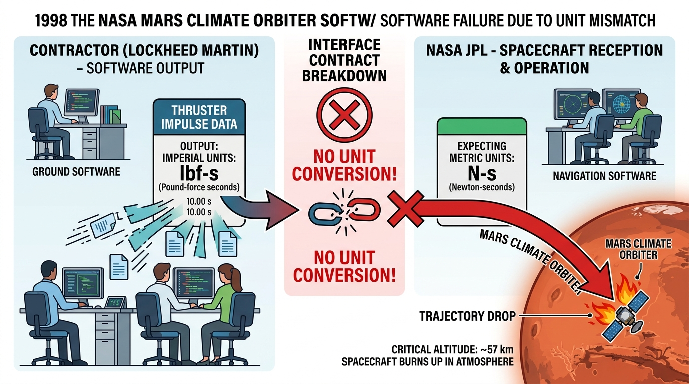
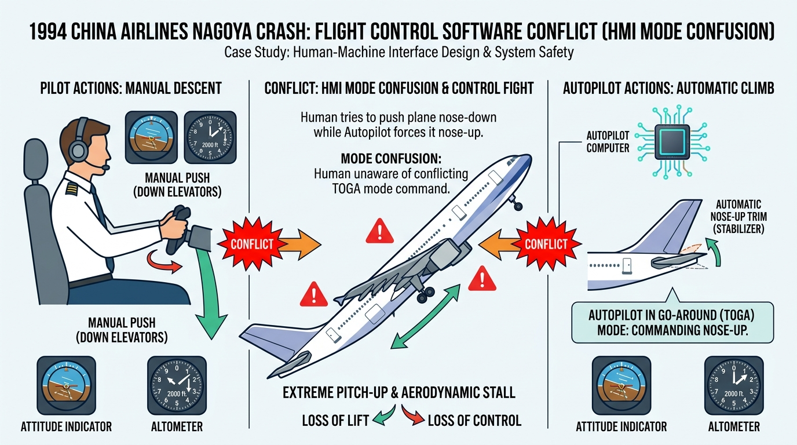
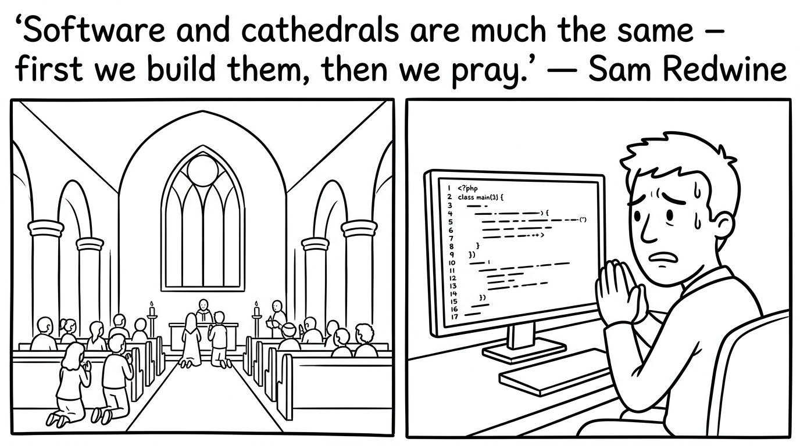
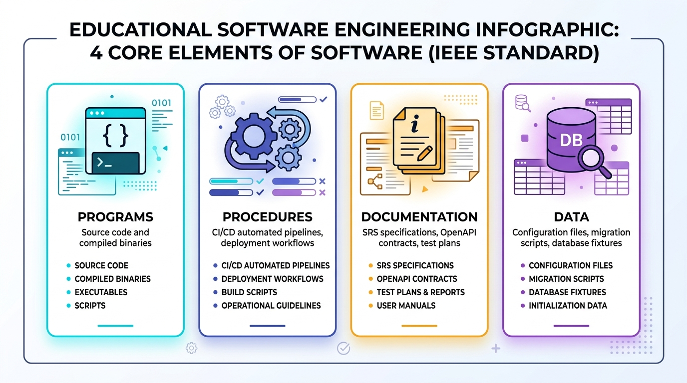
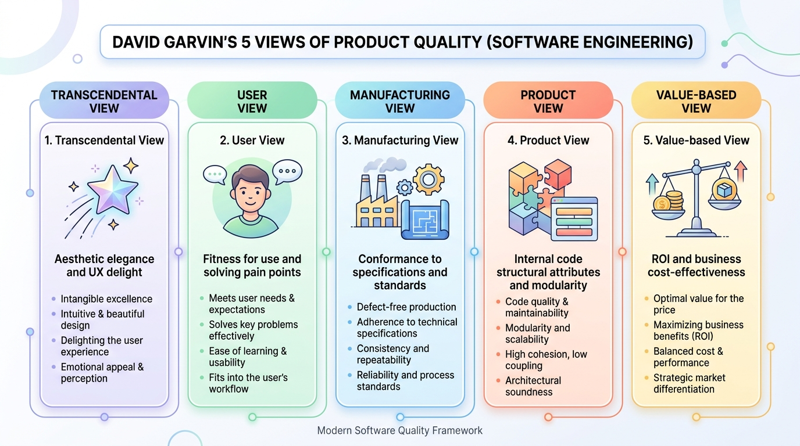
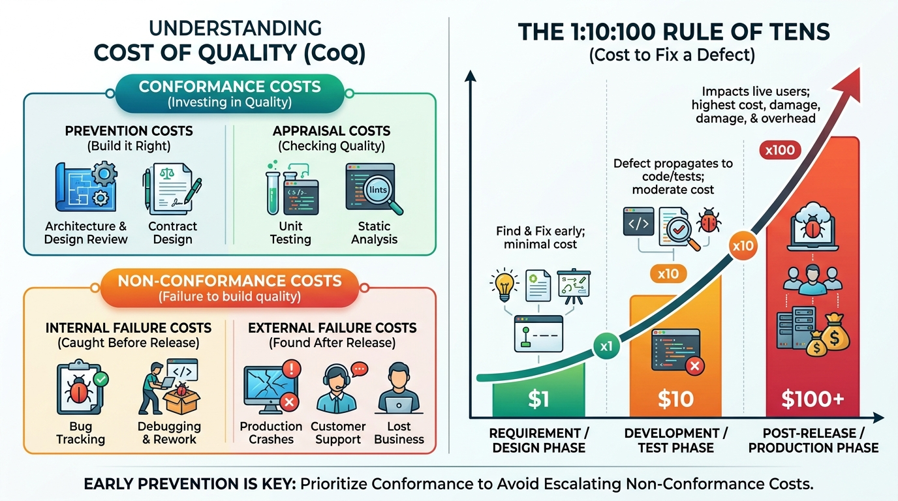
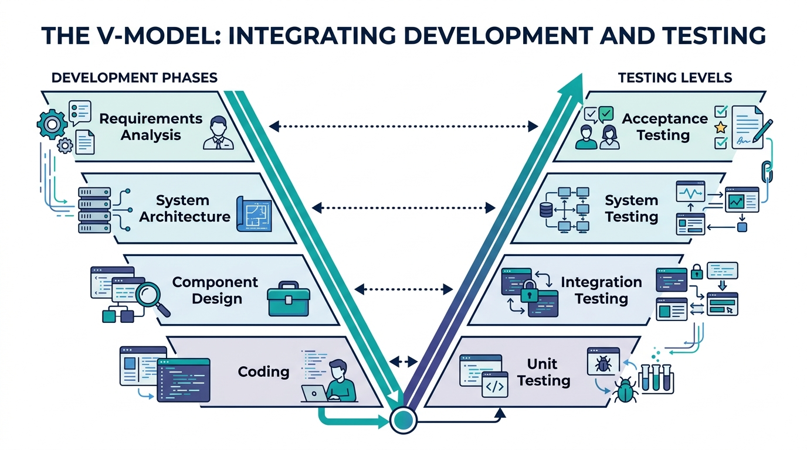
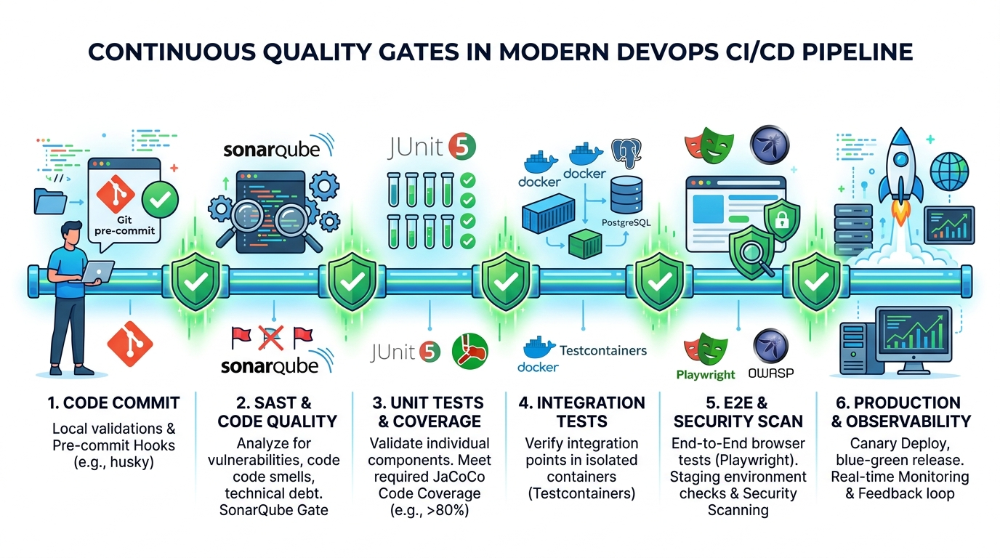
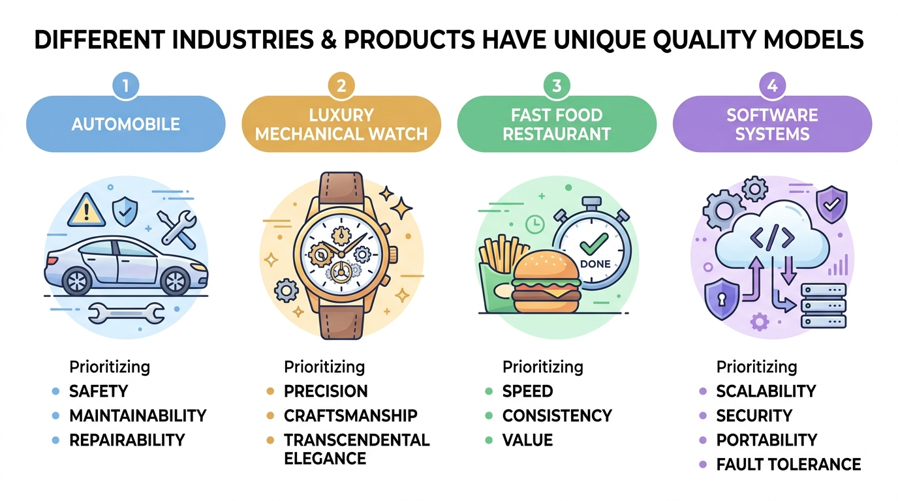
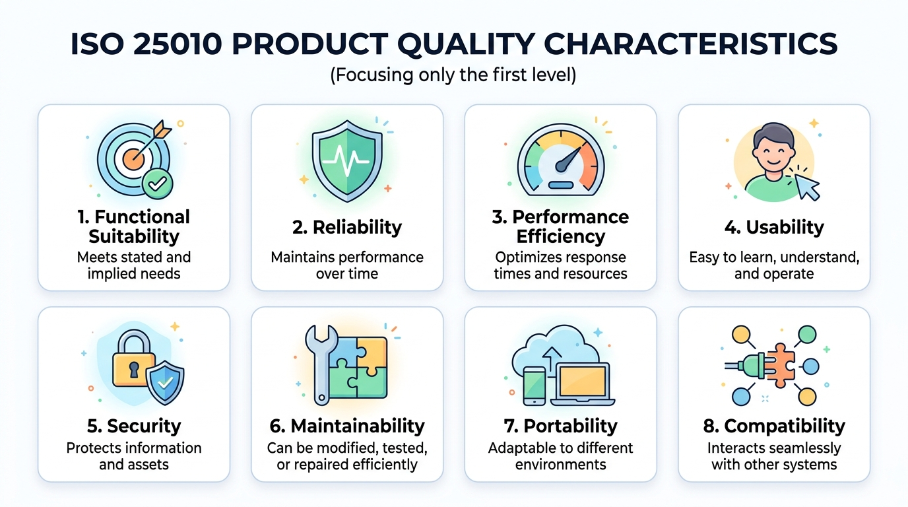

# 軟體品質與測試

### 第 1 章：軟體危機、品質模型與 AI 時代的可靠性工程

授課教師：薛念林 教授

> 大家都知道「物質不滅定律」；身為資工系學生，我們更熟悉「Bug 不滅定律」。  
> 在 2026 年，寫出一段程式碼只要問 AI 3 秒鐘；但要證明這段程式碼在生產環境不會搞垮公司，可能要花上 3 個月。

---

<!-- header: '[◄](#1) 本章大綱 (Outline) [►](#4)' -->

## 本章重點導讀 (Key Highlights)

> 🧭 從歷史軟體危機汲取教訓，建立現代品質模型防線；軟體品質保證是一門兼顧規格與實踐的系統工程。

### 🏛️ 危機歷史與品質維度
- **1.1 軟體危機歷史與 AI 輪迴**：歷史慘劇與 NATO 根源
- **1.2 AI 能拯救軟體危機嗎？**：技術債、高錯誤率與典型事件
- **1.3 軟體的本質與維度**：IEEE 4 要素 ＆ Garvin 5 大觀點

### 🛡️ 工程把關與品質模型
- **1.4 品質工程核心概念**：V&V、品質成本 ＆ 測試左移
- **1.5 生命週期把關**：V 模型對稱 ＆ CI/CD 6 大門檻
- **1.6 現代品質模型**：ISO 25010 特性 ＆ 量化指標實戰
- **1.7 課堂思維激盪**：NASA 介面驗證與精度實務題

---

<!-- _class: lead -->
<!-- header: '[◄](#3) 1.1 軟體危機的歷史與輪迴 [►](#14)' -->

# **1.1 軟體危機的歷史與 AI 時代的輪迴**

> 軟體既能造福人類，亦能造成毀滅性災難。

---

## 1.1.1 Case 1：愛國者反導彈事件 (1991)

> ⏱️ 微小的數值精度截斷，在長時間運行的累計下，終將演變為無法挽回的致命偏差。

### 🚨 事故背景與災難後果
- **事件背景**：1991 年波斯灣戰爭，伊拉克飛毛腿飛彈擊中美軍達蘭基地，造成 **28 名美軍死亡、100+ 人受傷**。
- **災難後果**：飛彈以 4.2 馬赫高速來襲（1.5 km/s），0.33 秒相當於 **600 公尺距離偏差**，雷達搜尋窗無法鎖定目標，攔截飛彈未發射。

### 🔬 致命缺陷與 SQA 啟示
- **致命軟體缺陷**：
  - 系統時鐘暫存器採用 **24-bit 浮點數**，轉換為 0.1 秒單位時產生截斷誤差（約 0.000000095 秒）。
  - 連續開機運作超過 **100 小時** 未重啟，誤差累計達 **0.33 秒**。
- **SQA 核心啟示**：嚴防數值精度與浮點數累計誤差，落實**長時運行可靠度測試 (Long-term Stress Testing)**。

---

## 1.1.2 Case 2：NASA 火星氣候軌道探測器 (1998)

> 🚀 跨團隊協同缺乏強制介面契約，讓造價近兩億美元的太空探測器在火星大氣中化為灰燼。

### 🚨 事故背景與災難後果
- **事件背景**：1998 年 NASA 發射「火星氣候軌道探測器」（造價近 2 億美元），抵達火星後失聯焚毀。
- **災難後果**：軌道高度預計 140 公里，實際暴跌至 **57 公里**，直接在火星大氣層中劇烈摩擦燃燒解體。

### 🔬 致命缺陷與 SQA 啟示
- **致命缺陷：跨模組單位不一致**：
  - **承包商端（洛克希德馬丁）**：地面控制程式以 **英制單位（磅力·秒，lbf·s）** 輸出數據。
  - **NASA JPL 導航接收端**：太空船導航軟體預設以 **公制單位（牛頓·秒，N·s）** 解析（相差 4.45 倍）。
- **SQA 核心啟示**：落實**跨模組介面契約 (Interface Contract)**、強型態檢驗與規格審查。

---

<!-- _class: title-image-slide -->

## Case 2 架構圖解：跨模組介面契約斷裂

  

---

## 1.1.3 Case 3：華航名古屋空難 (1994)

> ✈️ 人機互動 (HMI) 的狀態不透明與控制權仲裁衝突，在系統最危急的時刻給予致命一擊。

### 🚨 事故背景與致命後果
- **事件背景**：1994 年華航 CI140 班機在名古屋機場降落時墜毀，**264 人罹難**。
- **致命後果**：
  - 駕駛員未察覺電腦仍在執行重飛，人機相互抵消。
  - 最終水平安定面達到極限仰角，飛機在低空**氣動失速 (Aerodynamic Stall)** 墜毀。

### 🔬 人機介面衝突與 SQA 啟示
- **人機介面衝突 (Mode Confusion)**：
  - **機師手動操作 (Manual Push)**：副駕駛誤觸重飛後，正副駕駛試圖手動前推操縱桿強壓機首下降。
  - **飛控電腦自動配平 (Autopilot Climb)**：電腦處於重飛狀態，強行將水平安定面向上配平抬高機首。
- **SQA 核心啟示**：人機互動（HMI/UX）狀態透明度、異常操作回饋與自動化控制權限仲裁設計。

---

<!-- _class: title-image-slide -->

## Case 3 架構圖解：人機介面衝突與控制權仲裁

  

---

## 1.1.4 Case 4：迪士尼《獅子王》遊戲 (1994)

> 🎮 在開發機上跑得順暢，不代表能在真實世界生存——硬體多樣性與相容性測試是第一道門檻。

### 🚨 事故背景與災難後果
- **事件背景**：1994 年聖誕節迪士尼推出《獅子王》PC 遊戲，數以萬計家庭滿心期待安裝同樂。
- **災難後果**：大量家用電腦開機即藍屏當機，客服專線被憤怒家長打爆，嚴重重創迪士尼品牌聲譽。

### 🔬 致命缺陷與 SQA 啟示
- **致命缺陷：缺乏相容性測試**：
  - 遊戲基於特定視訊驅動（WinG）開發，**未在市場主流多樣硬體環境上進行充分相容性測試**。
- **SQA 核心啟示**：
  - 環境多樣性驗證與**相容性測試 (Compatibility Testing)** 的關鍵價值。
  - 該事件促使微軟後來加速研發並確立標準化 DirectX 遊戲架構。

---

### 1.1.5 軟體危機的定義與成因

> ⚠️ 1968 年 NATO 會議首次提出「軟體危機」：硬體日新月異，軟體開發的複雜度與維護成本卻失控失衡。

### 📈 規模與研發效率失控
- **軟體規模呈指數級膨脹**：硬體效能爆發帶動軟體膨脹，超出傳統手工管理極限。
- **開發進度與成本難以預測**：「人月神話」溝通成本攀升，頻繁延宕超支。

### ⚠️ 品質低下與維護泥淖
- **錯誤率高且缺乏系統化驗證**：缺乏自動化測試與工程化品質把關手段。
- **架構腐化引發維護惡夢**：缺乏文件與規範，維護成本吞噬所有研發預算。

---

<!-- id: sqa-ch01-ccq1 -->
## 🙋 概念核對問答 (CCQ 1)

  

**問題**：愛國者反導彈系統（1991）在達蘭基地攔截失效的根本軟體原因為何？

- **A.** 通訊網路中斷導致雷達無法傳送指令給飛彈發射架
- **B.** 24-bit 時鐘暫存器的浮點捨入誤差在連續運行 100 小時後累加達 0.33 秒
- **C.** 程式碼發生記憶體洩漏（Memory Leak）導致作業系統當機
- **D.** 雷達演算法誤將美軍戰機辨識為敵方飛毛腿飛彈

  

  

    
     <a href="https://nlhsueh.github.io/nickedupocket/#/student/sqa-ch01-ccq1">[課堂互動]</a>
  

---

<!-- id: sqa-ch01-pair1 -->
## 🙋 雙人課堂討論 (Pair Discussion)

  

**主題：真實世界的軟體失敗案例與省思**

- **討論任務**：與鄰近同學組成雙人組，分享一件曾遇過、聽過或搜尋到的真實軟體事故（如 2024 CrowdStrike 藍屏、Knight Capital 交易虧損、搶票/遊戲當機等）。
- **討論重點**：
  1. **影響**：造成了什麼異常？帶來哪些具體損失？
  2. **原因**：為什麼會有這個錯誤？（邏輯缺陷、並行競爭、捨入誤差、流程缺失？）
  3. **防範**：SQA 與測試流程中該如何避免？

  

  

    
     <a href="https://nlhsueh.github.io/nickedupocket/#/student/sqa-ch01-pair1">[課堂互動]</a>
  

---

<!-- _class: lead -->
<!-- header: '[◄](#4) 1.2 AI 能拯救軟體危機嗎？ [►](#20)' -->

# **1.2 AI 能拯救軟體危機嗎？**

> 在 2026 年，寫出一段程式碼只要問 AI 3 秒鐘；  
> 但要證明這段程式碼不會搞垮公司，可能要花上 3 個月。

---

## 1.2 AI 輔助開發的實證研究數據

> 📊 AI 大幅提升了撰寫程式碼的速度，卻也成倍放大了技術債務、高錯誤率與安全弱點的隱藏代價。

### 📉 維護性劣化 (GitClear 1.5 億行研究)
- **程式碼重複率 (Code Duplication)** 呈指數級上升。
- 重構指標 **「移動行數 (Moved Lines)」大幅下降**，工程師更少主動重構。
- **程式碼流失率 (Code Churn)** 顯著增高，帶來沈重的**長期維護性技術債務**。

### ⚠️ 高錯誤率與資安弱點 (Purdue & NYU)
- **52% 高錯誤率與虛假安全感 (Purdue)**：
  - ChatGPT 解答問題時 **52% 包含錯誤程式碼**；因語氣自信條理分明，**39.3% 的使用者依然盲目採信**。
- **40% 安全弱點隱患 (NYU 等學術研究)**：
  - 無安全提示引導下，生成程式碼中 **約 40% 包含 CWE 安全漏洞**（如緩衝區溢位、SQL 注入）。

---

### 1.2.1 AI 寫程式引發的典型品質事件 (1/2)

> 🤖 盲目信任與複製貼上：當工程師放棄對程式碼的質疑，AI 的幻覺與技術債將直接流入生產環境。

### 💊 幻覺套件供應鏈投毒
- **發生機制 (Slopsquatting)**：
  LLM 憑空捏造看似合理的套件名稱（如 `crypto-validator`）。
- **災難後果**：
  黑客搶先註冊惡意套件，工程師直接 `pip install` 植入企業後門。

### 🛒 亞馬遜電商大斷線
- **發生機制**：
  工程師使用 AI 工具輔助產生變更，未經充分審查即推上生產環境。
- **災難後果**：
  送貨與結帳邏輯錯亂，數小時內蒸發超過 630 萬筆訂單與鉅額營收。

---

### 1.2.1 AI 寫程式引發的典型品質事件 (2/2)

> 🛡️ 軟體供應鏈污染與架構腐化：AI 時代的新型態品質危機，全面考驗著團隊的深度防禦防線。

### ⚡ Vibe Coding 漏洞爆發
- **發生機制**：
  非工程人員憑 Prompt 產出服務，缺乏資安架構與 Code Review。
- **災難後果**：
  抽查 1600+ 上線應用，逾 10% 存在嚴重 SQLi 或越權（BOLA）直進後台漏洞。

### 🔑 敏感金鑰寫死外洩
- **發生機制**：
  AI 範例常把 API Key、資料庫密碼直接寫死在程式碼中。
- **災難後果**：
  推送到公開 GitHub，雲端帳號 1 小時內被爬蟲盜用並產生數萬美元帳單。

---

<!-- _class: title-image-slide -->

## AI 時代的軟體本質：從 Writing 轉移到 Verification

  

---

<!-- id: sqa-ch01-ccq2 -->
## 🙋 概念核對問答 (CCQ 2)

  

**問題**：在評估生成式 AI 對專案品質的影響時，軟體工程度量研究常使用 **「程式碼流失率（Code Churn）」** 作為關鍵指標。關於 Code Churn 的定義及其在 AI 時代所反映的品質現象，下列敘述何者最為精準？

- **A.** 指專案跨語言遷移時因語法不相容遺失的行數比例
- **B.** 指新 Commit 程式碼在極短時間內被刪除或重寫的比例；反映出 AI 程式碼看似快速但本質脆弱、未經深思熟慮
- **C.** 指建置工具自動剔除死碼 (Dead Code) 的效率
- **D.** 指自動化測試案例因版本迭代自然失效的比率

  

  

    
     <a href="https://nlhsueh.github.io/nickedupocket/#/student/sqa-ch01-ccq2">[課堂互動]</a>
  

---

<!-- _class: lead -->
<!-- header: '[◄](#14) 1.3 軟體的本質與品質維度 [►](#32)' -->

# **1.3 軟體的本質與品質維度**

> 軟體四要素 ＆ David Garvin 五大品質觀點

---

## 1.3.1 軟體四大核心要素 (IEEE 610.12)

> **Software (軟體)**:  
> Computer **programs** (程式), **procedures** (程序), and possibly associated **documentation** (文件) and **data** (資料) pertaining to the operation of a computer system.

- 軟體不是只有「能跑的原始程式碼」，而是一個完整的系統化工程有機體。
- 就像一部高速高鐵列車，四大要素各自扮演不可或缺的關鍵角色：
  - **Programs**：引擎動力與神經網路
  - **Procedures**：標準作業流程 SOP 與發布軌道
  - **Documentation**：設計藍圖與通訊法典
  - **Data**：血液、燃料與環境配置

---

<!-- _class: title-image-slide -->

## 軟體四大核心要素架構圖 (IEEE 610.12)

  

---

## 軟體四大核心要素深度剖析 (1/2)

> ⚙️ IEEE 610.12 定義：軟體絕非只是原始碼，而是由程式、程序、文件與資料構成的系統有機體。

### ⚙️ 1. Programs (程式與原始碼)
> **譬喻：高鐵的「引擎動力與神經網路」**
- **內涵**：原始碼、編譯二進位檔、演算法函式庫與微服務 API，負責承載核心業務邏輯。
- **實例**：外送平台中計算「外送員最佳派單路徑」與「動態加價」核心演算法。
- **SQA 啟示**：光有程式碼就像只有引擎卻無軌道與汽油的幽靈車，無法安全交付。

### 🚦 2. Procedures (作業程序與規程)
> **譬喻：高鐵的「標準作業 SOP 與軌道」**
- **內涵**：CI/CD 流水線、灰度/金絲雀發布規程、災難復原演練 (DR) 與 Runbooks。
- **實例**：2024 年 **CrowdStrike 全球大當機**導致 850 萬台電腦藍屏癱瘓。事故根因正是發布程序漏洞——未經分階段逐步驗證一次推送全球。

---

## 軟體四大核心要素深度剖析 (2/2)

> 📋 藍圖決定系統的壽命，組態決定系統的成敗——不可忽視文件契約與環境資料的關鍵力量。

### 📐 3. Documentation (文件與契約)
> **譬喻：高鐵的「設計藍圖與通訊法典」**
- **內涵**：需求規格書 (SRS)、OpenAPI 介面契約、架構設計圖與驗收準則；現代工程中更是自動化測試基石（規格即活文件）。
- **實例**：**NASA 火星探測器**因地面端「英制」與導航端「公制」契約斷裂，直接燒掉兩億美元！

### 🩸 4. Data (資料與環境配置)
> **譬喻：高鐵的「血液、燃料與環境配置」**
- **內涵**：資料庫遷移腳本 (Migration)、設定檔 (`application.yml`)、環境變數與測試測資集。
- **實例**：程式碼完全沒變，但部署時將連線逾時誤設為 `30ms`（原 30s），整座系統上線瞬間雪崩。
- **SQA 啟示**：「組態即程式碼」的驗證同樣是測試核心。

---

## 1.3.2 David Garvin 五大品質觀點

- 哈佛商學院教授 David Garvin 指出，品質是由多重視角交織而成的立體概念：

- **1. 超自然觀點 (Transcendental View)**：
  - 無法量化，但一體驗就能感受其極致優雅與美感（如流暢的 UI/UX 微互動）。
- **2. 使用者觀點 (User View - Fitness for Use)**：
  - 是否切中真實使用者痛點、操作直覺並帶來實質效益（合用性）。
- **3. 製造觀點 (Manufacturing View - Conformance)**：
  - 是否 100% 符合工程規格書、通過靜態檢測與 Quality Gate（符合度）。
- **4. 產品觀點 (Product View - Architecture)**：
  - 產品內在技術特性，如高內聚低耦合、強固型態、可測試性與可維護性。
- **5. 價值觀點 (Value-based View - ROI)**：
  - 軟體商業效益是否顯著高於開發、測試與維運之總成本（投資報酬率）。

---

<!-- _class: title-image-slide -->

## David Garvin 五大品質觀點架構

  

---

## Garvin 五大品質觀點深度實例 (1/2)

> 👁️ 「橫看成嶺側成峰」：品質沒有單一視角，哈佛學者 David Garvin 帶我們看透不同角色的品質渴望。

### ✨ 1. 超自然觀點
> **Transcendental View**
- **正面實例**：
  - **Apple iOS** 手勢滑動物理慣性阻尼、**Notion** 極簡斜線指令 (`/`)，絲滑精緻讓人讚嘆。
- **反面實例**：
  - 介面如同 90 年代老舊表格，按鍵延遲排版擁擠，令人挫折。

### 👤 2. 使用者觀點
> **User View**
- **正面實例**：
  - **Zoom** 擊敗視訊巨頭，因「點連結 3 秒開會」，長輩學童都能無障礙上手。
- **反面實例**：
  - 支援 50 種冷門格式，但使用者只想一鍵播 MP4，淪為陳列品 (Shelfware)。

### 🏭 3. 製造觀點
> **Manufacturing View**
- **正面實例**：
  - **航太飛控**或**銀行核心帳務**，規格定義至小數後 4 位，實作 100% 符合規格零偏差。
- **潛在盲點**：
  - 若需求本身有盲點，只是精準製造出「合規廢品」。

---

## Garvin 五大品質觀點深度實例 (2/2)

> ⚖️ 內部架構的工程美學 vs. 外部商業的投資回報：平衡產品結構與商業價值的雙重藝術。

### 📦 4. 產品觀點 (Product View)
- **正面實例**：
  - **Linux 核心**或 **Spring Framework** 架構設計，模組高內聚低耦合，圈複雜度低，具備 90% 以上測試保護，十餘年依然穩健擴展。
- **反面實例**：
  - **義大利麵程式碼 (Spaghetti Code)**，外表堪用但無分層且複製貼上，改動一個按鈕引發會員登入崩潰。

### 💰 5. 價值觀點 (Value-based View)
- **正面實例**：
  - 新創以 Serverless 與開源元件在兩週內打造出 **MVP（最小可行產品）** 搶佔市場，以最低成本取得最大回饋。
- **反面實例**：
  - 商業模式未驗證前，執意耗資數百萬引進複雜分散式架構與自建機房，產品上線前資金耗盡宣告破產。

---

## Garvin 五大品質觀點對照表

| 品質觀點　　　 | 核心定義　　　　　　　　　　　 | 軟體工程實例　　　　　　　　　　| 忽略該觀點的後果　　　　　　　 |
| :---------------| :-------------------------------| :--------------------------------| :-------------------------------|
| **超自然觀點** | 無法精確量化，體驗感受極致美感 | 流暢 UI/UX、細膩微互動 (iOS)　　| 軟體感覺粗製濫造、冰冷卡頓　　 |
| **使用者觀點** | 符合真實需求 (Fitness for Use) | 解決痛點、操作直覺 (Zoom)　　　 | 功能很強但無人想用 (Shelfware) |
| **製造觀點**　 | 符合規格流程 (Conformance)　　 | 遵循 Clean Code、通過 Gate　　　| 規格有漏洞時做出一套合規廢品　 |
| **產品觀點**　 | 產品內在技術特性與架構　　　　 | 高內聚低耦合、強固型態 (Spring) | 架構腐化，改動引發全面崩潰　　 |
| **價值觀點**　 | 商業價值與性價比 (ROI)　　　　 | 商業產出 > 開發維運成本 (MVP)　 | 開發成本失控超支，商業不可行　 |

---

<!-- id: sqa-ch01-wordcloud1 -->
## 🙋 文字雲互動：品質觀點

  

**互動提問**：

你覺得哪一個觀點是最重要的品質指標？請寫下來。

- 超自然觀點 (Transcendental View)
- 使用者觀點 (User View)
- 製造觀點 (Manufacturing View)
- 產品觀點 (Product View)
- 價值觀點 (Value-based View)

  

  

    
     <a href="https://nlhsueh.github.io/nickedupocket/#/student/sqa-ch01-wordcloud1">[課堂互動]</a>
  

---

<!-- id: sqa-ch01-ccq3 -->
## 🙋 概念核對問答 (CCQ 3)

  

**問題**：某專案團隊開發的電商 App 完全符合合約規格書上的每一條需求（製造觀點合格），但因為底層架構高度耦合且完全沒有寫單元測試，半年後客戶想新增一個促銷功能時，工程團隊發現必須重寫整個系統。這代表該軟體在 Garvin 的哪一個品質觀點上嚴重不及格？

- **A.** 產品觀點 (Product View)
- **B.** 製造觀點 (Manufacturing View)
- **C.** 法律合約觀點 (Legal Contract View)
- **D.** 超自然觀點 (Transcendental View)

  

  

    
     <a href="https://nlhsueh.github.io/nickedupocket/#/student/sqa-ch01-ccq3">[課堂互動]</a>
  

---

<!-- _class: lead -->
<!-- header: '[◄](#20) 1.4 V&V、品質成本與測試左移 [►](#37)' -->

# **1.4 軟體品質工程核心概念**

> V&V 驗證與確認、品質成本 (CoQ) 與測試左移

---

### 1.4.1 驗證與確認 (Verification vs. Validation)

> 🔍 軟體品質工程的兩大靈魂叩問：我們是在「正確地打造產品」，還是「打造正確的產品」？

### 🔍 Verification (驗證)
**"Are we building the product right?"**
*(我們是否有正確地建造軟體？)*

- **核心關注**：產出物是否符合設定的規格與設計。
- **把關手段**：靜態檢查、Code Review、單元與整合測試。
- **目標**：無規格違背、無語法與邏輯漏洞。

### 🎯 Validation (確認)
**"Are we building the right product?"**
*(我們建造的是否是正確的軟體？)*

- **核心關注**：軟體是否真正滿足使用者的真實業務需求。
- **把關手段**：使用者驗收測試 (UAT)、易用性測試、現場試用。
- **目標**：解決真正痛點、符合真實臨床與業務情境。

---

<!-- id: sqa-ch01-ccq4 -->
## 🙋 概念核對問答 (CCQ 4)

  

**問題**：某軟體團隊為醫院開發急診分流系統，嚴格按照規格書完成實作，單元測試與 Code Review 皆 100% 通過無 Bug。但實際上線在急診室臨床試用時，醫護人員發現分流操作流程完全不符合急救現場真實節奏，無法在實務中使用。根據定義，此系統在下列哪一項做得很好，但在哪一項嚴重失敗？

- **A.** Verification 做得很好，但 Validation 嚴重失敗
- **B.** Validation 做得很好，但 Verification 嚴重失敗
- **C.** Verification 與 Validation 兩者皆成功
- **D.** Verification 與 Validation 兩者皆失敗

  

  

    
     <a href="https://nlhsueh.github.io/nickedupocket/#/student/sqa-ch01-ccq4">[課堂互動]</a>
  

---

## 1.4.2 軟體品質成本 (Cost of Quality, CoQ)

> 💰 「現在花 1 元預防，還是上線後花 1000 元救火？」——品質從來不是成本，欠缺品質才是最大代價。

### 🛡️ 一致性成本 (Conformance)
> **主動投資品質 —— 防患於未然**
- **預防成本 (Prevention)**：架構審查、契約設計 (DbC)、工程培訓與靜態規範。
- **評估成本 (Appraisal)**：單元測試、靜態程式碼分析 (SonarQube) 與 Code Review。

### 💥 非一致性成本 (Non-Conformance)
> **忽視品質的代價 —— 慘痛被動返工**
- **內部失敗成本 (Internal Failure)**：上線前發現 Bug 的除錯 (Debugging)、重構與重測。
- **外部失敗成本 (External Failure)**：生產環境崩潰、客戶求償、緊急 Hotfix 與商譽損失。

💡 **1:10:100 定律 (The Rule of Tens)**：需求階段修復缺陷代價 **$1** ➔ 開發測試階段暴增至 **$10** ➔ 上線後災難損失高達 **$100 ～ $1000+**！

---

<!-- _class: title-image-slide -->

## 品質成本 (CoQ) 架構與 1:10:100 定律

  

---

<!-- _class: lead -->
<!-- header: '[◄](#32) 1.5 生命週期品質把關與 CI/CD [►](#43)' -->

# **1.5 軟體生命週期中的品質把關**

> V 模型對稱性與 DevOps CI/CD 連續品質門檻

---

## 1.5.1 傳統模型與 V 模型：對稱性與早期規劃

> 📐 「品質是建構出來的，不是測出來的。」—— 開發與測試在需求萌芽的那一刻就該彼此嚴密對稱。

### 📐 開發階段與測試層級之對稱性
- **需求分析 (Requirements)** ➔ 平行規劃 **驗收測試 (Acceptance Testing)**
- **系統架構 (Architecture)** ➔ 平行規劃 **系統測試 (System Testing)**
- **元件設計 (Component Design)** ➔ 平行規劃 **整合測試 (Integration Testing)**
- **編寫程式碼 (Coding)** ➔ 實作並執行 **單元測試 (Unit Testing)**

### 💡 V 模型的核心工程價值
- **品質是建構出來的，不是測出來的**：
  - *Quality is built-in, not tested-in.*
- **測試左移 (Shift-Left Testing)**：
  - 在寫下第一行業務程式碼前，各層級測試規格就已隨同需求架構確立完成，杜絕後期大型返工。

---

<!-- _class: title-image-slide -->

## V 模型 (V-Model) 開發與測試對稱圖

  

---

## 1.5.2 DevOps CI/CD 連續品質門檻 (Quality Gates)

> 🚪 從每一次本地 Commit 到全球金絲雀發布：以自動化流水線建立步步為營的連續守護關卡。

### 🔨 開發與建構階段門檻 (Gates 1~3)
- **1. Commit 門檻**：本地 Git Pre-commit Hook 格式化與快速靜態語法檢查。
- **2. SAST 門檻**：SonarQube / SpotBugs 掃描程式碼異味與安全弱點。
- **3. Unit Tests 門檻**：JUnit 5 單元測試，JaCoCo 驗證程式碼涵蓋率 (> 80%)。

### 🚀 部署與上線階段門檻 (Gates 4~6)
- **4. Integration Tests 門檻**：Testcontainers 拉起真實 Docker 驗證 DB 與 API。
- **5. E2E & Security 門檻**：Playwright 自動化流程 + OWASP ZAP 動態掃描。
- **6. Production 門檻**：金絲雀部署 + 可觀測性監控 P99 延遲告警。

---

<!-- _class: title-image-slide -->

## DevOps CI/CD 6 大連續品質門檻架構圖

  

---

<!-- id: sqa-ch01-ordering1 -->
## 🙋 排序互動：V 模型活動生命週期排序

  

**問題**：請將下列 8 項軟體工程活動，依照**「實際執行生命週期順序（從最初需求分析到最終驗收）」**由先至後排列出正確順序：

1. 需求分析與規格定義 (Requirements Analysis)
2. 系統架構設計 (System Architecture Design)
3. 元件/模組詳細設計 (Component Design)
4. 程式碼編寫與實作 (Coding)
5. 單元測試執行 (Unit Testing)
6. 整合測試執行 (Integration Testing)
7. 系統測試執行 (System Testing)
8. 驗收測試執行 (Acceptance Testing)

  

  

    
     <a href="https://nlhsueh.github.io/nickedupocket/#/student/sqa-ch01-ordering1">[課堂互動]</a>
  

---

<!-- _class: lead -->
<!-- header: '[◄](#37) 1.6 現代軟體品質模型 ISO 25010 [►](#54)' -->

# **1.6 現代軟體品質模型 (ISO 25010)**

> ISO 25010 八大產品品質特性與情境連環戰

---

<!-- _class: title-image-slide -->

## 不同產業與產品具備截然不同的品質模型

  

---

<!-- _class: title-image-slide -->

## ISO 25010 八大產品品質特性架構 (SQuaRE)

  

---

## 1.6.1 ISO 25010 八大特性解析 (1/2)

> 🏛️ 國際軟體工程品質標準 SQuaRE：系統化拆解現代軟體系統必備的八大關鍵品質基因。

### ⚙️ 內部與外部功能表現
- **1. 功能適合性 (Functional Suitability)**：
  - **完備性 (Completeness)**：功能涵蓋所有特定任務。
  - **正確性 (Correctness)**：提供正確精準的結果。
  - **適切性 (Appropriateness)**：促進特定任務的達成。
- **2. 可靠性 (Reliability)**：
  - **成熟度**、**容錯度 (Fault Tolerance)**、**可回復性**。

### ⚡ 運行體驗與效能
- **3. 效能效率 (Performance Efficiency)**：
  - **時間行為 (Time Behavior)**：P99 響應時間與吞吐量。
  - **資源利用率**：CPU/記憶體/網路頻寬佔用。
  - **容量 (Capacity)**：最大並發使用者承載量。
- **4. 易用性 (Usability)**：
  - 易識別性、易學習性、易操作性、**錯誤防護**。

---

## 1.6.1 ISO 25010 八大特性解析 (2/2)

> 🌐 從機密防禦到跨平台容器化：軟體在動態複雜環境中長治久安與演進不可或缺的維度。

### 🛡️ 安全防禦與架構維護
- **5. 安全性 (Security)**：
  - **機密性 (Confidentiality)**：未授權者無法窺探。
  - **完整性 (Integrity)**：防止未授權竄改。
  - **抗抵賴性 (Non-repudiation)**：行為具備稽核日誌。
- **6. 可維護性 (Maintainability)**：
  - **模組化 (Modularity)**、**可分析性**、**可修改性**、**可測試性 (Testability)**。

### 🌐 環境適應與外部整合
- **7. 可移植性 (Portability)**：
  - **適應性 (Adaptability)**：跨環境能力。
  - **易安裝性**：部署自動化程度。
  - **易置換性**：Docker 容器環境一致性。
- **8. 相容性 (Compatibility)**：
  - **共存性**：多套軟體共用資源不衝突。
  - **互通性 (Interoperability)**：API 協定契約。

---

## 1.6.2 ISO 25023 品質特性量化指標 (1/2)

> 「如果無法度量它，就無法改善它。」—— Tom DeMarco

### ⚙️ 功能與可靠性度量
- **1. 功能適合性 (Functional Suitability)**：
  - **需求覆蓋率** ($= 100\%$)
  - **驗收測試通過率** ($\ge 99.5\%$)
  - **重大缺陷數 (Critical Bugs)** ($= 0$)
- **2. 可靠性 (Reliability)**：
  - **可用度 SLA** (如 99.99% 四個九)
  - **MTTR (平均修復時間)** ($< 15$ 分鐘)
  - **MTBF (平均故障間隔)**

### ⚡ 效能與易用性度量
- **3. 效能效率 (Performance Efficiency)**：
  - **時間延遲** (API P99 $< 200\text{ms}$)
  - **吞吐量** (TPS / QPS)
  - **尖峰 CPU 使用率** ($< 70\%$)
- **4. 易用性 (Usability)**：
  - **任務完成率** ($\ge 90\%$)
  - **SUS 易用性評分** ($\ge 68$ 分良好標準)
  - **無障礙規範** (WCAG 2.1 AA 遵循率)

---

## 1.6.2 ISO 25023 品質特性量化指標 (2/2)

> 📏 告別抽象形容詞，以工程指標衡量系統體質：將安全、維護與相容性精確轉化為 SLI/SLA。

### 🛡️ 安全性與可維護性度量
- **5. 安全性 (Security)**：
  - **CVE 重大漏洞數** ($= 0$)
  - **靜態傳輸加密率** ($100\%$ TLS 1.3 / AES-256)
  - **安全弱點修補天數 (MTTP)**
- **6. 可維護性 (Maintainability)**：
  - **圈複雜度 (Cyclomatic Complexity)** ($\le 10$)
  - **程式碼涵蓋率** ($\ge 80\%$)
  - **重複程式碼比率** ($< 3\%$)

### 🌐 可移植性與相容性度量
- **7. 可移植性 (Portability)**：
  - **自動化部署成功率** ($\ge 99\%$)
  - **容器冷啟動時間** ($< 5\text{s}$)
  - **環境遷移工時比**
- **8. 相容性 (Compatibility)**：
  - **主流瀏覽器相容率** ($100\%$)
  - **API 契約測試通過率** ($100\%$)
  - **資源衝突發生次數** ($= 0$)

---

## 1.6.2 現代 SQA 量化落地的「三大工程支柱」

> 🏛️ 「靜態程式碼把關 ＋ 動態效能壓測 ＋ 運行時可觀測性」：三大工程支柱串聯起端到端的品質防護網。

### 1. 靜態程式碼門檻
> **Static Quality Gate**
- **工具實踐**：SonarQube / PMD
- **把關重點**：
  - 阻擋高圈複雜度
  - 阻擋重複程式碼
  - 防堵 OWASP 安全漏洞

### 2. 動態效能門檻
> **Performance Gate**
- **工具實踐**：JMeter / k6
- **把關重點**：
  - 驗證 API P99 延遲
  - 驗證高並發負載容量
  - 防止效能衰退

### 3. 運行時可觀測性
> **Observability**
- **工具實踐**：Prometheus / Grafana
- **把關重點**：
  - 即時可用度 (99.99%)
  - 實時錯誤率與飽和度
  - 縮短故障平均修復 (MTTR)

💡 **量化核心心法**：抽象的 ISO 特性 ➔ 具體的數值指標 (SLI/SLA) ➔ CI/CD 工具鏈自動強制把關。

---

## 🎮 課堂挑戰：ISO 25010 八大特性連環戰 (情境 1~5)

- **八大選項池**：
  - `A. 功能適合性` ｜ `B. 可靠性` ｜ `C. 效能效率` ｜ `D. 易用性`
  - `E. 安全性` ｜ `F. 可維護性` ｜ `G. 可移植性` ｜ `H. 相容性`

- **第 1 題【吐鈔卡死危機】**：ATM 提款扣款成功並印明細，但吐鈔口卡死分文未出。
- **第 2 題【雙十一流量海嘯】**：午夜 50 萬人搶購，CPU 飆到 100%，API 延遲暴增至 40 秒。
- **第 3 題【致命的相鄰按鈕】**：「重啟伺服器」與「永久銷毀主機」按鈕相鄰且顏色相同無二次防呆。
- **第 4 題【牽一髮動全身的義大利麵】**：新增會員「暱稱」欄位引發 8 個模組連鎖編譯錯誤。
- **第 5 題【斷電重啟秒級自癒】**：DB 突發斷電，備援機制 3 秒內自動 Failover 重放 WAL 零遺失。

---

## 🎮 課堂挑戰：ISO 25010 八大特性連環戰 (情境 6~10)

- **八大選項池**：
  - `A. 功能適合性` ｜ `B. 可靠性` ｜ `C. 效能效率` ｜ `D. 易用性`
  - `E. 安全性` ｜ `F. 可維護性` ｜ `G. 可移植性` ｜ `H. 相容性`

- **第 6 題【跨系統托運單格式打架】**：電商與物流 API 日期協定不符（`YYYY-MM-DD` vs `DD/MM/YYYY`）導致批次失敗。
- **第 7 題【URL 改個數字看光他人隱私】**：將 URL `userId=1001` 改為 `1002`，直接秀出他人信用卡號。
- **第 8 題【Mac 開發很順，推上 Linux 容器全掛】**：macOS 測試正常，上 Linux 因大小寫嚴格區分找不到檔案。
- **第 9 題【地下室離線暫存與自動重送】**：外送員進地下室 App 自動離線快取，回地面 5G 自動重送。
- **第 10 題【容器映像檔一鍵秒級部署】**：Docker 映像檔在 AWS、GCP 或 K8s 皆能在 10 秒內一鍵拉起。

---

<!-- id: sqa-ch01-game -->
## 🙋 課堂挑戰遊戲：ISO 25010 情境連連看

  

**遊戲任務**：

請透過手機或筆電進入線上互動介面，針對 10 個日常軟體工程事件進行 ISO 25010 八大特性配對！

- 考驗你的架構直覺與品質標準掌握度！
- 每題均對應真實開發與維運的慘痛教訓或高可用實踐。

  

  

    
     <a href="https://nlhsueh.github.io/nickedupocket/#/student/sqa-ch01-game">[課堂互動]</a>
  

---

<!-- _class: lead -->
<!-- header: '[◄](#43) 1.7 綜合練習與思維激盪 [►](#56)' -->

# **1.7 綜合練習與思維激盪**

> 課堂思考與實務討論

---

## 1.7 課堂思維激盪與問題討論

> 🤔 學而不思則罔：跳出日常開發框架，以批判性思維深入剖析 AI 時代的軟體品質盲點。

### 🤖 1. AI 時代的品質反思
- 當生成式 AI 可在幾秒內產生程式碼時，為什麼軟體測試工程師的價值反而大幅提升？
- 請從「**Test Oracle 問題**」與「**自我印證偏誤**」兩方面進行深入思考與分組探討。

### 🎯 2. ISO 特性分析 & 3. 精度實證
- **ISO 25010 維度分析**：
  - 「微服務在 DB 當機重啟後，5 秒內自動重連重試，零遺失交易。」這體現了哪些品質特性？（容錯度、可回復性、完整性）。
- **數值精度實證**：
  - 連續將 `0.1` 累加 1,000,000 次，比較其結果與 `100000.0` 的差異，觀察浮點數偏差。

---

<!-- _class: lead -->
<!-- header: '[◄](#54) 附錄：課堂互動參考解答 [►](#1)' -->

# **附錄：課堂互動參考解答**

> 各題答案與關鍵解析

---

## 課堂互動參考解答 (1/2)

- **CCQ 1（愛國者反導彈事件）**：
  - **正確答案：B**
  - 愛國者系統採用 24-bit 浮點數記錄時間，連開 100 小時累積 0.33 秒誤差，對 4.2 馬赫飛彈造成約 600 公尺偏差，無法鎖定。
- **CCQ 2（程式碼流失率 Code Churn）**：
  - **正確答案：B**
  - 衡量新 Commit 程式碼在短時間（2 週）內被刪除或修改的比例；反映 AI 程式碼看似快速但脆弱，帶來長期維護債。
- **CCQ 3（Garvin 品質觀點）**：
  - **正確答案：A**
  - 產品觀點著重於內在架構（高內聚低耦合、可維護性）。雖符合合約規格（製造觀點），但架構腐敗。
- **CCQ 4（Verification vs. Validation）**：
  - **正確答案：A**
  - 系統符合規格且通過測試（Verification 成功），但無法滿足急診臨床真實節奏需求（Validation 失敗）。

---

## 課堂互動參考解答 (2/2)

- **排序題（V 模型生命週期順序）**：
  - **正確順序**：`1 ➔ 2 ➔ 3 ➔ 4 ➔ 5 ➔ 6 ➔ 7 ➔ 8`
  - 需求分析 ➔ 系統架構 ➔ 元件設計 ➔ 編寫程式碼 ➔ 單元測試 ➔ 整合測試 ➔ 系統測試 ➔ 驗收測試。
- **ISO 25010 情境連連看（10 題連環戰）**：
  - **1. ATM 吐鈔卡死** ➔ **A. 功能適合性**（功能正確性與完備性）
  - **2. 雙十一延遲 40 秒** ➔ **C. 效能效率**（時間行為與容量）
  - **3. 相鄰毀滅按鈕無防呆** ➔ **D. 易用性**（使用者錯誤防護）
  - **4. 改欄位 8 模組連鎖破裂** ➔ **F. 可維護性**（模組化與可修改性）
  - **5. 斷電 3 秒自癒零遺失** ➔ **B. 可靠性**（容錯度與可回復性）
  - **6. 物流 API 日期格式打架** ➔ **H. 相容性**（互通性 Interoperability）
  - **7. URL 改 ID 偷窺信用卡** ➔ **E. 安全性**（機密性與授權能力）
  - **8. Linux 容器大小寫崩潰** ➔ **G. 可移植性**（適應性 Adaptability）
  - **9. 地下室離線暫存自動重送** ➔ **B. 可靠性**（成熟度與容錯度）
  - **10. Docker 映像檔秒級部署** ➔ **G. 可移植性**（易安裝性與易置換性）

