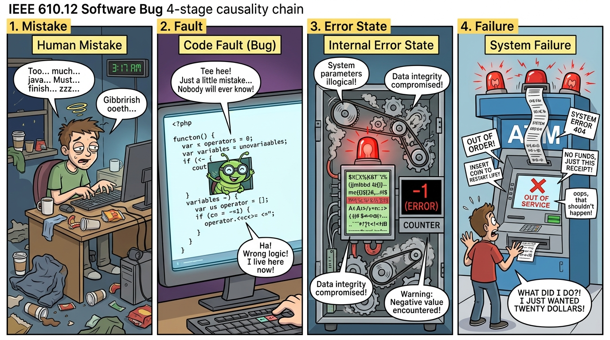
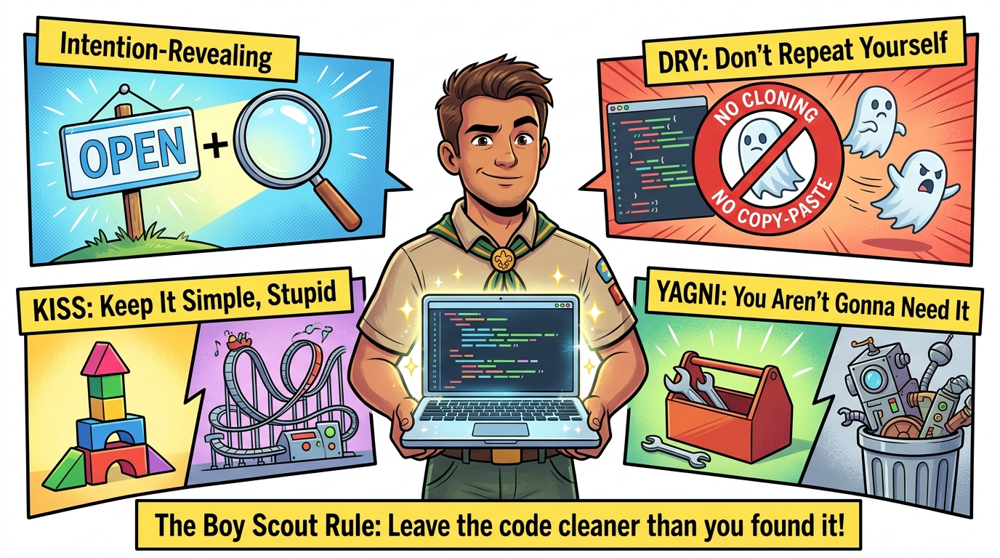
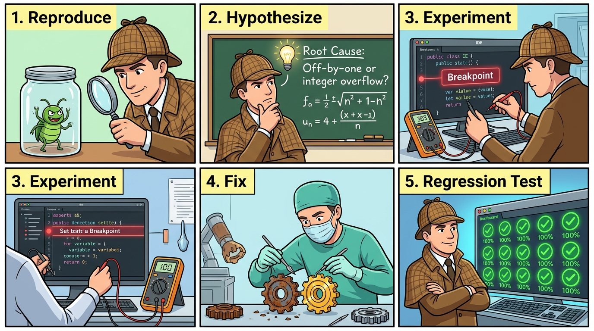
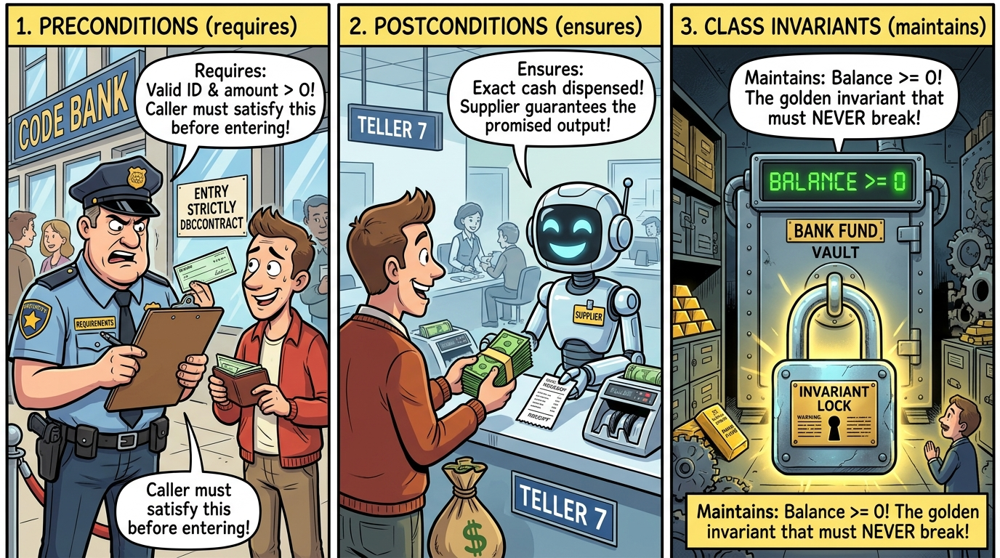
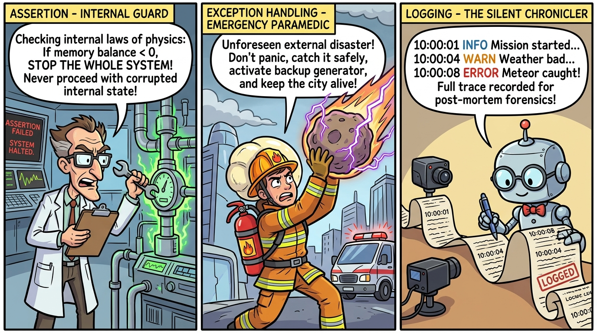
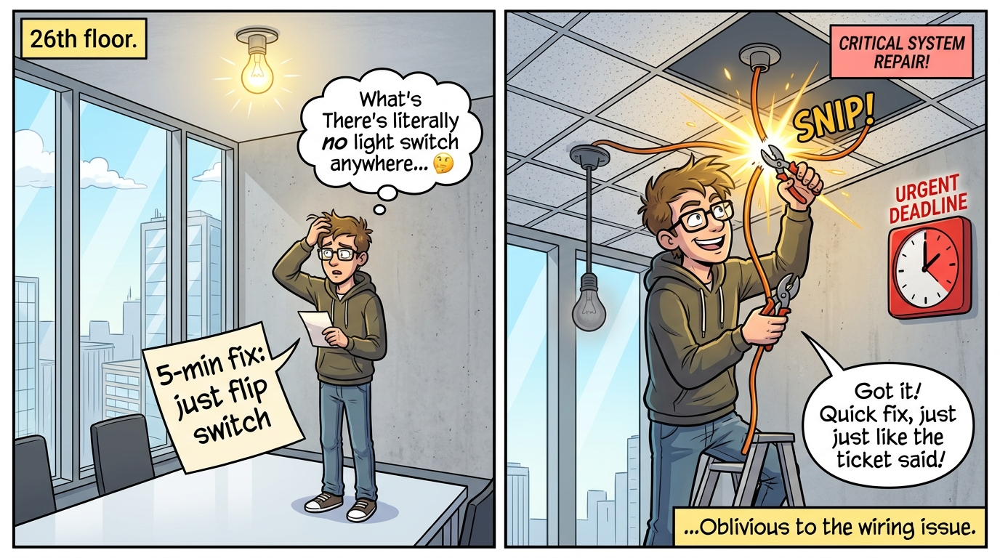
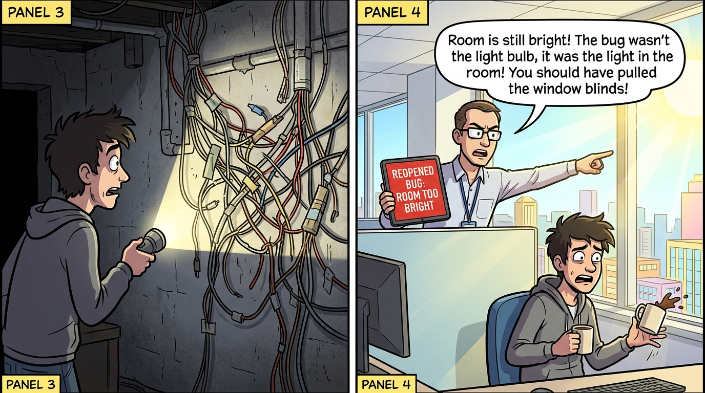
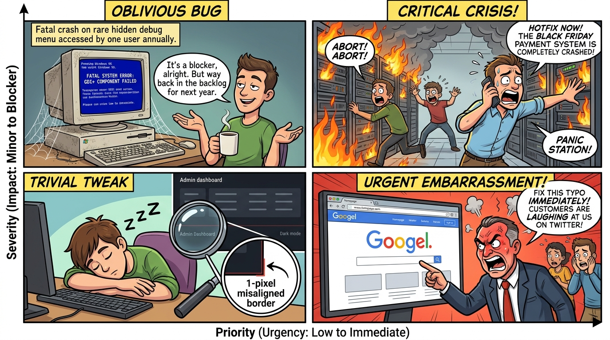

# 軟體品質與測試

### 第 2 章：錯與除錯 (Bugs, Clean Code, and Debugging)

授課教師：薛念林 教授

> 一夥程式設計師向皇上奏報：「比起去年，我們今年多修正了 50% 的 Bug。」😊  
> 皇上大怒：「你們犯了品質管制不良之罪，明年起不得再有任何 Bug！」😤  
> 當然啦，明年程式設計師再度奏報時，就完全不提 Bug 的事了 🤷  
> —— 取自溫伯格《軟體管理學》

---

## 本章重點導讀 (Key Highlights)

* **2.1 臭蟲與錯誤 (Bugs & Faults)**：IEEE 610.12 四階段因果鏈、規格缺陷、常見編碼錯誤分類。
* **2.2 整潔程式碼 (Clean Code)**：Uncle Bob 與大師心法、具體實務規範、迷思「Clean Code ≠ Bug-Free Code」。
* **2.3 除錯思維與方法 (Debugging)**：科學除錯五步驟、命題邏輯推演、AI 時代人機協同除錯黃金 SOP。
* **2.4 除錯工具實務 (Debuggers)**：條件斷點、例外斷點、即時表達式求值 (Evaluate Expression)。
* **2.5 防禦性編程、契約與日誌 (DbC & Logging)**：Meyer 契約三大法則、斷言 vs. 例外、SLF4J 日誌防線。
* **2.6 缺陷管理與議題追蹤 (BTS)**：大樓的燈寓言、生命週期狀態機、嚴重度 vs. 優先級 2x2 決策矩陣。
* **2.7 綜合練習與實戰思維**：因果辨析、邏輯推理排查、MaxHeap 實作除錯與 Invariants 斷言。

---

<!-- _class: lead -->
<!-- header: '2.1 臭蟲與錯誤' -->

# **2.1 臭蟲與錯誤 (Bugs & Faults)**

> 「歷史上第一隻被實體記錄的電腦臭蟲，源於 1947 年貼在日記本上的一隻飛蛾。」

---

## 2.1.1 臭蟲的由來與 IEEE 610.12 定義

* **歷史淵源**：
  * 1947 年 9 月 9 日，**Grace Murray Hopper** 在 Harvard Mark II 繼電器中找到一隻飛蛾（Bug）。
  * 飛蛾被貼在工作筆記本上：「*First actual case of bug being found*」，從此確立了 Bug 在電腦界的地位。
* **IEEE 610.12 臭蟲四階段嚴密因果鏈**：
  * **1. Human Mistake / Error (人類犯錯)**：工程師心智失誤、誤解需求或打錯程式碼。
  * **2. Code Fault / Defect / Bug (程式碼缺陷)**：錯誤具體體現在產出物中（邏輯寫錯、邊界少等號）。
  * **3. Internal Error State (內部錯誤狀態)**：執行時記憶體或系統狀態出現不一致（計數器變負數）。
  * **4. System Failure (系統對外失效)**：系統對外可觀察行為偏離規格（拋出 500 Crash、ATM 吐錯金額）。

---

<!-- _class: full-image-slide -->

<div class="centered-image">
  
</div>

---

## 因果鏈關鍵定理與防錯原則

* 📌 **關鍵定理一**：
  * **系統中有 Fault（缺陷），不一定會馬上導致 Failure（失效）**。
  * 若該行程式碼從未被執行（死碼 / 罕見分支），或內部錯誤狀態剛好被後續計算掩蓋，系統外觀看似正常，但這屬於**潛伏缺陷 (Latent Fault)**。
* 📌 **關鍵定理二**：
  * **只要觀察到 Failure（失效），系統中必然存在 Fault（缺陷）或環境異常！**
* 💡 **SQA 品質工程啟示**：
  * 測試與品質保證不能只停留在觀察「系統有沒有 Crash」，更要透過**單元測試、斷言 (Assertions) 與程式碼檢視**，主動把潛伏的 Fault 逼出原形。

---

<!-- id: sqa-ch02-ccq1 -->
## 🙋 概念核對問答 (CCQ 1)

<div class="ccq-columns">
  <div class="ccq-text">

**問題**：工程師在撰寫銀行轉帳演算法時，誤將手續費計算公式的減號寫成加號，並部署至伺服器。當天日常營運中，所有客戶轉帳金額均未達扣除手續費門檻，無任何客戶發現異常。依據 IEEE 軟體工程定義，此時系統狀態為何？

* **A.** 系統已發生失效 (Failure)
* **B.** 程式碼中存在缺陷 (Fault/Defect)，但尚未表現為系統失效 (Failure)
* **C.** 工程師並未犯錯 (Mistake)，因為系統正常運作
* **D.** 該程式碼完全符合軟體品質的正確性定義

  </div>
  <div class="ccq-logo">
    <a href="https://nlhsueh.github.io/nickedupocket/#/student/sqa-ch02-ccq1"></a>
    <br><a href="https://nlhsueh.github.io/nickedupocket/#/student/sqa-ch02-ccq1">[課堂互動]</a>
  </div>
</div>

---

## 2.1.2 規格導致的缺陷 (Specification Bugs)

* **「我前方沒有規格，錯誤在我身後形成。」**
* 並非所有錯誤都是因為「寫錯程式碼」，很多時候是**規格本身有問題（Ambiguous or Missing Spec）**：
  * 計算機 `5 / 2 = 2`（整數除法 vs 浮點除法？）
  * `1/3 * 3 = 0.999999`（浮點數精度限制）
  * 輸入 `88888888 * 88888888` 發生整數溢位顯示負數
  * 輸入 `1 / 0` 產生未攔截的 Crash
* **除法器規格的演進對比**：
  * *規格一（陽春）*：使用者輸入被除數與除數，顯示小數點後兩位結果。
  * *規格二（模糊）*：使用者不得輸入除數為 0。（*缺點：未規範輸入 0 時如何處置*）
  * *規格三（優良契約）*：除數若為 0，系統應清除結果並回傳 HTTP 400 與友善錯誤訊息「除數不得為零」。

---

<!-- _class: full-image-slide -->

<div class="centered-image">
  
</div>

---

## 規格缺陷與防禦性工程素養

* **Latent Fault (潛伏缺陷)**：
  * 程式碼有 Bug（如記憶體洩漏或特定數值溢位），但在常規輸入下未觸發對外失效。
* **Specification Gap / Missing Spec Bug (規格遺漏缺陷)**：
  * 規格書未明確規範異常處理（如使用者輸入除數為 0 或負數年齡），導致系統直接崩潰。
* **Observable System Crash (可觀察系統失效)**：
  * 缺陷被觸發並跨越系統邊界，產生對外可觀察到的功能異常或當機。
* 💡 **工程素養**：
  * 沒有失效不代表沒有缺陷；符合規格也不代表高品質。
  * 專業軟體工程師必須具備**「為規格補全邊界例外」**的主動防禦素養。

---

<!-- id: sqa-ch02-ccq2 -->
## 🙋 概念核對問答 (CCQ 2)

<div class="ccq-columns">
  <div class="ccq-text">

**問題**：某專案經理向客戶抱怨：「使用者輸入負數年齡導致伺服器當機，這是使用者的操作錯誤，不是我們程式的 Bug，因為規格書上根本沒寫年齡可以是負數！」從現代軟體工程與 SQA 觀點，下列評述何者最為正確？

* **A.** 專案經理說得完全正確，未在規格書載明的輸入，團隊不負責任
* **B.** 這是典型的「規格遺漏」與「缺乏防禦性設計」，專業軟體應主動對非法輸入進行驗證並優雅回傳錯誤，而非直接 Crash
* **C.** 只要資料庫欄位設為 Integer，任何數字輸入都不應該算是 Bug
* **D.** 只要客戶願意加錢，所有未明訂的規格才需要被修復

  </div>
  <div class="ccq-logo">
    <a href="https://nlhsueh.github.io/nickedupocket/#/student/sqa-ch02-ccq2"></a>
    <br><a href="https://nlhsueh.github.io/nickedupocket/#/student/sqa-ch02-ccq2">[課堂互動]</a>
  </div>
</div>

---

## 2.1.3 常見編碼錯誤分類 (1/2)

<style scoped>
pre code {
  font-size: 24px !important;
  line-height: 1.45;
}
</style>

* **1. 算術與精度錯誤**：
  * **除以零 (Divide by Zero)**：未檢查分母合法性即進行運算。
  * **整數溢位 (Integer Overflow)**：例如 `Integer.MAX_VALUE + 1` 悄悄溢位變成負數。
  * **浮點數捨入與累計誤差**：二進位浮點數無法精準表示十進位小數（如 0.1 + 0.2 ≠ 0.3）。
* **2. 邏輯與迴圈錯誤**：
  * **無窮迴圈 (Infinite Loop)**：終止條件永遠無法達成或計數器方向寫反。
  * **差一錯誤 (Off-by-one bug, OBOB)**：邊界條件 `<=` 誤寫或陣列索引越界：
    ```java
    // ❌ 典型的差一錯誤：陣列長度為 length，索引最大為 length - 1
    for (int i = 0; i <= array.length; i++) {
        System.out.println(array[i]); // 拋出 ArrayIndexOutOfBoundsException
    }
    ```

---

## 2.1.3 常見編碼錯誤分類 (2/2)

* **3. 資源相關臭蟲 (Resource Leaks)**：
  * **`NullPointerException`**：未做空值防禦直接調用物件方法。
  * **資源與連線洩漏 (Resource / Connection Leaks)**：開啟 `InputStream`、資料庫連線或 Socket 後未妥善釋放。
  * **釋放後使用 (Use-after-free error)**：在底層語言中存取已釋放的記憶體指標。
* **4. 多執行緒與並發臭蟲 (Concurrency Bugs)**：
  * **死結 (Deadlock)**：執行緒 A 持有鎖 1 等待鎖 2，執行緒 B 持有鎖 2 等待鎖 1，相互卡死。
  * **競爭條件 (Race Condition)**：缺乏適當同步機制，共享資源的讀寫順序因執行緒調度隨機交錯而產生錯誤狀態。

---

<!-- _class: lead -->
<!-- header: '2.2 整潔程式碼 (Clean Code)' -->

# **2.2 整潔程式碼 (Clean Code)**

> 「任何傻瓜都能寫出電腦看得懂的程式碼。  
> 優秀的程式設計師能寫出人類看得懂的程式碼。」  
> —— *Martin Fowler*

---

## 2.2.1 起源與提出者：Robert C. Martin (Uncle Bob)

* **現代專業軟體工藝奠基者**：
  * **Robert C. Martin**（業界尊稱為 **Uncle Bob**），2001 年敏捷宣言共同發起人。
  * 於 **2008 年**出版經典巨著 **《Clean Code: A Handbook of Agile Software Craftsmanship》**。
* **核心洞察：10 比 1 的閱讀時間定律**：
  * 「閱讀舊程式碼與撰寫新程式碼的時間比例**往往超過 10 比 1**。」
  * 軟體維護與除錯的時間佔據工程師日常 70% 以上。
  * **讓程式碼易讀，實質上就是讓撰寫與修改程式碼變得更容易、更安全！**

---

## 2.2.2 軟體大師眼中的 Clean Code 定義

| 大師　　　　　　　　　　　　　　　　　　　　　 | 經典定義　　　　　　　　　　　　　　　　　　　　　　　　　　　　　　　　　　　　　　　　　|
| :-----------------------------------------------| :------------------------------------------------------------------------------------------|
| **Bjarne Stroustrup**<br>(C++ 之父)　　　　　　| 「邏輯應當直截了當，**讓缺陷難以隱藏**；依賴關係減至最低；並且有完整的錯誤處理。」　　　　|
| **Grady Booch**<br>(UML 奠基者)　　　　　　　　| 「Clean Code 簡潔且直接，讀起來就像結構優美的散文詩，從不會模糊作者的原意。」　　　　　　 |
| **Dave Thomas**<br>(《Pragmatic Programmer》)　| 「不僅原作者能懂，**團隊任何成員也能輕易閱讀與增修**；且必然包含完整的自動化測試。」　　　|
| **Ward Cunningham**<br>(Wiki 發明人、XP 先驅)　| 「當你閱讀程式碼時，發現每個方法執行的行為**幾乎完全符合你的預期**，那就是 Clean Code。」 |
| **Michael Feathers**<br>(《修改程式碼的藝術》) | 「Clean Code 總是看起來像是出於一位**深具關懷之心**的工程師之手，沒有任何草率敷衍。」　　 |

---

## 2.2.3 為什麼需要 Clean Code？

* **1. 破窗效應 (Broken Window Theory)**：
  * 建築物若有一扇破窗未即時修復，很快其他窗戶也會被砸破。
  * 程式庫中只要有一段「將就、醜陋」的拼湊寫法，後續維護者便會效仿，導致架構快速腐化。
* **2. 生產力衰退與技術債 (Technical Debt)**：
  * 為求短期快速交付而犧牲品質，會累積沈重的技術債。
  * 每次修改都可能引發未知副作用，團隊長期交付速度最終會趨近於零。
* **3. 童子軍法則 (The Boy Scout Rule)**：
  * **「離開營地時，讓它比你來的時候更乾淨 (Leave the campground cleaner than you found it).」**
  * 每次提交 Commit / PR 時，順手重命名一個模糊變數、萃取一小段過長函式。

---

## 2.2.4 Clean Code 的核心心法

* 🎯 **意圖清楚 (Intention-Revealing)**：
  * 程式碼應當開門見山告訴讀者「它在做什麼」以及「為什麼這樣做」，無須在大腦中進行二次解碼。
* 🔄 **DRY 原則 (Don't Repeat Yourself)**：
  * 避免重複的邏輯與樣板程式碼。重複是維護的夢魘，需求變更時若漏改一處便衍生 Bug。
* 🧩 **KISS 原則 (Keep It Simple, Stupid)**：
  * 以最精簡直接的架構解決問題，嚴防過度工程 (Over-engineering) 與不必要的複雜度。
* 🚀 **YAGNI 原則 (You Aren't Gonna Need It)**：
  * 只實作當前明確需要的功能，切勿預先撰寫目前用不到的過度擴充與彈性。

---

<!-- _class: title-image-slide -->
## 2.2.4 Clean Code 核心心法漫畫圖解

<div class="image-wrapper">
  
</div>

---

## 2.2.5 具體實務作法 1：有意義的命名 (Meaningful Names)

* **名符其實，杜絕魔術數字與神祕縮寫**：
  ```java
  // ❌ 劣質命名：含義模糊、存在魔術數字 86400
  int d; // elapsed time in days
  int t = d * 86400;

  // ✅ 優良命名：意圖明確，具備自我解釋能力
  int elapsedTimeInDays;
  final int SECONDS_PER_DAY = 86400;
  int totalElapsedTimeInSeconds = elapsedTimeInDays * SECONDS_PER_DAY;
  ```
* **類別用名詞，方法用動詞**：
  * 類別：`Customer`, `Invoice`, `Account`（避免 `Info`, `Data` 等空洞贅詞）。
  * 方法：`postPayment()`, `calculateTax()`, `isEligibleForDiscount()`。
* **概念一致性**：同概念全專案保持統一（勿在 A 處用 `fetchUser`，B 處用 `getUser`，C 處用 `retrieveUser`）。

---

## 2.2.5 具體實務作法 2：小巧且專注的函式

* **只做一件事 (Do One Thing Well)**：
  * 函式應短小精悍（理想在 10~20 行內），專注於單一職責與單一抽象層級。
* **限制參數數量**：
  * 參數愈少愈好（0~2 個最理想；超過 3 個應封裝為物件或 DTO）。
* **無隱蔽副作用 (No Side Effects)**：
  * 函式不應暗中修改外部全域狀態或傳入的引數物件。
* **提早回傳與衛語句 (Guard Clauses)**：
  * 函式巢狀層級不應超過 1~2 層，善用衛語句消除過深的 Arrow Anti-Pattern。

---

## 衛語句重構範例 (Guard Clauses)

<style scoped>
div.split55 {
  align-items: flex-start;
  gap: 24px;
}
div.split55 h4 {
  margin: 0 0 6px 0;
  font-size: 0.95em;
  white-space: nowrap;
}
div.split55 pre {
  margin-top: 4px;
}
pre code {
  font-size: 20px !important;
  line-height: 1.4;
}
</style>

<div class="split55">
<div class="left">

<p style="margin: 0 0 6px 0; font-size: 0.95em; font-weight: bold; color: #c0392b;">❌ 箭頭型深層巢狀 (Arrow Anti-Pattern)</p>

```java
public void processOrder(Order order) {
    if (order != null) {
        if (order.isValid()) {
            if (order.isPaid()) {
                ship(order);
            }
        }
    }
}
```

</div>
<div class="right">

<p style="margin: 0 0 6px 0; font-size: 0.95em; font-weight: bold; color: #27ae60;">✅ 衛語句提早回傳 (Guard Clauses)</p>

```java
public void processOrder(Order order) {
    if (order == null || !order.isValid()) {
        return;
    }
    if (!order.isPaid()) {
        return;
    }
    ship(order);
}
```

</div>
</div>

---

## 2.2.5 具體實務作法 3 & 4：註解與錯誤處理

* **程式碼即最佳文檔 (Self-Documenting Code)**：
  * 不要用註解來粉飾糟糕的程式碼；花時間重構，讓程式碼自己說話。
  * **壞註解**：廢話註解（`i++; // i 加 1`）、已被註解廢棄的死碼（應由 Git 歷史管理，直接刪除）。
  * **好註解**：解釋**「為什麼 (Why)」**這麼做（特殊演算法選型、特殊業務法規限制），而非「做了什麼 (What)」。
* **嚴謹的錯誤處理與防禦**：
  * **使用例外 (Exceptions) 代替錯誤碼 (Error Codes)**：主流程與異常處理邏輯清楚分離。
  * **杜絕 `null` 傳遞與回傳**：善用 `Optional`、空集合（`Collections.emptyList()`）或 Null Object 模式，根除 `NullPointerException`。

---

## 2.2.5 具體實務作法 5 & 6：消除壞味道與測試保護

| 常見壞味道 (Code Smell) | 現象與問題 | 改善手法 (Refactoring) |
| :--- | :--- | :--- |
| **過長函式 (Long Method)** | 動輒上百行，承載過多職責 | **萃取方法 (Extract Method)** |
| **巨大類別 (God Class)** | 類別包山包海，違反單一職責 | **萃取類別 (Extract Class)** |
| **重複程式碼 (Duplicated Code)** | 相同邏輯散落在不同區塊 | **提煉共用方法 (Extract Utility)** |
| **依戀情節 (Feature Envy)** | 頻繁調用外部類別的 getter | **搬移方法 (Move Method)** |
| **魔術數值 (Magic Numbers)** | 出現無說明的神秘數字/字串 | **萃取為具名常數 / Enum** |

* 🛡️ **自動化測試是 Clean Code 的守護神**：
  * 未經自動化測試保護的程式碼，團隊往往不敢動手重構。唯有具備高涵蓋率的測試套件，重構才有安全網保障！

---

<!-- id: sqa-ch02-ccq3 -->
## 🙋 概念核對問答 (CCQ 3)

<div class="ccq-columns">
  <div class="ccq-text">

**問題**：資深工程師在進行 Code Review 時，發現後輩寫了 150 行的付款結帳方法 `checkout()`，內含 5 層 if-else 巢狀判斷，旁邊寫了 40 行詳細註解解釋每層判斷用途。根據 Clean Code 原則，下列重構建議何者最恰當？

* **A.** 只要註解詳細且測試有過，150 行與 5 層巢狀完全可接受
* **B.** 應利用「提早回傳 (Guard Clauses)」減少巢狀層級，並運用「萃取方法 (Extract Method)」將驗證、算折扣、扣款等子邏輯拆分為具備自我解釋能力的小函式，進而刪除冗餘解釋性註解
* **C.** 應將註解全部翻譯成英文以提升國際化品質，邏輯不變
* **D.** 應將 150 行壓縮成一行 Lambda 表達式以減少行數

  </div>
  <div class="ccq-logo">
    <a href="https://nlhsueh.github.io/nickedupocket/#/student/sqa-ch02-ccq3"></a>
    <br><a href="https://nlhsueh.github.io/nickedupocket/#/student/sqa-ch02-ccq3">[課堂互動]</a>
  </div>
</div>

---

## 2.2.6 重大迷思：Clean Code 等於沒有 Bug 嗎？

<style scoped>
pre {
  margin-top: 10px;
  margin-bottom: 10px;
}
pre code {
  font-size: 21px !important;
  line-height: 1.45;
  font-weight: 500;
}
</style>

* ⚠️ **「Clean Code ≠ Bug-Free Code（整潔的程式碼不等於沒有缺陷的程式碼）」**
* 這是混淆了軟體品質的兩個不同層面：
  * **內部品質 (Internal Quality)**：結構優雅、高可讀性、高模組化、好維護（Clean Code 所追求的目標）。
  * **外部品質 (External Quality)**：執行時對外功能正確性 (Correctness)，是否 100% 符合業務規格與運算邏輯。

```
[Clean Code (內部品質優良)]  ≠必然  [Bug-Free (外部品質正確)]

但 Clean Code 具備巨大防錯價值：
├── 讓業務缺陷與邏輯漏洞「極易被肉眼與 Review 察覺（無處可藏）」
├── 讓自動化單元測試「極易撰寫與 Mock」
└── 讓修復 Bug 的代價與回歸風險「降至最低」
```

* **實例**：命名極精準的結帳模組，若公式將減號寫成加號，它依然是一隻嚴重的商業邏輯 Bug！

---

<!-- id: sqa-ch02-ccq4 -->
## 🙋 概念核對問答 (CCQ 4)

<div class="ccq-columns">
  <div class="ccq-text">

**問題**：新進工程師報告：「這段金融交易模組經過徹底重構，完全符合 Clean Code 原則——變數命名精準、函式不超過 10 行、無深層巢狀且無重複程式碼。因此我保證上線後絕對不會有任何 Bug！」從 SQA 角度評述何者最精準？

* **A.** 該工程師說法完全正確，Clean Code 定義就是無缺陷的程式碼
* **B.** 該工程師混淆了「內部品質」與「外部品質」；Clean Code 提升了可讀性與可維護性，但無法保證業務規則理解正確或算式無誤，仍需仰賴自動化測試與規格驗證
* **C.** 只要函式在 10 行內，編譯器就會自動進行形式化邏輯證明
* **D.** Clean Code 僅適用於前端 UI，後端交易重構無實質品質效益

  </div>
  <div class="ccq-logo">
    <a href="https://nlhsueh.github.io/nickedupocket/#/student/sqa-ch02-ccq4"></a>
    <br><a href="https://nlhsueh.github.io/nickedupocket/#/student/sqa-ch02-ccq4">[課堂互動]</a>
  </div>
</div>

---

<!-- _class: lead -->
<!-- header: '2.3 除錯思維與方法' -->

# **2.3 除錯思維與方法 (Debugging)**

> 「在自己的程式裡找出一個錯誤是十分困難的；  
> 而當你認為自己的程式絕對沒有錯誤時，那就更是難上加難。」  
> —— *Steve McConnell*

---

## 2.3.1 除錯的核心思維

* 🕵️ **科學偵探思維**：
  * 除錯是嚴謹的假設檢定過程，堅決拒絕「碰碰運氣胡亂修改（Shotgun Debugging / 霰彈槍除錯）」。
* 🔍 **不只改徵兆，探尋根本原因 (Root Cause)**：
  * 治標不治本（如隨處加 `if (x != null)` 或包裹空的 `try-catch` 吞掉例外）只會引來更多難以排查的深層災難。
* 🎯 **缺陷群聚效應 (Defect Clustering)**：
  * 一處發現 Bug，往往意味著同一作者、同一模組的鄰近邏輯也有潛伏缺陷。
* 🛡️ **回歸測試保護 (Regression Defense)**：
  * 修復 Bug 前先寫出重現測試；修復後確保所有自動化測試全綠燈。

---

## 2.3.2 科學除錯五步驟 (Scientific Debugging)

* **1. Reproduce (穩定重現)**：
  * 排除環境干擾，建立能 100% 穩定重現 Bug 的最小失敗測試案例 (Minimal Failing Test Case)。
* **2. Hypothesize (假設形成)**：
  * 依據錯誤訊息、日誌與 Call Stack 呼叫堆疊，提出 1~2 個根本原因的因果假設。
* **3. Experiment (實驗驗證)**：
  * 設定條件斷點或加入追蹤日誌，執行受測程式驗證或推翻假設。
* **4. Fix (根因修復)**：
  * 從核心演算法或架構層面進行乾淨修復與重構，杜絕表面敷衍。
* **5. Regression Test (回歸驗證)**：
  * 執行完整測試套件，確認重現測試轉綠，且既有功能無任何回歸破壞。

---

<!-- _class: full-image-slide -->

<div class="centered-image">
  
</div>

---

## 2.3.3 命題邏輯推演與除錯思維

* 🧭 **除錯的本質**：
  * 從觀察到的「現象 (Symptoms)」反推「根因 (Causes)」，必須嚴格遵守形式邏輯，避免先入為主的直覺偏誤。
* ❌ **謬誤 1：肯定後項謬誤 (Converse Error - 充分 vs 必要混淆)**：
  * $(p \implies q) \not\implies (q \implies p)$
  * *實例*：已知「開啟快取時，資料會產生錯誤」。如今觀察到「資料發生錯誤」，不能直接武斷推斷「一定是開了快取」，因為可能還有其他 Bug 導致相同錯誤。
* ❌ **謬誤 2：否定前項謬誤 (Inverse Error)**：
  * $(p \implies q) \not\implies (\neg p \implies \neg q)$
  * *實例*：以為「只要把快取關閉，資料就絕對不會出錯」，這常導致工程師以為關了開關就安全而忽略深層缺陷。
* 🎯 **唯一等價真理：逆否命題 (Contrapositive)**：
  * $(p \implies q) \iff (\neg q \implies \neg p)$
  * 只有在「資料完全正確時」，才能百分之百斷定「當前並未處於該會致病的快取狀態」。

---

## 2.3.3 多因一果的布林邏輯拆解

* 🧩 **多因聯集（OR 連結 - 任何單一因素皆足以致病）**：
  * $p_1 \lor p_2 \lor p_3 \implies q$
  * **等價逆否命題**：$\neg q \implies (\neg p_1 \land \neg p_2 \land \neg p_3)$
  * 💡 **排除除錯法則**：只要現象 $q$ 沒有發生，就可以一口氣排除 $p_1, p_2, p_3$ **全部不可能為真**！
* 🧩 **多因交集（AND 連結 - 多項條件同時成立才引爆）**：
  * $p_1 \land p_2 \land p_3 \implies q$
  * **等價逆否命題**：$\neg q \implies (\neg p_1 \lor \neg p_2 \lor \neg p_3)$
  * 💡 **修復與破壞法則**：只要現象 $q$ 未發生，表示 $p_1, p_2, p_3$ 中**至少有一項不成立**；除錯驗證時只要打破其中一個條件就能暫時消除症狀，但仍需探求主因。

---

## 2.3.3 實務邏輯推演演練 1：錯誤碼 Err101

* ✍️ **已知規則**：
  * 「輸入格式錯誤」且「住址字串長度超過 50 以上」，系統會產生 `Err101` 錯誤。
  * 符號化表示：$(\text{格式錯誤} \land \text{長度} > 50) \implies \text{Err101}$
* ❓ **除錯情境推斷**：
  * 測試時發現：**「目前沒有產生 Err101 錯誤，且我們確定輸入格式有錯」**。
  * 請問推論：*「因此可以斷定住址長度小於等於 50」* 是否正確？
* 🔍 **嚴密邏輯解析**：
  * 依逆否命題：$\neg \text{Err101} \implies (\neg \text{格式錯誤} \lor \text{長度} \le 50)$
  * 因為已知「格式有錯」（即 $\neg \text{格式錯誤}$ 為 False），
  * 依析取三段論 (Disjunctive Syllogism)，$(\text{長度} \le 50)$ 必然為 True！
  * ✅ **結論**：推斷**完全正確**！展現了邏輯代數在排查邊界條件時的強大推理威力。

---

## 2.3.3 實務邏輯推演演練 2：使用者異常交叉比對

<div class="split55">
  <div class="left">

| OS | Memory | TSR (防毒) | Version | Result |
| :--- | :--- | :--- | :--- | :--- |
| Win 8 | 2G | K | 2.5 | Normal |
| Win 8 | 1G | no | 2.5 | Normal |
| Win 8 | 2G | K | 2.4 | Normal |
| Win 8 | 1G | K | 2.5 | Normal |
| **Win 10** | 2G | **K** | 2.5 | **Abnormal** |
| **Win 10** | 1G | **K** | 2.4 | **Abnormal** |
| **Win 10** | 2G | **K** | 2.4 | **Abnormal** |
| Win 10 | 1G | no | 2.5 | Normal |
| **Win 10** | 2G | **K** | 2.3 | **Abnormal** |
| Win 10 | 1G | no | 2.5 | Normal |

  </div>
  <div class="right">

* 🔍 **交叉比對因果歸納**：
  * 只要同時符合：**安裝卡巴斯基 (K)** 且 **運行於 Win 10**，Result 必為 Abnormal（列印當機）。
  * 與軟體版本 (2.3~2.5)、記憶體 (1G/2G) 無關：
    $$\text{installK} \land \text{onWin10} \implies \text{Abnormal}$$
* 🚨 **除錯時最常犯的邏輯陷阱**：
  * 若某用戶回報「Win 10 系統發生列印異常」，能否直接斷定「他一定有裝卡巴斯基」？
  * ❌ **不一定**！因為逆命題不保證成立，可能存在其他原因導致異常。

  </div>
</div>

---

## 2.3.4 🤖 AI 時代輔助除錯的兩大陷阱

* **陷阱 1：「膠帶式修復 (Band-aid / Patch Fix)」**：
  * 當把 `NullPointerException` 報錯貼給 AI，AI 常直接給出 `if (obj != null) { ... }`。
  * **嚴重問題**：這只是掩蓋了錯誤徵兆，`obj` 為 null 的根本原因（上游資料庫查詢為空、初始化流程失敗）未獲解決，將錯誤延遲引爆在更隱蔽之處！
* **陷阱 2：自我印證偏誤與回歸破壞**：
  * AI 聚焦修改當前函式時，極易破壞系統其他模組隱含的狀態不變量 (Invariants)，悄悄引入嚴重的**回歸缺陷 (Regression Defect)**。

---

## 2.3.4 人機協同除錯黃金 SOP (AI Debugging Protocol)

* 📋 **1. 提供完整上下文 (Context)**：
  * 絕不要只貼單行報錯；必須提供完整的 **Stack Trace、相關方法原始碼、具體輸入資料與預期業務規格**。
* 💡 **2. 要求根因解釋，而非直接給程式碼**：
  * 優質 Prompt：「*請分析引發此 Exception 的 3 個可能根本原因，並評估此修復是否會破壞任何前置條件或狀態不變量。*」
* 🧪 **3. 先寫測試再修復 (Test-First Bug Fix)**：
  * 讓 AI 協助生成一個**「專門重現該 Bug 的失敗單元測試」**；修復後見證紅燈轉綠，並執行 CI 全套測試確保零回歸。

---

<!-- id: sqa-ch02-ccq5 -->
## 🙋 概念核對問答 (CCQ 5)

<div class="ccq-columns">
  <div class="ccq-text">

**問題**：生產環境拋出 `ConcurrentModificationException`，工程師將程式碼貼給 AI，AI 建議在迴圈外層直接包裹空的 `try-catch` 區塊將例外吞掉。關於這種做法，下列評價何者最為精準？

* **A.** 這是絕佳快速修復方案，因為系統再也不會拋出例外中斷
* **B.** 這是危險的「治標不治本（Swallowing Exception）」，表面雖不報錯，但底層多執行緒並發衝突與資料不一致依然存在，日後會引發更嚴重的資料損壞
* **C.** 只要 AI 給出的程式碼能通過編譯，就代表通過軟體品質驗證
* **D.** 現代 Java 框架已全面由容器託管，不需要理會此例外

  </div>
  <div class="ccq-logo">
    <a href="https://nlhsueh.github.io/nickedupocket/#/student/sqa-ch02-ccq5"></a>
    <br><a href="https://nlhsueh.github.io/nickedupocket/#/student/sqa-ch02-ccq5">[課堂互動]</a>
  </div>
</div>

---

<!-- _class: lead -->
<!-- header: '2.4 除錯工具實務' -->

# **2.4 除錯工具實務 (Debuggers)**

> 「除錯工具是軟體工程師的聽診器與手術刀。」

---

## 現代 IDE 核心除錯利刃

* **條件斷點 (Conditional Breakpoints)**：
  * 設定求值條件（如 `i == 999` 或 `user.getBalance() < 0`），僅在滿足特定情境時才暫停執行，大幅節省單步迴圈時間。
* **例外斷點 (Exception Breakpoints)**：
  * 設定特定例外類型（如 `NullPointerException`），系統只要拋出該例外立即自動暫停，精準定格第一現場與呼叫堆疊 (Call Stack)。
* **即時表達式求值 (Evaluate Expression)**：
  * 在程式定格時動態調用方法、驗證運算式結果與查看私有屬性狀態。
* 🛠️ **實習演練**：請參閱 `LabDemo/docs/u01_debug/debug.md` 進行動手實作。

---

<!-- _class: lead -->
<!-- header: '2.5 防禦性編程與契約式設計' -->

# **2.5 防禦性編程與契約式設計 (DbC)**

> 「開車綠燈起步時依然減速張望——  
> 這不是對別人的信任問題，而是主動預防事故擴散的工程態度。」

---

## 2.5.1 契約式設計 (DbC) 的起源與核心定義

* **提出者與理論背景**：
  * 由物件導向權威、Eiffel 語言之父 **Bertrand Meyer** 於 1986 年提出。
  * **根本哲學**：模組與方法之間的協作，就像商業世界中的**「法律契約 (Legal Contract)」**。
* **雙方權利與義務對等原則 (Rights & Obligations)**：

| 角色 | 義務 (Obligations) | 權利 (Rights) |
| :--- | :--- | :--- |
| **呼叫端 (Caller / Client)** | 必須嚴格滿足方法所要求的**前置條件 (Preconditions)** | 若滿足前置條件，有權期望獲得正確的**後置結果 (Postconditions)** |
| **被呼叫端 (Supplier / Callee)** | 必須保證達成**後置條件**，且全程維護**類別不變量 (Invariants)** | 若呼叫端未滿足前置條件，被呼叫端**無義務處理，有權直接拒絕執行** |

---

## 2.5.1 契約式設計的三大核心要素

* 📜 **Preconditions (前置條件 - `requires`)**：
  * 呼叫者 (Caller) 進入方法前必須滿足的條件；若不滿足，責任在**呼叫端 (Client Bug)**，方法應直接拒絕執行。
* 🎯 **Postconditions (後置條件 - `ensures`)**：
  * 方法正常執行完畢後，向呼叫者**保證達成的狀態與輸出**；若未達成，責任在**被呼叫端內部 (Supplier Bug)**。
* 🔒 **Class Invariants (類別不變量 - `maintains`)**：
  * 物件在任何公開方法執行前後，必須**永遠維持為真的核心業務約束**（如銀行帳戶 `balance >= 0`、`accountNo != null`）。
* 💡 **核心價值**：
  * 契約界定清楚了**「誰該負責防禦什麼」**，杜絕無休止的冗餘檢查與責任踢皮球。

---

<!-- _class: full-image-slide -->

<div class="centered-image">
  
</div>

---

## 2.5.1 DbC 實務範例：銀行帳戶提款 (`withdraw`)

<style scoped>
pre code {
  font-size: 18px !important;
  line-height: 1.35;
}
</style>

```java
public class BankAccount {
    private int balance; // 類別不變量約束：balance >= 0

    // 【前置條件 requires】：提款金額 > 0 且金額不得超過當前餘額
    public void withdraw(int amount) {
        if (amount <= 0 || amount > balance) {
            throw new IllegalArgumentException("契約前置條件失敗：提款金額非法或餘額不足！");
        }
        int oldBalance = balance;
        
        balance -= amount; // 執行核心業務計算
        
        // 【後置條件 ensures】：餘額必須恰好減少提款金額
        assert balance == oldBalance - amount : "後置條件失敗：餘額扣減計算錯誤！";
        // 【類別不變量 maintains】：任何交易後餘額絕不可為負
        assert checkInvariant() : "類別不變量破裂：帳戶透支！";
    }
    private boolean checkInvariant() { return balance >= 0; }
}
```

---

## 契約破裂的權責判定與 SQA 效益

* 🚨 **若前置條件 (Precondition) 失敗**（如傳入負數金額）：
  * **責任歸屬：呼叫者 (Caller)**。
  * **處置**：立即拋出 `IllegalArgumentException` 拒絕執行，防範髒輸入污染核心領域模型。
* 🚨 **若後置條件 (Postcondition) 失敗**（如扣款未生效或金額計算偏差）：
  * **責任歸屬：被呼叫方法自身 (Supplier)**。
  * **處置**：觸發斷言，表示演算法實作存在缺陷 (Fault)，需立即修復。
* 🚨 **若類別不變量 (Class Invariant) 破裂**（如餘額透支變負數）：
  * **責任歸屬：內部狀態腐敗**。
  * **處置**：系統立即自我熔斷，杜絕將錯誤狀態寫入持久化資料庫！
  * 💡 狀態不變量也是現代**屬性基礎測試 (Property-Based Testing)** 自動驗證的真理仲裁核心。

---

## 2.5.2 斷言機制深究 (Java Assertions)

* 🔍 **語法結構**：`assert condition : "自訂錯誤訊息";`（若條件為 false 則拋出 `AssertionError`）
* 🛡️ **斷言三大最佳使用時機 (LabDemo 實務)**：
  * **1. 內部狀態不變量 (Internal Invariants)**：
    ```java
    // 邏輯上若 i 為正整數且餘數非 0、1，此處必定為 2
    assert i % 3 == 2 : "非預期的餘數狀態: " + (i % 3);
    ```
  * **2. 類別不變量 (Class Invariants)**：
    * 物件生命週期中必須恆為真的黃金法則（如 `BoundedStack` 的 size、capacity 與陣列非空）：
    ```java
    elements[size++] = val;
    assert invariant() : "Push 後違反 Stack 類別不變量！";
    ```
  * **3. 控制流程不變量 (Control-Flow Invariants)**：
    * 列舉所有 `switch-case` 分支後，理論上絕對不可執行的防禦哨兵：
    ```java
    default: assert false : "未知的 Status 列舉狀態: " + status;
    ```

---

## 2.5.2 斷言的禁忌與啟用開關 (-ea)

* ❌ **絕對禁忌 1：絕不可用斷言檢查公開 API (Public API) 參數**！
  * 生產環境預設**關閉斷言** (`-da`)。若用斷言防禦外部非法輸入，生產環境將完全失守！
  * ✅ **正確作法**：公開 API 必須拋出顯式例外（如 `IllegalArgumentException`）。
* ❌ **絕對禁忌 2：斷言內部絕不可包含具副作用 (Side Effect) 的商業邏輯**！
  * 例如 `assert list.remove(item);` ➔ 關閉斷言後，該行程式碼完全不執行，導致元素永遠未被移除！
* ⚙️ **如何啟用斷言 (`-ea`)**：
  * **命令列執行**：`java -ea -cp target/classes xdemo.BubbleSort`（`-ea` 代表 enableassertions）。
  * **IntelliJ IDEA**：Run $\rightarrow$ Edit Configurations... $\rightarrow$ Add VM options 填入 `-ea`。
  * **Maven 測試**：在 `pom.xml` 的 `maven-surefire-plugin` 設定 `<enableAssertions>true</enableAssertions>`。

---

## 2.5.3 例外處理機制 (Exception Handling)

* 🌲 **Java `Throwable` 核心層次結構**：
  * **1. Checked Exception (受檢例外)**：
    * 繼承自 `Exception`（非 RuntimeException），如 `IOException`, `SQLException`。
    * 外部環境可能發生但程式無法完全預防；**編譯器強制要求必須處理，否則編譯錯誤**。
  * **2. Unchecked Exception (未檢例外 / 執行期例外)**：
    * 繼承自 `RuntimeException`，如 `NullPointerException`, `IllegalArgumentException`。
    * 通常源於**程式設計師的邏輯缺陷**；編譯期不強制捕捉，但未處理會造成程式中斷。
  * **3. Error (嚴重錯誤)**：
    * 如 `OutOfMemoryError`, `StackOverflowError`，代表 JVM 底層硬體或記憶體崩潰，應用層不應捕捉。
* 📜 **捕捉或宣告原則 (Catch or Declare Rule - CDR)**：
  * 對於受檢例外只有兩種選擇：**要嘛用 `try-catch` 妥善處理，要嘛用 `throws` 宣告交給呼叫者處理**！

---

## 2.5.3 現代例外實務：資源管理與反模式

* 🛡️ **`try-with-resources` 自動資源釋放 (Java 7+)**：
  * 實作 `AutoCloseable` 介面的資源（如檔案串流、資料庫連線），離開區塊時自動關閉，杜絕記憶體與系統資源控柄 (File Handles) 外洩：
  ```java
  try (FileReader reader = new FileReader("config.json")) {
      // 讀取設定檔，結束後自動調用 reader.close()
  } catch (IOException e) {
      logger.error("讀取設定檔失敗: {}", e.getMessage(), e);
  }
  ```
* 🚫 **例外處理三大反模式 (Anti-Patterns)**：
  * ❌ **生吞例外 (Swallowing)**：`catch (Exception e) {}` 空區塊導致錯誤徹底無聲消失。
  * ❌ **僅印控制台**：僅寫 `e.printStackTrace()`，在正式環境無法持久化日誌與通報監控告警。
  * ❌ **濫用捕捉根類別**：隨意 catch `Throwable`，反而攔截了系統崩潰的致命 Error。

---

## 2.5.4 系統日誌機制 (Logging as Defense)

* 💡 **為什麼需要日誌框架？（日誌 vs `System.err.println`）**：
  * **1. 日誌等級過濾 (Level Filtering)**：
    * 正式生產環境只記錄 `WARN` / `ERROR`，開發與除錯期動態開啟 `DEBUG`，無須改動任何程式碼。
  * **2. 多目標靈活輸出 (Appenders)**：
    * 透過配置可同時輸出至 Console 控制台、滾動日誌檔案 (`logs/app.log`) 或遠端 ELK / Grafana 監控中心。
  * **3. 豐富結構化格式 (PatternLayout)**：
    * 自動附加精確時間戳、執行緒名稱、來源類別與行號，事後排查一目了然。
  * **4. 外部動態設定**：
    * 透過 `log4j2.xml` 配置文件熱更新日誌行為，免重新編譯部署。

---

## 2.5.4 現代日誌框架架構：SLF4J + Log4j 2

* 🏗️ **業界黃金架構：門面 (Facade) 與實作分離**：
  * **SLF4J** 作為日誌介面門面（解耦），**Log4j 2** 作為高性能實作引擎。
* 📊 **標準日誌等級階梯 (由低至高)**：
  * `TRACE`（極細微流程） $\rightarrow$ `DEBUG`（開發偵錯） $\rightarrow$ `INFO`（正常里程碑） $\rightarrow$ `WARN`（潛在非預期） $\rightarrow$ `ERROR`（功能受損） $\rightarrow$ `FATAL`（系統崩潰）
* ⚡ **結構化佔位符高效寫法**：
  ```java
  // ❌ 劣質：字串拼接在日誌等級未啟用時仍浪費 CPU 與記憶體
  logger.debug("Processing order " + orderId + " for user " + userId);

  // ✅ 優質：使用 {} 佔位符，按需延遲求值與格式化
  logger.info("使用者 {} 成功完成訂單 {}，金額: ${}", userId, orderId, amount);

  // ✅ 記錄例外堆疊：傳入 Throwable 物件自動列印完整 Call Stack
  logger.error("金流扣款失敗，訂單編號: {}", orderId, e);
  ```

---

<!-- _class: title-image-slide -->
## 2.5.5 防禦三大防線漫畫圖解：斷言、例外與日誌

<div class="image-wrapper">
  
</div>

---

## 2.5.5 防禦性程式設計全景對比

| 防禦維度 | 核心機制 | 應對目標 | 生產環境行為 |
| :--- | :--- | :--- | :--- |
| **契約前置條件** | `IllegalArgumentException` | 外部呼叫者違反合約、輸入髒資料 | 永遠啟用，直接阻擋非法請求 |
| **斷言 (Assertion)** | `assert cond : msg` | 開發者自身的邏輯缺陷、內部狀態不變量 | 預設關閉，可由 `-ea` 參數開啟 |
| **受檢例外 (Checked)** | `try-catch` / `throws` | 外部環境可預期的異常（網路斷線、檔案遺失） | 永遠啟用，強制呼叫方提供容錯策略 |
| **系統日誌 (Logging)** | SLF4J / Log4j 2 | 系統運作軌跡、稽核審查、事後根本原因追查 | 透過設定檔動態調整輸出目標與等級 |

---

<!-- _class: lead -->
<!-- header: '2.6 缺陷管理與議題追蹤' -->

# **2.6 缺陷管理與議題追蹤 (Defect Management & BTS)**

> 「沒有開關的 26 樓會議室——  
> 治標剪線的代價，就是地下室掛滿前人留下的混亂電線。」

---

<!-- _class: title-image-slide -->
## 2.6.1 軟體寓言：大樓的燈 (1/2)

<div class="image-wrapper">
  
</div>

---

<!-- _class: title-image-slide -->
## 2.6.1 軟體寓言：大樓的燈 (2/2)

<div class="image-wrapper">
  
</div>

---

## 「大樓的燈」深刻隱喻與 SQA 省思

* 💡 **隱喻 1：治標不治本的 Quick Fix ➔ 毀滅性的技術債 (Technical Debt)**：
  * 「一刀剪斷電線」看似 5 分鐘快速解決當下工單，但問題本質從未被解決。
  * **地下室整面牆掛滿前人留下的雜亂電線**，正是真實專案中無數「臨時 Patch / 拼湊修補」最後引發架構大崩壞的殘酷寫照！
* 💡 **隱喻 2：模糊遺漏的規格 ➔ 「燈泡還是光」的無效內耗**：
  * 缺陷回報若缺乏精確規格標準，開發與 QA 終將陷入無休止的爭吵（「燈泡明明滅了 vs. 房間還是很亮」）。
  * 真正的根因可能是「需要拉下百葉窗」，團隊卻在天花板剪電線。
* 💡 **隱喻 3：高壓催促與治標文化**：
  * 主管若只要求「明天不得再有 Bug」，只會逼出更多「地下室的隱藏電線」！

---

## 2.6.2 完整缺陷生命週期狀態機 (Defect Lifecycle)

* **主流程 (Main Flow)**：
  * **New (新建)** ➔ **Assigned (已指派)** ➔ **In Progress (處理中)** ➔ **Fixed (已修復)** ➔ **QA Retest (QA 驗證)** ➔ **Closed (結案關閉)**。
* **分支流程 (Branch Flows)**：
  * **Rejected / Duplicate (拒絕 / 重複)**：非 Bug、環境問題或重複回報 ➔ 直接結案。
  * **Deferred (延期處理)**：非當前 Release 關鍵阻礙 ➔ 移入 Backlog。
  * **Reopened (重新開啟)**：QA 驗證失敗 ➔ 打回重新排查修復。

---

<!-- _class: full-image-slide -->

<div class="centered-image">
  
</div>

---

## 2.6.3 嚴重度 (Severity) vs 優先級 (Priority)

* ⚙️ **嚴重度 (Severity - 技術衝擊維度)**：
  * 缺陷對系統技術架構、功能運行與資料完整性的破壞程度（Critical, Major, Minor）。
* ⏰ **優先級 (Priority - 業務急迫維度)**：
  * 該缺陷需要被排程修復的商業急迫性（Urgent / Immediate, High, Normal, Low）。
* 📌 **兩者為正交維度**：
  * 嚴重度高的問題，優先級不必然最高；
  * 嚴重度低的問題，在特殊商業場景下優先級可能極高！

---

<!-- _class: full-image-slide -->

<div class="centered-image">
  
</div>

---

## 2x2 決策矩陣四大象限實例分析

* **1. 高嚴重度 + 高優先級 (Critical & Urgent - 立即修復)**：
  * *實例*：核心金流交易崩潰、全站 500 Crash、重大 SQL Injection 漏洞。
  * *處置*：阻斷 Release，立即發布緊急熱修復 (Hotfix)。
* **2. 低嚴重度 + 高優先級 (Low Severity & Urgent - 快速修復)**：
  * *實例*：公司首頁 Logo 拼寫錯誤（`Compnay`）、主按鈕文案誤導。
  * *處置*：技術層面只是靜態文字修改，但嚴重損害企業商譽，優先排定當日修正。
* **3. 高嚴重度 + 低優先級 (High Severity & Low Priority - 排程修復)**：
  * *實例*：特定冷門作業系統（如 Win95）或極罕見複合邊界下的當機。
  * *處置*：技術衝擊大但影響使用者趨近於零，排入後續迭代正常修復。
* **4. 低嚴重度 + 低優先級 (Low Severity & Low Priority - 日後優化)**：
  * *實例*：內部管理後台冷門報表 1 像素對齊偏差。

---

<!-- _class: lead -->
<!-- header: '2.7 綜合練習與實戰思維' -->

# **2.7 綜合練習與實戰思維**

> 「理論若無實踐，不過是空中樓閣。」

---

## 🙋 2.7 綜合練習 (3/4)：核心概念填空挑戰

請根據本章核心理論，填入最適當的軟體工程專業名詞：

1. **錯的因果鏈**：
   工程師心智思維中的人為失誤稱為 **[ ① ______ ]**，反映在程式碼中成為靜態的 **[ ② ______ ]**；當該行程式碼被執行，會引發記憶體內部的 **[ ③ ______ ]**，最終造成外部可見的行為偏離，稱為 **[ ④ ______ ]**。
2. **契約式設計 (DbC)**：
   呼叫端必須負責滿足的是 **[ ⑤ ______ ]**；方法保證在執行完畢後達成的狀態是 **[ ⑥ ______ ]**；類別在任何公開方法執行前後皆必須恆成立的條件是 **[ ⑦ ______ ]**。
3. **缺陷管理二維度**：
   衡量缺陷對系統架構破壞深淺程度的是 **[ ⑧ ______ ]**；決定開發團隊排程修復順序的是 **[ ⑨ ______ ]**。

---

<!-- id: sqa-ch02-game -->
## 🙋 2.7 綜合練習 (4/4)：除錯偵探所 (Game 挑戰)

<div class="ccq-columns">
  <div class="ccq-text">

**遊戲任務：為七大真實軟體工程案件做出最精準的法律判決！**

* 🔍 **判決選項池**：
  * `A. Mistake` ｜ `B. Fault` ｜ `C. Error State` ｜ `D. Failure`
  * `E. Precondition Violation` ｜ `F. Invariant Violation`
  * `G. High Severity, Low Priority`
* 📱 **線上搶答**：共 7 道實戰判例，每題限時 20 秒，請掃描 QR Code 進入遊戲！

  </div>
  <div class="ccq-logo">
    <a href="https://nlhsueh.github.io/nickedupocket/#/student/sqa-ch02-game"></a>
    <br><a href="https://nlhsueh.github.io/nickedupocket/#/student/sqa-ch02-game">[課堂互動]</a>
  </div>
</div>
---

<!-- _class: lead -->
<!-- header: '附錄：課堂互動參考解答' -->

# **附錄：課堂互動參考解答**

> 各題答案與關鍵解析

---

## 課堂互動參考解答 (1/3)

* **CCQ 1（銀行轉帳公式與未觸發失效）**：
  * **正確答案：B**
  * 工程師犯錯 (Mistake) 已將錯誤邏輯寫入程式碼形成缺陷 (Fault)。因當天未達手續費門檻，該分支未被觸發或未造成對外行為偏離，故尚未表現為可觀察之系統失效 (Failure)。
* **CCQ 2（負數年齡與規格遺漏）**：
  * **正確答案：B**
  * 專業軟體強調防禦性架構（Input Validation）。即使規格未窮盡非法值，系統也絕不能因未受校驗的輸入而拋出未捕獲例外或崩潰。
* **CCQ 3（150 行巢狀函式重構）**：
  * **正確答案：B**
  * Clean Code 核心是「程式碼即文件」。過長函式與深層巢狀應透過 Guard Clauses 扁平化，並抽取小函式讓意圖自明，而非靠 40 行註解粉飾。

---

## 課堂互動參考解答 (2/3)

* **CCQ 4（Clean Code 是否等於無 Bug）**：
  * **正確答案：B**
  * Clean Code 保證的是「內部品質」（易讀、易改、模組化）；外部品質（業務正確性）仍可能因演算法理解錯誤而存在缺陷。Clean Code 的價值在於讓 Bug 無處可藏且極易測試。
* **CCQ 5（空 try-catch 吞掉並發例外）**：
  * **正確答案：B**
  * 吞掉例外 (Swallowing Exceptions) 是嚴重的反模式。表面雖不報錯，但底層多執行緒並發衝突與資料不一致依然存在，日後會引發不可逆的資料損壞。

---

## 課堂互動參考解答 (3/3)：2.7 填空與 Game 挑戰

* **2.7 填空挑戰參考答案**：
  * ① `Mistake`（人為失誤）、② `Fault / Defect`（靜態缺陷）、③ `Error State`（內部錯誤狀態）、④ `Failure`（系統失效）
  * ⑤ `前置條件 (Preconditions)`、⑥ `後置條件 (Postconditions)`、⑦ `類別不變量 (Class Invariants)`
  * ⑧ `嚴重度 (Severity)`、⑨ `優先級 (Priority)`
* **2.7 除錯偵探所 Game 判例參考答案**：
  * **案件 1：A (Mistake)** —— 工程師思維偏差導致的手滑失誤。
  * **案件 2：B (Fault)** —— 潛伏於靜態程式碼中但尚未被激發的缺陷。
  * **案件 3：C (Error State)** —— 內部狀態已不一致（Dangling Pointer）但未對外暴露。
  * **案件 4：D (Failure)** —— 系統對外行為偏離規格、造成服務中斷。
  * **案件 5：E (Precondition Violation)** —— 呼叫端未履行傳入合法正數之義務。
  * **案件 6：F (Invariant Violation)** —— 破壞了 MaxHeap 父節點必大於等於子節點的性質。
  * **案件 7：G (High Severity, Low Priority)** —— 技術後果嚴重（死機），但無實際業務受眾。
