# 軟體品質與測試

### 第 2 章：錯與除錯 (Bugs, Clean Code, and Debugging)

授課教師：薛念林 教授

> 一夥程式設計師向皇上奏報：「比起去年，我們今年多修正了 50% 的 Bug。」😊  
> 皇上大怒：「你們犯了品質管制不良之罪，明年起不得再有任何 Bug！」😤  
> 當然啦，明年程式設計師再度奏報時，就完全不提 Bug 的事了 🤷  
> —— 取自溫伯格《軟體管理學》

---

<!-- header: '[◄](#1) 本章大綱 (Outline) [►](#4)' -->

## 本章重點導讀 (Key Highlights)

<div class="card-deck">

* > 🧭 全面掌握缺陷因果鏈、Clean Code 防錯心法與契約防禦工程，打造堅不可摧的軟體體質。


<div class="two-columns">
<div class="card" data-marpit-fragment>

### 🐛 臭蟲本質與除錯心法
- **2.1 臭蟲與錯誤**：IEEE 因果鏈、規格缺陷與常見錯誤分類
- **2.2 整潔程式碼 (Clean Code)**：大師心法、實務規範與防錯迷思
- **2.3 除錯思維與方法**：科學除錯 5 步驟、命題邏輯與 AI SOP
- **2.4 除錯工具實務**：條件斷點、例外斷點與動態求值

</div>
<div class="card" data-marpit-fragment>

### 🛡️ 防禦架構與缺陷管理
- **2.5 防禦編程與契約**：Meyer 契約三大法則、斷言 vs. 例外
- **2.6 缺陷管理 (BTS)**：大樓的燈寓言、生命週期與 2x2 決策矩陣
- **2.7 綜合練習與實戰**：因果辨析、邏輯排查與 MaxHeap 實作

</div>
</div>

</div>

---

<!-- _class: lead -->
<!-- header: '[◄](#3) 2.1 臭蟲與錯誤 [►](#15)' -->

# **2.1 臭蟲與錯誤 (Bugs & Faults)**

> 「歷史上第一隻被實體記錄的電腦臭蟲，源於 1947 年貼在日記本上的一隻飛蛾。」

---

## 2.1.1 臭蟲的由來與 IEEE 610.12 定義

<div class="content-columns">
  <div class="content-text">

- **歷史淵源 (Origin)**：
  - 1947 年 9 月 9 日，**Grace Hopper** 在 Harvard Mark II 繼電器中找到一隻飛蛾（Bug）。
  - 飛蛾被貼在工作筆記本上：「*First actual case of bug being found*」，自此確立 Bug 在電腦界的地位。
- **Defect vs. Bug 觀念辨析**：
  - **Defect (靜態缺陷 / Fault)**：原始碼或規格中的客觀瑕疵（如邏輯疏漏、少打邊界條件），**靜態檢視即可查出**。
  - **Bug (動態臭蟲 / 異常跡象)**：程式執行或測試時**觀察到的反常行為或症狀**（Defect 是因，Bug 是外顯現象）。
- **IEEE 610.12 臭蟲四階段因果鏈**：
  - `Error (失誤)` ➔ `Defect (缺陷)` ➔ `Error State (異常)` ➔ `Failure (失效)`

  </div>
  <div class="content-figure">
    <div class="name-card">
      
      <div class="name-card-caption">
        <span class="name-card-name">Grace Hopper (葛麗絲·霍普)</span>
        <span class="name-card-cc"><a href="https://commons.wikimedia.org/wiki/File:Commodore_Grace_M._Hopper,_USN_(covered).jpg" target="_blank" rel="noopener">Photo: U.S. Navy (Public Domain)</a></span>
      </div>
    </div>
  </div>
</div>

---

<!-- _class: full-image-slide -->

<div class="centered-image">
  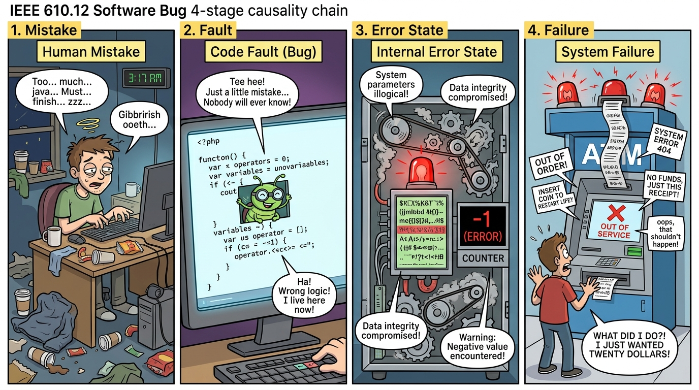
</div>

---

### 因果鏈關鍵定理與防錯原則

<div class="card-deck">

* > ⚖️ 「沒有觀察到崩潰，不代表程式沒有錯。」—— 深入理解缺陷因果鏈，主動打破潛伏期。


<div class="two-columns">
<div class="card" data-marpit-fragment>

### ⚖️ 因果鏈關鍵定理
- **定理一（缺陷潛伏性）**：系統中有 Fault，未必立即顯現為 Failure；罕見邊界分支與未存取狀態易形成長期潛伏
- **定理二（失效必有因）**：只要外部觀察到 Failure，系統內部必然歷經完整的因果狀態傳遞鏈
- **計算遮罩效應 (Masking)**：後續運算可能巧合覆蓋先前的錯誤狀態（如乘以 0），導致隱蔽 Bug 逃逸
- **狀態污染蔓延**：內部 Error State 若未被及時攔截，將隨時間污染資料庫與關聯微服務，終致雪崩

</div>
<div class="card" data-marpit-fragment>

### 🛡️ SQA 品質防錯原則
- **拒絕表面綠燈假象**：跑過幾次 Happy Path 零報錯絕不等於零缺陷，必須針對非預期輸入進行破壞性測試
- **快速失敗原則 (Fail Fast)**：在 Error State 剛萌芽的瞬間拋出斷言或例外中斷，阻斷其演變為重大 Failure
- **建立可觀測性防線**：透過結構化日誌 (Structured Logging)、分散式追蹤與 APM，及早偵測內部亞健康狀態
- **追本溯源除錯根治**：除錯時絕不能僅在表象打補丁，必須循因果鏈逆向追查根本 Fault 並修正防禦盲點

</div>
</div>

</div>

---

<!-- id: sqa-ch02-ccq1 -->
## 🙋 概念核對問答 (CCQ 1)

<div class="ccq-columns">
  <div class="ccq-text">

**問題**：工程師在撰寫銀行轉帳演算法時，誤將手續費計算公式的減號寫成加號，並部署至伺服器。當天日常營運中，所有客戶轉帳金額均未達扣除手續費門檻，無任何客戶發現異常。依據 IEEE 軟體工程定義，此時系統狀態為何？

- **A.** 系統已發生失效 (Failure)
- **B.** 程式碼中存在缺陷 (Fault/Defect)，但尚未表現為系統失效 (Failure)
- **C.** 工程師並未犯錯 (Mistake)，因為系統正常運作
- **D.** 該程式碼完全符合軟體品質的正確性定義

  </div>
  <div class="ccq-logo">
    <a href="https://nlhsueh.github.io/nickedupocket/#/student/sqa-ch02-ccq1"></a>
    <br><a href="https://nlhsueh.github.io/nickedupocket/#/student/sqa-ch02-ccq1">[課堂互動]</a>
  </div>
</div>

---

## 2.1.2 規格導致的缺陷 (Specification Bugs)

- **「我前方沒有規格，錯誤在我身後形成。」**
- 並非所有錯誤都是因為「寫錯程式碼」，很多時候是**規格本身有問題（Ambiguous or Missing Spec）**：
  - **電商結帳負數**：規格僅寫「計算總金額」，未限定數量為正整數，輸入 `-5` 導致倒賺退款
  - **日期與閏年跨時**：規格寫「每月最後一天扣款」，未定義 2 月 29 日或時區夏令時切換如何處置
  - **欄位未限長度**：未規範姓名欄位字數上限，使用者貼上萬字長文造成資料庫崩潰或版面破裂
  - **高並發庫存超賣**：規格未定義並行搶購衝突，兩人同秒下單最後一件商品導致庫存變成 `-1`
- **除法器規格的演進對比**：
  - *規格一（陽春）*：使用者輸入被除數與除數，顯示小數點後兩位結果。
  - *規格二（模糊）*：使用者不得輸入除數為 0。（*缺點：未規範輸入 0 時如何處置*）
  - *規格三（優良契約）*：除數若為 0，系統應清除結果並回傳 HTTP 400 與友善錯誤訊息「除數不得為零」。

---

<!-- _class: full-image-slide -->

<div class="centered-image">
  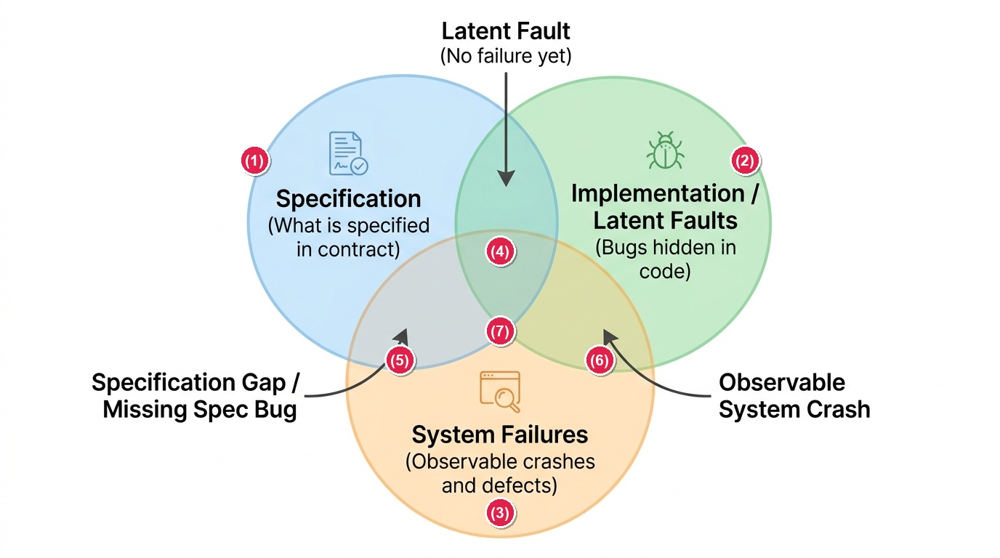
</div>

---

## 2.1.2 規格、缺陷與失效：七大區域深度剖析

<div class="card-deck">

> 💡 三集合交集揭示軟體缺陷的三重邊界：沒有失效不代表沒有缺陷，符合明訂規格更不代表高品質。

<div class="two-columns">
<div class="card" data-marpit-fragment>

### ⭕ (1) ~ (3) 單一範疇邊界
- **(1) 純規格 (Spec Only)**：規格明訂但程式尚未實作（功能遺漏 Missing Feature / 延後交付）。
- **(2) 純實作 (Impl Only)**：規格未載明的額外實作（過度設計 Gold-plating、未公開後門或未觸發死碼）。
- **(3) 純失效 (Failure Only)**：無關軟體邏輯的環境與硬體崩潰（如機房斷電、實體線路挖斷、OS 崩潰）。

</div>
<div class="card" data-marpit-fragment>

### 🔀 (4) ~ (7) 交互作用與缺陷核心
- **(4) 規格 ∩ 實作 (Latent Fault)**：依規格實作但隱含缺陷（數值溢位），常規下未引發對外失效。
- **(5) 規格 ∩ 失效 (Specification Gap)**：規格存在漏洞或模糊（未規定輸入 0），一遇極端值系統直接崩潰。
- **(6) 實作 ∩ 失效 (Observable Crash)**：未捕捉的程式碼嚴重錯誤（NPE、死鎖），穿透邊界暴露於外。
- **(7) 三者核心交集 (Core Bug)**：規格明確有寫、程式有做但做錯，對外產生可觀察的偏離失效！

</div>
</div>
</div>

---

### 規格缺陷與防禦性工程素養

<div class="card-deck">

> 🛡️ 「規格沒寫，不代表系統可以崩潰。」—— 卓越工程師的本能是在未知邊界主動築起防線。


<div class="two-columns">
<div class="card" data-marpit-fragment>

### 🔍 缺陷與失效的三重邊界
- **潛伏缺陷 (Latent Fault)**：程式碼有 Bug（數值溢位），但在常規情境未被觸發
- **規格遺漏 (Missing Spec)**：規格未定義極端輸入（如除數為 0 或負數年齡），系統直接崩潰
- **規格模糊 (Ambiguous Spec)**：需求描述含糊不清，開發與測試人員各自解讀產生嚴重落差
- **可觀察失效 (Observable Crash)**：錯誤穿透防線，造成服務中斷、交易重複或髒資料污染

</div>
<div class="card" data-marpit-fragment>

### 🛡️ 專業軟體工程師防禦素養
- **不以規格模糊為藉口**：未在規格載明的輸入，絕不代表可以任由系統 Crash 或拋出 500
- **主動防禦編程 (Defensive)**：為所有未知邊界加入嚴格的輸入校驗 (Validation) 與優雅容錯
- **落實先決條件契約 (DbC)**：在模組對外入口處建立強固的合約防火牆，阻斷髒資料滲透
- **推動三方協同對齊 (Three Amigos)**：在開發前主動與 PO 及 QA 釐清模糊情境，消弭規格漏洞

</div>
</div>

</div>

---

<!-- id: sqa-ch02-ccq2 -->
## 🙋 概念核對問答 (CCQ 2)

<div class="ccq-columns">
  <div class="ccq-text">

**問題**：某專案經理向客戶抱怨：「使用者輸入負數年齡導致伺服器當機，這是使用者的操作錯誤，不是我們程式的 Bug，因為規格書上根本沒寫年齡可以是負數！」從現代軟體工程與 SQA 觀點，下列評述何者最為正確？

- **A.** 經理說法完全合理，合約規格未載明的邊界輸入，團隊無防禦義務
- **B.** 資料庫欄位只要設為整數，程式遭遇任何數值當機皆屬於環境問題
- **C.** 此屬典型規格遺漏與防禦缺失，系統應驗證非法輸入並優雅回報錯誤
- **D.** 未明訂之規格只能當作新需求變更，驗收前不應要求修復當機異常

  </div>
  <div class="ccq-logo">
    <a href="https://nlhsueh.github.io/nickedupocket/#/student/sqa-ch02-ccq2"></a>
    <br><a href="https://nlhsueh.github.io/nickedupocket/#/student/sqa-ch02-ccq2">[課堂互動]</a>
  </div>
</div>

---

## 2.1.3 常見編碼錯誤分類 (1/2)

<style scoped>
pre code {
  font-size: 24px !important;
  line-height: 1.45;
}
</style>

- **1. 算術與精度錯誤**：
  - **除以零 (Divide by Zero)**：未檢查分母合法性即進行運算。
  - **整數溢位 (Integer Overflow)**：例如 `Integer.MAX_VALUE + 1` 悄悄溢位變成負數。
  - **浮點數捨入與累計誤差**：二進位浮點數無法精準表示十進位小數（如 0.1 + 0.2 ≠ 0.3）。
- **2. 邏輯與迴圈錯誤**：
  - **無窮迴圈 (Infinite Loop)**：終止條件永遠無法達成或計數器方向寫反。
  - **差一錯誤 (Off-by-one bug, OBOB)**：邊界條件 `<=` 誤寫或陣列索引越界：
    ```java
    // ❌ 典型的差一錯誤：陣列長度為 length，索引最大為 length - 1
    for (int i = 0; i <= array.length; i++) {
        System.out.println(array[i]); // 拋出 ArrayIndexOutOfBoundsException
    }
    ```

---

## 2.1.3 常見編碼錯誤分類 (2/2)

- **3. 資源相關臭蟲 (Resource Leaks)**：
  - **`NullPointerException`**：未做空值防禦直接調用物件方法。
  - **資源與連線洩漏 (Resource / Connection Leaks)**：開啟 `InputStream`、資料庫連線或 Socket 後未妥善釋放。
  - **釋放後使用 (Use-after-free error)**：在底層語言中存取已釋放的記憶體指標。
- **4. 多執行緒與並發臭蟲 (Concurrency Bugs)**：
  - **死結 (Deadlock)**：執行緒 A 持有鎖 1 等待鎖 2，執行緒 B 持有鎖 2 等待鎖 1，相互卡死。
  - **競爭條件 (Race Condition)**：缺乏適當同步機制，共享資源的讀寫順序因執行緒調度隨機交錯而產生錯誤狀態。

---

<!-- _class: lead -->
<!-- header: '[◄](#4) 2.2 整潔程式碼 (Clean Code) [►](#29)' -->

# **2.2 整潔程式碼 (Clean Code)**

> 「任何傻瓜都能寫出電腦看得懂的程式碼。  
> 優秀的程式設計師能寫出人類看得懂的程式碼。」  
> —— *Martin Fowler*

---

## 2.2 為什麼在「錯與除錯」談 Clean Code？

<div class="card-deck">

> 💡 除錯 (Debug) 是事後的治標與排查，Clean Code 則是事前的治本與防錯；兩者是軟體可靠性的共生雙翼。

<div class="two-columns">
<div class="card" data-marpit-fragment>

### 🛡️ 事前防錯：不給臭蟲藏身之地
- **除錯是滅火，Clean Code 是防火**：寫出義大利麵程式碼如同在機房堆滿易燃物，小失誤隨時引爆大失效
- **混亂是 Bug 最佳保護色**：冗長函式、深層巢狀與晦澀命名大幅增加大腦認知負荷，使致命缺陷深埋其中
- **讓缺陷無所遁形 (Hard to Hide)**：Bjarne Stroustrup：「Clean Code 直截了當，讓缺陷難以隱藏」，邏輯清晰是最好的防錯濾鏡
- **提高心智模型推演速度**：除錯本質是在大腦中模擬程式狀態；清晰結構讓工程師快速掌握因果鏈條

</div>
<div class="card" data-marpit-fragment>

### ⚡ 事後除錯：降低修復與回歸成本
- **破除 Clean Code ＝ Bug-Free 迷思**：Clean Code 降低內部複雜度，但演算法理解偏差依然會產生 Bug
- **杜絕「修一個 Bug 帶來三個 Bug」**：高耦合的髒程式碼在修復時極易產生連鎖副作用，Clean Code 保障局部安全
- **極致的除錯可維護性 (Debuggability)**：模組職責單一 (SRP) 讓中斷點設定與變數監控範圍精確縮小至單一函式
- **為單元測試鋪平道路**：乾淨程式碼具備高可測試性 (Testability)，極易編寫微型測試自動鎖死 Bug 不再復發

</div>
</div>
</div>

---

## 2.2.1 起源與提出者：Robert C. Martin (Uncle Bob)

<div class="content-columns">
  <div class="content-text">

- **現代專業軟體工藝奠基者**：
  - **Robert C. Martin**（業界尊稱為 **Uncle Bob**），2001 年敏捷宣言共同發起人。
  - 於 **2008 年**出版經典巨著 **《Clean Code: A Handbook of Agile Software Craftsmanship》**。
- **核心洞察：10 比 1 的閱讀時間定律**：
  - 「閱讀舊程式碼與撰寫新程式碼的時間比例**往往超過 10 比 1**。」
  - 軟體維護與除錯的時間佔據工程師日常 70% 以上。
  - **讓程式碼易讀，實質上就是讓撰寫與修改程式碼變得更容易、更安全！**
- **專業工匠的核心態度**：
  - 軟體品質是開發者的專業誠信，不應因交付壓力而妥協撰寫髒程式碼。

  </div>
  <div class="content-figure">
    <div class="name-card">
      
      <div class="name-card-caption">
        <span class="name-card-name">Robert C. Martin (Uncle Bob)</span>
        <span class="name-card-cc"><a href="https://commons.wikimedia.org/wiki/File:Robert_C._Martin_surrounded_by_computers.jpg" target="_blank" rel="noopener">Photo: CC BY-SA 4.0</a></span>
      </div>
    </div>
  </div>
</div>

---

## 2.2.2 軟體大師眼中的 Clean Code 定義

| 大師　　　　　　　　　　　　　　　　　　　　　 | 經典定義　　　　　　　　　　　　　　　　　　　　　　　　　　　　　　　　　　　　　　　　　|
| :-----------------------------------------------| :------------------------------------------------------------------------------------------|
| **Bjarne Stroustrup**<br>(C++ 之父)　　　　　　| 「邏輯應當直截了當，**讓缺陷難以隱藏**；依賴關係減至最低；並且有完整的錯誤處理。」　　　　|
| **Grady Booch**<br>(UML 奠基者)　　　　　　　　| 「Clean Code 簡潔且直接，讀起來就像結構優美的散文詩，從不會模糊作者的原意。」　　　　　　 |
| **Dave Thomas**<br>(《Pragmatic Programmer》)　| 「不僅原作者能懂，**團隊任何成員也能輕易閱讀與增修**；且必然包含完整的自動化測試。」　　　|
| **Ward Cunningham**<br>(Wiki 發明人、XP 先驅)　| 「當你閱讀程式碼時，發現每個方法執行的行為**幾乎完全符合你的預期**，那就是 Clean Code。」 |
| **Michael Feathers**<br>(《修改程式碼的藝術》) | 「Clean Code 總是看起來像是出於一位**深具關懷之心**的工程師之手，沒有任何草率敷衍。」　　 |

---

### 2.2.3 為什麼需要 Clean Code？

<div class="card-deck">

* > 🏕️ 「離開營地時，讓它比你來的時候更乾淨。」—— 破窗效應是架構腐化的催化劑，童子軍法則是對抗技術債的疫苗。


<div class="two-columns">
<div class="card" data-marpit-fragment>

### 🏚️ 破窗效應與技術債
- **破窗效應 (Broken Windows)**：程式碼只要有一處「醜陋將就」，維護者便會效仿，導致架構快速腐化
- **生產力斷崖式衰退**：為求短期交付而犧牲品質，累積龐大技術債，後續每新增一項功能都舉步維艱
- **認知負荷暴增 (Cognitive Load)**：晦澀變數與數百行大函式，迫使工程師花 90% 時間在大腦中解碼
- **連鎖回歸災難**：缺乏模組邊界保護，修改 A 模組卻莫名改壞遠端 B 模組，引發嚴重生產環境事故

</div>
<div class="card" data-marpit-fragment>

### 🏕️ 童子軍法則與正向飛輪
- **核心承諾**：「離開營地時，讓它比你來的時候更乾淨 (Leave the campground cleaner)」
- **持續漸進微重構**：每次提交 PR 時，順手重命名模糊變數、萃取小函式、補齊缺失的邊界測試
- **化整為零清償技術債**：無須停擺業務進行昂貴的「大翻新」，透過日常微改善維持程式庫健康度
- **建立卓越工程文化**：讓整潔與高自律成為團隊共識，程式碼庫隨著每一次提交愈發穩健大器

</div>
</div>

</div>

---

### 2.2.4 Clean Code 的核心心法

<div class="card-deck">

* > 🎯 簡潔不是簡化，而是精煉到無可替代——以清楚意圖取代二度解碼，以 DRY 與 KISS 杜絕人為錯誤。


<div class="two-columns">
<div class="card" data-marpit-fragment>

### 🎯 意圖透徹與消弭重複
- **意圖清楚 (Intention-Revealing)**：命名即規格，開門見山表明業務動機，閱讀無須二次解碼
- **DRY 原則 (Don't Repeat Yourself)**：消除邏輯重複；每項知識在系統中僅有單一且權威的表述
- **防錯效益**：相同業務邏輯散落各處時，維護時「改一漏一」是產生低級 Bug 最常見的溫床
- **單一職責 (SRP)**：一個函式只專注做好一件事；函式越精煉，內部潛伏隱蔽邏輯錯誤的機率越低

</div>
<div class="card" data-marpit-fragment>

### 🧩 精煉架構與務實防禦
- **KISS 原則 (Keep It Simple, Stupid)**：以最精煉直接的架構解決問題，嚴防不必要的複雜度
- **YAGNI 原則 (You Aren't Gonna Need It)**：只實作當前明確需要的功能，切勿撰寫想像中的過度彈性
- **天然可測試性 (Testability)**：職責單一與依賴解耦的程式碼極易進行單元測試與 Mock 驗證
- **自解釋程式碼 (Self-Documenting)**：用優雅結構取代過期註解，讓程式碼本身成為最真實的活文件

</div>
</div>

</div>

---

<!-- _class: title-image-slide -->
## 2.2.4 Clean Code 核心心法漫畫圖解

<div class="image-wrapper">
  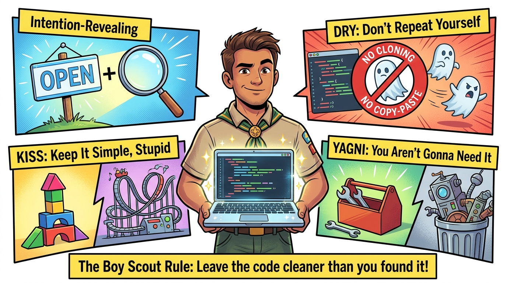
</div>

---

## 2.2.5 具體實務作法 1：有意義的命名 (Meaningful Names)

- **名符其實，杜絕魔術數字與神祕縮寫**：
  ```java
  // ❌ 劣質命名：含義模糊、存在魔術數字 86400
  int d; // elapsed time in days
  int t = d * 86400;

  // ✅ 優良命名：意圖明確，具備自我解釋能力
  int elapsedTimeInDays;
  final int SECONDS_PER_DAY = 86400;
  int totalElapsedTimeInSeconds = elapsedTimeInDays * SECONDS_PER_DAY;
  ```
- **類別用名詞，方法用動詞**：
  - 類別：`Customer`, `Invoice`, `Account`（避免 `Info`, `Data` 等空洞贅詞）。
  - 方法：`postPayment()`, `calculateTax()`, `isEligibleForDiscount()`。
- **概念一致性**：同概念全專案保持統一（勿在 A 處用 `fetchUser`，B 處用 `getUser`，C 處用 `retrieveUser`）。

---

## 2.2.5 具體實務作法 2：小巧且專注的函式

- **只做一件事 (Do One Thing Well)**：
  - 函式應短小精悍（理想在 10~20 行內），專注於單一職責與單一抽象層級。
- **限制參數數量**：
  - 參數愈少愈好（0~2 個最理想；超過 3 個應封裝為物件或 DTO）。
- **無隱蔽副作用 (No Side Effects)**：
  - 函式不應暗中修改外部全域狀態或傳入的引數物件。
- **提早回傳與衛語句 (Guard Clauses)**：
  - 函式巢狀層級不應超過 1~2 層，善用衛語句消除過深的 Arrow Anti-Pattern。

---

## 衛語句重構範例 (Guard Clauses)

<style scoped>
div.split55 {
  align-items: flex-start;
  gap: 24px;
}
div.split55 h4 {
  margin: 0 0 6px 0;
  font-size: 0.95em;
  white-space: nowrap;
}
div.split55 pre {
  margin-top: 4px;
}
pre code {
  font-size: 20px !important;
  line-height: 1.4;
}
</style>

<div class="split55">
<div class="left">

<p style="margin: 0 0 6px 0; font-size: 0.95em; font-weight: bold; color: #c0392b;">❌ 箭頭型深層巢狀 (Arrow Anti-Pattern)</p>

```java
public void processOrder(Order order) {
    if (order != null) {
        if (order.isValid()) {
            if (order.isPaid()) {
                ship(order);
            }
        }
    }
}
```

</div>
<div class="right">

<p style="margin: 0 0 6px 0; font-size: 0.95em; font-weight: bold; color: #27ae60;">✅ 衛語句提早回傳 (Guard Clauses)</p>

```java
public void processOrder(Order order) {
    if (order == null || !order.isValid()) {
        return;
    }
    if (!order.isPaid()) {
        return;
    }
    ship(order);
}
```

</div>
</div>

---

## 2.2.5 具體實務作法 3 & 4：註解與錯誤處理

- **程式碼即最佳文檔 (Self-Documenting Code)**：
  - 不要用註解來粉飾糟糕的程式碼；花時間重構，讓程式碼自己說話。
  - **壞註解**：廢話註解（`i++; // i 加 1`）、已被註解廢棄的死碼（應由 Git 歷史管理，直接刪除）。
  - **好註解**：解釋**「為什麼 (Why)」**這麼做（特殊演算法選型、特殊業務法規限制），而非「做了什麼 (What)」。
- **嚴謹的錯誤處理與防禦**：
  - **使用例外 (Exceptions) 代替錯誤碼 (Error Codes)**：主流程與異常處理邏輯清楚分離。
  - **杜絕 `null` 傳遞與回傳**：善用 `Optional`、空集合（`Collections.emptyList()`）或 Null Object 模式，根除 `NullPointerException`。

---

## 2.2.5 具體實務作法 5 & 6：消除壞味道與測試保護

| 常見壞味道 (Code Smell) | 現象與問題 | 改善手法 (Refactoring) |
| :--- | :--- | :--- |
| **過長函式 (Long Method)** | 動輒上百行，承載過多職責 | **萃取方法 (Extract Method)** |
| **巨大類別 (God Class)** | 類別包山包海，違反單一職責 | **萃取類別 (Extract Class)** |
| **重複程式碼 (Duplicated Code)** | 相同邏輯散落在不同區塊 | **提煉共用方法 (Extract Utility)** |
| **依戀情節 (Feature Envy)** | 頻繁調用外部類別的 getter | **搬移方法 (Move Method)** |
| **魔術數值 (Magic Numbers)** | 出現無說明的神秘數字/字串 | **萃取為具名常數 / Enum** |

- 🛡️ **自動化測試是 Clean Code 的守護神**：
  - 未經自動化測試保護的程式碼，團隊往往不敢動手重構。唯有具備高涵蓋率的測試套件，重構才有安全網保障！

---

<!-- id: sqa-ch02-ccq3 -->
## 🙋 概念核對問答 (CCQ 3)

<div class="ccq-columns">
  <div class="ccq-text">

**問題**：資深工程師在進行 Code Review 時，發現後輩寫了 150 行的付款結帳方法 `checkout()`，內含 5 層 if-else 巢狀判斷，旁邊寫了 40 行詳細註解解釋每層判斷用途。根據 Clean Code 原則，下列重構建議何者最恰當？

- **A.** 只要註解詳細且測試有過，150 行與 5 層巢狀完全可接受
- **B.** 應利用「提早回傳 (Guard Clauses)」減少巢狀層級，並運用「萃取方法 (Extract Method)」將驗證、算折扣、扣款等子邏輯拆分為具備自我解釋能力的小函式，進而刪除冗餘解釋性註解
- **C.** 應將註解全部翻譯成英文以提升國際化品質，邏輯不變
- **D.** 應將 150 行壓縮成一行 Lambda 表達式以減少行數

  </div>
  <div class="ccq-logo">
    <a href="https://nlhsueh.github.io/nickedupocket/#/student/sqa-ch02-ccq3"></a>
    <br><a href="https://nlhsueh.github.io/nickedupocket/#/student/sqa-ch02-ccq3">[課堂互動]</a>
  </div>
</div>

---

### 2.2.6 重大迷思：Clean Code 等於沒有 Bug 嗎？

<div class="card-deck">

* > 💡 Clean Code 保證的是結構可讀與可維護性，而非商業運算的絕對正確；但優雅的程式碼讓缺陷無處藏身！


<div class="two-columns">
<div class="card" data-marpit-fragment>

### ⚠️ 品質的兩大維度
- **內部品質 (Internal Quality)**：
  - 結構優雅、意圖明確、高模組化、極易維護
  - 這正是 Clean Code 所追求的核心境界
- **外部品質 (External Quality)**：
  - 對外行為正確性 (Correctness)，是否符合規格
  - 命名再優雅，若運算公式寫錯，仍是嚴重業務缺陷！

</div>
<div class="card" data-marpit-fragment>

### 💡 Clean Code 的真正防錯價值
- **讓缺陷無處可藏**：扁平小巧的函式讓業務漏洞在審查中無所遁形
- **讓自動化測試極易撰寫**：低耦合與單一職責讓單元測試與 Mock 輕而易舉
- **將修復風險降至最低**：大幅降低改壞其他模組的連鎖副作用與回歸成本

</div>
</div>

</div>

---

<!-- id: sqa-ch02-ccq4 -->
## 🙋 概念核對問答 (CCQ 4)

<div class="ccq-columns">
  <div class="ccq-text">

**問題**：新進工程師報告：「這段金融交易模組經過徹底重構，完全符合 Clean Code 原則——變數命名精準、函式不超過 10 行、無深層巢狀且無重複程式碼。因此我保證上線後絕對不會有任何 Bug！」從 SQA 角度評述何者最精準？

- **A.** 該工程師說法完全正確，Clean Code 定義就是無缺陷的程式碼
- **B.** 該工程師混淆了「內部品質」與「外部品質」；Clean Code 提升了可讀性與可維護性，但無法保證業務規則理解正確或算式無誤，仍需仰賴自動化測試與規格驗證
- **C.** 只要函式在 10 行內，編譯器就會自動進行形式化邏輯證明
- **D.** Clean Code 僅適用於前端 UI，後端交易重構無實質品質效益

  </div>
  <div class="ccq-logo">
    <a href="https://nlhsueh.github.io/nickedupocket/#/student/sqa-ch02-ccq4"></a>
    <br><a href="https://nlhsueh.github.io/nickedupocket/#/student/sqa-ch02-ccq4">[課堂互動]</a>
  </div>
</div>

---

<!-- _class: lead -->
<!-- header: '[◄](#15) 2.3 除錯思維與方法 [►](#40)' -->

# **2.3 除錯思維與方法 (Debugging)**

> 「在自己的程式裡找出一個錯誤是十分困難的；  
> 而當你認為自己的程式絕對沒有錯誤時，那就更是難上加難。」  
> —— *Steve McConnell*

---

## 2.3.1 除錯的核心思維

- 🕵️ **科學偵探思維**：
  - 除錯是嚴謹的假設檢定過程，堅決拒絕「碰碰運氣胡亂修改（Shotgun Debugging / 霰彈槍除錯）」。
- 🔍 **不只改徵兆，探尋根本原因 (Root Cause)**：
  - 治標不治本（如隨處加 `if (x != null)` 或包裹空的 `try-catch` 吞掉例外）只會引來更多難以排查的深層災難。
- 🎯 **缺陷群聚效應 (Defect Clustering)**：
  - 一處發現 Bug，往往意味著同一作者、同一模組的鄰近邏輯也有潛伏缺陷。
- 🛡️ **回歸測試保護 (Regression Defense)**：
  - 修復 Bug 前先寫出重現測試；修復後確保所有自動化測試全綠燈。

---

## 2.3.2 科學除錯五步驟 (Scientific Debugging)

- **1. Reproduce (穩定重現)**：
  - 排除環境干擾，建立能 100% 穩定重現 Bug 的最小失敗測試案例 (Minimal Failing Test Case)。
- **2. Hypothesize (假設形成)**：
  - 依據錯誤訊息、日誌與 Call Stack 呼叫堆疊，提出 1~2 個根本原因的因果假設。
- **3. Experiment (實驗驗證)**：
  - 設定條件斷點或加入追蹤日誌，執行受測程式驗證或推翻假設。
- **4. Fix (根因修復)**：
  - 從核心演算法或架構層面進行乾淨修復與重構，杜絕表面敷衍。
- **5. Regression Test (回歸驗證)**：
  - 執行完整測試套件，確認重現測試轉綠，且既有功能無任何回歸破壞。

---

<!-- _class: full-image-slide -->

<div class="centered-image">
  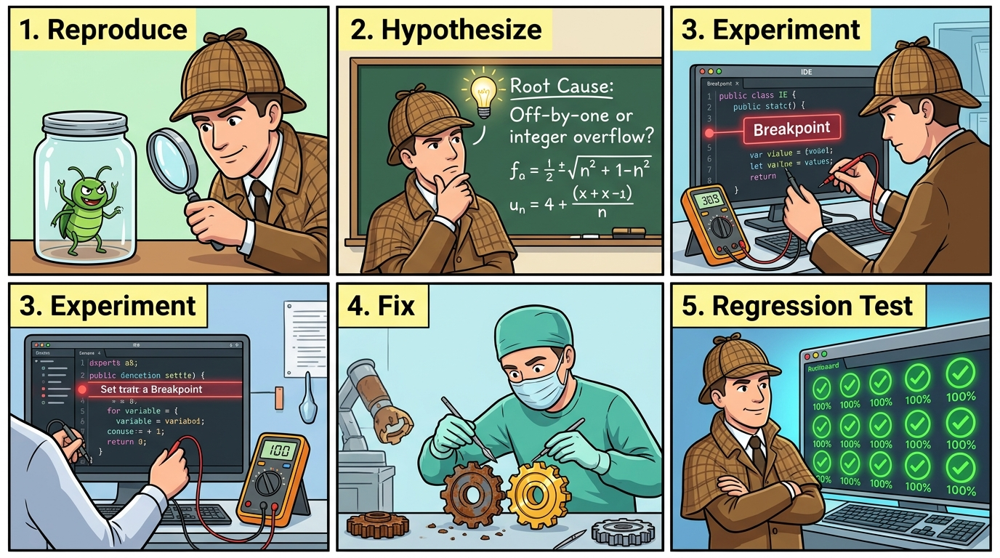
</div>

---

## 2.3.3 命題邏輯推演與除錯思維

- 🧭 **除錯的本質**：
  - 從觀察到的「現象 (Symptoms)」反推「根因 (Causes)」，必須嚴格遵守形式邏輯，避免先入為主的直覺偏誤。
- ❌ **謬誤 1：肯定後項謬誤 (Converse Error - 充分 vs 必要混淆)**：
  - $(p \implies q) \not\implies (q \implies p)$
  - *實例*：已知「開啟快取時，資料會產生錯誤」。如今觀察到「資料發生錯誤」，不能直接武斷推斷「一定是開了快取」，因為可能還有其他 Bug 導致相同錯誤。
- ❌ **謬誤 2：否定前項謬誤 (Inverse Error)**：
  - $(p \implies q) \not\implies (\neg p \implies \neg q)$
  - *實例*：以為「只要把快取關閉，資料就絕對不會出錯」，這常導致工程師以為關了開關就安全而忽略深層缺陷。
- 🎯 **唯一等價真理：逆否命題 (Contrapositive)**：
  - $(p \implies q) \iff (\neg q \implies \neg p)$
  - 只有在「資料完全正確時」，才能百分之百斷定「當前並未處於該會致病的快取狀態」。

---

## 2.3.3 多因一果的布林邏輯拆解

- 🧩 **多因聯集（OR 連結 - 任何單一因素皆足以致病）**：
  - $p_1 \lor p_2 \lor p_3 \implies q$
  - **等價逆否命題**：$\neg q \implies (\neg p_1 \land \neg p_2 \land \neg p_3)$
  - 💡 **排除除錯法則**：只要現象 $q$ 沒有發生，就可以一口氣排除 $p_1, p_2, p_3$ **全部不可能為真**！
- 🧩 **多因交集（AND 連結 - 多項條件同時成立才引爆）**：
  - $p_1 \land p_2 \land p_3 \implies q$
  - **等價逆否命題**：$\neg q \implies (\neg p_1 \lor \neg p_2 \lor \neg p_3)$
  - 💡 **修復與破壞法則**：只要現象 $q$ 未發生，表示 $p_1, p_2, p_3$ 中**至少有一項不成立**；除錯驗證時只要打破其中一個條件就能暫時消除症狀，但仍需探求主因。

---

## 2.3.3 實務邏輯推演演練 1：錯誤碼 Err101

- ✍️ **已知規則**：
  - 「輸入格式錯誤」且「住址字串長度超過 50 以上」，系統會產生 `Err101` 錯誤。
  - 符號化表示：$(\text{格式錯誤} \land \text{長度} > 50) \implies \text{Err101}$
- ❓ **除錯情境推斷**：
  - 測試時發現：**「目前沒有產生 Err101 錯誤，且我們確定輸入格式有錯」**。
  - 請問推論：*「因此可以斷定住址長度小於等於 50」* 是否正確？
- 🔍 **嚴密邏輯解析**：
  - 依逆否命題：$\neg \text{Err101} \implies (\neg \text{格式錯誤} \lor \text{長度} \le 50)$
  - 因為已知「格式有錯」（即 $\neg \text{格式錯誤}$ 為 False），
  - 依析取三段論 (Disjunctive Syllogism)，$(\text{長度} \le 50)$ 必然為 True！
  - ✅ **結論**：推斷**完全正確**！展現了邏輯代數在排查邊界條件時的強大推理威力。

---

## 2.3.3 實務邏輯推演演練 2：使用者異常交叉比對

<div class="split55">
  <div class="left">

| OS | Memory | TSR (防毒) | Version | Result |
| :--- | :--- | :--- | :--- | :--- |
| Win 8 | 2G | K | 2.5 | Normal |
| Win 8 | 1G | no | 2.5 | Normal |
| Win 8 | 2G | K | 2.4 | Normal |
| Win 8 | 1G | K | 2.5 | Normal |
| **Win 10** | 2G | **K** | 2.5 | **Abnormal** |
| **Win 10** | 1G | **K** | 2.4 | **Abnormal** |
| **Win 10** | 2G | **K** | 2.4 | **Abnormal** |
| Win 10 | 1G | no | 2.5 | Normal |
| **Win 10** | 2G | **K** | 2.3 | **Abnormal** |
| Win 10 | 1G | no | 2.5 | Normal |

  </div>
  <div class="right">

- 🔍 **交叉比對因果歸納**：
  - 只要同時符合：**安裝卡巴斯基 (K)** 且 **運行於 Win 10**，Result 必為 Abnormal（列印當機）。
  - 與軟體版本 (2.3~2.5)、記憶體 (1G/2G) 無關：
    $$\text{installK} \land \text{onWin10} \implies \text{Abnormal}$$
- 🚨 **除錯時最常犯的邏輯陷阱**：
  - 若某用戶回報「Win 10 系統發生列印異常」，能否直接斷定「他一定有裝卡巴斯基」？
  - ❌ **不一定**！因為逆命題不保證成立，可能存在其他原因導致異常。

  </div>
</div>

---

### 2.3.4 🤖 AI 時代輔助除錯的兩大陷阱

<div class="card-deck">

* > 🤖 別讓 AI 成為你的「創可貼工廠」——掩蓋症狀只會讓架構毒素在更深處引爆。


<div class="two-columns">
<div class="card" data-marpit-fragment>

### 🩹 陷阱 1：膠帶式修復 (Band-aid Fix)
- **錯誤現象**：
  把 `NullPointerException` 貼給 AI，AI 常直接給出 `if (obj != null)` 將錯誤吞掉。
- **潛在危害**：
  只是掩蓋徵兆，根本原因（資料庫查無或初始化失敗）未解，錯誤將在更深處隱蔽引爆！

</div>
<div class="card" data-marpit-fragment>

### ⚠️ 陷阱 2：自我印證偏誤與回歸破壞
- **錯誤現象**：
  過度信任 AI 局部修復建議，忽略系統整體架構與領域約束。
- **潛在危害**：
  AI 常破壞其他模組隱含的狀態不變量 (Invariants)，悄悄引入嚴重的回歸缺陷 (Regression)！

</div>
</div>

</div>

---

## 2.3.4 人機協同除錯黃金 SOP (AI Debugging Protocol)

- 📋 **1. 提供完整上下文 (Context)**：
  - 絕不要只貼單行報錯；必須提供完整的 **Stack Trace、相關方法原始碼、具體輸入資料與預期業務規格**。
- 💡 **2. 要求根因解釋，而非直接給程式碼**：
  - 優質 Prompt：「*請分析引發此 Exception 的 3 個可能根本原因，並評估此修復是否會破壞任何前置條件或狀態不變量。*」
- 🧪 **3. 先寫測試再修復 (Test-First Bug Fix)**：
  - 讓 AI 協助生成一個**「專門重現該 Bug 的失敗單元測試」**；修復後見證紅燈轉綠，並執行 CI 全套測試確保零回歸。

---

<!-- id: sqa-ch02-ccq5 -->
## 🙋 概念核對問答 (CCQ 5)

<div class="ccq-columns">
  <div class="ccq-text">

**問題**：生產環境拋出 `ConcurrentModificationException`，工程師將程式碼貼給 AI，AI 建議在迴圈外層直接包裹空的 `try-catch` 區塊將例外吞掉。關於這種做法，下列評價何者最為精準？

- **A.** 這是絕佳快速修復方案，因為系統再也不會拋出例外中斷
- **B.** 這是危險的「治標不治本（Swallowing Exception）」，表面雖不報錯，但底層多執行緒並發衝突與資料不一致依然存在，日後會引發更嚴重的資料損壞
- **C.** 只要 AI 給出的程式碼能通過編譯，就代表通過軟體品質驗證
- **D.** 現代 Java 框架已全面由容器託管，不需要理會此例外

  </div>
  <div class="ccq-logo">
    <a href="https://nlhsueh.github.io/nickedupocket/#/student/sqa-ch02-ccq5"></a>
    <br><a href="https://nlhsueh.github.io/nickedupocket/#/student/sqa-ch02-ccq5">[課堂互動]</a>
  </div>
</div>

---

<!-- _class: lead -->
<!-- header: '[◄](#29) 2.4 除錯工具實務 [►](#42)' -->

# **2.4 除錯工具實務 (Debuggers)**

> 「除錯工具是軟體工程師的聽診器與手術刀。」

---

<!-- _class: title-image-slide -->

## 2.4 現代 IDE 除錯介面全貌 (以 IntelliJ IDEA 為例)

<div class="image-wrapper" style="height: 520px;">
  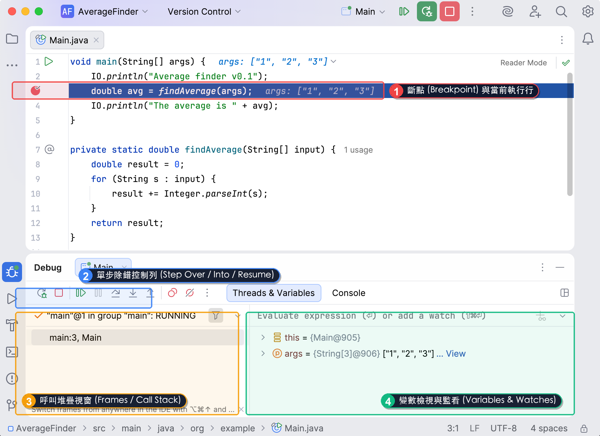
</div>

---

## 2.4.1 除錯中斷點：精準定格執行時態 (Breakpoints)

<div class="card-deck">

> 💡 現代除錯器的核心是「有策略地定格時間」——在最關鍵的 execution frame 上觀察程式真實狀態。

<div class="two-columns">
<div class="card" data-marpit-fragment>

### 🔴 核心基礎斷點機制
- **行中斷點 (Line Breakpoint)**：最基本斷點，程式執行「即將抵達該行前」定格，此時該行指令**尚未執行**
- **條件斷點 (Conditional Breakpoint)**：設定過濾表達式（如 `i == 999` 或 `user.getBalance() < 0`），僅在滿足時才暫停
- **命中次數斷點 (Hit Count)**：忽略前 N-1 次迴圈迭代，僅在第 N 次命中時暫停，排查大量迴圈後期的累積誤差
- **日誌斷點 (Logpoint / Tracepoint)**：不停機、不破壞高併發時序，每次經過自動在主控台輸出自訂變數日誌

</div>
<div class="card" data-marpit-fragment>

### 💥 例外斷點與進階觀測
- **例外斷點 (Exception Breakpoint)**：指定拋出特定例外（如 `NullPointerException`）瞬間自動定格現場
- **精準捕獲第一案發現場**：無須大海撈針猜測哪一行拋錯，除錯器直接定格於拋出例外的原始語句
- **未捕獲例外 (Uncaught Exceptions)**：可設定僅在例外未被 `try-catch` 處理時中斷，過濾正常業務例外
- **欄位存取斷點 (Field Watchpoint)**：針對類別成員變數，當其被「讀取」或「寫入修改」時立即暫停

</div>
</div>
</div>

---

## 2.4.2 執行流程控制：單步追蹤術 (Execution Control)

<div class="card-deck">

> 💡 掌握單步執行的節奏感，在程式呼叫階層中自如穿梭，精確定位變數從合法走向受污染的轉折點。

<div class="two-columns">
<div class="card" data-marpit-fragment>

### ⏯️ 單步跳躍四核心動作
- **Step Over (單步跳過 / F8)**：執行當前行程式碼；若該行包含函式呼叫，直接在背景執行完畢停在下一行
- **Step Into (單步進入 / F7)**：若當前行有呼叫函式，直接進入該自訂函式內部第一行，逐行深度追查
- **Force Step Into (強制進入)**：跳過 IDE 預設過濾，即使是 Java 官方函式庫（如 `ArrayList.add`）也能深入追蹤
- **Step Out (單步跳出 / Shift+F8)**：執行完當前函式剩餘的所有程式碼，直接返回到上層呼叫處並暫停

</div>
<div class="card" data-marpit-fragment>

### ⏩ 快速導航與執行控制
- **Resume / Continue (繼續執行 / F9)**：讓程式恢復全速運轉，直到遇到下一個中斷點或程式結束
- **Run to Cursor (執行至游標處 / Alt+F9)**：臨時想停在某一行，無須新增斷點，直接全速跑到游標所在行暫停
- **Drop Frame / Reset Frame (堆疊重放)**：強大的現代除錯黑科技，撤銷當前函式呼叫堆疊，重新從函式開頭再跑一次
- **暫停執行緒 (Pause Program)**：程式發生無窮迴圈或死鎖假死時，手動強制暫停所有執行緒查看卡死位置

</div>
</div>
</div>

---

## 2.4.3 狀態透視：變數監視與呼叫堆疊 (State Inspection)

<div class="card-deck">

> 💡 程式暫停時，整個記憶體與呼叫脈絡盡在眼前——從靜態原始碼切入動態執行時態的關鍵視窗。

<div class="two-columns">
<div class="card" data-marpit-fragment>

### 🔍 變數檢視與動態監看
- **Variables (區域變數視窗)**：即時列出當前 Scope 內的所有區域變數、傳入參數與 `this` 物件內部欄位
- **Watches (變數/表達式監看)**：自訂長期盯緊的目標，支援複合運算式（如 `list.size()` 或 `node.next == null`）
- **Set Value (動態竄改變數值)**：在暫停時雙擊變數修改記憶體數值，手動模擬極端邊界測試防禦邏輯
- **Inline Values (行內數值即時標註)**：現代 IDE 會直接在編輯器程式碼行末以灰色文字顯示當前變數的值

</div>
<div class="card" data-marpit-fragment>

### 🥞 呼叫堆疊與動態求值
- **Call Stack (呼叫堆疊視窗)**：回溯「這個方法是由誰、經過哪些中介層一路呼叫進來的」，釐清因果鏈條
- **切換 Stack Frame (切換堆疊影格)**：點擊任一呼叫層，編輯器自動切換至該層檔案並還原當時的區域變數
- **Evaluate Expression (動態運算求值 / Alt+F8)**：在定格狀態下開啟互動視窗，動態執行任意程式碼或呼叫方法
- 🛠️ **實習銜接**：請參閱 `LabDemo/docs/u01_debug/debug.md` 實戰 BubbleSort、GCD 與泰勒級數除錯

</div>
</div>
</div>

---

<!-- _class: lead -->
<!-- header: '[◄](#40) 2.5 防禦性編程與契約式設計 [►](#56)' -->

# **2.5 防禦性編程與契約式設計 (DbC)**

> 「開車綠燈起步時依然減速張望——  
> 這不是對別人的信任問題，而是主動預防事故擴散的工程態度。」

---

## 2.5.1 契約式設計 (DbC) 的起源與核心定義
- DbC = Design by Contract
- **提出者與理論背景**：
  - 由物件導向權威、Eiffel 語言之父 **Bertrand Meyer** 於 1986 年提出。
  - **根本哲學**：模組與方法之間的協作，就像商業世界中的 **法律契約 (Legal Contract)**。
- **雙方權利與義務對等原則 (Rights & Obligations)**：

| 角色　　　　　　　　　　　　　　 | 義務 (Obligations)　　　　　　　　　　　　　　　　　　　　　　　| 權利 (Rights)　　　　　　　　　　　　　　　　　　　　　　　　　　|
| :---------------------------------| :----------------------------------------------------------------| :-----------------------------------------------------------------|
| **呼叫端 (Caller / Client)**　　 | 必須嚴格滿足方法所要求的**前置條件 (Preconditions)**　　　　　　| 若滿足前置條件，有權期望獲得正確的**後置結果 (Postconditions)**　|
| **被呼叫端 (Supplier / Callee)** | 必須保證達成**後置條件**，且全程維護**類別不變量 (Invariants)** | 若呼叫端未滿足前置條件，被呼叫端**無義務處理，有權直接拒絕執行** |

---

### 2.5.1 契約式設計的三大核心要素

<div class="card-deck">

* > 📜 權責分明拒絕踢皮球——以契約精確規範前置要求、後置保證與狀態不變量。


<div class="two-columns">
<div class="card" data-marpit-fragment>

### 📜 呼叫端與被呼叫端義務
- **Preconditions (前置條件 - requires)**：呼叫者進入方法前必須滿足的義務；若未滿足，責任在呼叫端，方法有權拒絕執行
- **Postconditions (後置條件 - ensures)**：方法正常執行後保證達成的狀態與輸出；若未達成，責任在被呼叫端內部缺陷

</div>
<div class="card" data-marpit-fragment>

### 🔒 狀態恆真約束與工程價值
- **Class Invariants (類別不變量 - maintains)**：物件在任何公開方法呼叫前後必須永遠維持為真的核心業務法則
- **權責分明拒絕踢皮球**：清楚界定「誰該負責防禦什麼」，杜絕無休止的冗餘檢查與責任爭議

</div>
</div>

</div>

---

<!-- _class: full-image-slide -->

<div class="centered-image">
  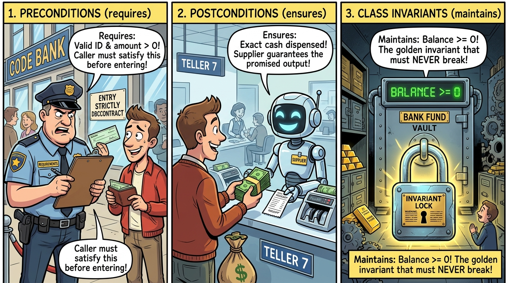
</div>

---

## 2.5.1 DbC 實務範例：銀行帳戶提款 (`withdraw`)

<style scoped>
pre code {
  font-size: 18px !important;
  line-height: 1.35;
}
</style>

```java
public class BankAccount {
    private int balance; // 類別不變量約束：balance >= 0

    // 【前置條件 requires】：提款金額 > 0 且金額不得超過當前餘額
    public void withdraw(int amount) {
        if (amount <= 0 || amount > balance) {
            throw new IllegalArgumentException("契約前置條件失敗：提款金額非法或餘額不足！");
        }
        int oldBalance = balance;
        
        balance -= amount; // 執行核心業務計算
        
        // 【後置條件 ensures】：餘額必須恰好減少提款金額
        assert balance == oldBalance - amount : "後置條件失敗：餘額扣減計算錯誤！";
        // 【類別不變量 maintains】：任何交易後餘額絕不可為負
        assert checkInvariant() : "類別不變量破裂：帳戶透支！";
    }
    private boolean checkInvariant() { return balance >= 0; }
}
```

---

## 契約破裂的權責判定與 SQA 效益

- 🚨 **若前置條件 (Precondition) 失敗**（如傳入負數金額）：
  - **責任歸屬：呼叫者 (Caller)**。
  - **處置**：立即拋出 `IllegalArgumentException` 拒絕執行，防範髒輸入污染核心領域模型。
- 🚨 **若後置條件 (Postcondition) 失敗**（如扣款未生效或金額計算偏差）：
  - **責任歸屬：被呼叫方法自身 (Supplier)**。
  - **處置**：觸發斷言，表示演算法實作存在缺陷 (Fault)，需立即修復。
- 🚨 **若類別不變量 (Class Invariant) 破裂**（如餘額透支變負數）：
  - **責任歸屬：內部狀態腐敗**。
  - **處置**：系統立即自我熔斷，杜絕將錯誤狀態寫入持久化資料庫！
  - 💡 狀態不變量也是現代**屬性基礎測試 (Property-Based Testing)** 自動驗證的真理仲裁核心。

---

## 2.5.2 斷言機制深究 (Java Assertions)

- 🔍 **語法結構**：`assert condition : "自訂錯誤訊息";`（若條件為 false 則拋出 `AssertionError`）
- 🛡️ **斷言三大最佳使用時機 (LabDemo 實務)**：
  - **1. 內部狀態不變量 (Internal Invariants)**：
    ```java
    // 邏輯上若 i 為正整數且餘數非 0、1，此處必定為 2
    assert i % 3 == 2 : "非預期的餘數狀態: " + (i % 3);
    ```
  - **2. 類別不變量 (Class Invariants)**：
    - 物件生命週期中必須恆為真的黃金法則（如 `BoundedStack` 的 size、capacity 與陣列非空）：
    ```java
    elements[size++] = val;
    assert invariant() : "Push 後違反 Stack 類別不變量！";
    ```
  - **3. 控制流程不變量 (Control-Flow Invariants)**：
    - 列舉所有 `switch-case` 分支後，理論上絕對不可執行的防禦哨兵：
    ```java
    default: assert false : "未知的 Status 列舉狀態: " + status;
    ```

---

### 2.5.2 斷言的禁忌與啟用開關 (-ea)

<div class="card-deck">

* > ⚙️ 斷言是開發與除錯時的防錯鷹架，切勿當作生產環境抵禦外部輸入的承重牆。


<div class="two-columns">
<div class="card" data-marpit-fragment>

### ❌ 斷言的兩大絕對禁忌
- **禁忌 1：絕不用於檢查 Public API 參數**
  生產環境預設關閉斷言 (`-da`)，若用來防禦外部輸入將全面失守！公開 API 必須拋出顯式例外。
- **禁忌 2：絕不包含具副作用 (Side Effect) 邏輯**
  如 `assert list.remove(item)`；關閉斷言後程式碼不執行，將破壞業務狀態！

</div>
<div class="card" data-marpit-fragment>

### ⚙️ 啟用斷言的方法 (`-ea`)
- **命令列終端執行**：
  `java -ea -cp target/classes xdemo.BubbleSort`
- **IntelliJ IDEA 設定**：
  `Run ➔ Edit Configurations ➔ VM options` 填入 `-ea`。
- **Maven Surefire 設定**：
  `<enableAssertions>true</enableAssertions>`。

</div>
</div>

</div>

---

## 2.5.3 例外處理機制 (Exception Handling)

- 🌲 **Java `Throwable` 核心層次結構**：
  - **1. Checked Exception (受檢例外)**：
    - 繼承自 `Exception`（非 RuntimeException），如 `IOException`, `SQLException`。
    - 外部環境可能發生但程式無法完全預防；**編譯器強制要求必須處理，否則編譯錯誤**。
  - **2. Unchecked Exception (未檢例外 / 執行期例外)**：
    - 繼承自 `RuntimeException`，如 `NullPointerException`, `IllegalArgumentException`。
    - 通常源於**程式設計師的邏輯缺陷**；編譯期不強制捕捉，但未處理會造成程式中斷。
  - **3. Error (嚴重錯誤)**：
    - 如 `OutOfMemoryError`, `StackOverflowError`，代表 JVM 底層硬體或記憶體崩潰，應用層不應捕捉。
- 📜 **捕捉或宣告原則 (Catch or Declare Rule - CDR)**：
  - 對於受檢例外只有兩種選擇：**要嘛用 `try-catch` 妥善處理，要嘛用 `throws` 宣告交給呼叫者處理**！

---

## 2.5.3 現代例外實務：資源管理與反模式

- 🛡️ **`try-with-resources` 自動資源釋放 (Java 7+)**：
  - 實作 `AutoCloseable` 介面的資源（如檔案串流、資料庫連線），離開區塊時自動關閉，杜絕記憶體與系統資源控柄 (File Handles) 外洩：
  ```java
  try (FileReader reader = new FileReader("config.json")) {
      // 讀取設定檔，結束後自動調用 reader.close()
  } catch (IOException e) {
      logger.error("讀取設定檔失敗: {}", e.getMessage(), e);
  }
  ```
- 🚫 **例外處理三大反模式 (Anti-Patterns)**：
  - ❌ **生吞例外 (Swallowing)**：`catch (Exception e) {}` 空區塊導致錯誤徹底無聲消失。
  - ❌ **僅印控制台**：僅寫 `e.printStackTrace()`，在正式環境無法持久化日誌與通報監控告警。
  - ❌ **濫用捕捉根類別**：隨意 catch `Throwable`，反而攔截了系統崩潰的致命 Error。

---

## 2.5.4 系統日誌機制 (Logging as Defense)

- 💡 **為什麼需要日誌框架？（日誌 vs `System.err.println`）**：
  - **1. 日誌等級過濾 (Level Filtering)**：
    - 正式生產環境只記錄 `WARN` / `ERROR`，開發與除錯期動態開啟 `DEBUG`，無須改動任何程式碼。
  - **2. 多目標靈活輸出 (Appenders)**：
    - 透過配置可同時輸出至 Console 控制台、滾動日誌檔案 (`logs/app.log`) 或遠端 ELK / Grafana 監控中心。
  - **3. 豐富結構化格式 (PatternLayout)**：
    - 自動附加精確時間戳、執行緒名稱、來源類別與行號，事後排查一目了然。
  - **4. 外部動態設定**：
    - 透過 `log4j2.xml` 配置文件熱更新日誌行為，免重新編譯部署。

---

## 2.5.4 現代日誌框架架構：SLF4J + Log4j 2

- 🏗️ **業界黃金架構：門面 (Facade) 與實作分離**：
  - **SLF4J** 作為日誌介面門面（解耦），**Log4j 2** 作為高性能實作引擎。
- 📊 **標準日誌等級階梯 (由低至高)**：
  - `TRACE`（極細微流程） $\rightarrow$ `DEBUG`（開發偵錯） $\rightarrow$ `INFO`（正常里程碑） $\rightarrow$ `WARN`（潛在非預期） $\rightarrow$ `ERROR`（功能受損） $\rightarrow$ `FATAL`（系統崩潰）
- ⚡ **結構化佔位符高效寫法**：
  ```java
  // ❌ 劣質：字串拼接在日誌等級未啟用時仍浪費 CPU 與記憶體
  logger.debug("Processing order " + orderId + " for user " + userId);

  // ✅ 優質：使用 {} 佔位符，按需延遲求值與格式化
  logger.info("使用者 {} 成功完成訂單 {}，金額: ${}", userId, orderId, amount);

  // ✅ 記錄例外堆疊：傳入 Throwable 物件自動列印完整 Call Stack
  logger.error("金流扣款失敗，訂單編號: {}", orderId, e);
  ```

---

<!-- _class: title-image-slide -->
## 2.5.5 防禦三大防線漫畫圖解：斷言、例外與日誌

<div class="image-wrapper">
  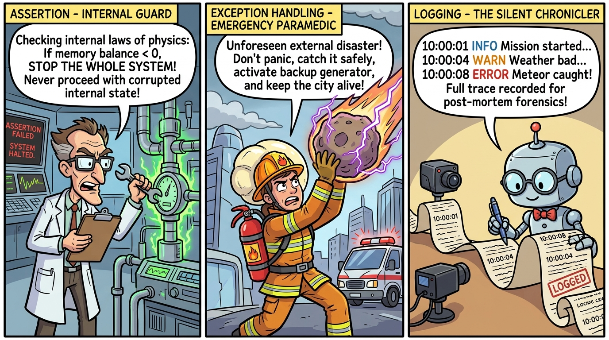
</div>

---

## 2.5.5 防禦性程式設計全景對比

| 防禦維度 | 核心機制 | 應對目標 | 生產環境行為 |
| :--- | :--- | :--- | :--- |
| **契約前置條件** | `IllegalArgumentException` | 外部呼叫者違反合約、輸入髒資料 | 永遠啟用，直接阻擋非法請求 |
| **斷言 (Assertion)** | `assert cond : msg` | 開發者自身的邏輯缺陷、內部狀態不變量 | 預設關閉，可由 `-ea` 參數開啟 |
| **受檢例外 (Checked)** | `try-catch` / `throws` | 外部環境可預期的異常（網路斷線、檔案遺失） | 永遠啟用，強制呼叫方提供容錯策略 |
| **系統日誌 (Logging)** | SLF4J / Log4j 2 | 系統運作軌跡、稽核審查、事後根本原因追查 | 透過設定檔動態調整輸出目標與等級 |

---

<!-- _class: lead -->
<!-- header: '[◄](#42) 2.6 缺陷管理與議題追蹤 [►](#65)' -->

# **2.6 缺陷管理與議題追蹤 (Defect Management & BTS)**

> 「沒有開關的 26 樓會議室——  
> 治標剪線的代價，就是地下室掛滿前人留下的混亂電線。」

---

<!-- _class: title-image-slide -->
## 2.6.1 軟體寓言：大樓的燈 (1/2)

<div class="image-wrapper">
  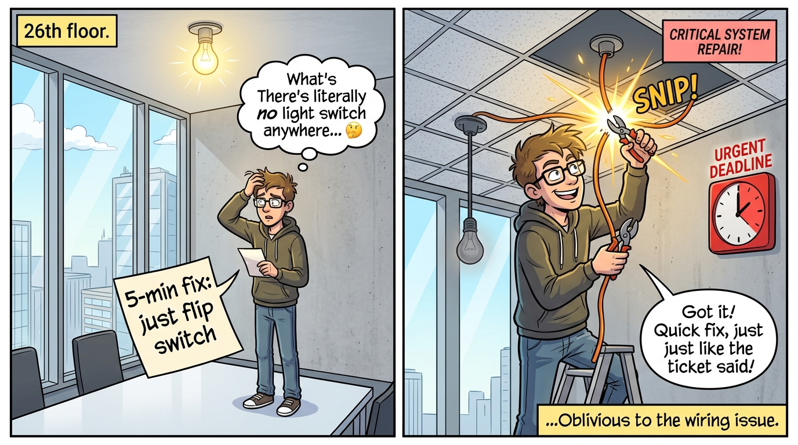
</div>

---

<!-- _class: title-image-slide -->
## 2.6.1 軟體寓言：大樓的燈 (2/2)

<div class="image-wrapper">
  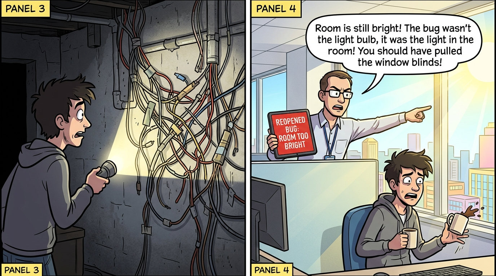
</div>

---

## 「大樓的燈」深刻隱喻與 SQA 省思

- 💡 **隱喻 1：治標不治本的 Quick Fix ➔ 毀滅性的技術債 (Technical Debt)**：
  - 「一刀剪斷電線」看似 5 分鐘快速解決當下工單，但問題本質從未被解決。
  - **地下室整面牆掛滿前人留下的雜亂電線**，正是真實專案中無數「臨時 Patch / 拼湊修補」最後引發架構大崩壞的殘酷寫照！
- 💡 **隱喻 2：模糊遺漏的規格 ➔ 「燈泡還是光」的無效內耗**：
  - 缺陷回報若缺乏精確規格標準，開發與 QA 終將陷入無休止的爭吵（「燈泡明明滅了 vs. 房間還是很亮」）。
  - 真正的根因可能是「需要拉下百葉窗」，團隊卻在天花板剪電線。
- 💡 **隱喻 3：高壓催促與治標文化**：
  - 主管若只要求「明天不得再有 Bug」，只會逼出更多「地下室的隱藏電線」！

---

## 2.6.2 完整缺陷生命週期狀態機 (Defect Lifecycle)

- **主流程 (Main Flow)**：
  - **New (新建)** ➔ **Assigned (已指派)** ➔ **In Progress (處理中)** ➔ **Fixed (已修復)** ➔ **QA Retest (QA 驗證)** ➔ **Closed (結案關閉)**。
- **分支流程 (Branch Flows)**：
  - **Rejected / Duplicate (拒絕 / 重複)**：非 Bug、環境問題或重複回報 ➔ 直接結案。
  - **Deferred (延期處理)**：非當前 Release 關鍵阻礙 ➔ 移入 Backlog。
  - **Reopened (重新開啟)**：QA 驗證失敗 ➔ 打回重新排查修復。

---

<!-- _class: full-image-slide -->

<div class="centered-image">
  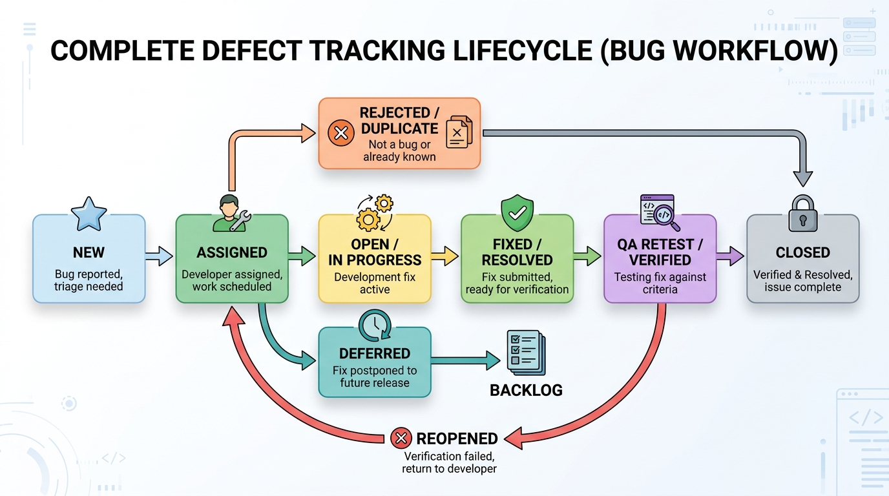
</div>

---

### 2.6.3 嚴重度 (Severity) vs 優先級 (Priority)

<div class="card-deck">

* > 🎯 技術影響力（嚴重度）不等於商業急迫性（優先級）——學會正交決策是資深工程師的必修課。


<div class="two-columns">
<div class="card" data-marpit-fragment>

### ⚙️ 嚴重度 (Severity)
- **本質維度**：**技術與系統衝擊**
- **評估標準**：對系統架構、功能崩潰度、資料完整性與安全性的破壞程度。
- **常見分級**：`Critical` (當機/資安) ➔ `Major` (主功能受阻) ➔ `Minor` (小瑕疵)。

</div>
<div class="card" data-marpit-fragment>

### ⏰ 優先級 (Priority)
- **本質維度**：**商業與修復急迫性**
- **評估標準**：依據產品發布時程、商業營收影響需被排程修復的先後順序。
- **常見分級**：`Immediate / Urgent` ➔ `High` ➔ `Normal` ➔ `Low`。

</div>
</div>

<div class="card" data-marpit-fragment style="padding: 12px 20px; font-size: 18.5px; text-align: center;">

📌 **兩者為正交維度**：嚴重度高不必然優先修復(例如機率低)；嚴重度低（如首頁 Logo 錯字）在重大行銷時優先級極高！

</div>

</div>

---

<!-- _class: full-image-slide -->

<div class="centered-image">
  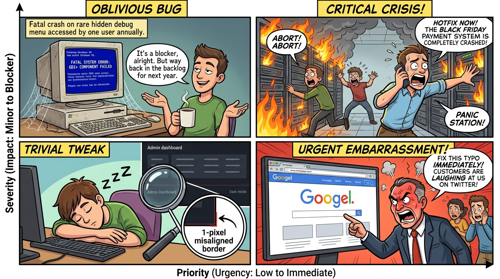
</div>

---

## 2x2 決策矩陣四大象限實例分析

<div class="card-deck">

* > 💡 缺陷評估需從「技術破壞程度（嚴重度）」與「商業迫切性（優先級）」雙維度解耦決策。

  <div class="two-columns">
    <div class="card" data-marpit-fragment>
      <h3>🔥 象限 1：高嚴重度 + 高優先級</h3>
      <ul>
        <li><b>狀態</b>：Critical & Urgent（立即修復）</li>
        <li><b>實例</b>：核心金流交易崩潰、全站 500 Crash、重大 SQL Injection 漏洞</li>
        <li><b>處置</b>：阻斷 Release，立即發布緊急熱修復 (Hotfix)</li>
      </ul>
    </div>
    <div class="card" data-marpit-fragment>
      <h3>⚡ 象限 2：低嚴重度 + 高優先級</h3>
      <ul>
        <li><b>狀態</b>：Low Severity & Urgent（快速修復）</li>
        <li><b>實例</b>：公司首頁 Logo 拼寫錯誤（<code>Compnay</code>）、主按鈕文案誤導</li>
        <li><b>處置</b>：技術修正微小但損害商譽，優先排定當日修正</li>
      </ul>
    </div>
  </div>
  <div class="two-columns">
    <div class="card" data-marpit-fragment>
      <h3>⏳ 象限 3：高嚴重度 + 低優先級</h3>
      <ul>
        <li><b>狀態</b>：High Severity & Low Priority（排程修復）</li>
        <li><b>實例</b>：特定冷門作業系統（如 Win95）或極罕見複合邊界下的崩潰</li>
        <li><b>處置</b>：技術衝擊大但影響使用者趨近於零，排入後續迭代正常修復</li>
      </ul>
    </div>
    <div class="card" data-marpit-fragment>
      <h3>🌱 象限 4：低嚴重度 + 低優先級</h3>
      <ul>
        <li><b>狀態</b>：Low Severity & Low Priority（日後優化）</li>
        <li><b>實例</b>：內部管理後台冷門報表 1 像素對齊偏差</li>
        <li><b>處置</b>：無害瑕疵，暫緩處理或列入日後體驗優化清單</li>
      </ul>
    </div>
  </div>
</div>

---

<!-- _class: lead -->
<!-- header: '[◄](#56) 2.7 綜合練習與實戰思維 [►](#68)' -->

# **2.7 綜合練習與實戰思維**

> 「理論若無實踐，不過是空中樓閣。」

---

## 🙋 2.7 綜合練習 (3/4)：核心概念填空挑戰

請根據本章核心理論，填入最適當的軟體工程專業名詞：

1. **錯的因果鏈**：
   工程師心智思維中的人為失誤稱為 **[ ① ______ ]**，反映在程式碼中成為靜態的 **[ ② ______ ]**；當該行程式碼被執行，會引發記憶體內部的 **[ ③ ______ ]**，最終造成外部可見的行為偏離，稱為 **[ ④ ______ ]**。
2. **契約式設計 (DbC)**：
   呼叫端必須負責滿足的是 **[ ⑤ ______ ]**；方法保證在執行完畢後達成的狀態是 **[ ⑥ ______ ]**；類別在任何公開方法執行前後皆必須恆成立的條件是 **[ ⑦ ______ ]**。
3. **缺陷管理二維度**：
   衡量缺陷對系統架構破壞深淺程度的是 **[ ⑧ ______ ]**；決定開發團隊排程修復順序的是 **[ ⑨ ______ ]**。

---

<!-- id: sqa-ch02-game -->
## 🙋 2.7 綜合練習 (4/4)：除錯偵探所 (Game 挑戰)

<div class="ccq-columns">
  <div class="ccq-text">

**遊戲任務：為七大真實軟體工程案件做出最精準的法律判決！**

- 🔍 **判決選項池**：
  - `A. Mistake` ｜ `B. Fault` ｜ `C. Error State` ｜ `D. Failure`
  - `E. Precondition Violation` ｜ `F. Invariant Violation`
  - `G. High Severity, Low Priority`
- 📱 **線上搶答**：共 7 道實戰判例，每題限時 20 秒，請掃描 QR Code 進入遊戲！

  </div>
  <div class="ccq-logo">
    <a href="https://nlhsueh.github.io/nickedupocket/#/student/sqa-ch02-game"></a>
    <br><a href="https://nlhsueh.github.io/nickedupocket/#/student/sqa-ch02-game">[課堂互動]</a>
  </div>
</div>

---

<!-- _class: lead -->
<!-- header: '[◄](#65) 附錄：課堂互動參考解答 [►](#1)' -->

# **附錄：課堂互動參考解答**

> 各題答案與關鍵解析

---

## 課堂互動參考解答 (1/3)

- **CCQ 1（銀行轉帳公式與未觸發失效）**：
  - **正確答案：B**
  - 工程師犯錯 (Mistake) 已將錯誤邏輯寫入程式碼形成缺陷 (Fault)。因當天未達手續費門檻，該分支未被觸發或未造成對外行為偏離，故尚未表現為可觀察之系統失效 (Failure)。
- **CCQ 2（負數年齡與規格遺漏）**：
  - **正確答案：C**
  - 專業軟體強調防禦性架構（Input Validation）。即使規格未窮盡非法值，系統也絕不能因未受校驗的輸入而拋出未捕獲例外或崩潰。
- **CCQ 3（150 行巢狀函式重構）**：
  - **正確答案：B**
  - Clean Code 核心是「程式碼即文件」。過長函式與深層巢狀應透過 Guard Clauses 扁平化，並抽取小函式讓意圖自明，而非靠 40 行註解粉飾。

---

## 課堂互動參考解答 (2/3)

- **CCQ 4（Clean Code 是否等於無 Bug）**：
  - **正確答案：B**
  - Clean Code 保證的是「內部品質」（易讀、易改、模組化）；外部品質（業務正確性）仍可能因演算法理解錯誤而存在缺陷。Clean Code 的價值在於讓 Bug 無處可藏且極易測試。
- **CCQ 5（空 try-catch 吞掉並發例外）**：
  - **正確答案：B**
  - 吞掉例外 (Swallowing Exceptions) 是嚴重的反模式。表面雖不報錯，但底層多執行緒並發衝突與資料不一致依然存在，日後會引發不可逆的資料損壞。

---

## 課堂互動參考解答 (3/3)：2.7 填空與 Game 挑戰

- **2.7 填空挑戰參考答案**：
  - ① `Mistake`（人為失誤）、② `Fault / Defect`（靜態缺陷）、③ `Error State`（內部錯誤狀態）、④ `Failure`（系統失效）
  - ⑤ `前置條件 (Preconditions)`、⑥ `後置條件 (Postconditions)`、⑦ `類別不變量 (Class Invariants)`
  - ⑧ `嚴重度 (Severity)`、⑨ `優先級 (Priority)`
- **2.7 除錯偵探所 Game 判例參考答案**：
  - **案件 1：A (Mistake)** —— 工程師思維偏差導致的手滑失誤。
  - **案件 2：B (Fault)** —— 潛伏於靜態程式碼中但尚未被激發的缺陷。
  - **案件 3：C (Error State)** —— 內部狀態已不一致（Dangling Pointer）但未對外暴露。
  - **案件 4：D (Failure)** —— 系統對外行為偏離規格、造成服務中斷。
  - **案件 5：E (Precondition Violation)** —— 呼叫端未履行傳入合法正數之義務。
  - **案件 6：F (Invariant Violation)** —— 破壞了 MaxHeap 父節點必大於等於子節點的性質。
  - **案件 7：G (High Severity, Low Priority)** —— 技術後果嚴重（死機），但無實際業務受眾。

<script>
(function() {
  function initHeaderDropdown() {
    const sections = [];
    const seenTitles = new Set();
    const slideSections = document.querySelectorAll("section[id]");
    
    // 1. Scan unique section titles and their slide IDs
    slideSections.forEach(sec => {
      const header = sec.querySelector("header");
      if (!header) return;
      
      let title = header.textContent.trim();
      title = title.replace(/^[◄◀]\s*/, "").replace(/\s*[►▶]$/, "").trim();
      if (!title || seenTitles.has(title)) return;
      
      seenTitles.add(title);
      sections.push({
        id: sec.id,
        title: title
      });
    });

    if (sections.length === 0) return;

    // Helper to create the dropdown DOM
    function createDropdownWrapper(currentTitle) {
      const wrapper = document.createElement("span");
      wrapper.className = "header-nav-wrapper";
      
      const titleSpan = document.createElement("span");
      titleSpan.className = "header-nav-title";
      titleSpan.title = "點擊固定或懸停查看所有章節快速跳轉";
      titleSpan.innerHTML = currentTitle + "<span class=\"nav-caret\"> ▾</span>";
      
      titleSpan.addEventListener("click", function(e) {
        e.stopPropagation();
        const wasOpen = wrapper.classList.contains("is-open");
        document.querySelectorAll(".header-nav-wrapper.is-open").forEach(w => w.classList.remove("is-open"));
        if (!wasOpen) {
          wrapper.classList.add("is-open");
        }
      });
      
      const dropdown = document.createElement("div");
      dropdown.className = "nav-dropdown";
      
      dropdown.addEventListener("click", function(e) {
        e.stopPropagation();
      });
      
      const dropHeader = document.createElement("div");
      dropHeader.className = "nav-dropdown-header";
      dropHeader.innerHTML = "<span>📑 快速跳轉章節目錄</span><span style=\"font-size:11px;font-weight:normal;color:#64748b;\">共 " + sections.length + " 個章節</span>";
      dropdown.appendChild(dropHeader);
      
      const grid = document.createElement("div");
      grid.className = "nav-dropdown-grid";
      
      sections.forEach(s => {
        const item = document.createElement("a");
        const isActive = (s.title === currentTitle);
        item.className = "nav-dropdown-item" + (isActive ? " active" : "");
        item.href = "#" + s.id;
        item.innerHTML = "<span class=\"badge\">#" + s.id.padStart(2, "0") + "</span><span class=\"item-text\" title=\"" + s.title + "\">" + s.title + "</span>";
        
        item.addEventListener("click", function(e) {
          wrapper.classList.remove("is-open");
          dropdown.style.display = "none";
          window.location.hash = "#" + s.id;
          setTimeout(() => { dropdown.style.display = ""; }, 350);
        });
        
        grid.appendChild(item);
      });
      
      dropdown.appendChild(grid);
      wrapper.appendChild(titleSpan);
      wrapper.appendChild(dropdown);
      return wrapper;
    }

    // Close any pinned dropdown when clicking anywhere outside
    document.addEventListener("click", function(e) {
      if (!e.target.closest(".header-nav-wrapper")) {
        document.querySelectorAll(".header-nav-wrapper.is-open").forEach(w => w.classList.remove("is-open"));
      }
    });

    // 2. Enhance each header element across all slides
    slideSections.forEach(sec => {
      const header = sec.querySelector("header");
      if (!header || header.dataset.navEnhanced) return;
      header.dataset.navEnhanced = "true";
      
      const links = header.querySelectorAll("a");
      let prevLink = null;
      let nextLink = null;
      
      links.forEach(a => {
        const txt = a.textContent.trim();
        if (txt === "◄" || txt === "◀") prevLink = a;
        if (txt === "►" || txt === "▶") nextLink = a;
      });
      
      let title = header.textContent.trim();
      title = title.replace(/^[◄◀]\s*/, "").replace(/\s*[►▶]$/, "").trim();
      if (!title) return;
      
      header.innerHTML = "";
      if (prevLink) {
        prevLink.className = "header-nav-arrow";
        prevLink.title = "上一章節";
        header.appendChild(prevLink);
        header.appendChild(document.createTextNode(" "));
      }
      
      const wrapper = createDropdownWrapper(title);
      header.appendChild(wrapper);
      
      if (nextLink) {
        header.appendChild(document.createTextNode(" "));
        nextLink.className = "header-nav-arrow";
        nextLink.title = "下一章節";
        header.appendChild(nextLink);
      }
    });
  }

  if (document.readyState === "loading") {
    document.addEventListener("DOMContentLoaded", initHeaderDropdown);
  } else {
    initHeaderDropdown();
  }
  setTimeout(initHeaderDropdown, 400);
})();
</script>