# 軟體品質與測試

### 第 3 章：軟體測試原則、理論與架構模型 (AI 時代前沿版)

授課教師：薛念林 教授

> 江 Sir 皺著眉頭：「對不起，我們還不能驗收。這個系統可絕不能在正式上線時出錯啊！」  
> 雄太拍著胸脯：「我敢保證！現在系統經過測試，絕對沒有任何錯誤了！」  
> 江 Sir 冷笑了一下：「我倒是懂得一點軟體測試的根本原則——**軟體測試只能證明程式有錯，永遠無法證明程式絕對沒有錯誤！**」  
> 雄太一下子愣住了...

---

<!-- header: '[◄](#1) 本章大綱 (Outline) [►](#4)' -->

## 本章重點導讀 (Key Highlights)

<div class="two-columns">
<div class="card">

### 🛡️ 合約防禦與經典原則
- **3.1 防禦性架構與合約 (DbC)**：Meyer 三大契約法則、斷言 vs. 例外
- **3.2 ISTQB 7 大測試原則**：缺陷存在、窮盡不可能、殺蟲劑悖論
- **3.3 測試多維度分類體系**：驗證/確認、黑箱/白箱、實戰測試金字塔

</div>
<div class="card">

### 📐 架構模型與測試預言
- **3.4 V 開發模型與雙向追溯**：水平雙向追溯線、避免後測偏差
- **3.5 測試案例設計與 AI 協同**：行為文氏圖、5 大要件、人機協同
- **3.6 測試全景 3W2H 與 Oracle**：Test Oracle 難題與變質測試
- **3.7 綜合練習與實戰思維**：原則辨析、V 模型追溯與邊界設計

</div>
</div>

---

<!-- _class: lead -->
<!-- header: '[◄](#3) 3.1 防禦性架構與合約設計 [►](#9)' -->

# **3.1 防禦性架構與合約設計 (DbC)**

> 「綠燈起步時依然減速張望——  
> 預防錯誤擴散的主動工程態度。」

---

### 3.1.1 契約式設計的三大核心要素 (Bertrand Meyer)

<div class="two-columns">
<div class="card">

### 📜 呼叫端與被呼叫端義務
- **Preconditions (前置條件 - requires)**：呼叫者 (Caller) 進入方法前必須滿足的義務；若未滿足，方法有權拒絕執行
- **Postconditions (後置條件 - ensures)**：方法正常執行完畢後，向呼叫者保證達成的狀態與輸出結果

</div>
<div class="card">

### 🔒 狀態恆真約束與工程價值
- **Class Invariants (類別不變量 - maintains)**：物件在公開方法呼叫前後必須永遠維持為真的核心業務法則
- **屬性測試基石**：破壞不變量應立即熔斷阻擋髒資料，這是現代屬性基礎測試 (PBT) 的核心依據

</div>
</div>

---

<!-- _class: full-image-slide -->

<div class="centered-image">
  
</div>

---

## 3.1.2 斷言 (Assertion) vs 例外處理 (Exception)

| 機制 | 目的 | 適用時機 | 生產環境行為 |
| :--- | :--- | :--- | :--- |
| **斷言 (Assertion)** | 捕捉「程式設計師自身的邏輯 Bug」或內部不變量 | 私有方法參數檢查、演算法內部狀態、不可能到達的分支 | 可被 `-ea` / `-da` 開關啟用或關閉 |
| **例外 (Exception)** | 處理「執行時外部可預期的異常環境」 | 公開 API 參數驗證、網路中斷、檔案不存在、使用者輸入錯誤 | 永遠處於啟用狀態，需有明確捕獲處理 |

- 📌 **核心界線**：
  - 外部環境不穩定與非法使用者輸入 ➔ 使用 **例外 (Exception)**。
  - 內部程式設計邏輯與不可違反的約束 ➔ 使用 **斷言 (Assertion)**。

---

<!-- id: sqa-ch03-ccq1 -->
## 🙋 概念核對問答 (CCQ 1)

<div class="ccq-columns">
  <div class="ccq-text">

**問題**：在契約式設計 (Design by Contract) 中，由「呼叫者 (Caller)」負責滿足、若不滿足則被呼叫方法將拒絕執行，這在契約三要素中屬於？

- **A.** 前置條件 (Preconditions)
- **B.** 後置條件 (Postconditions)
- **C.** 類別不變量 (Class Invariants)
- **D.** 異常防護 (Exceptions)

  </div>
  <div class="ccq-logo">
    <a href="https://nlhsueh.github.io/nickedupocket/#/student/sqa-ch03-ccq1"></a>
    <br><a href="https://nlhsueh.github.io/nickedupocket/#/student/sqa-ch03-ccq1">[課堂互動]</a>
  </div>
</div>

---

<!-- _class: lead -->
<!-- header: '[◄](#4) 3.2 ISTQB 軟體測試 7 大經典原則 [►](#23)' -->

# **3.2 ISTQB 軟體測試 7 大經典原則**

> 「測試是一門基於風險取樣的經驗科學，  
> 而非盲目的無窮迴圈。」

---

### 權威標準與 ISTQB 7 大經典原則總覽

<div class="two-columns">
<div class="card">

### 📚 國際權威文獻與標準
- **ISTQB CTFL v4.0**：國際軟體測試認證標準大綱 (2023 最新版)
- **Glenford J. Myers**：《軟體測試的藝術》經典奠基著作
- **Martin Fowler**：現代實戰測試金字塔模型 (Test Pyramid)

</div>
<div class="card">

### 🧭 ISTQB 7 大經典測試原則
- **1. 顯示缺陷存在** ＆ **2. 窮盡測試不可能**
- **3. 及早測試 (左移)** ＆ **4. 缺陷群聚效應**
- **5. 殺蟲劑悖論** ＆ **6. 測試依賴上下文**
- **7. 無錯謬誤**：交付無用系統毫無價值！

</div>
</div>

---

<!-- _class: full-image-slide -->

<div class="centered-image">
  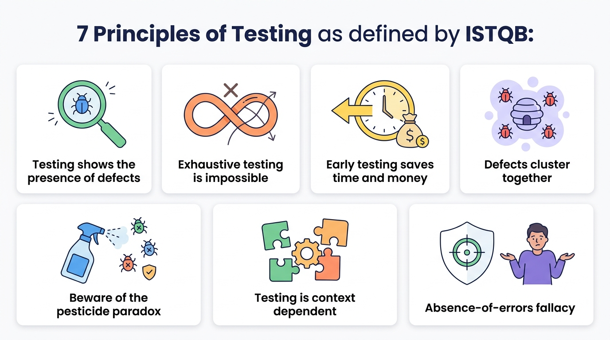
</div>

---

## 原則 1：測試顯示缺陷的存在，而非不存在

- **核心意涵**：
  - 測試能夠證明軟體中**「存在缺陷」**，但無論執行了多少萬筆測試且全部通過，都**「無法證明軟體絕對零缺陷」**。
- **測試的真正目的**：
  - 測試不是為了證明程式完美無瑕，而是為了**降低未被發現缺陷的風險**，提供軟體品質的客觀度量與發布信心。
- 🤖 **AI 時代警示【流暢性偏誤 (Fluency Bias)】**：
  - AI 生成的程式碼通常語法優美、排版工整，極易給人「絕對沒錯」的錯覺。
  - 但 AI 程式碼常潛伏並發競爭條件 (Race Conditions) 或隱蔽邊界例外，跑過幾次 Happy Path 綠燈絕不能保證其無錯！

---

<!-- _class: full-image-slide -->

<div class="centered-image">
  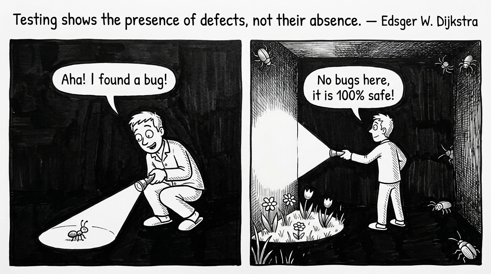
</div>

---

## 原則 2：窮盡測試是不可能的 (Exhaustive Testing is Impossible)

- **組合爆炸的現實**：
  - 簡單邏輯若有 100 個條件判斷式，組合數高達 $2^{100} \approx 1.27 \times 10^{30}$。加上作業系統、瀏覽器、網路波動與資料庫狀態，窮盡所有輸入在計算上是完全不可能的。
- **錯誤總是躲在角落 (Bugs lurk in corners)**：
  ```java
  int scale (int j) {
      j = j - 1; // ❌ 正確應為 j = j + 1
      j = j / 3000;
      return j;
  }
  ```
  - 假設 $j$ 範圍為 -32768 ~ 32767。分析發現，僅有 $j = 2999, 3000, 5999, 6000 \dots$ 等 **18 個數值會顯現錯誤**，其餘 65,518 個數值算出來答案都碰巧一致！
  - 🎲 **盲目隨機踩中錯誤的機率** $= 18 / 65536 \approx 0.00027$ (**0.027%**)。
  - 💡 測試必須是**基於風險的取樣（Risk-Based Testing）**，針對邊界精準打擊！

---

## 原則 3：及早測試 / 測試左移 (Shift-Left)

- **核心意涵**：
  - 靜態與動態測試活動應在軟體開發生命週期的**最早期（需求與架構階段）**即刻介入。
- **經濟學依據（1:10:100 品質成本定律）**：
  - 需求審查時抓出一個邏輯矛盾：**\$1**
  - 開發單元測試時抓出 Bug：**\$10**
  - 軟體上線到生產環境後的維護與賠償代價：**\$100 ～ \$1000+**！

---

<!-- _class: title-image-slide -->

## 缺陷修復成本曲線 (Bug Cost Curve)

<div class="image-wrapper">
  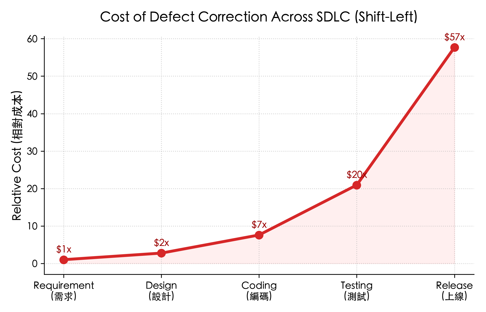
</div>

---

## 原則 4：缺陷群聚效應 (Defects Cluster Together)

- **核心意涵（80/20 法則）**：
  - 軟體系統中絕大多數的重大缺陷，往往高度集中在**少數幾個複雜度最高、變更最頻繁、或涉及多方外部整合的模組中**。
- **工程實務啟示**：
  - 當在某個模組發現了大量 Bug 時，不要以為抓完就沒事了；
  - 該模組很可能還潛伏著更多深層缺陷，應對其加大變異測試 (Mutation Testing) 與屬性測試力度！

---

## 原則 5：小心殺蟲劑悖論 (Beware of Pesticide Paradox)

- **核心意涵**：
  - 同一種農藥噴久了，害蟲會產生抗藥性；
  - **同一套測試案例反覆跑久了，將無法再挖掘出任何新的 Bug！**
- **SQA 2.0 的應對之道**：
  - 測試案例必須定期審查、重構並動態演進。
  - 導入 **屬性基礎測試 (Property-Based Testing / jqwik)**：每次執行自動隨機生成萬組全新測資。
- 🤖 **AI 時代警示【自我印證的假綠燈】**：
  - 若讓 AI 為自己生成的程式碼寫單元測試，AI 會**依照自身錯誤的邏輯去設計測試**，導致測試與程式碼「共同錯在同一個盲區」，產生極高強度的假安全感！

---

<!-- _class: full-image-slide -->

<div class="centered-image">
  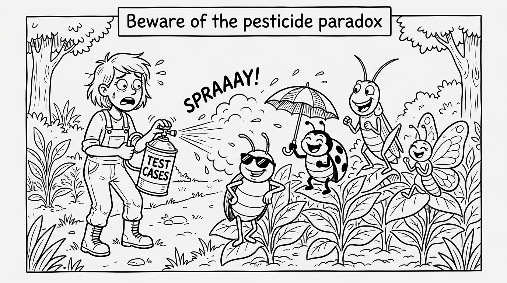
</div>

---

## 原則 6：測試取決於上下文 (Testing is Context Dependent)

- **核心意涵**：
  - 世上沒有一套放之四海皆準的通用測試方法，測試策略必須依據領域風險客製化。
- **實例對比**：
  - **醫療儀器 / 航太飛控系統**：
    - 需嚴格遵循 DO-178C 等國際標準，要求 MC/DC 覆蓋率 100%、形式化邏輯驗證與硬體在環 (HIL) 測試。
  - **敏捷電商 Web App**：
    - 著重快速回歸、高併發壓測、微服務契約測試 (Pact) 與 A/B 測試。

---

## 原則 7：無錯謬誤 (Absence-of-Errors is a Fallacy)

- **核心意涵**：
  - **「零 Bug 的系統」並不等於「成功的系統」**。
  - 即使團隊投入巨大資源修復了所有 Bug，但如果軟體**根本沒有滿足使用者的真實業務需求**，或者操作體驗極其反人類，這套軟體在商業與品質上依然是徹底失敗的。
- 🤖 **AI 時代警示【Prompt 幻覺】**：
  - AI 產生的程式碼可能編譯 100% 通過且無語法錯誤，但若 Prompt 對領域規則（Domain Spec）理解有誤，產出的依然是「符合規格但無用的垃圾」。

---

<!-- id: sqa-ch03-ccq2 -->
## 🙋 概念核對問答 (CCQ 2)

<div class="ccq-columns">
  <div class="ccq-text">

**問題**：某工程師使用 AI 秒速生成一套複雜利息計算演算法，隨即讓同一個 AI 幫忙生成單元測試。測試跑出 100% 覆蓋率全綠燈通過，但在實際上線後卻被金融主管機關判定年息公式違反法規。依據 ISTQB 測試原則，這最主要反映何種問題？

- **A.** 測試工程師未安裝最新的 JDK 執行環境
- **B.** AI 測試陷入「殺蟲劑悖論（自我印證盲區）」與「原則 7：無錯謬誤（程式碼無語法錯誤但偏離法規與真實業務需求）」
- **C.** 只要測試覆蓋率達 100%，系統必然在法律上具備合規性
- **D.** 這是硬體浮點數運算器的製造缺陷

  </div>
  <div class="ccq-logo">
    <a href="https://nlhsueh.github.io/nickedupocket/#/student/sqa-ch03-ccq2"></a>
    <br><a href="https://nlhsueh.github.io/nickedupocket/#/student/sqa-ch03-ccq2">[課堂互動]</a>
  </div>
</div>

---

<!-- _class: lead -->
<!-- header: '[◄](#9) 3.3 測試的多維度分類體系 [►](#34)' -->

# **3.3 測試的多維度分類體系**

> 「從微觀的類別方法，  
> 到宏觀的端到端商業價值交付。」

---

### 1. 驗證 (Verification) vs 確認 (Validation)

<div class="two-columns">
<div class="card">

### 🔍 驗證 (Verification) - 製程導向
- **核心哉問**：「Are we building the product right?（我們是否正確地建造軟體？）」
- **檢驗重點**：確保產出物與程式碼嚴格符合規格書、架構設計圖與編碼規範

</div>
<div class="card">

### 🎯 確認 (Validation) - 產品導向
- **核心哉問**：「Are we building the right product?（我們是否建造了正確的軟體？）」
- **檢驗重點**：確保軟體交付後真正切中使用者痛點、滿足業務目標與商業價值

</div>
</div>

---

<!-- _class: full-image-slide -->

<div class="centered-image">
  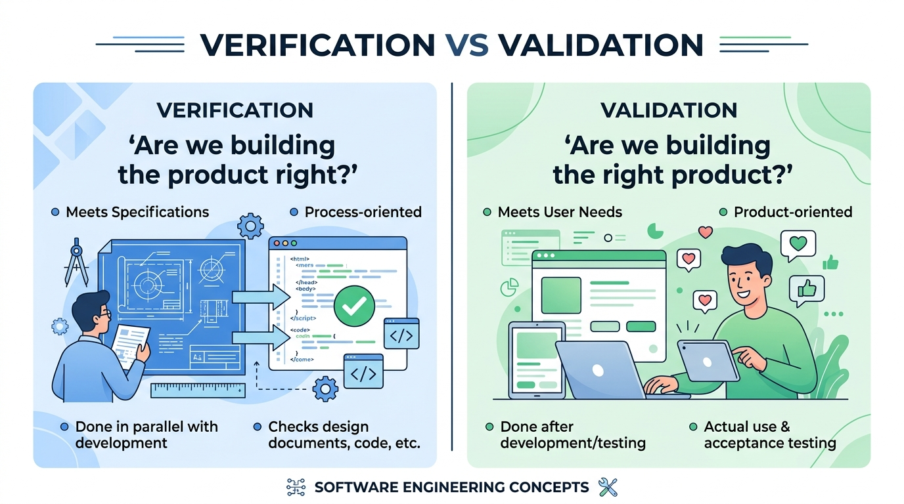
</div>

---

### 2. 缺失測試 vs 確認測試 & 3. 靜態 vs 動態測試

<div class="two-columns">
<div class="card">

### 💥 缺失測試 vs 確認測試
- **缺失測試 (Defect Testing)**：目的在於「找出缺陷、搞壞系統」，採極端與破壞性邊界輸入
- **確認測試 (Validation Testing)**：目的在於「向客戶證明符合需求」，循序驗證 Happy Path

</div>
<div class="card">

### ⚡ 靜態測試 vs 動態測試
- **靜態測試 (Static)**：**不執行程式碼**，透過同儕審查、靜態語法樹分析 (SonarQube, PMD)
- **動態測試 (Dynamic)**：**實際執行程式碼**，給定具體輸入並比對實際輸出與預期結果

</div>
</div>

---

### 4. 功能測試（黑箱） vs 結構測試（白箱）

<div class="two-columns">
<div class="card">

### 📦 黑箱功能測試 (Black-Box)
- **規格導向**：受測系統為不透明的黑盒子
- **核心作法**：測試人員不看原始碼，依據需求規格 (SRS) 與邊界設計測資，驗證外部行為是否符合預期

</div>
<div class="card">

### 🔬 白箱結構測試 (White-Box)
- **結構導向**：受測系統為透明的玻璃盒子
- **核心作法**：檢視內部程式邏輯，依據陳述句、分支、條件與路徑設計測資，追求高程式碼涵蓋率

</div>
</div>

---

<!-- _class: full-image-slide -->

<div class="centered-image">
  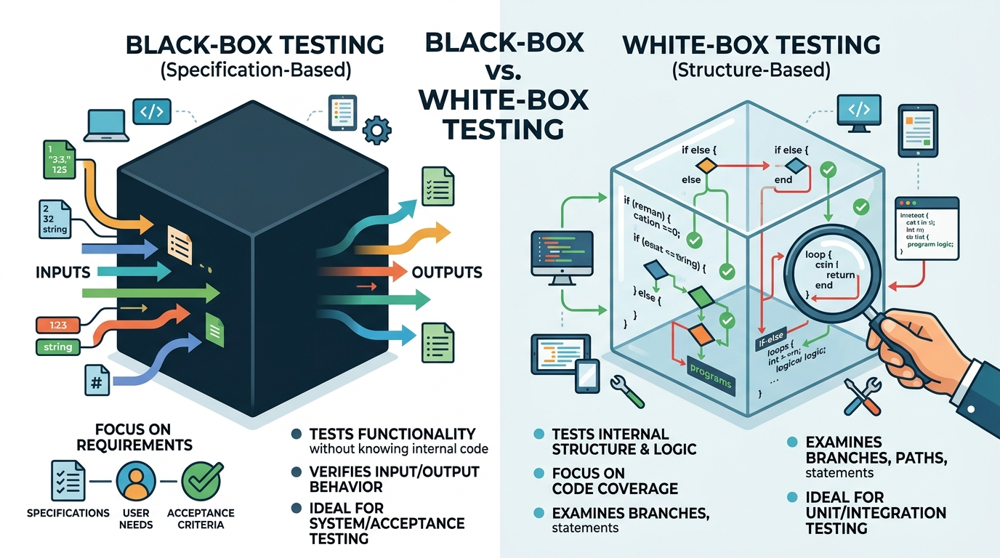
</div>

---

## 5. 三大核心測試層級 (Testing Levels)

- **1. Unit Testing (單元測試)**：
  - 針對最小獨立模組或方法（Class / Method）進行隔離驗證，執行極快（毫秒級）。
- **2. Integration Testing (整合測試)**：
  - 驗證跨模組介面、微服務 API 與資料庫之間的通訊協定與資料傳遞。
- **3. System Testing (系統測試)**：
  - 在完整模擬或真實環境中執行端到端 (E2E) 使用者工作流程與非功能需求驗證。

---

<!-- _class: full-image-slide -->

<div class="centered-image">
  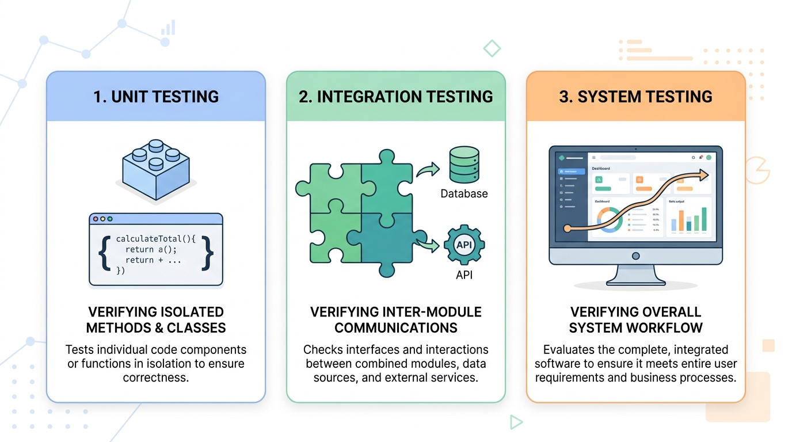
</div>

---

## 單元模組的可測試性設計 (Testability)

```java
// ❌ 不良設計：業務邏輯與 UI 輸入強耦合，無法自動化單元測試
double div(double x, double y) {
    while (y == 0) {
        y = input("除數不可為 0，請重新輸入："); // 強烈依賴 UI
    }
    return x / y;
}

// ✅ 良好設計：純邏輯模組，拋出明確例外，極易進行 JUnit 自動化測試
double div(double x, double y) {
    if (y == 0) {
        throw new IllegalArgumentException("除數不得為 0");
    }
    return x / y;
}
```

- 💡 **工程心法**：將核心運算邏輯與外部 I/O、UI 視圖徹底分離，大幅提升模組可測試性！

---

## 6. 現代實戰測試金字塔 (The Practical Test Pyramid)

- 🔺 **頂層：UI / E2E Tests (端到端測試)**：
  - 數量最少、執行最慢、維護成本最高（Playwright / Cypress）。
- 🔹 **中層：Integration / Service Tests (整合與服務測試)**：
  - 數量與速度適中，驗證 API 與資料庫合約（Testcontainers / Pact）。
- 🟩 **底層：Unit Tests (單元測試)**：
  - 數量最多、執行極快（毫秒級）、維護成本最低（JUnit 5 / Mockito）。
- ⚠️ **反模式：冰淇淋甜筒 (Ice Cream Cone)**：
  - 缺乏底層單元測試，過度依賴脆弱且昂貴的 UI E2E 測試，導致 CI 構建極端緩慢且頻繁假警報。

---

<!-- _class: full-image-slide -->

<div class="centered-image">
  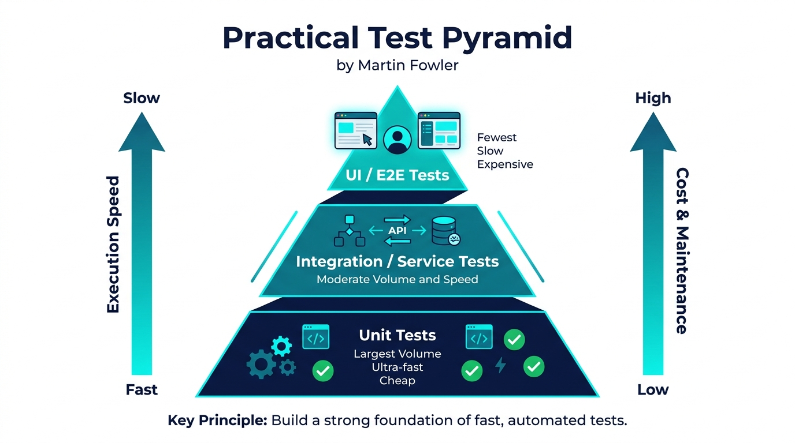
</div>

---

<!-- _class: lead -->
<!-- header: '[◄](#23) 3.4 V 開發模型與雙向追溯 [►](#39)' -->

# **3.4 V 開發模型與雙向追溯 (The V-Model)**

> 「規格設計在前，測試準備在先；  
> 水平對稱，雙向追溯。」

---

## V 開發模型的對稱架構

- **左側下降臂（開發與規格階段）**：
  - **1. Requirements Analysis (需求分析 - SRS)**：定義業務與使用者規格。
  - **2. High-Level Architecture (高階架構設計 - ADD)**：定義子系統與介面協定。
  - **3. Detailed Component Design (詳細模組設計 - SDD)**：定義單一類別與方法邏輯。
- **底部頂點（程式實作 Coding）**：
  - 將設計轉化為可執行的原始程式碼產物。
- **右側上升臂（測試驗證階段）**：
  - **Unit Testing (單元測試)** ⟷ 對應驗證 **詳細模組設計 (SDD)**。
  - **Integration Testing (整合測試)** ⟷ 對應驗證 **高階架構設計 (ADD)**。
  - **System / Acceptance Testing (驗收測試)** ⟷ 對應驗證 **需求規格 (SRS)**。

---

<!-- _class: full-image-slide -->

<div class="centered-image">
  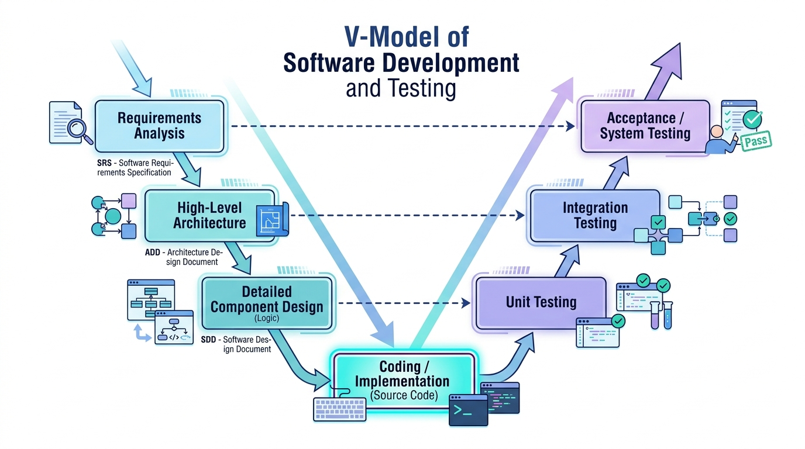
</div>

---

### 雙向追溯性 (Bidirectional Traceability)

<div class="two-columns">
<div class="card">

### 🔗 水平對稱追溯價值
- **測試設計前置同步產出**：在編寫程式碼前，驗收與整合測試計畫即已就緒
- **破除實作後測試偏差**：避免工程師先寫出程式碼，再依照自己實作邏輯去「拼湊測試」迎合結果

</div>
<div class="card">

### 📊 雙向追溯矩陣 (RTM)
- **正向追溯（覆蓋完整度）**：確保每一項 SRS 需求都有對應的測試案例予以驗證
- **反向追溯（理由與價值）**：確保每一筆測試案例都能清楚回溯至明確的業務合約來源

</div>
</div>

---

<!-- id: sqa-ch03-ccq3 -->
## 🙋 概念核對問答 (CCQ 3)

<div class="ccq-columns">
  <div class="ccq-text">

**問題**：在標準 V 開發模型中，依據「高階架構設計文件 (ADD)」所定義的模組介面與通訊協定，所對應執行的測試層級為何？

- **A.** 單元測試 (Unit Testing)
- **B.** 整合測試 (Integration Testing)
- **C.** 驗收測試 (Acceptance Testing)
- **D.** 靜態程式碼檢視 (Code Review)

  </div>
  <div class="ccq-logo">
    <a href="https://nlhsueh.github.io/nickedupocket/#/student/sqa-ch03-ccq3"></a>
    <br><a href="https://nlhsueh.github.io/nickedupocket/#/student/sqa-ch03-ccq3">[課堂互動]</a>
  </div>
</div>

---

<!-- _class: lead -->
<!-- header: '[◄](#34) 3.5 測試案例設計與 AI 協同 [►](#46)' -->

# **3.5 測試案例設計與 AI 協同**

> 「測試案例是測試架構的靈魂，  
> 測試資料只是代入的數值。」

---

## 測試案例、規格與程式行為的文氏圖關聯

- 📋 **規劃的行為 (Specified Behavior)**：規格書明訂的預期行為。
- 💻 **程序化的行為 (Programmed Behavior)**：實際被實作成 Code 的行為。
- 🧪 **驗證的行為 (Verified Behavior)**：測試案例實際涵蓋並驗證到的行為。
- 🎯 **區域解析**：
  - **區域 1 (黃金核心)**：有規格、有實作、且有被測試驗證（健康目標！）。
  - **區域 2**：規格有寫但工程師漏寫的未實作功能。
  - **區域 3**：規格未要求，工程師擅自寫出但有被測到的功能。
  - **區域 6**：規格未寫、未被測試、卻潛伏在程式中的**「未授權後門或隱蔽 Bug」**！

---

<!-- _class: title-image-slide -->

## 行為文氏圖 (Behavior Venn Diagram)

<div class="image-wrapper">
  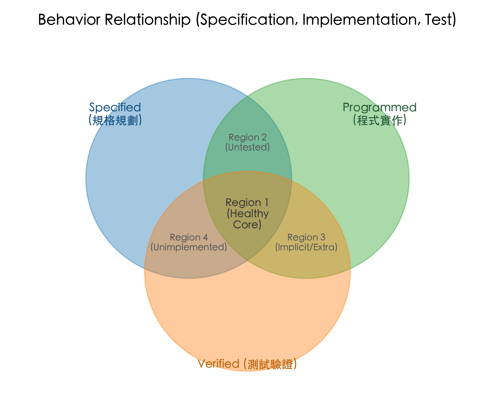
</div>

---

### 3.5.1 測試案例 (Test Case) vs 測試資料 (Test Data)

<div class="two-columns">
<div class="card">

### 📋 測試案例 (Test Case)
- **本質定義**：測試架構與邏輯分流的**整體規劃規格書**。
- **核心內涵**：包含前置狀態、操作步驟、預期產出與判定基準 (Oracle)。
- **價值所在**：定義「測試邏輯本身」，獨立於具體數值之外。

</div>
<div class="card">

### 🔢 測試資料 (Test Data)
- **本質定義**：具體代入受測方法執行的**數值元組與環境 Fixture**。
- **核心內涵**：如傳入參數 `(5, 0)`、Mock 假物件、資料庫種子。
- **價值所在**：落實測試案例的具體實例，用以觸發特定的執行路徑。

</div>
</div>


```
【測試案例規劃】：除法運算
├── 分母 = 0 ── 測試資料: (5, 0) ──> 預期: 拋出 IllegalArgumentException
└── 分母 != 0
    ├── 整除   ── 測試資料: (4, 2) ──> 預期: 2.0
    └── 不整除
        ├── 進位   ── 測試資料: (5.1, 3) ──> 預期: 1.7
        └── 不進位 ── 測試資料: (4, 3)   ──> 預期: 1.33
```

---

### 現代標準測試案例五大要件 (Test Case Anatomy)

<div class="two-columns">
<div class="card">

### 🆔 識別與環境前置 (要件 1 & 2)
- **Component 1 (Test ID & Summary)**：唯一識別碼（如 `TC-AUTH-001`）與簡明測試目的
- **Component 2 (Preconditions)**：執行前系統初始狀態、登入權限與資料庫 Fixtures

</div>
<div class="card">

### 🎯 輸入、預期與判定 (要件 3, 4, 5)
- **Component 3 (Inputs)**：傳入受測方法之具體參數、Payload 或事件
- **Component 4 (Expected Oracle)**：應回傳之正確值、HTTP 狀態碼或畫面渲染
- **Component 5 (Postconditions)**：執行後資料庫狀態驗證、不變量檢查與清理

</div>
</div>

---

<!-- _class: full-image-slide -->

<div class="centered-image">
  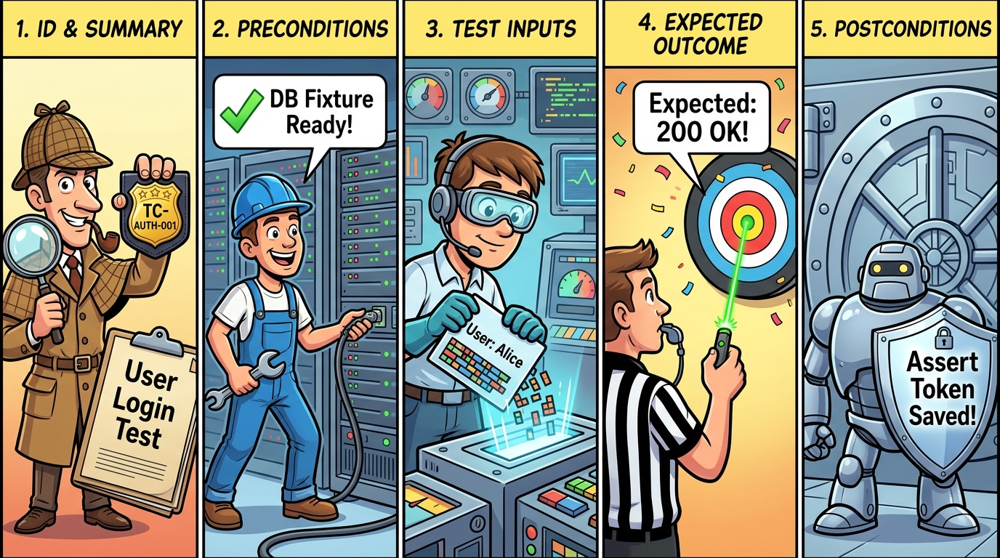
</div>

---

## 🤖 3.5.2 AI 輔助測試案例生成：人機協同黃金矩陣

| 項目 | 人類工程師的優勢 | AI (LLM) 助手的優勢 | 人機協同黃金 SOP (SQA 2.0) |
| :--- | :--- | :--- | :--- |
| **規格與不變量定義** | ⭐⭐⭐ 深刻理解領域商業價值與法律合約 | ⭐ 缺乏真實商業感知，易產生荒謬假設 | **人類主導**：定義前置/後置條件與狀態不變量 |
| **邊界與極端測資生成** | ⭐ 人腦易疲勞、易遺漏冷門 Unicode/極大值 | ⭐⭐⭐ 秒速生成數千組極端字串、溢位邊界 | **AI 輔助**：批量生成邊界與攻擊 Payload |
| **測試結果仲裁 (Oracle)** | ⭐⭐⭐ 具備客觀真理的最終仲裁權 | ⭐ 自我印證偏誤，易產生假綠燈斷言 | **人類審查**：審查斷言邏輯並納入 CI 自動化 |

---

<!-- _class: lead -->
<!-- header: '[◄](#39) 3.6 測試全景 3W2H 與 Test Oracle [►](#56)' -->

# **3.6 測試全景 3W2H 與 Test Oracle**

> 「5 大維度看透測試全景；  
> 突破 AI 時代的測試預言機難題。」

---

<!-- _class: full-image-slide -->

<div class="centered-image">
  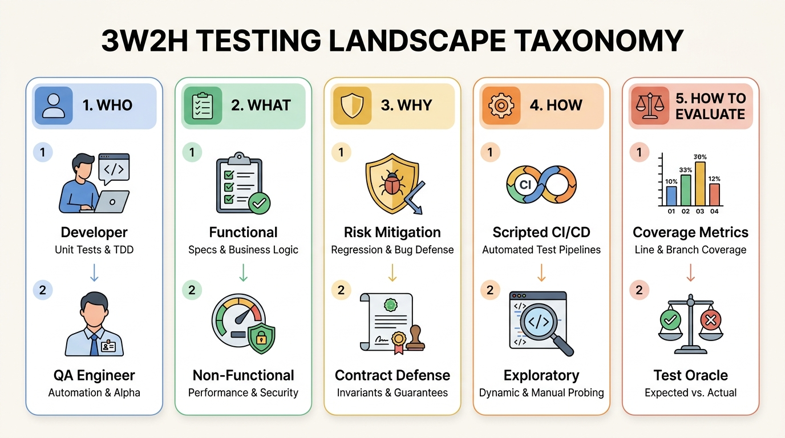
</div>

---

## 面向一：Who 誰來測試？

- 👨‍💻 **開發工程師**：單元測試 (Unit Test)、TDD、白箱路徑驗證。
- 👥 **結對夥伴 (Pair)**：Pair Programming 即時程式碼審查與測試設計。
- 🛡️ **專職 QA 團隊**：Alpha Testing、自動化測試框架維護。
- 👔 **業務專家 (Domain Expert)**：業務邏輯與驗收測試。
- 🌐 **外部真實使用者**：Beta Testing。

| 比較項目 | Alpha Testing | Beta Testing |
| :--- | :--- | :--- |
| **執行場所** | 開發團隊內部受控環境 | 客戶端真實生產/測試環境 |
| **受測對象** | 內部人員 / 模擬資料 | 外部真實使用者 / 真實業務資料 |
| **測試方法** | 白箱 + 黑箱混合 | 純黑箱測試 |

---

## 面向二：What 測什麼？& 面向三：Why 為何測試？

- **What 測什麼？**
  - **功能測試**：規格測試、等價劃分、邊界分析、欄位格式。
  - **結構測試**：陳述句涵蓋、分支涵蓋、路徑涵蓋、MC/DC。
  - **情境測試 (Scenario)**：模擬真實世界複雜連鎖使用者工作流程。
  - **非功能測試**：負載 (Load)、耐力 (Soak)、資安 (Security)、相容性 (Compatibility)。
- **Why 為何測試？**
  - **風險驅動**：變更風險、架構耦合風險、第三方依賴風險。
  - **合約與防禦驗證**：確保狀態不變量與資源限制。
  - **迴歸測試 (Regression Testing)**：確保新變更未破壞既有功能（Retest All, Selection, Prioritization）。

---

## 面向四：How 如何測試？

- **腳本測試 (Scripted Testing)**：
  - 依預先定義之步驟與斷言自動化批量執行。
- **探索性測試 (Exploratory Testing)**：
  - 測試者邊學習系統邊動態設計測資，發揮工程直覺挖掘潛在弱點。
- **猴子測試 / 隨機測試 (Monkey / Random Test)**：
  - 注入大量隨機事件檢驗系統強固性與容錯力。
- **錄製與回放 (Record & Replay)**：
  - 透過使用者操作軌跡錄製自動生成端到端測試腳本。

---

<!-- _class: title-image-slide -->

## 錄製與回放架構流程 (Record & Replay Flow)

<div class="image-wrapper">
  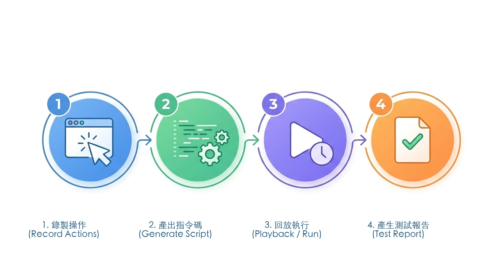
</div>

---

## 面向五：How to Evaluate 如何評估通過？與 Test Oracle

- **涵蓋率指標**：語句、分支、路徑覆蓋率。
- **變異分數 (Mutation Score)**：使用 PIT 注入故障，檢驗測試套件殺死變異體的能力。
- **什麼是 Test Oracle（測試預言機）？**
  - 指**能夠判斷受測程式輸出是否正確的機制或基準**。
- **Test Oracle Comparator 比對架構**：
  - 輸入同時餵入「受測程式 (PUT)」與「測試預言機 (Oracle)」，由斷言比對實際輸出與預期結果：
    - **Match (一致)** ➔ 測試 **PASS（通過 ✅）**
    - **Mismatch (不符)** ➔ 測試 **FAIL（缺陷判定 ❌）**

---

<!-- _class: full-image-slide -->

<div class="centered-image">
  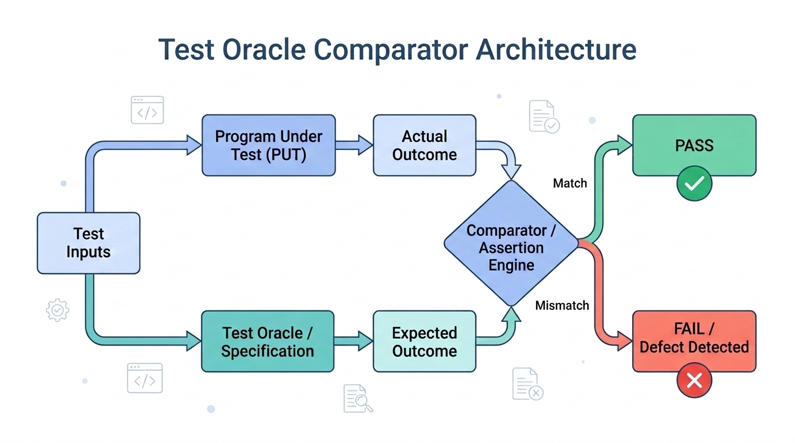
</div>

---

## 3.6.5 AI 與複雜系統中的 Test Oracle 難題

- **傳統確定性軟體**：
  - $f(x) \to y$（例如 $1 + 1 = 2$），Oracle 絕對明確且易驗證。
- **現代 AI / 搜尋推薦 / LLM Agent 的 Oracle 困境**：
  - 搜尋詞「最受歡迎的資工選修課」，引擎給出 10 筆結果，**沒有唯一的標準答案**！
  - 大語言模型生成文章具隨機性 (Temperature > 0) 與語意多樣性。

---

<!-- id: sqa-ch03-short1 -->
## 🙋 課堂互動：SQA 2.0 應對 Test Oracle 難題

<div class="ccq-columns">
  <div class="ccq-text">

**主題：如何為沒有唯一標準答案的 AI 與複雜系統建立 Test Oracle？**

- **1. 變質測試 (Metamorphic Testing)**：利用領域對稱不變量（貓圖片旋轉 10 度辨識結果仍為貓）
- **2. 差分測試 (Differential Testing)**：多模型交叉對比（Claude vs. GPT）
- **3. LLM-as-a-Judge 與 Guardrails**：使用評估模型檢驗忠實度與安全性

  </div>
  <div class="ccq-logo">
    <a href="https://nlhsueh.github.io/nickedupocket/#/student/sqa-ch03-short1"></a>
    <br><a href="https://nlhsueh.github.io/nickedupocket/#/student/sqa-ch03-short1">[課堂互動]</a>
  </div>
</div>

---

<!-- _class: lead -->
<!-- header: '[◄](#46) 3.7 綜合練習與實戰思維 [►](#59)' -->

# **3.7 綜合練習與實戰思維**

> 「將原則內化為直覺，  
> 以架構捍衛品質。」

---

## 3.7 綜合練習 (1/2)

- **一、測試原則與理論辨析**：
  1. 為了確保軟體絕對正確，我們是否應該進行窮盡式測試（Exhaustive Testing）？為什麼？
  2. 說明何謂測試的「殺蟲劑效應（Pesticide Paradox）」？當使用 AI 輔助生成測試時，為什麼更容易產生殺蟲劑效應？
  3. 比較 Verification 與 Validation 的核心差異。
- **二、V 模型與追溯**：
  4. 依據 V 開發模型，需求規格書 (SRS) 確定後，應同步規劃哪一項測試計畫？
  5. 試以 V 模型說明「規格設計在前、測試準備在先」如何避免實作後測試偏差。

---

## 3.7 綜合練習 (2/2)

- **三、測試案例與 Test Oracle 設計**：
  6. 針對以下函式，設計完整的測試案例（包含前置條件、輸入與預期輸出）：
     - 計算最大公因數 `int getGCD(int x, int y);`
     - 陣列排序 `int[] sort(int[] data);`
  7. 假設你要測試一個無法手算預期結果的巨量文字搜尋引擎演算法，請提出 2 種 Test Oracle（如變質關係或差分策略）來驗證其排序正確性。
- **四、場景綜合分析**：
  8. 某網頁系統申請帳號時需輸入：帳號、Email、手機號碼、國籍與年齡。請列出你的黑箱測試等價類劃分策略。
  9. 在一個西洋棋/象棋系統中，棋子由 $(x_1, y_1)$ 移動到 $(x_2, y_2)$，請列舉出至少 4 個必須防禦的邊界與不變量測試案例。

---

<!-- _class: lead -->
<!-- header: '[◄](#56) 附錄：課堂互動參考解答 [►](#1)' -->

# **附錄：課堂互動參考解答**

> 各題答案與關鍵解析

---

## 課堂互動參考解答

- **CCQ 1（契約三要素之呼叫者責任）**：
  - **正確答案：A**
  - 前置條件 (Preconditions) 是呼叫者必須滿足的契約條件，用以保護被呼叫方法免於非法輸入；後置條件由被呼叫者保證；類別不變量為物件生命週期中必須維持之約束。
- **CCQ 2（AI 測試全綠燈但違反法規）**：
  - **正確答案：B**
  - AI 為自身生成之程式碼寫測試會陷入自我印證的殺蟲劑抗藥性；且程式碼無編譯錯誤不等於符合業務與法規需求（無錯謬誤）。
- **CCQ 3（高階架構設計對應測試層級）**：
  - **正確答案：B**
  - 高階架構設計 (ADD) 定義子系統與模組間的 API 介面與資料傳遞協定，其直接對應的驗證層級為整合測試 (Integration Testing)。
- **short1（Test Oracle 難題破解）**：
  - 利用變質關係（輸入微幅變換不變量）、差分比對（雙演算法對照）與裁判模型 (LLM-as-a-Judge) 突破無單一標準答案之瓶頸。

<script>
(function() {
  function initHeaderDropdown() {
    const sections = [];
    const seenTitles = new Set();
    const slideSections = document.querySelectorAll("section[id]");
    
    // 1. Scan unique section titles and their slide IDs
    slideSections.forEach(sec => {
      const header = sec.querySelector("header");
      if (!header) return;
      
      let title = header.textContent.trim();
      title = title.replace(/^[◄◀]\s*/, "").replace(/\s*[►▶]$/, "").trim();
      if (!title || seenTitles.has(title)) return;
      
      seenTitles.add(title);
      sections.push({
        id: sec.id,
        title: title
      });
    });

    if (sections.length === 0) return;

    // Helper to create the dropdown DOM
    function createDropdownWrapper(currentTitle) {
      const wrapper = document.createElement("span");
      wrapper.className = "header-nav-wrapper";
      
      const titleSpan = document.createElement("span");
      titleSpan.className = "header-nav-title";
      titleSpan.title = "點擊固定或懸停查看所有章節快速跳轉";
      titleSpan.innerHTML = currentTitle + "<span class=\"nav-caret\"> ▾</span>";
      
      titleSpan.addEventListener("click", function(e) {
        e.stopPropagation();
        const wasOpen = wrapper.classList.contains("is-open");
        document.querySelectorAll(".header-nav-wrapper.is-open").forEach(w => w.classList.remove("is-open"));
        if (!wasOpen) {
          wrapper.classList.add("is-open");
        }
      });
      
      const dropdown = document.createElement("div");
      dropdown.className = "nav-dropdown";
      
      dropdown.addEventListener("click", function(e) {
        e.stopPropagation();
      });
      
      const dropHeader = document.createElement("div");
      dropHeader.className = "nav-dropdown-header";
      dropHeader.innerHTML = "<span>📑 快速跳轉章節目錄</span><span style=\"font-size:11px;font-weight:normal;color:#64748b;\">共 " + sections.length + " 個章節</span>";
      dropdown.appendChild(dropHeader);
      
      const grid = document.createElement("div");
      grid.className = "nav-dropdown-grid";
      
      sections.forEach(s => {
        const item = document.createElement("a");
        const isActive = (s.title === currentTitle);
        item.className = "nav-dropdown-item" + (isActive ? " active" : "");
        item.href = "#" + s.id;
        item.innerHTML = "<span class=\"badge\">#" + s.id.padStart(2, "0") + "</span><span class=\"item-text\" title=\"" + s.title + "\">" + s.title + "</span>";
        
        item.addEventListener("click", function(e) {
          wrapper.classList.remove("is-open");
          dropdown.style.display = "none";
          window.location.hash = "#" + s.id;
          setTimeout(() => { dropdown.style.display = ""; }, 350);
        });
        
        grid.appendChild(item);
      });
      
      dropdown.appendChild(grid);
      wrapper.appendChild(titleSpan);
      wrapper.appendChild(dropdown);
      return wrapper;
    }

    // Close any pinned dropdown when clicking anywhere outside
    document.addEventListener("click", function(e) {
      if (!e.target.closest(".header-nav-wrapper")) {
        document.querySelectorAll(".header-nav-wrapper.is-open").forEach(w => w.classList.remove("is-open"));
      }
    });

    // 2. Enhance each header element across all slides
    slideSections.forEach(sec => {
      const header = sec.querySelector("header");
      if (!header || header.dataset.navEnhanced) return;
      header.dataset.navEnhanced = "true";
      
      const links = header.querySelectorAll("a");
      let prevLink = null;
      let nextLink = null;
      
      links.forEach(a => {
        const txt = a.textContent.trim();
        if (txt === "◄" || txt === "◀") prevLink = a;
        if (txt === "►" || txt === "▶") nextLink = a;
      });
      
      let title = header.textContent.trim();
      title = title.replace(/^[◄◀]\s*/, "").replace(/\s*[►▶]$/, "").trim();
      if (!title) return;
      
      header.innerHTML = "";
      if (prevLink) {
        prevLink.className = "header-nav-arrow";
        prevLink.title = "上一章節";
        header.appendChild(prevLink);
        header.appendChild(document.createTextNode(" "));
      }
      
      const wrapper = createDropdownWrapper(title);
      header.appendChild(wrapper);
      
      if (nextLink) {
        header.appendChild(document.createTextNode(" "));
        nextLink.className = "header-nav-arrow";
        nextLink.title = "下一章節";
        header.appendChild(nextLink);
      }
    });
  }

  if (document.readyState === "loading") {
    document.addEventListener("DOMContentLoaded", initHeaderDropdown);
  } else {
    initHeaderDropdown();
  }
  setTimeout(initHeaderDropdown, 400);
})();
</script>
