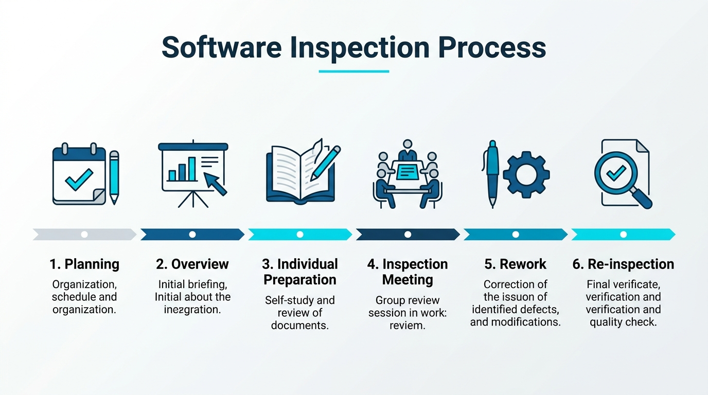
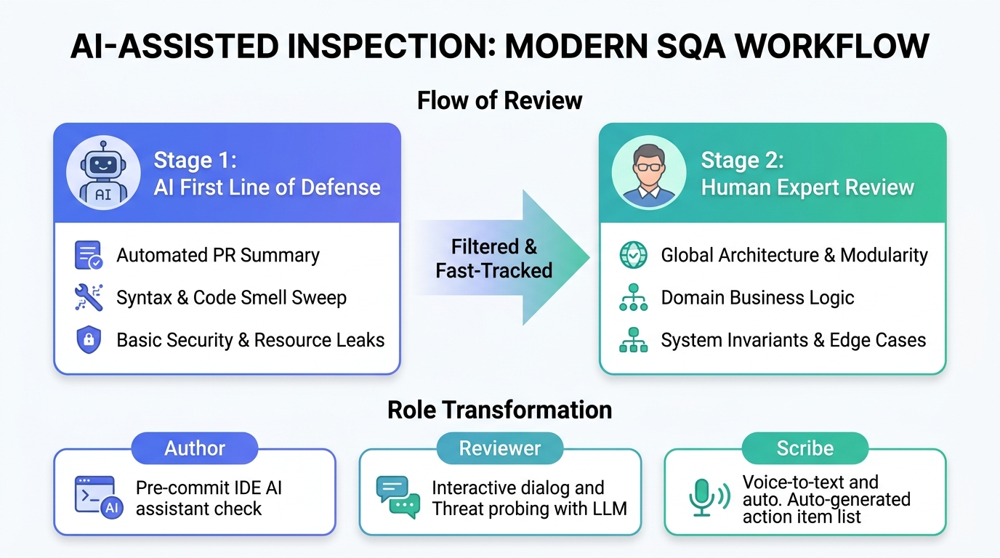
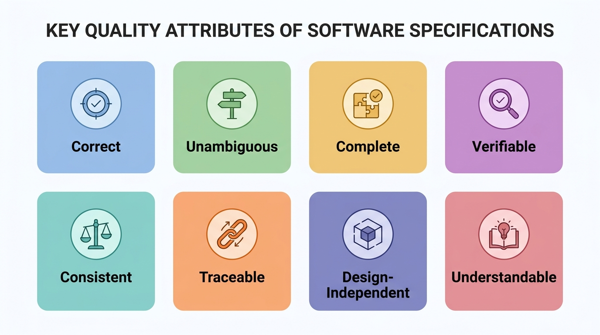
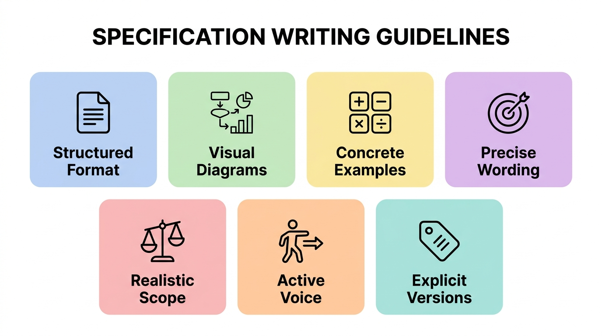
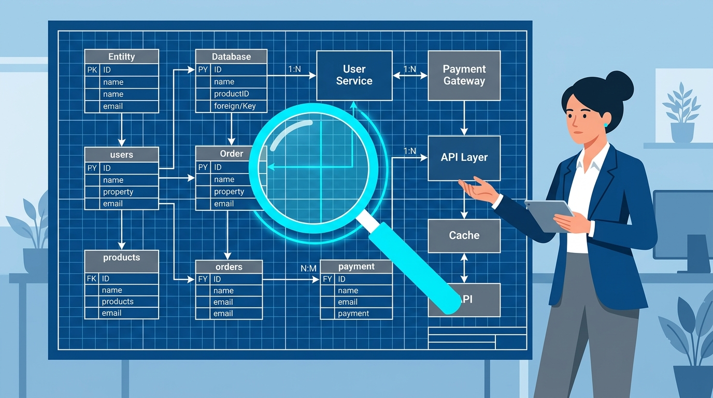
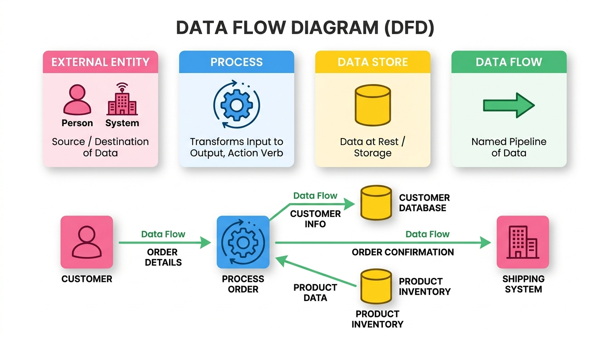
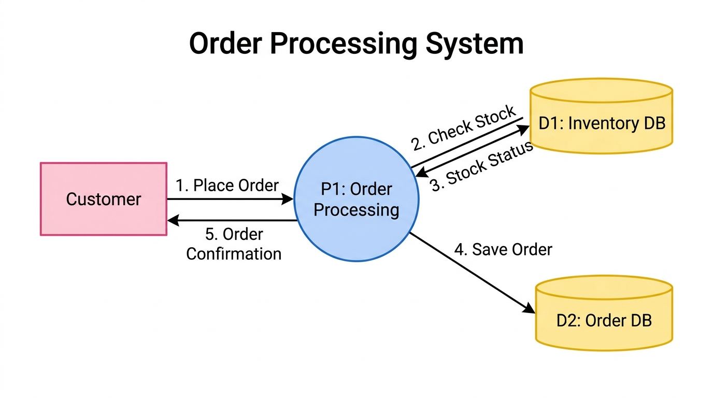
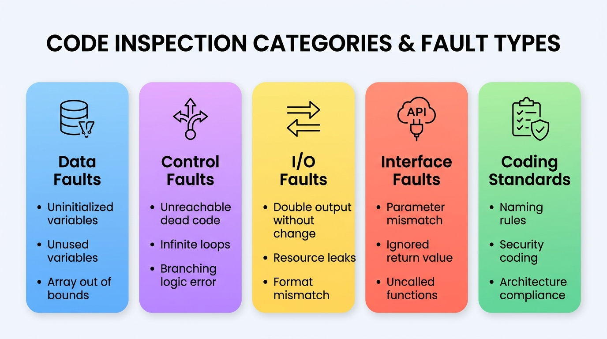

# 軟體品質與測試

### 第 4 章：軟體檢視、靜態程式碼分析與安全性防護

授課教師：薛念林 教授

> 到了測試階段才突然重視起品質，為時已晚。  
> 同儕找到錯誤，絕對比顧客在線上找到錯誤好上一萬倍。  
> —— Michael Fagan (軟體檢視發明人)

---

<!-- _class: outline-slide -->
<!-- header: '[◄](#1) 本章大綱 (Outline) [►](#3)' -->

## 本章重點導讀 (Key Highlights)

<div class="outline-columns">
<div>

### 🧭 檢視哲學與流程標準
- **4.1 軟體檢視概念與前置條件**：
  - 軟體測試的「冰山比喻」：靜態檢視 vs. 動態執行互補
  - 檢視前置條件與組織品質社群文化
- **4.2 檢視方法與 AI 現代實踐**：
  - IEEE 1028 審查體系：檢視 (Inspection) vs. 走查 (Walkthrough)
  - Fagan 檢視 6 大標準流程與 5 大核心角色分工
  - 2026 AI PR 機器人先行 + 人類專家把關之典範轉移
- **4.3 需求與規格檢視 (SRS Review)**：
  - SRS 8 大核心品質屬性（正確、無歧義、完整、可驗證等）
  - 規格書 7 大撰寫準則與雙向追溯 (Bidirectional Traceability)

</div>
<div>

### 📐 模型審查與程式碼防禦
- **4.4 軟體設計檢視 (Design Review)**：
  - 系統架構、介面契約與資料庫 Schema 審查
  - 設計模型檢核：DFD 4 大核心元素與平衡規則
  - AI 威脅建模 (Threat Modeling) 與風險推演
- **4.5 程式碼檢視與安全漏洞 (Code Review)**：
  - 團隊 Clean Code 審查查核清單與程式錯誤 5 大分類
  - Martin Fowler 經典程式臭味 (Code Smells) 與重構手法
  - OWASP Top 10 核心資安漏洞防範與 PMD 靜態分析
- **4.6 檢視成效評估度量**：
  - 缺失偵測效率 (EDE)、成本效用比與缺陷移除率 (DRL)

</div>
</div>

---

<!-- _class: lead -->
<!-- header: '[◄](#2) 4.1 基本概念 [►](#9)' -->

# **4.1 基本概念**

> 「動態測試只能看見浮出水面的冰山一角；  
> 唯有靜態檢視，能深入水下根除架構暗礁。」

---

<!-- header: '[◄](#2) 4.1 基本概念 [►](#9)' -->

## 軟體測試的「冰山比喻」

<div class="card-deck">

* > 💡 動態執行就像用手電筒照海面，每次只能照亮特定情境；靜態檢視則是抽乾海水，全面盤點結構問題。

<div class="content-columns">
<div class="content-text">

### 🧊 為何動態測試只能看到冰山一角？
- **路徑覆蓋限制**：現代系統狀態組合龐大，動態測試受限於測資與環境，很多邊界邏輯極難被觸發。
- **錯誤遮蔽效應**：前段發生的錯誤往往遮蔽後續邏輯，使多個致命缺陷無法在單次測試中被同時揭露。
- **程式碼範例警示**：
  ```java
  for (int i = 1; i < max; i++) { ... } // 陣列下標從 1 開始？
  ```
  資深工程師一眼就能看出 `i = 1` 漏掉索引 0，但動態測試若測資剛好沒驗證首個元素，錯誤便永遠沉入海底。

</div>
<div class="content-figure">


</div>
</div>
</div>

---

<!-- header: '[◄](#2) 4.1 基本概念 [►](#9)' -->

## 靜態檢視 vs. 動態測試：互補而非取代

<div class="card-deck">

* > 💡 軟體檢視是技術活動，更是建立企業品質文化的「社群活動 (Social Activity)」。

<div class="two-columns">
<div class="card" data-marpit-fragment>

### 🔍 靜態檢視的核心優勢
- **根源性除錯**：單次檢視可同時揪出多個根本缺陷，不受錯誤遮蔽影響。
- **全生命週期適用**：不只看程式碼，需求規格書、架構圖、測試案例皆可檢視。
- **知識傳承與文化沉澱**：透過資深與新進工程師交流，建立統一工程標準。
- **異常早期捕獲**：識別風格不符、未沿用組織元件、資源洩漏等動態難察異常。

</div>
<div class="card" data-marpit-fragment>

### ⚖️ 兩者的互補本質
- **動態測試不可或缺**：效能瓶頸、記憶體抖動、高並發競爭條件等，必須靠動態執行驗證。
- **不是取代，而是左移互補**：檢視負責在編譯前清掃 70% 語意與架構壞味道，動態測試專注系統整合行為。
- **反對冷冰冰的批鬥**：檢視的目的是「審查產出物，非評判開發者個人」，營造信任共贏氛圍。

</div>
</div>
</div>

---

<!-- header: '[◄](#2) 4.1 基本概念 [►](#9)' -->

## 軟體檢視的必要前置條件

<div class="card-deck">

* > 💡 沒有規格與準則的檢視只會淪為主觀爭執；成熟的檢視需要制度與資源的強力支撐。

<div class="two-columns">
<div class="card" data-marpit-fragment>

### 📋 文件與工程基準
- **明確基準規格**：必須備妥經確認的需求規格書或架構設計書作為客觀比對基準。
- **統一組織標準**：團隊成員必須熟知命名規則、架構模式與 Clean Code 守則。
- **基準版本凍結**：受檢程式碼必須是通過本地編譯與基礎單元測試之特定凍結版本。
- **準備專業檢核表**：使用結構化 Checklist 導引檢視方向，防止遺漏重要面向。

</div>
<div class="card" data-marpit-fragment>

### 🏢 管理層的承諾與文化
- **接受初期成本投入**：管理者需理解檢視在前期耗費時間，但能數倍節省後期除錯成本。
- **嚴禁當成員工績效考核**：若將發現的 Bug 數量作為懲處考核，工程師將隱瞞問題。
- **提供充足準備時間**：確保檢視者在會前有充裕時間研讀程式碼，杜絕倉促走過場。
- **配置追蹤工具**：配備問題追蹤（Issue Tracking）系統落實缺失修正閉環。

</div>
</div>
</div>

---

<!-- header: '[◄](#2) 4.1 基本概念 [►](#9)' -->

## 概念核對問答 (CCQ 1)

<div class="ccq-columns">
<div class="ccq-text">

<!-- id: sqa-ch04-ccq1 -->
#### 🙋 **概念核對問答 (CCQ 1)**

**問題情境**：  
【是非題】靜態測試（如軟體檢視、規格檢視）可以在程式碼實際編譯執行之前，檢查需求、設計、程式碼甚至測試資料中的異常，以早期發現錯誤、大幅降低整體的軟體品質成本。

- **A)** 正確 (True)
- **B)** 錯誤 (False)

</div>
<div class="ccq-logo">


[課堂互動](https://nlhsueh.github.io/nickedupocket/#/student/sqa-ch04-ccq1)

</div>
</div>

---

<!-- _class: lead -->
<!-- header: '[◄](#2) 4.2 檢視方法 [►](#18)' -->

# **4.2 檢視方法**

> 「正式檢視比非正式走查嚴謹數倍；  
> 讓 AI 先行掃雷，人類專家方能聚焦於全局智慧。」

---

<!-- header: '[◄](#2) 4.2 檢視方法 [►](#18)' -->

## IEEE 1028 審查體系：檢視 vs. 走查

<div class="card-deck">

* > 💡 依據 IEEE 1028 標準，不同審查形式在正規度、計畫性與主導角色上有著嚴格區分。

<div class="two-columns">
<div class="card" data-marpit-fragment>

### 📊 審查形式對照表
| 維度 | 檢視 (Inspection) | 走查 (Walkthrough) |
| :--- | :--- | :--- |
| **形式** | **正式 (Formal)** | 非正式 (Informal) |
| **計畫** | 事先規劃成員角色 | 彈性發起、無嚴密計畫 |
| **導讀** | 獨立導讀者 (Reader) | **作者本人 (Author)** |
| **記錄** | 專屬記錄者 (Scribe) | 通常由作者兼任 |
| **主持** | **協調者 (Moderator)** | 無正式主持人 |

</div>
<div class="card" data-marpit-fragment>

### 🎯 適用場景與決策考量
- **檢視 (Inspection)**：
  - 核心關鍵模組、高風險規格、架構重大變更。
  - 強調以客觀第三者角度找出缺陷，防範作者當局者迷。
- **走查 (Walkthrough)**：
  - 新人教育訓練、早期概念探索、團隊技術分享。
  - 主要目的在於傳達設計思維，而非嚴格的品質把關。

</div>
</div>
</div>

---

<!-- header: '[◄](#2) 4.2 檢視方法 [►](#18)' -->

## Fagan 檢視 6 大標準步驟

<div class="card-deck">

* > 💡 1976 年 IBM Michael Fagan 提出的經典檢視流程，被軟體工程界公認為最具實效的除錯典範。

<div class="content-columns">
<div class="content-text">

### 🔄 六大標準步驟推進
- **1. 計畫 (Planning)**：指派角色、分配職責、排定時間表。
- **2. 概述 (Overview)**：由作者向小組簡報背景脈絡與規格規則。
- **3. 個別準備 (Preparation)**：檢視者會前獨立研讀材料，標記潛在缺陷。
- **4. 檢視會議 (Meeting)**：導讀者逐段朗讀，聚焦找錯、記錄，**不辯論解法**。
- **5. 重做 (Rework)**：作者依缺失清單修改文件或程式碼。
- **6. 追蹤再檢 (Follow-up)**：由主席確認所有修正通過驗收。

</div>
<div class="content-figure">



</div>
</div>
</div>

---

<!-- header: '[◄](#2) 4.2 檢視方法 [►](#18)' -->

## 檢視團隊 5 大核心角色分工

<div class="card-deck">

* > 💡 清楚的角色分工能避免「原作者自圓其說」與「會議淪為個人批鬥」的無效困境。

<div class="two-columns">
<div class="card" data-marpit-fragment>

### 👥 主持、導讀與記錄
- **主席/協調者 (Moderator)**：
  - 會議靈魂人物，嚴格控管時間、化解衝突、維持議程聚焦於「找錯而非爭辯解法」。
- **導讀者/報告者 (Reader)**：
  - 由非作者的資深同儕逐段朗讀並轉譯邏輯，藉由口頭轉述迅速暴露邏輯盲點。
- **記錄者 (Scribe)**：
  - 專注登錄缺陷類型、嚴重程度與修復負責人，產出結構化行動清單 (Action Items)。

</div>
<div class="card" data-marpit-fragment>

### 🛠️ 作者與檢視專家
- **作者/擁有者 (Author)**：
  - 負責在 Overview 階段簡報背景，在會議中保持聆聽，會後負責缺陷修復。
- **檢視者 (Reviewer / Inspector)**：
  - 獨立審查員，從架構、效能、資安、邊界條件等多維度深入審查。
- **關鍵守則**：
  - 檢視速率應控制在 **200 ~ 400 LOC/Hr**，超過此速率遺漏率將急遽上升。

</div>
</div>
</div>

---

<!-- header: '[◄](#2) 4.2 檢視方法 [►](#18)' -->

## 2026 AI 輔助現代檢視：典範轉移

<div class="card-deck">

* > 💡 流程革命：從傳統「耗時耗力的純人工會議」，轉向「AI 機器人先行掃雷 + 人類專家深層把關」。

<div class="content-columns">
<div class="content-text">

### 🤖 AI 時代人機協同兩階段
- **Stage 1: AI 第一道防線（靜態審查）**：
  - 開發者送出 Pull Request 時，AI PR 機器人（如 PR-Agent、Cursor）自動分析變更。
  - 10 秒內掃除命名風格、未釋放資源、空指標風險與常見漏洞，並產出變更摘要。
- **Stage 2: 人類專家複審（聚焦智慧）**：
  - 人類審查員無需浪費精力看語法格式，全神貫注於 **全局系統架構、商業領域邏輯正確性與高並發狀態不變量**。

</div>
<div class="content-figure">



</div>
</div>
</div>

---

<!-- header: '[◄](#2) 4.2 檢視方法 [►](#18)' -->

## 檢視角色的 AI 賦能與終極防線

<div class="card-deck">

* > 💡 AI 雖然強大但存在幻覺與上下文盲區；人類工程師的最終決策依然是系統品質的終極守門人。

<div class="two-columns">
<div class="card" data-marpit-fragment>

### ⚡ 角色賦能升級
- **作者 (Author) ── 本地自檢預防**：
  - 在 IDE 內藉由 AI 進行 `/review`，在程式碼 Push 前掃除 80% 低階瑕疵。
- **記錄者 (Scribe) ── 語音即時轉文字**：
  - 會議中藉由 STT 工具自動分類缺陷，即時生成 Jira 任務與責任歸屬。
- **檢視者 (Reviewer) ── 智慧對話式審查**：
  - 讓 AI 模擬攻擊者視角或生成 10 組極端極限邊界測試案例輔助驗證。

</div>
<div class="card" data-marpit-fragment>

### ⚠️ AI 審查的盲點與警訊
- **上下文遺失 (Context Loss)**：AI 往往只看局部 Diff，無法洞察微服務分散式架構下的漣漪效應。
- **一本正經胡說八道 (Hallucination)**：給出看似精美但引用過期或不存在套件的修改建議。
- **工程結論**：
  > AI 是極佳的初審助手，但絕不能省略人類專家的架構決策與業務邏輯驗證！

</div>
</div>
</div>

---

<!-- header: '[◄](#2) 4.2 檢視方法 [►](#18)' -->

## 概念核對問答 (CCQ 2)

<div class="ccq-columns">
<div class="ccq-text">

<!-- id: sqa-ch04-ccq2 -->
#### 🙋 **概念核對問答 (CCQ 2)**

**問題情境**：  
在 Fagan 提出的軟體檢視（Inspection）標準流程中，下列哪一個階段的主要目的是由作者向檢視小組說明系統背景資料、規格與業務規則，而非進行實際的程式碼除錯？

- **A)** 準備 (Preparation)
- **B)** 概述 (Overview)
- **C)** 檢視會議 (Inspection Meeting)
- **D)** 重做 (Rework)

</div>
<div class="ccq-logo">


[課堂互動](https://nlhsueh.github.io/nickedupocket/#/student/sqa-ch04-ccq2)

</div>
</div>

---

<!-- _class: lead -->
<!-- header: '[◄](#2) 4.3 規格檢視 [►](#26)' -->

# **4.3 規格檢視**

> 「規格書寫錯一條，後續將以十倍工時重做；  
> 規格檢視是投資回報率最高的除錯手段。」

---

<!-- header: '[◄](#2) 4.3 規格檢視 [►](#26)' -->

## 系統規格書 (SRS) 8 大核心品質屬性

<div class="card-deck">

* > 💡 軟體需求規格書 (SRS) 是整個系統工程的基石；好的規格必須兼具技術嚴謹度與客觀驗證性。

<div class="content-columns">
<div class="content-text">

### 🎯 規格檢驗核心維度
- **1. 正確性 (Correct)**：每項要求皆準確代表系統真實建構目標。
- **2. 無歧義 (Unambiguous)**：敘述只有唯一解讀，杜絕模糊空間。
- **3. 完整性 (Complete)**：涵蓋所有功能、極端異常與邊界條件。
- **4. 可驗證性 (Verifiable)**：存在有限成本的客觀檢驗過程。
- **5. 一致性 (Consistent)**：內外部條款彼此不衝突、不矛盾。
- **6. 雙向追溯 (Traceable)**：具備前向與後向追溯性。
- **7. 設計獨立 (Design-Independent)**：只定義 What，不限制 How。
- **8. 易理解性 (Understandable)**：利害關係人皆能輕易讀懂。

</div>
<div class="content-figure">



</div>
</div>
</div>

---

<!-- header: '[◄](#2) 4.3 規格檢視 [►](#26)' -->

## 規格雙向追溯性 (Bidirectional Traceability)

<div class="card-deck">

* > 💡 雙向追溯能保證「不漏掉任何客戶需求」，同時杜絕工程師「憑空實作鍍金功能」。

<div class="two-columns">
<div class="card" data-marpit-fragment>

### 🔗 前向追溯 (Traceable Forward)
- **從需求向後看**：
  - 確保每一條「客戶需求 (User Need)」都能映射到具體的「系統規格 (SRS)」。
  - 規格再進一步對應到架構模組、實作程式碼與測試案例。
- **工程效益**：
  - 避免需求流失，確保 100% 的客戶承諾都被落實與測試。

</div>
<div class="card" data-marpit-fragment>

### 🔙 後向回溯 (Traced Backward)
- **從程式碼與測試往前看**：
  - 每一行程式碼、每一個 API、每一個測試案例都能回溯找到其來源需求。
- **工程效益**：
  - 杜絕**鍍金行為 (Gold Plating)**（實作未被授權且不必要的自嗨功能）。
  - 當需求變更時，能立即進行「衝擊分析 (Impact Analysis)」。

</div>
</div>
</div>

---

<!-- header: '[◄](#2) 4.3 規格檢視 [►](#26)' -->

## 規格書 7 大撰寫實戰準則

<div class="card-deck">

* > 💡 優秀的規格書能大幅降低工程溝通成本；掌握 7 大撰寫準則，消滅潛在需求模糊性。

<div class="content-columns">
<div class="content-text">

### ✍️ 實務檢核清單 (Writing Tips)
- **1. 結構化排版 (Structured)**：目錄、章節、術語縮寫定義表完整。
- **2. 視覺架構圖 (Visual)**：圖文並茂，圖形符號前後一致並附解說。
- **3. 具體範例 (Concrete)**：複雜算式附帶文字解釋與至少 2 個數據實例。
- **4. 精確用詞 (Precise)**：消滅「一些、通常、等等、依此類推」。
- **5. 務實邊界 (Realistic)**：慎用「總是、所有、絕不」，防極端失真。
- **6. 主動語態 (Active Voice)**：指明主體，避免「參數會被初始化」。
- **7. 明確版本 (Explicit Versions)**：精確標明支援的協定與套件版本。

</div>
<div class="content-figure">



</div>
</div>
</div>

---

<!-- header: '[◄](#2) 4.3 規格檢視 [►](#26)' -->

## 規格好壞實戰範例對抗

<div class="card-deck">

* > 💡 一個模糊的字眼，在實作階段會被解讀出十種不同版本；規格必須消除所有臆測空間。

<div class="two-columns">
<div class="card" data-marpit-fragment>

### ❌ 劣質規格敘述 (Ambiguous & Passive)
- ❌ 「系統應具備良好的回應速度，並適當支援行動裝置。」
  - *問題：什麼叫「良好」？哪些行動裝置？*
- ❌ 「使用者輸入錯誤時，參數會被重置，相關資訊將被記錄等等。」
  - *問題：被動句、誰來重置？「等等」包含什麼？*
- ❌ 「系統應總是防範所有惡意攻擊，絕不當機。」
  - *問題：過度絕對、脫離現實且不可驗證。*

</div>
<div class="card" data-marpit-fragment>

### ✅ 優質規格敘述 (Verifiable & Precise)
- ✅ 「在 1,000 並發使用者下，結帳 API 的 95 百分位響應時間需小於 1.2 秒；UI 需通過 iOS Safari 16+ 與 Android Chrome 110+ 渲染相容性測試。」
- ✅ 「若帳號密碼驗證失敗，認證模組 (AuthService) 需累計嘗試次數，超過 5 次時鎖定帳號 15 分鐘，並向 AuditLog 寫入安全事件紀錄。」

</div>
</div>
</div>

---

<!-- header: '[◄](#2) 4.3 規格檢視 [►](#26)' -->

## 概念核對問答 (CCQ 3)

<div class="ccq-columns">
<div class="ccq-text">

<!-- id: sqa-ch04-ccq3 -->
#### 🙋 **概念核對問答 (CCQ 3)**

**問題情境**：  
為了在需求與系統規格階段落實「雙向追溯 (Bidirectional Traceability)」，規格書應該確保具備下列何種關係特性？

- **A)** 每個使用者需求均可對應到特定的系統規格，且每個系統規格皆能回溯到其來源需求 (Traced & Traceable)
- **B)** 規格書的字數與最終系統原始程式碼行數必須成固定正比關係
- **C)** 每一行程式碼都必須直接對應到 UML 類別圖的所有屬性
- **D)** 規格書必須僅由開發人員撰寫，完全不允許顧客檢閱以防模糊焦點

</div>
<div class="ccq-logo">


[課堂互動](https://nlhsueh.github.io/nickedupocket/#/student/sqa-ch04-ccq3)

</div>
</div>

---

<!-- _class: lead -->
<!-- header: '[◄](#2) 4.4 設計檢視 [►](#34)' -->

# **4.4 設計檢視**

> 「程式碼是磚瓦，架構設計才是地基；  
> 挽救一個錯誤的架構，往往需要拆毀整棟大樓。」

---

<!-- header: '[◄](#2) 4.4 設計檢視 [►](#34)' -->

## 設計檢視的核心目的與多維度清單

<div class="card-deck">

> 💡 設計檢視 (Design Review) 是在 Coding 之前，針對架構模組、介面協定與資料庫 Schema 的靜態審查。

<div class="content-columns">
<div class="content-text">

### 🏛️ 五大核心檢核維度
- **1. 實體與介面完整性**：
  - 各模組具備唯一職責，介面契約（方法、參數、回傳值、前置/後置條件）精準無遺漏。
- **2. 高內聚與低耦合**：
  - 符合 High Cohesion, Low Coupling，杜絕循環依賴。
- **3. 需求追溯與功能完整**：
  - 逐一對照 SRS 需求，確保架構具備工程可行性。
- **4. 多維度架構視角**：
  - 涵蓋邏輯視角 (類別)、行程視角 (並行) 與實體部署視角。
- **5. 關鍵非功能議題**：
  - 例外復原、快取失效、單點故障 (SPOF) 與資源安全防護。

</div>
<div class="content-figure">



</div>
</div>
</div>

---

<!-- header: '[◄](#2) 4.4 設計檢視 [►](#34)' -->

## 設計模型檢核：DFD 4 大核心元素

<div class="card-deck">

* > 💡 資料流程圖 (DFD) 為結構化分析利器；利用語法嚴謹的模型特徵能進行高效率檢核。

<div class="content-columns">
<div class="content-text">

### 📊 DFD 四大要素檢核標準
- **1. 外部實體 (External Entity)**：
  - 系統邊界外的發送或接收者（人員或外部系統），絕不能直接存取內部資料儲存。
- **2. 處理過程 (Process)**：
  - 執行資料轉換，名稱必須以「**動詞 + 名詞**」命名（如「計算折扣」）。
  - **平衡法則**：每個 Process 必須至少有 1 個輸入與 1 個輸出（無輸入為黑洞，無輸出為奇蹟）。
- **3. 資料儲存 (Data Store)**：
  - 靜態儲存庫，必須至少有 1 個輸入（寫入）與 1 個輸出（讀取）。
- **4. 資料流 (Data Flow)**：
  - 有向箭頭，必須明確標註名詞資料標籤。

</div>
<div class="content-figure">



</div>
</div>
</div>

---

<!-- header: '[◄](#2) 4.4 設計檢視 [►](#34)' -->

## DFD 實戰檢核：訂單處理流程

<div class="card-deck">

* > 💡 透過標準 DFD 流程圖檢驗：資料流向是否合規？處理過程與資料儲存是否皆維持平衡？

<div class="content-columns">
<div class="content-text">

### 📦 訂單處理檢核鏈條
- **流程步序對照**：
  - `1. 提交訂單 (Place Order)`：顧客 (Customer) ➔ P1 訂單處理。
  - `2. 檢查庫存 (Check Stock)`：P1 ➔ D1 庫存資料庫（讀取查詢）。
  - `3. 庫存狀態 (Stock Status)`：D1 ➔ P1（回傳即時狀態）。
  - `4. 寫入訂單 (Save Order)`：P1 ➔ D2 訂單資料庫（寫入記錄）。
  - `5. 出貨確認 (Order Confirmation)`：P1 ➔ 顧客（回傳通知）。
- **檢核合規性分析**：
  - P1 具備 2 輸入、3 輸出 ➔ **完全平衡**。
  - D1/D2 皆具備讀寫機制 ➔ **合乎邏輯**。

</div>
<div class="content-figure">



</div>
</div>
</div>

---

<!-- header: '[◄](#2) 4.4 設計檢視 [►](#34)' -->

## AI 賦能現代設計檢視：威脅建模與契約檢查

<div class="card-deck">

* > 💡 利用大型語言模型模擬駭客視角與極端情境，讓架構設計在動工前就接受震撼教育。

<div class="two-columns">
<div class="card" data-marpit-fragment>

### 🛡️ AI 威脅建模與風險推演
- **架構輸入模擬**：
  - 將架構圖或 OpenAPI Spec 輸入 AI，讓 AI 代理以 STRIDE 模型進行威脅推演。
- **主動標記漏洞**：
  - 自動識別潛在風險：單點故障 (SPOF)、快取穿透/雪崩、資料庫連線池耗盡與分散式死結。
- **容錯與降級建議**：
  - 建議熔斷機制（Circuit Breaker）、限流（Rate Limiting）與重試指數退避策略。

</div>
<div class="card" data-marpit-fragment>

### 📜 API 契約與 DB Schema 審查
- **OpenAPI 規範一致性**：
  - 自動比對 RESTful URI 命名規則、HTTP 方法語意、錯誤碼規格（如 400, 401, 403, 404, 500）。
- **資料庫 Schema 審查**：
  - 分析 DDL 腳本，檢查外鍵是否遺漏索引、評估高頻欄位資料型態過大問題、檢查關聯刪除風險。
- **合約測試生成**：
  - 依據審查後的介面設計自動產出 Pact 測試腳本。

</div>
</div>
</div>

---

<!-- header: '[◄](#2) 4.4 設計檢視 [►](#34)' -->

## 概念核對問答 (CCQ 4)

<div class="ccq-columns">
<div class="ccq-text">

<!-- id: sqa-ch04-ccq4 -->
#### 🙋 **概念核對問答 (CCQ 4)**

**問題情境**：  
【是非題】設計檢視（Design Review）最理想的執行時機，是在系統所有模組的單元測試與整合測試皆通過之後，以確保實際產出的系統程式碼與設計文件完全相符。

- **A)** 正確 (True)
- **B)** 錯誤 (False)

</div>
<div class="ccq-logo">


[課堂互動](https://nlhsueh.github.io/nickedupocket/#/student/sqa-ch04-ccq4)

</div>
</div>

---

<!-- _class: lead -->
<!-- header: '[◄](#2) 4.5 程式碼檢視 [►](#45)' -->

# **4.5 程式碼檢視**

> 「任何笨蛋都能寫出電腦看得懂的程式碼；  
> 優秀的工程師寫的是人類看得懂的程式碼。」  
> —— Martin Fowler

---

<!-- header: '[◄](#2) 4.5 程式碼檢視 [►](#45)' -->

## 程式碼檢視 5 大錯誤類型

<div class="card-deck">

* > 💡 呼應第二章 Clean Code 心法，程式碼檢視將開發者個人自律昇華為「團隊制度化防禦防線」。

<div class="content-columns">
<div class="content-text">

### 🔍 靜態檢視 5 大致命缺陷維度
- **1. 資料錯誤 (Data Faults)**：
  - 變數未初始化即讀取、重複賦值未讀取、陣列越界、浮點數精準度陷阱。
- **2. 控制流程錯誤 (Control Faults)**：
  - 無效死碼 (Unreachable Dead Code)、無窮迴圈、深層巢狀階梯。
- **3. 輸入/輸出錯誤 (I/O Faults)**：
  - 檔案串流或資料庫連線未關閉、緩衝區溢位、未處理 I/O 例外。
- **4. 介面錯誤 (Interface Faults)**：
  - 參數型態/數量不吻合、忽略回傳值、未被呼叫的孤立函式。
- **5. 編碼規範違反 (Coding Standards)**：
  - 違反安全規範、架構分層穿透、魔術數字濫用。

</div>
<div class="content-figure">



</div>
</div>
</div>

---

<!-- header: '[◄](#2) 4.5 程式碼檢視 [►](#45)' -->

## 團隊 Clean Code 審查查核清單 (Checklist)

<div class="card-deck">

* > 💡 透過團隊 Checklists 讓 Code Review 具備一致的客觀尺度，避免流於個人主觀風格偏好。

<div class="two-columns">
<div class="card" data-marpit-fragment>

### 📐 結構與控制流程檢核
- **命名自明性**：
  - 名稱是否能精確表達意圖？杜絕 `temp`, `a1` 等神祕縮寫與魔術數字。
- **函式單一職責 (SRP)**：
  - 函式是否只做一件事？長度是否控制在 20 行以內？
- **控制流程複雜度**：
  - 是否運用**衛語句 (Guard Clauses)** 提早回傳？巢狀是否杜絕超過 2 層？

</div>
<div class="card" data-marpit-fragment>

### 🛡️ 防禦性與測試保護力
- **註解有效性**：
  - 註解是否只解釋「為什麼 (Why)」而非重複程式碼「做了什麼 (What)」？杜絕死碼殭屍註解。
- **健壯防禦性**：
  - 是否使用 Exception 取代錯誤碼？是否杜絕傳遞與回傳 `null`？杜絕空 catch 吞例外。
- **測試保護力**：
  - 提交的 PR 是否附帶單元測試？邊界案例是否具備對應驗證？

</div>
</div>
</div>

---

<!-- header: '[◄](#2) 4.5 程式碼檢視 [►](#45)' -->

## 程式臭味 (Code Smells) 概念與體系

<div class="card-deck">

* > 💡 Clean Code 是健康目標，Code Smells 是病徵警訊，Refactoring (重構) 則是處方藥。

<div class="content-columns">
<div class="content-text">

### 🦨 什麼是程式碼臭味？
- **名詞起源**：由 Kent Beck 與 Martin Fowler 提出，指程式碼表面看似能正確編譯執行，但結構上已顯露出腐化跡象。
- **核心危害**：
  - 臭味大幅降低可讀性，大幅提高後續維護與擴充成本。
  - 是系統缺陷、效能惡化與技術債 (Technical Debt) 的主要溫床。
- **重構手法 (Refactoring)**：
  - 在不改變軟體外部行為的前提下，逐步調整內部結構，消除臭味、重返 Clean Code。

</div>
<div class="content-figure">


</div>
</div>
</div>

---

<!-- header: '[◄](#2) 4.5 程式碼檢視 [►](#45)' -->

## 經典程式臭味剖析 (一)：肥大與結構失調

<div class="card-deck">

* > 💡 當類別與函式承載過多責任時，系統將失去彈性並成為人人不敢觸碰的「巨石怪獸」。

<div class="two-columns">
<div class="card" data-marpit-fragment>

### 🐘 肥大類別與冗長方法
- **重複程式碼 (Duplicated Code)**：
  - 罪惡之首！修復了一處卻遺漏另一處。
  - **解法**：提煉方法 (Extract Method) 或提升至父類別。
- **冗長方法 (Long Method)**：
  - 超過 100 行甚至 1000 行的怪獸函式。
  - **解法**：依處理邏輯提煉子方法，提高抽象層次。
- **大類別 (Large Class)**：
  - 包含數十個欄位與責任的大鍋菜。
  - **解法**：依職責提煉新類別 (Extract Class)。

</div>
<div class="card" data-marpit-fragment>

### 🎒 參數列與型別偏執
- **太長的參數列 (Long Parameter List)**：
  - 函式傳入 8~10 個參數，呼叫時極易傳錯位置。
  - **解法**：將參數封裝為參數物件 (Introduce Parameter Object)。
- **基本型別偏執 (Primitive Obsession)**：
  - 堅持用 `String` 或 `int` 表達電話、幣別、經緯度。
  - **解法**：建立微型值物件 (Value Object，如 `Money`, `Phone`)。
- **資料泥團 (Data Clumps)**：
  - 總是一起出現的欄位（如城市、街道、郵遞區號）。
  - **解法**：抽取成 `Address` 物件類別。

</div>
</div>
</div>

---

<!-- header: '[◄](#2) 4.5 程式碼檢視 [►](#45)' -->

## 經典程式臭味剖析 (二)：耦合與職責錯置

<div class="card-deck">

* > 💡 類別之間的關係應該是「相敬如賓」，過度依賴與親密將導致動一髮而動全身的骨牌效應。

<div class="two-columns">
<div class="card" data-marpit-fragment>

### 🔗 變更阻礙與散彈手術
- **散彈槍手術 (Shotgun Surgery)**：
  - 改動一個業務邏輯，必須在 10 個不同檔案中各改一行。
  - **解法**：將該變更概念搬移集中到單一模組 (Move Method / Field)。
- **發散變更 (Divergent Change)**：
  - 一個類別因為資料庫改動要修、因為報表格式改動也要修。
  - **解法**：依變更軸心拆分類別，符合單一職責原則。

</div>
<div class="card" data-marpit-fragment>

### 🤝 職責錯置與親密關係
- **依戀情結 (Feature Envy)**：
  - 類別 A 的某個方法頻繁呼叫類別 B 的 getter 進行運算。
  - **解法**：將該方法直接搬移至類別 B 中 (Move Method)。
- **過度的訊息串 (Message Chains)**：
  - 出現 `a.getB().getC().getD().doSomething()` 鏈條。
  - **解法**：隱藏委託 (Hide Delegate)，遵循迪米特法則。

</div>
</div>
</div>

---

<!-- header: '[◄](#2) 4.5 程式碼檢視 [►](#45)' -->

## 安全漏洞檢視：OWASP Top 10 全景

<div class="card-deck">

* > 💡 程式碼檢視不僅防範邏輯缺陷，更必須築起嚴密的資安防線；SAST 工具是落實安全的最佳盟友。

<div class="content-columns">
<div class="content-text">

### 🛡️ 權威資安指針 (OWASP Top 10)
- **A01 權限控制失效 (Broken Access Control)**：
  - 未經授權橫向越權存取他人敏感個資或管理者後台。
- **A02 加密機制失效 (Cryptographic Failures)**：
  - 密碼明文儲存、使用 MD5/SHA1 弱雜湊、配置硬編碼密鑰。
- **A03 注入攻擊 (Injection)**：
  - SQL 注入、OS 指令注入、跨網站指令碼 (XSS)。
- **A04 不安全設計 (Insecure Design)**：
  - 架構初期缺乏威脅建模與縱深防禦機制。
- **A05 安全設定錯誤 (Security Misconfiguration)**：
  - 預設帳密未改、生產環境暴露詳細錯誤堆疊 (Stack Trace)。

</div>
<div class="content-figure">


</div>
</div>
</div>

---

<!-- header: '[◄](#2) 4.5 程式碼檢視 [►](#45)' -->

## OWASP Top 10 重點防護與靜態分析

<div class="card-deck">

* > 💡 透過 PMD、SonarQube 與 Checkmarx 等靜態分析工具，在 CI/CD 流程中自動攔截惡意漏洞。

<div class="two-columns">
<div class="card" data-marpit-fragment>

### 🔒 關鍵資安檢視要點
- **防範 SQL 注入 (A03)**：
  - 嚴格禁止字串拼接 SQL，一律採用**參數化查詢 (PreparedStatement)** 或 ORM 框架綁定。
- **安全錯誤處理 (A05)**：
  - 嚴禁直接向前端拋出 `e.printStackTrace()`；前端回傳通用錯誤代碼，詳細資訊僅寫入後端受保護日誌。
- **相依套件掃描 (A06)**：
  - 透過 OWASP Dependency-Check 盤點第三方 Maven 套件，及時修補 CVE 漏洞。

</div>
<div class="card" data-marpit-fragment>

### 🛠️ PMD 靜態分析工具實戰
- **自動化常規掃描**：
  - 自動偵測未使用的變數、未關閉的串流、空 catch 區塊與複雜度超標方法。
- **品質閘門 (Quality Gate)**：
  - 在 Git Commit 或 PR 合併前設定門檻，若存在 High 級別違規立即阻斷建置。
- **實習搭配**：
  - 配合 **Lab 04 PMD 工具實作**，掌握規則集（RuleSets）自訂與報告產出。

</div>
</div>
</div>

---

<!-- header: '[◄](#2) 4.5 程式碼檢視 [►](#45)' -->

## 概念核對問答 (CCQ 5)

<div class="ccq-columns">
<div class="ccq-text">

<!-- id: sqa-ch04-ccq5 -->
#### 🙋 **概念核對問答 (CCQ 5)**

**問題情境**：  
【是非題】在程式碼檢視中，若發現系統直接將詳細的例外錯誤堆疊資訊（如 `e.printStackTrace()`）輸出至前端頁面或公開日誌，這屬於 OWASP Top 10 中的「A05:2021-安全設定錯誤 (Security Misconfiguration)」漏洞範疇。

- **A)** 正確 (True)
- **B)** 錯誤 (False)

</div>
<div class="ccq-logo">


[課堂互動](https://nlhsueh.github.io/nickedupocket/#/student/sqa-ch04-ccq5)

</div>
</div>

---

<!-- _class: lead -->
<!-- header: '[◄](#2) 4.6 檢視的評估 [►](#52)' -->

# **4.6 檢視的評估**

> 「無法度量的東西，就無法改善；  
> 用數據證明檢視的價值，讓品質投資無懈可擊。」

---

<!-- header: '[◄](#2) 4.6 檢視的評估 [►](#52)' -->

## 檢視效益的量化度量指標

<div class="card-deck">

* > 💡 透過工程數據評估檢視活動之效益，能有效量化品質投資報酬率 (ROI) 並指引流程優化。

<div class="two-columns">
<div class="card" data-marpit-fragment>

### 📊 核心度量指標公式
- **缺失偵測效率 (EDE, Error Detection Efficiency)**：
  $$\text{EDE} = \frac{\text{發現缺失數量}}{\text{審查所耗費工時 (小時)}}$$
- **成本效用比 (Cost Effectiveness)**：
  $$\text{Ratio} = \frac{\text{留至後期修復測試之平均成本}}{\text{在檢視階段揪出並修復之成本}}$$
- **缺陷移除率 (DRL, Defect Removal Leverage)**：
  - 比較兩不同階段（如檢視 vs. 系統測試）每工時移除缺陷的比率。

</div>
<div class="card" data-marpit-fragment>

### 📈 指標引導與工程洞見
- **缺陷密度 (Defect Density)**：
  - 每千行程式碼 (KLOC) 發現的缺陷數，過高代表模組架構腐化需重構。
- **必要收集數據**：
  - 審查產出物大小 (LOC / Page)
  - 準備與審查耗費工時
  - 檢視發現缺陷數 vs. 後續外洩至測試或生產之缺陷數 (Leakage)

</div>
</div>
</div>

---

<!-- header: '[◄](#2) 4.6 檢視的評估 [►](#52)' -->

## 檢視速率 (Review Rate) 與漏檢率的權衡

<div class="card-deck">

* > 💡 貪快是檢視最大的敵人；維持健康的閱讀步調才能真正守護品質底線。

<div class="two-columns">
<div class="card" data-marpit-fragment>

### 🏃 檢視速率反樣式 (Anti-Pattern)
- **走馬看花**：
  - 若每小時審查超過 1,000 LOC，檢視者只能掃過排版，深層業務邏輯與並發漏洞完全被忽略。
- **缺陷遺漏率 (Defect Leakage) 飆升**：
  - 速率過快導致大量缺陷外洩至動態測試或生產環境，後續修復成本暴增數十倍。

</div>
<div class="card" data-marpit-fragment>

### 🎯 最佳實務建議
- **標準步調控制**：
  - 程式碼審查建議維持在 **200 ~ 400 LOC/小時**（每次會議以 1~2 小時為限，中場休息）。
  - 規格文件審查建議維持在 **5 ~ 10 頁/小時**。
- **品質第一**：
  - 檢視指標是用來改善組織工程流程，絕不可用於懲處或績效競爭。

</div>
</div>
</div>

---

<!-- header: '[◄](#2) 4.6 檢視的評估 [►](#52)' -->

## 概念核對問答 (CCQ 6)

<div class="ccq-columns">
<div class="ccq-text">

<!-- id: sqa-ch04-ccq6 -->
#### 🙋 **概念核對問答 (CCQ 6)**

**問題情境**：  
組織在推行軟體檢視與審查時，常會使用度量指標來評估其效率。下列關於「檢視速率 (Review Rate)」與「檢視品質」的敘述，何者最為正確？

- **A)** 檢視速率愈快（如每小時檢視 2000 行），代表檢視品質愈高、找出的缺陷愈多
- **B)** 檢視速率過快通常會導致缺陷遺漏率（Defect Leakage）增高，因此應維持在建議的合理速率內
- **C)** 為了大幅提升開發速度，檢視會議應儘可能限制在 5 分鐘內結束
- **D)** 度量指標在軟體工程中的主要目的是用於懲罰寫出最多缺陷的工程師

</div>
<div class="ccq-logo">


[課堂互動](https://nlhsueh.github.io/nickedupocket/#/student/sqa-ch04-ccq6)

</div>
</div>

---

<!-- header: '[◄](#2) 本章重點導讀 [►](#1)' -->

## 附錄：課堂互動參考解答

<div class="card-deck">

* > 💡 本章課堂互動 (CCQ 1 ～ CCQ 6) 官方標準解答與核心觀念解析總整理。

<div class="two-columns">
<div class="card" data-marpit-fragment>

### 🧭 CCQ 1 ～ 3：哲學、流程與規格
- **CCQ 1【正確 (A)】**：靜態測試能在不執行程式下提早揪出規格、架構與程式碼異常，是降低品質成本最佳手段。
- **CCQ 2【概述 (B)】**：Overview 階段由作者向小組簡報背景脈絡與規格，而非正式找錯。
- **CCQ 3【雙向追溯 (A)】**：需求與系統規格需達成 Traced (回溯起源) 與 Traceable (前向導引實作與測試)。

</div>
<div class="card" data-marpit-fragment>

### 🎯 CCQ 4 ～ 6：設計、資安與度量
- **CCQ 4【錯誤 (B)】**：設計檢視必須在 Coding 之前進行（左移原則），不可等到測試通過才做。
- **CCQ 5【正確 (A)】**：在生產環境輸出詳細 `printStackTrace()` 暴露內部架構，屬於 OWASP A05 安全設定錯誤。
- **CCQ 6【合理的檢視速率 (B)】**：檢視速率過快會導致缺陷遺漏率飆升，應控制在 200~400 LOC/小時。

</div>
</div>
</div>

<script>
(function() {
  function initHeaderDropdown() {
    const sections = [];
    const seenTitles = new Set();
    const slideSections = document.querySelectorAll("section[id]");
    
    // 1. Scan unique section titles and their slide IDs
    slideSections.forEach(sec => {
      const header = sec.querySelector("header");
      if (!header) return;
      
      let title = header.textContent.trim();
      title = title.replace(/^[◄◀]\s*/, "").replace(/\s*[►▶]$/, "").trim();
      if (!title || seenTitles.has(title)) return;
      
      seenTitles.add(title);
      sections.push({
        id: sec.id,
        title: title
      });
    });

    if (sections.length === 0) return;

    // Helper to create the dropdown DOM
    function createDropdownWrapper(currentTitle) {
      const wrapper = document.createElement("span");
      wrapper.className = "header-nav-wrapper";
      
      const titleSpan = document.createElement("span");
      titleSpan.className = "header-nav-title";
      titleSpan.title = "點擊固定或懸停查看所有章節快速跳轉";
      titleSpan.innerHTML = currentTitle + "<span class=\"nav-caret\"> ▾</span>";
      
      titleSpan.addEventListener("click", function(e) {
        e.stopPropagation();
        const wasOpen = wrapper.classList.contains("is-open");
        document.querySelectorAll(".header-nav-wrapper.is-open").forEach(w => w.classList.remove("is-open"));
        if (!wasOpen) {
          wrapper.classList.add("is-open");
        }
      });
      
      const dropdown = document.createElement("div");
      dropdown.className = "nav-dropdown";
      
      dropdown.addEventListener("click", function(e) {
        e.stopPropagation();
      });
      
      const dropHeader = document.createElement("div");
      dropHeader.className = "nav-dropdown-header";
      dropHeader.innerHTML = "<span>📑 快速跳轉章節目錄</span><span style=\"font-size:11px;font-weight:normal;color:#64748b;\">共 " + sections.length + " 個章節</span>";
      dropdown.appendChild(dropHeader);
      
      const grid = document.createElement("div");
      grid.className = "nav-dropdown-grid";
      
      sections.forEach(s => {
        const item = document.createElement("a");
        const isActive = (s.title === currentTitle);
        item.className = "nav-dropdown-item" + (isActive ? " active" : "");
        item.href = "#" + s.id;
        item.innerHTML = "<span class=\"badge\">#" + s.id.padStart(2, "0") + "</span><span class=\"item-text\" title=\"" + s.title + "\">" + s.title + "</span>";
        
        item.addEventListener("click", function(e) {
          wrapper.classList.remove("is-open");
          dropdown.style.display = "none";
          window.location.hash = "#" + s.id;
          setTimeout(() => { dropdown.style.display = ""; }, 350);
        });
        
        grid.appendChild(item);
      });
      
      dropdown.appendChild(grid);
      wrapper.appendChild(titleSpan);
      wrapper.appendChild(dropdown);
      return wrapper;
    }

    // Close any pinned dropdown when clicking anywhere outside
    document.addEventListener("click", function(e) {
      if (!e.target.closest(".header-nav-wrapper")) {
        document.querySelectorAll(".header-nav-wrapper.is-open").forEach(w => w.classList.remove("is-open"));
      }
    });

    // 2. Enhance each header element across all slides
    slideSections.forEach(sec => {
      const header = sec.querySelector("header");
      if (!header || header.dataset.navEnhanced) return;
      header.dataset.navEnhanced = "true";
      
      const links = header.querySelectorAll("a");
      let prevLink = null;
      let nextLink = null;
      
      links.forEach(a => {
        const txt = a.textContent.trim();
        if (txt === "◄" || txt === "◀") prevLink = a;
        if (txt === "►" || txt === "▶") nextLink = a;
      });
      
      let title = header.textContent.trim();
      title = title.replace(/^[◄◀]\s*/, "").replace(/\s*[►▶]$/, "").trim();
      if (!title) return;
      
      header.innerHTML = "";
      if (prevLink) {
        prevLink.className = "header-nav-arrow";
        prevLink.title = "上一章節";
        header.appendChild(prevLink);
        header.appendChild(document.createTextNode(" "));
      }
      
      const wrapper = createDropdownWrapper(title);
      header.appendChild(wrapper);
      
      if (nextLink) {
        header.appendChild(document.createTextNode(" "));
        nextLink.className = "header-nav-arrow";
        nextLink.title = "下一章節";
        header.appendChild(nextLink);
      }
    });
  }

  if (document.readyState === "loading") {
    document.addEventListener("DOMContentLoaded", initHeaderDropdown);
  } else {
    initHeaderDropdown();
  }
  setTimeout(initHeaderDropdown, 400);
})();
</script>
