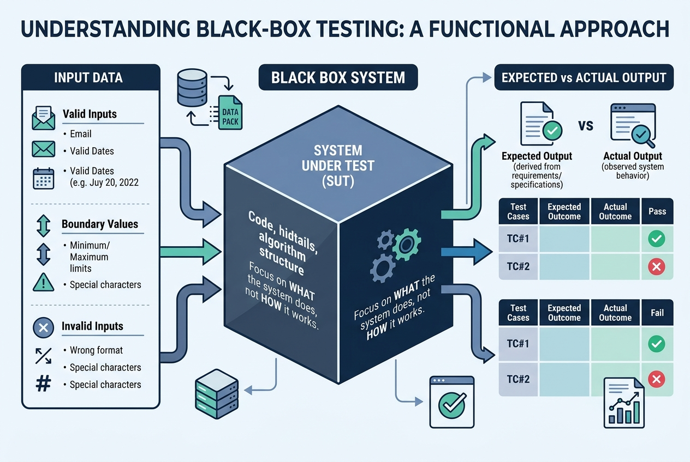
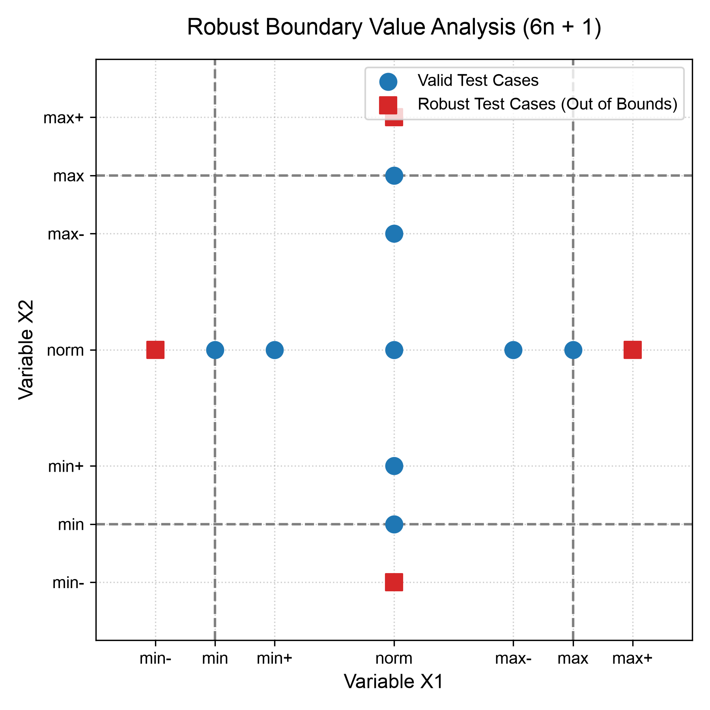
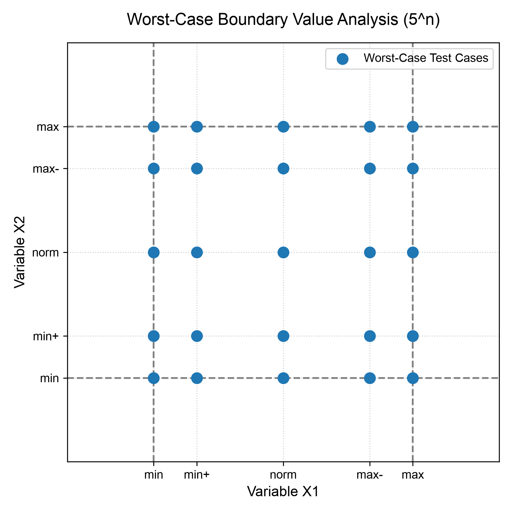
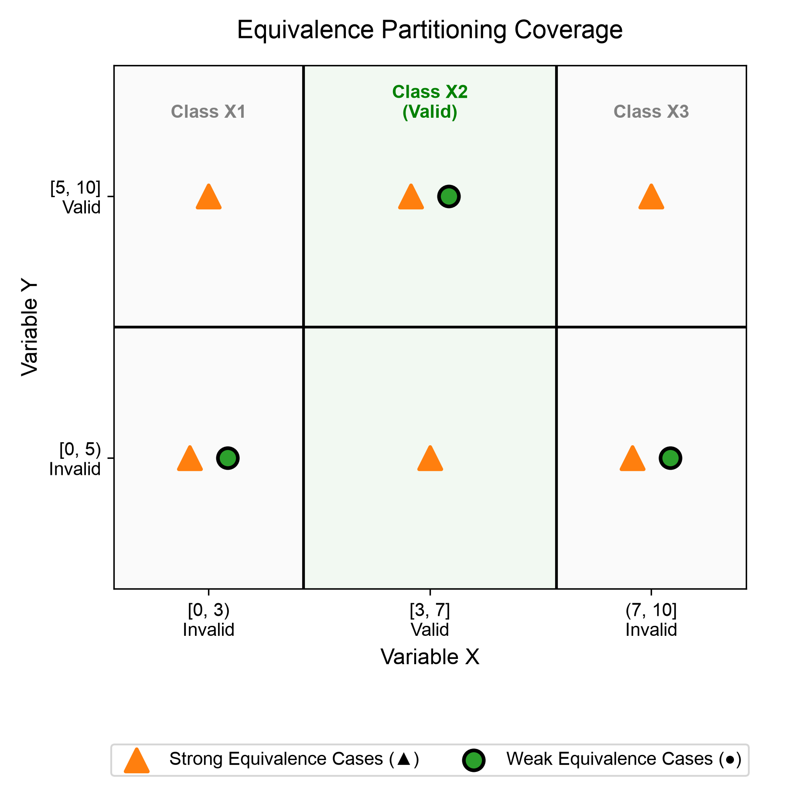
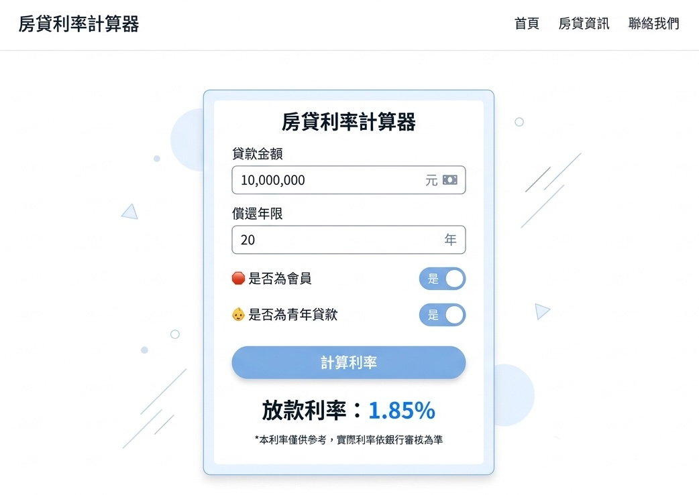
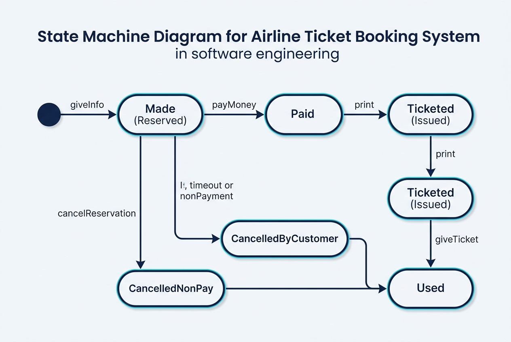

# 軟體品質與測試

### 第 5 章：黑箱測試、等價分割與屬性基礎測試 (PBT)

授課教師：薛念林 教授

> 系統內部就像一個黑盒子，我們不探究它「如何做」，  
> 而是嚴格驗證它在各種極端輸入下，究竟「做了什麼」。  
> 錯誤永遠隱藏在角落——掌握邊界與等價，方能以最小成本擊中最多缺陷。

---

<!-- _class: outline-slide -->
<!-- header: '[◄](#1) 本章大綱 (Outline) [►](#3)' -->

## 本章重點導讀 (Key Highlights)

<div class="outline-columns">
<div>

### 🧭 輸入域劃分與經典方法
- **5.1 黑箱測試概念與 JUnit 5 斷言**：
  - 黑箱測試概念架構：輸入、受測系統 (SUT) 與輸出驗證
  - JUnit 5 斷言陷阱：`assertEquals` (內容) vs. `assertSame` (參照)
- **5.2 邊界值分析 (Boundary Value Analysis, BVA)**：
  - 「錯誤隱藏在角落」：單一錯誤假設與邊界點選取
  - 獨立型 (4n+1 / 6n+1) vs. 非獨立最壞情況 (5ⁿ / 7ⁿ)
- **5.3 等價類分割測試 (Equivalence Partitioning, EP)**：
  - 有效等價類與無效等價類；輸入劃分與輸出反推
  - 弱一般/弱強固 (Weak) vs. 強一般/強強固 (Strong 笛卡爾積)

</div>
<div>

### 📐 組合優化與前沿測試
- **5.4 全成對組合測試 (Pairwise / All-Pairs)**：
  - 2-Way 交互作用理論（NIST 研究）與交錯法推導
  - 正交表 (OATS) vs. Pairwise 工具 (PICT / ACTS)
- **5.5 測試案例優化與 5.6 決策表測試 (CAR)**：
  - 條件樁、動作樁、規則展開與布林邏輯規則化簡
- **5.7 狀態轉換測試 (State Transition Testing)**：
  - 事件驅動狀態機、狀態覆蓋 vs. 轉移覆蓋、物件狀態斷言
- **5.8 屬性基礎測試 (Property-Based Testing, PBT)**：
  - 典範轉移：數學不變量、jqwik 自動隨機測資與測資收縮 (Shrinking)

</div>
</div>

---

<!-- _class: lead -->
<!-- header: '[◄](#2) 5.1 黑箱測試概念與 JUnit 5 斷言 [►](#8)' -->

# **5.1 黑箱測試概念與 JUnit 5 斷言**

> 「不窺探程式碼內部結構，  
> 純粹依據規格契約驗證系統外顯行為。」

---

<!-- header: '[◄](#2) 5.1 黑箱測試概念與 JUnit 5 斷言 [►](#8)' -->

## 黑箱測試 (Black-Box Testing) 概念架構

<div class="card-deck">

* > 💡 黑箱測試（功能測試/規格測試）聚焦於系統「做什麼 (What)」，而非「如何做 (How)」。

<div class="content-columns">
<div class="content-text">

### 📦 黑箱測試三大核心要件
- **1. 測試輸入 (Input Data)**：
  - 涵蓋合法資料 (Valid Inputs)、邊界極端值 (Boundary Values) 與格式錯誤的非法資料 (Invalid Inputs)。
- **2. 受測系統 (System Under Test, SUT)**：
  - 內部原始碼與資料結構對測試人員隱藏（不透明黑盒），完全依據介面規格操作。
- **3. 輸出驗證 (Expected vs. Actual Output)**：
  - 比對實際輸出與需求規格所定義之預期結果是否完全吻合。

</div>
<div class="content-figure">



</div>
</div>
</div>

---

<!-- header: '[◄](#2) 5.1 黑箱測試概念與 JUnit 5 斷言 [►](#8)' -->

## JUnit 5 單元測試基礎與斷言機制

<div class="card-deck">

* > 💡 Java 單元測試中最經典的踩坑陷阱：內容等價性與物件同一性的本質差別。

<div class="two-columns">
<div class="card" data-marpit-fragment>

### ⚖️ assertEquals：內容值等價 (Value Equality)
- **運作原理**：
  - 內部呼叫物件的 `a.equals(b)` 方法。
- **檢驗標的**：
  - 兩個物件內部的「內容資料」是否相等。
- **適用情境**：
  - 字串內容比對、自訂資料物件 (DTO)、數字運算結果驗證。
  ```java
  String s1 = new String("SQA");
  String s2 = new String("SQA");
  assertEquals(s1, s2); // ✅ 通過 (內容相同)
  ```

</div>
<div class="card" data-marpit-fragment>

### 🎯 assertSame：記憶體同一性 (Reference)
- **運作原理**：
  - 內部比對記憶體指標位址（即 `a == b`）。
- **檢驗標的**：
  - 兩個參照變數是否指向 Heap 中的「同一記憶體實體」。
- **適用情境**：
  - 單例模式 (Singleton)、快取池重用、工廠實體驗證。
  ```java
  assertSame(s1, s2);   // ❌ 失敗 (不同記憶體物件)
  String s3 = s1;
  assertSame(s1, s3);   // ✅ 通過 (指向同一位址)
  ```

</div>
</div>
</div>

---

<!-- header: '[◄](#2) 5.1 黑箱測試概念與 JUnit 5 斷言 [►](#8)' -->

## 概念核對問答 (CCQ 1)

<div class="ccq-columns">
<div class="ccq-text">

<!-- id: sqa-ch05-ccq1 -->
#### 🙋 **概念核對問答 (CCQ 1)**

**問題情境**：  
【是非題】在 JUnit 單元測試中，`assertSame(a, b)` 斷言的作用與 `assertEquals(a, b)` 完全相同，兩者都是在驗證兩個物件的內容值是否相等（即比對 `a.equals(b)`）。

- **A)** 正確 (True)
- **B)** 錯誤 (False)

</div>
<div class="ccq-logo">


[課堂互動](https://nlhsueh.github.io/nickedupocket/#/student/sqa-ch05-ccq1)

</div>
</div>

---

<!-- _class: lead -->
<!-- header: '[◄](#2) 5.2 邊界值分析 (BVA) [►](#16)' -->

# **5.2 邊界值分析 (BVA)**

> 「錯誤都隱藏在角落！  
> 大多數的程式缺陷，都發生在邊界條件差之毫釐的瞬間。」

---

<!-- header: '[◄](#2) 5.2 邊界值分析 (BVA) [►](#16)' -->

## 邊界值分析 (BVA) 核心哲學

<div class="card-deck">

* > 💡 軟體工程界公認：輸入範圍的邊緣（極大值、極小值）比中間值更容易觸發 Off-by-one 缺陷。

<div class="two-columns">
<div class="card" data-marpit-fragment>

### 🚩 為什麼錯誤隱藏在角落？
- **運算子誤用陷阱**：
  - 程式設計師常在 `<` 與 `<=`、`>` 與 `>=` 之間犯錯。
- **程式碼良劣對照**：
  | 程式碼寫法 | 缺陷本質 | 測試結果 |
  | :--- | :--- | :--- |
  | `if (input <= 10)` | 無缺陷，邊界完整包含 | input=10 通過 |
  | `if (input < 10)` | 致命缺陷：10 被遺漏 | **input=10 測試失敗** |
- **結論**：測試邊界點能以極高精準度曝光邊界比較缺陷。

</div>
<div class="card" data-marpit-fragment>

### 🛡️ 單一錯誤假設 (Single Fault Assumption)
- **核心假設前提**：
  - 在獨立變數系統中，絕大多數錯誤只需單一變數發生邊界異常即可彰顯，無需多個變數同時在邊界出錯。
- **取樣五大關鍵點**：
  - 對於範圍 $[min, max]$，測試點取：
    - **`min`** (最小值)
    - **`min+`** (略大於最小值)
    - **`norm`** (區間內正常代表值)
    - **`max-`** (略小於最大值)
    - **`max`** (最大值)

</div>
</div>
</div>

---

<!-- header: '[◄](#2) 5.2 邊界值分析 (BVA) [►](#16)' -->

## 獨立型邊界測試：4n + 1 公式

<div class="card-deck">

* > 💡 針對 n 個彼此獨立的輸入變數，每次只讓 1 個變數處於邊界，其餘變數皆維持正常值 (norm)。

<div class="two-columns">
<div class="card" data-marpit-fragment>

### 📐 4n + 1 計算原理
- **每個變數貢獻 4 個邊界案例**：
  - `min`, `min+`, `max-`, `max`（此時其他 $n-1$ 個變數皆取 `norm`）。
- **加上 1 個全員正常中心點**：
  - 所有 $n$ 個變數皆取 `norm` 的基準案例。
- **案例總數公式**：
  $$\text{Total Test Cases} = 4n + 1$$
- **案例範例**：若系統有 3 個獨立輸入變數，則測試案例數為 $4 \times 3 + 1 = \mathbf{13}$ 個。

</div>
<div class="card" data-marpit-fragment>

### 🔺 三角形程式實戰案例 (a, b, c $\in [1, 200]$)
- 固定 $b = 100, c = 100$，變動 $a$：
  - $(1, 100, 100), (2, 100, 100), (199, 100, 100), (200, 100, 100)$
- 固定 $a = 100, c = 100$，變動 $b$ (4 個案例)
- 固定 $a = 100, b = 100$，變動 $c$ (4 個案例)
- 全員正常基準案例：
  - $(100, 100, 100)$ 正三角形
- 總計剛好 13 個測試案例。

</div>
</div>
</div>

---

<!-- header: '[◄](#2) 5.2 邊界值分析 (BVA) [►](#16)' -->

## 獨立型強固邊界測試：6n + 1 公式

<div class="card-deck">

* > 💡 強固邊界測試 (Robust BVA) 擴充考慮「極限例外值」，驗證系統遭遇非法越界時的防禦容錯力。

<div class="content-columns">
<div class="content-text">

### 🛡️ 引入例外邊界 (min-, max+)
- **每個變數擴充為 6 個邊界點**：
  - **`min-`** (略小於合法下界，如 0) ➔ 觸發例外
  - `min` (下界 1)、`min+` (2)
  - `max-` (199)、`max` (上界 200)
  - **`max+`** (略大於合法上界，如 201) ➔ 觸發例外
- **案例總數公式**：
  $$\text{Total Test Cases} = 6n + 1$$
- 若 $n=3$，測試案例數為 $6 \times 3 + 1 = \mathbf{19}$ 個。

</div>
<div class="content-figure">



</div>
</div>
</div>

---

<!-- header: '[◄](#2) 5.2 邊界值分析 (BVA) [►](#16)' -->

## 非獨立型邊界測試 (最壞情況邊界測試)

<div class="card-deck">

* > 💡 當變數之間高度關聯（不符合單一錯誤假設）時，必須採用全乘積笛卡爾積進行最壞情況測試。

<div class="content-columns">
<div class="content-text">

### 💥 乘積組合爆炸 (Combinatorial Explosion)
- **非獨立型一般邊界測試 (Worst-Case BVA)**：
  - 每個變數取 5 個值 (`min`, `min+`, `norm`, `max-`, `max`)。
  - 總數為 **$5^n$**（若 $n=3$，需 $5^3 = \mathbf{125}$ 個案例；若 $n=5$，需 $\mathbf{3,125}$ 個）。
- **非獨立型強固邊界測試 (Worst-Case Robust BVA)**：
  - 每個變數取 7 個值 (含 `min-`, `max+`)。
  - 總數為 **$7^n$**（若 $n=3$，需 $7^3 = \mathbf{343}$ 個；若 $n=5$，需 $\mathbf{16,807}$ 個案例！）。

</div>
<div class="content-figure">



</div>
</div>
</div>

---

<!-- header: '[◄](#2) 5.2 邊界值分析 (BVA) [►](#16)' -->

## 邊界值測試方法全景總結

<div class="card-deck">

* > 💡 四種邊界測試方法的案例數量與強度對比矩陣。

<div class="two-columns">
<div class="card" data-marpit-fragment>

### 📊 測試案例數量矩陣
| 測試策略 | 單一錯誤假設 (獨立型) | 多重錯誤假設 (非獨立/最壞情況) |
| :--- | :--- | :--- |
| **標準邊界** (無越界) | **$4n + 1$** (線性增長) | **$5^n$** (指數級增長) |
| **強固邊界** (含越界) | **$6n + 1$** (線性增長) | **$7^n$** (指數組合爆炸) |

- **適用指標**：
  - 數字型連續變數（年齡、分數、金額、溫度）。
  - 對邏輯性識別碼（如身分證字號、電話號碼）較不適用。

</div>
<div class="card" data-marpit-fragment>

### 🎯 工程選型建議
- **常規模組首選**：
  - **獨立型強固邊界測試 ($6n+1$)**：在極低案例成本下，兼顧常態邊界與異常例外攔截。
- **高危關鍵金融/航太核心**：
  - **最壞情況測試 ($5^n$)**：只針對 2~3 個強關聯變數進行局部乘積，其餘變數維持獨立型，避免組合爆炸。

</div>
</div>
</div>

---

<!-- header: '[◄](#2) 5.2 邊界值分析 (BVA) [►](#16)' -->

## 概念核對問答 (CCQ 2)

<div class="ccq-columns">
<div class="ccq-text">

<!-- id: sqa-ch05-ccq2 -->
#### 🙋 **概念核對問答 (CCQ 2)**

**問題情境**：  
【單選題】假設某個受測方法接受 3 個彼此獨立的連續數值輸入參數。若採用「獨立型強固邊界測試 (Independent Robust BVA)」，其設計出的測試案例數量應為多少？

- **A)** 13 個
- **B)** 19 個
- **C)** 125 個
- **D)** 343 個

</div>
<div class="ccq-logo">


[課堂互動](https://nlhsueh.github.io/nickedupocket/#/student/sqa-ch05-ccq2)

</div>
</div>

---

<!-- _class: lead -->
<!-- header: '[◄](#2) 5.3 等價類分割測試 (EP) [►](#23)' -->

# **5.3 等價類分割測試 (EP)**

> 「把無限的輸入空間劃分為有限的等價群組；  
> 測試其中一個代表，就等於測試了整個群體。」

---

<!-- header: '[◄](#2) 5.3 等價類分割測試 (EP) [►](#23)' -->

## 等價類分割測試 (Equivalence Partitioning)

<div class="card-deck">

* > 💡 等價類的核心定義：同一個群組內的任意資料，若一個能找出 Bug，其他也必定能找出 Bug。

<div class="two-columns">
<div class="card" data-marpit-fragment>

### 🧩 等價分割核心動機
- **達成完整測試**：確保每個業務分支與邏輯區間都有代表被測試到，避免盲區。
- **消除冗餘重複**：在同一個等價區間內測試 100 次只是浪費時間，挑選 1 個代表即可。
- **兩大等價類別**：
  - **有效等價類 (Valid Class)**：符合規格的合理合法輸入集合。
  - **無效等價類 (Invalid Class)**：超出範圍或格式異常的非法集合。

</div>
<div class="card" data-marpit-fragment>

### 🎯 劃分維度與技巧
- **依輸入劃分**：
  - 數值範圍（如 $0 \le score \le 100$ ➔ $<0$, $[0, 100]$, $>100$）。
  - 輸入個數（如「陣列為空」、「單一元素」、「多元素」）。
- **依輸出反推**：
  - 規格要求輸出 A, B, C, D ➔ 倒推需要哪些輸入組合才能覆蓋這四種產出！

</div>
</div>
</div>

---

<!-- header: '[◄](#2) 5.3 等價類分割測試 (EP) [►](#23)' -->

## 弱涵蓋 vs. 強涵蓋等價測試

<div class="card-deck">

* > 💡 單一錯誤假設 vs. 多重錯誤假設在等價劃分中的延伸。

<div class="content-columns">
<div class="content-text">

### ⚖️ 涵蓋強度深度比較
- **弱涵蓋測試 (Weak Coverage)**：
  - **單一錯誤假設**：要求每個變數的每個等價區間，在所有案例中**至少出現過一次**即可。
  - 測試案例數等於**各變數分割數中的最大值** ($\max(m_i)$)。
- **強涵蓋測試 (Strong Coverage)**：
  - **多重錯誤假設**：要求測試所有變數等價區間的**笛卡爾積組合**（全部配對到）。
  - 測試案例數為所有變數分割數的**乘積** ($\prod m_i$)。

</div>
<div class="content-figure">



</div>
</div>
</div>

---

<!-- header: '[◄](#2) 5.3 等價類分割測試 (EP) [►](#23)' -->

## Binary Search 實戰等價劃分案例

<div class="card-deck">

* > 💡 二元搜尋的等價分割不僅看輸入 Key，更必須深入考量陣列長度與命中位置的等價關係。

<div class="two-columns">
<div class="card" data-marpit-fragment>

### 📋 結構化等價劃分設計
- **陣列長度維度 ($A$)**：
  - $a^0$：空陣列 (長度 0)
  - $a^1$：單一元素陣列
  - $a^*$：多元素陣列（可再細分奇數與偶數）
- **搜尋結果與位置維度 ($F, C$)**：
  - $f^t$ 找到：命中於頭部 ($c^1$)、中間 ($c^m$)、尾部 ($c^l$)
  - $f^f$ 未找到：元素不存在於陣列中
- **輸入合法性維度 ($K$)**：
  - $k$：合法整數；$k!$：非整數例外

</div>
<div class="card" data-marpit-fragment>

### 🎯 弱涵蓋 8 大代表案例
- $R_1$: 單元素，有找到 $(k=7, A=[7])$
- $R_2$: 單元素，沒找到 $(k=7, A=[8])$
- $R_3$: 多元素，命中頭部 $(k=7, A=[7, 9, 11])$
- $R_4$: 多元素，命中中間 $(k=9, A=[7, 9, 11])$
- $R_5$: 多元素，命中尾部 $(k=11, A=[7, 9, 11])$
- $R_6$: 多元素，沒找到 $(k=8, A=[7, 9, 11])$
- $R_7$: 空陣列，沒找到 $(k=7, A=[])$
- $R_8$: 非法輸入，拋出例外 $(k=\text{"abc"})$

</div>
</div>
</div>

---

<!-- header: '[◄](#2) 5.3 等價類分割測試 (EP) [►](#23)' -->

## 領域規則導向等價分割：NextDate()

<div class="card-deck">

* > 💡 單純考慮數值範圍是不夠的；優質的等價劃分必須融入業務規則（如大小月與閏年）。

<div class="two-columns">
<div class="card" data-marpit-fragment>

### ❌ 膚淺的簡易分割 (效能低)
- Month: $<1$, $1 \sim 12$, $>12$ (3 類)
- Day: $<1$, $1 \sim 31$, $>31$ (3 類)
- Year: $<1812$, $1812 \sim 2012$, $>2012$ (3 類)
- **致命盲點**：
  - 4/31 根本不存在！2/29 只有閏年合法！
  - 盲目劃分無法捕捉 2 月與大小月的核心跳日邏輯。

</div>
<div class="card" data-marpit-fragment>

### ✅ 融入領域規則的專家分割
- **月份 ($M$)**：
  - $M_1$: 30 天月 (4, 6, 9, 11)
  - $M_2$: 31 天月 (1, 3, 5, 7, 8, 10, 12)
  - $M_3$: 二月 (特殊處理)
- **日期 ($D$)**：
  - $D_1: 1 \sim 27$, $D_2: 28$, $D_3: 29$, $D_4: 30$, $D_5: 31$
- **年份 ($Y$)**：
  - $Y_1$: 世紀平年 (1900), $Y_2$: 閏年 (能被 4 整除), $Y_3$: 一般平年

</div>
</div>
</div>

---

<!-- header: '[◄](#2) 5.3 等價類分割測試 (EP) [►](#23)' -->

## 概念核對問答 (CCQ 3)

<div class="ccq-columns">
<div class="ccq-text">

<!-- id: sqa-ch05-ccq3 -->
#### 🙋 **概念核對問答 (CCQ 3)**

**問題情境**：  
【單選題】在等價類分割測試 (Equivalence Partitioning) 中，「弱涵蓋 (Weak Coverage)」與「強涵蓋 (Strong Coverage)」分類法的主要區別是什麼？

- **A)** 弱涵蓋只測試有效等價類，而強涵蓋同時涵蓋有效與無效等價類
- **B)** 弱涵蓋基於單一錯誤假設（各等價類代表至少被測試一次），而強涵蓋基於多重錯誤假設（測試所有等價類的笛卡爾積全組合）
- **C)** 弱涵蓋不需要需求規格書，而強涵蓋必須完全依照 SRS 執行
- **D)** 弱涵蓋產生的測試案例數量一定比強涵蓋更多

</div>
<div class="ccq-logo">


[課堂互動](https://nlhsueh.github.io/nickedupocket/#/student/sqa-ch05-ccq3)

</div>
</div>

---

<!-- _class: lead -->
<!-- header: '[◄](#2) 5.4 全成對組合測試 (Pairwise) [►](#30)' -->

# **5.4 全成對組合測試 (Pairwise)**

> 「當組合爆炸讓窮盡測試成為不可能，  
> 全成對測試用數學奇蹟，抓出 90% 的交互作用缺陷。」

---

<!-- header: '[◄](#2) 5.4 全成對組合測試 (Pairwise) [►](#30)' -->

## 組合爆炸難題與 2-Way 交互作用理論

<div class="card-deck">

* > 💡 美國國家標準與技術研究院 (NIST) 研究：軟體系統中絕大多數缺陷皆由「單一變數」或「雙變數配對」所觸發。

<div class="two-columns">
<div class="card" data-marpit-fragment>

### 💥 組合爆炸的殘酷現實
- **多參數系統的災難**：
  - 假設系統有 10 個參數，每個參數各有 3 種可能值。
  - 全乘積窮盡測試需要：
    $$3^{10} = \mathbf{59,049} \text{ 個測試案例！}$$
  - 在工程實務上，根本沒有足夠的時間與預算執行窮盡測試。

</div>
<div class="card" data-marpit-fragment>

### 🎯 NIST 實證經驗與成對假設
- **2-Way 交互作用理論**：
  - **67% ~ 93%** 的缺陷只要任意 2 個參數的交互作用就會觸發。
  - 需要 3 個以上參數交互觸發的罕見缺陷不足 10%。
- **Pairwise (All-Pairs) 原則**：
  - **只要任意兩個參數的所有可能取值組合都至少出現過一次即可**！案例數從幾萬個劇降至數十個！

</div>
</div>
</div>

---

<!-- header: '[◄](#2) 5.4 全成對組合測試 (Pairwise) [►](#30)' -->

## 游泳池收費系統：全成對實戰對照

<div class="card-deck">

* > 💡 透過交錯法與成對匹配，案例數量從全乘積的 12 個直接砍半至 6 個，覆蓋率絲毫不減。

<div class="two-columns">
<div class="card" data-marpit-fragment>

### 🏊 參數維度定義
- **日期 ($d$, 2 種)**：$d_1$ 假日, $d_2$ 平日
- **時間 ($t$, 3 種)**：$t_1$ 清晨, $t_2$ 中午, $t_3$ 其他
- **身分 ($m$, 2 種)**：$m_1$ 會員, $m_2$ 非會員
- **全乘積需求**：$2 \times 3 \times 2 = 12$ 個案例。

</div>
<div class="card" data-marpit-fragment>

### ✅ 全成對測試套件 (6 個案例)
| 案例 | 時間 ($t$) | 星期 ($d$) | 會員 ($m$) |
| :---: | :---: | :---: | :---: |
| **1** | $t_1$ (清晨) | $d_1$ (假日) | $m_1$ (會員) |
| **2** | $t_1$ (清晨) | $d_2$ (平日) | $m_2$ (非會員) |
| **3** | $t_2$ (中午) | $d_1$ (假日) | $m_1$ (會員) |
| **4** | $t_2$ (中午) | $d_2$ (平日) | $m_2$ (非會員) |
| **5** | $t_3$ (其他) | $d_1$ (假日) | $m_2$ (非會員) |
| **6** | $t_3$ (其他) | $d_2$ (平日) | $m_1$ (會員) |

*(時間-星期、星期-會員、時間-會員兩兩組合 100% 涵蓋！)*

</div>
</div>
</div>

---

<!-- header: '[◄](#2) 5.4 全成對組合測試 (Pairwise) [►](#30)' -->

## 全成對測試工具與放款計算案例

<div class="card-deck">

* > 💡 求解最小 All-Pairs 測試集屬 NP-Hard 問題；現代工程皆採用高效率啟發式工具自動生成。

<div class="content-columns">
<div class="content-text">

### 🛠️ 主流自動化工具
- **PICT (微軟開源工具)**：
  - 最流行的命令列工具，支援自訂約束條件（Constraints）與權重。
- **ACTS (NIST 開源工具)**：
  - Java 原生 JAR，支援高階 $t$-way 組合（如 3-way, 4-way）。
- **放款利率計算案例**：
  - 利率受貸款金額、償還年限、青年貸款、會員身分影響，透過 PICT 瞬間將數百個全乘積案例壓縮至 10 餘個高價值案例。

</div>
<div class="content-figure">



</div>
</div>
</div>

---

<!-- header: '[◄](#2) 5.4 全成對組合測試 (Pairwise) [►](#30)' -->

## 概念核對問答 (CCQ 4)

<div class="ccq-columns">
<div class="ccq-text">

<!-- id: sqa-ch05-ccq4 -->
#### 🙋 **概念核對問答 (CCQ 4)**

**問題情境**：  
【單選題】全成對測試 (Pairwise / All-Pairs Testing) 能夠大幅縮減測試案例數量，其在軟體工程上的核心理論依據是什麼？

- **A)** 軟體系統中的缺陷通常需要至少三個以上的參數交互作用才會觸發
- **B)** 絕大多數的軟體缺陷都是由「單一變數」或「任意兩個變數之間的交互作用 (2-way Interaction)」所引起的
- **C)** 配對測試是白箱測試的一種，可以直接涵蓋所有的程式碼分支路徑
- **D)** 成對測試可以保證 100% 涵蓋多變數系統的所有笛卡爾積組合

</div>
<div class="ccq-logo">


[課堂互動](https://nlhsueh.github.io/nickedupocket/#/student/sqa-ch05-ccq4)

</div>
</div>

---

<!-- _class: lead -->
<!-- header: '[◄](#2) 5.5 案例優化與 5.6 決策表測試 [►](#38)' -->

# **5.5 案例優化與 5.6 決策表測試**

> 「條件錯綜複雜、規則千頭萬緒？  
> 決策表化繁為簡，讓商業邏輯無所遁形。」

---

<!-- header: '[◄](#2) 5.5 案例優化與 5.6 決策表測試 [►](#38)' -->

## 測試案例精實化四大策略

<div class="card-deck">

* > 💡 面對數千個潛在案例，透過工程優化策略進行剪枝，保留最高殺傷力的測試子集。

<div class="two-columns">
<div class="card" data-marpit-fragment>

### ✂️ 1. 分離例外與 2. 配對組合
- **分離等效例外**：
  - 若所有因子的非法輸入皆導向相同的錯誤處理（如拋出 400 錯誤），無需測試所有因子的例外排列組合，只需將例外抽取為獨立集合測試。
- **2-Way 配對組合**：
  - 將不相關的因子改以 Pairwise 方式結合，指數級案例瞬間降為多項式級。

</div>
<div class="card" data-marpit-fragment>

### 🎯 3. 邊界鎖定與 4. FMEA 風險優先
- **鎖定邊界替代隨機**：
  - 等價區間內部只挑 1 個代表，將精力聚焦於 $min, min+, max-, max$。
- **FMEA 故障模式分析**：
  - 高風險、核心金流、常變更模組採用強涵蓋；低風險輔助模組降級為弱涵蓋。

</div>
</div>
</div>

---

<!-- header: '[◄](#2) 5.5 案例優化與 5.6 決策表測試 [►](#38)' -->

## 概念核對問答 (CCQ 5)

<div class="ccq-columns">
<div class="ccq-text">

<!-- id: sqa-ch05-ccq5 -->
#### 🙋 **概念核對問答 (CCQ 5)**

**問題情境**：  
【單選題】關於「正交表測試 (Orthogonal Array Testing, OATS)」與一般「全成對測試 (Pairwise Testing)」的比較，下列敘述何者正確？

- **A)** 正交表測試是隨機產生的，而 Pairwise 必須透過數學嚴格推導
- **B)** 兩者都關注參數間的配對，但正交表更強調各因子組合的「均勻平衡性（正交性）」，而 Pairwise 僅要求任意兩因子的組合至少出現一次，因此案例數量通常更少且更有彈性
- **C)** 只要變數的個數相同，正交表與 Pairwise 產生的測試案例清單必定完全一致
- **D)** 正交表測試只能處理二分值（True/False）的變數組合

</div>
<div class="ccq-logo">


[課堂互動](https://nlhsueh.github.io/nickedupocket/#/student/sqa-ch05-ccq5)

</div>
</div>

---

<!-- header: '[◄](#2) 5.5 案例優化與 5.6 決策表測試 [►](#38)' -->

## 決策表測試 (Decision Table Testing) 架構

<div class="card-deck">

* > 💡 針對高相依性、高制約的複雜商業邏輯，透過 Condition-Action-Rule (CAR) 進行邏輯收斂。

<div class="two-columns">
<div class="card" data-marpit-fragment>

### 📋 CAR 決策表四大區塊
- **條件樁 (Condition Stubs)**：
  - 列出影響決策的所有輸入條件與前置狀態（如 $C_1, C_2, C_3$）。
- **動作樁 (Action Stubs)**：
  - 列出系統可能觸發的所有輸出動作（如 $A_1, A_2$）。
- **條件項 (Condition Entries)**：
  - 填入各條件之取值（Y, N 或 不在乎 `-`）。
- **動作項 (Action Entries)**：
  - 標記該規則下應執行的動作（$X$）。

</div>
<div class="card" data-marpit-fragment>

### ✂️ 規則展開與化簡 (Simplification)
- **初始全規則展開**：
  - $k$ 個布林條件共有 $2^k$ 條初始規則。
- **不相關化簡 (Don't Care)**：
  - 若兩條規則僅有一項條件不同，但觸發相同動作，該條件可化簡為 `-`（不在乎）並合併為單一規則！
- **效益**：杜絕規格矛盾與遺漏，需求分析與測試共用。

</div>
</div>
</div>

---

<!-- header: '[◄](#2) 5.5 案例優化與 5.6 決策表測試 [►](#38)' -->

## 三角形判斷決策表 (CAR Table) 實戰

<div class="card-deck">

* > 💡 三角形判斷邏輯化簡後的 CAR 決策表，精確對應 6 條測試規則。

| 條件與動作 | $R_1$ | $R_2$ | $R_3$ | $R_4$ | $R_5$ | $R_6$ |
| :--- | :---: | :---: | :---: | :---: | :---: | :---: |
| **條件 (Conditions)** | | | | | | |
| $C_1$: 滿足三角不等式？($a < b+c \land b < a+c \land c < a+b$) | **N** | **Y** | **Y** | **Y** | **Y** | **Y** |
| $C_2$: $a = b$？ | **-** | **Y** | **Y** | **N** | **N** | **N** |
| $C_3$: $b = c$？ | **-** | **Y** | **N** | **Y** | **N** | **N** |
| $C_4$: $a = c$？ | **-** | **Y** | **N** | **N** | **Y** | **N** |
| **動作 (Actions)** | | | | | | |
| $A_1$: 輸出「非三角形」 | **X** | | | | | |
| $A_2$: 輸出「正三角形」 | | **X** | | | | |
| $A_3$: 輸出「等腰三角形」 | | | **X** | **X** | **X** | |
| $A_4$: 輸出「不等邊三角形」 | | | | | | **X** |

</div>

---

<!-- header: '[◄](#2) 5.5 案例優化與 5.6 決策表測試 [►](#38)' -->

## 概念核對問答 (CCQ 6)

<div class="ccq-columns">
<div class="ccq-text">

<!-- id: sqa-ch05-ccq6 -->
#### 🙋 **概念核對問答 (CCQ 6)**

**問題情境**：  
【單選題】在軟體測試實務中，下列哪一種受測情境最適合優先採用「決策表測試 (Decision Table Testing)」來設計案例？

- **A)** 系統輸入參數彼此完全獨立，且有連續性數值邊界
- **B)** 輸入參數之間存在複雜的商務邏輯與制約關係，不同的條件組合會觸發不同的系統動作或輸出結果
- **C)** 系統的輸出僅與目前輸入值有關，與輸入條件的組合邏輯無涉
- **D)** 系統的運作強烈依賴時間序列與物件歷史狀態的轉移

</div>
<div class="ccq-logo">


[課堂互動](https://nlhsueh.github.io/nickedupocket/#/student/sqa-ch05-ccq6)

</div>
</div>

---

<!-- _class: lead -->
<!-- header: '[◄](#2) 5.7 狀態轉換測試 [►](#44)' -->

# **5.7 狀態轉換測試**

> 「沒有回傳值的 void 方法怎麼測？  
> 答案在於物件內部的狀態轉移。」

---

<!-- header: '[◄](#2) 5.7 狀態轉換測試 [►](#44)' -->

## 事件驅動與狀態機 (State Machine) 測試

<div class="card-deck">

* > 💡 現代系統多為事件驅動 (Event-Driven)；測試重點在於：受到事件激發後，狀態轉換是否如預期反應。

<div class="content-columns">
<div class="content-text">

### ✈️ 航空訂票狀態機生命週期
- **主流程 (Happy Path)**：
  - $\text{Made (已預約)} \xrightarrow{payMoney} \text{Paid (已付款)} \xrightarrow{print} \text{Ticketed (已開票)} \xrightarrow{giveTicket} \text{Used (已使用)}$
- **取消與逾期例外分支**：
  - 在 Made/Paid/Ticketed 下觸發 `cancel` ➔ 轉移至 **CancelledByCustomer**。
  - 在 Made 下付款逾時 (`payTimeExpire`) ➔ 轉移至 **CancelledNonPay**。

</div>
<div class="content-figure">



</div>
</div>
</div>

---

<!-- header: '[◄](#2) 5.7 狀態轉換測試 [►](#44)' -->

## 狀態測試覆蓋準則與測試路徑設計

<div class="card-deck">

* > 💡 狀態覆蓋 (Node) vs. 轉移覆蓋 (Edge)：轉移覆蓋強度遠高於狀態覆蓋。

<div class="two-columns">
<div class="card" data-marpit-fragment>

### 🎯 覆蓋強度層次
- **狀態覆蓋 (State Coverage)**：
  - 每個狀態節點至少被造訪一次。
- **轉移覆蓋 (Transition Coverage)**：
  - 每個狀態轉移弧線至少被執行一次（必達狀態覆蓋！）。
- **$N$-Switch 覆蓋**：
  - 0-Switch（單次轉移）、1-Switch（連續 2 次轉移序列）。

</div>
<div class="card" data-marpit-fragment>

### 🛣️ 5 條全轉移覆蓋測試序列
- **路徑 1**：`giveInfo` ➔ `payMoney` ➔ `print` ➔ `giveTicket` (正常使用)
- **路徑 2**：`giveInfo` ➔ `payMoney` ➔ `print` ➔ `cancel` (開票後取消)
- **路徑 3**：`giveInfo` ➔ `payMoney` ➔ `cancel` (付款後取消)
- **路徑 4**：`giveInfo` ➔ `cancel` (預約後取消)
- **路徑 5**：`giveInfo` ➔ `payTimeExpire` (逾期未付)

</div>
</div>
</div>

---

<!-- header: '[◄](#2) 5.7 狀態轉換測試 [►](#44)' -->

## 物件狀態測試：Stack 實戰

<div class="card-deck">

* > 💡 物件導向測試精髓：執行 void 動作（如 push/pop），斷言內部狀態變化（`isEmpty()`, `isFull()`）。

```java
// 測試狀態轉移至 isFull
Stack s = new Stack(3);
s.push(100);
assertFalse(s.isFull()); // 狀態：NotEmpty
s.push(200);
s.push(300);
assertTrue(s.isFull());  // 狀態轉移成功：isFull

// 測試在 isFull 狀態下再次 push 應拋出例外 (強固性)
assertThrows(StackFullException.class, () -> s.push(400));
```

- **先設初始狀態，再激發事件**：先 push 3 次建立滿狀態，再驗證越界拋錯。
- **回歸狀態驗證**：連續 pop 3 次後，斷言 `assertTrue(s.isEmpty())`。

</div>

---

<!-- header: '[◄](#2) 5.7 狀態轉換測試 [►](#44)' -->

## 概念核對問答 (CCQ 7)

<div class="ccq-columns">
<div class="ccq-text">

<!-- id: sqa-ch05-ccq7 -->
#### 🙋 **概念核對問答 (CCQ 7)**

**問題情境**：  
【單選題】在狀態測試 (State Testing) 中，關於「狀態覆蓋 (State Coverage)」與「轉移覆蓋 (Transition Coverage)」的強度關係，下列敘述何者正確？

- **A)** 達到狀態覆蓋必定代表同時達到了轉移覆蓋
- **B)** 轉移覆蓋的強度大於狀態覆蓋；若測試案例達到了轉移覆蓋（驗證了所有可能的轉移路徑弧線），則必定已涵蓋了所有狀態節點
- **C)** 兩者互相獨立，沒有任何包含或強弱關係
- **D)** 狀態測試不需要考慮無效轉移（即在某狀態下輸入非法事件的系統反應）

</div>
<div class="ccq-logo">


[課堂互動](https://nlhsueh.github.io/nickedupocket/#/student/sqa-ch05-ccq7)

</div>
</div>

---

<!-- _class: lead -->
<!-- header: '[◄](#2) 5.8 屬性基礎測試 (PBT) [►](#49)' -->

# **5.8 屬性基礎測試 (PBT)**

> 「不再人工苦思特定測資，  
> 而是宣告系統永不妥協的數學不變量。」

---

<!-- header: '[◄](#2) 5.8 屬性基礎測試 (PBT) [►](#49)' -->

## 範例測試 (EBT) vs. 屬性測試 (PBT) 典範轉移

<div class="card-deck">

* > 💡 從 Example-Based 走向 Property-Based：讓框架自動產生萬組極端隨機測資，尋找致命反例。

<div class="two-columns">
<div class="card" data-marpit-fragment>

### 📝 傳統範例測試 (Example-Based)
- **手動設計特定案例**：
  - 挑選輸入 $2$ 與 $3$，斷言輸出必為 $5$。
- **致命瓶頸**：
  - 覆蓋率高度取決於工程師的直覺與經驗；
  - 極容易遺漏包含極大值、空字串、Unicode 特殊字元之極端漏洞。

</div>
<div class="card" data-marpit-fragment>

### 🎲 屬性基礎測試 (Property-Based)
- **定義通用不變量 (Invariant)**：
  - 不管輸入何值，加法必滿足「交換律 $a+b = b+a$」。
- **三大核心機制**：
  - **1. 屬性 (Property)**：永恆成立之數學真理。
  - **2. 生成器 (Generator)**：自動產生數萬組隨機邊界資料。
  - **3. 測資收縮 (Shrinking)**：遇錯自動簡化為極簡反例！

</div>
</div>
</div>

---

<!-- header: '[◄](#2) 5.8 屬性基礎測試 (PBT) [►](#49)' -->

## jqwik 實戰與測資收縮 (Shrinking) 機制

<div class="card-deck">

* > 💡 當一萬筆測資中長度為 100 的亂碼陣列出錯時，PBT 框架能自動縮減為 `[0, -1]` 幫助工程師秒級除錯。

```java
import net.jqwik.api.*;

public class AdditionProperties {

    // 測試加法交換律：a + b 必須等於 b + a (自動執行 1000 次隨機測試)
    @Property
    void additionIsCommutative(@ForAll int a, @ForAll int b) {
        int result1 = a + b;
        int result2 = b + a;
        assert result1 == result2;
    }

    // 測試恆等律：任何整數加上 0 必須等於自己
    @Property
    void additionWithZeroHasNoEffect(@ForAll int a) {
        assert a + 0 == a;
    }
}
```

- **`@Property`**：宣告屬性測試；**`@ForAll`**：自動注入極大整數、負數與零。

</div>

---

<!-- header: '[◄](#2) 5.8 屬性基礎測試 (PBT) [►](#49)' -->

## 概念核對問答 (CCQ 8)

<div class="ccq-columns">
<div class="ccq-text">

<!-- id: sqa-ch05-ccq8 -->
#### 🙋 **概念核對問答 (CCQ 8)**

**問題情境**：  
【是非題】在屬性基礎測試 (Property-Based Testing, PBT) 中，我們不需要手動為每一組測試寫出確切的預期輸出數值，而是定義程式執行時必須永遠維持的「屬性或不變量 (Invariants)」，並交由測試框架隨機生成大量測資來自動尋找反例。

- **A)** 正確 (True)
- **B)** 錯誤 (False)

</div>
<div class="ccq-logo">


[課堂互動](https://nlhsueh.github.io/nickedupocket/#/student/sqa-ch05-ccq8)

</div>
</div>

---

<!-- header: '[◄](#2) 本章重點導讀 [►](#1)' -->

## 附錄：課堂互動參考解答

<div class="card-deck">

* > 💡 本章課堂互動 (CCQ 1 ～ CCQ 8) 官方標準解答與核心觀念解析總整理。

<div class="two-columns">
<div class="card" data-marpit-fragment>

### 🧭 CCQ 1 ～ 4：斷言、邊界與組合
- **CCQ 1【錯誤 (B)】**：`assertEquals` 驗證內容相等 (`equals`)，`assertSame` 驗證記憶體位址同一性 (`==`)。
- **CCQ 2【19 個 (B)】**：3 變數獨立強固 BVA 案例數為 $6n + 1 = 6 \times 3 + 1 = 19$。
- **CCQ 3【單一 vs 笛卡爾積 (B)】**：弱等價基於單一錯誤假設，強等價要求所有變數分割之全乘積。
- **CCQ 4【2-Way 交互作用 (B)】**：NIST 實證絕大多數缺陷由單變數或雙變數交互引發，Pairwise 具極高性價比。

</div>
<div class="card" data-marpit-fragment>

### 🎯 CCQ 5 ～ 8：正交、決策、狀態與屬性
- **CCQ 5【正交平衡性 vs 靈活度 (B)】**：正交表要求兩兩配對次數嚴格相等，Pairwise 僅求 $\ge 1$ 故更精實。
- **CCQ 6【複雜商務邏輯制約 (B)】**：決策表最適於多條件輸入與輸出動作具複雜因果關聯之場景。
- **CCQ 7【轉移覆蓋大於狀態覆蓋 (B)】**：轉移覆蓋走遍所有邊弧，必定已造訪所有狀態節點。
- **CCQ 8【正確 (A)】**：PBT 核心為規格即不變量，自動生成海量輸入並透過 Shrinking 回報極簡反例。

</div>
</div>
</div>

<script>
(function() {
  function initHeaderDropdown() {
    const sections = [];
    const seenTitles = new Set();
    const slideSections = document.querySelectorAll("section[id]");
    
    // 1. Scan unique section titles and their slide IDs
    slideSections.forEach(sec => {
      const header = sec.querySelector("header");
      if (!header) return;
      
      let title = header.textContent.trim();
      title = title.replace(/^[◄◀]\s*/, "").replace(/\s*[►▶]$/, "").trim();
      if (!title || seenTitles.has(title)) return;
      
      seenTitles.add(title);
      sections.push({
        id: sec.id,
        title: title
      });
    });

    if (sections.length === 0) return;

    // Helper to create the dropdown DOM
    function createDropdownWrapper(currentTitle) {
      const wrapper = document.createElement("span");
      wrapper.className = "header-nav-wrapper";
      
      const titleSpan = document.createElement("span");
      titleSpan.className = "header-nav-title";
      titleSpan.title = "點擊固定或懸停查看所有章節快速跳轉";
      titleSpan.innerHTML = currentTitle + "<span class=\"nav-caret\"> ▾</span>";
      
      titleSpan.addEventListener("click", function(e) {
        e.stopPropagation();
        const wasOpen = wrapper.classList.contains("is-open");
        document.querySelectorAll(".header-nav-wrapper.is-open").forEach(w => w.classList.remove("is-open"));
        if (!wasOpen) {
          wrapper.classList.add("is-open");
        }
      });
      
      const dropdown = document.createElement("div");
      dropdown.className = "nav-dropdown";
      
      dropdown.addEventListener("click", function(e) {
        e.stopPropagation();
      });
      
      const dropHeader = document.createElement("div");
      dropHeader.className = "nav-dropdown-header";
      dropHeader.innerHTML = "<span>📑 快速跳轉章節目錄</span><span style=\"font-size:11px;font-weight:normal;color:#64748b;\">共 " + sections.length + " 個章節</span>";
      dropdown.appendChild(dropHeader);
      
      const grid = document.createElement("div");
      grid.className = "nav-dropdown-grid";
      
      sections.forEach(s => {
        const item = document.createElement("a");
        const isActive = (s.title === currentTitle);
        item.className = "nav-dropdown-item" + (isActive ? " active" : "");
        item.href = "#" + s.id;
        item.innerHTML = "<span class=\"badge\">#" + s.id.padStart(2, "0") + "</span><span class=\"item-text\" title=\"" + s.title + "\">" + s.title + "</span>";
        
        item.addEventListener("click", function(e) {
          wrapper.classList.remove("is-open");
          dropdown.style.display = "none";
          window.location.hash = "#" + s.id;
          setTimeout(() => { dropdown.style.display = ""; }, 350);
        });
        
        grid.appendChild(item);
      });
      
      dropdown.appendChild(grid);
      wrapper.appendChild(titleSpan);
      wrapper.appendChild(dropdown);
      return wrapper;
    }

    // Close any pinned dropdown when clicking anywhere outside
    document.addEventListener("click", function(e) {
      if (!e.target.closest(".header-nav-wrapper")) {
        document.querySelectorAll(".header-nav-wrapper.is-open").forEach(w => w.classList.remove("is-open"));
      }
    });

    // 2. Enhance each header element across all slides
    slideSections.forEach(sec => {
      const header = sec.querySelector("header");
      if (!header || header.dataset.navEnhanced) return;
      header.dataset.navEnhanced = "true";
      
      const links = header.querySelectorAll("a");
      let prevLink = null;
      let nextLink = null;
      
      links.forEach(a => {
        const txt = a.textContent.trim();
        if (txt === "◄" || txt === "◀") prevLink = a;
        if (txt === "►" || txt === "▶") nextLink = a;
      });
      
      let title = header.textContent.trim();
      title = title.replace(/^[◄◀]\s*/, "").replace(/\s*[►▶]$/, "").trim();
      if (!title) return;
      
      header.innerHTML = "";
      if (prevLink) {
        prevLink.className = "header-nav-arrow";
        prevLink.title = "上一章節";
        header.appendChild(prevLink);
        header.appendChild(document.createTextNode(" "));
      }
      
      const wrapper = createDropdownWrapper(title);
      header.appendChild(wrapper);
      
      if (nextLink) {
        header.appendChild(document.createTextNode(" "));
        nextLink.className = "header-nav-arrow";
        nextLink.title = "下一章節";
        header.appendChild(nextLink);
      }
    });
  }

  if (document.readyState === "loading") {
    document.addEventListener("DOMContentLoaded", initHeaderDropdown);
  } else {
    initHeaderDropdown();
  }
  setTimeout(initHeaderDropdown, 400);
})();
</script>
