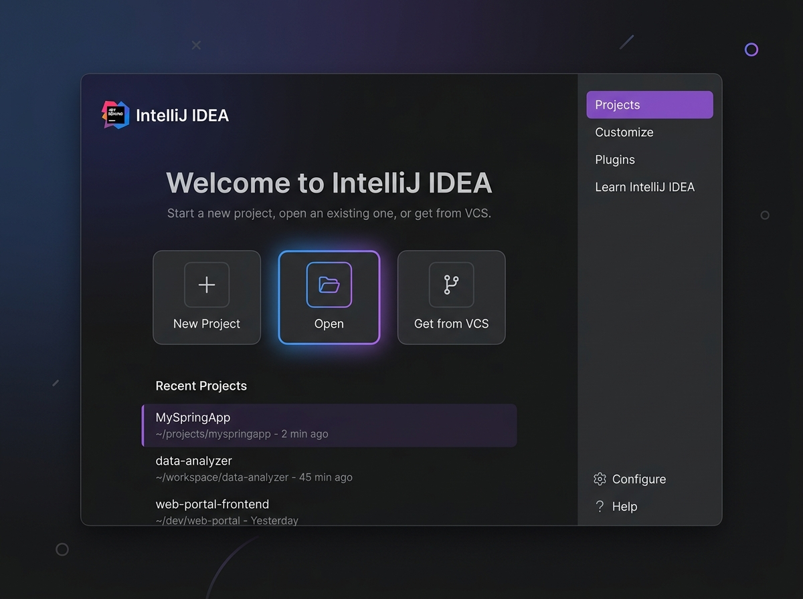
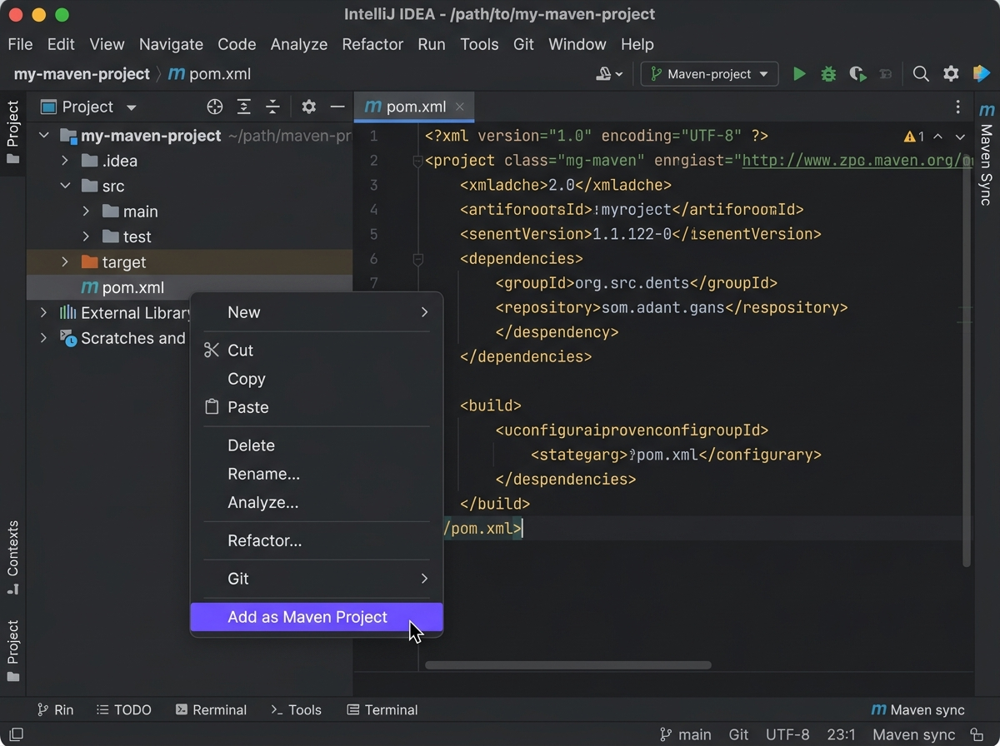

# IntelliJ IDEA 介紹與專案設定指南

本單元介紹 Java 開發中最受歡迎的整合開發環境（IDE）—— **IntelliJ IDEA**，說明其核心特色、Java JVM 與 Maven 的配置方法，如何善用 AI LLM 工具輔助專案建置，以及如何使用本教材中提供的 `DemoXXX` 練習專案。

---

## 1. IntelliJ IDEA 的特色

IntelliJ IDEA 是由 JetBrains 開發的 Java 整合開發環境，廣受全球軟體工程師喜愛，其主要特色包括：

* **智慧程式碼補全（Smart Completion）**：能根據上下文、類別、變數及方法的類型，提供極其精準的補全建議，不僅僅是語法提示，還能預測開發者的意圖。
* **強大的重構功能（Refactoring）**：支援安全重命名、擷取方法（Extract Method）、調整方法簽章等，會自動同步更新整個專案中所有相關的引用。
* **開箱即用的 JVM 支援**：整合了對 Java、Kotlin、Scala 等 JVM 語言的優異支援，無需繁瑣設定即可直接開發。
* **內建建構工具與版本控制**：與 Maven、Gradle、Git 等工具無縫整合，在 IDE 內即可完成拉取、提交、編譯、打包等一站式操作。
* **優異的除錯器（Debugger）**：提供直覺的可視化除錯介面，支援條件中斷點（Conditional Breakpoints）、變數監控（Watch Variables）及運行時表示式求值（詳情可參考 [debug.md](debug.md)）。

---

## 2. Java JVM 與 Maven 方面的應用

### 2.1 Java JVM 與 SDK 設定
在 IntelliJ 中，您可以為每個專案指定不同的 Java Development Kit (JDK)。
1. **設定 JDK**：至 `File` -> `Project Structure` -> `Project`（快捷鍵 `Ctrl + Alt + Shift + S` 或 `Cmd + ;`）。
2. 在 **SDK** 選項中，您可以點選 `Add SDK` -> `Download JDK`，直接在 IDE 內下載並安裝各種版本的 OpenJDK（如 Oracle OpenJDK, Temurin 等）。
3. **Language Level（語言層級）**：您可以設定專案語法限制在特定的 Java 版本（例如 Java 21），即使系統安裝了更新的 JDK，編譯器仍會確保相容性。

### 2.2 Maven 整合與依賴管理
Maven 是專案管理與依賴建置的核心工具（詳細介紹可參閱 [POM.md](POM.md)）。
* **自動識別與匯入**：當您在 IntelliJ 中開啟包含 `pom.xml` 的資料夾時，IDE 會自動偵測並將其視為 Maven 專案載入，並在背景下載所需的 Jar 包。
* **Maven 工具視窗**：視窗右側有一個 `Maven` 標籤，展開後可以看到專案的 **Lifecycle**（生命週期，如 `clean`, `compile`, `test`, `package`）與 **Plugins**。按兩下即可執行對應的指令。
* **重新載入 Maven（Reload）**：如果您手動修改了 `pom.xml` 中的依賴設定，專案右上角會出現一個藍色的小 Maven 圖示（或按 `Ctrl + Shift + O` / `Cmd + Shift + I`），點擊後 IDE 就會立刻重新同步並下載最新套件。

### 2.3 IntelliJ 專案目錄與設定檔結構
在開啟 Java / Maven 專案時，您會在專案根目錄下看到一些由 IDE 自動生成或預設的檔案與資料夾。它們各自扮演不同的角色：

| 目錄/檔案 | 用途說明 | 是否需要納入 Git 版本控制？ |
| :--- | :--- | :--- |
| **`.idea/`** | **IntelliJ 專案專屬設定資料夾**：存放此專案在該 IDE 中的配置（如編輯器視窗排版、執行/除錯設定 `runConfigurations`、Maven 同步快取、程式碼風格樣式等）。 | **大部分排除**：通常將個人排版設定排除，僅保留團隊共用的執行設定（如特定的 `runConfigurations` 檔）。 |
| **`*.iml`** (如 `DemoSQA.iml`) | **IntelliJ 模組設定檔（Module File）**：以 XML 格式記錄該模組的結構、路徑及依賴關係。為 IntelliJ 的舊版或相容性設計。 | **排除**：因為 Maven 專案的依賴關係已經由 `pom.xml` 定義，IDE 會自動從 `pom.xml` 生成此檔案，無需納入 Git。 |
| **`src/`** | **原始碼目錄**：存放所有 Java 程式碼與資源檔案。<br>・`src/main/java`：主程式邏輯。<br>・`src/main/resources`：設定檔或資源。<br>・`src/test/java`：單元測試程式碼。 | **必須納入**：這是開發的核心程式碼。 |
| **`target/`** | **編譯與建置輸出目錄**：Maven 執行 `compile` 或 `package` 後生成的檔案（包含編譯後的 `.class` 檔、包裝好的 `.jar` 檔、測試報告與 Jacoco 覆蓋率報告等）。 | **絕對排除**：此資料夾可以透過 `mvn clean` 隨時清除，並透過 `mvn compile` 重新生成，絕對不要提交至 Git。 |
| **`pom.xml`** | **Maven 專案物件模型（Project Object Model）**：定義專案基本資訊、依賴套件、編譯外掛等（參考 [POM.md](POM.md)）。 | **必須納入**：這是定義專案建置與依賴的根本來源。 |
| **`.gitignore`** | **Git 排除清單**：定義哪些檔案與資料夾不需要被 Git 追蹤（例如 `.idea/`、`target/`、`*.iml` 及各種作業系統暫存檔）。 | **必須納入**：確保團隊成員在協作時不會提交垃圾檔案。 |

> **💡 提示：為什麼我的專案一直出現奇怪的編譯錯誤？**  
> 如果專案設定損壞，您可以嘗試安全地關閉 IntelliJ，在檔案管理器中直接刪除 `.idea/` 資料夾與所有的 `*.iml` 檔案，然後在 IntelliJ 中重新點選 `Open` 載入 `pom.xml`，IDE 就會重新為您乾淨地產生這些設定檔。

---

## 3. 透過 AI LLM 來幫忙設定專案

現代軟體開發中，生成式 AI（如 Gemini, GitHub Copilot, ChatGPT 等）是設定與維護專案的強大助手。以下是幾種常見的應用情境：

### 3.1 產生與配置 `pom.xml`
如果您不知道某個套件（例如 JUnit 5、MockBox 或 Selenium）在 Maven 的寫法，可以向 AI 發出提示詞：
> **Prompt 範例**：  
> `請幫我寫一個適用於 Maven 的 JUnit 5 (Jupiter) 依賴設定 xml，Java 版本使用 21，並加上說明。`

AI 會產生類似以下的區塊，您只需直接貼入 `pom.xml` 的 `<dependencies>` 中即可：
```xml
<!-- JUnit Jupiter API (撰寫測試用) -->
<dependency>
    <groupId>org.junit.jupiter</groupId>
    <artifactId>junit-jupiter-api</artifactId>
    <version>5.11.0</version>
    <scope>test</scope>
</dependency>
```

### 3.2 解決相依性衝突與編譯錯誤
當 Maven 下載套件出錯，或發生版本衝突（例如 `Dependency Resolution Exception`）時：
1. 複製終端機輸出的 Maven 錯誤訊息。
2. 貼給 LLM 並詢問原因與解決方案。
> **Prompt 範例**：  
> `我在執行 mvn compile 時遇到以下錯誤：[貼上錯誤訊息]，請問我的 pom.xml 應該怎麼修改？`

### 3.3 自動產生專案結構
若要手動建立一個符合 Maven 標準架構（Standard Directory Layout）的專案，可以請 LLM 撰寫腳本：
> **Prompt 範例**：  
> `請幫我寫一個 Bash / PowerShell 腳本，可以在目前目錄下快速建立 Maven 標準的 src/main/java/demo 和 src/test/java/demo 目錄。`

### 3.4 IntelliJ 中直接使用 AI LLM 外掛（Plugins）
除了在瀏覽器中使用 AI 外，您可以直接在 IntelliJ 內安裝 AI 外掛，在編輯器中實現「隨敲隨用」的體驗：

1. **GitHub Copilot** (推薦)
   - **特色**：由 GitHub 與 OpenAI 合作推出，是目前最主流的 AI 助手。能在您輸入程式碼時即時給出整行或整段的自動補全建議，並提供 Copilot Chat 側邊欄，支援在 IDE 中直接詢問程式碼解釋、重構建議或自動編寫測試。
   - **安裝方式**：至 `Settings` (macOS 系統為 `IntelliJ IDEA` -> `Settings`) -> `Plugins` -> 搜尋 `GitHub Copilot` 點選安裝，重啟 IDE 後登入帳號即可啟用。

2. **JetBrains AI Assistant**
   - **特色**：JetBrains 官方為其 IDE 系列量身打造。深度整合了 IntelliJ 專案的上下文（例如：它知道您的 Maven 設定、JDK 版本與模組相依性）。支援在程式碼中直接按快捷鍵（如 `Cmd + I` 或 `Ctrl + \`）叫出對話框，原地修改或優化程式碼。
   - **安裝方式**：至 `Settings` -> `Plugins` -> 搜尋 `AI Assistant` 啟用。

3. **Codeium** / **Tabnine** (免費或高隱私度方案)
   - **Codeium**：個人使用免費，自動補全速度極快，是 Copilot 之外的熱門免費選擇。
   - **Tabnine**：提供本地端（Local-only）運行模型的選項，適合公司內部不希望程式碼上傳到雲端的開發場景。

**AI 外掛的實用開發技巧**：
* **快速生成單元測試**：在您的 Class 或方法名稱上按右鍵 -> `AI Actions` -> `Generate Unit Tests`，AI 便會自動套用 JUnit 產生對應的測試案例。
* **解釋未知程式碼**：選取 Demo 專案中較複雜的邏輯 -> 右鍵 -> `AI Actions` -> `Explain Code`，幫助您快速理解他人撰寫的演算法。

---

## 4. 如何應用本教材所提供的 `DemoXXX` 專案

本教材在各單元的實驗目錄下提供了豐富的示範專案（以 `Demo` 開頭，例如 `DemoDebug`, `DemoJunit`, `DemoMokito` 等）。您可以使用以下方法在 IntelliJ 中開啟並練習：

### 方法一：獨立開啟專案（推薦）
為了讓各單元的依賴庫與設定最乾淨，建議每次只專注開啟一個 Demo 專案：
1. 啟動 IntelliJ IDEA，選擇 **`Open`**（如下圖所示）。
   
   
   
2. 瀏覽至該單元目錄，選取該 Demo 的資料夾（例如選取 [DemoDebug](DemoDebug) 資料夾，該目錄下必須直接含有 `pom.xml` ）。
3. 點選開啟。IntelliJ 會將其識別為一個獨立的專案，並自動解析其專屬的 Maven 設定。

### 方法二：作為多模組專案開啟
如果您開啟了整個 `teach_SQA` 倉庫作為工作區：
1. 當您展開左側的 `Lab/` 目錄時，會看到很多 `DemoXXX` 資料夾。
2. 如果這些資料夾的圖示與一般資料夾無異（沒有被識別為 Maven 專案），請在該目錄下的 `pom.xml` 檔案上**按右鍵**。
3. 選擇 **`Add as Maven Project`**（加入為 Maven 專案，如下圖所示）。
   
   
   
4. IntelliJ 會立刻啟動該模組的 Maven 解析，此時資料夾圖示會變為帶有藍色小方塊的模組圖示，即可正常在 `src/test/java` 執行單元測試。

### 綜合練習專案：[DemoSQA](../DemoSQA)
在 `Lab/DemoSQA` 中，我們已經配置好了一個包含單元測試（JUnit 5）、瀏覽器自動化測試（Selenium）、程式碼檢查工具（PMD）及測試覆蓋率報告工具（JaCoCo）的完整專案。您可以直接將其開起，作為本學期各實驗練習的程式碼基礎。
